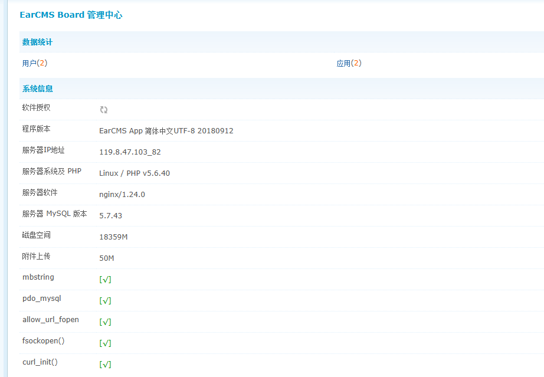
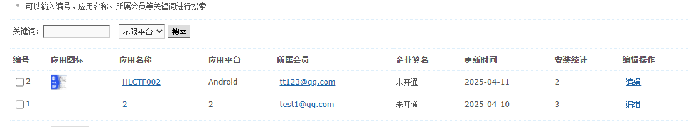
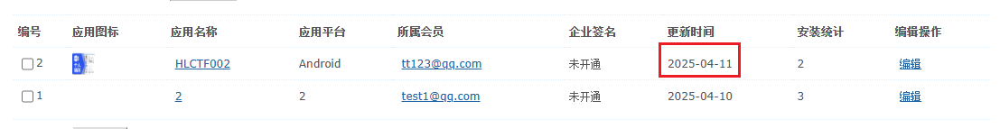
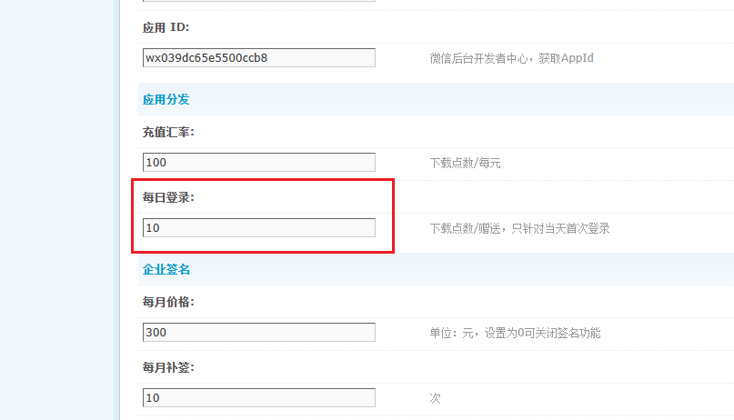
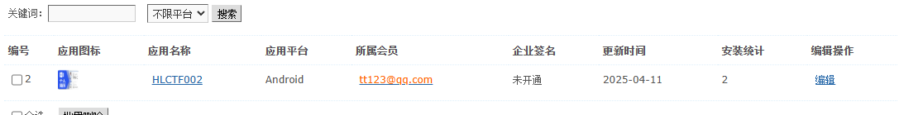

# 2025上海联赛个人赛

容器挂载密码：`a7#B!rW2mX@fP9$Lq3K^zHs&NdEyUt`

2025年4月经过警方不懈努力，破获了一起黑灰产案件，抓获案件嫌疑人周某、钱某，在其住所警方获取到了周某的个人手机1部、个人计算机1台和钱某的手机1部，同时警方远程固定了周某用于运维的云服务器1台、搭建网站的云服务器1台； 根据周某交代其搭建了部分网站用于非法牟利，钱某主要职责是推广周某的网站，配合拉拢投资受害者；根据其网站中的信息，警方联系到了其中一条业务线的受害人：张某，张某称其急于找工作，在某某书上进行联系，被人引导安装了“简历”修改的app，后续自己的证件照和通讯录信息被人获取，嫌疑人使用AI技术制作了张某的不雅视频，并要挟发送给其家人，为配合警方工作，受害人提供手机进行数据提取； 接下来,我们将深入分析该案相关的关键证据文件,揭开这个犯罪团伙的犯案事实！现对上述检材进行取证分析并在“答题系统”中作答。 
 

检材5：嫌疑人周某运维专用服务器	MD5	44616ba040c714e23332148b33b20f75	 

检材6：嫌疑人周某web网站服务器	MD5	170ec6365abacf332ccb75bb66637650

# 周某运维专用服务器

### 1. 请分析运维服务器其中CDN服务，cdn的版本号时多少

5.00 分

### 2. 请分析运维服务器其中CDN服务，cdn后台监听的端口是多少

10.00 分

### 3. 请分析运维服务器其中CDN服务，cdn的密码是多少

5.00 分

4. 请分析运维服务器其中CDN服务，cdn页面缓存的文件类型有多少个

10.00 分

已作答

5. 请分析运维服务器其中CDN服务，嫌疑人在cdn中配置网站的域名

10.00 分

已作答

6. 请分析运维服务器其中CDN服务，嫌疑人在cdn中配置网站源站的IP地址

10.00 分

已作答

7. 请分析运维服务器其中CDN服务，cdn中配置网站私钥的后四位

10.00 分

已作答

8. 请分析运维服务器中代理服务，openvpn服务开启了几个证书

15.00 分

已作答

9. 请分析运维服务器中代理服务，openvpn吊销过的证书序列号

15.00 分

已作答

10. 请分析运维服务器中接收服务，嫌疑人用于运行APK上传数据接收服务的程序名称为？

15.00 分

已作答

11. 请分析运维服务器中接收服务，该服务/程序所使用的端口号是多少

15.00 分

已作答

12. 请分析运维服务器中接收服务，该服务/程序的登录密码是多少

25.00 分

13. 请综合分析，嫌疑人周末用于解密上传文件的私钥为，仅回答后10位?

25.00 分

已作答

14. 结合其他检材分析，收到的密文信息中包含多少条联系人

40.00 分

15. 结合其他检材分析，收到的密文信息中第二位联系人的手机号码是多少

40.00 分

# 云服务器

### 1. 服务器操作系统版本号是多少？

答案：`22.04`

### 2. 请分析分发网站，涉案apk被下载过多少次?

答案：`2`

### 3. 请分析分发网站，涉案apk更新的时间？
答案:`2025-04-11`

### 4. 请分析分发网站，涉案apk图标文件名称是？

答案:`favicon.ico`

### 5. 请分析分发网站，注册用户初始的下载点数是多少？

答案:`10`

### 6. 请分析分发网站，后台配置的商户id是多少？

答案:`2`

``

### 7. 请分析涉案简历网站，该网站用于记录用户上传头像的目录为？（绝对路径）

答案:`/www/wwwroot/ff33333/ff/static/app`

### 8. 请分析涉案简历网站，受害人张某填写的个人邮箱是多少？

答案:`/www/wwwroot/ff33333/ff/static/app`

### 9. 请分析涉案简历网站，其前端的端口号是多少？

10.00 分

已作答

### 10. 请分析涉案简历网站，其配置后端接口的端口号是多少？

10.00 分

已作答

### 11. 请分析涉案简历网站，其默认配置的大模型名称是什么？

10.00 分

已作答

### 12. 服务器中云盘服务，用户数据存储的数据库名称

10.00 分

### 13. 请分析云盘服务，云盘分享的内部链接http://119.8.47.103:8081/f/56,对应的文件md5是多少

15.00 分

### 14. 请分析云盘服务，受害人收到的短信中提到的不雅图片在云盘中对应的文件名称

15.00 分

### 15. 请分析嫌疑人钱某推广的投资网站，数据库原始连接密码是

15.00 分

已作答

### 16. 嫌疑人钱某推广的投资网站以@gmail.com结尾的邮箱其中人数为

15.00 分

已作答

### 17. 嫌疑人钱某推广的投资网站中待处理的提款/提现金额为（EGP）

15.00 分

### 18. 嫌疑人钱某推广的投资网站的一级推荐奖金是？

15.00 分

### 19. 嫌疑人钱某的投资网站提款实际需缴纳多少的税？

15.00 分

### 20. 结合检材综合分析，老板的手机号是多少？

40.00 分

