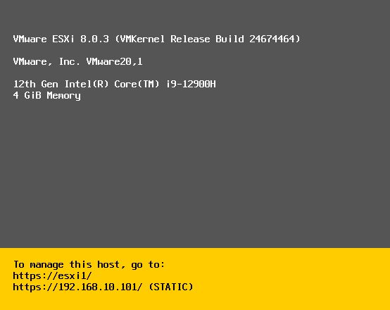
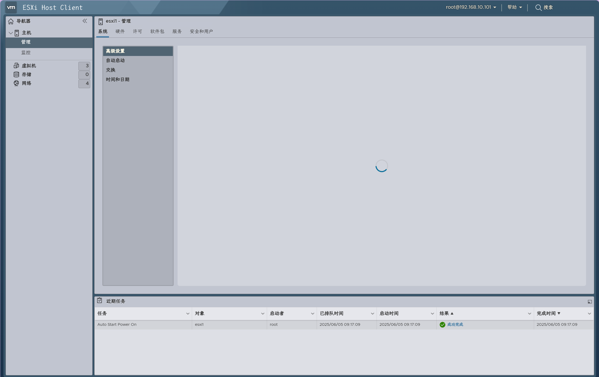
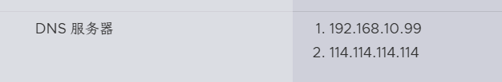

8.0.3

分析会议服务器，找出系统内核版本号？【标准格式：1.0.0】

分析会议服务器，找出会议服务器的IP地址？【标准格式：192.168.1.1】

192.168.10.101

分析会议服务器，找出服务器内设置的DNS地址？【标准格式：192.168.1.2】

1. 192.168.10.99

分析会议服务器，找出老会议系统所用数据库对外映射的端口号？【标准格式：1443】

分析会议服务器，找出老会议系统所用数据库root密码？【标准格式：admin】

分析会议服务器，找出老会议系统用户密码加密方式？【标准格式：md5】

分析会议服务器，找出老会议系统用户admin密码加密的盐值？【标准格式：字母大小写及数字组合】

分析会议服务器，找出老会议系统中共开过几次会议？【标准格式：1】

分析会议服务器，找出新会议系统包含几个容器？【标准格式：1】

分析会议服务器，找出新会议系统对外映射的http端口？【标准格式：1443】

分析会议服务器，找出新会议系统用于设置强密码的脚本名？【标准格式：shell.sh】

分析会议服务器，找出新会议系统会议协调服务密码的前6位？【标准格式：字母小写】

-----
服务器集群取证
分析技术人员电脑，找出集群管理服务器，并结合服务器进行分析，找出集群服务器内的集群名？【标准格式：Qax_Pgs】
找出集群中共有多少台虚拟机？【标准格式：1】
找出集群中vMotion所用的网段？【标准格式：192.168.1.0】
找出集群磁盘组内共存储了多少个iso镜像？【标准格式：1】
找出集群内“市场PC”虚拟机在磁盘组中存储的名称？【标准格式：abc123】
找出管理此集群的服务器vcsa的主机名？【标准格式：www.qianxin.com】
找出vcsa的版本号？【标准格式：1.0.0.00000】
找出vcsa中设置的时间服务器？【标准格式：ntp.ntp.com】
找出vcsa每天几点进行备份？【标准格式：08:00】
找出vcsa管理页面的端口号？【标准格式：1122】
找出vcsa服务器web client登录的账户名？【标准格式：xxx@xxx】
找出vcsa管理的服务器主机的系统版本号？【标准格式:0.0.0】
分析vcsa管理的服务器主机的文件系统类型？【标准格式:ntfs】
找出vSAN服务所对应的端口组名称？【标准格式：ABcd-eFGH】
接上题，该端口组上行端口数量？【标准格式：1】
找出vSAN集群许可密钥的前5位？【标准格式：ABC12】
找出vSAN集群类型？【标准格式：ABC】

虚拟机取证
分析集群内的虚拟机，找出该组织域名？【标准格式:baidu.com】
分析集群内的虚拟机，找出DNS服务器系统Build版本？【标准格式:18320】
分析集群内的虚拟机，找出DNS服务器系统初始安装时间？【标准格式: 2025-1-1, 00:00:00】
分析集群内的虚拟机，找出DNS服务器IP？【标准格式:1.1.1.1】
分析集群内的虚拟机，找出DNS服务器内自建了多少条DNS记录？【标准格式:100】
分析集群内的虚拟机，找出DNS服务器内，主机ftp对应的IP地址？【标准格式：192.168.1.0】
分析集群内的虚拟机，找出FTP服务器内2025-05-19 12:25:25上传的文件名？【标准格式：盘古石杯.doc】
分析集群内的虚拟机，找出FTP服务器限制访问的IP地址？【标准格式：192.168.1.0】
分析集群内的虚拟机，找出市场PC的磁盘大小？【标准格式:100G】
分析集群内的虚拟机，找出市场PC的系统build版本号？【标准格式:18320】
分析集群内的虚拟机，找出市场PC网卡MAC地址？【标准格式:字母小写】
分析集群内的虚拟机，找出市场PC内话术文件，给出SHA256的前六位？【标准格式:字母小写】
分析集群内的虚拟机，找出市场PC内用户SID的后4位？【标准格式:1000】
分析集群内的虚拟机，找出财务PC系统初始安装时间？【标准格式: 2025-1-1, 00:00:00】
分析集群内的虚拟机，找出财务PC的IP地址？【标准格式：192.168.1.0】
分析集群内的虚拟机，找出财务PC电脑内共保存了几个月的员工工资表？【标准格式：1】
分析集群内的虚拟机，找出员工“何燕”2025年2月的实发工资？【标准格式：10000.00】
分析集群内的虚拟机，找出该组织2025年5月所有人力成本？【标准格式：1000000.00】

网站服务器取证
分析会议服务器，找出系统内核版本号？【标准格式：1.0.0】
分析会议服务器，找出会议服务器的IP地址？【标准格式：192.168.1.1】
分析会议服务器，找出服务器内设置的DNS地址？【标准格式：192.168.1.2】
分析会议服务器，找出老会议系统所用数据库对外映射的端口号？【标准格式：1443】

分析会议服务器，找出老会议系统所用数据库root密码？【标准格式：admin】
分析会议服务器，找出老会议系统用户密码加密方式？【标准格式：md5】
分析会议服务器，找出老会议系统用户admin密码加密的盐值？【标准格式：字母大小写及数字组合】
分析会议服务器，找出老会议系统中共开过几次会议？【标准格式：1】
分析会议服务器，找出新会议系统包含几个容器？【标准格式：1】
分析会议服务器，找出新会议系统对外映射的http端口？【标准格式：1443】
分析会议服务器，找出新会议系统用于设置强密码的脚本名？【标准格式：shell.sh】
分析会议服务器，找出新会议系统会议协调服务密码的前6位？【标准格式：字母小写】
分析会议服务器，找出郝虎友的电话号码？【标准格式：13888888888】
分析会议服务器，找出该组织总公司位于那个国家？【标准格式：中国】
分析会议服务器，找出该组织中国公司财务部门负责人？【标准格式：郝虎友】
分析bocai网站中服务器使用的php版本时多少？【标准格式:1.1.1】
分析bocai网站中执行自动备份数据库的时间是？【标准格式:1点】
分析bocai网站中数据库备份脚本，“2027年6月”的备份密钥是多少？【标准格式:123456】
分析bocai网站中的备份数据库中，“充值0.41640026BTC”的用户id是什么？【标准格式:12345】
分析bocai网站中的备份数据库中，网站支付方式有几种？【标准格式:1】
分析bocai网站上有一个自毁程序，请问自毁程序的运行密钥是多少？【标准格式:asdfghjkio1234】
分析bocai网站上容器启动过程中运行的第一个程序是什么？【标准格式:aaaaaa-ssssssssss.jj】
分析bocai网站，管理员登陆密码的加密方法是什么？【标准格式:你好+你好suanfa1】
分析bocai网站，管理员登陆密码的盐值是多少？【标准格式:35Xp9LmBR2aQwE8sT0d】
分析bocai网站的后台管理登陆目录？【标准格式:zxcvb/qwery/ujnkmzcxvbnmqwertlkjhgf】
分析bocai网站源码，理解其多级分佣算法，并计算在一笔100元交易中，一个5级推荐链最多能获得多少佣金？【标准格式:10元】
分析bocai网站，签到奖励是多少？【标准格式:2.22RMB】
分析bocai网站，签到间隔时间是多久？【标准格式:23中文】
分析bocai网站，得到签到奖励的用户共有多少？【标准格式:23】
分析bocai网站，提现成功的用户有几个？【标准格式:23】

