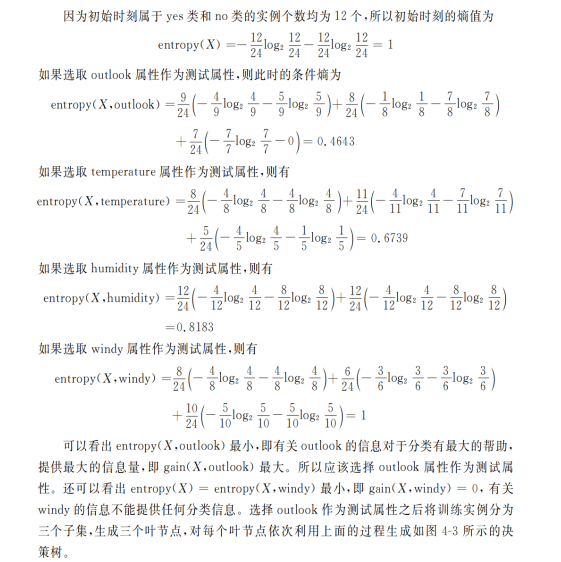
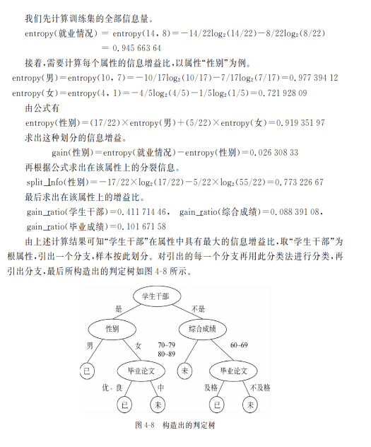
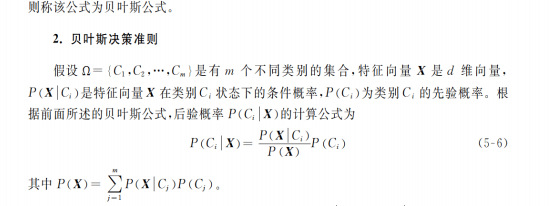
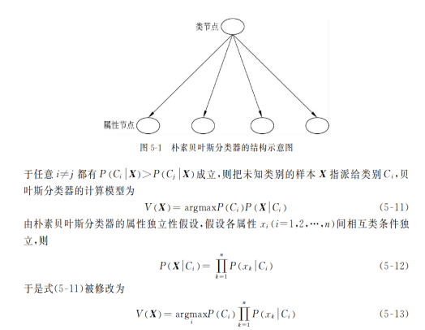
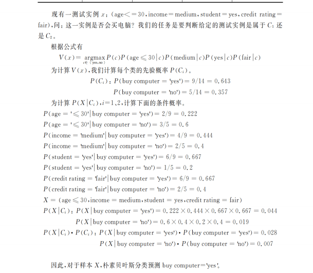
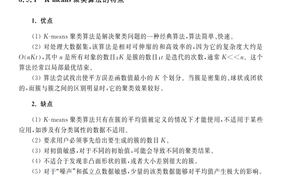

### 1. 数据挖掘应用

#### 一、金融领域

1. **信用评分与风险评估**
    
    - **背景**：金融机构在发放贷款或信用卡时，需要评估客户的信用风险。数据挖掘可以帮助分析客户的交易历史、收入、资产等多维度数据。
        
    - **应用**：通过构建信用评分模型，利用决策树、逻辑回归等算法，对客户进行信用评级。例如，根据客户过去的还款记录、消费行为等数据，预测其未来违约的可能性，从而决定是否批准贷款或信用卡申请，以及确定相应的信用额度。
        
2. **客户细分与精准营销**
    
    - **背景**：金融市场竞争激烈，金融机构需要深入了解客户需求，提供个性化的产品和服务。数据挖掘可以对客户进行细分，识别不同客户群体的特征和行为模式。
        
    - **应用**：基于客户的资产规模、投资偏好、交易频率等数据，将客户划分为不同的群体，如高净值客户、普通储蓄客户、频繁交易型客户等。针对不同群体，设计专属的金融产品和营销策略，提高营销效果和客户满意度。
        
3. **金融欺诈检测**
    
    - **背景**：金融欺诈活动如信用卡盗刷、保险欺诈等给金融机构带来巨大损失。数据挖掘可以通过分析交易数据、用户行为等，及时发现异常交易和欺诈行为。
        
    - **应用**：运用关联规则挖掘和异常检测算法，建立欺诈检测模型。例如，当信用卡交易出现与客户以往消费习惯不符的金额过大、异地消费频繁等情况时，系统及时发出警报，帮助金融机构采取措施阻止欺诈行为。
        

#### 二、零售领域

1. **商品推荐与个性化购物体验**
    
    - **背景**：零售企业拥有海量的交易数据和用户行为数据，如何利用这些数据为顾客提供个性化的商品推荐，提高顾客购买转化率和忠诚度是关键。
        
    - **应用**：采用协同过滤、关联规则等技术，分析顾客的购买历史、浏览行为、收藏商品等数据。例如，根据顾客经常购买的商品类别和品牌，推荐相关联的互补商品或新品。同时，利用数据挖掘优化商品陈列，通过分析顾客在门店内的行走路线和停留时间等数据，合理安排商品位置，提升购物体验。
        
2. **库存管理与需求预测**
    
    - **背景**：准确预测商品需求对于零售企业的库存管理至关重要。过多库存会造成资金占用和仓储成本增加，过少库存则会导致缺货损失。
        
    - **应用**：结合时间序列分析和机器学习算法，考虑季节、促销活动、市场趋势等因素，预测商品的销售量。例如，分析过去几年某商品在不同季节的销售数据，结合当前市场动态和促销计划，预测未来一段时间的需求，合理安排库存，降低库存成本。
        
3. **客户流失预测与客户挽留**
    
    - **背景**：在竞争激烈的零售市场中，客户流失是企业面临的重要问题。及时预测客户流失风险并采取挽留措施，有助于提高客户生命周期价值。
        
			    - **应用**：通过分析客户的购买频率、最近一次购买时间、投诉记录等数据，建立客户流失预测模型。例如，对于购买频率逐渐降低、长时间未购买且有过投诉记录的客户，提前进行针对性的营销活动，如提供优惠券、专属`礼品等，以挽留客户。
        

#### 三、医疗电信领域

1. **疾病预测与健康管理**
    
    - **背景**：医疗数据挖掘在疾病早期发现和预防方面具有巨大潜力。通过分析患者的病史、症状、检查结果等数据，可以预测疾病的发生风险。
        
    - **应用**：利用机器学习算法如随机森林、神经网络等，构建疾病预测模型。例如，分析患者的年龄、家族病史、生活习惯、体检指标等数据，预测患者患糖尿病、心血管疾病等慢性疾病的可能性。为高风险患者提供个性化的健康管理方案，包括饮食、运动建议和定期检查提醒。
        
2. **医疗费用预测与成本控制**
    
    - **背景**：医疗费用的合理预测有助于医疗机构优化资源配置，控制成本。同时，对于患者而言，提前了解可能的医疗费用也有助于其做出合理的医疗决策。
        
    - **应用**：基于患者的病情严重程度、治疗方案、住院天数等数据，建立医疗费用预测模型。例如，分析同类疾病患者在不同治疗阶段的费用数据，结合当前患者的治疗进展，预测后续可能产生的医疗费用，为医疗机构和患者提供参考。
        
3. **电信客户价值分析与服务优化**
    
    - **背景**：电信运营商拥有大量客户数据，包括通话记录、流量使用、套餐类型等。通过数据挖掘分析客户价值，可以优化服务策略，提高客户满意度和企业收益。
        
    - **应用**：采用RFM（最近一次消费、消费频率、消费金额）模型等方法，评估客户的价值。例如，对于高价值客户，提供优先客服、定制化套餐升级等服务；对于低价值客户，通过推荐适合的基础套餐和增值服务，提升其价值贡献。同时，分析客户的投诉数据和业务使用体验反馈，及时优化网络服务和业务流程。

### 2. 数据挖掘功能

 1. **特征化（Characterization）**  
   对数据集进行描述性总结，提取主要特征或属性。通过统计量
   
   （如均值、中位数、标准差）或维度约简，概括数据的集中趋势、分布及结构，帮助理解数据基本信息。

2. **区分（Discrimination）**  
	是将目标类对象的一般特性与一个或多个对比类对象的一般特性进行比较
   找出不同数据集或类别间的显著差异。

3. **关联（Association）**  
   发现数据中变量间的有趣关系，通常通过关联规则（如市场篮子分析中的“购买A→购买B”）。基于支持度和置信度等指标，挖掘频繁项集之间的关联模式。

4. **分类（Classification）**  
   监督学习任务，利用带标签的训练数据建立模型，将新样本分配到预定义类别中。常见算法包括决策树、支持向量机等，目标是预测新实例的类别标签。

5. **预测（Prediction）**  
   基于历史数据建立模型，预测未来数值或趋势。例如预测房价或销售量，常用方法包括回归分析、时间序列建模等，强调数值型结果的准确性。

6. **聚类（Clustering）**  
   无监督学习方法，将数据分组成相似性高的簇。如K-means、K中心，通过相似性度量（如欧氏距离）划分数据，揭示数据的内在结构。

7. **演变分析（Evolution Analysis）**  
   研究数据随时间的变化规律，分析趋势、周期性或动态模式。例如分析用户行为的长期变化或市场趋势，常用时间序列分析或动态数据挖掘技术。

**关键区别**：  
- **区分**侧重于找出不同类间的差异，而**分类**是分配标签；  
- **关联**关注变量间关系，**预测**侧重数值结果；  
- **特征化**是数据概括，**聚类**是结构发现。

### 3. 数据预处理

分箱

数据缺省

### 4. 各个数据规范化

| 方法          | 值域                         | 适用场景           |
| :---------- | :------------------------- | :------------- |
| 最小-最大规范化    | `[0, 1]` 或 `[-1, 1]`       | 需明确范围（如神经网络输入） |
| z分数规范化      | `(-∞, +∞)`（实际集中于`[-3, 3]`） | 正态分布假设（如线性回归）  |
| z分数规范化（MAD） | `(-∞, +∞)`（实际值域更宽）         | 鲁棒性要求高的场景      |
| 小数定标规范化     | `[-1, 1]` 或更小              | 快速缩放需求         |
|             |                            |                |
### 5. 关联规则

### 6. 决策树

ID3&C4.5

### 7. 贝叶斯

### 8. BP

### 9. 支持向量机、核函数分类&SOM网络结构

简述**自组织映射（SOM）神经网络的基本构造及工作原理**

### 10. K聚类家族

