算法公式

一章一道

## 第一章

### 某主观题
金融应用
零售业务
医疗电信

## 第二章

### 数据挖掘功能

定义下列数据挖掘功能：特征化、区分、关联、分类、预测、聚类和演变分析。

1. **特征化（Characterization）**  
   对数据集进行描述性总结，提取主要特征或属性。通过统计量（如均值、中位数、标准差）或维度约简，概括数据的集中趋势、分布及结构，帮助理解数据基本信息。

2. **区分（Discrimination）**  
	是将目标类对象的一般特性与一个或多个对比类对象的一般特性进行比较
   找出不同数据集或类别间的显著差异。

3. **关联（Association）**  
   发现数据中变量间的有趣关系，通常通过关联规则（如市场篮子分析中的“购买A→购买B”）。基于支持度和置信度等指标，挖掘频繁项集之间的关联模式。

4. **分类（Classification）**  
   监督学习任务，利用带标签的训练数据建立模型，将新样本分配到预定义类别中。常见算法包括决策树、支持向量机等，目标是预测新实例的类别标签。

5. **预测（Prediction）**  
   基于历史数据建立模型，预测未来数值或趋势。例如预测房价或销售量，常用方法包括回归分析、时间序列建模等，强调数值型结果的准确性。

6. **聚类（Clustering）**  
   无监督学习方法，将数据分组成相似性高的簇。如K-means、K中心，通过相似性度量（如欧氏距离）划分数据，揭示数据的内在结构。

7. **演变分析（Evolution Analysis）**  
   研究数据随时间的变化规律，分析趋势、周期性或动态模式。例如分析用户行为的长期变化或市场趋势，常用时间序列分析或动态数据挖掘技术。

**关键区别**：  
- **区分**侧重于找出不同类间的差异，而**分类**是分配标签；  
- **关联**关注变量间关系，**预测**侧重数值结果；  
- **特征化**是数据概括，**聚类**是结构发现。

### 分箱

1. **等宽分箱**
	等宽分箱也叫等距分箱，它将数据从最小值到最大值之间，平均分为 N 等份。比如前面说的年龄数据，最大值为75，最小值为3，如果试图将数据分为4份，这时候每个区间的长度就是：(75-3)/4 = 18。切分后的边界就是：21，39，47，75（amin + W, amin + 2W, …, amin +(N-1)\*W）

2. **等频(等深)分箱**
	等频分箱是将数据的值由大到小排列后，将数据分成N等份，保证每份中数据的个数是一样的。同样是年龄这个例子，我们首先将数据从大到小排列，这个特征一共有12个数据值，我们依然希望把数据分为4个箱，这时候等频分箱中每个箱就有3个数据。

#### (单选题, 10分)已经十二个销售价格记录组已经排序如下:6, 11, 12, 14, 16, 36, 51, 56, 73, 93, 205, 216 使用如下每种方法将它们划分成四个箱。等频(等深)划分时,16在第几个箱子内?( )

- A. 第1个
- B. 第2个
- C. 第4个
- D. 第3个

> 我的答案: !!B:第2个;!!

#### (单选题, 10分)已经十二个销售价格记录组已经排序如下:6, 11, 12, 14, 16, 36, 51, 56, 73, 93, 205, 216 使用如下每种方法将它们划分成四个箱。等宽划分时,16在第几个箱子内?( )

- A. 第4个
- B. 第2个
- C. 第3个
- D. 第1个

> 我的答案: !!D:第1个箱子;!!

### 数据缺省

#### (单选题, 10分)数据挖掘过程中,某些元组经常为空值,下面哪个方法不是常见的处理方法:( )

- A. 模型预测
- B. 人工填写缺省值
- C. 忽略元组
- D. 属性的平均值

> 我的答案: !!A:模型预测;!!

处理缺失值是一个非常重要的数据预处理步骤。缺失值处理方法的选择在很大程度上取决于数据集的特性、缺失数据的数量以及分析的目标。以下是一些常用的处理缺失值的方法：

#### 一、原因分析
- **随机缺失（MAR）**：缺失值与观测到的变量有关，而与未观测到的变量无关。例如，高收入人群可能更倾向于不透露其收入，但已知他们的职业等其他信息。
- **完全随机缺失（MCAR）**：缺失值的发生与任何变量（包括缺失变量本身）都无关。例如，数据收集过程中随机出现的设备故障导致某些数据缺失。
- **非随机缺失（MNAR）**：缺失值与缺失变量本身有关。例如，健康状况差的人更可能不报告其健康状况。

#### 二、处理方法
- **删除法**
    - **行删除（Listwise Deletion）**：删除包含任何缺失值的整个记录。此方法简单，但可能导致数据量显著减少，尤其是当缺失值分布在多个记录中时，可能造成信息大量丢失。
    - **列删除（Pairwise Deletion）**：仅删除缺失值所在的特定列。适用于某列缺失值过多且该列对分析不太重要时，但可能丢失某些变量的信息。

- **填充法**
    - **均值/中位数/众数填充**：用该属性的均值、中位数或众数来填充缺失值。此方法简单易行，但可能会减少数据的变异性，引入偏差，尤其当数据非正态分布时。
    - **固定值填充**：用一个特定的固定值（如0、-1等）填充缺失值，表示缺失状态，但需谨慎使用，以免影响分析结果。
    - **基于模型的填充（如回归填充）**：利用其他相关变量建立模型（如线性回归、决策树等），预测并填充缺失值。此方法可利用变量间的相关性，提高填充准确性，但模型假设可能引入偏差。
    - **K近邻（KNN）填充**：根据K个最近邻样本的属性值进行填充，适用于数据存在局部相似性的情况，但计算复杂度较高，且K值选择较主观。

- **插补法**
    - **热卡插补（Hot Deck Imputation）**：用相似样本的观测值插补缺失值，相似性基于某些关键变量，保留数据分布特性，但需定义合适的相似性度量。
    - **多重插补（Multiple Imputation）**：创建多个插补数据集，每个数据集用不同方法填充缺失值，然后综合分析结果，考虑缺失值的不确定性，提高分析的稳健性。

### 数据规范化

#### 最小最大规范化
将属性数据按比例缩放，使之落入一个小的特定区间

### 总结例题（主观题答案写纸上）

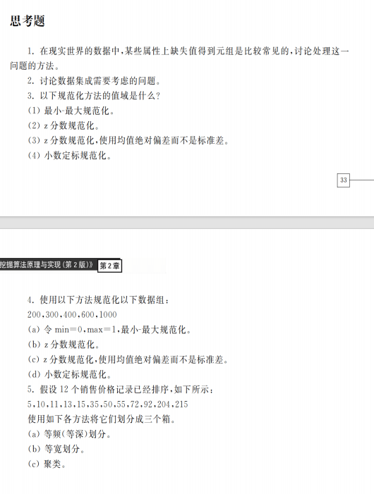

#### 3

| 方法          | 值域                         | 适用场景           |
| :---------- | :------------------------- | :------------- |
| 最小-最大规范化    | `[0, 1]` 或 `[-1, 1]`       | 需明确范围（如神经网络输入） |
| z分数规范化      | `(-∞, +∞)`（实际集中于`[-3, 3]`） | 正态分布假设（如线性回归）  |
| z分数规范化（MAD） | `(-∞, +∞)`（实际值域更宽）         | 鲁棒性要求高的场景      |
| 小数定标规范化     | `[-1, 1]` 或更小              | 快速缩放需求         |

#### 4

对应先写公式

##### (a) 最小-最大规范化 (min=0, max=1)

**公式**：  
\[
$x' = \frac{x - \min(X)}{\max(X) - \min(X)}$
\]

**计算过程**：  
- 最小值 \(\min(X) = 200\)
- 最大值 \(\max(X) = 1000\)
- 范围 \(\max(X) - \min(X) = 800\)

规范化的结果见下表：

| 原始值 | 规范化后值 |
|-------|-----------|
| 200   | 0.000     |
| 300   | 0.125     |
| 400   | 0.250     |
| 600   | 0.500     |
| 1000  | 1.000     |

##### (b) z分数规范化

**公式**：  
$x' = \frac{x - \mu}{\sigma}$

**计算过程**：  
- 均值 $\mu = \frac{200 + 30 +400 + 600 + 1000}{5} = 500$
- 标准差 \($\sigma = \sqrt{\frac{(200-500)^2 + (300-500)^2 + (400-500)^2 + (600-500)^2 + (1000-500)^2}{5}} \approx 264.58$\)

规范化的结果见下表：

| 原始值 | 规范化后值 |
|-------|-----------|
| 200   | -1.134    |
| 300   | -0.756    |
| 400   | -0.378    |
| 600   | 0.378     |
| 1000  | 1.891     |

##### (c) z分数规范化（均值绝对偏差）

**公式**：  

$x' = \frac{x - \mu}{\text{MAD}}$

**计算过程**：  
- 均值 \($\mu = 500$)
- 均值绝对偏差 (MAD) $\text{MAD} = \frac{|200-500| + |300-500| + |400-500| + |600-500| + |1000-500|}{5} = 240$

规范化的结果见下表：

| 原始值 | 规范化后值 |
|-------|-----------|
| 200   | -1.250    |
| 300   | -0.833    |
| 400   | -0.417    |
| 600   | 0.417     |
| 1000  | 2.083     |

##### (d) 小数定标规范化

**公式**：  
$$
x' = \frac{x}{10^j}
$$

**计算过程**：  
- 最大绝对值为 1000，故 \(j = 3\)（即除以 1000）

规范化的结果见下表：

| 原始值 | 规范化后值 |
|-------|-----------|
| 200   | 0.200     |
| 300   | 0.300     |
| 400   | 0.400     |
| 600   | 0.600     |
| 1000  | 1.000     |

##### 总结

| 原始值 | (a) 最小-最大 | (b z)分数 | (c) z分数 (MAD) | (d) 小数定标 |
|-------|---------------|-----------|-----------------|--------------|
| 200   | 0.000         | -1.134    | -1.250          | 0.200        |
| 300   | 0.125         | -0.756    | -0.833          | 0.300        |
| 400   | 0.250         | -0.378    | -0.417          | 0.400        |
| 600   | 0.500         | 0.378     | 0.417           | 0.600        |
| 1000  | 1.000         | 1.891     | 2.083           | 1.000        |

#### 5

给定数据集（5,10,11,13,15,35,50,55,72,92,204,215）

##### (a) 等频（等深）划分

 **方法**：将数据集等分为三个箱，每个箱包含相同数量的数据点（共12个数据点，每个箱4个）。
- **箱1**：5,10,11,13
- **箱2**：15,35,50,55
- **箱3**：72,92,204,215

##### (b) 等宽划分

 **方法**：将数据范围等分为三个宽度相同的箱。
- 数据范围：215-5=210，箱宽=210/3=70。
- **箱1**：5-75（5,10,11,13,15,35,50,55,72）
- **箱2**：76-145（92）
- **箱3**：146-215（204,215）

##### (c) 聚类划分

 **方法**：根据数据的自然分布划分为三个箱，使用K-Means聚类（K=3）。
- **初始化**：随机选择初始中心（假设为5,72,215）。
- **第一次迭代**：计算每个点与中心的距离，划分到最近的中心。
  - **箱1**：5,10,11,13,15（中心更新为10.8）
  - **箱2**：35,50,55,72（中心更新为53）
  - **箱3**：92,204,215（中心更新为170.3）
- **第二次迭代**：重新计算距离并调整箱。
  - **箱1**：5,10,11,13,15（中心稳定为10.8）
  - **箱2**：35,50,55,72（中心稳定为53）
  - **箱3**：92,204,215（中心稳定为170.3）

##### 总结对比s

| 箱1数据     | 箱2数据          |    箱3数据     |               |
| -------- | ------------- | :---------: | :-----------: |
| **等频划分** | 5,10,11,13    | 15,35,50,55 | 72,92,204,215 |
| **等宽划分** | 5-75（9个数据）    | 76-145（无数据） | 146-215（3个数据） |
| **聚类划分** | 5,10,11,13,15 | 35,50,55,72 |  92,204,215   |

- **等频划分**适合保持每个箱的数据量相同，但可能忽略数据分布。
- **等宽划分**适合强调数值范围的均匀性，但可能导致部分箱为空或数据量差异大。
- **聚类划分**根据数据的实际分布划分，适合发现数据的自然聚类结构，但需选择合适的聚类算法和初始中心。

-----
## 第三章关联规则挖掘
### 关联规则

#### 基础

1. **Support（支持度）**：表示某个项集出现的频率，也就是包含该项集的交易数与总交易数的比例。 
2. **Confidence（置信度）：** 表示当A项出现时B项同时出现的频率，记作{A→B}。换言之，置信度指同时包含A项和B项的交易数与包含A项的交易数之比。  
3. **Lift（提升度）：** 指A项和B项一同出现的频率，但同时要考虑这两项各自出现的频率。 
	提升度反映了关联规则中的A与B的相关性，提升度>1且越高表明正相关性越高，提升度<1且越低表明负相关性越高，提升度=1表明没有相关性。负值，商品之间具有相互排斥的作用。
#### Apriori算法

频繁自己寻找过程

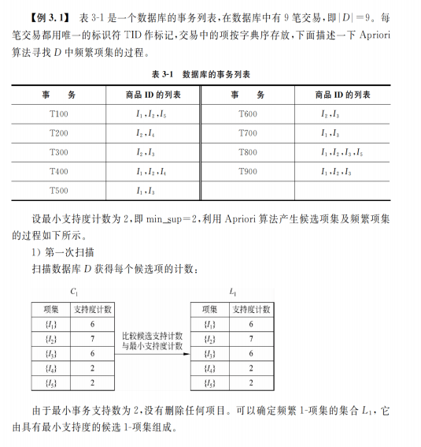

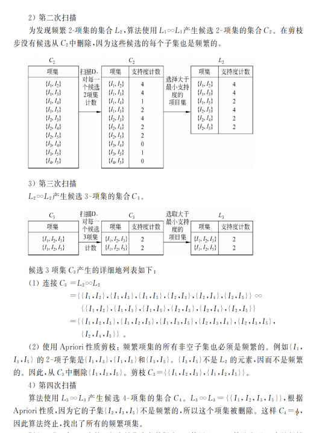

## 第四章决策树

### 基础

#### 熵

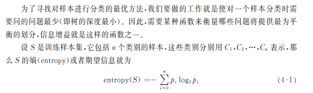

#### 信息增益

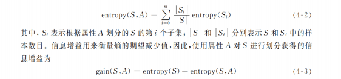

#### 信息增益率

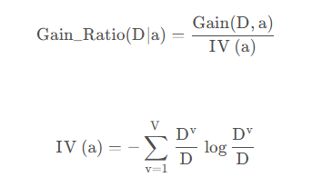

1. Gain_Ratio 表示信息增益率
2. IV 表示特征的信息熵
3. 特征的信息增益 ➗ 特征的信息熵

### ID3

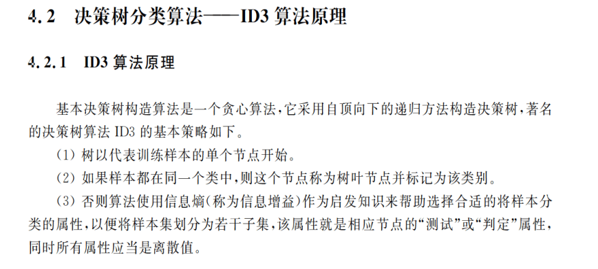

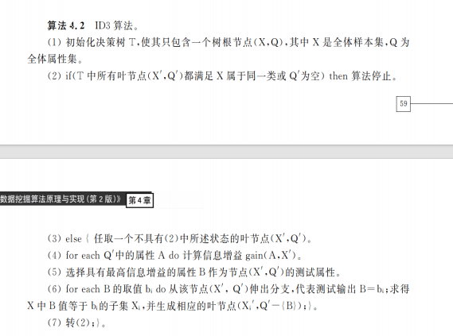

### C4.5

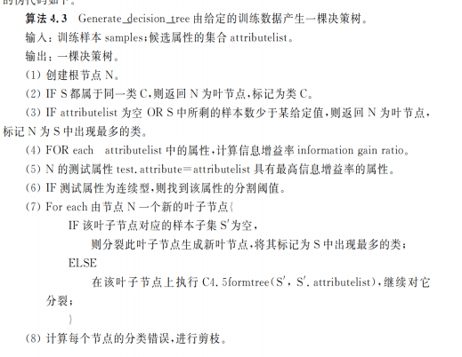

#### 增益比例

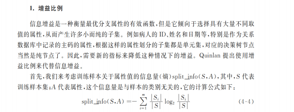

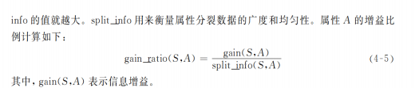

实际就是信息增益率

### 各个优缺点

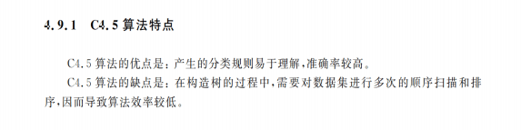

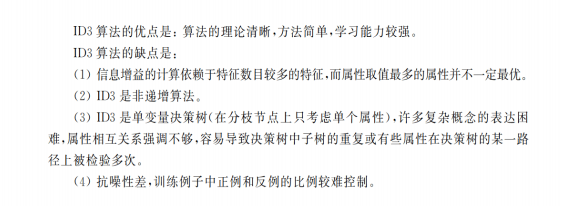

### 总结回顾
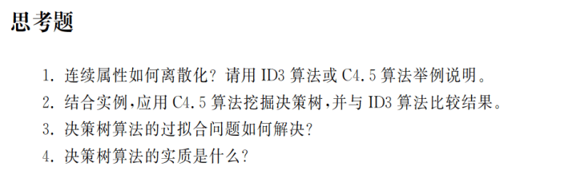

#### 问题3：决策树算法的过拟合问题如何解决？

**解决方法**：

1. **预剪枝（Pre-pruning）**：
    
    - 在树生长过程中提前停止分裂。例如，当信息增益小于阈值（如0.1）或节点样本数少于最小值时停止。
        
    - 优点：减少计算量；缺点：可能过早终止，遗漏重要结构。
        
2. **后剪枝（Post-pruning）**：
    
    - 先生成完整决策树，再自底向上剪枝。例如，用成本复杂度剪枝（CCP）或悲观剪枝。
        
    - 优点：保留更多结构信息；缺点：计算开销较大。
        
3. **正则化参数**：
    
    - 设置最大树深度、最小叶节点样本数（如min_samples_leaf=5）限制树的复杂度。
        
4. **交叉验证**：
    
    - 使用k折交叉验证调整树的深度，选择泛化误差最小的模型。
        

---

#### 问题4：决策树算法的实质是什么？

**实质**：  
决策树是一种基于**贪心算法**的监督学习方法，通过递归划分特征空间构建树结构。其核心思想包括：

1. **特征选择**：每次选择最优特征（如信息增益、增益率、基尼系数）进行分裂，使子集纯度最大化。
    
2. **分层决策**：模拟人类决策过程，通过一系列规则（if-then）对实例分类。
    
3. **可解释性**：树结构直观易懂，适合业务场景分析。
    
4. **非参数模型**：不假设数据分布，适应性广，但易受噪声影响导致过拟合。
    

**局限性**：

- 对小数据集或噪声敏感，易过拟合。
    
- 贪心策略可能导致局部最优而非全局最优。

## 第五章贝叶斯算法

### 准则公式

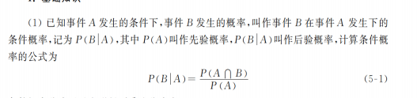

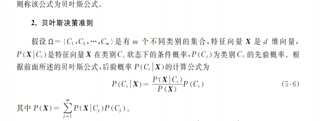

### 类似题10'

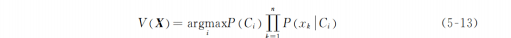

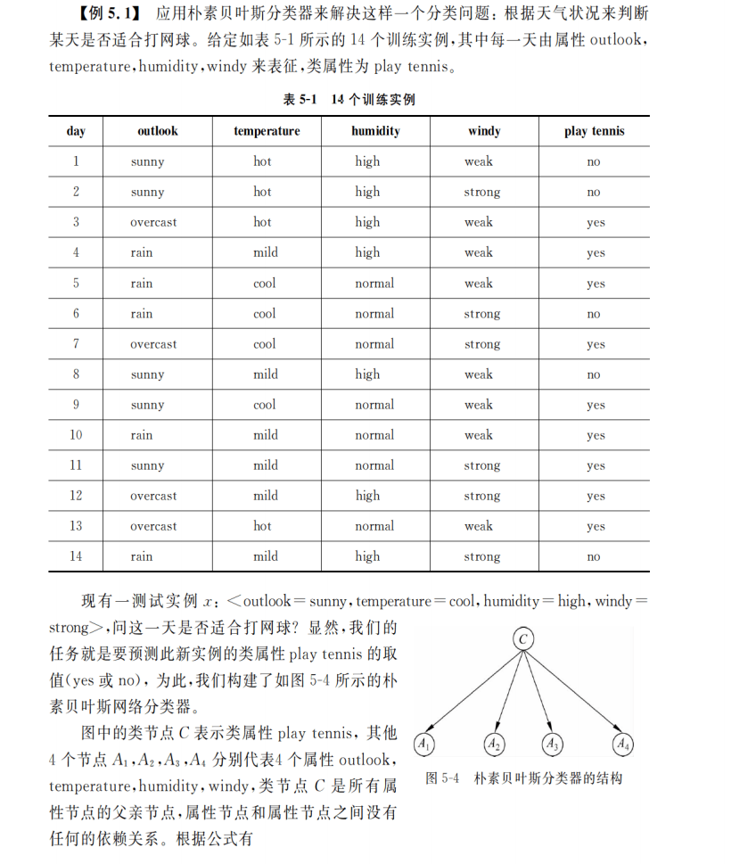

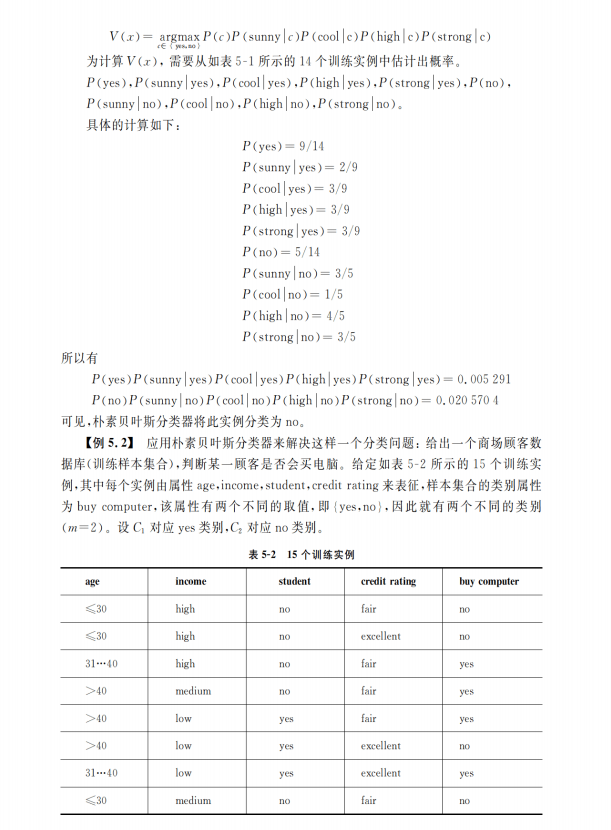

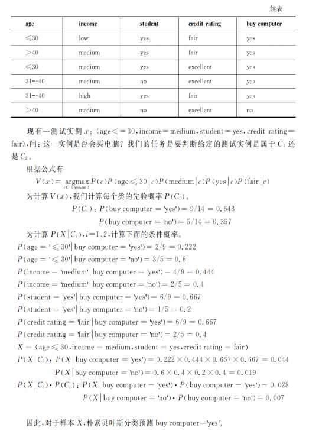

### 总结回顾

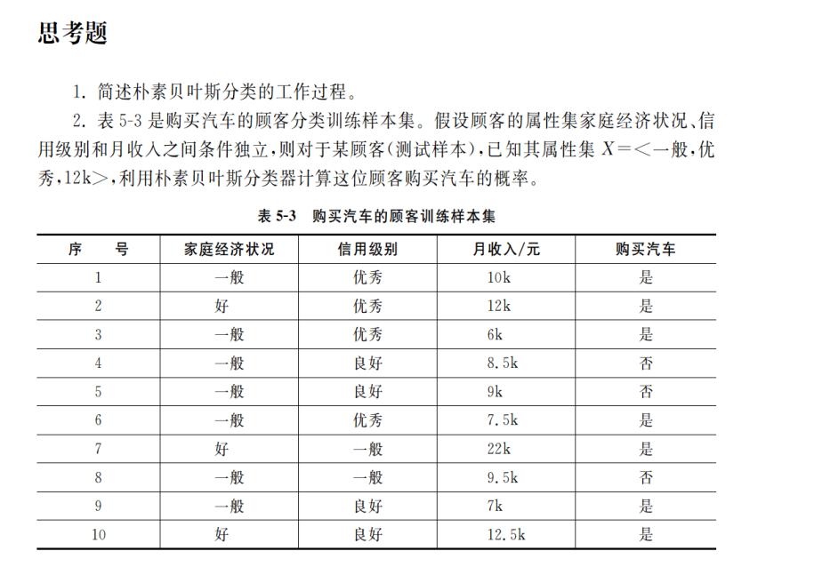

#### 1. 朴素贝叶斯分类的工作过程

- **基于贝叶斯定理**：利用先验概率和似然概率，计算后验概率 \($P(\text{类别}|\text{属性})$\)，选择后验概率最大的类别进行分类。
- **假设属性独立**：各属性之间相互独立，简化了概率计算过程。
- **训练阶段**：
    - 从训练数据中估计先验概率 \($P(\text{类别})$\)。
    - 计算条件概率 \($P(\text{属性}|\text{类别})$\)
- **预测阶段**：
    - 对于新样本，计算其属于各类别的后验概率。
    - 选择概率最大的类别作为预测结果。

#### 2. 顾客购买汽车概率的计算

**表格分析**：

表5-3的10个训练样本中：
- 购买汽车为“是”的有6个样本。
- 购买汽车为“否”的有4个样本。

**先验概率计算**：
- \($P(\text{是}) = \frac{6}{10} = 0.6$\)
- \($P(\text{否}) = \frac{4}{10} = 0.4$\)

**条件概率计算（测试样本X=<一般，优秀，12k>）**：
- 家庭经济状况为“一般”：
    - \($P(\text{一般}|\text{是}) = \frac{4}{6} \approx 0.667$\)
    - \($P(\text{一般}|\text{否}) = \frac{3}{4} =0.75$\)
- 信用级别为“优秀”：
    - \($P(\text{优秀}|\text{是}) = \frac{4}{6} \approx 0.667$\)
    - \($P(\text{优秀}|\text{否}) = \frac{0}{4} = 0.0$\)
- 月收入为“12k”：
    - 收入分组：将“12k”归入相近区间（如10k和12k之间）。
    - \($P(\text{12k}|\text{是}) = \frac{2}{6} \approx 0.333$\)
    - \($P(\text{12k}|\text{否}) = \frac{1}{4} = 0.25$\)

**后验概率计算**：
- \($P(\text{是}|X) = P(\text{是}) \times P(\text{一般}|\text{是}) \times P(\text{优秀}|\text{是}) \times P(\text{12k}|\text{是}) \approx 0.6 \times 0.667 \times 0.667 \times 0.333 \approx 0.0888$\)
- \($P(\text{否}|X) = P(\text{否}) \times P(\text{一般}|\text{否}) \times P(\text{优秀}|\text{否}) \times P(\text{12k}|\text{否}) \approx 0.4 \times 0.75 \times 0.0 \times 0.25 = 0.0$\)

根据朴素贝叶斯分类器的计算，这位顾客购买汽车的概率为 \(0.0888\)，不购买的概率为 \(0.0\)。因此，预测这位顾客会购买汽车。

## 第六章人工神经网络

### BP网络结构P126

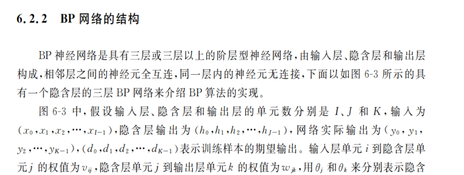

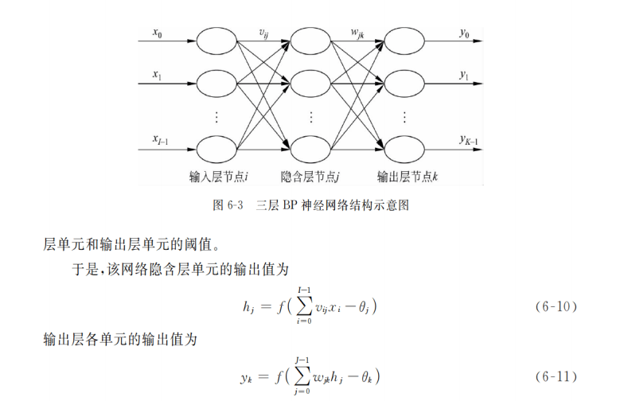

### BP算法描述

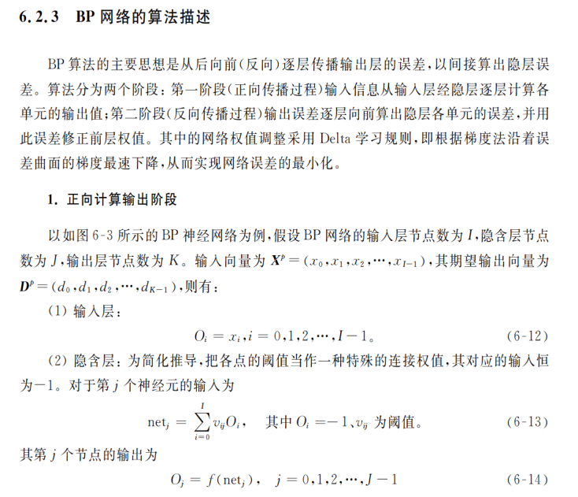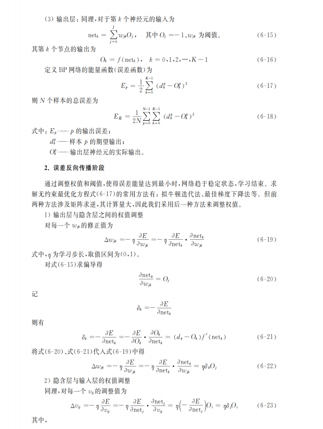

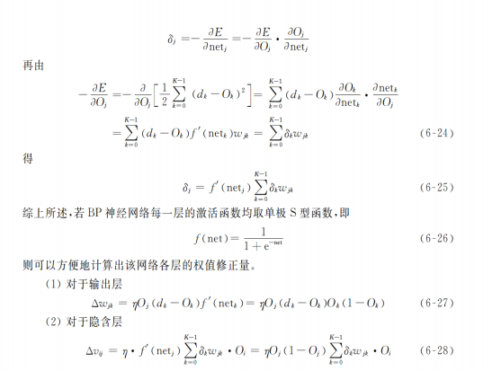

$E=(a−x)^2$

> BP神经网络采用Delta规则学习,Delta规则本质上是梯度下降法,是一种局部最优的算法。( )

### 总结回顾

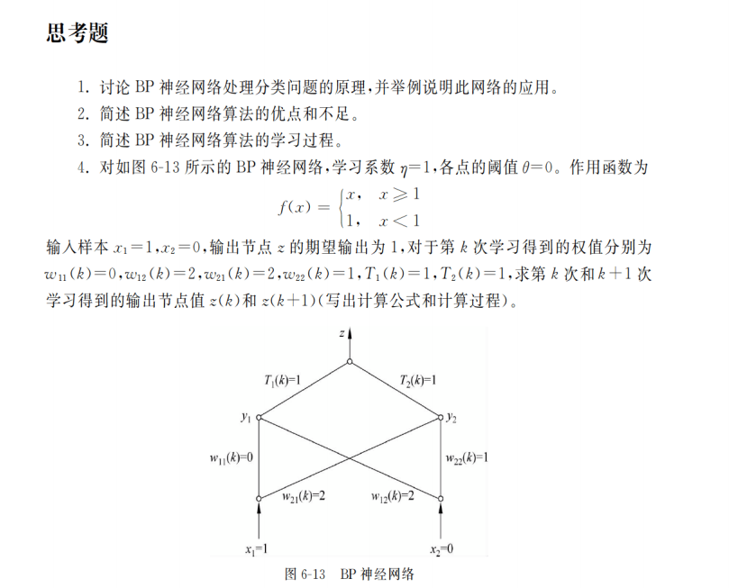

## 第七章支持向量机

### 图7.3会画

线性可分

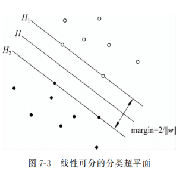

### 公式7.9-7.13

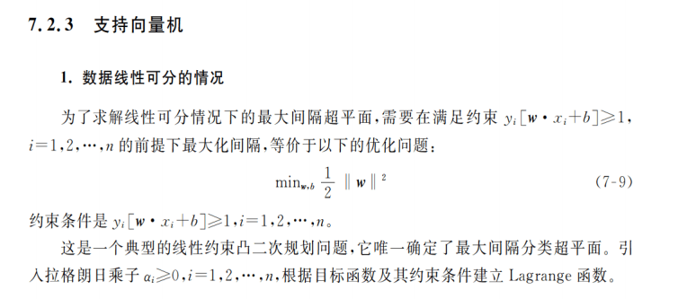

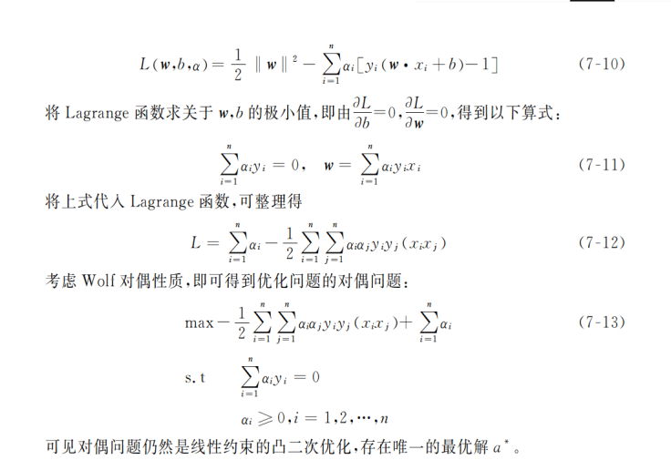

### 核函数分类

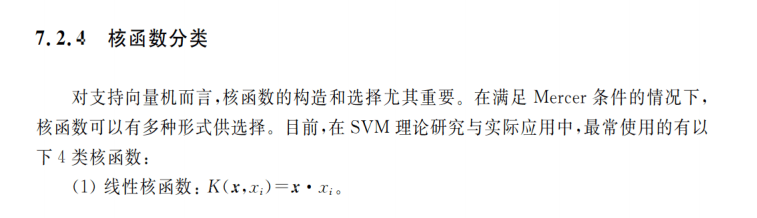

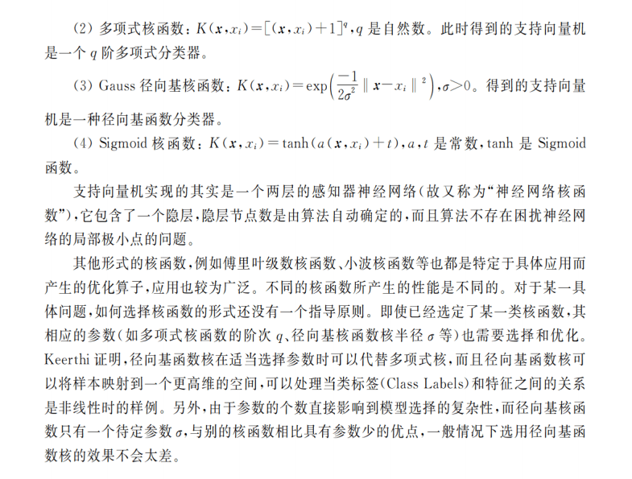

### 总结回顾

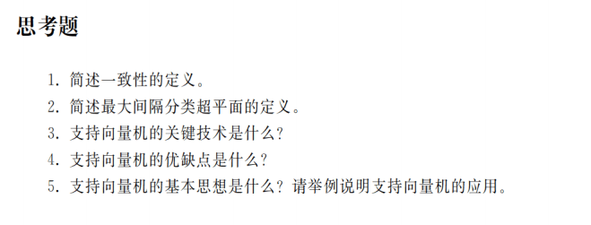

,
## 第八章K-means算法

### Kmeans框架

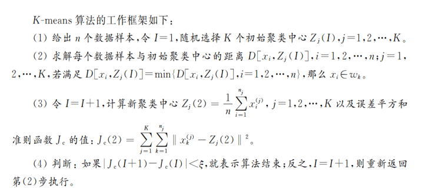

### 例题8.1

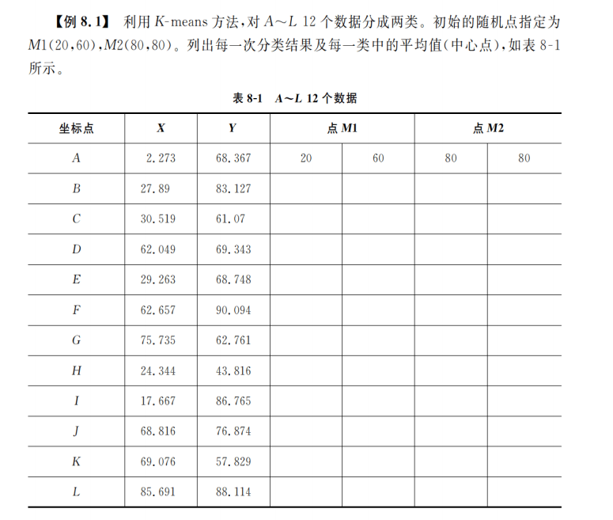

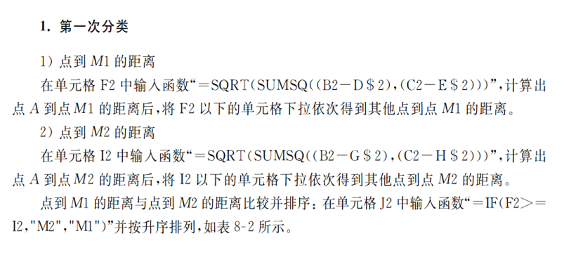

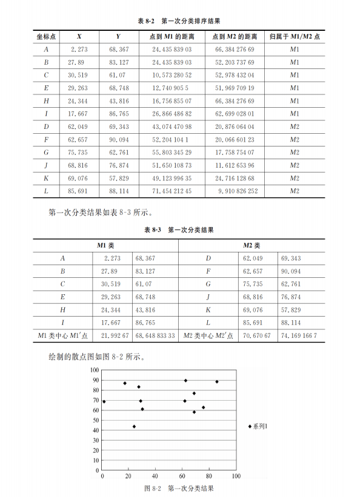

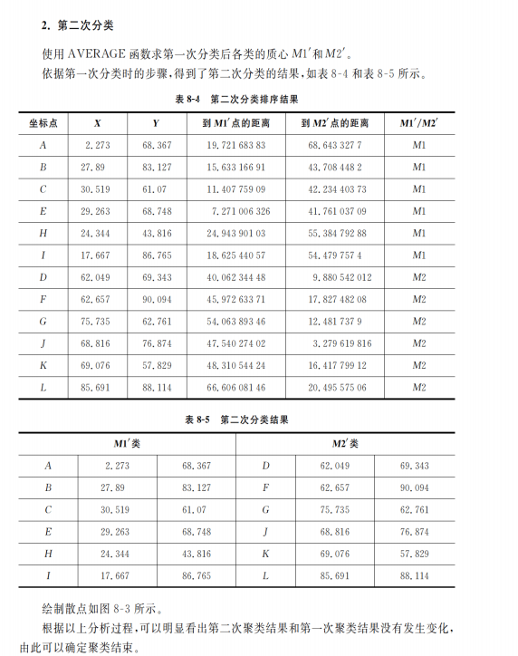

### 总结回顾

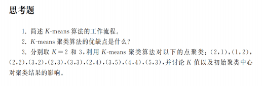

1. **K-means 算法工作流程** ：

     * **初始化** ：随机选择 K 个数据点作为初始聚类中心。
     * **分配样本到最近的簇** ：对于每个样本点，根据距离（通常是欧氏距离）将其分配到最近的聚类中心所在的簇。
     * **更新聚类中心** ：对每个簇，重新计算该簇中所有样本点的均值，将均值作为新的聚类中心。
     * **重复步骤 2 和 3** ：直到聚类中心不再发生变化（或变化小于某个阈值），或者达到预设的最大迭代次数。

  2. **K-means 聚类算法的优缺点** ：

     * **优点** ：
       * 原理简单，容易实现。
       * 计算效率高，适合处理大规模数据集。
       * 聚类结果易于解释。

     * **缺点** ：
       * 需要事先指定聚类数目 K，而 K 的选择往往比较困难，不合适的 K 值会导致聚类效果不佳。
       * 对初始聚类中心敏感，可能出现局部最优解。
       * 对噪声和离群点比较敏感，因为它们会明显影响聚类中心的计算。
       * 对于非球形或大小、密度差异较大的簇，聚类效果可能不理想。

  3. **取 K=2 和 K=3 的聚类结果及影响分析** ：

     * **当 K=2 时** ：
       * 随机初始化两个聚类中心，假设为 (2,1) 和 (5,3)。
       * 计算每个点到这两个中心的距离，并分配到最近的簇。例如，点 (1,2) 到 (2,1) 的距离为 \($\sqrt{(1 - 2)^2 + (2 - 1)^2} = \sqrt{2}$\)，到 (5,3) 的距离为 \($\sqrt{(1 - 5)^2 + (2 - 3)^2} = \sqrt{17}$\)，所以将 (1,2) 分配到第一个簇。
       * 更新聚类中心。对于第一个簇中的点 (2,1)、(1,2)、(2,2)，新的聚类中心为 \($(\frac{2 + 1 + 2}{3}, \frac{1 + 2 + 2}{3}) = (\frac{5}{3}, \frac{5}{3})$\)。对于第二个簇中的点 (3,2)、(2,3)、(3,3)、(2,4)、(3,5)、(4,4)、(5,3)，新的聚类中心为 \($(\frac{3 + 2 + 3 + 2 + 3 + 4 + 5}{7}, \frac{2 + 3 + 3 + 4 + 5 + 4 + 3}{7}) = (\frac{22}{7}, \frac{24}{7})$\)。
       * 重复上述步骤，直到聚类中心不再变化。最终可能会得到两个簇，一个包含较为左侧下方的点，另一个包含右侧上方的点。

     * **当 K=3 时** ：
       * 随机初始化三个聚类中心，假设为 (2,1)、(3,3) 和 (5,3)。
       * 通过类似的方法分配点到最近的簇并更新聚类中心。可能会得到三个簇，分别包含不同区域的点。

     * **讨论** ：
       * **K 值的影响** ：K 值的选择对聚类结果有显著影响。较小的 K 值可能导致聚类结果过于粗略，合并了不同特征的点；较大的 K 值可能使簇过于细碎，增加噪声敏感性。例如，对于该数据集，K=2 可能将点分为两大区域，而 K=3 可能划分出更细致的结构。
       * **初始聚类中心的影响** ：不同的初始聚类中心可能导致不同的最终聚类结果。如果初始中心选择不当，算法可能收敛到局部最优解。例如，初始中心如果集中在某一区域，可能会使一些簇的划分不准确，需要多次运行算法并选择较好的结果。

## 第九章K-中心

### 算法描述

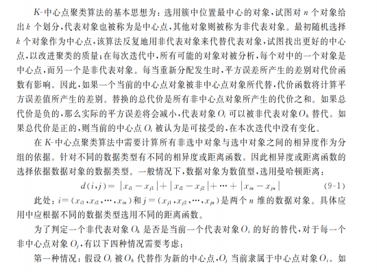

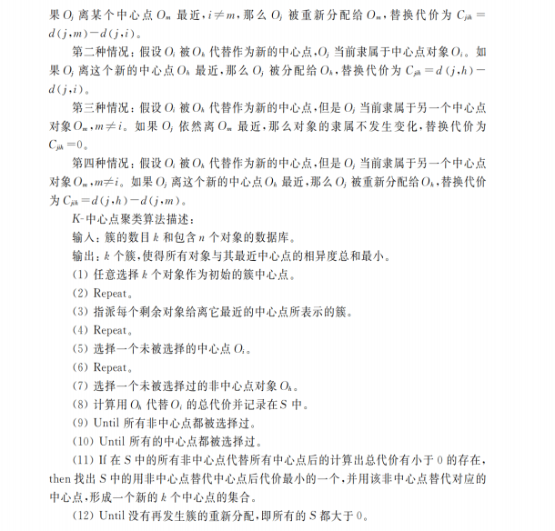

### 例题

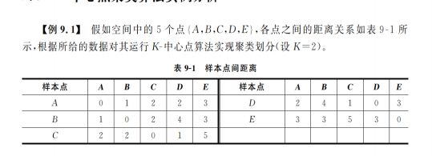

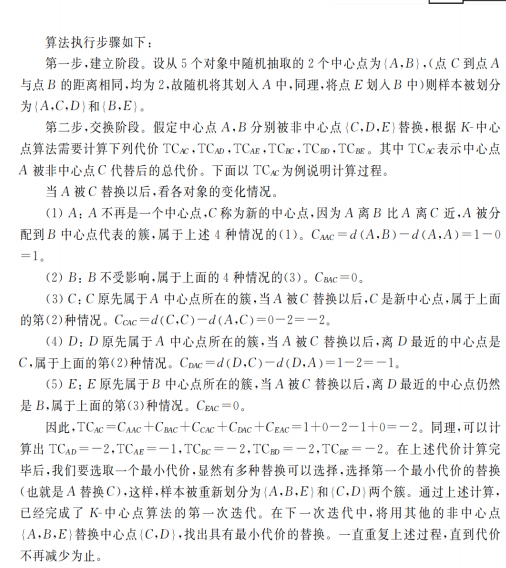

对k均值的优化

### 总结回顾

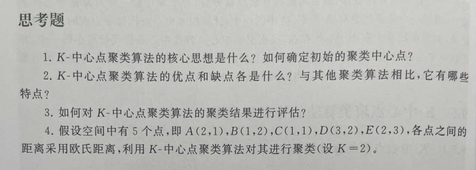

## 第十章SOM

### P189 网络原理看

### 网络结构10.3.1

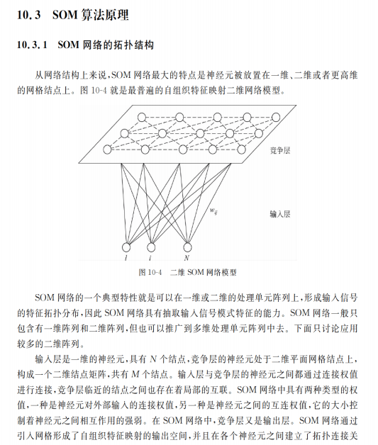

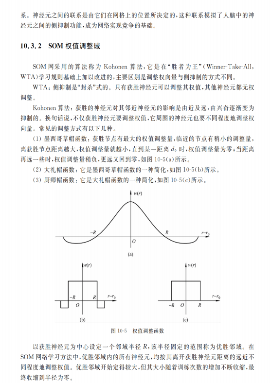

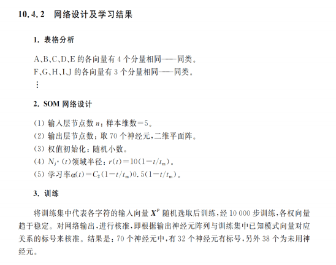