### 简介

彭星源，男，预备党员，2022级网络安全与执法一区队，任浙江警察学院人工智能协会社长，Y0ungK1ngs战队队长，浙江警察学院首位获得大学生最高竞赛国际大学生创新创业大赛金奖。2024年8月至2024年10月在浙江警察学院实验中心实习；2025年2月至今在杭州电子科技大学访学。

该生为2022年警训新生代表，在科技创新和各类竞赛中斩获佳绩，为学校争得荣誉，获12项国家级奖项，8项国家级奖项。主持1项国家级创新创业课题，录用1篇JCR一区、SCI三区论文，获得5项第一软件著作权受理。项目受邀参与王坚院士主办2050大会，广受媒体与社会关注，受深圳、安徽等各地人工智能产业园合作邀请。同时积极参与课外活动，作为个人音乐人、话剧导演、学校宣传剪辑负责参加多项活动。

### 国家级奖项：
- ==2024国际大学生创新大赛铜奖团队负责人=={.important}
	- 还未发
- ==2024第二届全国人工智能应用场景创新挑战赛AI生成专项赛一等奖=={.important}
	- 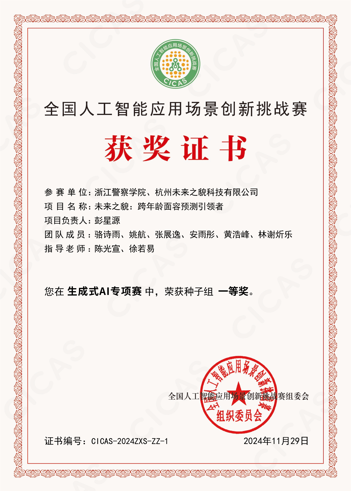
- ==2024第二届全国人工智能应用场景创新挑战赛决赛一等奖=={.important}
	- 
- 2024年全国智警杯大数据比赛”锦绣赛区”二等奖
- 2024年全国智警杯大数据比赛三等奖
- 2024年第六届全国大学生智能机器人创意竞赛三等奖
	- 
- 2023年美国大学生数学建模大赛S奖
	- 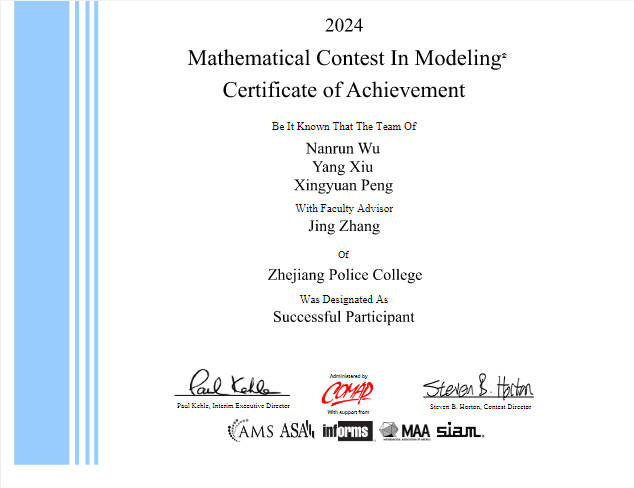
- 2025年全国FIC电子取证大赛晋级一等奖
	- 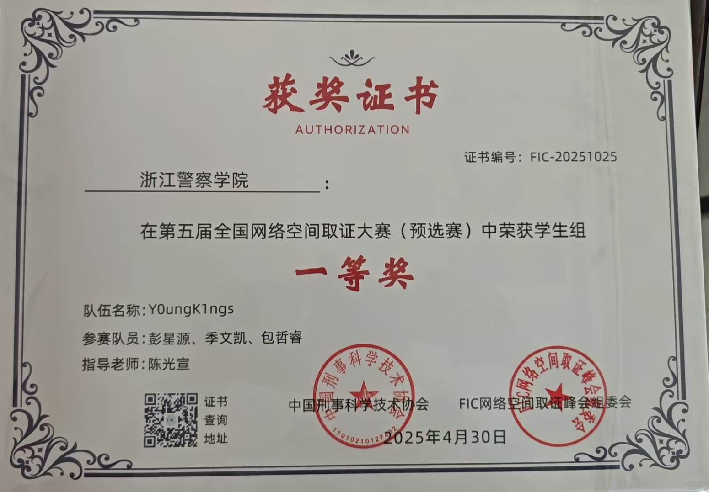
- 2025年全国盘古石电子取证大赛晋级一等奖
	- 还未发
- 2025年全国獬豸杯电子取证大赛三等奖
	- 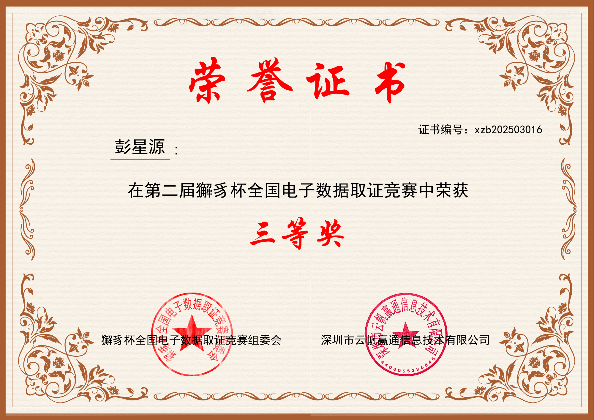
- 2025年全国FIC电子取证大赛决赛三等奖
- 2024年全国FIC电子取证大赛优胜奖
### 省级奖项：
- ==浙江省国际大学生创新大赛（2024）金奖团队负责人=={.important}
	- 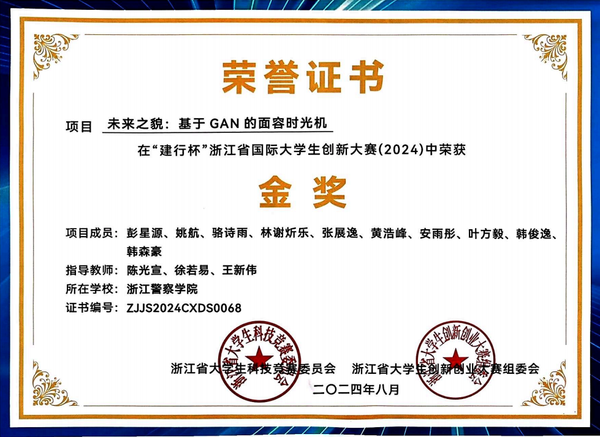
- ==2024年第六届浙江省大学生智能机器人创意竞赛一等奖第一名=={.important}
	- 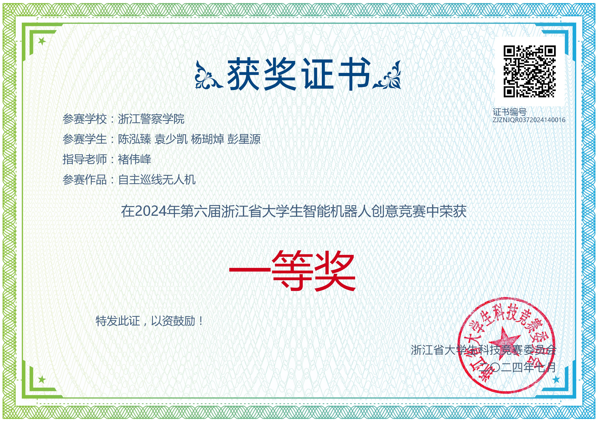
- 2024浙江省蓝桥杯程序设计大赛二等奖
	- 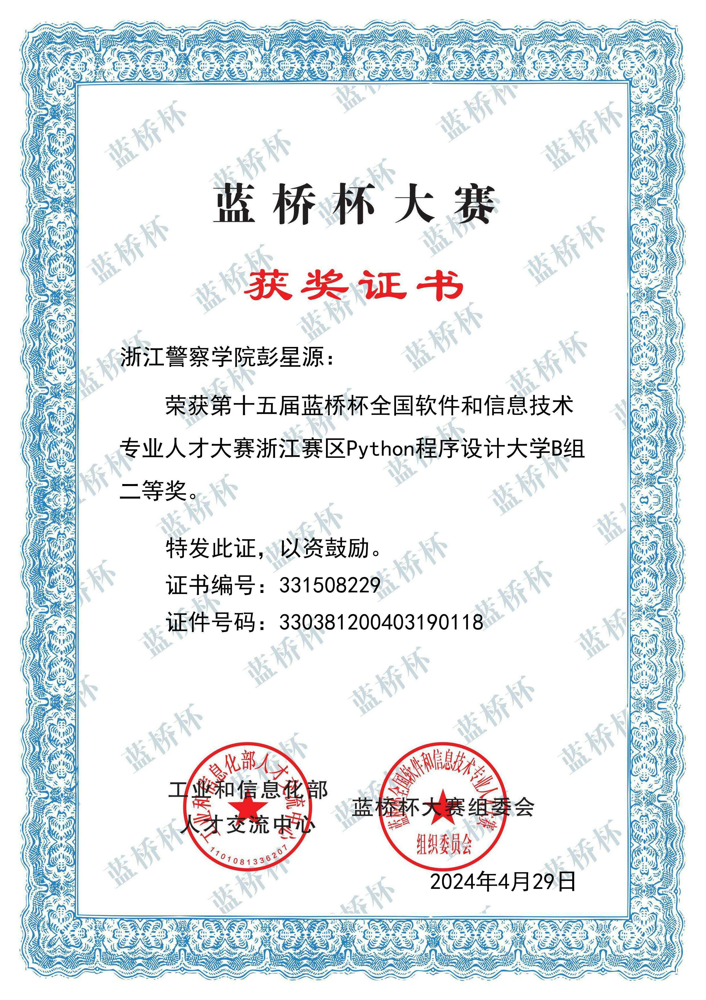
- 2023浙江省蓝桥杯程序设计大赛三等奖
- 2025浙江省蓝桥杯程序设计大赛一等奖
- 2024浙江省睿抗机器人选拔赛三等奖
- 2024浙江省ACM设计竞赛优胜奖
- 2024浙江省应用外包大赛三等奖
- 2023年浙江省高等数学竞赛二等奖
### 校级奖项：
- 2024年校互联网+大赛金奖主持一项，参与一项
	- 
- 2024年校级程序设计比赛一等奖
	- 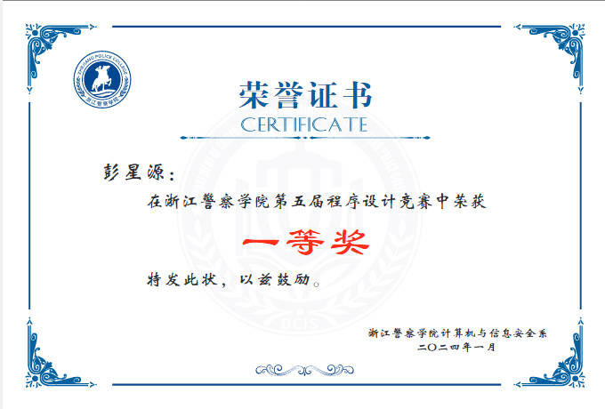
- 2025年校级程序设计比赛二等奖
- 2023年校级程序设计比赛一等奖
- 2023年校级攻防比赛三等奖
- 2023年取证比赛优胜奖
- 2025年校级攻防比赛一等奖
- 2025年大数据比赛一等奖

### 创新创业
- 国家级创新立项一项
- 校级创新立项2项
- 软件著作权5项
	- 
	- 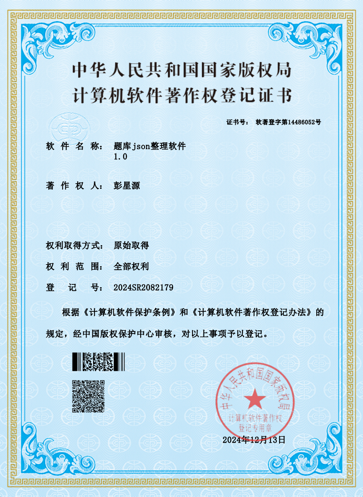
	- 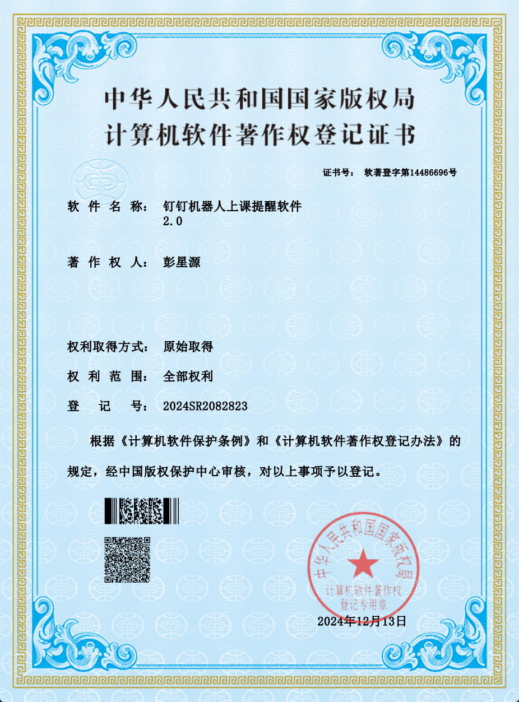
	- 
	- 
- JCR一区，SCI三区论文
	- 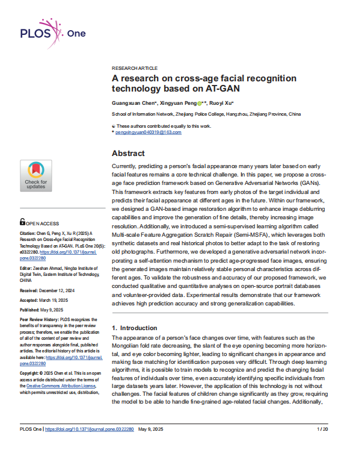

### 课外实践

- 校75周年庆话剧节目主演
- 作为公安廉政剧导演兼编剧指导《冷水》作品获全校第三名
- 参加元旦晚会
- 作为武术节目负责人和主演，组织排演武术节目
- 22大队十佳歌手