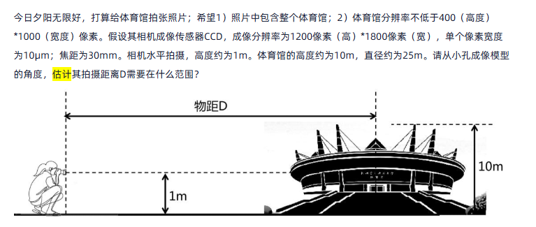
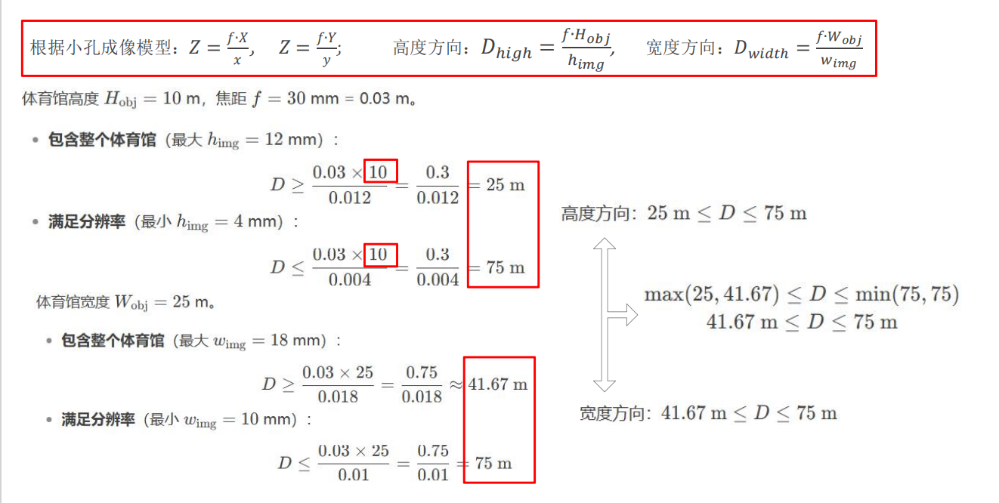
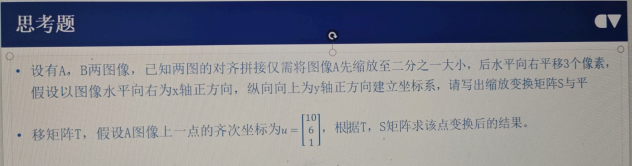
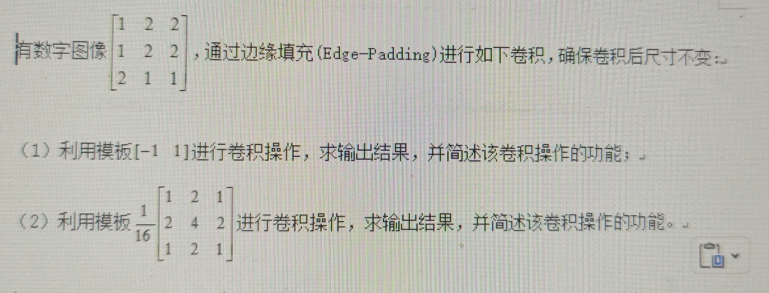

### 题型

> 8个大题
  6个计算题（简答题）
  2个论述题

:::: card-masonry

::: card title="计算题1"
小孔成像模型

$$
Z=\frac{F_{x}}{x}, Z=\frac{F_{y}}{y}
$$

:::

::: card title="计算题2"
性能度量

TP、FP、TN、FN

P、R、F1计算
:::

::: card title="计算题3"
图像矩阵基本变换

平移矩阵
$$
T = \begin{bmatrix}
1 & 0 & t_x \\
0 & 1 & t_y \\
0 & 0 & 1
\end{bmatrix}
$$

缩放矩阵
$$
S = \begin{bmatrix}
s_x & 0 & 0 \\
0 & s_y & 0 \\
0 & 0 & 1
\end{bmatrix}
$$
:::

::: card title="计算题4"

sobel算子边缘检测计算

0填充
:::

::: card title="计算题5"
lenet5

通过==局部感受野==设置，减少下一层观察上一层视窗大小，降低参数量，同时一定程度上弥补==位置丢失问题==

参数计算

可训练参数：（5\*5+1）\*6（每个滤波器5\*5=25个unit参数和一个bias参数，一共6个滤波器）

:::

::: card title="描述题1"
- 人眼成像规律
- 颜色空间简述与不同原因
:::

::: card title="描述题2"
SIFT、HOG做图像拼接的步骤

(Scale-Invariant-Feature-Transform)

(Histogram of Oriented Gradients)

:::

::: card title="描述题3"
图像分类中比较最近邻方法、逻辑回归模型和支持向量机在图像分类中的优缺点
图像分类基本过程
:::

::::

## 作业复习

### 题目1

### 题目2.1

#### 解题步骤
#### 已知条件
- 受测者总数：1000 人
- 癌症患者人数（正例）：2 人
- 非癌症患者人数（反例）：998 人

#### 模型 I
- 全部判断为没有癌症
- 错误率：2/1000，精度：99.8%

**计算查准率 P、查全率 R 和 F1 分数**

由于模型 I 将所有受测者都判断为无癌症，因此：
- 真正例（TP）：0（因为所有患者都被判断为无癌症）
- 假正例（FP）：0（没有将非患者判断为患者）
- 假负例（FN）：2（2 位患者未被正确识别）
- 真负例（TN）：998（所有非患者都被正确识别）

- **查准率 P**：TP / (TP + FP) = 0 / (0 + 0) → 得出无意义（因为分母为 0）
- **查全率 R**：TP / (TP + FN) = 0 / (0 + 2) = 0
- **F1 分数**：由于 P 无意义，F1 分数也无意义

#### 模型 II
- 2 位患者预测正确
- 4 位反例预测为患病（假正例）
- 错误率：4/1000，精度：99.6%

**计算查准率 P、查全率 R 和 F1 分数**

根据题目描述：
- 真正例（TP）：2（2 位患者正确预测为患病）
- 假正例（FP）：4（4 位非患者被错误预测为患病）
- 假负例（FN）：0（所有患者都被正确识别）
- 真负例（TN）：994（998 - 4 = 994，非患者正确识别为无癌症）

- **查准率 P**：TP / (TP + FP) = 2 / (2 + 4) = 2/6 ≈ 0.333
- **查全率 R**：TP / (TP + FN) = 2 / (2 + 0) = 1.0
- **F1 分数**：2 × P × R / (P + R) = 2 × (2/6) × 1 / (2/6 + 1) = (4/6) / (8/6) = 0.5

#### 结果表格

| 模型    | 错误率    | 精度    | 查准率 P   | 查全率 R | F1 分数 |
| ----- | ------ | ----- | ------- | ----- | ----- |
| 模型 I  | 2/1000 | 99.8% | 无意义     | 0     | 无意义   |
| 模型 II | 4/1000 | 99.6% | ≈ 0.333 | 1.0   | 0.5   |

### 题目2.2

已知A和B两图像，对齐拼接需要将图像A先缩放到二分之一大小，再水平向右平移3个像素。假设以图像水平向右为x轴正方向，纵向向上为y轴正方向建立坐标系。请写出缩放变换矩阵S和平移矩阵T，并根据给定的点 $\mathbf{u} = \begin{bmatrix}10 \\ 6 \\ 1\end{bmatrix}$，求该点变换后的结果。

#### 解题步骤

#### 1\. 缩放变换矩阵S

缩放变换矩阵的形式为：

$$
S = \begin{bmatrix}
s_x & 0 & 0 \\
0 & s_y & 0 \\
0 & 0 & 1
\end{bmatrix}
$$

题目要求将图像A缩放到二分之一大小，因此 $s_x = s_y = 0.5$：

$$
S = \begin{bmatrix}
0.5 & 0 & 0 \\
0 & 0.5 & 0 \\
0 & 0 & 1
\end{bmatrix}
$$

#### 2\. 平移矩阵T

平移变换矩阵的形式为：

$$
T = \begin{bmatrix}
1 & 0 & t_x \\
0 & 1 & t_y \\
0 & 0 & 1
\end{bmatrix}
$$

题目要求将图像水平向右平移3个像素，因此 $t_x = 3$
，$t_y = 0$：

$$
T = \begin{bmatrix}
1 & 0 & 3 \\
0 & 1 & 0 \\
0 & 0 & 1
\end{bmatrix}
$$

#### 3\. 组合变换矩阵（先缩放后平移）

组合变换矩阵 \(M\) 是将缩放矩阵 \(S\) 和平移矩阵 \(T\) 相乘：

$$
M = T \times S = \begin{bmatrix}
1 & 0 & 3 \\
0 & 1 & 0 \\
0 & 0 & 1
\end{bmatrix}
\times
\begin{bmatrix}
0.5 & 0 & 0 \\
0 & 0.5 & 0 \\
0 & 0 & 1
\end{bmatrix}
=
\begin{bmatrix}
0.5 & 0 & 3 \\
0 & 0.5 & 0 \\
0 & 0 & 1
\end{bmatrix}
$$

#### 4\. 计算变换后的点

给定点 $\mathbf{u} = \begin{bmatrix}10 \\ 6 \\ 1\end{bmatrix}$，应用组合变换矩阵 \(M\)：

$$
\mathbf{v} = M \times \mathbf{u} = \begin{bmatrix}
0.5 & 0 & 3 \\
0 & 0.5 & 0 \\
0 & 0 & 1
\end{bmatrix}
\times
\begin{bmatrix}
10 \\
6 \\
1
\end{bmatrix}
$$

计算过程：

- 第一行：$0.5 \times 10 + 0 \times 6 + 3 \times 1 = 5 + 0 + 3 = 8$
- 第二行：$0 \times 10 + 0.5 \times 6 + 0 \times 1 = 0 + 3 + 0 = 3$
- 第三行：$0 \times 10 + 0 \times 6 + 1 \times 1 = 1$

因此，变换后的齐次坐标为 
$$mathbf{v} = \begin{bmatrix}8 \\ 3 \\ 1\end{bmatrix}$$

### 题目2.3

#### 解题步骤

#### （1）利用模板 $[-1 , 1]$ 进行卷积操作

**卷积操作步骤**：

1. **边缘填充**：由于卷积模板为1行2列，需要对图像左右边缘各填充1列。填充方式为题干中的边缘复制。

填充后的图像：

$$
\begin{bmatrix}
1 & 1 & 2 & 2 & 2 \\
1 & 1 & 2 & 2 & 2 \\
2 & 2 & 1 & 1 & 1
\end{bmatrix}
$$

2. **卷积计算**：将模板 $[-1 , 1]$ 滑动到每个位置，计算卷积。

卷积结果：

$$
\begin{bmatrix}
1-1=0 & -1+2=1 & 2-2=0 & 2-2=0 \\
1-1=0 & -1+2=1 & 2-2=0 & 2-2=0 \\
2-2=0 & -2+1=-1 & 1-1=0 & 1-1=0
\end{bmatrix}
$$

即：

$$
\begin{bmatrix}
0 & 1 & 0 & 0 \\
0 & 1 & 0 & 0 \\
0 & -1 & 0 & 0
\end{bmatrix}
$$

**功能简述**：该卷积可以分析出图像的==水平方向==变化程度，很好理解该模板可用于检测水平边缘，通过相邻像素的差值来突出，水平方向的变化。

#### （2）利用模板 

$$
\frac{1}{16}\begin{bmatrix}1&2&1\\2&4&2\\1&2&1\end{bmatrix}
$$ 

进行卷积操作

**卷积操作步骤**：

1. **边缘填充**：由于卷积模板为3×3，需要对图像四周各填充1行1列。填充方式为边缘复制。

填充后的图像：

$$
\begin{bmatrix}
1 & 1 & 2 & 2 & 2 \\
1 & 1 & 2 & 2 & 2 \\
1 & 1 & 2 & 2 & 2 \\
2 & 2 & 1 & 1 & 1 \\
2 & 2 & 1 & 1 & 1
\end{bmatrix}
$$

2. **卷积计算**：将模板与每个3×3窗口相乘并累加，再除以16。

卷积结果：

$$
\begin{bmatrix}
\frac{1}{16}(1\times1 + 2\times2 + 2\times1 + 1\times2 + 4\times2 + 2\times2 + 2\times1 + 1\times1 + 1\times2) & \cdots \\
\cdots & \cdots \\
\cdots & \cdots
\end{bmatrix}
$$

具体计算每个位置的值

$$
\begin{bmatrix}
1.25 & 1.75 & 2 \\
1.375 & 1.625 & 1.75 \\
1.625 & 1.375 & 1.25
\end{bmatrix}
$$

### Lenet参数计算

以lenet5为例, 给定卷积核以及卷积的个数进行计算参数量的大小

1. **参数量与局部空间** ：通过局部感受野设置，减少下一层观察上一层视窗大小，降低参数量，同时一定程度上弥补位置丢失问题。
2. **卷积计算** ：给定卷积核和个数，按对应规则计算卷积结果。如填充 padding、步长移动像素个数等参数设置会影响卷积输出结果，Sobel 算子计算也遵循类似卷积原理。

### sobel算子边缘检测

## 考点复习

### 描述题1：人眼成像规律

人类视觉产生的过程大致如下：

1. **光线进入眼球** ：光线从外界物体出发，穿过角膜。角膜是一个透明的结构，它对光线具有初步的折射作用，使光线能够顺利进入眼内。
    
2. **晶状体调节** ：光线接着进入瞳孔，瞳孔的大小可调节进入眼内的光量。随后，光线到达晶状体。晶状体通过自身形状的改变（依靠睫状肌的收缩和舒张来调节晶状体的曲度），进一步对光线进行聚焦，使光线能够准确地聚焦在视网膜上形成清晰的倒立实像。
    
3. **视网膜成像与细胞作用** ：视网膜位于眼球的内层，相当于相机的底片。在视网膜上有两种主要的感光细胞，即锥状细胞（视锥细胞）和柱状细胞（视杆细胞）。
    
    - **锥状细胞** ：主要负责昼光觉（在明亮环境下起主要作用）和色觉。它在视网膜的黄斑区（特别是中心凹）分布密集，能分辨物体的细节和颜色。
        
    - **柱状细胞** ：主要负责夜光觉（在较暗环境下起主要作用），对光线的敏感度高，但不能分辨颜色，也难以看清物体的细节。
        
4. **信号传递与处理** ：视网膜上的感光细胞将光信号转化为神经冲动。这些神经冲动经过视网膜内复杂的神经网络进行初步分析和处理后，会沿着视神经（由视网膜神经节细胞的轴突集合构成）离开眼球。
    
5. **LGN（外侧膝状体）中转** ：视神经将信号传递到大脑的外侧膝状体（LGN），LGN 是大脑丘脑的一部分，它像一个信号中转站，对视神经传来的信号进行进一步的整合和处理。
    
6. **大脑视觉中枢分析理解** ：处理后的信号从 LGN 被传递到大脑的视觉皮层（位于枕叶）。在视觉皮层，信号会经过一系列复杂的神经网络进行深度分析和理解，包括对物体的形状、大小、运动、空间位置等信息的识别和判断，最终形成我们所看到的完整的视觉图像，让我们能够理解和认知周围的世界。

### 描述题2：颜色空间

颜色空间是表示和量化颜色的一种系统，核心是对各种颜色进行数字化离散表示，其原理与应用如下：

#### 一、颜色表示和量化
1. **三原色原理**：自然界中多数颜色可由红、绿、蓝（RGB）三种原色按不同比例混合生成，如红光+绿光可产生黄光。
2. **颜色空间模型**：
    - **RGB色彩空间**：基于加色法混色原理，通过红、绿、蓝三个颜色通道的值来表示颜色。每个颜色通道的取值范围通常为0到255，如（255,0,0）表示红色。
    - **CMYK色彩空间**：用于印刷领域，通过青色（Cyan）、品红色（Magenta）、黄色（Yellow）和黑色（Black）油墨的叠加来再现颜色。每个通道的取值范围为0%到100%，如C=100%、M=100%、Y=0%、K=0%对应红色。
    - **HSB/HSI/HLS/HSV色彩空间**：从人的视觉角度出发，分别表示颜色的色调（Hue）、饱和度（Saturation）、亮度（Brightness/Intensity）或明度（Lightness）、色相（Hue）、饱和度（Saturation）、值（Value）。色调通常用角度表示，如0°或360°为红色；饱和度和亮度取值范围一般为0%到100%。

#### 二、现实空间到设备中的颜色空间表示
1. **现实空间的颜色信号**：在自然界中，物体反射或发出的光包含了各种波长的光，人眼感知到的是连续光谱的颜色。
2. **设备中的颜色空间表示**：
    - **输入设备（如数码相机、扫描仪）**：会将现实中的连续颜色信号转换为设备特定的颜色空间表示，如将不同波长的光转换为RGB值。例如，数码相机的图像传感器会把接收到的光信号转换为红、绿、蓝三个颜色通道的电信号，经量化后得到每个像素的RGB值。
    - **输出设备（如显示器、打印机）**：根据设备的颜色空间来再现颜色。显示器通常使用RGB颜色空间，通过控制红、绿、蓝三种颜色的发光二极管（LED）或液晶显示器（LCD）的亮度来显示不同颜色的图像；打印机则使用CMYK颜色空间，通过喷射不同比例的青色、品红色、黄色和黑色油墨来打印图像。

#### 三、不同设备的颜色空间不同原因
不同设备使用不同的颜色通道主要是因为它们在颜色表示、显示和处理方面有不同的需求和特性。以下是详细解释：

##### 1\. 显示设备（如显示器）

  * **RGB 颜色通道** ：
    * **原理** ：显示器是一种发光设备，通过控制红（R）、绿（G）、蓝（B）三种颜色的发光二极管（LED）或液晶显示器（LCD）的亮度来产生各种颜色。RGB 颜色模型是基于加色法混色原理，当红、绿、蓝三种颜色的光以不同的强度相加混合时，可以产生广泛的色彩范围。
    * **应用优势** ：这种颜色通道能够提供丰富的色彩表现，可以满足从简单的文本显示到复杂的图像、视频显示的需求。例如，在显示高清视频时，RGB 颜色通道能够精确地还原视频中的各种颜色场景，从明亮的阳光到深邃的夜空。而且，RGB 颜色通道与计算机图形处理和视频处理技术紧密结合，便于进行颜色合成、特效制作等操作。

##### 2\. 打印设备（如打印机）

  * **CMYK 颜色通道** ：
    * **原理** ：打印机在纸张等介质上印刷颜色时，采用的是减色法混色原理。CMYK 颜色模型由青（Cyan，C）、品红（Magenta，M）、黄（Yellow，Y）和黑（Black，K）四种颜色组成。这些颜色的油墨或墨水在纸张上通过吸收和反射不同波长的光来呈现颜色。例如，青色油墨主要吸收红光，反射绿光和蓝光；品红色油墨主要吸收绿光，反射红光和蓝光；黄色油墨主要吸收蓝光，反射红光和绿光；黑色油墨用于加深颜色的深度，特别是在表现暗色调和黑色文字时效果显著。
    * **应用优势** ：CMYK 颜色通道能够准确地模拟印刷品的颜色效果，与印刷工艺和纸张特性相匹配。在彩色打印时，可以较好地再现图像和文档中的色彩。特别是在商业印刷领域，如海报、宣传册、包装等，CMYK 颜色通道能够保证印刷品的颜色质量、色彩稳定性和一致性。

##### 3\. 摄像设备（如数码相机）

  * **RGB 颜色通道（与显示器类似）** ：
    * **原理** ：数码相机的图像传感器通过感光元件捕捉光线中的红、绿、蓝三种颜色成分。每个感光元件（如 CCD 或 CMOS）会对相应颜色的光产生电信号，经过模数转换和图像处理后，形成数字图像中的 RGB 颜色信息。
    * **应用优势** ：使用 RGB 颜色通道可以方便地将捕捉到的图像在显示器等设备上进行预览和编辑。而且，RGB 颜色通道能够记录丰富的色彩细节，有利于后期对图像进行色彩调整和优化，例如在专业的摄影后期制作中，摄影师可以根据需要调整图像的色调、饱和度、亮度等参数，以达到理想的视觉效果。

##### 4\. 电视广播和视频传输设备

  * **YUV 颜色通道** ：
    * **原理** ：YUV 颜色模型将颜色分为亮度（Y）和色度（U、V）两个部分。其中，Y 代表亮度信息，U 和 V 代表色度信息。这种颜色通道的划分是为了在模拟电视信号传输过程中，既能兼容黑白电视信号（只传输亮度信息），又能传输彩色信号（同时传输亮度和色度信息）。在数字视频处理和传输中，YUV 颜色通道也有助于对视频信号进行压缩和优化。
    * **应用优势** ：在电视广播和视频传输中，YUV 颜色通道可以在保证一定图像质量的前提下，有效地降低数据量。例如，在传输高清视频时，通过对色度信息进行适当的压缩和抽样（如 4:2:0、4:2:2 等采样方式），可以在减少带宽占用的同时，尽量保持人眼对图像质量的可接受程度。而且，YUV 颜色通道便于将视频信号与音频信号等进行复合传输和处理。

不同设备根据其工作原理、应用场景和目标需求，选择最适合自己的颜色通道来实现准确、高效的颜色表示、显示和处理。

#### 四、常用设备中的颜色空间及符号解释
1. **显示器**：
    - **sRGB色彩空间**：是最常见的显示器颜色空间之一，由惠普和微软联合开发，用于在显示器、打印机和其他设备之间实现颜色的一致性。其颜色范围相对较窄，但兼容性好。
    - **Adobe RGB色彩空间**：比sRGB色彩空间具有更宽的色域，能够表示更多种颜色，常用于专业的图像处理和印刷领域。在sRGB色彩空间中无法准确显示的某些绿色和青色区域的色彩，在Adobe RGB色彩空间中可以得到更好的呈现。
    - **符号解释**：
        - **R**：Red，红色通道，取值范围在0到255。
        - **G**：Green，绿色通道，取值范围在0到255。
        - **B**：Blue，蓝色通道，取值范围在0到255。
2. **打印机**：
    - **CMYK色彩空间**：是打印机常用的颜色空间，如上述。
    - **符号解释**：
        - **C**：Cyan，青色通道，取值范围0%到100%。
        - **M**：Magenta，品红色通道，取值范围0%到100%。
        - **Y**：Yellow，黄色通道，取值范围0%到100%。
        - **K**：Black，黑色通道，取值范围0%到100%。
3. **数字图像处理软件（如Photoshop）**：
    - **支持多种颜色空间**：除RGB和CMYK外，还支持HSB等颜色空间，以便用户从不同角度调整和处理图像颜色。
    - **符号解释**（以HSB为例）：
        - **H**：Hue，色调，用角度表示，0°或360°为红色，60°为黄色，120°为绿色，180°为青色，240°为蓝色，300°为品红色。
        - **S**：Saturation，饱和度，表示颜色的纯度，取值范围0%到100%。饱和度越高，颜色越鲜艳；饱和度为0%时，颜色为灰色。
        - **B**：Brightness，亮度，表示颜色的明亮程度，取值范围0%到100%。亮度为0%时，颜色为黑色；亮度为100%时，颜色最亮。

### 描述题3：图片拼接

图像拼接的流程如下：

预处理

#### DOG

**高斯滤波**

**差分计算**

将经过较大标准差高斯滤波后的图像与经过较小标准差高斯滤波后的图像相减

#### LOG

**高斯滤波**

**拉普拉斯算子计算**

零交叉点

#### Canny

高斯滤波

梯度计算

检查该像素点左右两个相邻像素的梯度幅值

#### 1. 关键点检测
关键点检测是图像拼接的第一步，目的是在图像中找到具有独特特征的点，这些点能够代表图像的局部特征，且在不同视角或光照条件下具有可重复性。

- **常见关键点检测方法**
    - **Harris角点检测**
        - **原理**：Harris角点检测通过计算图像灰度的自相关函数来判断角点。它基于灰度变化的二阶矩矩阵，当该矩阵的两个特征值都较大时，认为该点是一个角点。具体来说，对于图像中的每一个像素点，计算其周围区域在x和y两个方向上的灰度变化情况。通过构造一个自相关函数矩阵，根据矩阵的特征值来判断该点是否为角点。如果矩阵的两个特征值都较大，说明在该点的两个方向上灰度都有较大的变化，即该点是一个角点。
        - **特点**：只对图像灰度的局部变化敏感，计算相对简单，能检测到大量角点，但对图像的旋转和尺度变化较为敏感。
    - **SIFT（Scale - Invariant Feature Transform）尺度不变特征变换关键点检测**
        - **原理**：SIFT算法首先通过构建高斯差分金字塔来检测图像中的特征点。它在不同尺度下对图像进行高斯模糊，然后计算相邻尺度图像的差分，从而找到图像中在不同尺度下稳定的特征点。这些特征点包括角点、边缘点等。对于每个特征点，算法还会计算其方向直方图来确定其主方向，使得特征点具有旋转不变性。
        - **特点**：对图像的尺度变化和旋转具有不变性，能够检测到具有稳定特征的点，并且对应于这些特征点的描述子也具有良好的匹配性能。
    - **FAST（Features from Accelerated Segment Test）角点检测**
        - **原理**：FAST算法是一种快速角点检测方法。它通过检测一个像素点周围相邻的16个像素点（位于一个圆环上），如果其中连续的n个像素点（通常n为9或12）的灰度值都比当前像素点的灰度值大或者小一定的阈值，那么该像素点就被认为是一个角点。这种方法利用了积分图像等技术来加速计算。
        - **特点**：计算速度非常快，适用于实时应用，但对图像的旋转和尺度变化适应性不如SIFT等算法。
    - **ORB（Oriented FAST and Rotated BRIEF）角点检测**
        - **原理**：ORB算法结合了FAST角点检测和BRIEF（Binary Robust Independent Elementary Features）描述子。它在FAST角点检测的基础上，对特征点添加了一个方向信息，使得特征点具有旋转不变性。然后使用BRIEF描述子来描述这些特征点，BRIEF描述子通过比较特征点周围像素点的灰度大小关系来生成二进制字符串，这种描述子具有计算简单和匹配速度快的特点。
        - **特点**：既具有FAST角点检测的速度优势，又通过方向信息和BRIEF描述子增强了对旋转的不变性和描述能力。

#### 2. 关键点匹配
在进行坐标变换之前，需要找到两张图像之间的关键点匹配对。这一步通常使用特征描述子来比较不同图像中的关键点，找到具有相似特征的点对。

- **匹配方法**
    - **最近邻匹配**：对于一张图像中的每一个关键点特征描述子，在另一张图像的关键点特征描述子集合中寻找最相似的描述子进行匹配。相似性可以通过计算描述子之间的欧几里得距离或者汉明距离（对于二进制描述子如ORB）来衡量。
    - **双向匹配**：双向匹配是在两张图像之间互相进行最近邻匹配，并且只有当两个关键点在互相匹配时才认为它们是匹配对，这样可以减少错误匹配。
    - **基于比率的匹配（如 Lowe's ratio test）**：对于每个关键点，找到其在另一张图像中最相似和次相似的描述子。如果最相似描述子与次相似描述子的距离比小于某个阈值（如0.7），则认为该匹配是可靠的，这种方法可以有效地去除一些模糊的、不确定的匹配。

#### 3. 坐标变换
在找到足够多的关键点匹配对之后，就可以进行坐标变换，将其中一张图像变换到另一张图像的坐标系下，为后续的图像拼接做准备。

- **变换类型**
    - **平移变换**：如果两张图像之间只有平移差异，可以通过计算匹配点之间的平移向量来对其中一张图像进行平移变换。例如，假设在图像A和图像B中找到一组匹配点对，通过计算这些匹配点在x轴和y轴方向上的平均位移，得到平移向量（a，b），然后将图像B平移（a，b）即可。
    - **旋转变换**：如果两张图像之间存在旋转差异，可以通过计算匹配点之间的旋转角度来对图像进行旋转变换。例如，对于匹配点对，计算它们在两幅图像中的向量之间的角度差，通过求平均值得到旋转角度θ，然后使用旋转变换公式将图像旋转θ角度。
    - **仿射变换**：仿射变换可以处理平移、旋转、缩放和错切等多种变换组合。通过找到至少三对匹配点，可以计算出仿射变换矩阵。仿射变换矩阵是一个2×3的矩阵，它通过将图像中的点（x，y）变换为（ax + by + c，dx + ey + f）来实现变换。其中，a、b、c、d、e、f是仿射变换的参数，这些参数可以根据匹配点对的坐标来求解。
    - **投影变换（透视变换）**：投影变换用于处理透视效果的变换，它可以通过找到四对匹配点来计算投影变换矩阵。投影变换矩阵是一个3×3的矩阵，它可以将图像中的点（x，y）变换为（（ax + by + c）/（gx + hy +1），（dx + ey + f）/（gx + hy +1））。这种变换在处理具有不同视角的图像拼接时非常有用，例如将一张从高处拍摄的图像与一张从平视角度拍摄的图像进行拼接。

#### 4. 图像融合
在完成坐标变换后，将两张图像拼接在一起，可能会出现重叠区域的不自然过渡。因此需要进行图像融合，使拼接后的图像看起来更加自然。

- **融合方法**
    - **直接拼接**：在简单的情况下，可以直接将两张图像在非重叠区域直接拼接，而在重叠区域可以取其中一张图像的像素值或者进行简单的平均融合。这种方法简单，但在重叠区域可能会出现明显的边界。
    - **加权平均融合**：在重叠区域内，为两张图像的像素值分别赋予不同的权重，然后进行加权平均。权重可以按照从一张图像到另一张图像的渐变方式来设置，例如从左到右，一张图像的权重逐渐减小，另一张图像的权重逐渐增加，这样可以使过渡区域更加平滑。
    - **多频带融合**：将图像分解为多个频率带，对不同频率带的图像分别进行融合，然后再将融合后的图像进行重构。这种方法可以更好地处理图像中的细节和整体结构，使融合后的图像在视觉上更加自然。

### 描述题4：SIFT（全称是什么）和HoG HoG全称（梯度方向直方图）以及步骤是什么（每一步做什么）

SIFT全称为尺度不变特征变换（Scale - Invariant Feature Transform），HoG全称为梯度方向直方图（Histogram of Oriented Gradient）。以下是它们的步骤：

#### SIFT步骤

::: steps

1. **构建高斯差分金字塔**
    - **构建高斯金字塔**：对输入图像进行多次高斯模糊，每次模糊后将图像尺寸减半，形成一个金字塔。这个过程的目的是在不同的尺度下检测特征点，以实现尺度不变性。例如，原始图像尺寸为 \($256 \times 256$\)，经过一次高斯模糊和下采样后，得到 \($128 \times 128$\) 的图像，以此类推，形成一个包含多个尺度的金字塔。
    - **计算高斯差分金字塔**：计算相邻两层高斯金字塔图像的差分，得到高斯差分金字塔。通过高斯差分可以突出图像中的局部特征，为后续特征点的检测做准备。
2. **关键点定位**
    - 在高斯差分金字塔中，通过比较每个像素点与周围邻域的像素值，找到局部极大值点或极小值点，这些点被认为是潜在的特征点。例如，在一个 \($3 \times 3 \times 3$\) 的邻域内，如果一个像素点的值是该邻域内的最大值或最小值，则该点被标记为候选特征点。然后，通过拟合立方函数对特征点的位置进行精确调整，去除低对比度的特征点和边缘响应点，得到稳定的关键点。
3. **关键点方向分配**
    - 对每个关键点周围邻域内的像素计算梯度幅度和方向，然后在该邻域内构建梯度方向直方图。直方图的峰值方向被选为该关键点的主方向，使得关键点具有旋转不变性。例如，对于一个关键点，计算其周围 \($16 \times 16$\) 邻域内的梯度信息，将梯度方向分成多个区间（如 8 个或 16 个区间），统计每个区间内的梯度幅度之和，直方图的最大值对应的方向作为关键点的主方向。
4. **关键点描述子生成**
    - 在每个关键点的邻域内，按照关键点的主方向进行坐标系的旋转对齐，然后将邻域划分为多个子区域。每个子区域内计算梯度幅度和方向，形成描述子。描述子由多个梯度方向直方图组成，具有较好的局部特征描述能力。例如，将关键点周围 \($16 \times 16$\) 的邻域分成 \($4 \times 4$\) 的子区域，每个子区域计算 8 个方向的梯度直方图，得到一个 \($4 \times 4 \times 8 = 128$\) 维的特征向量作为描述子。
:::

@[bilibili](BV1Hb411r7n8)
#### HoG步骤

::: steps

1. **图像预处理**
    - 通常对输入图像进行灰度化处理，以减少计算复杂度。例如，对于彩色图像，可以通过将 RGB 值转换为灰度值来得到灰度图像。
2. **计算图像梯度**
    - 对灰度图像计算每个像素点的梯度幅度和方向。梯度幅度反映了图像灰度变化的强度，梯度方向反映了变化的方向。可以用以下公式计算梯度：
      
     $$
      G_x = I(x + 1, y) - I(x - 1, y)
      $$
      
      $$
      G_y = I(x, y + 1) - I(x, y - 1)
      $$
    

      $$\text{梯度幅度} = \sqrt{G_x^2 + G_y^2}$$
    

     $$ \text{梯度方向} = \arctan\left(\frac{G_y}{G_x}\right)$$
    
      其中，\(I(x, y)\) 表示图像在位置 \((x, y)\) 的灰度值。
3. **构建梯度方向直方图**
    - 将图像分成若干个小的区域（称为单元格），对每个单元格内的像素梯度方向进行统计，构建梯度方向直方图。例如，将图像分成 \($8 \times 8$\) 的单元格，将梯度方向分成 9 个区间（0° - 180°，间隔 20°），统计每个单元格内每个区间内的梯度幅度之和。
4. **块归一化**
    - 将多个相邻的单元格组成一个块，对块内的梯度直方图进行归一化处理，以减少光照变化等影响。常用的归一化方法有 L1 - norm、L2 - norm 等。例如，一个块包含 \($2 \times 2$\) 个单元格，将这 4 个单元格的梯度直方图组合成一个特征向量，然后对该向量进行 L2 归一化，得到归一化后的特征向量。
5. **生成描述子**
    - 将图像中所有块的归一化后的特征向量连接起来，形成最终的 HoG 描述子。这个描述子可以用于图像分类、目标检测等任务。例如，对于一个大小为 \($64 \times 64$\) 的图像，分成 \($8 \times 8$\) 的单元格，每个块包含 \($2 \times 2$\) 的单元格，最终得到的描述子维度为 \( $(7 \times 7) \times (2 \times 2 \times 9) = 1764$\) 维（假设图像被划分成 \($7 \times 7$\) 个块）。
:::

- **SIFT和HoG的特点**
    - **SIFT**：
        - **优点**：对图像的尺度变化和旋转具有不变性，能够检测到具有稳定特征的点，并且对应于这些特征点的描述子也具有良好的匹配性能。
        - **缺点**：计算相对复杂，特征向量维度较高，对图像的光照变化较为敏感。
    - **HoG**：
        - **优点**：对图像的局部形状特征描述能力强，在目标检测等任务中表现出色，计算相对 SIFT 较为简单。
        - **缺点**：对图像的旋转和尺度变化不如 SIFT 那么鲁棒，对图像的背景复杂性较为敏感。

### 描述题5：图像分类
比较最近邻方法、逻辑回归模型和支持向量机在图像分类中的优缺点，并简述图像分类的一般步骤和流程。

**答案：**

最近邻方法：简单直观，但计算复杂度高，对特征空间的维度敏感。

逻辑回归：模型简单，适合二分类，对线性可分数据效果好，但对非线性数据有限制。

支持向量机：通过寻找最优分类超平面最大化分类间隔，对高维数据有效，但参数选择影响结果。

图像分类流程：

::: steps

1. 数据预处理（归一化、增强等）。
2. 特征提取（如使用CNN自动提取特征）。
3. 训练分类模型。
4. 用测试集评估模型性能。
5. 调整模型参数优化性能。

:::
