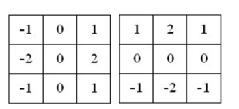

## 一、计算题（每题10分，共60分）

### 计算题1 焦距计算距离

### 计算题2 性能度量计算 

#### 解题步骤
#### 已知条件
- 受测者总数：1000 人
- 癌症患者人数（正例）：2 人
- 非癌症患者人数（反例）：998 人

#### 模型 I
- 全部判断为没有癌症
- 错误率：2/1000，精度：99.8%

**计算查准率 P、查全率 R 和 F1 分数**

由于模型 I 将所有受测者都判断为无癌症，因此：
- 真正例（TP）：0（因为所有患者都被判断为无癌症）
- 假正例（FP）：0（没有将非患者判断为患者）
- 假负例（FN）：2（2 位患者未被正确识别）
- 真负例（TN）：998（所有非患者都被正确识别）

- **查准率 P**：TP / (TP + FP) = 0 / (0 + 0) → 得出无意义（因为分母为 0）
- **查全率 R**：TP / (TP + FN) = 0 / (0 + 2) = 0
- **F1 分数**：由于 P 无意义，F1 分数也无意义

#### 模型 II
- 2 位患者预测正确
- 4 位反例预测为患病（假正例）
- 错误率：4/1000，精度：99.6%

**计算查准率 P、查全率 R 和 F1 分数**

根据题目描述：
- 真正例（TP）：2（2 位患者正确预测为患病）
- 假正例（FP）：4（4 位非患者被错误预测为患病）
- 假负例（FN）：0（所有患者都被正确识别）
- 真负例（TN）：994（998 - 4 = 994，非患者正确识别为无癌症）

- **查准率 P**：TP / (TP + FP) = 2 / (2 + 4) = 2/6 ≈ 0.333
- **查全率 R**：TP / (TP + FN) = 2 / (2 + 0) = 1.0
- **F1 分数**：2 × P × R / (P + R) = 2 × (2/6) × 1 / (2/6 + 1) = (4/6) / (8/6) = 0.5

#### 结果表格

| 模型    | 错误率    | 精度    | 查准率 P   | 查全率 R | F1 分数 |
| ----- | ------ | ----- | ------- | ----- | ----- |
| 模型 I  | 2/1000 | 99.8% | 无意义     | 0     | 无意义   |
| 模型 II | 4/1000 | 99.6% | ≈ 0.333 | 1.0   | 0.5   |

### 计算题3 图像基本变换

已知A和B两图像，对齐拼接需要将图像A先缩放到二分之一大小，再水平向右平移3个像素。假设以图像水平向右为x轴正方向，纵向向上为y轴正方向建立坐标系。请写出缩放变换矩阵S和平移矩阵T，并根据给定的点 

$$
\mathbf{u} = \begin{bmatrix}10 \\ 6 \\ 1\end{bmatrix}
$$

，求该点变换后的结果。

#### 解题步骤

#### 1\. 缩放变换矩阵S

缩放变换矩阵的形式为：

$$
S = \begin{bmatrix}
s_x & 0 & 0 \\
0 & s_y & 0 \\
0 & 0 & 1
\end{bmatrix}
$$

题目要求将图像A缩放到二分之一大小，因此 

$$
s_x = s_y = 0.5
$$
：

$$
S = \begin{bmatrix}
0.5 & 0 & 0 \\
0 & 0.5 & 0 \\
0 & 0 & 1
\end{bmatrix}
$$

#### 2\. 平移矩阵T

平移变换矩阵的形式为：

$$
T = \begin{bmatrix}
1 & 0 & t_x \\
0 & 1 & t_y \\
0 & 0 & 1
\end{bmatrix}
$$

题目要求将图像水平向右平移3个像素，因此 $$t_x = 3$$
，$$t_y = 0$$：

$$
T = \begin{bmatrix}
1 & 0 & 3 \\
0 & 1 & 0 \\
0 & 0 & 1
\end{bmatrix}
$$

#### 3\. 组合变换矩阵（先缩放后平移）

组合变换矩阵 \(M\) 是将缩放矩阵 \(S\) 和平移矩阵 \(T\) 相乘：

$$
M = T \times S = \begin{bmatrix}
1 & 0 & 3 \\
0 & 1 & 0 \\
0 & 0 & 1
\end{bmatrix}
\times
\begin{bmatrix}
0.5 & 0 & 0 \\
0 & 0.5 & 0 \\
0 & 0 & 1
\end{bmatrix}
=
\begin{bmatrix}
0.5 & 0 & 3 \\
0 & 0.5 & 0 \\
0 & 0 & 1
\end{bmatrix}
$$

#### 4\. 计算变换后的点

给定点 
$$
\mathbf{u} = \begin{bmatrix}10 \\ 6 \\ 1\end{bmatrix}
$$
，应用组合变换矩阵 \(M\)：

$$
\mathbf{v} = M \times \mathbf{u} = \begin{bmatrix}
0.5 & 0 & 3 \\
0 & 0.5 & 0 \\
0 & 0 & 1
\end{bmatrix}
\times
\begin{bmatrix}
10 \\
6 \\
1
\end{bmatrix}
$$

计算过程：

- 第一行：

$$
0.5 \times 10 + 0 \times 6 + 3 \times 1 = 5 + 0 + 3 = 8
$$
- 第二行：

$$
0 \times 10 + 0.5 \times 6 + 0 \times 1 = 0 + 3 + 0 = 3
$$
- 第三行：
$$0 \times 10 + 0 \times 6 + 1 \times 1 = 1$$

因此，变换后的齐次坐标为 
$$mathbf{v} = \begin{bmatrix}8 \\ 3 \\ 1\end{bmatrix}$$

### 计算题4 sobel算子计算图像过滤卷积结果

0填充

过滤图像

对给定的3×3图像和Sobel算子，进行0填充后计算卷积结果。

**答案：**
假设图像为：

$$\begin{bmatrix}
1 & 2 & 3 \\
4 & 5 & 6 \\
7 & 8 & 9
\end{bmatrix}$$

Sobel算子（x方向）：

$$\begin{bmatrix}
-1 & 0 & 1 \\
-2 & 0 & 2 \\
-1 & 0 & 1
\end{bmatrix}$$

0填充后图像变为5×5，计算每个位置的卷积值

### 计算题5 lenet参数计算

以LeNet-5为例，给定第一个卷积层输入通道数为1，输出通道数为6，卷积核大小为5×5；第二个卷积层输入通道数为6，输出通道数为16，卷积核大小为5×5。分别计算这两个卷积层的参数量。

**答案：**
第一个卷积层：

$6×(1×5×5+1) = 156$

第二个卷积层：

$16×(6×5×5 + 1) = 2416$

### 计算题6 

简述Sobel算子、Scharr算子、拉普拉斯算子、Canny算子以及基于深度学习的边缘检测方法的原理，并比较它们的特点和效果。

**答案：**
- Sobel算子：利用图像灰度的梯度信息检测边缘，对噪声有一定抑制作用，但边缘定位精度一般。
- Scharr算子：与Sobel类似，但权重不同，对梯度的估计更准确。
- 拉普拉斯算子：二阶导数算子，能检测出图像中的突变点，但对噪声敏感。
- Canny算子：多阶段检测，包括高斯滤波、梯度计算、非极大值抑制和双阈值检测，边缘检测效果较好。
- 深度学习方法：通过训练卷积神经网络自动学习边缘特征，能处理复杂场景，效果最佳但计算资源需求高。

- **Sobel算子**：能够检测边缘的方向和强度，适合提取水平和垂直边缘，但对噪声有一定敏感性。
- **拉普拉斯算子**：对噪声非常敏感，容易产生伪边缘，且无法区分边缘方向。
- **DoG**：通过高斯差分抑制噪声，边缘检测效果较平滑，能近似拉普拉斯算子。
- **LoG**：先平滑再检测，能有效抑制噪声，边缘定位较准确。
- **Canny**：多阶段处理，抗噪声能力强，边缘定位精确，是实际应用中常用的边缘检测方法。

## 二、论述题（每题20分，共40分）

**1.角点检测及图像拼接**
论述角点检测在图像拼接中的重要性，详细说明图像拼接的流程，包括坐标变换前的关键点检测方法（至少列举三种），以及拼接过程中平移、旋转等操作的顺序和作用。

**答案：**
角点检测用于找到图像中的特征点，这些点在图像拼接中作为匹配依据，帮助确定图像间的几何变换关系，是实现精准拼接的关键。
图像拼接流程：
1. 关键点检测（如Harris、SIFT、ORB等方法）。
2. 特征匹配，找到两图之间的对应点对。
3. 根据匹配点计算几何变换（如平移、旋转、缩放等），通常先旋转再平移，以使图像对齐。
4. 应用坐标变换将图像变换到同一坐标系。
5. 图像融合，处理重叠区域使拼接自然。

**2.SIFT和HoG算法**
阐述SIFT（尺度不变特征变换）和HoG（梯度方向直方图）算法的全称、工作步骤及每一步的功能，比较两者在特征提取方面的异同，并说明它们在计算机视觉领域的应用场景。

**答案：**
SIFT步骤：
1. 构建高斯差分金字塔检测特征点。
2. 定位关键点并确定其主方向。
3. 生成关键点描述子。

HoG步骤：
4. 计算图像梯度。
5. 构建梯度方向直方图。
6. 块归一化。
7. 生成描述子。

异同：SIFT基于关键点的局部图像信息，对尺度和旋转变化鲁棒；HoG基于图像梯度信息，对形状特征描述能力强，但对旋转和尺度变化适应性不如SIFT。
应用场景：SIFT用于图像匹配、拼接、目标识别等；HoG多用于目标检测，如行人检测。

3.人类视觉产生的过程

## 三、图像分类方法（每题10分，共20分）
比较最近邻方法、逻辑回归模型和支持向量机在图像分类中的优缺点，并简述图像分类的一般步骤和流程。

**答案：**
最近邻方法：简单直观，但计算复杂度高，对特征空间的维度敏感。
逻辑回归：模型简单，适合二分类，对线性可分数据效果好，但对非线性数据有限制。
支持向量机：通过寻找最优分类超平面最大化分类间隔，对高维数据有效，但参数选择影响结果。
图像分类流程：
1. 数据预处理（归一化、增强等）。
2. 特征提取（如使用CNN自动提取特征）。
3. 训练分类模型。
4. 用测试集评估模型性能。
5. 调整模型参数优化性能。