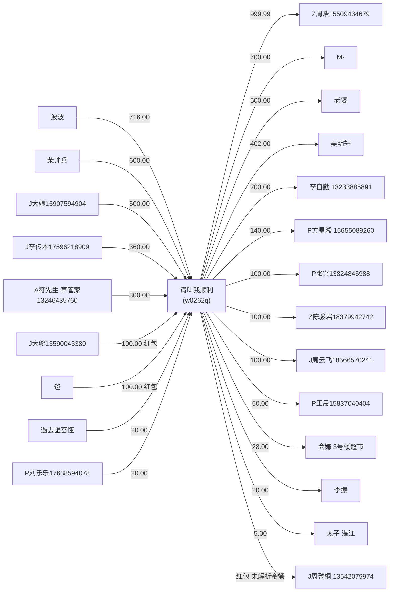

# 周子港流水记录分析报告

## 1. 数据范围
- 数据目录：`C:\Users\Y0ungK1ng\Desktop\周子港流水记录`
- 样本文件数：23 个 CSV（每个文件 1 条交易记录）
- 主账号（来源账号/中心账号）：`w0262q`（昵称：请叫我顺利）
- 时间区间：2026-02-12 22:22:44 至 2026-04-14 14:16:30

## 2. 交易统计总览
- 总交易笔数：23
- 收入笔数：9
- 支出笔数：14
- 收入总额：2716.00 元
- 支出总额：3344.99 元
- 净流向（收入-支出）：-628.99 元

> 备注：存在 1 笔红包记录未提取到金额（`J周馨桐 13542079974`），按 0 元计入统计。

## 3. 类型分布
- 转账：20 笔
- 红包：3 笔

## 4. 对手方资金往来

### 4.1 收入（对方 -> 请叫我顺利）
| 对手方 | 金额(元) | 笔数 |
|---|---:|---:|
| 波波 | 716.00 | 1 |
| 柴帅兵 | 600.00 | 1 |
| J大娘15907594904 | 500.00 | 1 |
| J李传本17596218909 | 360.00 | 1 |
| A符先生🚘車管家13246435760 | 300.00 | 1 |
| J大爹13590043380 | 100.00 | 1 |
| 爸 | 100.00 | 1 |
| ꦿᮨ້໌࿐過去誰荟懂ღ᭄ | 20.00 | 1 |
| P刘乐乐17638594078 | 20.00 | 1 |

### 4.2 支出（请叫我顺利 -> 对方）
| 对手方 | 金额(元) | 笔数 |
|---|---:|---:|
| Z周浩15509434679 | 999.99 | 1 |
| M- | 700.00 | 1 |
| 老婆 | 500.00 | 1 |
| 吴明轩 | 402.00 | 1 |
| 李自勤，13233885891 | 200.00 | 1 |
| P方星淞 15655089260 | 140.00 | 1 |
| P张兴13824845988 | 100.00 | 1 |
| Z陈骏岩18379942742 | 100.00 | 1 |
| J周云飞18566570241 | 100.00 | 1 |
| P王晨15837040404 | 50.00 | 1 |
| 会娜（3号楼超市） | 28.00 | 1 |
| 李振 | 20.00 | 1 |
| 太子（湛江） | 5.00 | 1 |
| J周馨桐 13542079974 | 0.00* | 1 |

## 5. 关键观察
- 整体为净流出，支出高于收入 628.99 元。
- 单笔最大流入：716.00 元（波波 -> 请叫我顺利）。
- 单笔最大流出：999.99 元（请叫我顺利 -> Z周浩15509434679）。

## 6. 流水关系图（Mermaid）

