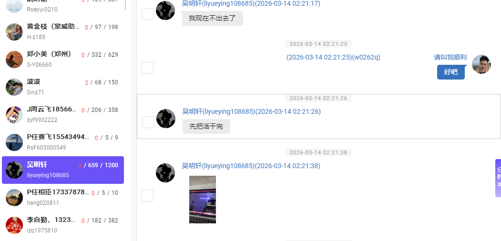
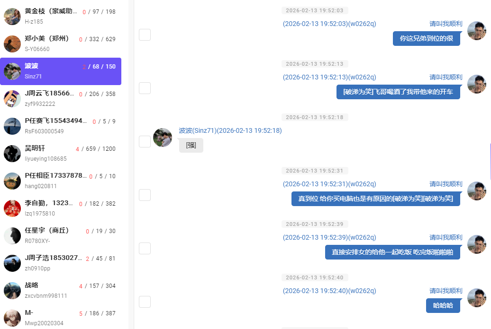
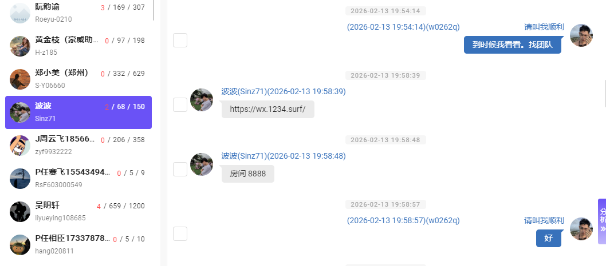
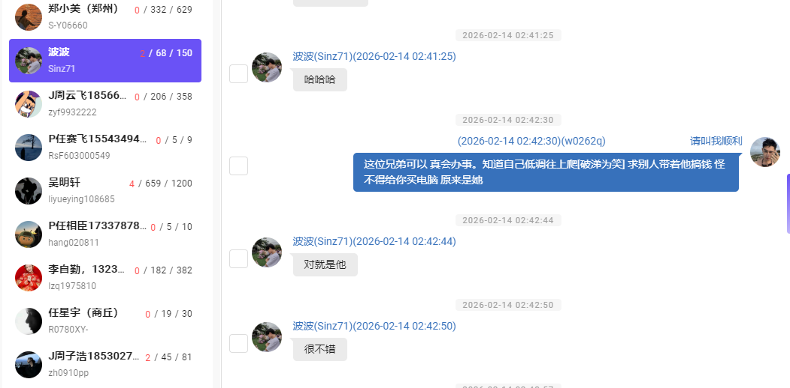
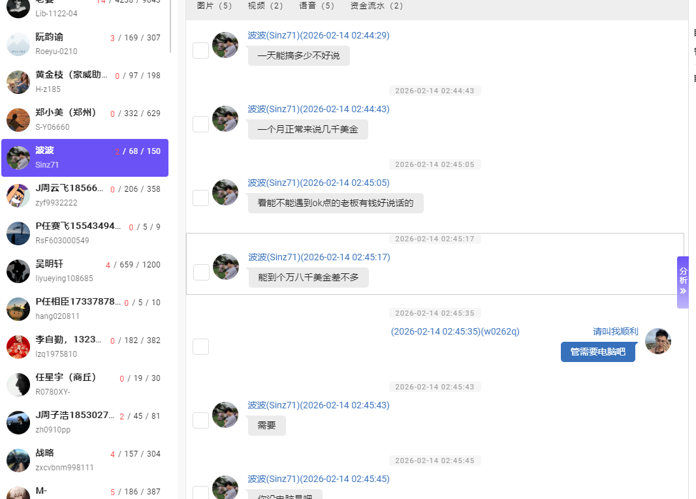
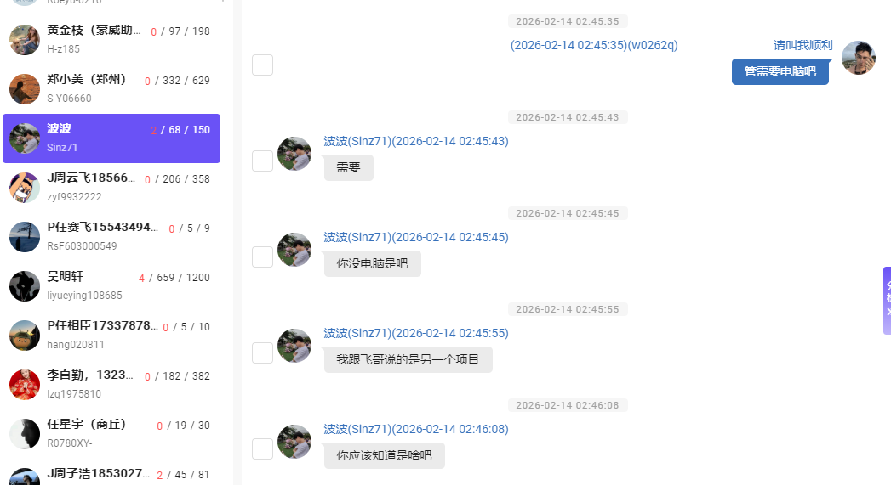
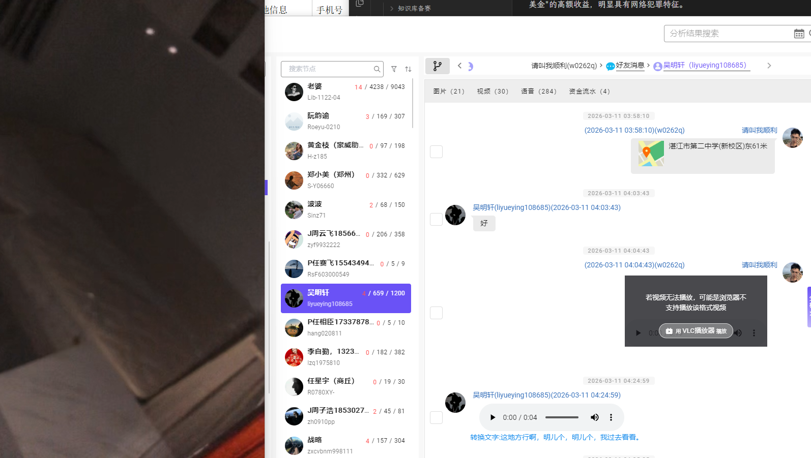
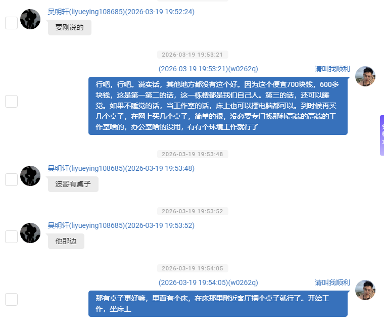
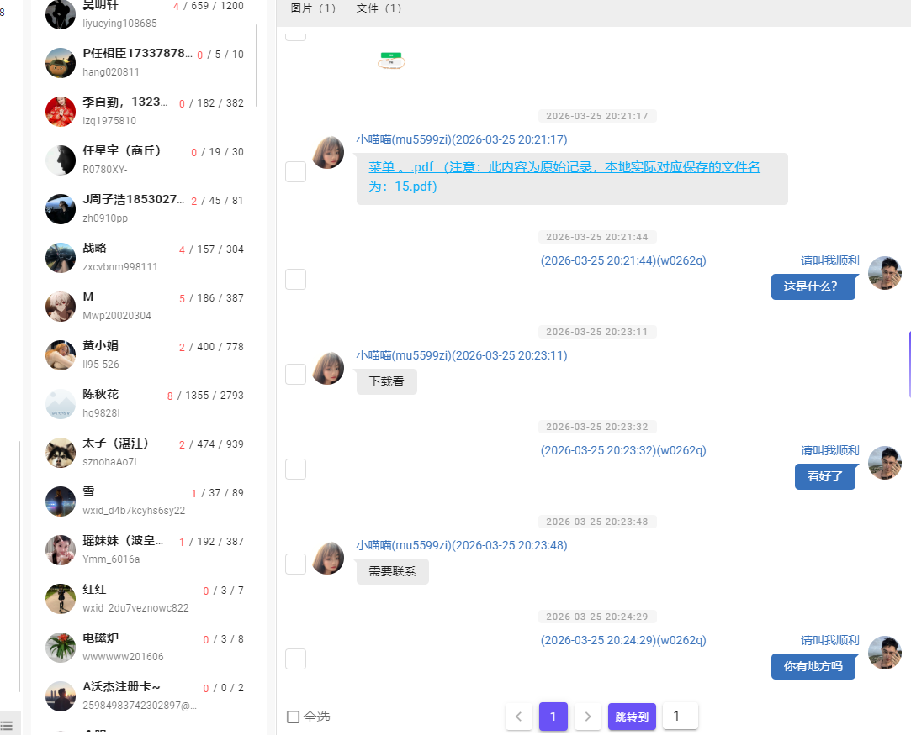
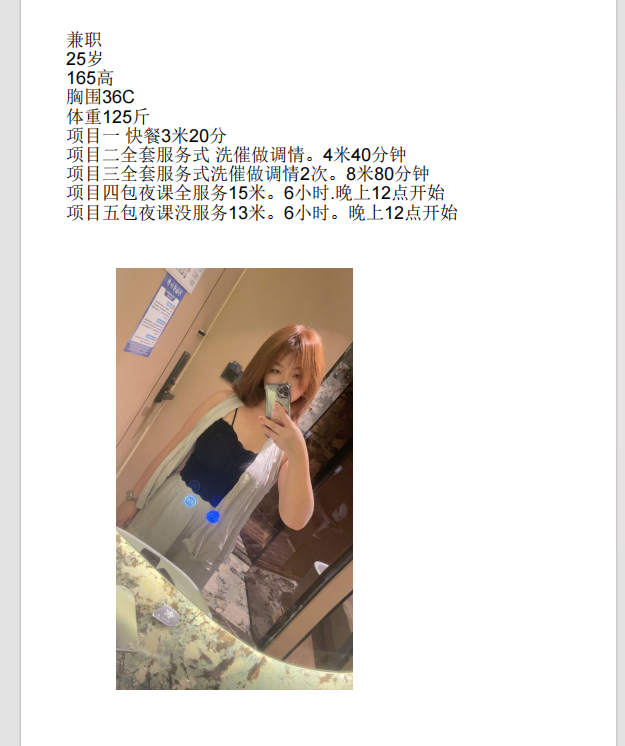

## 一、关键人物识别

### 1. 主要嫌疑人
- **周子港**（账号：ㅤㅤㅤㅤㅤㅤㅤㅤ请叫我顺利，ID：w0262q）
- **波波**（ID：Sinz71）
- **J周云飞18566570241**（ID：zyf9932222）
- **吴明轩**（ID：liyueying108685）

### 2. 群组信息
- **群组名称**：49765117379@chatroom
- **群组成员**：波波、福多多、J周云飞18566570241、吴明轩、ㅤㅤㅤㅤㅤㅤㅤㅤ请叫我顺利
- **群组创建时间**：2026-03-19 20:08:54

### 3.好友关键消息

吴明轩-代码编辑照片

---

## 二、重要时间线与关键信息点

### 2026年2月13日 - 项目初步接触
**时间**：2026-02-13 19:51:57 - 02:53:41
**涉及人物**：周子港、波波
**关键对话**：
- 19:52:31 - "真到位 给你买电脑也是有原因的"
- 19:52:39 - "直接安排女的给他一起吃饭 吃完饭啪啪啪"
- 19:53:16 - "搞钱"
- 19:54:14 - "到时候我看看。找团队"
- 19:58:39 - 波波发送链接：https://wx.1234.surf/
- 19:58:48 - "房间 8888"

**分析**：此时间段显示了犯罪团伙的初步接触和项目介绍，涉及"搞钱"、"找团队"等关键词，并提供了可疑链接。

### 2026年2月14日 - 项目收益讨论
**时间**：2026-02-14 02:42:30 - 02:47:05
**涉及人物**：周子港、波波
**关键对话**：
- 02:42:30 - "这位兄弟可以 真会办事。知道自己低调往上爬"
- 02:42:57 - "我在老家待多久"
- 02:43:05 - "你要不你跟他学建站"
- 02:43:31 - "麻烦不我怕我搞不懂" [已撤回]
- 02:44:16 - "一天能搞多少"
- 02:44:43 - "一个月正常来说几千美金"
- 02:45:05 - "看能不能遇到ok点的老板有钱好说话的"
- 02:45:17 - "能到个万八千美金差不多"
- 02:45:35 - "管需要电脑吧"
- 02:45:43 - "需要"
- 02:45:45 - "你没电脑是吧"
- 02:45:55 - "我跟飞哥说的是另一个项目"
- 02:46:08 - "你应该知道是啥吧"

**分析**：此时间段详细讨论了项目的收益情况，提到了"建站"、"电脑"、"几千美金到万八千美金"的高额收益，明显具有网络犯罪特征。

### 2026年3月11日 - 房屋租赁活动
**时间**：2026-03-11 03:58:10 - 23:12:23
**涉及人物**：周子港、吴明轩
**关键活动**：
- 03:58:10 - 发送位置信息：湛江市第二中学(新校区)东61米
- 04:03:43 - 发送视频消息（视频里是看房信息）
- 04:24:59 - 语音消息："这地方行啊，明儿个，明儿个，我过去看看。"
- 18:34:17 - "在路上了"
- 18:58:11 - 发送位置：猫小侠烤肉(地摊)[广东省湛江市霞山区永平北路9号]

**分析**：此时间段显示了犯罪团伙的线下活动，包括房屋租赁和会面，可能是为了建立作案基地。

### 2026年3月26日 - 可疑软件下载链接
**时间**：2026-03-26 13:24:26 - 14:39:36
**涉及人物**：周子港、吴明轩
**关键对话**：
- 13:24:26 - 发送网页消息：洱海看过了，大海看过了，带你们看看"菠萝的海"
- 13:33:57 - 发送网页消息：来打卡广东湛江徐闻菠萝的海啦！
- 14:25:23 - **吴明轩发送可疑链接**：https://download.dx8nbvl2.com/app/d36j0t1v.zip
- 14:26:06 - **吴明轩发送可疑链接**：https://scdy03.scsub.com/apiv2/16eifglrzvlkrzja?sub=2&extend=1
- 14:36:19 - **吴明轩发送可疑链接**：https://download.gameddns.com/download/Clash.Verge_2.3.1_x64-setup.exe
- 14:39:36 - **吴明轩发送可疑链接**：https://em.mesl.cloud/ems/get?token=e7119acb714ed8b7abeafffef2116b1d

**分析**：此时间段发现了多个可疑的下载链接，包括zip压缩包、exe可执行文件等，这些链接可能与木马程序相关。

---

## 三、关键证据分析

### 1. 可疑下载链接分析

#### 链接1：https://download.dx8nbvl2.com/app/d36j0t1v.zip
- **发送时间**：2026-03-26 14:25:23
- **发送者**：吴明轩
- **接收者**：周子港
- **文件类型**：zip压缩包
- **可疑特征**：
  - 域名使用随机字符（dx8nbvl2）
  - 文件名使用随机字符（d36j0t1v）
  - 压缩包可能包含恶意程序

#### 链接2：https://scdy03.scsub.com/apiv2/16eifglrzvlkrzja?sub=2&extend=1
- **发送时间**：2026-03-26 14:26:06
- **发送者**：吴明轩
- **接收者**：周子港
- **文件类型**：API接口
- **可疑特征**：
  - 参数包含sub=2和extend=1，可能是订阅或扩展参数
  - URL路径使用随机字符（16eifglrzvlkrzja）
  - 可能是AI的api地址

#### 链接3：https://download.gameddns.com/download/Clash.Verge_2.3.1_x64-setup.exe
- **发送时间**：2026-03-26 14:36:19
- **发送者**：吴明轩
- **接收者**：周子港
- **文件类型**：exe可执行文件
- **可疑特征**：
  - 文件名为Clash.Verge_2.3.1_x64-setup.exe
  - Clash是代理软件，可能用于网络攻击或绕过检测
  - 下载clash翻墙软件

#### 链接4：https://em.mesl.cloud/ems/get?token=e7119acb714ed8b7abeafffef2116b1d
- **发送时间**：2026-03-26 14:39:36
- **发送者**：吴明轩
- **接收者**：周子港
- **文件类型**：云端下载
- **可疑特征**：
  - 使用token参数进行身份验证
  - 域名使用mesl.cloud，可能是云存储服务

### 2. 建站与项目收益分析

#### 建站讨论
- **时间**：2026-02-14 02:43:05
- **对话内容**："你要不你跟他学建站"
- **分析**：
  - "建站"可能是建立钓鱼网站或恶意网站的掩护
  - 通过建站可以传播木马程序或进行网络诈骗
  - 符合"在网上投放木马程序非法控制他人计算机信息系统"的作案手法

#### 项目收益讨论
- **时间**：2026-02-14 02:44:43 - 02:45:17
- **对话内容**：
  - "一个月正常来说几千美金"
  - "能到个万八千美金差不多"
- **分析**：
  - 高额收益表明这不是正常的合法项目
  - 使用美金结算，可能涉及跨境犯罪
  - 收益波动大，取决于"遇到ok点的老板"，符合诈骗特征

### 3. 团队组织结构分析

#### 团队分工
- **周子港**：主要负责人，负责团队协调和项目推进
- **波波**：技术指导，负责建站和项目实施
- **J周云飞18566570241**：执行人员，负责具体操作
- **吴明轩**：技术支持，负责软件下载和配置

#### 团队活动
- **线下会面**：多次在湛江地区会面，讨论项目进展
- **房屋租赁**：租赁房屋作为作案基地
- **搬迁计划**：计划搬迁到郑州，可能是为了扩大作案范围

---

## 四、与木马程序非法控制计算机信息系统的关联性分析

### 1. 技术手段关联
- **建站技术**：通过建立恶意网站传播木马程序
- **软件下载**：通过可疑链接分发木马程序
- **代理软件**：使用Clash等代理软件绕过检测
- **远程控制**：通过API接口实现远程控制

### 2. 作案手法关联
- **高额收益**：通过非法控制计算机信息系统获取经济利益
- **团队作案**：组织化、专业化的犯罪团伙
- **跨境作案**：使用美金结算，可能涉及境外犯罪
- **技术隐蔽**：使用随机域名和文件名，逃避检测

### 3. 时间线关联
- **2026年2月**：项目初步接触和建站讨论
- **2026年3月**：建立作案基地和软件配置
- **2026年4月**：项目实施和收益分配矛盾
，查明非法收益的来源和去向
- 加强网络安全监管，防止类似犯罪活动的发生

# 其余涉黄信息

