------

:::card
**挂载/解压密码:** `/TP2G-h`q#(Ss!EUq,RR:Ss9"@!R"{-.kNw+-(gwGq.YLDS-|NEWH(GT3;6;`
:::

## 服务器

### 站点服务器配置

关防火墙
```
systemctl stop firewalld
```

查看网卡设置，是`dhcp`动态设置，直接将网卡设为NAT即可
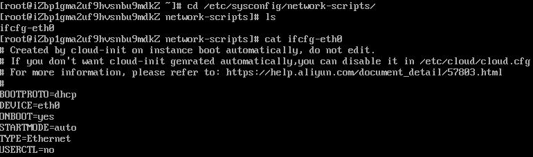

ip为`192.168.142.130`，后面为与数据库服务器连接成功，要改成160

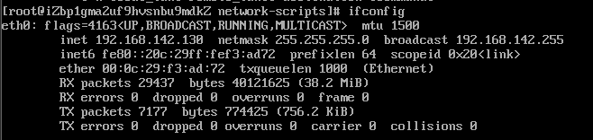

远程连接

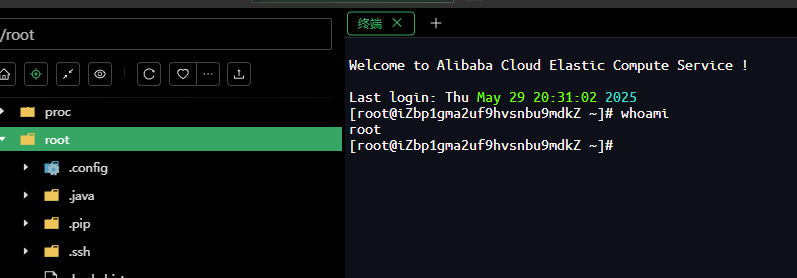

### 数据库服务器配置

是静态网络，改NAT配置
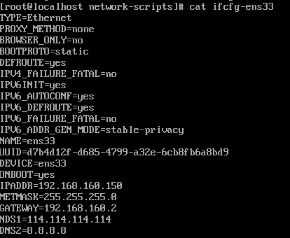

改网段和网卡，关DNCP即可
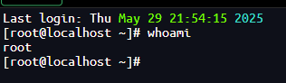


### 1. 对服务器检材进行分析，站点服务器可能是从哪个云服务平台上调证过来的？（填写汉字，答案格式：亿速云）

答案：`阿里云`

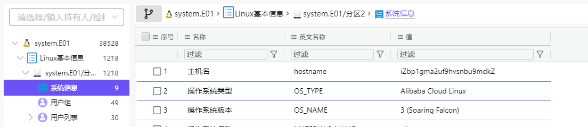

### 2. 对服务器检材进行分析，站点服务器中数据库的密码是？（按实际值填写）

答案：`Sxy000**`

看历史命令可以看出是一个java架构的网站

找到网站包，并反编译


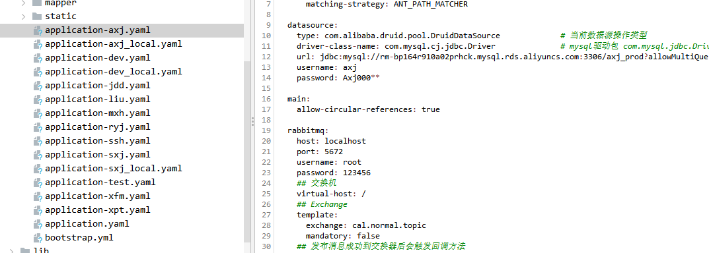
有很多个不同的密码，无法确定

远程连接输入`history`
发现

``` bash
java -jar cal-0.0.1-SNAPSHOT.jar --spring.profiles.active=sxj
```

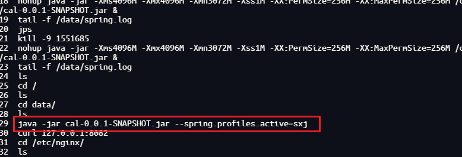

Java 命令后激活了名为 “sxj” 的配置文件，所以直接看配置文件`sxj`

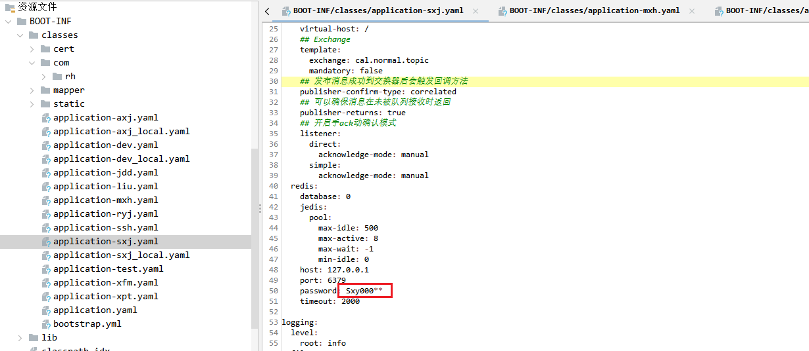

也可以从主配置文件中看到

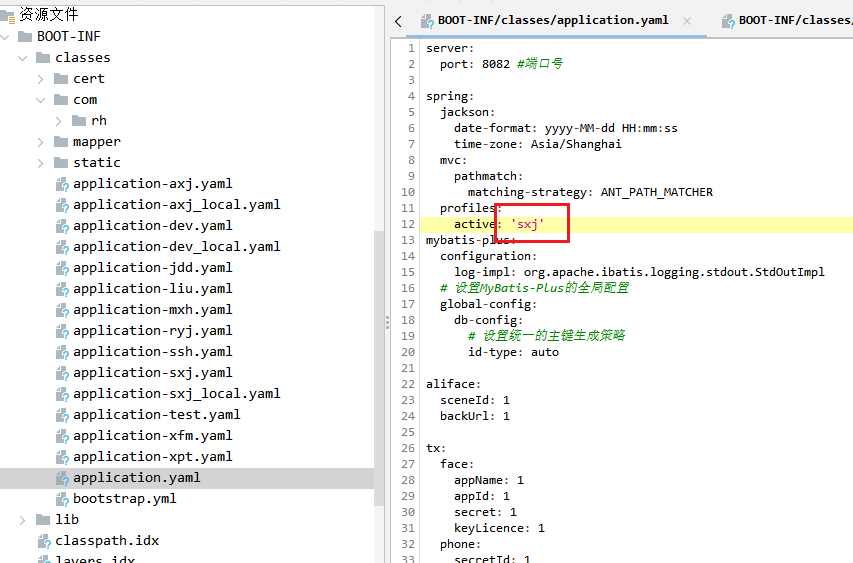

::: collapse
- 代码
	``` yaml
	server:
	  port: 8082 #端口号
	  
	spring:
	  mvc:
	    pathmatch:
	      matching-strategy: ANT_PATH_MATCHER
	  
	  datasource:
	    type: com.alibaba.druid.pool.DruidDataSource             # 当前数据源操作类型
	    driver-class-name: com.mysql.cj.jdbc.Driver              # mysql驱动包 com.mysql.jdbc.Driver
	  
	    url: jdbc:mysql://rm-bp18td28bsh13f5jy.mysql.rds.aliyuncs.com:3306/sxj_prod?allowMultiQueries=true&useUnicode=true&autoReconnect=true&useAffectedRows=true&useSSL=false&serverTimezone=Asia/Shanghai
	  
	    username: sxy
	    password: Sxy000**
	  
	……
	  
	  redis:
	    database: 0
	    jedis:
	      pool:
	        max-idle: 500
	        max-active: 8
	        max-wait: -1
	        min-idle: 0
	    host: 127.0.0.1
	    port: 6379
	    password: Sxy000**
	    timeout: 2000
	```
:::

这里有两个数据库，一个`datasource` (关系型数据库)和一个`redis` (键值存储数据库)

不过幸好两个密码都是：`Sxy000**`


### 3. 对服务器检材进行分析，站点服务器用于提供服务发现的工具名是？（答案格式：zookeeper）

答案：`consul`

Zookeeper、Etcd和Consul等开源框架已经实现了服务发现的常用功能，如服务注册、==发现==、监控、通知等

查看有无这些应用

可以从历史命令
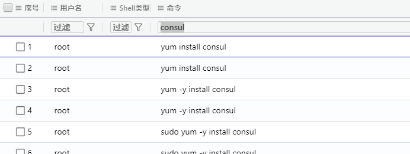


### 4. 对服务器检材进行分析，站点服务器数据库配置文件名是？（答案格式：database.php）

答案：`application-sxj.yaml`

对应第二题

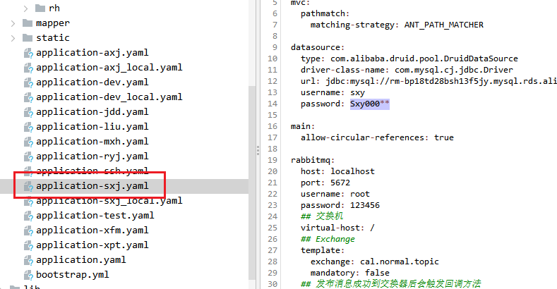


### 5. 对服务器检材进行分析，该网站涉及的APP名称是？（答案格式：微信）

答案：`顺心借`

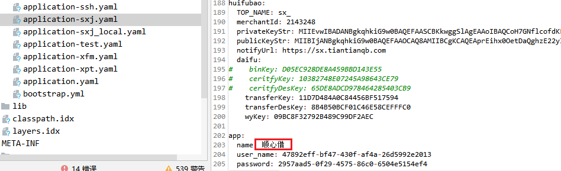


### 6. 对服务器检材进行分析，该网站用于存储大量身份证照的OSS中的AccessKeyID后八位是？（答案格式：按实际值填写）

答案：`LTAI5tBt7rHreKjDEuZJybzD`

`OSS`是一种对象存储服务

`AccessKeyID`一般查看配置即可

``` yaml
accessKeyId: LTAI5tBt7rHreKjDEuZJybzD
```

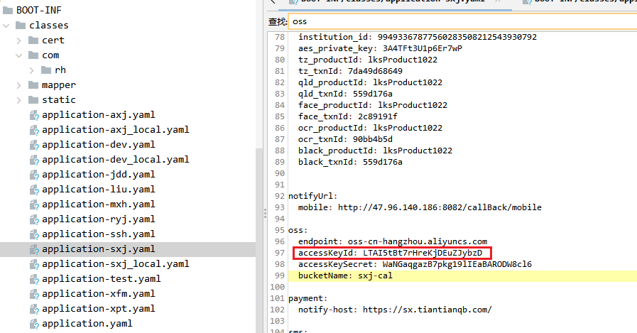


### 7. 对服务器检材进行分析，站点服务器用于消息转发代理工具所使用的端口号是？（填写数字，答案格式：3306）

答案：`5672`


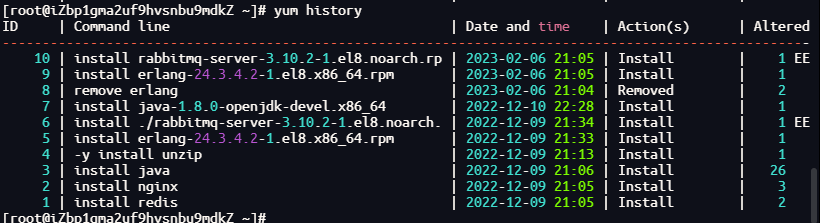

其中`RabbitMQ` 是一个开源的消息代理（Message Broker），它遵循 Advanced Message Queuing Protocol（AMQP）标准。


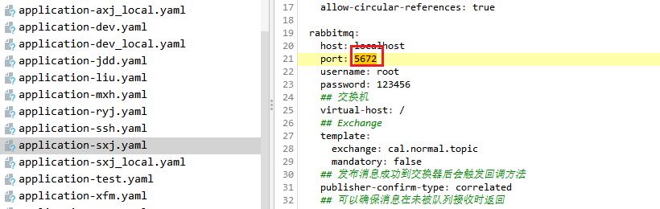


### 8. 对服务器检材进行分析，站点服务器用于启动定时任务的代码片段存在于？（答案格式：LoginIndex.class）

答案：`MobileStatusTask.class`

开始`crontab -l`没有定时任务

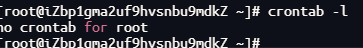

可能就在java包里了
爆搜

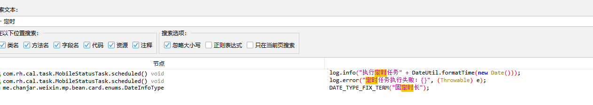


`MobileStatusTask.class`

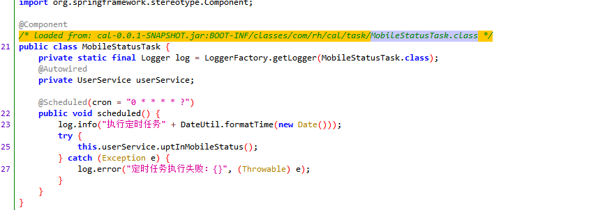


### 9. 对服务器检材进行分析，站点服务器用于验证用户输入的验证码是否匹配的代码片段存在于？（答案格式：LoginIndex.class）

答案：`AssertUtil.class`

直接爆搜，看到验证码错误就是有关验证输入的
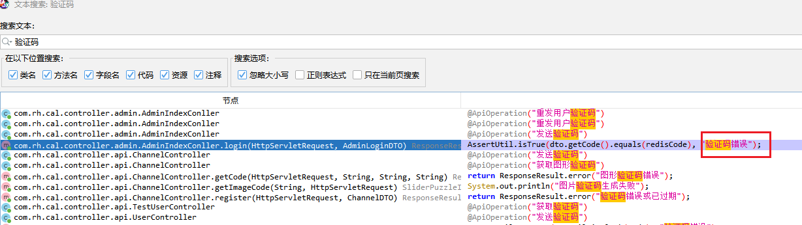


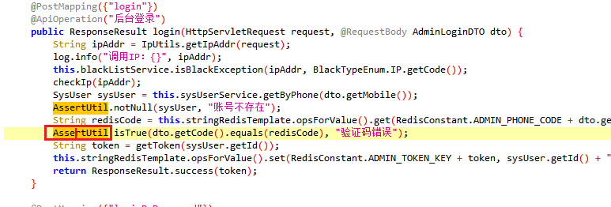

找到这个类

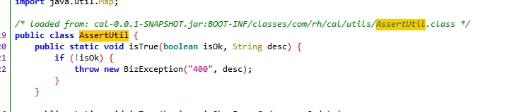


### 10. 对服务器检材进行分析，数据库服务器中Docker容器镜像中mysql的镜像ID号前6位是？（答案格式：123asd）

答案：`23b013`


==这里是镜像ID，不是容器ID=={.danger}

```
23b013c7c67d3b04af02965f22eea2f35279b4a5c39a2eec6698a840c511b042
```


### 11. 对服务器检材进行分析，数据库服务器中DockerCompose的版本号是？（答案格式：1.1.1）

答案：`2.27.1`

``` bash
systemctl start docker
```

开启容器

``` bash
docker compose version
```


### 12. 对服务器检材进行分析，数据库服务器中用于存储后台登录账号的数据表名是？（答案格式：login）

答案：`sys_user`


已知数据库是`mysql`

``` bash
docker ps -a
docker start f2
```

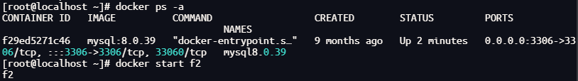


``` bash
docker exec -it mysql8.0.39 bash

mysql -u root -p 
```

输入密码发现一直错误——选择绕密
(密码尝试的是docker配置中的)

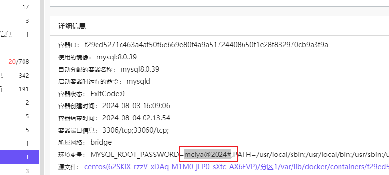

```php
systemctl stop firewalld

docker exec -it mysql8.0.39 bash

sed -i '/\[mysqld\]/a skip-grant-tables' /etc/my.cnf

exit

docker restart mysql8.0.39

docker exec -it mysql8.0.39 bash

mysql -u root -p  # 不用输入密码，直接两次回车即可

FLUSH PRIVILEGES;

ALTER USER 'root'@'localhost' IDENTIFIED BY '123456';

ALTER USER 'root'@'%' IDENTIFIED BY '123456';

FLUSH PRIVILEGES;

exit
    
sed -i "s/skip-grant-tables/ /" /etc/my.cnf   #删除skip-grant-tables后重启容器（不删除无法正常从外部连接）
    
exit
    
docker restart mysql8.0.39
```

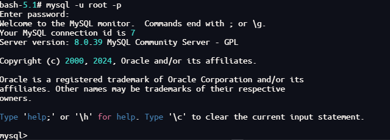

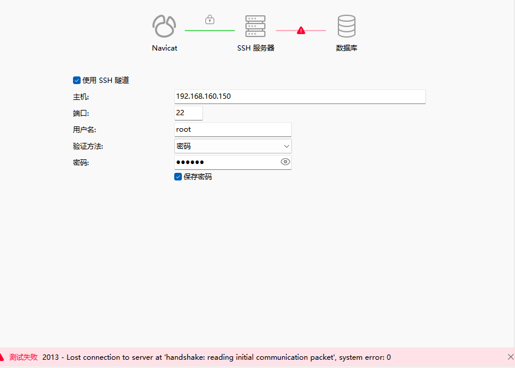

直接连还不行，还得删除权限

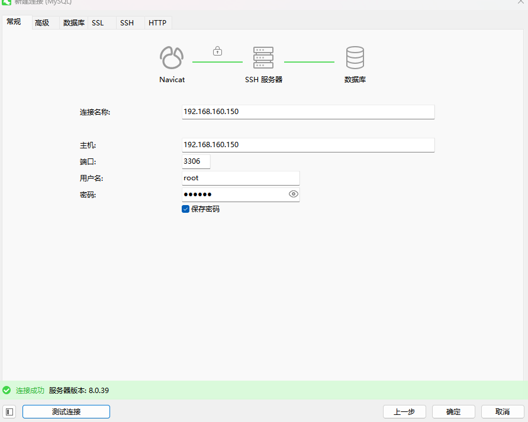

成功连接

数据表为`sys_user`


### 13. 对服务器检材进行分析，后台管理员“xpt-0”所绑定的手机号码是？（答案格式：13001880188）

答案：`1857`

直接可以看出
19521510863

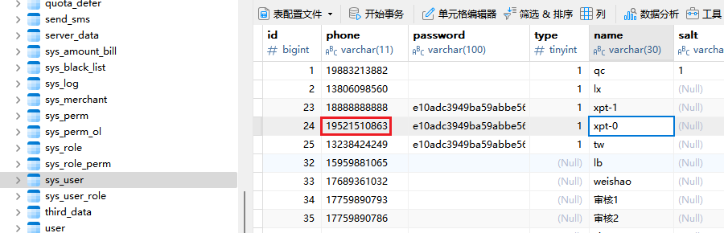


### 14. 对服务器检材进行分析，用户首次借款初始额度是？（填写数字，答案格式：1）

答案：`4000`

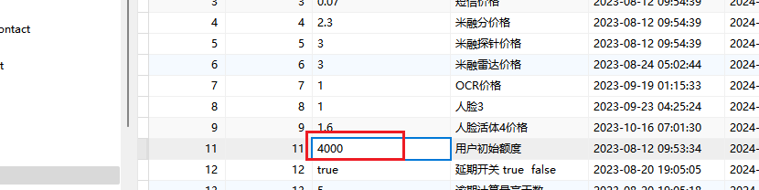


### 15. 对服务器检材进行分析，受害者在平台中一共结款了几次？（填写数字，答案格式：1）

答案：`4000`

开始重构网站

启动服务器之后，可以扫一下端口，看都有哪些服务

`82`端口找到`顺心借`

#### （1）mysql创建用户


数据库连接信息里没有配置里的sxy用户，所以需要创建一个用户并授权


```sql
docker exec -it mysql8.0.39 bash

mysql -u root -p  # 输入密码123456

CREATE USER 'sxy'@'%' IDENTIFIED WITH mysql_native_password BY 'Sxy000**';  

GRANT ALL PRIVILEGES ON sxj_prod.* TO 'sxy'@'%';

FLUSH PRIVILEGES;
```

可以验证添加成功

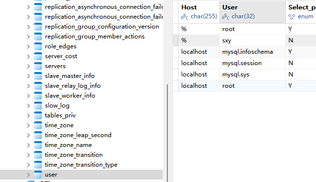

接下来对管理员参数进行修改，不然会显示用户被禁用
```
docker exec -it mysql8.0.39 bash
mysql -u root -p  # 输入密码123456
update sxj_prod.sys_user SET state=0 WHERE id=24
```
#### （2）修改host文件

F12查看网络信息，接受验证码ip（47.96.140.186）不对。如果要成功登录，需要通过system的rabbitmq接收，并与redis存储验证码数据比较，所以先要修改host，让网络转到system的ip上

```bash
#将主机名映射到ip地址上，编辑hosts文件

vi /etc/hosts

#在其中添加下列代码，第一行是rabbitmq服务，第二行是将阿里云的地址映射到本地

127.0.0.1    iZbp1gma2uf9hvsnbu9mdkZ   iZbp1gma2uf9hvsnbu9mdkZ  #system的ip

192.168.160.150   rm-bp18td28bsh13f5jy.mysql.rds.aliyuncs.com     #data的ip

#修改后台跳转地址为本机地址

cd /www/admin/

find ./ -type f  -exec sed -i 's/47.96.140.186/192.168.160.128/g' {} +    #system的ip
```

#### （3）固定redis验证码

查看jar源代码，发现是将验证码和redisCode进行比较，所以验证码应该是需要存入redis中的

``` bash
systemctl start redis
redis-cli -a Sxy000**

SET ADMIN-PHONE19521510863 1234
EXPIRE ADMIN-PHONE19521510863 600
```

#### （4）启动所有服务

```bash
#启动rabbitmq服务

systemctl start rabbitmq-server

#root目录下启动consul服务

cd /root

./consul.sh

#data目录下启动jar包脚本

cd /data

./jar.sh
```

登入即可
```
19521510863:1234
```

成功复现（笔者目前遇到最难复现的网站）
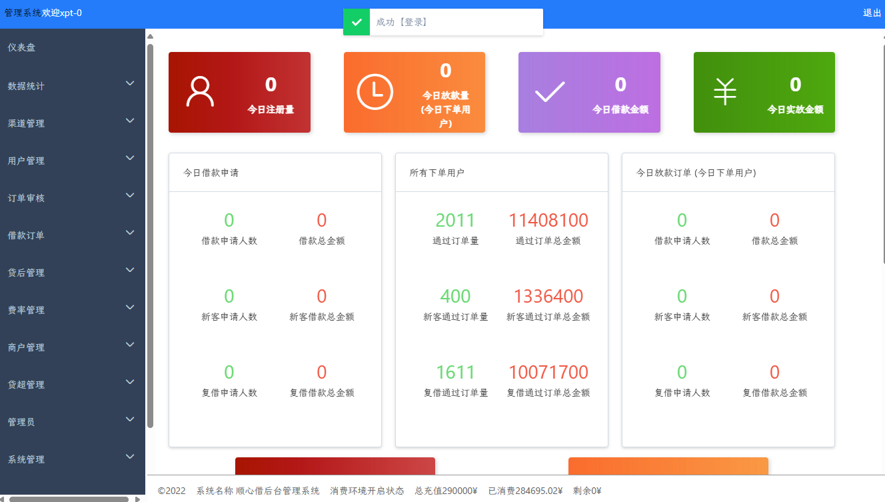

总共受害人共`1857`
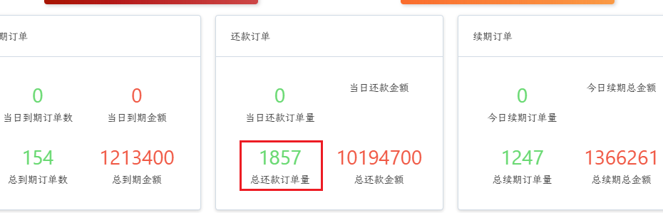


### 16. 对服务器检材进行分析，该平台中所有下单用户成功完成订单总金额是？（填写数字，答案格式：1）

答案：`11408100`

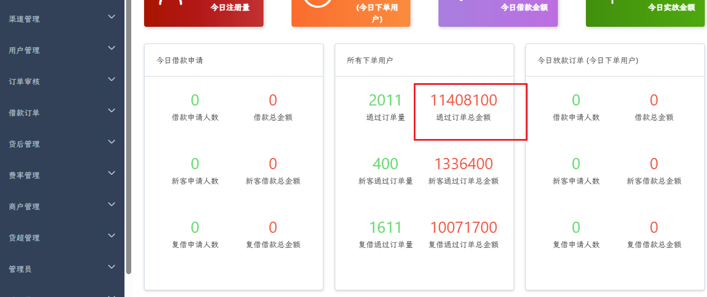


### 17. 对服务器检材进行分析，该平台中逾期费率是？（答案格式：1.1）

答案：`0.1`

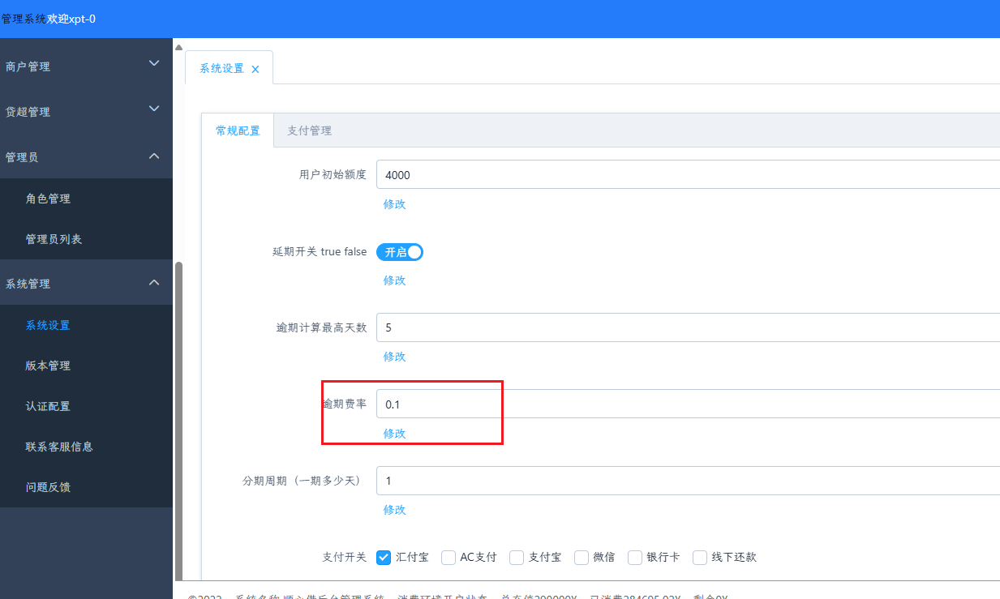


### 18. 对服务器检材进行分析，该平台中累计还款总金额是？（填写数字，答案格式：1）

答案：`10194700`

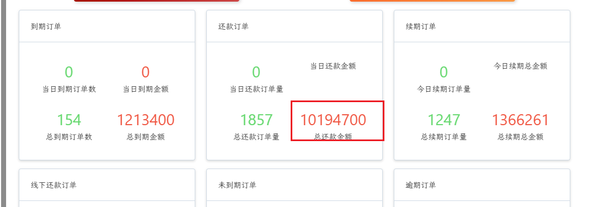


### 19. 对服务器检材进行分析，该平台总共设置了多少种借款额度？（填写数字，答案格式：1）

答案：`18`

一个禁用了，其余正常 19 - 1 = 18。

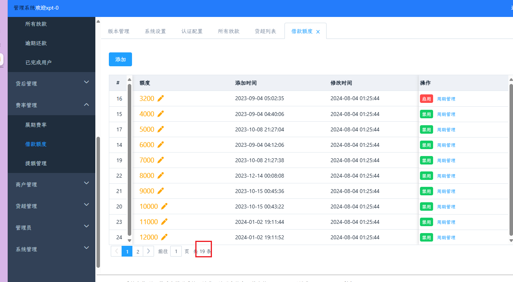

### 20. 对服务器检材进行分析，该平台一共有多少个借款渠道？（填写数字，答案格式：1）

答案：`131`

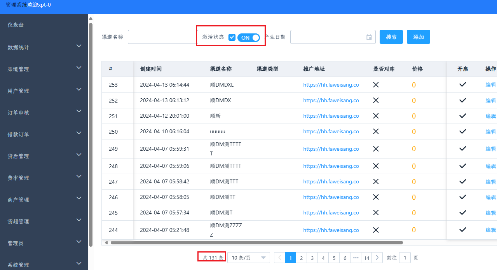


### 21. 对服务器检材进行分析，该平台对已完成用户收取了总计多少元服务费，结果精确到整数？（填写数字，答案格式：123）

答案：`4051915`

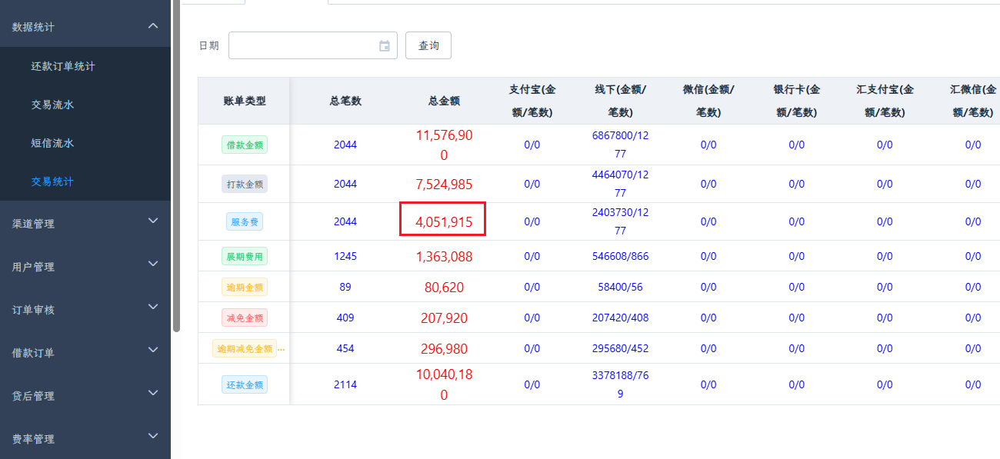