## 任务书

2025年4月，杭州滨江警方接到辖区内市民刘晓倩(简称：倩倩)报案称：其个人电子设备疑似遭人监控。经初步调查，警方发现倩倩的手机存在可疑后台活动，手机可能存在被木马控制情况；对倩倩计算机进行流量监控，捕获可疑流量包。遂启动电子数据取证程序。

警方通过对倩倩手机和恶意流量包的分析，锁定一名化名“起早王”的本地男子。经搜查其住所，警方查扣一台个人电脑和服务器。技术分析显示，该服务器中存有与倩倩设备内同源的特制远控木马，可实时窃取手机摄像头、手机通信记录等相关敏感文件。进一步对服务器溯源，发现“起早王”曾渗透其任职的科技公司购物网站，获得公司服务器权限，非法窃取商业数据并使用公司的服务器搭建Trojan服务并作为跳板机实施远控。

请你结合以上案例并根据相关检材，完成下面的勘验工作。

| 容器密码：早起王的爱恋日记❤ |
| -------------- |

## 服务器

### 重构

直接改nat就能ssh了
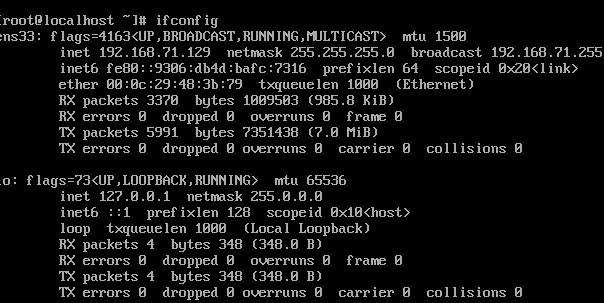

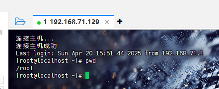、

同时有bt面板
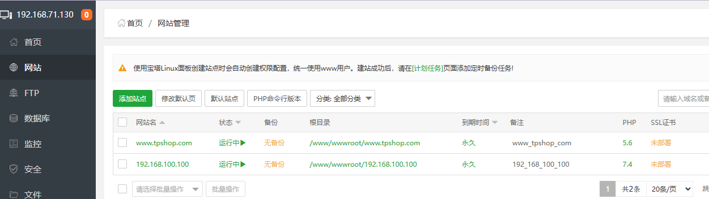

之后连接数据库
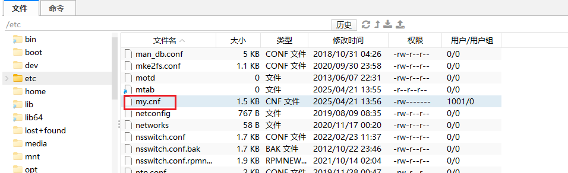

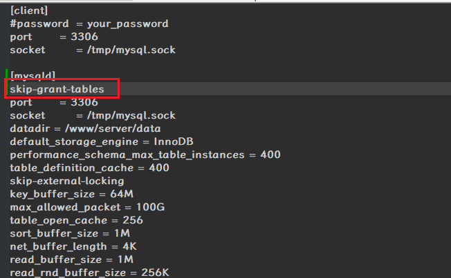

之后重启
`sudo systemctl restart mysqld`


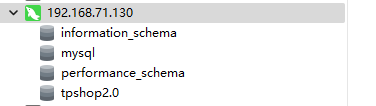

连接成功，但是表空的，需要去找备份文件

数据库运行即可
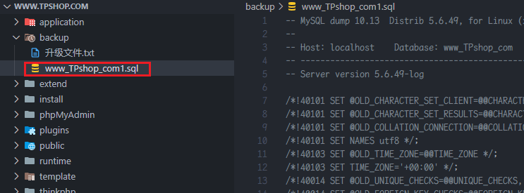

直接运行sql文件
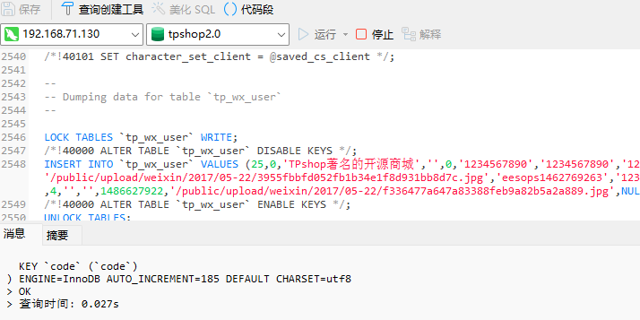

修改本地host
`C:\Windows\System32\drivers\etc\hosts`

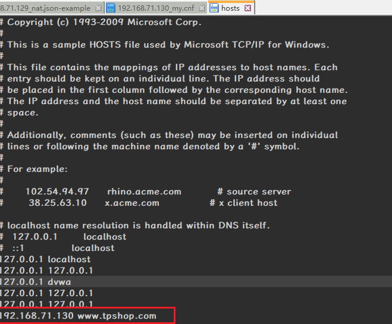

http://www.tpshop.com/index.php/Admin/Admin/login.html
即可


找到密码加密逻辑


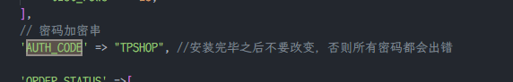

设一个密码，放入数据库中

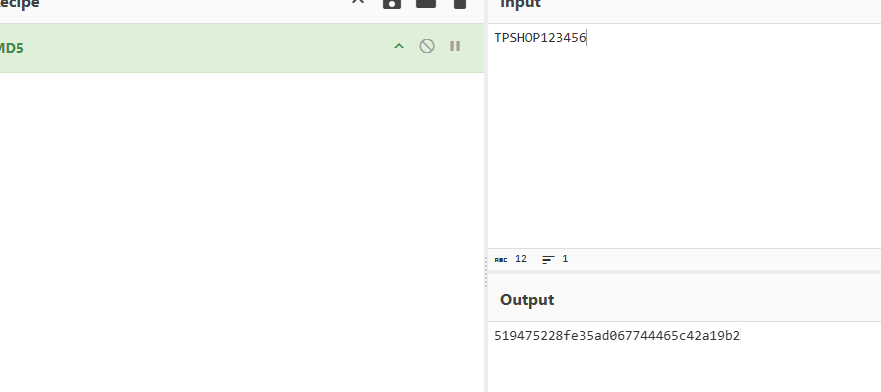

519475228fe35ad067744465c42a19b2

admin 123456
成功进入
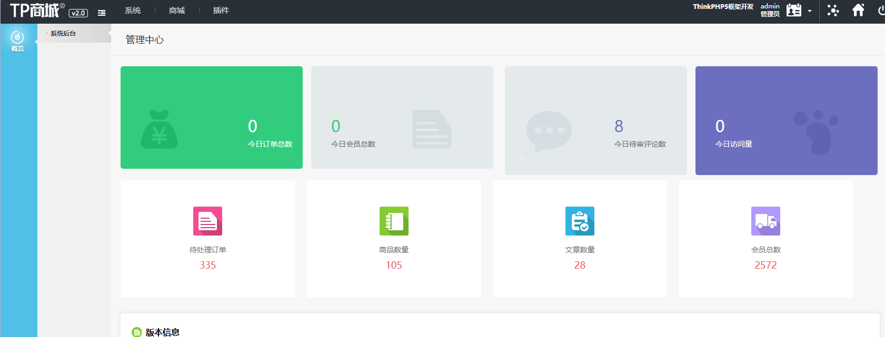

### 1. 该电脑最早的开机时间是什么(格式：2025/1/1 01:01:01)

`答案：2022-02-23 12:23:49`

火眼直接出
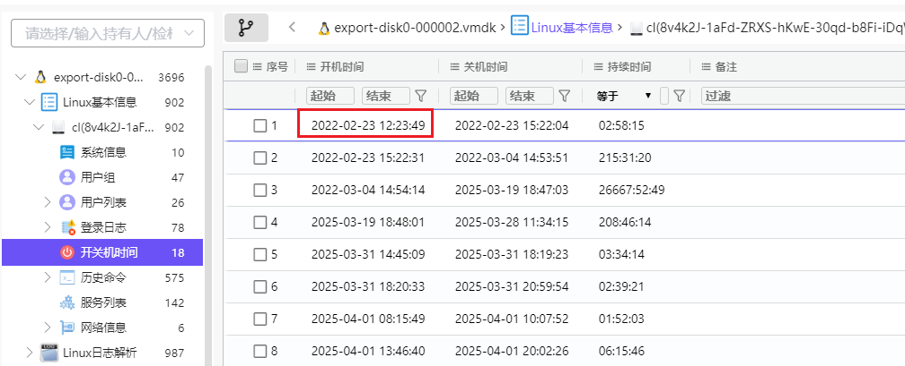

### 2. 服务器操作系统内核版本(格式：1.1.1-123)

`答案：3.10.0-1160`

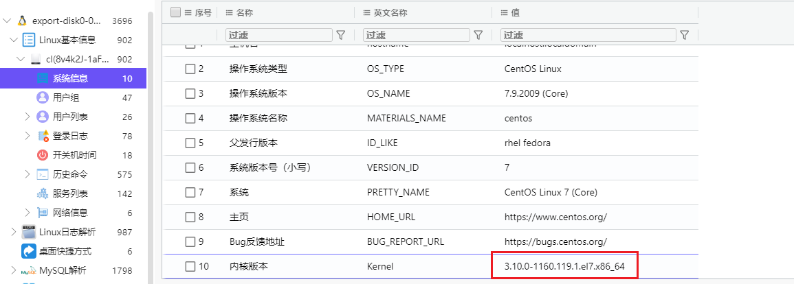

### 3. 除系统用户外，总共有多少个用户(格式：1)

`答案：3`

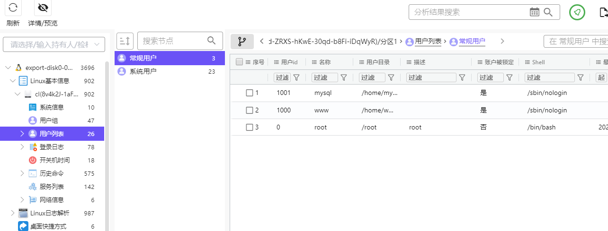


### 4. 分析起早王的服务器检材，Trojan服务器混淆流量所使用的域名是什么(格式：xxx.xxx)

`答案：www.wyzaizaoqi.com`

查找相关服务
`find / -name trojan`


`/etc/trojan/config.json`中
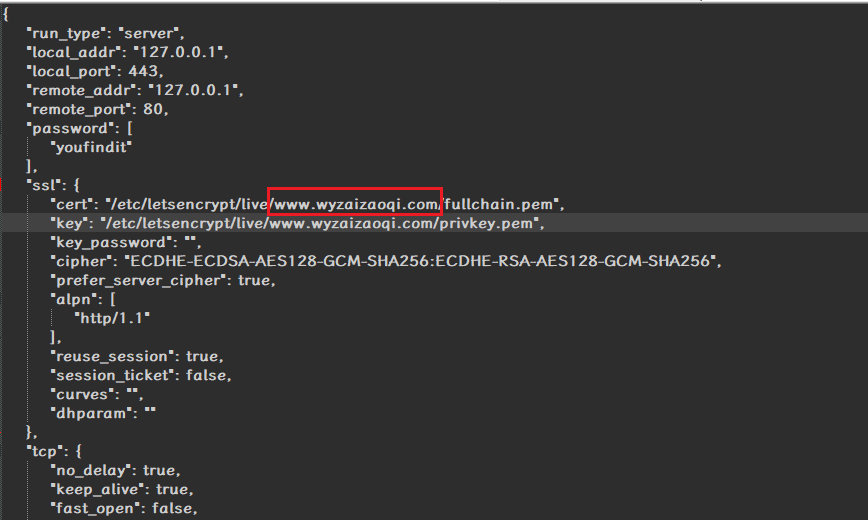
> 在你提供的 trojan 配置文件中，没有明确指出混淆流量所使用的域名。不过，从配置文件中的 “cert” 和 “key” 文件路径可以推测，证书是为域名 “**[www.wyzaizaoqi.com**”](http://www.wyzaizaoqi.xn--com%2A%2A-tc0e/) 颁发的，所以可以推测混淆流量可能使用了该域名进行通信。

### 5. 分析起早王的服务器检材，Trojan服务运行的模式为：
A、foward 
B、nat  
C、server 
D、client

`答案：A`

这个在`/root/trojan/config.json`，但是被改成`you guess`
然后与example中找到nat的与我们的格式相同
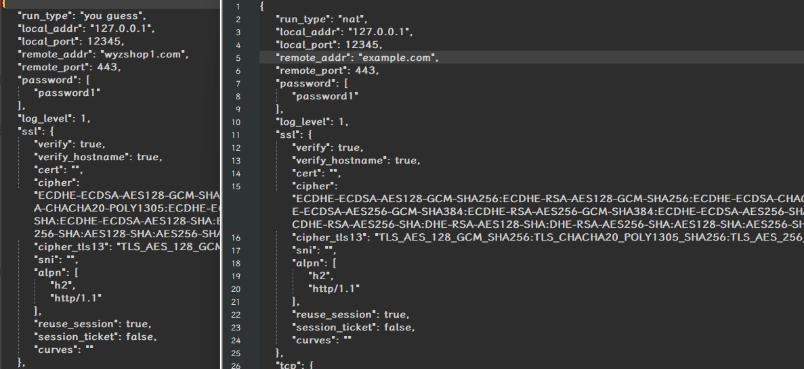

### 6. 关于 Trojan服务器配置文件中配置的remote_addr 和 remote_port 的作用，正确的是：
A. 代理流量转发到外部互联网服务器
B. 将流量转发到本地的 HTTP 服务（如Nginx）
C. 用于数据库连接
D. 加密流量解密后的目标地址

`答案：A`

这道题纯考知识点，我选的B

个人觉得CD可以排除，与数据库无关，本身也不是算法不可能用于加密
AB不确定怎么排除


### 7. 分析网站后台登录密码的加密逻辑，给出密码sbwyz1加密后存在数据库中的值(格式：1a2b3c4d)

`答案：f8537858eb0eabada34e7021d19974ea`

下载源码

找到密码加密逻辑


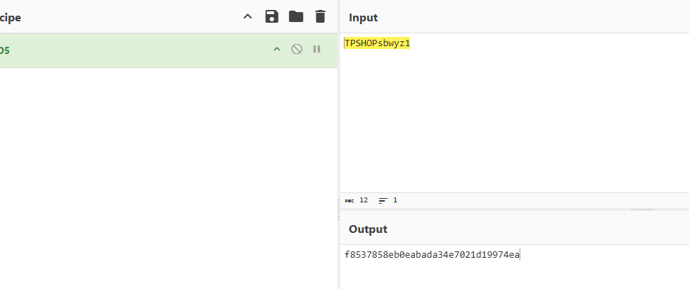

### 8. 网站后台显示的服务器GD版本是多少(格式：1.1.1 abc)

`答案：2.1.0 compatible`

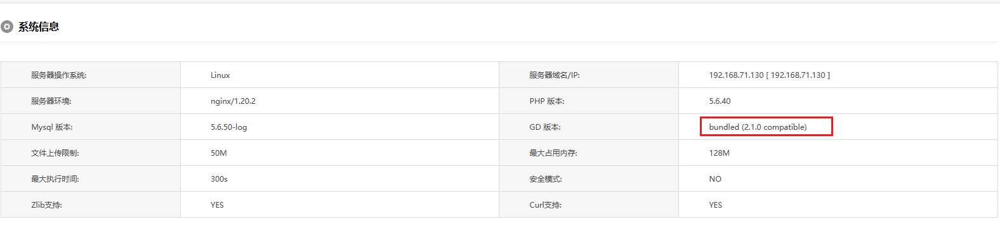

这个也可以看源码有一个探针，访问`/l.php`
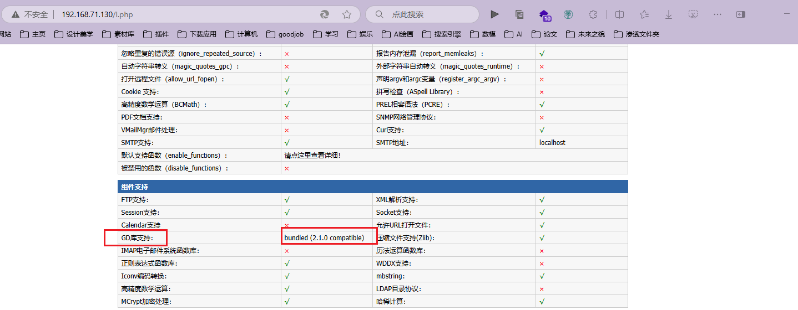


### 9. 网站后台中2016-04-01 00:00:00到2025-04-01 00:00:00订单列表有多少条记录(格式：1)

`答案：1292`

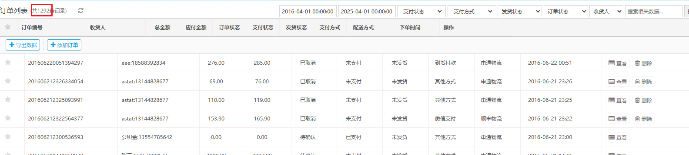

### 10. 在网站购物满多少免运费(格式：1)

`答案：100000`

网站后台：
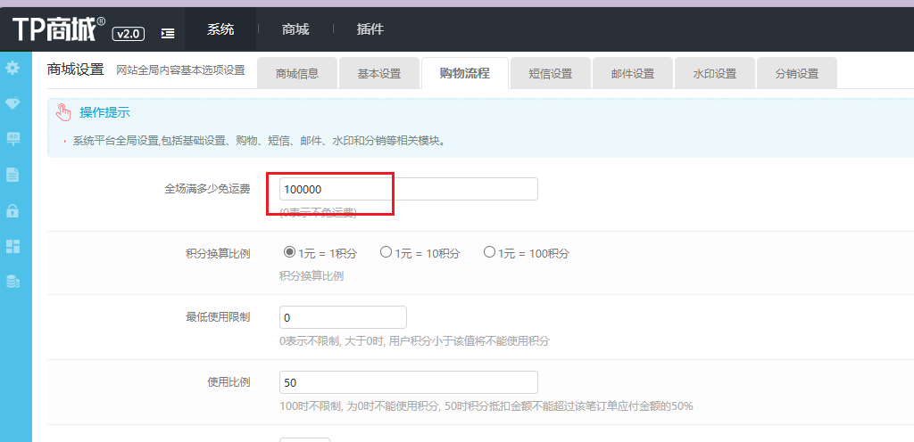

数据库：
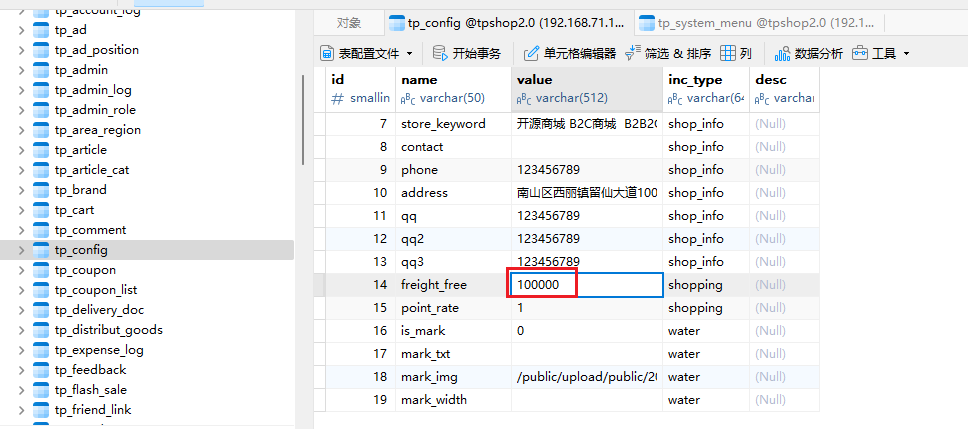


### 11. 分析网站日志，成功在网站后台上传木马的攻击者IP是多少(格式：1.1.1.1)

`答案：222.2.2.2`

去找日志

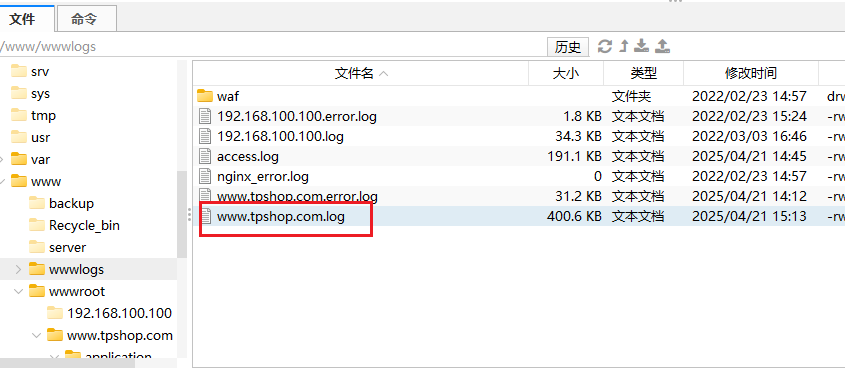

看源码运气好直接看到`peiqi.php`一句话木马，可以直接搜，快很多

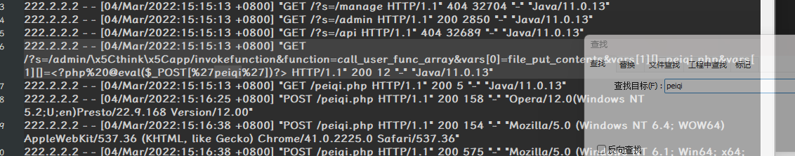


攻击者ip为`222.2.2.2`

### 12. 攻击者插入的一句话木马文件的sha256值是多少(格式：大写sha256)

`答案：870bf66b4314a5567bd92142353189643b07963201076c5fc98150ef34cbc7cf`

直接看即可

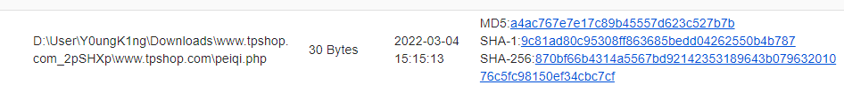

### 13. 攻击者使用工具对内网进行扫描后，rdp扫描结果中的账号密码是什么(格式：abc:def)

`答案：administrator:Aa123456@`

根目录下有goon2这个内网扫描工具,其扫描结果会生成为result.txt，我们查看result.txt,发现rdp扫描结果中的账号密码

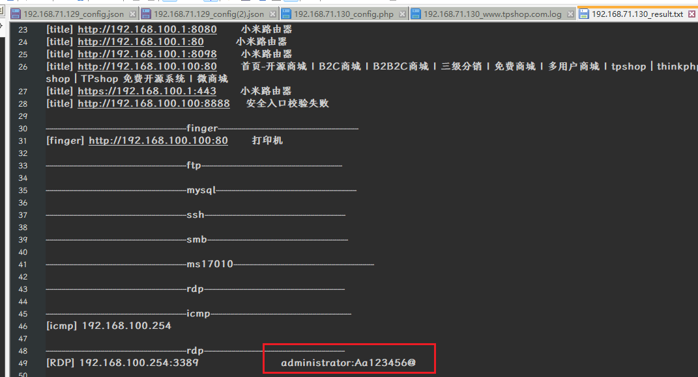

`administrator:Aa123456@`

### 14. 对于每个用户，计算其注册时间（用户表中的注册时间戳）到首次下单时间（订单表中最早时间戳）的间隔，找出间隔最短的用户id。（格式：1）

`答案：180`

这里筛选会比较复杂，直接sql

来自官方wp

``` sql
SELECT u.user_id, MIN(o.create_time) - u.reg_time  as time_diff 
FROM tp_users u 
JOIN tp_delivery_doc o ON u.user_id = o.user_id 
GROUP BY u.user_id, u.email, u.reg_time 
ORDER BY time_diff ASC 
LIMIT 1;
```

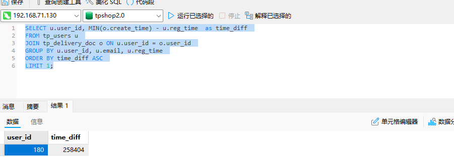


### 15. 统计每月订单数量，找出订单最多的月份（XXXX年XX月）

`答案：2017年1月`

``` sql
SELECT
    EXTRACT(YEAR FROM FROM_UNIXTIME(o.create_time)) as `year`,
    EXTRACT(MONTH FROM FROM_UNIXTIME(o.create_time)) as `month`,
    COUNT(*) as order_count
FROM tp_delivery_doc o
GROUP BY `year`, `month`
ORDER BY order_count DESC
LIMIT 1;
```

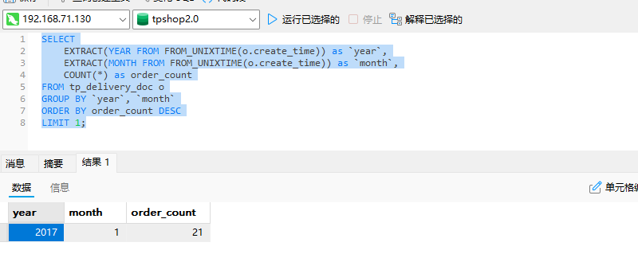


### 16. 找出连续三天内下单的用户并统计总共有多少个（格式：1）

`答案：110`

``` sql
SELECT
    t1.user_id,
    MIN(FROM_UNIXTIME(t1.add_time)) AS earliest_order_date
FROM
    tp_order t1
WHERE EXISTS (
    SELECT 1
    FROM tp_order t2
    WHERE t2.user_id = t1.user_id
    AND FROM_UNIXTIME(t1.add_time) > FROM_UNIXTIME(t2.add_time)
    AND DATEDIFF(FROM_UNIXTIME(t1.add_time), FROM_UNIXTIME(t2.add_time)) <= 3
)
GROUP BY
    t1.user_id
ORDER BY
	t1.user_id;
```

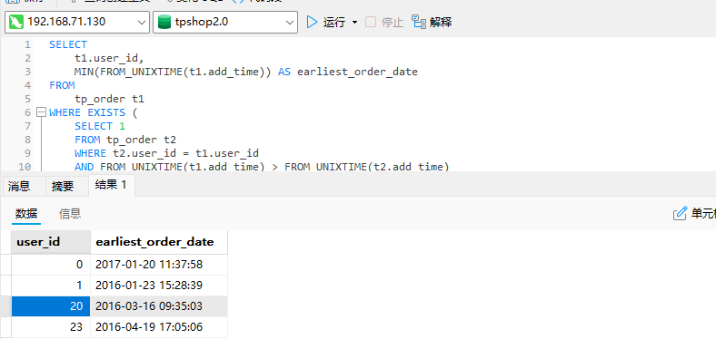

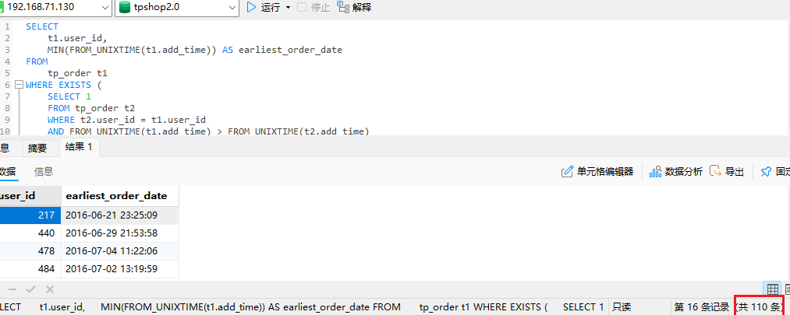