# 2025獬豸杯

> 链接: <url id="d0hkr2e1bb2h856pi1mg" type="url" status="parsed" title="百度网盘 请输入提取码" wc="120">https://pan.baidu.com/s/15-XLMJpJlB4Y3uiASkcmIg?pwd=1217</url> 提取码: 1217 
--来自百度网盘超级会员v4的分享

> vc密码：}2N|n_yxdt!G/Ru}|_zdn$@?6@CD8E


## 手机

### 1 登录的直播APP的IDX是什么？[标准格式：25236541]
答案：35258617

直接搜索直播相关APP
一个是助手，另一个烟雨直播
IDX的含义：在某些特定的直播应用中，IDX 可能是一个内部标识符或数据库字段，用于存储用户信息、直播内容或其他相关数据。

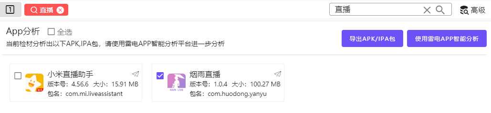

在com.huodong.yanyu包的数据库中翻


在miao.db中找到idx
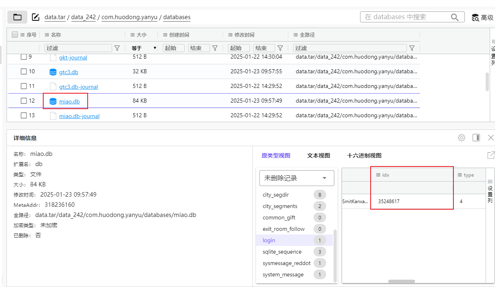
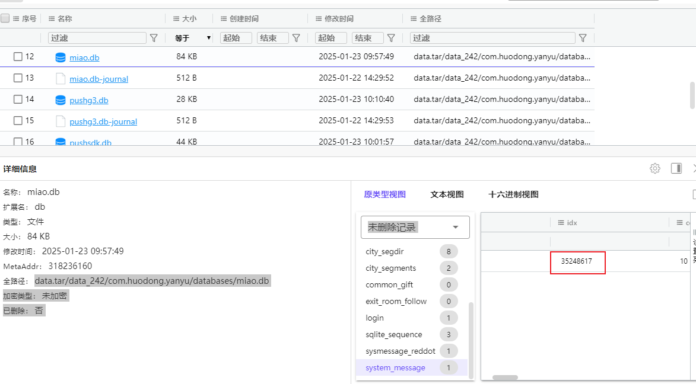
在cookie.db找到
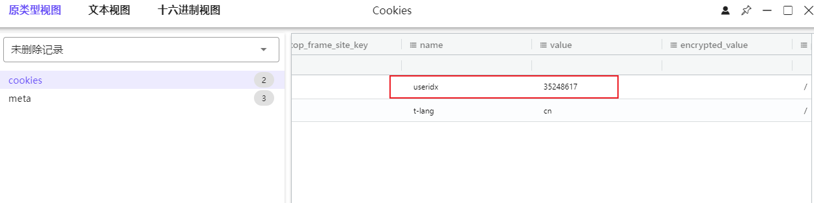

同时可以运用火眼耗时任务ocr查找idx
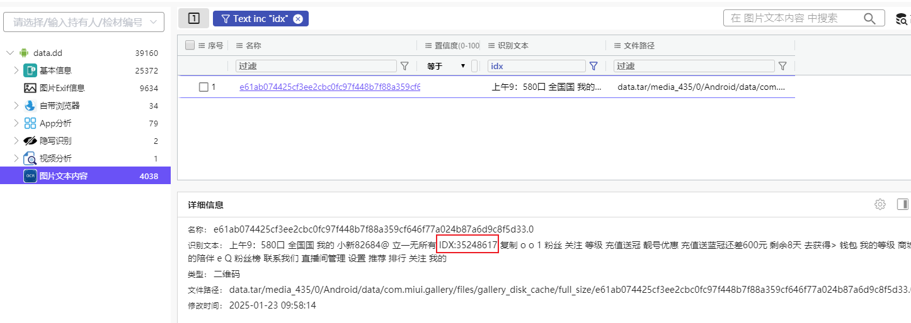
也能找到原图
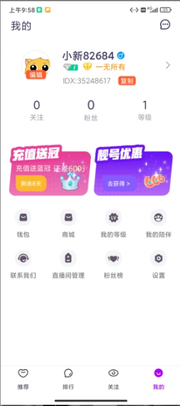
### 2 目前直播的等级名称是什么？[标准格式：碌碌无为]
答案：一无所有

根据上图图片

得到
`一无所有`

### 3 地图中哪座山有绝望坡？[标准格式：太行山]

bing直接搜绝望坡，都试一下即可
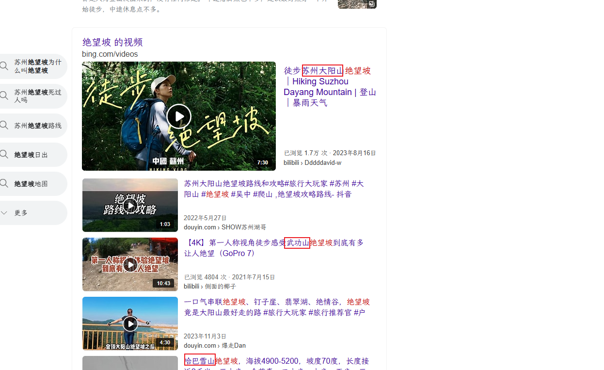

或者看地图的数据，查看地图app
有三个地图
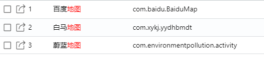

最终在白马地图xml文件中
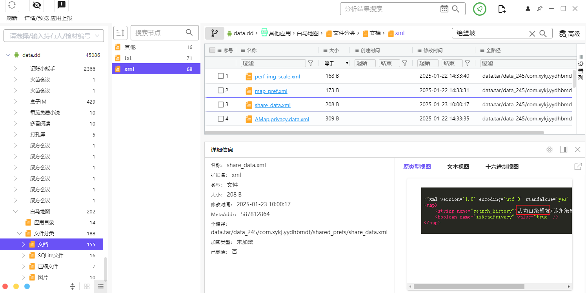

也可以直接全局搜索


### 4 手机的历史SIM卡中，中国电信卡的IMSI是多少？[标准格式：123456789]
答案：460115143563428

查看SIM卡使用记录
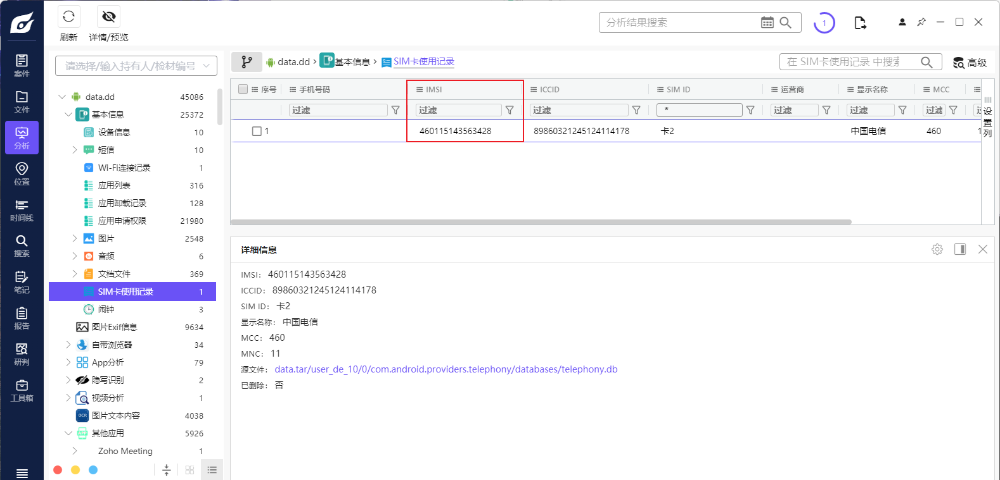

### 5 1月22日16：40的会议号是多少？[标准格式：xxx-xxx-xxx]
答案：312-118-071

找到会议app
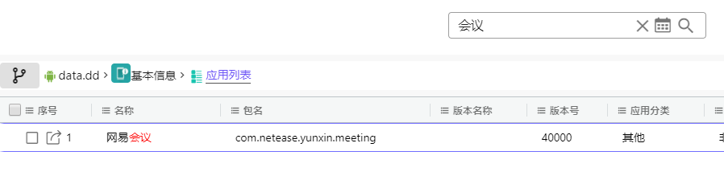

查看包中关于日志的字段，例如log
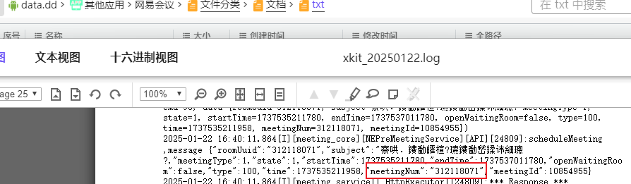
按照格式提取即可

或者ocr搜索
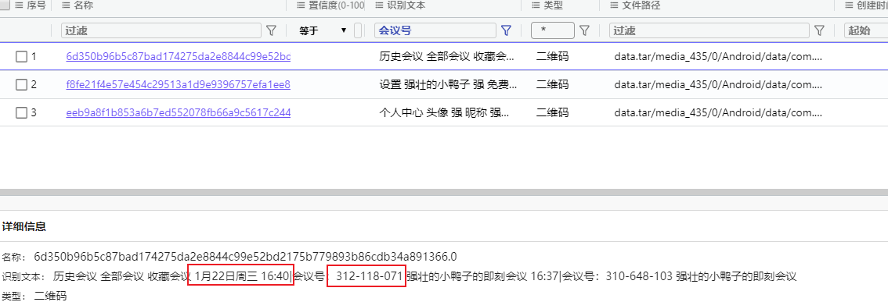
直接1得到

### 6 网易会议中个人会议号是多少？[标准格式：2523654199]

答案：2679823922

导出刚刚的日志文件，搜索`meetingNum`得到私人会议号
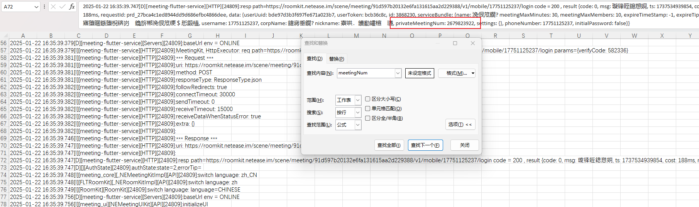


ocr直接搜得到
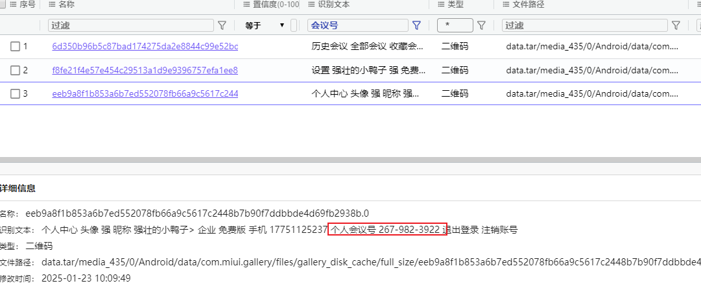

### 7 记账软件中一共记了几笔？[标准格式：9]
答案：4

找到记账app
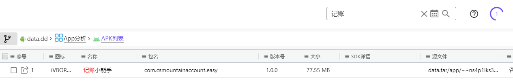
找到一个数据库
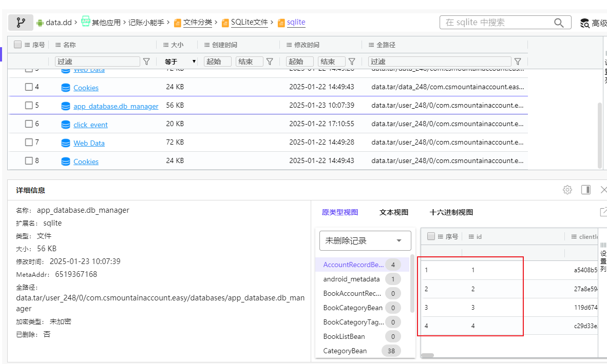

同时也可以ocr搜索
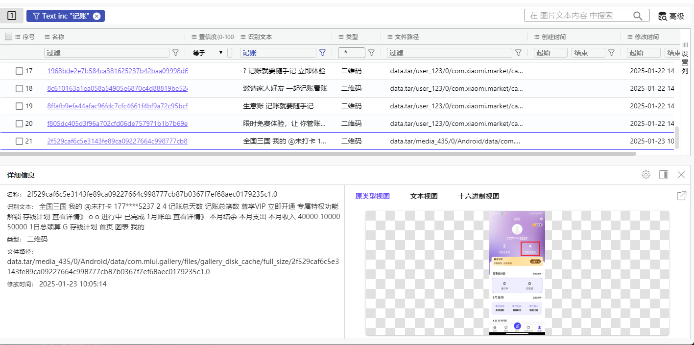

### 8 谁给了机主100000？[标准格式：某某]

答案：勇哥

继续看数据库，就在这个最后一次记账中
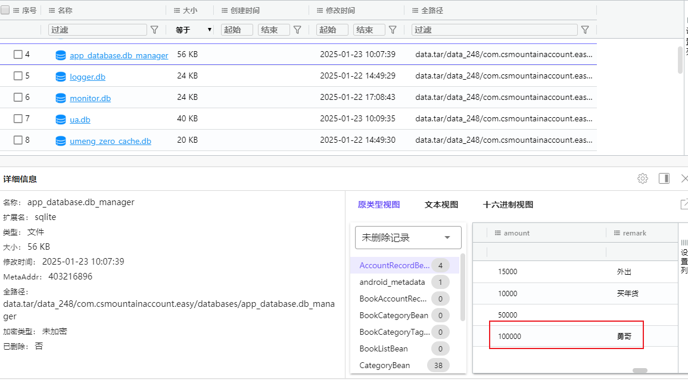

直接ocr搜索
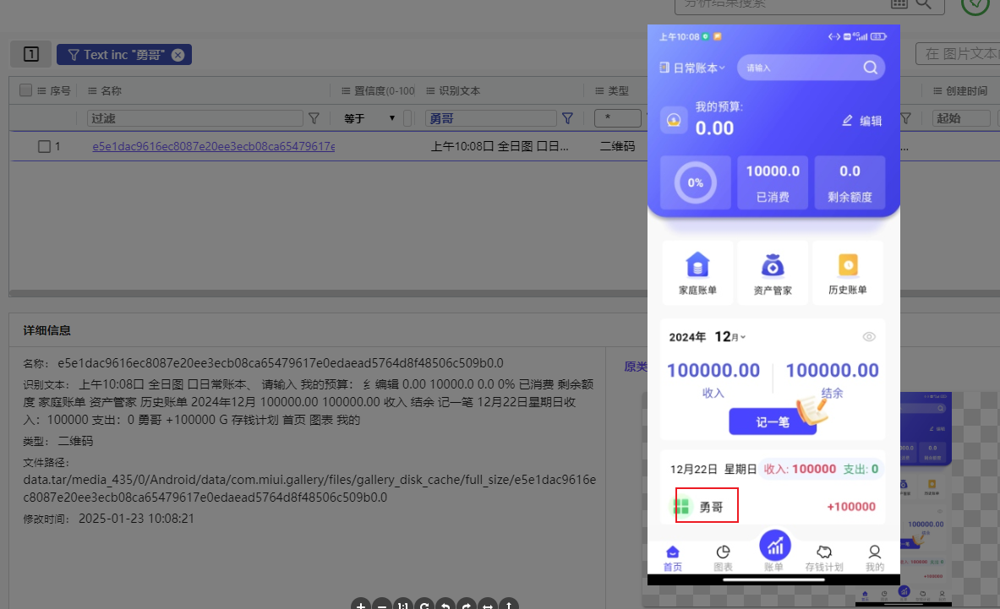

### 9. 聊天软件是否需要手机号登录？[标准格式：填写是或者否]
答案：否

查找聊天软件，遇到一个不认识的盒子，搜一下
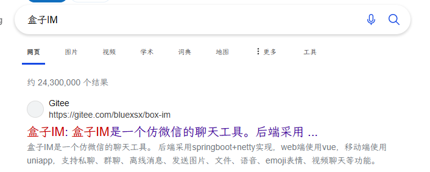
放到雷电中模拟
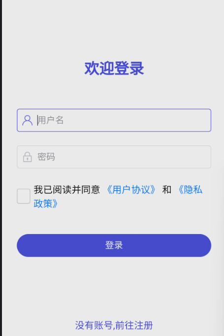
说明不用手机

### 10 机主的给对方的活有多少钱？[标准格式：53100]

答案：30000

应该是聊天软件中聊天记录，查看盒子的数据库
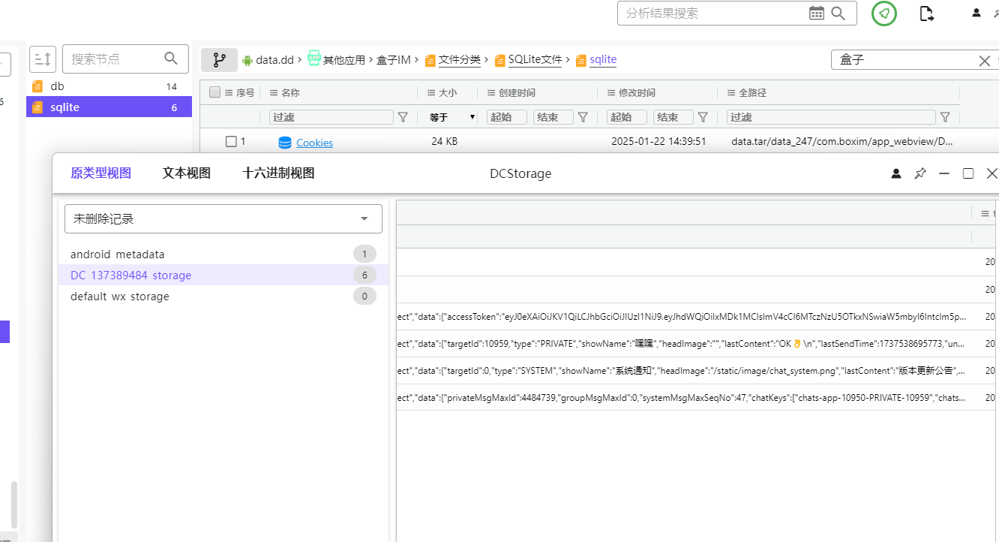

看到聊天记录，明文存储——干完能有3W

```
{"type":"object","data":{"targetId":10959,"type":"PRIVATE","showName":"嘿嘿","headImage":"","lastContent":"OK👌\n","lastSendTime":1737538695773,"unreadCount":0,"messages":[{"sendTime":1737538540788,"type":20},{"id":4484731,"sendId":10950,"recvId":10959,"content":"哈喽，最近在干嘛呢\n","type":0,"status":3,"sendTime":1737538540788,"selfSend":true},{"sendId":10959,"recvId":10950,"id":4484732,"type":0,"content":"上班呢\n","sendTime":1737538566933,"status":0,"selfSend":false},{"id":4484733,"sendId":10950,"recvId":10959,"content":"有啥活可以干嘛\n","type":0,"status":3,"sendTime":1737538608928,"selfSend":true},{"sendId":10959,"recvId":10950,"id":4484734,"type":0,"content":"有啊\n","sendTime":1737538613473,"status":0,"selfSend":false},{"id":4484735,"sendId":10950,"recvId":10959,"content":"多少钱\n","type":0,"status":3,"sendTime":1737538617794,"selfSend":true},{"sendId":10959,"recvId":10950,"id":4484736,"type":0,"content":"干完能有3W\n","sendTime":1737538644790,"status":0,"selfSend":false},{"id":4484737,"sendId":10950,"recvId":10959,"content":"那我来\n","type":0,"status":3,"sendTime":1737538659504,"selfSend":true},{"sendId":10959,"recvId":10950,"id":4484738,"type":0,"content":"行啊 ，东西一会还是发在老地方\n","sendTime":1737538691512,"status":0,"selfSend":false},{"id":4484739,"sendId":10950,"recvId":10959,"content":"OK👌\n","type":0,"status":3,"sendTime":1737538695773,"selfSend":true}],"atMe":false,"atAll":false,"stored":false,"lastTimeTip":1737538540788}}
```


也可以ocr
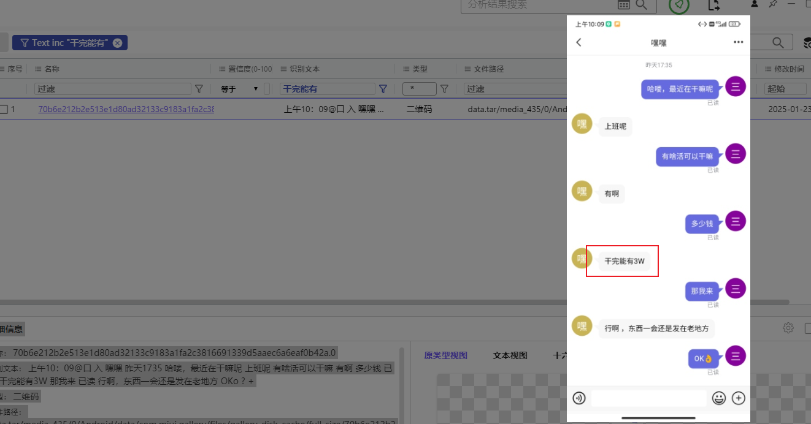

### 11 机主的手机号是多少？[标准格式：13652492155]

答案：17751125237

会议中找到可疑
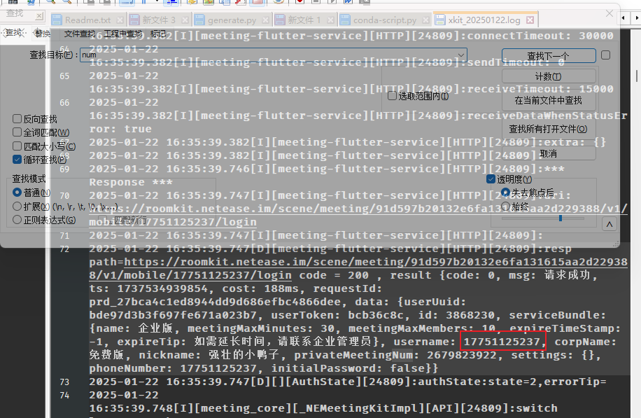

ocr确认
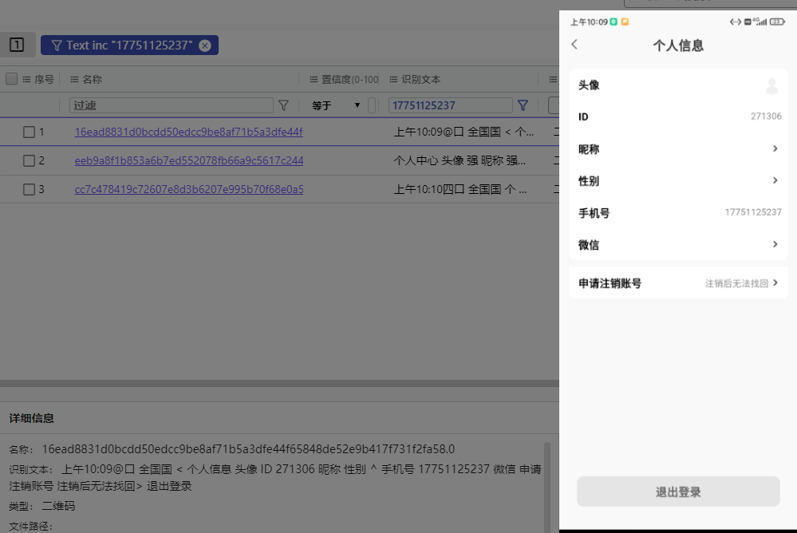

也可以直接搜手机号
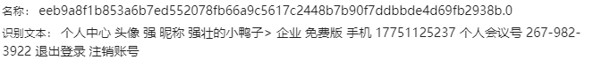

### 12 手机的IMEI1后四位是多少？[标准格式：2536]

答案：1055
直接火眼
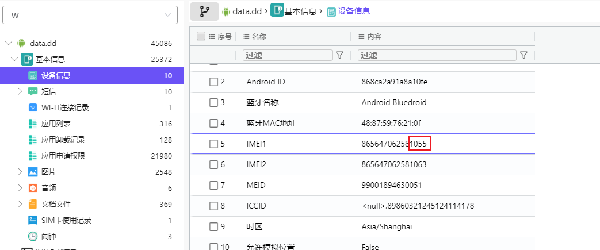

### 13 手机上一共有几个地图软件？[标准格式：9]

答案：3

直接搜
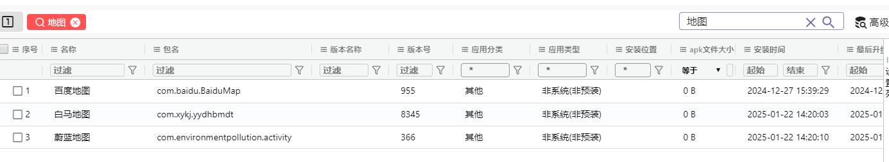


## 计算机
### 1 网卡的Mac地址是多少？[标准格式：XX-XX-XX-XX-XX-XX]

答案： 00-0C-29-BF-8B-30

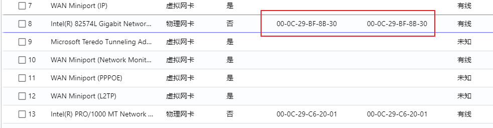
直接火眼看，有两个，都试一下即可

### 2 系统内部版本号是多少？[标准格式：12345]

答案：18363

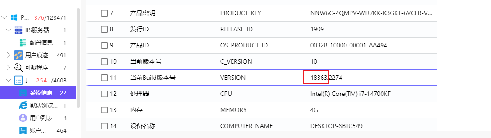
取前五位即可

### 3 计算机系统开机密码是多少？[标准格式：根据实际值填写]

答案：WAXD9128@

在便签中
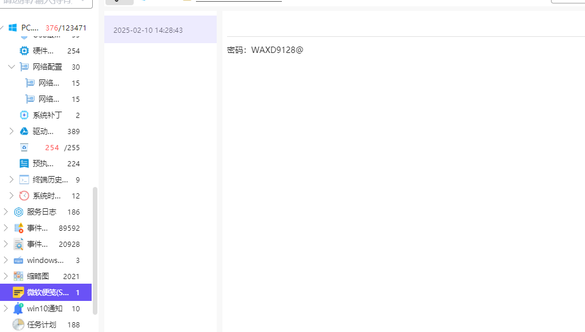

### 4 分析计算机检材中手机流量包，请问黑客虚拟身份的密码是什么？[标准格式：x123]

答案：a12345678

流量包文件在文档文件夹中

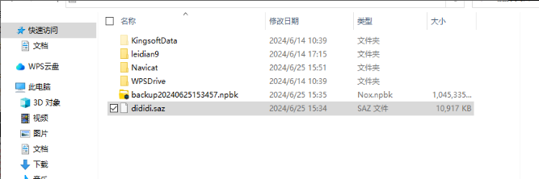

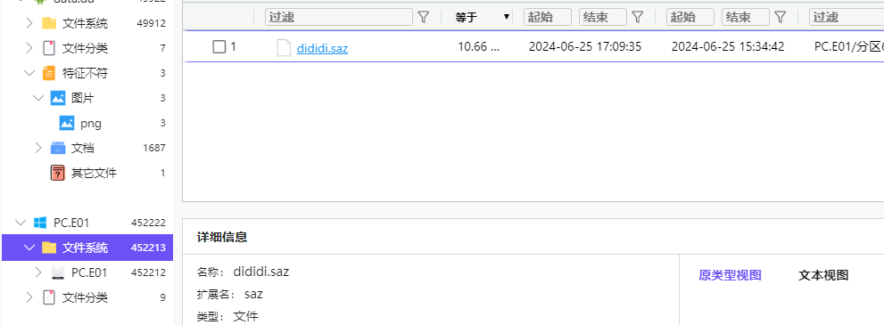
导出
直接在fiddler中搜索`password`找到`a12345678`

### 5 分析计算机检材中手机流量包，请问黑客人员使用的夜神模拟器的手机型号是什么？[标准格式：XX-X123X]

答案：SM-G955N

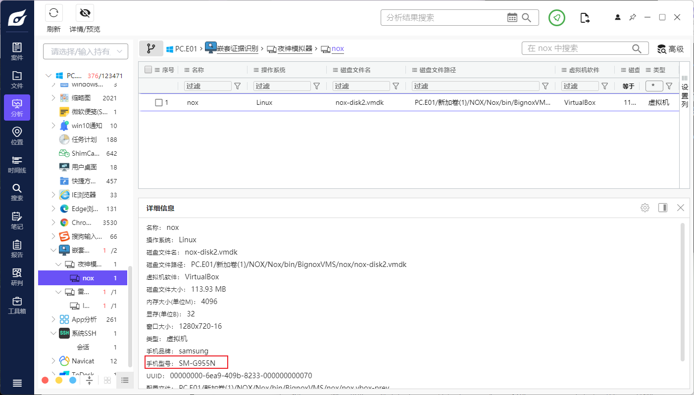
找到模拟器的手机型号
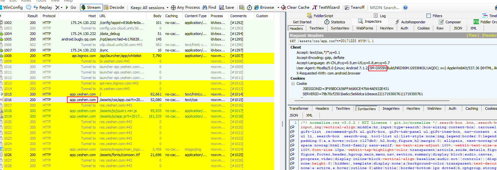

### 6 分析计算机检材中手机流量包，请问黑客看视频的时间是几月份？[标准格式：1]

答案：5

发现存在douyin
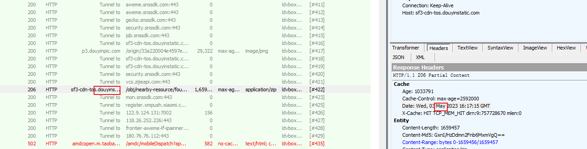
找到5月

### 7 分析计算机检材中手机流量包，请问“天戮宇宙”出自哪个小说平台？[标准格式：番茄小说网]

答案：起点中文网

搜索图片
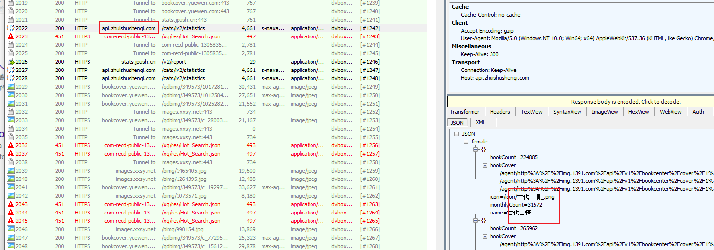
找到可疑的小说网站——追书神器
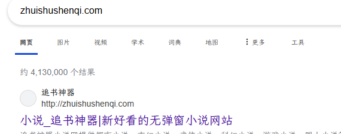
找到一系列书的封面
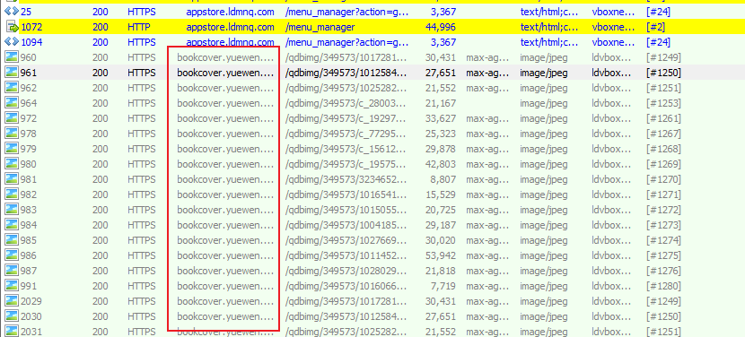

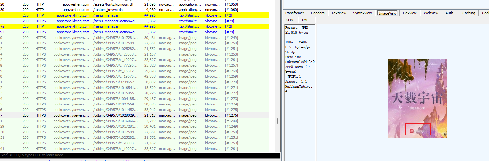
找到起点中文网

### 8 请问在手机模拟器中勒索apk软件的sha256值是什么？[标准格式：全小写]

答案：

340bd211955996c5d62bbde94a0bed4eb3a7965b23af52114991bca02346928e

用户文档文件夹中发现夜神模拟器备份

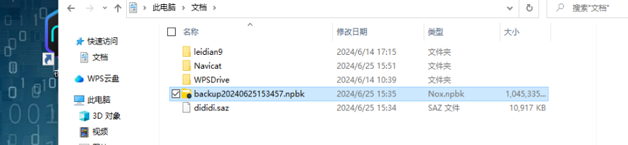

在夜神模拟器中导入备份，发现被勒索
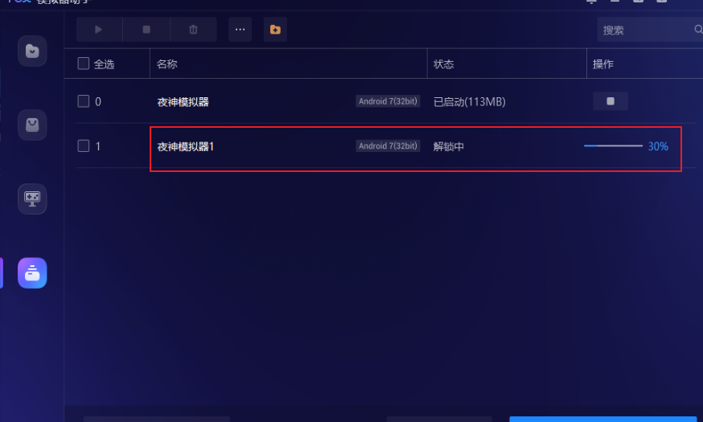

直接导出，换后缀为zip可以直接解压

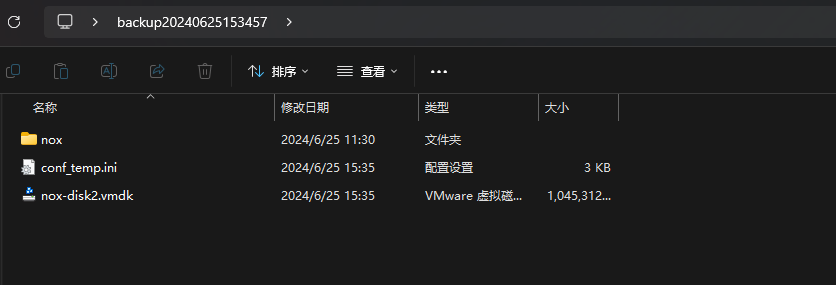
将vmdk放入火眼中检查
有两个可疑apk

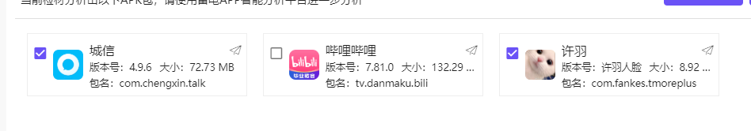

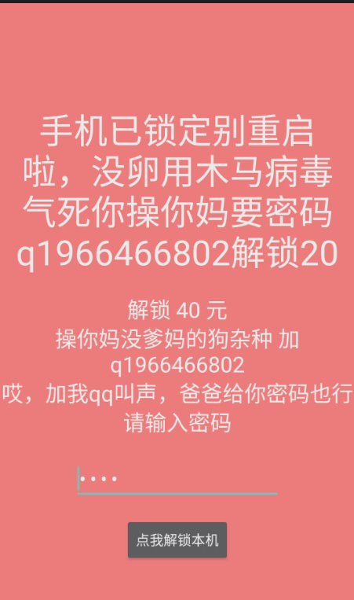
发现是许羽（服了模拟器被勒索，应该最好用虚拟机里的夜神）
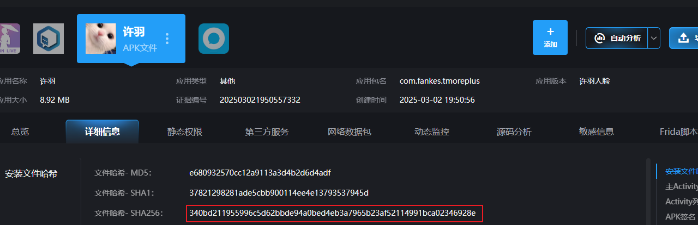


### 9 接上题，请问勒索apk软件的解锁密码是什么？[标准格式：qwer.com]

答案：anzhuo.com

查看源码，直接找到
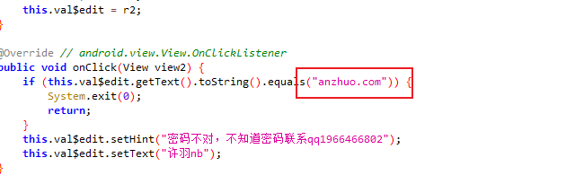

### 10 signed_xz.exe程序SHA1后6位是多少？[标准格式：524c62]

答案：8955b1


找到可疑veracrypt文件——Beifen。桌面有txt文件
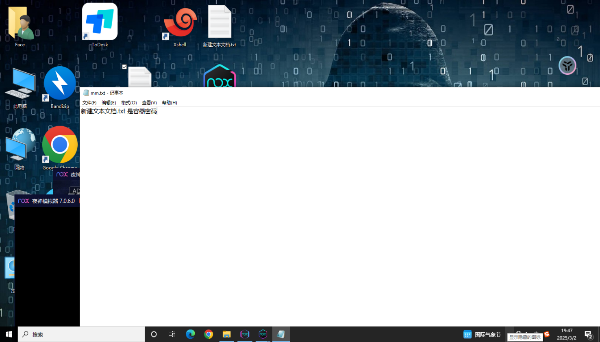
发现`新建文本文档.txt` 是容器密码
导出解密找到软件
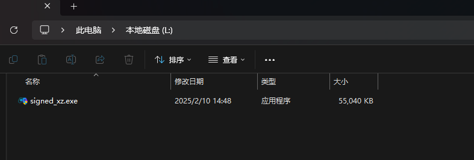


### 11 signed_xz.exe程序中的函数名为curl_version_info的函数地址是多少？[标准格式：0c6875c2]

答案：0x4393c0

打开IDA进行逆向


### 12 signed_xz.exe程序中节名为.reloc的虚拟地址是多少？[标准格式：0c526n5624]

答案：0x035b5000


### 13 请分析检材中澳门新葡京APK其包名是？[标准格式：com.abcd.xxx]

答案：com.suijideszzuiji.cocosandroid


### 14 请分析检材中澳门新葡京APK是否加固，加固则说明是什么加固？[标准格式：360加固宝或未加固]

答案：未加固


### 15 请分析检材中澳门新葡京APK是否会往手机的SD卡中写入数据，则该权限的名称是？[标准格式：android.xx.xxx]

答案：android.permission.WRITE_EXTERNAL_STORAGE


### 16 请分析检材中澳门新葡京APK登录的api地址。[标准格式：<url id="d0hkr2e1bb2h856pi1n0" type="url" status="failed" title="" wc="0">https://www.baidu.com/api/login</url> ]

答案：

<url id="d0hkr2e1bb2h856pi1ng" type="url" status="parsed" title="" wc="73">https://168js.bvocftd.com/ky188/member/memberManager/login</url> 


登录随便注册下，发现服务器


### 17 请分析检材中澳门新葡京APK其中关于腾讯运营商的服务留存了QQ号是？[标准格式：123456790]

答案：1108221663


### 18 请分析Navicat中root用户的密码是什么？[标准格式：@123Aa]

答案：(=3]Zwjt#W

火眼直接看


## 服务器

### 复现
所有虚拟机一起挂起来
ip
- 001 192.168.2.199
- 002 192.168.2.200
- 003 192.168.2.201

全面设为NAT

002、003有宝塔，是一个Kubernetes 集群


### 1 该集群主节点操作系统版本是？[标准格式：100.100.100]

答案：7.9.2009


### 2 该集群创建时间是？[标准格式：0000-00-00T00:00:00Z]

答案：2024-06-24T11:28:12Z

直接用
```bash
kubectl get nodes k8s-master -o jsonpath='{.metadata.creationTimestamp}'\
```

命令查询 


### 3 该集群共有多少个命名空间？[标准格式：100]

答案：7

直接输命令

bash

复制

```bash
kubectl get namespace
```

7


同时也可以

bash

复制

```bash
kubectl get namespaces | wc -l
```

这个命令会列出所有命名空间，并通过 `wc -l` 统计行数。需要注意的是，`kubectl get namespaces` 的输出中包含表头行，因此实际的命名空间数量需要减去1。

### 4 该集群所有命名空间内总共有多少个pod？[标准格式：100]

答案：19

直接输命令
```bash
kubectl get pods -A
```


或者

```
kubectl get pods --all-namespaces | wc -l
```


### 5 请给出该集群所使用的cni网络插件及其版本？[标准格式：abc-V1.1.1]

答案：flannel-V1.0.0

直接输命令
```bash
docker images | grep cni
```


### 6 其中打金平台的后台登录地址跳转文件是？[标准格式：abc.php]

答案：WIdbdgd1Us.php

打开002宝塔


一个个试


这个大概率不是
看下一个
根据网址，找到可能的后台登录界面
```
http://192.168.2.200/index.php/Systemlogined/login/index
```


成功登录后台

接下来就是绕过
找一下登录源码


```php
//验证用户名和密码
$user = M('user')->where(array('username'=>I('username'),'password'=>I('password','','sha1')))->find();

$user or $this->error('用户名或密码错误!');
```
改为
```php
//验证用户名和密码
$user = M('user')->where(array('username'=>I('username')))->find();

$user or $this->error('用户名或密码错误!');
```

重启nginx

改前端

账号输admin
密码随便输

或者直接数据库后端改密码
`7c4a8d09ca3762af61e59520943dc26494f8941b`

登录跳转文件

进入数据库


### 7 其中打金平台密码加密算法是？[标准格式：abc]

答案：sha1
上述依据找到，sha1


### 8 其中打金平台中"13067137585"用户的累计产量有多少？[标准格式：100.00]

答案：43853.21

修改数据库用户"13067137585"的密码


123456
7c4a8d09ca3762af61e59520943dc26494f8941b

从普通用户登录界面登录

43,853.21


### 9 其中打金平台会员组最高溢价比例是多少？[标准格式：10.00]

答案：1.70


最高是1.70

### 10 其中打金平台会员推广人数最多的会员其姓名是？[标准格式：名字]

答案：李奕欣


李奕欣

### 11 其中打金平台最早一次备份数据库的时间（Asia/Shanghai）是？[标准格式：2024-01-01-01:01:01]

答案：2019-05-06-22:27:57


但是可以删除这个记录，所以再去数据库看看


将时间戳转化为时间


2019/5/6 22:27:57


### 12 其中金瑞币（JINRUI COIN）平台图片上传平台是哪种类型？[标准格式：腾讯云ABC]

答案：阿里云OSS

这是另一个平台


直接宝塔全局搜网站文件


### 13 其中金瑞币平台手机直充接口是什么？[标准格式：http://xxx.xxx.xxx/xxx]

答案：http://op.juhe.cn/ofpay/mobile/onlineorder

直接搜手机直充


### 14 其中金瑞币平台后台登录地址是？[标准格式：http://xxx/xxx/xxx.xxx]

答案：http://www.gsjksu2kig.com/admin.php/login/index.html


直接搜后台登录

/www/wwwroot/www.gSJKsu2kig.com/admin.php/login/index.html


### 15 其中金瑞币平台中密码加密盐值是？[标准格式：AbC1d]

答案：GWwRbMOPJYZCvE5gembG

直接搜salt


### 16 其中金瑞币平台中交易手续费是百分之多少？[标准格式：100]

答案：36

需要复现

进到数据库，后台就是加盐值 md5，


123456 GWwRbMOPJYZCvE5gembG
md5


成功登录


手续费 36%


### 17 其中金瑞币平台中目前有几种充值方式？[标准格式：100]

答案：3


三种

### 18 二号集群节点有源代码的网站目录有几个？（正在运行的除外）[标准格式：1]

答案：5

使用find / -name index.html，发现/opt目录下有大量源码
查看目录


只有三个有源代码

还有两个还未找到，可以看官方wp

### 19 二号集群节点memcached端口是？[标准格式：100]

答案：11211

直接搜memcached


### 20 盲盒平台中余额最多的用户是？[标准格式：AbC1d]

答案：ZrAuyMT1tyo

在003中
还有网站

第一个就是盲盒


进入后台


发现数据库在002中
设置002数据库sql免密登录
在`/etc/my.cnf`
skip-grant-tables
并重启sql


看数据库得到
ZrAuyMT1tyo

### 21 盲盒平台可选二级域名有多少个？[标准格式：100]

答案：13


### 22 盲盒平台的支付密钥是？[标准格式：AbC1d]

答案：LDAWIucAQQGQp7rEE4nSlvzQMKZxTxopqNSwjL8PcAIBbVLJkh


### 23 盲盒平台中拥有分站的用户名是？[标准格式：123abc]

答案：5432ef


### 24 借贷平台（www.jiedai0rmr.com）中验证码发送接口域名是？[标准格式：<url id="d0hl3t2nae72ecvne3hg" type="url" status="failed" title="" wc="0">http://xxx.xxx.xxx/</url> ]

答案：<url id="d0hl3t2nae72ecvne3i0" type="url" status="parsed" title="马上使用更好的短信服务-短信宝官网" wc="798">http://api.smsbao.com/</url> 

这应该是最后一个网站，也在003中

直接搜接口


### 25 借贷平台后台登录密码的加密算法中共使用了多少次hash函数加密？[标准格式：10]

答案：4

直接看登录代码
/www/wwwroot/www.jiedai0Rmr.com/App/Lib/Action/CommonAction.class.php


因此是4次

### 26 接上题，借贷平台中后台登录的密码额外加密字符串？[标准格式：123ABc+]

答案：26XBAmVMs+n_

直接搜key

得到
'cfg_adminkey' => '26XBAmVMs+n_'


### 27 借贷平台中一共有多少借款订单？[标准格式：100]

答案：43

看数据库
查看对应数据库


搜索得到
motx5dw

查看数据库order表


### 28 借贷平台中"包玉莲"的收款账号是？[标准格式：1000]

答案：15056258898


### 29 借贷平台中贷款最大限额是多少？[标准格式：100]

答案：350000
复现一下，直接搜搜不到

直接搜登录系统找到源码，删除密码验证片段即可


### 30 请综合该集群一共有多少个网站数据库？[标准格式：100]

答案：7

