### web1

开启容器

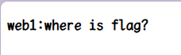

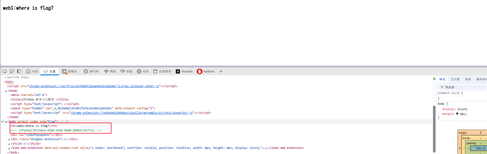

查看页面源代码，找到 flag

`ctfshow{767c48c6-e368-425e-950d-2bd837c9c771}`

### web2

开启容器，题目提示：

```
js前台拦截 === 无效操作
```

网页 js 前台拦截，无法鼠标操作，直接`F12`或者`cirl shift I`

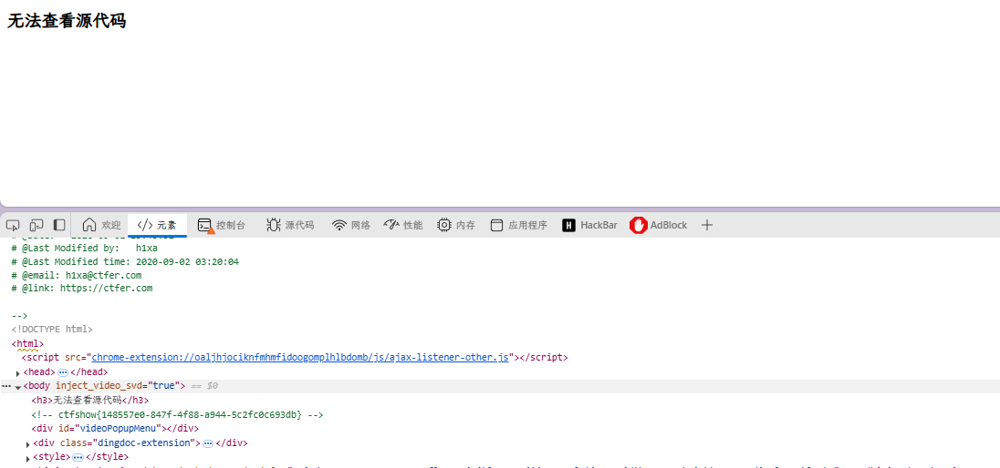

同时`cirl shift`选择`禁用js`就可以直接绕过

`ctfshow{148557e0-847f-4f88-a944-5c2fc0c693db}`

### web3

开启容器,题目提示：

```
没思路的时候抓个包看看，可能会有意外收获
```

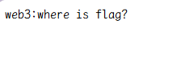

抓包到 burpsuit 中，转到重发器

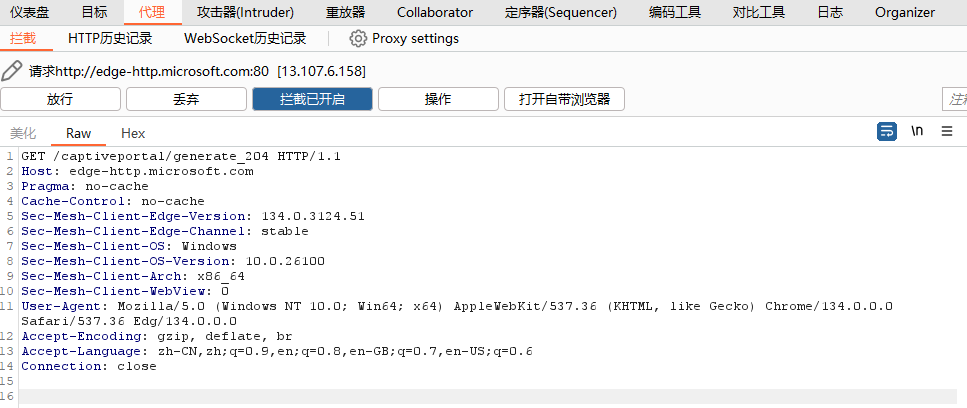

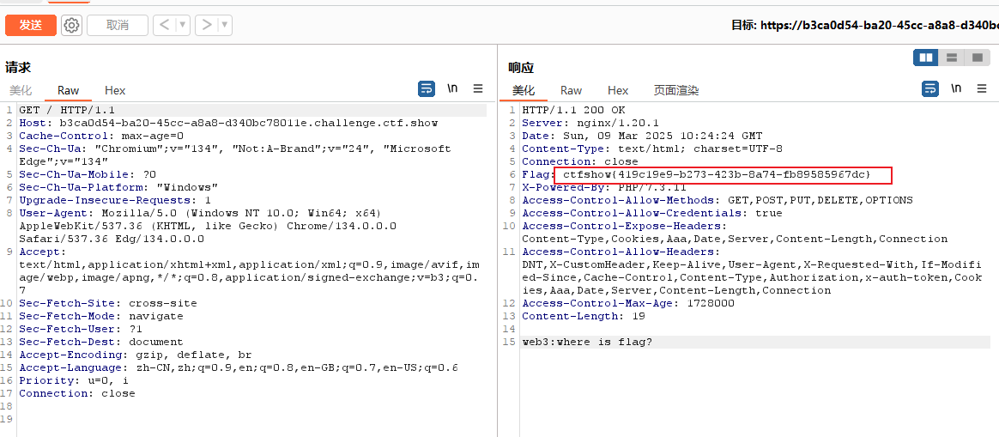

就在响应头中
`ctfshow{419c19e9-b273-423b-8a74-fb89585967dc}`

### web4

开启容器，题目提示

```
总有人把后台地址写入robots，帮黑阔大佬们引路。
```

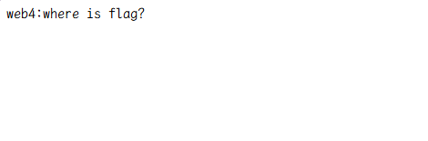

直接看 robots.txt 爬虫协议

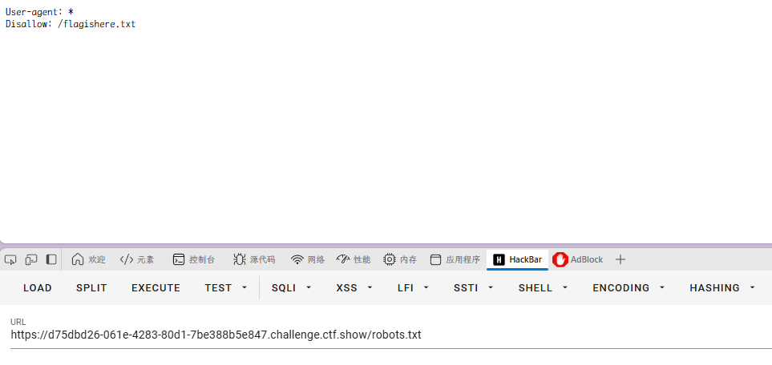
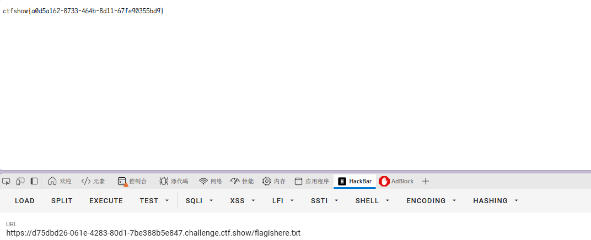

跳转，直接得到 flag

`ctfshow{a0d5a162-8733-464b-8d11-67fe90355bd9}`

### web5

开启容器，题目提示：

```
phps源码泄露有时候能帮上忙
```

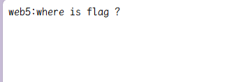

> phps 源码泄露概念
> **phps 源码泄露**是指网站服务器上的 phps 文件（即 php 源代码文件）被未经授权的用户访问和获取的情况。这种泄露可能导致网站的源代码、配置信息等敏感数据暴露，给网站安全带来严重威胁。

直接扫网页目录

`/index.phps`

下载得到文件
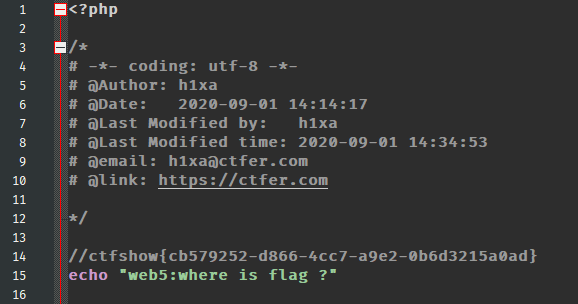
