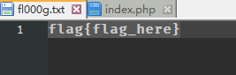
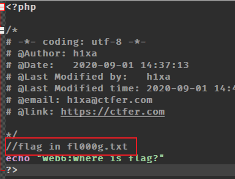
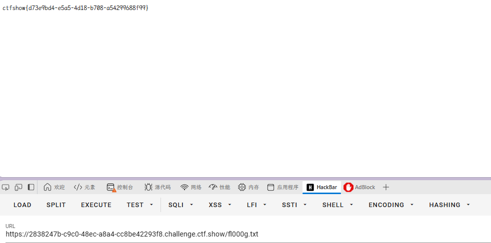
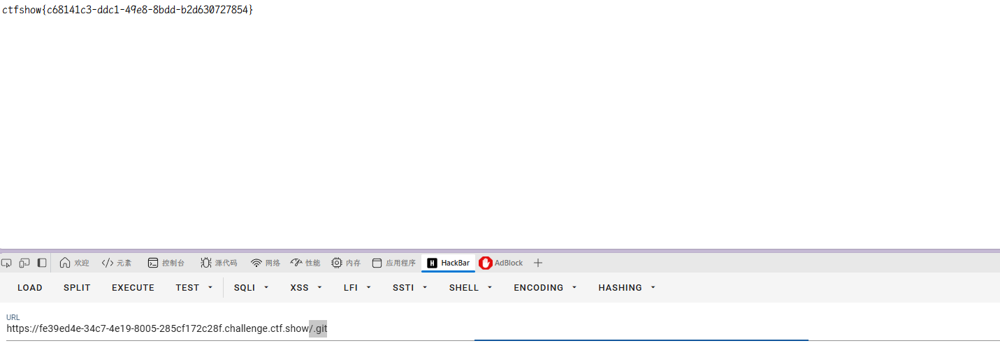
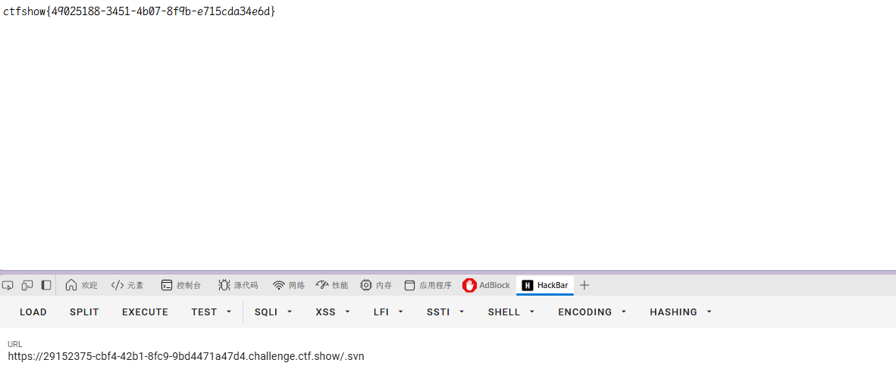
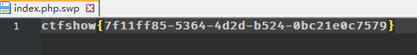
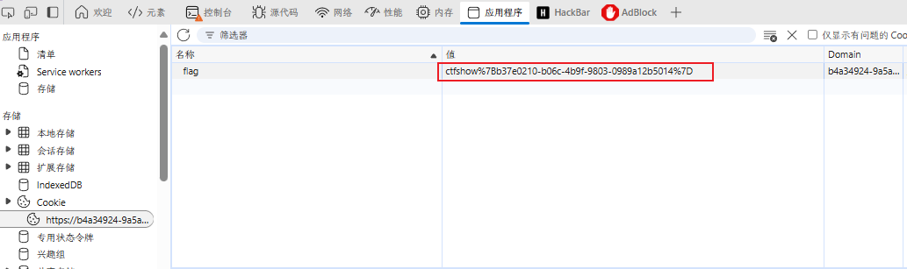
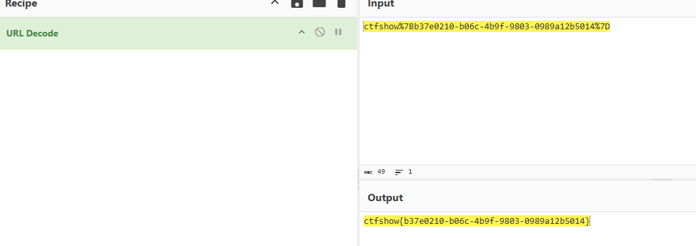

### web6

开启容器，题目提示：

```
解压源码到当前目录，测试正常，收工
```

用 `/www.zip`
得到源码压缩包





找到线索，解压文件夹下的是假 flag



`ctfshow{d73e9bd4-e5a5-4d18-b708-a54299688f99}`

### web7

开启容器，题目提示：

```
版本控制很重要，但不要部署到生产环境更重要。
```

版本控制直接想到`.git`漏洞
`/.git`



`ctfshow{c68141c3-ddc1-49e8-8bdd-b2d630727854}`

### web8

开启容器，题目提示

```
版本控制很重要，但不要部署到生产环境更重要。
```

跟 web7 提示一样

除了`.git`还有一个`.svn`



### web9

开启容器，题目提示：

```
发现网页有个错别字？赶紧在生产环境vim改下，不好，死机了
```

> Vim 缓存信息泄露
> 在使用 Vim 编辑器时，如果编辑过程中异常退出，Vim 会生成缓存文件。这些缓存文件可以导致信息泄露，尤其是在 Web 开发环境中。

直接访问`index.php.swp`



下载得到 flag

`ctfshow{7f11ff85-5364-4d2d-b524-0bc21e0c7579}`

### web10

开启容器，题目提示：

```
cookie 只是一块饼干，不能存放任何隐私数据
```

直接去看 cookie



这个符号被 url 编码过，解码即可


`ctfshow%7Bb37e0210-b06c-4b9f-9803-0989a12b5014%7D`

`ctfshow{b37e0210-b06c-4b9f-9803-0989a12b5014}`
