### web11

开启容器，题目提示：

```
域名其实也可以隐藏信息，比如flag.ctfshow.com 就隐藏了一条信息
```

应该是对域名`flag.ctfshow.com`做处理，相关域名 DNS 信息收集

#### nslookup

> 使用 `nslookup` 查询域名解析地址

#### dig

> dig（域信息搜索器）命令是一个用于询问 DNS 域名服务器的灵活的工具。它执行 DNS 搜索，显示从受请求的域名服务器返回的答复。

由于动态更新，txt 记录会变
由于环境问题，直接给出 flag

> 其他引用别人的方法：

```
nslookup
nslookup -qt=txt flag.ctfshow.com
非权威应答: flag.ctfshow.com text ="flag{just_seesee}"
flag为flag{just_seesee}，直接提交flag即可
```

最终 flag flag{just_seesee}

### web12

开启容器，题目提示

```
有时候网站上的公开信息，就是管理员常用密码
```


打开是一个网站，
先查看爬虫协议`robots.txt`文件

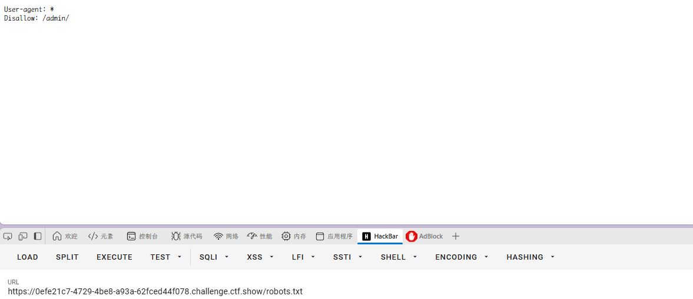

`/admin/`访问后弹出弹窗

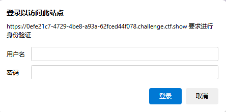

根据提示，回到初始网页查找信息

在网页末页有号码，很可能是密码或者账号，最后尝试 admin 与此号码成功进入
`372619038`

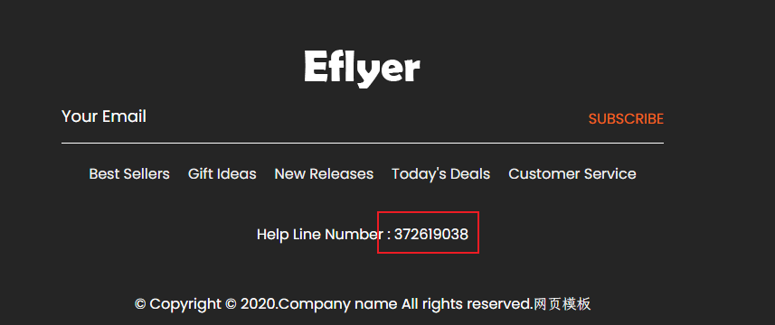

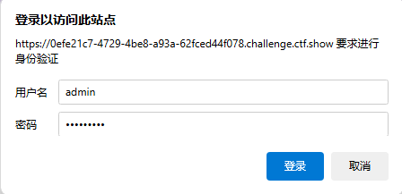
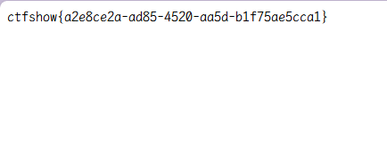

弹出 flag
`ctfshow{a2e8ce2a-ad85-4520-aa5d-b1f75ae5cca1}`

### web13

开启容器，题目提示：

```
技术文档里面不要出现敏感信息，部署到生产环境后及时修改默认密码
```

同样是一个网页


技术文档想到`readme`等 document

找到可能的链接
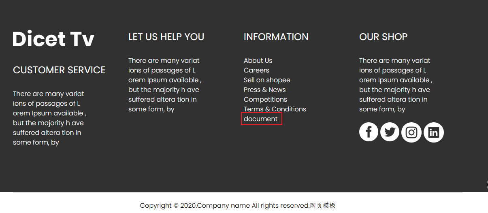
在文档中找到敏感信息
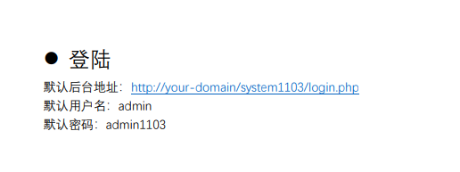

`/system1103/login.php`

弹出登录界面直接登录即可

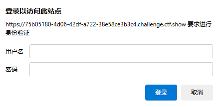

admin
admin1103

得到 flag
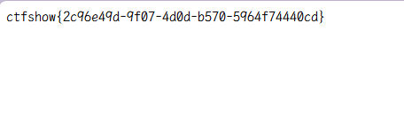

`ctfshow{2c96e49d-9f07-4d0d-b570-5964f74440cd}`

### web14

开启容器，题目提示

```
有时候源码里面就能不经意间泄露重要(editor)的信息,默认配置害死人
```

同样是一个网页


直接看源码
没有发现内容，添加路径`editor`

是一个编辑器，插入图片可以查看服务器图片空间
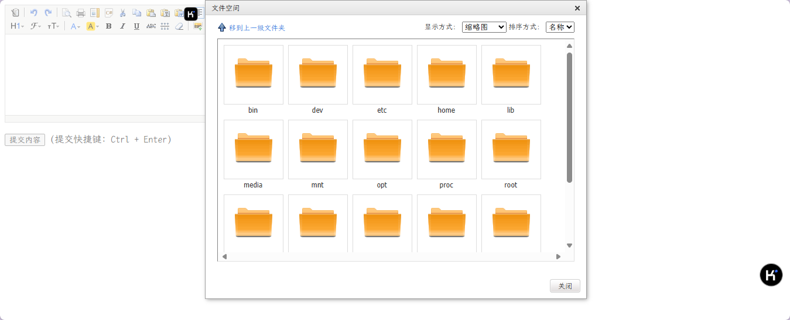

目录
`var/www/html/nothinghere`中有`fl000g.txt`
`nothinghere/fl000g.txt
得到 flag

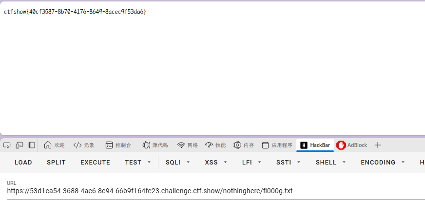

`ctfshow{40cf3587-8b70-4176-8649-8acec9f53da6}`

### web15

开启容器，题目提示：

```
公开的信息比如邮箱，可能造成信息泄露，产生严重后果
```

一个网页，直接去找邮箱信息


`1156631961@qq.com`

直接得到后台登录系统
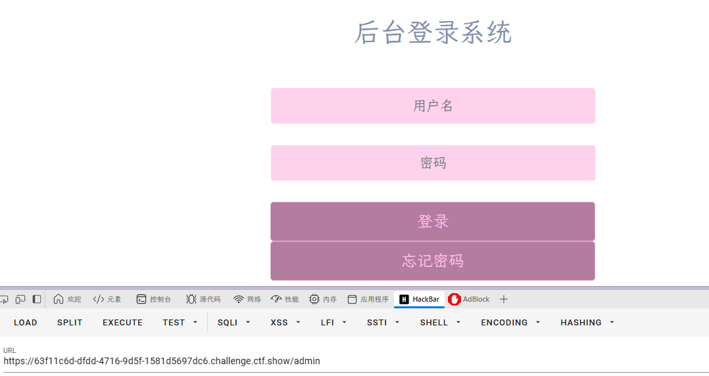

经过尝试得到 admin，发现密码不是邮箱，看了下忘记密码，有一个密保问题

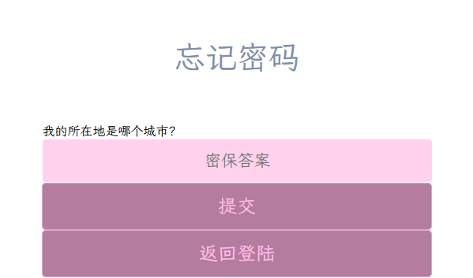

很容易的问题，可以联想通过 qq 邮箱找到城市
通过手机 qq 可以找到其为陕西西安
所以填西安即可
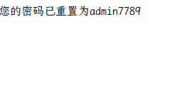

得到 flag
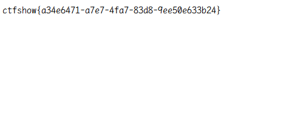
