### web16

开启容器，题目提示：

```
对于测试用的探针，使用完毕后要及时删除，可能会造成信息泄露
```

> php 探针
> php 探针是用来探测空间、服务器运行状况和 PHP 信息用的，探针可以实时查看服务器硬盘资源、内存占用、网卡流量、系统负载、服务器时间等信息。

url 后缀名添加`/tz.php` 版本是雅黑 PHP 探针

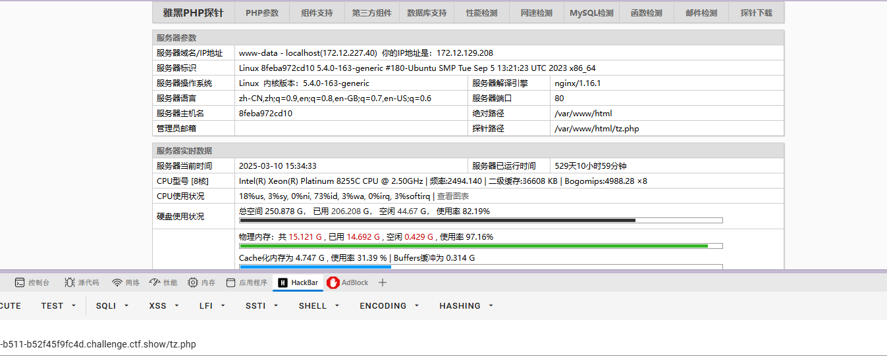

可以查看 phpinfo
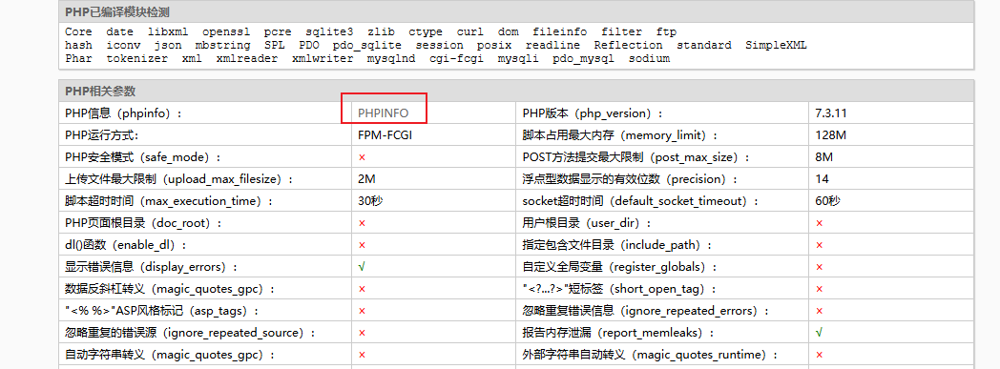

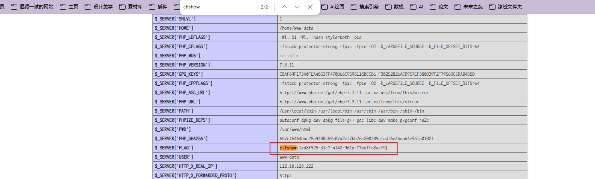

找到 flag
`ctfshow{1ed8f925-d1c7-4142-961a-77edffa8acf9}`

### web17

开启容器，题目提示：

```
备份的sql文件会泄露敏感信息
```

直接看`backup.sql`

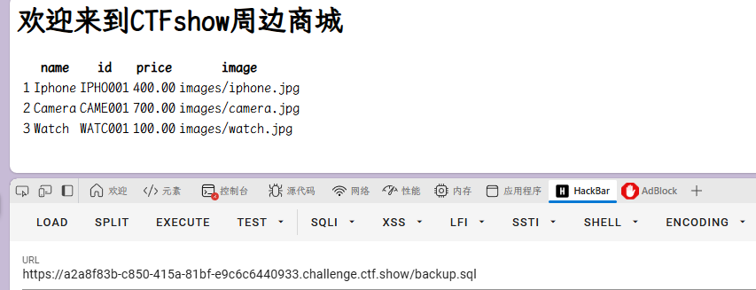

可以下载到文件

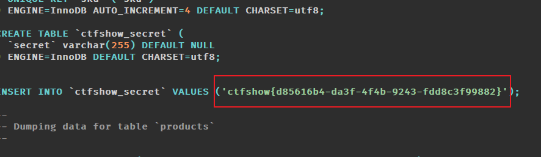

`ctfshow{d85616b4-da3f-4f4b-9243-fdd8c3f99882}`

### web18

开启容器，题目提示：

```
不要着急，休息，休息一会儿，玩101分给你flag
```

一看很像 js 的题目，直接看 js 源码
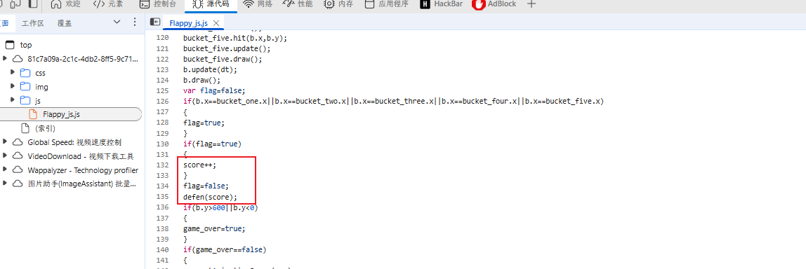

分数用`score`表示，查看通关条件，解码
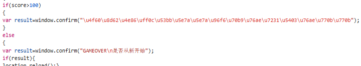
unicode 解码得到`110.php`关键信息
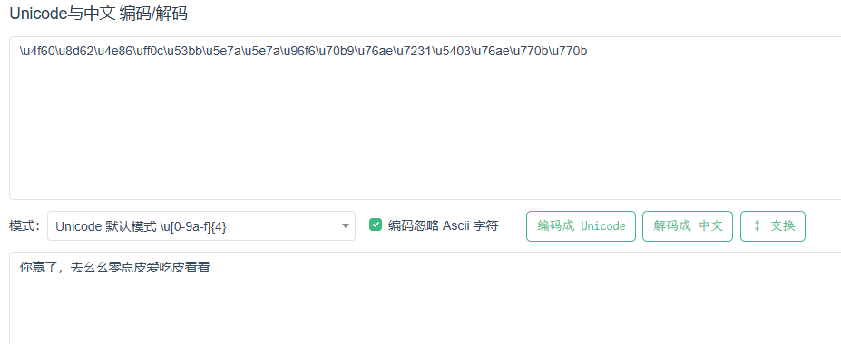
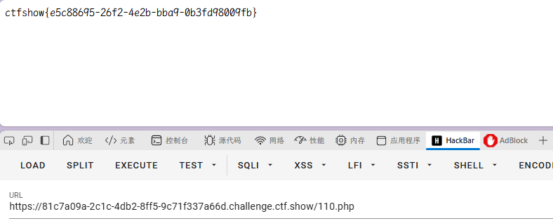

得到 flag
`ctfshow{e5c88695-26f2-4e2b-bba9-0b3fd98009fb}`

### web19

开启容器，题目提示：

```
密钥什么的，就不要放在前端了
```

密钥在前端，直接看源码
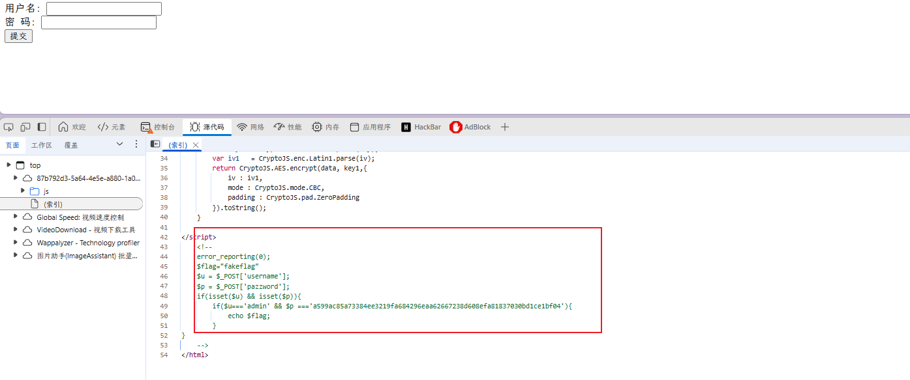关键验证代码

```js
function checkForm() {
  var key = "0000000372619038";
  var iv = "ilove36dverymuch";
  var pazzword = $("#pazzword").val();
  pazzword = encrypt(pazzword, key, iv);
  $("#pazzword").val(pazzword);
  $("#loginForm").submit();
}

function encrypt(data, key, iv) {
  //key,iv：16位的字符串
  var key1 = CryptoJS.enc.Latin1.parse(key);
  var iv1 = CryptoJS.enc.Latin1.parse(iv);
  return CryptoJS.AES.encrypt(data, key1, {
    iv: iv1,
    mode: CryptoJS.mode.CBC,
    padding: CryptoJS.pad.ZeroPadding,
  }).toString();
}
```

- $u = 'admin'
- $p = 'a599ac85a73384ee3219fa684296eaa62667238d608efa81837030bd1ce1bf04'

对应用赛博大厨解密

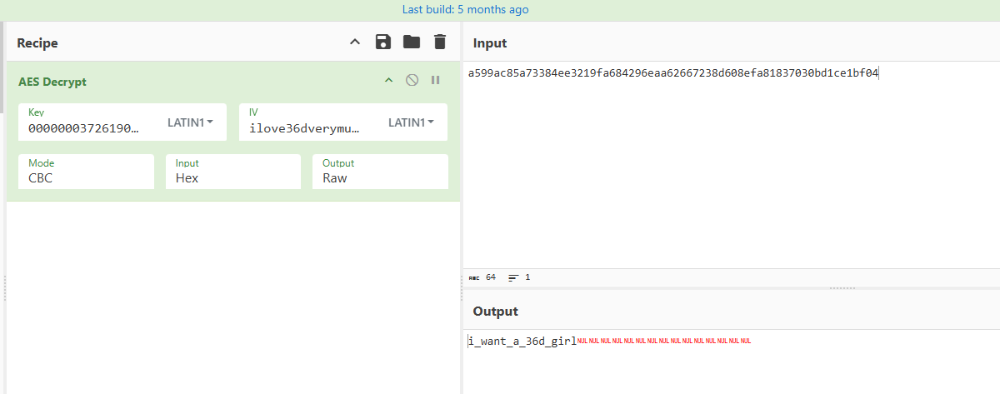

得到密码
`i_want_a_36d_girl`
得到 flag
`ctfshow{1fac167c-5594-4b7c-aca9-0182a49f64e0}`
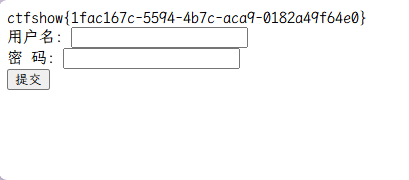

### web20

开启容器，题目提示

```
mdb文件是早期asp+access构架的数据库文件，文件泄露相当于数据库被脱裤了。
```

早期 asp+access 架构的数据库文件为 db.mdb

直接访问`/db/db.mdb`，下载文件，打开后搜索 flag
得到 flag
`flag{ctfshow_old_database}`
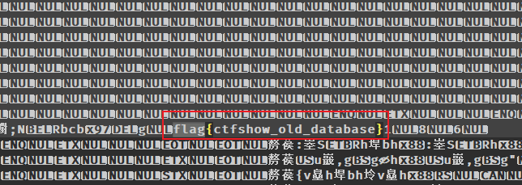