### web21

开启容器，题目提示

```
爆破什么的，都是基操
```

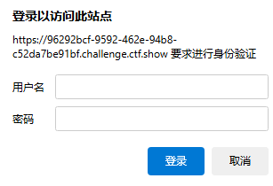

一个登录界面，打开 burp 抓包
找到账号密码存放位置

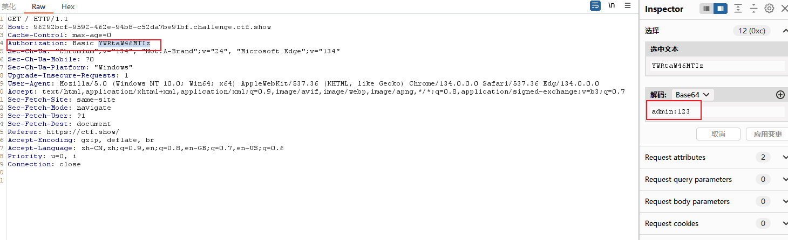

转发到攻击器，加载入密码字典，选择增加前缀`admin:`,并作 base64 加密操作
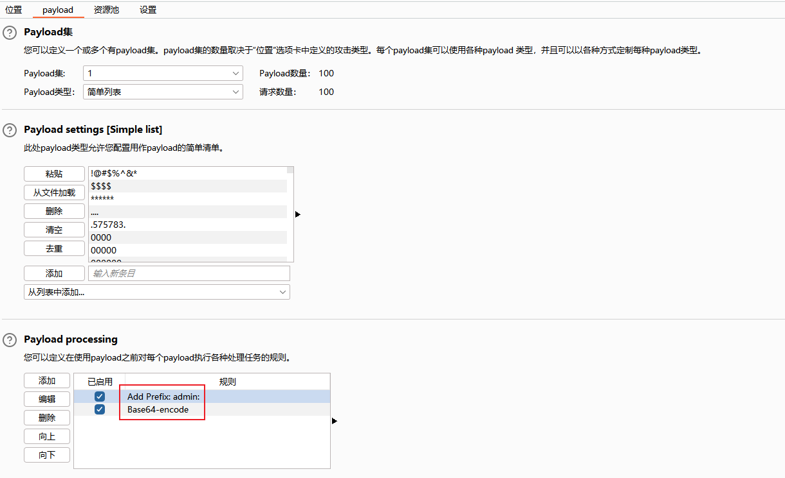

找到密码，shark63
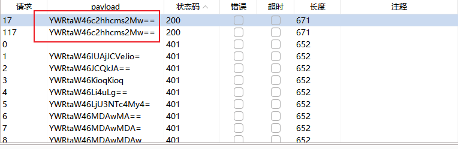

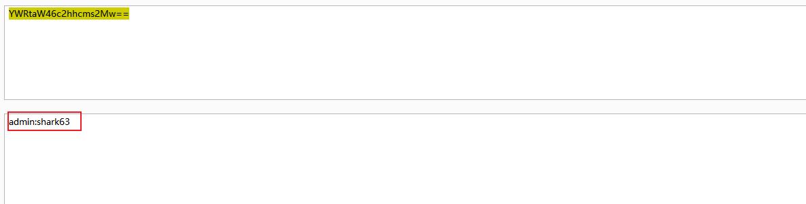

输入得到 flag
`ctfshow{1c1ea94a-440b-4405-aae9-1b48c4da2fe4}`

### web22

题目提示，很像扫描路径

```
域名也可以爆破的，试试爆破这个ctf.show的子域名
```

域名更新后，flag.ctf.show 域名失效

内容是 flag{ctf_show_web}

### web23

开启容器，题目提示：

```
还爆破？这么多代码，告辞！
```

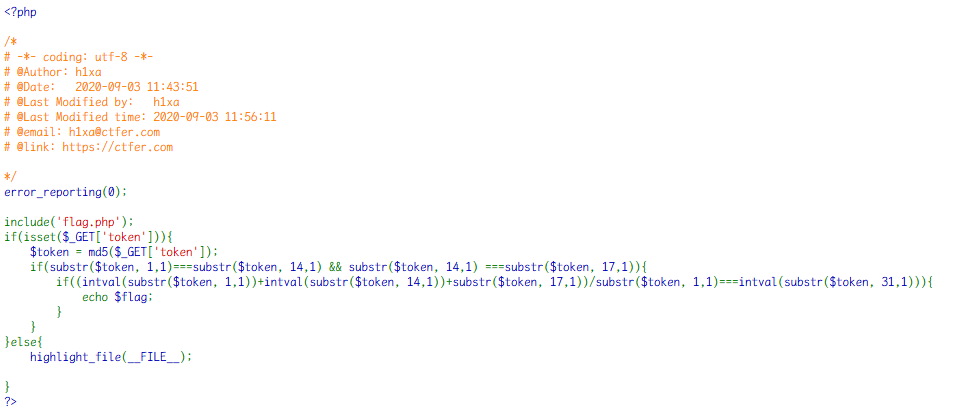

代码审计，一眼看应该是找到一个特殊的 token，其 md5 值有多个特殊条件，写一个脚本即可

```python
import hashlib

# 定义字符集
dic = '1234567890abcdefghijklmnopqrstuvwxyz'

# 遍历所有可能的两个字符的组合
for a in dic:
    for b in dic:
        # 将两个字符组合成字符串
        t = a + b
        # 计算字符串的MD5哈希值
        md5_result = hashlib.md5(t.encode()).hexdigest()
        # 检查哈希值是否满足条件：第2、15、18个字符相等
        if md5_result[1] == md5_result[14] == md5_result[17]:
            # 增加新的条件判断
            try:
                # 提取哈希值的特定字符并转换为整数
                char1 = int(md5_result[1], 16)  # 第2个字符
                char14 = int(md5_result[14], 16)  # 第15个字符
                char17 = int(md5_result[17], 16)  # 第18个字符
                char31 = int(md5_result[31], 16)  # 第32个字符

                # 计算条件表达式
                if (char1 + char14 + char17) / char1 == char31:
                    print(t)
            except ZeroDivisionError:
                # 如果除数为0，跳过当前组合
                continue
```

得到`3j`
成功得到 flag
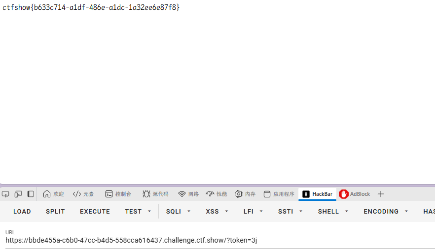

### web24

开启容器，题目提示：

```
爆个🔨
```

好不礼貌哦
同样代码审计
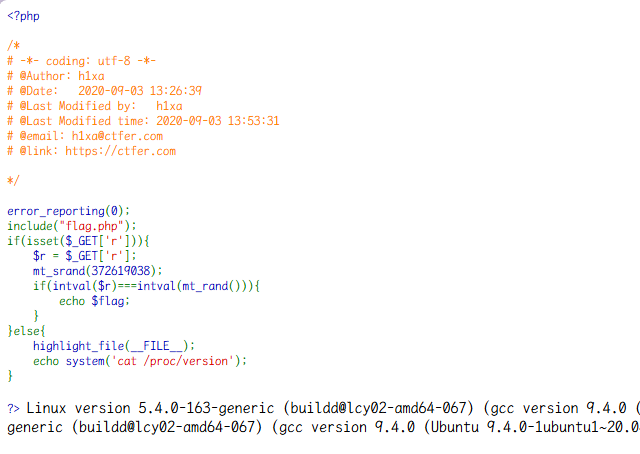

种子伪随机数

`mt_srand()` 函数播种 Mersenne Twister 随机数生成器。

php 本地运行代码

```php
<?php

mt_srand(372619038);
echo intval(mt_rand());
// 1155388967
?>
```

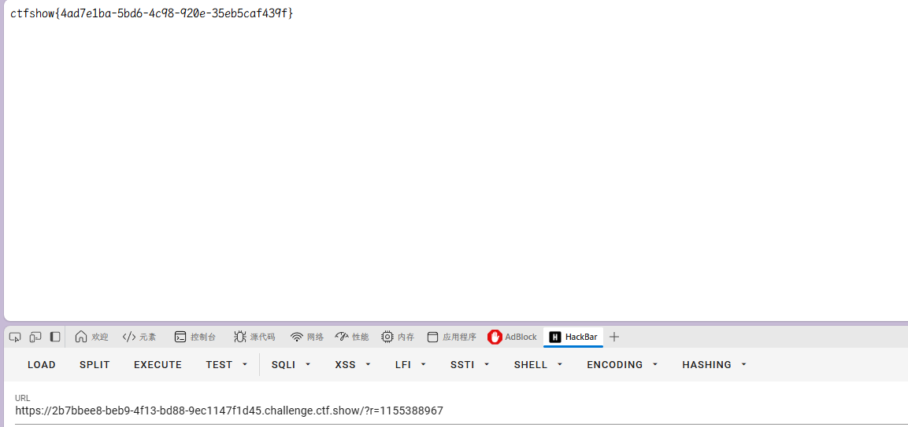

### web25

开启容器，题目提示

```
爆个🔨，不爆了
```

同样是代码审计，可以发现如果传入`r=0`,可以得到`-intval(mt_rand())`

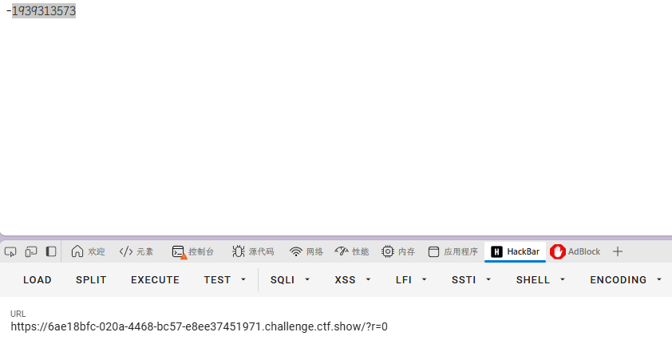
-1939313573

`mt_srand(hexdec(substr(md5($flag), 0,8)));`
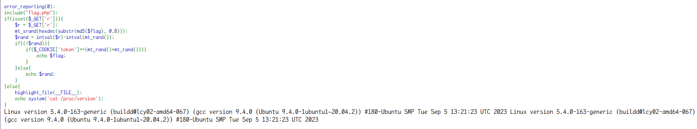

要用到
`php_mt_seed`爆破随机数序列种子的工具。

- 其项目官网为：[https://www.openwall.com/php_mt_seed/](https://www.openwall.com/php_mt_seed/)
- github 地址为：[https://github.com/openwall/php_mt_seed](https://github.com/openwall/php_mt_seed)

在 linux 中直接`git clone`一下

如果环境不允许，本地下载 php_mt_seed4.0

该工具能够通过随机数逆推
首先编译出程序
` gcc php_mt_seed.c -o php_mt_seed`

`./php_mt_seed 1939313573

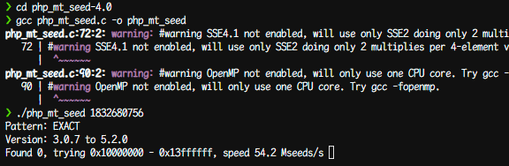
程序会爆出多个结果对应 php 的版本


php 版本为 7.3.11
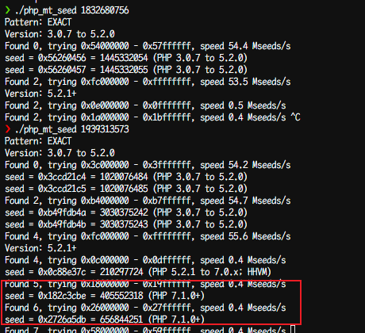

405552318
656844251

用逆推得到 seed

```
<?php
$seedValue = 1256061574.0;
$seedValue = (int)$seedValue; // 将浮点数强制转换为整数
mt_srand($seedValue);

$randomNumber1 = mt_rand();
$randomNumber2 = mt_rand();
$randomNumber3 = mt_rand();

echo $randomNumber1 . "\n";
echo $randomNumber2 . "\n";
echo $randomNumber3 . "\n";
echo ($randomNumber2 + $randomNumber3) . "\n\n";
?>
```

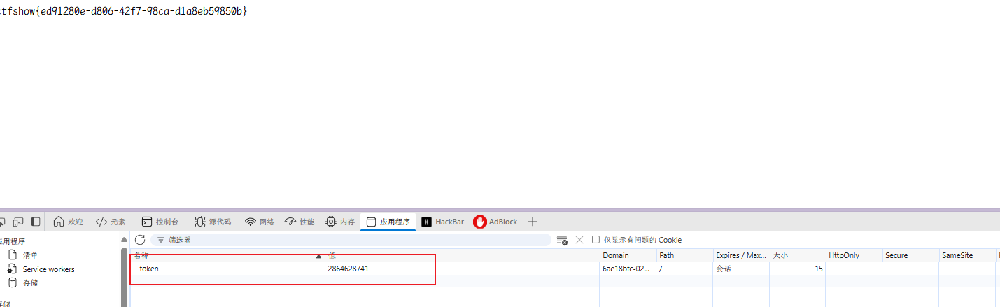

成功得到 flag

### web26

开启容器，题目提示：

```
这个可以爆
```

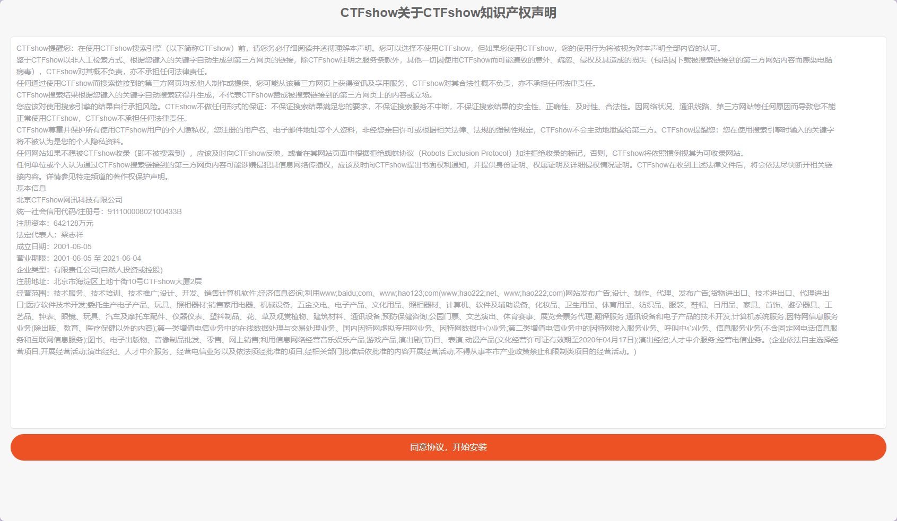
是一个安装界面
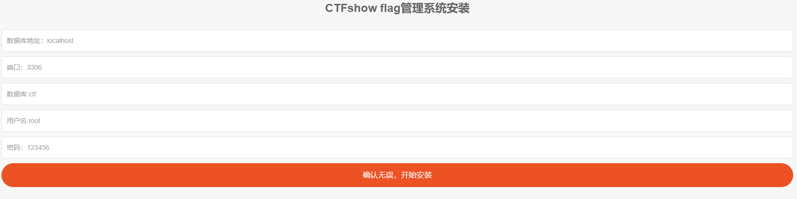

直接重新发包，得到 flag，有点非预期啊，不是说要爆破
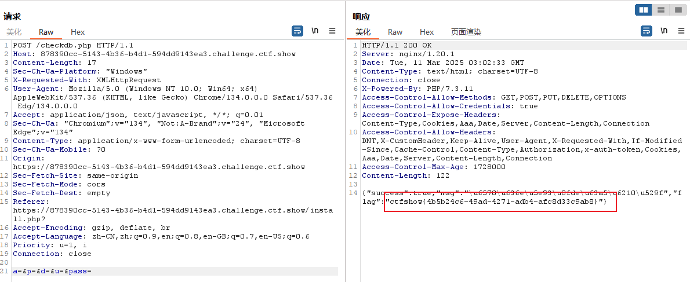

### web27

开启容器，题目提示

```
CTFshow菜鸡学院招生啦！
```


有录取名单
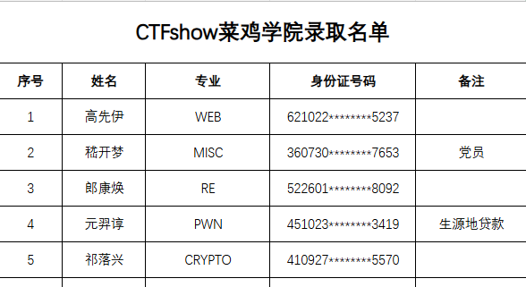

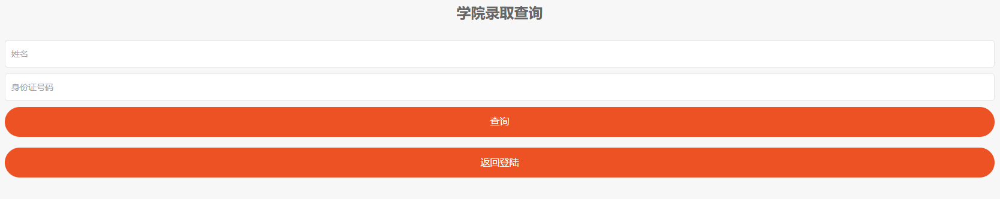

还有一个录取查询系统
身份证的日期号码需要爆破即可
我们挑选第一个人进行抓包

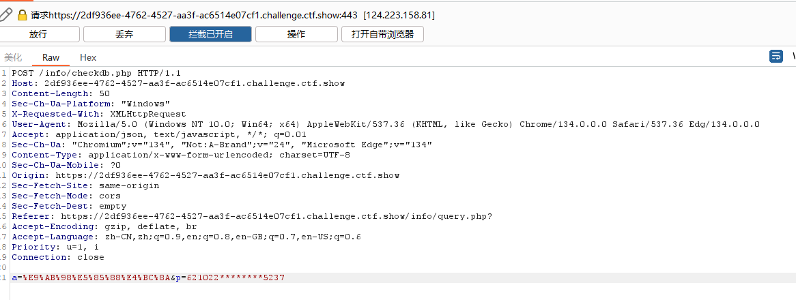

转发到攻击器

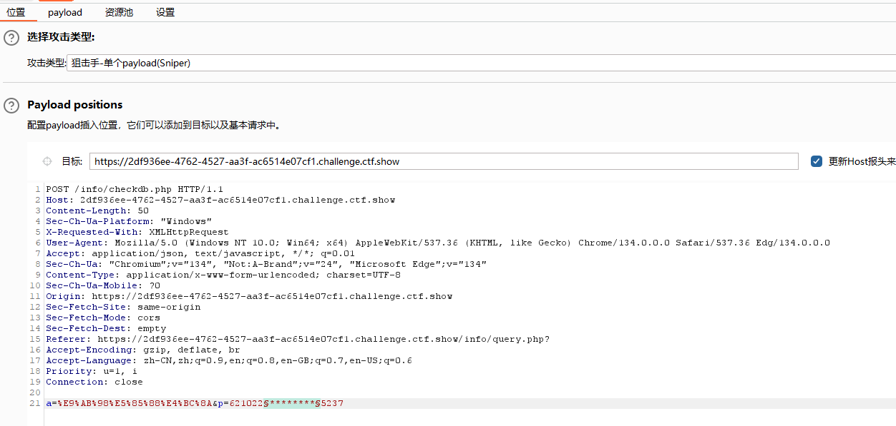

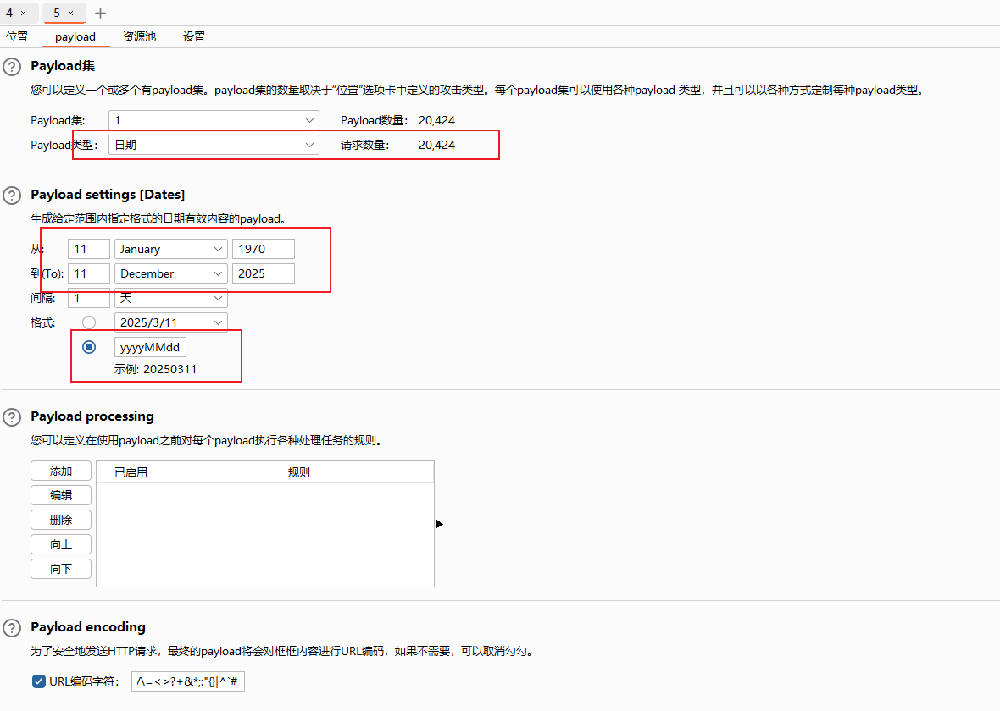

如此设计后，进行攻击

找到身份证号
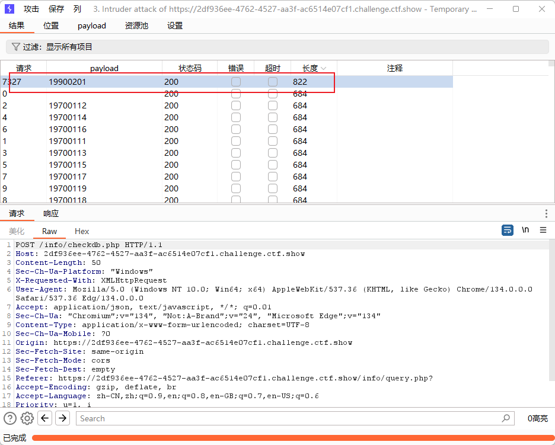

高先伊
621022199002015237
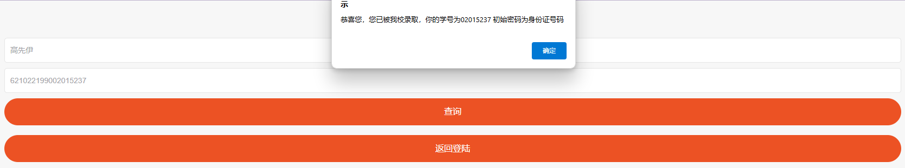

02015237
621022199002015237

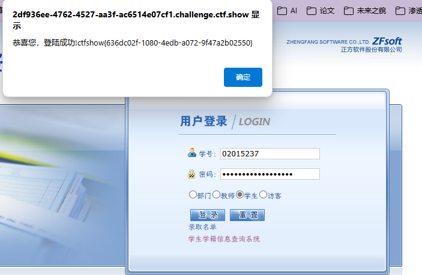

找到 flag

### web28

开启容器，题目提示

```
大海捞针
```

抓包转发到攻击器

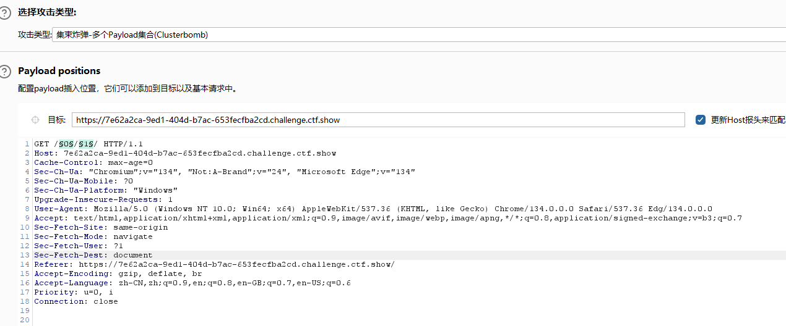

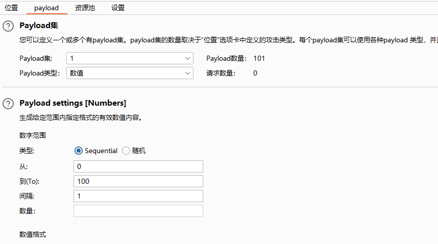

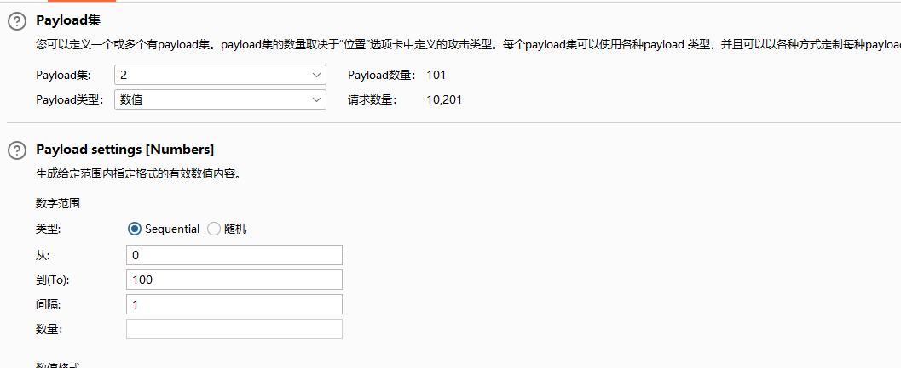

成功得到 flag
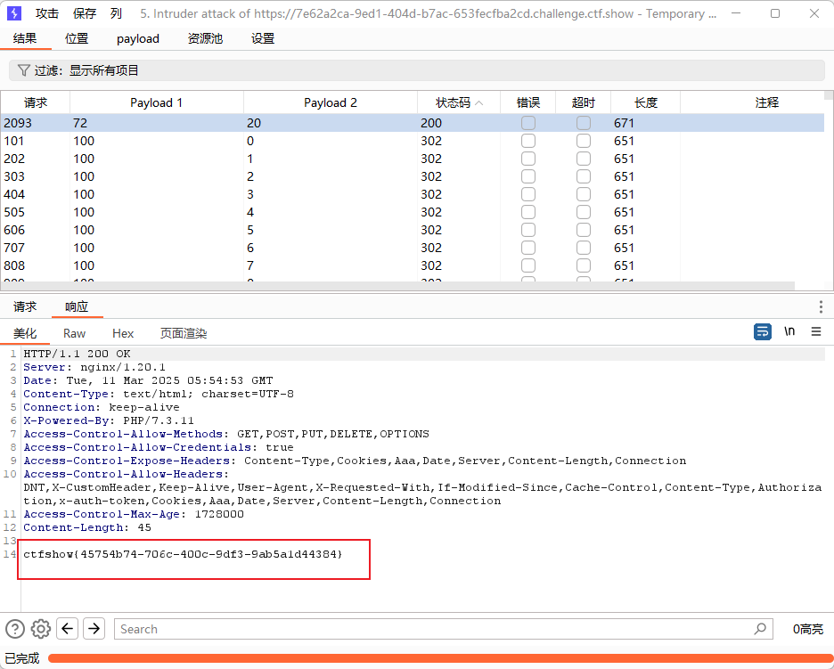