### web89（ #intval ）

开启容器

代码审计

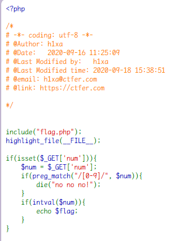

注意事项

- 如果字符串中包含非数字字符，`intval` 会尽可能地转换开头的数字部分。若开头不是数字，则返回 0。
- 对于浮点数，`intval` 会直接舍去小数部分，不进行四舍五入。
- 在处理不同进制的数值时，合理设置 `base` 参数可以实现正确的转换。

只要是 num 不为非数字开头即可

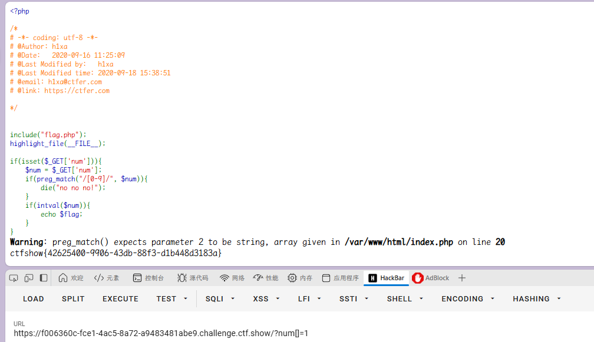

直接传入数组绕过即可

`Warning: preg_match() expects parameter 2 to be string, array given in /var/www/html/index.php** on line 20`

可以绕过`preg_match()`

且

```php
$num[] = 1;

echo intval($num);
```

结果为 1

### web90（ #intval ）

开启容器

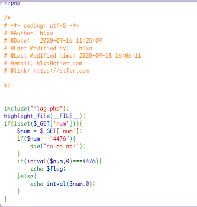

代码审计

这里可以运用`intval`的函数特性

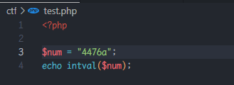

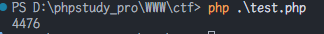

因此直接传入 num 为`4476a`即可

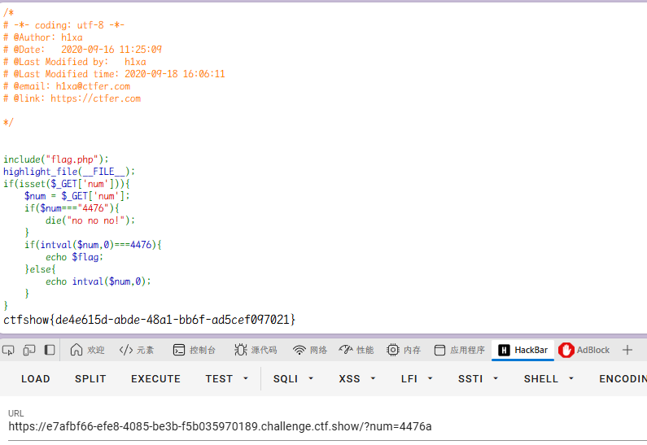

### web91（ #intval ）

开启容器

代码审计

#### 过滤信息

- 外层正则表达式 `/^php$/im` 的含义：
  - `^`：表示字符串的开始。
  - `php`：要匹配的字符序列。
  - `$`：表示字符串的结束。
  - `i`：修饰符，表示不区分大小写。
  - `m`：修饰符，表示多行模式（`^` 和 `$` 匹配每一行的开始和结束，而不仅仅是整个字符串的开始和结束）
- 内层正则表达式 `/^php$/i` 的含义：
  - `^`：表示字符串的开始。
  - `php`：要匹配的字符序列。
  - `$`：表示字符串的结束。
  - `i`：修饰符，表示不区分大小写。

首先要符合外层，同时不符合内层

`$a = "\nphp";`：外层条件满足（某一行是 `php`），但内层条件不满足（多行字符串），因此不会输出 `'hacker'`。

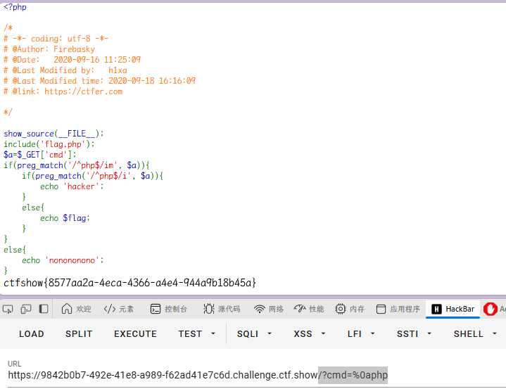

`/?cmd=%0aphp`

### web92（ #intval ）

开启容器

代码审计

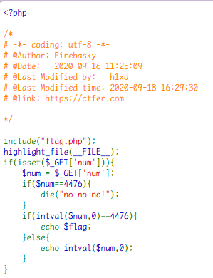

1. **`intval($num, 0)`**：
   - `intval` 函数将变量 `$num` 转换为整数。
   - 第二个参数 `0` 表示自动判断 `$num` 的数值类型（如十进制、十六进制等）。
2. **条件判断**：
   - 检查转换后的整数值是否等于 4476。
3. **输出结果**：
   - 如果条件满足，即 `$num` 转换为整数后等于 4476，则输出变量 `$flag` 的值。

`/?num=0x117c`

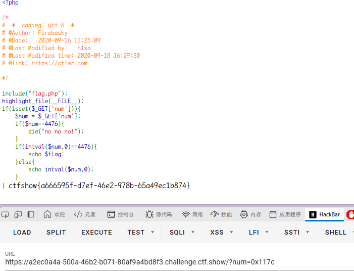

传入十六进制即可

`/?num=4476e10`

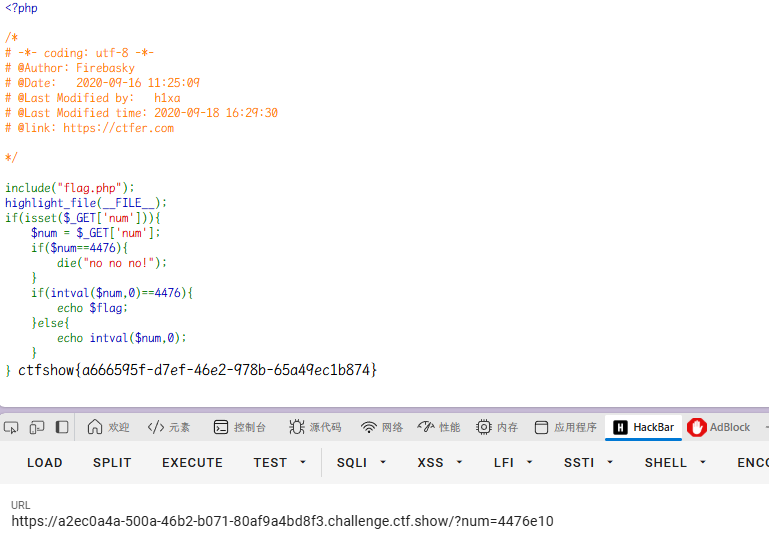

这里的 4476e10 与浮点数有关

```
<?php
var_dump(intval('4476e123',0));
```

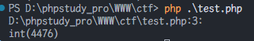

### web93（intval）

开启容器

代码审计

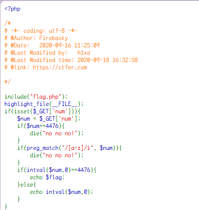

其实直接浮点数即可，intval 函数可以得到 flag

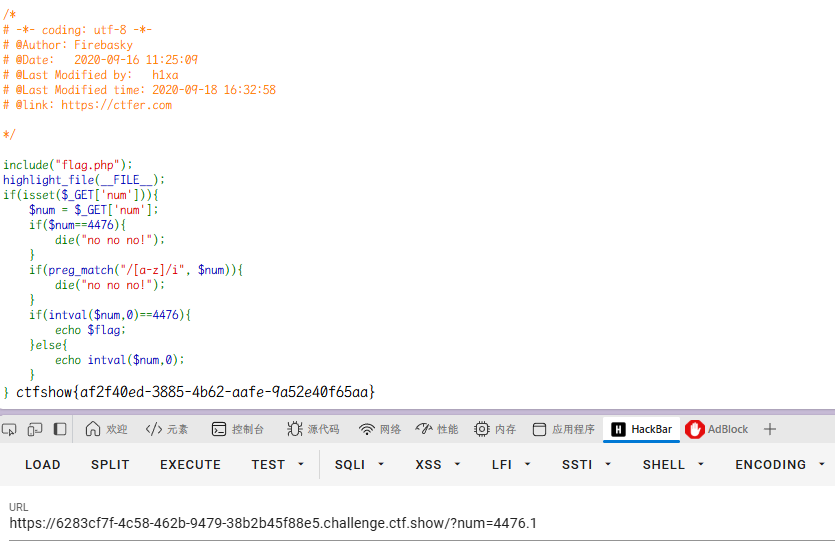

### web94（ #intval ）

开启容器

代码审计

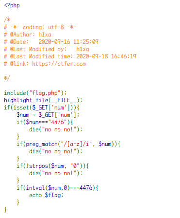

多了一个`strpos`函数

这段 PHP 代码的作用是检查变量 `$num` 是否包含字符 "0"。如果不包含，则输出 "no no no!" 并终止脚本的执行。

那其实可以给出`/?num=4476.01`

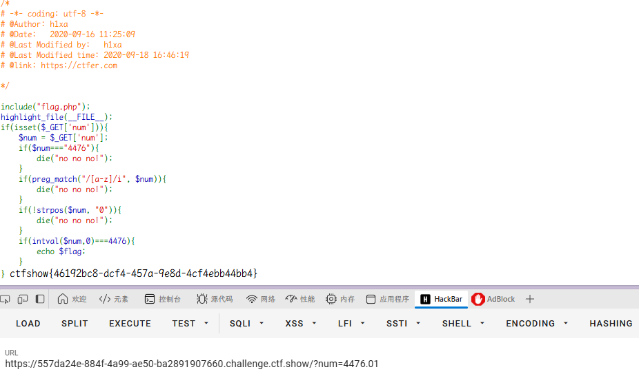

### web95（ #intval ）

开启容器

代码审计

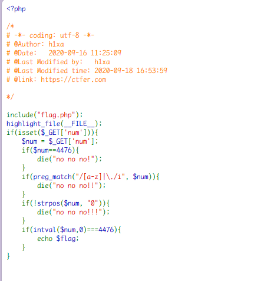

这次过滤不能有`.`

可以用八进制绕过
/?num=+010574

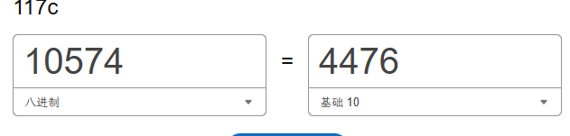

`?num=+010574`或者`?num=%2b010574`

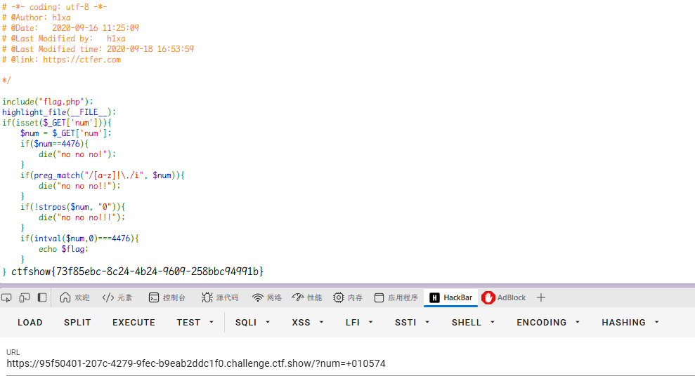

### web96（ #路径穿越 ）

开启容器

代码审计

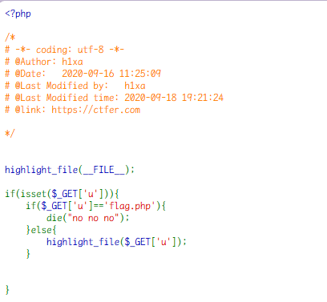

可以`./flag.php`

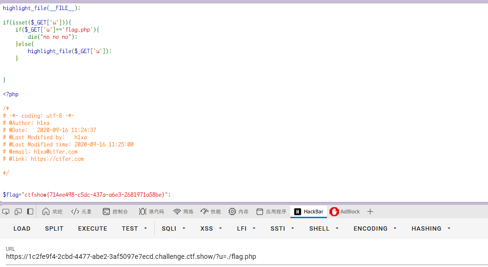
