### web123( #中括号转换下划线 )

开启容器

代码审计

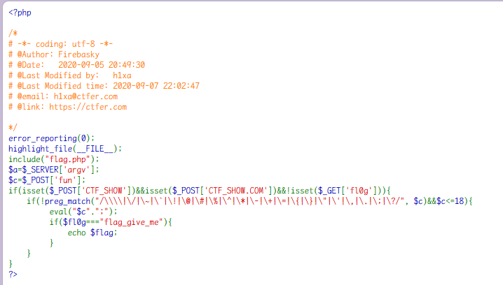

要求存在 post 传入  CTF_SHOW 和 CTF_SHOW.COM，不能存在  [get](https://so.csdn.net/so/search?q=get&spm=1001.2101.3001.7020)  传入  fl0g。

`CTF_SHOW=&CTF[SHOW.COM=&fun=echo $flag`

在给参数传值时，如果参数名中存在非法字符，比空格和点，则参数名中的点和空格等非法字符都会被替换成下划线。并且，在 PHP8 之前，如果参数中出现中括号 `[` ，那么中括号会被转换成下划线 `_` ，但是会出现转换错误，导致如果参数名后面还存在非法字符，则不会继续转换成下划线。也就是说，我们可以刻意拼接中括号制造这种错误，来保留后面的非法字符不被替换，因为中括号导致只会替换一次。

确保传参符合条件后，由于没有过滤字母和空格，直接用 echo 输出 flag，后面会拼接好分号。


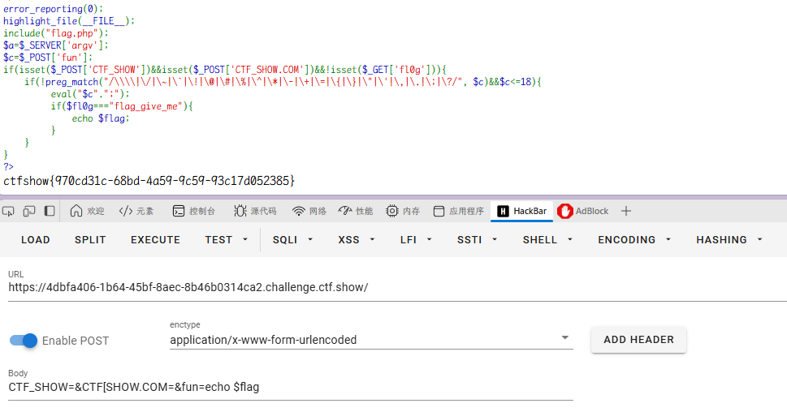

上面是非预期解

```php
$a=$_SERVER['argv'];
```

在 PHP 中，$\_SERVER['argv'] 用于获取脚本的命令行参数，通常，这是在命令行模式下运行 PHP 脚本时使用的，而不是在网页模式下使用。

当在命令行模式下运行 PHP 脚本时，例如： php script.php arg1 arg2

那么 $\_SERVER['argv'] 将包含以下内容：

```php
$_SERVER['argv'][0] = 'script.php';  // 脚本名$_SERVER['argv'][1] = 'arg1';
// 第一个参数

$_SERVER['argv'][2] = 'arg2';
// 第二个参数
```

payload：

```php
get: ?a=1+fl0g=flag_give_me
post: CTF_SHOW=&CTF[SHOW.COM=&fun=parse_str($a[1])
```

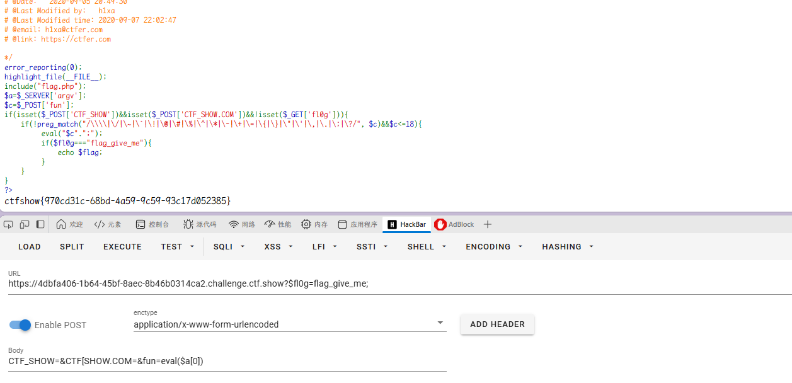

得到 flag

### web125

开启容器

代码审计

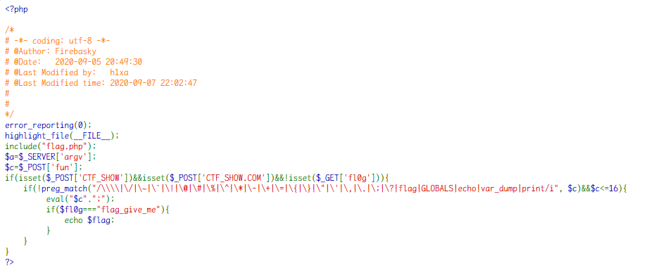

payload

```
?1=flag.php
post：CTF_SHOW=&CTF[SHOW.COM=&fun=highlight_file($_GET[1])
```

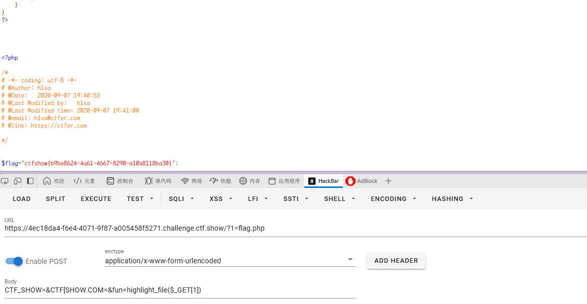

这里之所以再采用一个 1 来进行传参，应该是为了绕过正则里面对 flag 的过滤。

还可以用`include`  结合伪协议读取，payload：

```
CTF_SHOW=&CTF[SHOW.COM=&fun=include($_POST[1])&1=php://filter//convert.iconv.SJIS*.UCS-4*/resource=flag.php
```

### web126

开启容器

代码审计

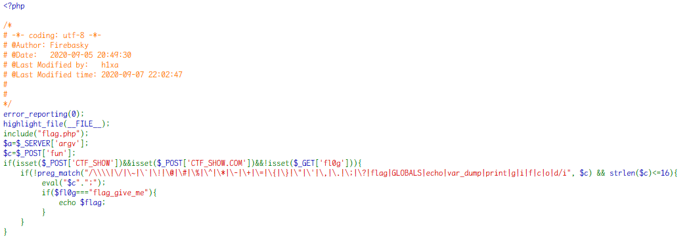

新增过滤大小写字母：|g|i|f|c|o|d/i

伪协议也不好使了，使用 web123 中的 payload：

`get：?$fl0g=flag_give_me;`
`post：CTF_SHOW=&CTF[SHOW.COM=&fun=eval($a[0])`

post 传 assert 也是可以的：

```php
CTF_SHOW=&CTF[SHOW.COM=&fun=assert($a[0])
```

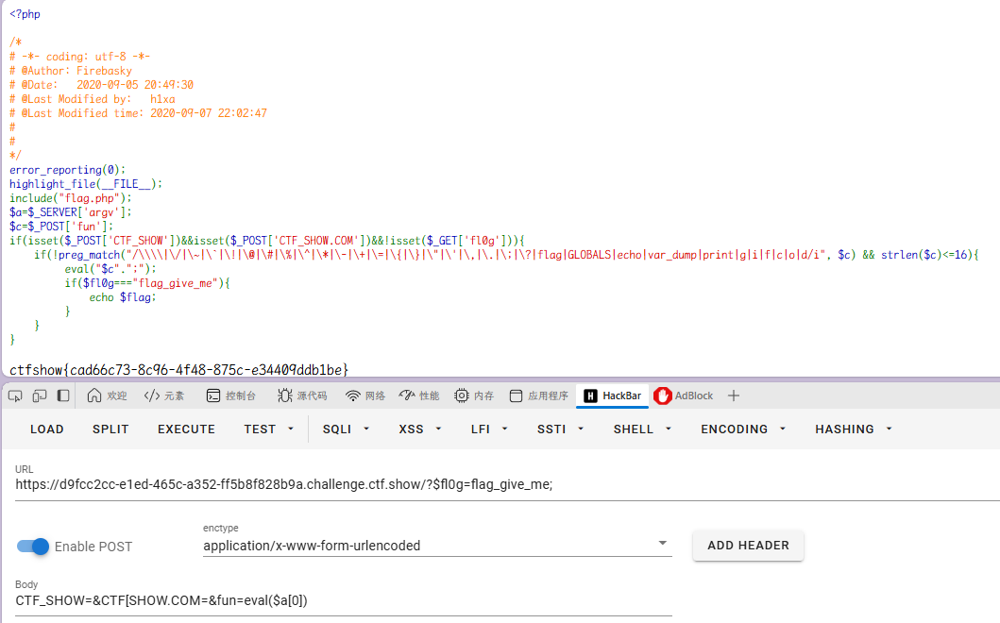

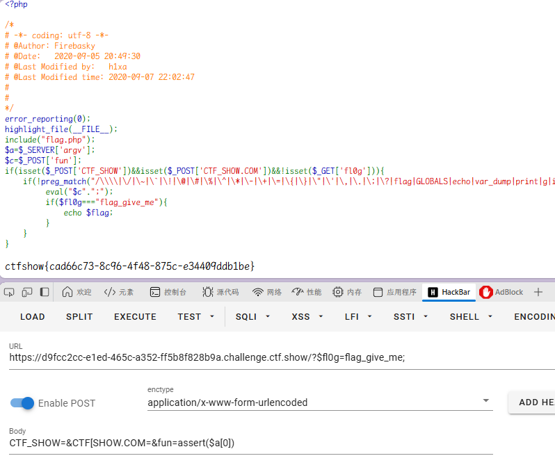

### web127

开启容器

代码审计

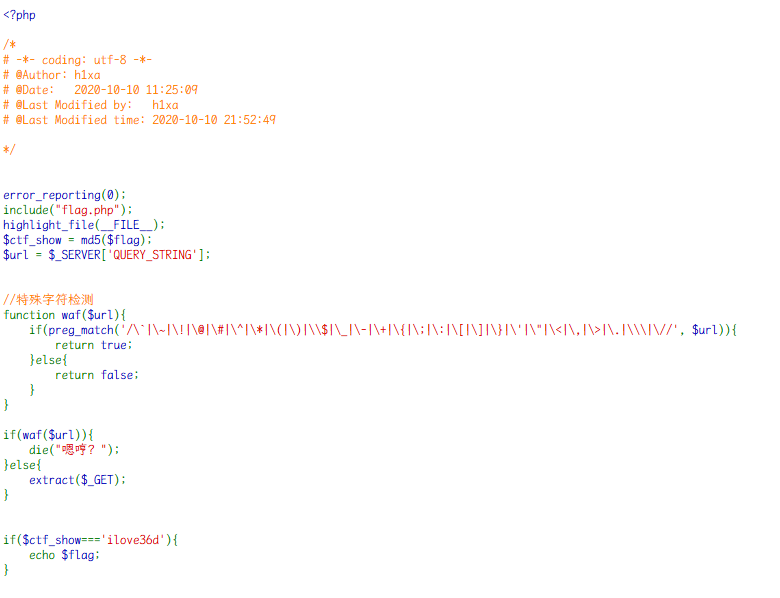

题中有 extract，所以是要实现变量覆盖，令 ctf_show=ilove36d。  
extract 可以从数组中将变量导入到当前的符号表，本题限制了中括号，看一下输入字符串是否可行。

本题测试一下，确认`?ctf_show=ilove36d`可以覆盖变量 ctf_show。

题目中下划线也被限制了，可以用空格绕过。

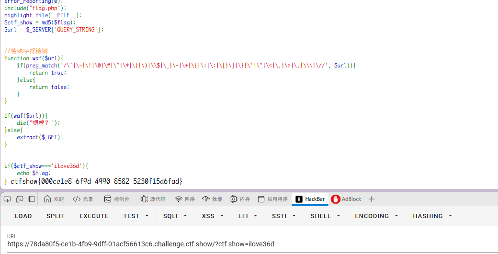

### web128

开启容器

代码审计

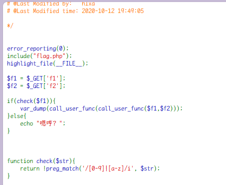

> call_user_func 把第一个参数作为回调函数调用，其余参数是回调函数的参数。

两个 call_user_func，第一个函数可以有一个参数，返回的第二个函数是无参数函数。

**get_defined_vars()**：返回由所有已定义变量所组成的数组。  
当前文件包含 flag.php，直接打印`$flag`变量。

本题又是一个新的知识点。  
**gettext()**：获取的文本框当前输入内容的方法，返回内容。`_()`是 gettext()函数的简写形式，需要 php 扩展目录下有 php_gettext.dll 才能使用。

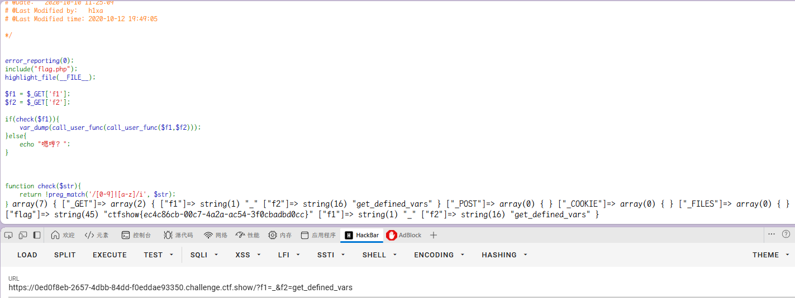

### web129

开启容器

代码审计

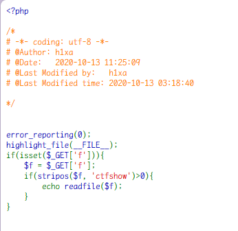

stripos 是 PHP 中的一个字符串函数，用于查找字符串在另一个字符串中首次出现的位置（不区分大小写）。

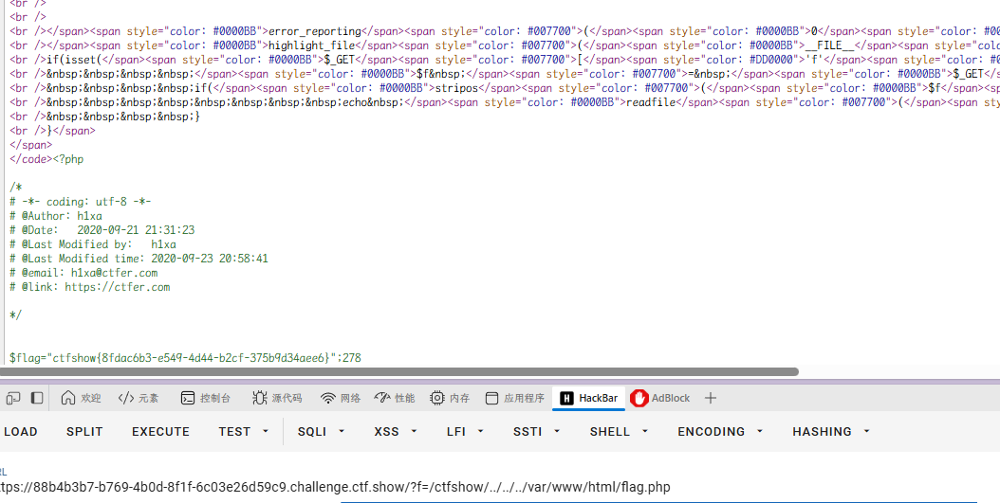

本地测试发现，如果不包含 ctfshow，输出为空，可能无法执行命令，因此采用目录穿越
`?f=/ctfshow/../../../var/www/html/flag.php`

得到 flag

### web130

开启容器

代码审计

`.+?` 是一个非贪婪的匹配，表示匹配尽可能少的字符。这里的 `.` 匹配任意字符（除了换行符），而 `+?` 是非贪婪的量词，表示匹配一次或多次，但尽可能少。这部分的作用是匹配从字符串开头到第一个出现的 `ctfshow` 之间的内容。

也就是说输入的内容里，ctfshow 前面不能有字符。

第二个判断。stripos 函数如果未发现字符串将返回 FALSE。  
全等于的条件是必须双方的类型也一样，所以 ctfshow 在首位返回的 0 与 FLASE 不全等。

所以**payload-post**：`f=ctfshow`

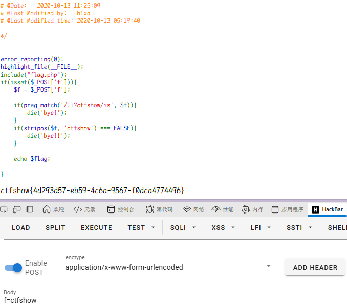

### web131

开启容器

代码审计

这道题既要求 ctfshow 不在首位就匹配，又要求有 36Dctfshow，非常的矛盾，所以只能找办法突破规则。

大概意思就是在 php 中正则表达式进行匹配有一定的限制，超过限制直接返回 false

利用 RCE 回溯

```php
<?php echo str_repeat('very', '250000').'36Dctfshow'; ?>
```

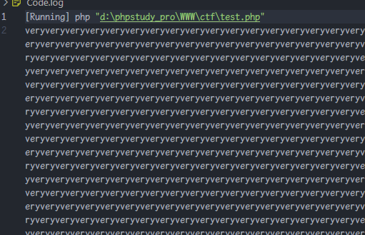

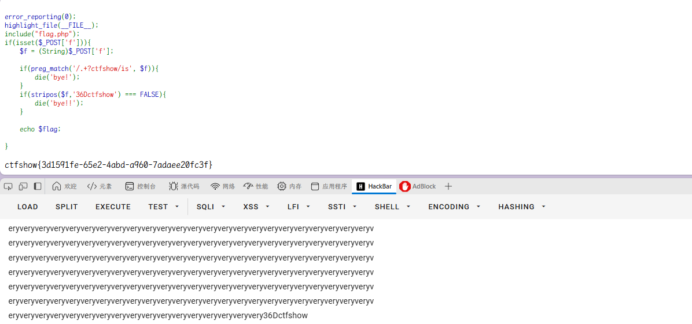

**非贪婪模式容易导致太多回溯。**
默认的 backtrack_limit（最大回溯数）是 100000，recursion_limit（最大嵌套数）是 100000。
嵌套太多，可能会造成耗尽栈空间爆栈。

### web 132

开启容器
是一个 blog 网站


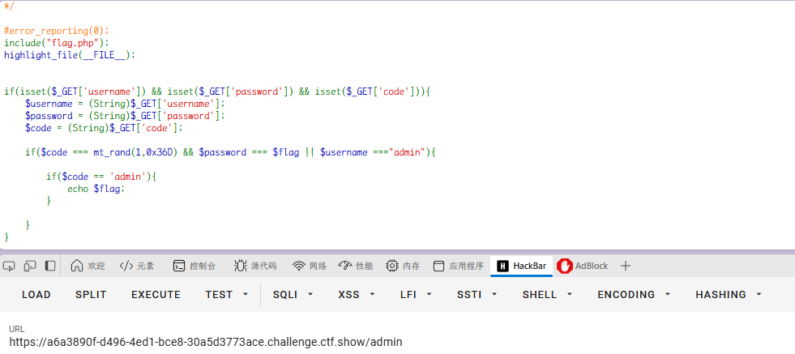

查看 admin 路由，查看到代码审计页面

只需要`$username ==="admin"`和`$code == 'admin'`

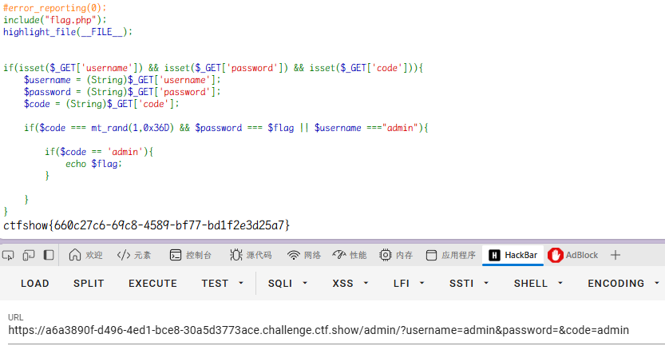
