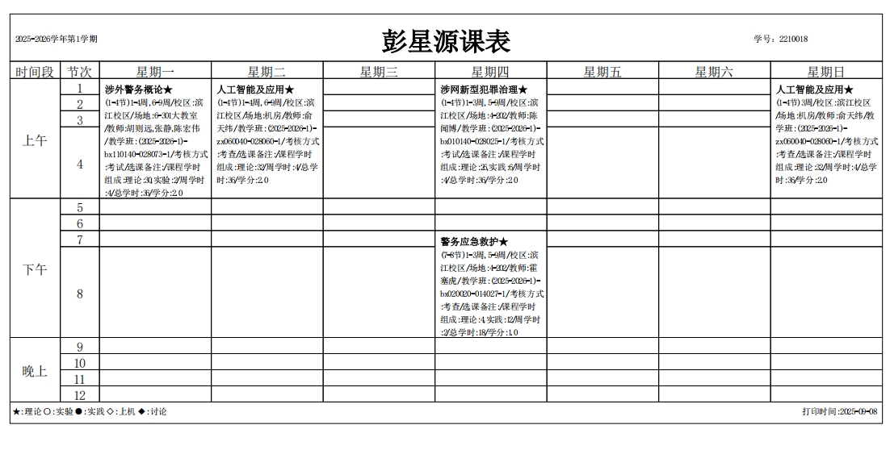

我不回头看我给自己断后路
I wont stop 所以我不再痛苦了

::: tabs

@tab:active 每日计划

zzll时政

图推

12节超格冲刺课
- 数量
- 言语

公专每日背诵

公专错题梳理

每日
- 集梦知觉
- 资料机考速练（fb）
- 速算练习1
- 数量10道题（小p）
- 图推20道

三大模块专精
- 判断超大杯
- 言语600题

### 1.8
- [x] 数资手感
- [ ] 图推
- [x] 言语冲刺
- [x] 时政整理
- [x] 公专思维课
- [ ] 申论复盘

### 1.9

- [ ] 数资手感
- [ ] 图推
- [ ] 政治理论整理
- [ ] 公专背诵+时政
- [ ] 思维
- [ ] 模考全复盘

### 1.6

- [x] 判断夸夸刷
- [x] 每日手感
- [x] 波波模考
- [x] 若冰课程
- [x] 公专梳理
- [x] 政治理论梳理
- [x] 警务战术模块梳理
- [x] 反电诈押题整理

### 元旦冲刺

12.31

- [x] 若冰冲刺课
- [x] 于哲冲刺课

1.1

- [x] 于哲2节
- [x] 数资稳手感
- [x] 申论一套

1.2

- [x] 

### 12.27-28

- [x] 模考
- [x] 逻辑秒题整理
- [x] 公专试卷2张
- [x] 冲刺课
- [x] 每日手感

### 12.26

- [x] 每日手感
- [x] 押题卷2
- [x] zzll
- [x] 公专卷子
- [x] 公专冲刺课

### 12.25

- [x] 申论套卷
- [x] 每日手感
- [x] 言语超大杯
- [x] zzll

### 12.24

- [x] 冲刺申论复盘
- [x] 桐套卷1——24多省
- [x] 于哲冲刺课
- [x] 判断超大杯
- [x] 每日手感

### 12.23

- [x] 公专试卷
- [x] 行测复盘
- [x] 于哲冲刺课
### 12.22

- [x] 资料机考
- [x] 数量p神
- [x] zzll
- [x] 公专冲刺课（若冰+宇哲考点19）
- [x] 速算

### 12.21

- [x] zzll
- [x] 资料机考
- [x] 数量p神
- [ ] 若冰冲刺课
- [ ] 

### 12.20

- [x] 藏蓝网机考行测模拟
- [x] 公安真题两连做
- [ ] 申论复盘

### 12.19

- [x] 晚上言语一套
- [x] 申论押题卷

### 12.18

- [x] 数量
- [x] zzll
- [x] 思维提升
- [x] 治安处罚
- [x] 图推手感
- [x] 定义特训

### 12.17

- [x] 政治理论
- [x] p神数量
- [x] 桐哥思维提升
- [ ] 公安真题
- [x] 申论复盘
- [ ] 图推手感

### 12.16

- [x] p神数量
- [x] zzll
- [x] 机考资料
- [x] 桐哥思维提升
- [x] 华图模考
- [x] 桐哥思维提升刷
- [ ] 资料分析私人默写单

### 12.14

- [x] p神数量
- [x] zzll
- [x] 资料机考
- [ ] 资料分析私人默写单
- [x] 桐哥思维提升 1
- [x] 公安思维提升题目
- [x] 申论套卷晚上
- [x] jkt

### 12.13

- [ ] jkt一个大模块
- [x] 数量p
- [x] zzll
- [x] 资料机考
- [x] 桐哥补课 14-24 刑法分则

### 12.12

- [x] 知觉+资料（尽量不动笔）
- [x] zzll
- [x] 小p数量
- [x] 桐哥思维提升
- [ ] 桐哥基础课补课

### 12.11

- [x] 知觉+资料（尽量不动笔）
- [x] zzll
- [x] 小p数量
- [x] 桐哥思维提升
- [x] 桐哥刷题课
- [x] 逻辑拔高（6节）
- [ ] 资料默写单制作

12.10

- [x] 知觉+资料（尽量不动笔）
- [x] zzll
- [x] 小p数量
- [x] 桐哥思维提升
- [x] 桐哥刷题课
- [x] 申论套卷
- [x] 逻辑拔高（8节）

### 12.9

- [x] 模考
- [x] 桐哥刷题，尽可能梳理笔记，思维提升课
- [x] 薛睿逻辑课（2）
- [x] 申论复盘
- [x] 题型梳理冲刺计划明晰

### 11.7 

- [x] 省考报名
- [x] 涉网考试
- [x] 涉外复习
- [x] 公专
- [x] 资料手感
- [x] 逻辑拔高
- [x] 成语
- [x] 言语600

### 11.6

- [x] 申论套卷
- [x] 涉网+涉外复习
- [x] 言语600
- [x] 公专
- [x] 资料保持手感
- [x] 逻辑拔高

### 11.5

- [x] 言语夸夸刷
- [x] 逻辑拔高（31/62）
- [x] 判断夸夸刷
- [x] 公专
- [x] 成语
- [x] 公专
- [ ] 申论复盘
- [x] 涉网复习常识
- [x] 粉笔资料手感

### 11.4

- [x] 23国考卷
- [x] 23国考复盘
- [x] 言语夸夸刷
- [ ] 逻辑拔高
- [x] 公专
- [x] 申论复盘

### 11.3

- [x] 言语夸夸刷
- [x] 判断夸夸刷
- [x] 资料复盘
- [x] 公专
- [x] 逻辑拔高
- [x] 成语

### 11.2 复盘调整日

- [ ] 资料坑点统计
- [x] 模考数资言语判断复盘
- [ ] 公专
- [x] 申论套卷
- [x] 言语夸夸刷
- [x] 粉笔资料

### 11.1 模考日

- [ ] 资料坑点统计
- [x] 公专

### 10.31

- [x] 逻辑600
- [x] 机考资料
- [x] 言语夸夸刷
- [ ] 申论套卷
- [x] 申论复盘
- [ ] 超大杯图推
- [x] 逻辑拔高
- [ ] 判断夸夸刷
- [x] 机考知觉
- [x] 公专

### 10.30

- [x] 机考资料1
- [x] 小p一套
- [x] 言语夸夸刷
- [x] 逻辑拔高
- [x] 超大杯图推
- [x] 判断夸夸刷
- [x] 成语
- [x] 公专
- [x] 知觉
- [x] 申论复盘吃透
- [x] 逻辑600题

### 10.29

- [x] 超大杯资料结束！
- [x] 言语夸夸刷
- [x] 逻辑拔高
- [x] 成语
- [x] 公专
- [x] 误差分析资料整理
- [x] 知觉
- [x] 资料机考
- [x] 逻辑夸夸刷
- [x] 图推超大杯四组

### 10.28

- [x] 超大杯资料4
- [x] 逻辑拔高（14/62）
- [x] 成语
- [x] 误差分析资料整理
- [x] 作文
- [x] 言语夸夸刷
- [x] 公专
- [x] 申论复盘

### 10.27

- [x] 言语夸夸刷
- [x] 超大杯4
- [x] 公专模考
- [x] 逻辑拔高
- [x] 成语
- [x] 知觉
- [x] 逻辑夸夸刷

### 10.26

- [x] 超大杯2
- [x] 逻辑
- [ ] 公专
- [x] 粉笔模考部分

### 10.25

- [x] 言语总结
- [x] 超大杯资料3
- [x] 公专
- [x] 申论复盘
- [x] 申论卷子
- [x] 知觉
- [ ] 成语
- [x] 逻辑拔高

### 10.24

- [x] 资料超大杯5
- [x] 言语
- [x] 数量结课
- [x] 公专

### 10.23

- [x] 资料超大杯
- [x] 言语
- [x] 数量
- [x] 知觉
- [x] 资料秘籍
- [ ] 公专
- [x] 成语

### 10.22

- [x] 花生资料
- [x] 言语
- [x] 数量
- [x] 知觉
- [x] 成语
- [x] 逻辑拔高
- [x] 公专

### 10.21

- [x] 申论套卷
- [x] 花生资料5
- [x] 言语
- [x] 数量
- [x] 成语
- [ ] 公专
- [x] 逻辑薛睿第5节
- [x] 知觉
- [x] 速算练习
- [ ] 速算秘籍整理

### 10.20

- [x] 言语
- [x] 资料5
- [x] 数量
- [x] 公专
- [x] 成语

### 10.19

- [x] 模考
- [x] 復盤

### 10.18

- [x] 申论复盘
- [x] 花生资料
- [x] 类比整理总结
- [x] 机考资料
- [x] 申论复习
- [x] 公专
- [x] 言语

### 10.17

- [x] 资料四篇
- [x] 言语
- [ ] 数量
- [x] 公专
- [ ] 类比推理总结

### 10.16

- [x] 花生四套
- [x] 言语
- [x] 公专

### 10.15

- [x] 花生
- [x] 机考
- [x] 言语
- [x] 数量
- [ ] 公专
- [ ] 判断夸夸刷

### 10.14

- [x] 花生资料
- [x] 小p
- [x] 言语
- [ ] 数量
- [x] 申论套题
- [x] 知觉
- [ ] 判断夸夸刷
- [x] 机考资料
- [ ] 机考资料坑整理
- [ ] 公专

### 10.13

- [x] 小p
- [ ] 成语
- [x] 言语
- [ ] 数量
- [x] 申论复盘
- [x] 公专模考
- [x] 若冰公专
- [ ] 申论

### 10.12

- [x] 模考+复盘
- [x] 成语
- [x] 小p

### 10.11

- [x] 小p
- [x] 速算
- [x] 花生
- [x] 言语
- [x] 数量
- [x] 申论积累
- [ ] 资料错题
- [ ] 成语
- [ ] 公专

### 10.10

- [x] 速算
- [x] 资料花生
- [x] 小p拔高
- [x] 数量
- [x] 言语
- [x] 公专
- [x] 成语
- [ ] 逻辑夸夸刷

### 10.9

- [x] 申论套卷
- [x] 数量课
- [x] 成语
- [x] 公专
- [x] 小p

### 10.6-10.8

- [x] 小p资料
- [x] 公专
- [x] 理资料框架
- [x] 知觉
- [x] 言语课
- [x] 数量课
- [x] 成语
- [x] 申论复盘2

### 10.5-10.8

- [x] 模考
- [x] 复盘
- [ ] 申论复盘\*2
- [ ] 公专
- [ ] 判断梳理
- [ ] 言语课
- [ ] 小p
- [ ] 理顺资料体系

### 10.4

- [ ] 复盘申论模考
- [x] 资料速算
- [x] 资料夸夸刷
- [x] 知觉
- [x] 数量
- [x] 数量3+2
- [ ] 成语
- [ ] 图推每日
- [x] 言语
### 10.3

- [x] 复盘申论套卷
- [x] 资料速算
- [x] 资料夸夸刷
- [x] 飞鱼速算
- [x] 知觉
- [x] 公专
- [x] 数量
- [x] 数量3+2
- [x] 成语
- [x] 图推每日
- [x] 小p资料提升

### 10.2

- [x] 申论套卷
- [x] 资料速算
- [x] 资料夸夸刷
- [x] 飞鱼速算
- [x] 知觉
- [x] 公专
- [x] 数量
- [x] 数量3+2
- [x] 成语
- [x] 图推每日

### 10.1

- [x] 资料速算
- [x] 资料夸夸刷
- [x] 资料飞鱼
- [x] 若冰公专
- [x] 数量
- [x] 成语

### 9.30

- [x] 速算
- [x] 一拖N——判断结课！
- [x] 图推每日

### 9.29

- [x] 知觉
- [x] 资料夸夸刷
- [x] 速算
- [x] 判断课
- [x] 图推每日
- [x] 飞羽资料
- [x] 公专
- [x] 成语一组

### 9.28

- [x] 知觉
- [x] 资料夸夸刷
- [x] 资料ppt
- [x] 速算
- [x] 判断
- [x] 图推每日
- [x] 成语
- [x] 公专

### 9.27

- [x] 公专
- [x] 图推手感
- [x] 模考
- [x] 资料复盘

### 9.26

- [ ] 中公申论作业
- [x] 速算\*2
- [x] 第五套
- [x] 夸夸刷
- [x] 成语一组
- [x] 推理定义
- [x] 公专第九节上
- [x] 图推每日
- [x] 言语错题
- [ ] 知觉

### 9.25

- [x] 速算
- [x] 资料夸夸
- [x] 推理课程
- [x] 知觉
- [x] 套卷
- [ ] 成语一组
- [x] 公专新课
- [x] 申论积累

### 9.24

- [x] 速算\*2
- [x] 模考
- [x] 资料夸夸刷
- [x] 推理课
- [x] 知觉
- [x] 成语
- [ ] 若冰新老课
- [x] 申论积累

### 9.23

- [x] 速算\*2
- [x] 夸夸刷
- [x] 资料课
- [x] 补公专
- [x] 推理课程
- [x] 公专新课
- [x] 申论复盘
- [x] 知觉
- [x] 图推手感
- [x] 成语实词一组

### 9.22

- [x] 早上资料夸夸刷
- [x] 速算\*2
- [x] 判断课

### 9.21

- [x] 模考
	- [x] 申论
	- [x] 行测
- [x] 晚上公安基础 

### 9.19

- [x] 速算1
- [x] 速算2
- [x] 夸夸刷
- [x] 藏蓝网资料实测2
- [x] 申论套卷
- [x] 判断课
- [x] 申论积累

### 9.18

- [x] 速算
- [x] 资料夸夸刷
- [x] 判断课
- [x] 每日图推
- [x] 资料粉笔
- [x] 公专学新课
- [x] +梳理
- [x] 知觉
- [x] 申论错题整理

### 9.17

- [x] 速算
- [x] 速算课
- [x] 资料分析
- [x] 申论整理
- [x] 判断课（6/17）
- [x] 粉笔图推保持手感
- [x] 推理错题整理
- [x] 若冰
- [x] 中公作业 
### 9.16

- [x] 知觉
- [x] 资料夸夸刷
- [x] 若冰
- [x] 申论整理+错题回顾
- [x] 推理课

### 9.15

- [x] 知觉
- [x] 速算
- [x] 资料夸夸刷
- [x] 图推夸夸刷
- [x] 申论套卷整理
- [x] 判断课
- [x] 公专模考
- [x] 若冰
- [x] 申论整理

### 9.14

- [x] 推理课
- [x] 言语整理
- [ ] 图推夸夸刷
- [x] 知觉
- [x] 速算
- [x] 申论
- [x] 法律考试
- [x] 公专

### 9.13

- [x] 速算\*2
- [x] 知觉
- [x] 申论积累
- [x] 补推理
- [x] 图推夸夸刷
- [x] 资料夸夸刷

### 9.12

- [x] 速算
- [x] 速算练习
- [x] 速算课
- [x] 资料夸夸刷
- [ ] 判断课
- [x] 申论
- [ ] 论题
- [ ] 

### 9.11

- [x] 上午资料
- [x] 下午图推夸夸刷
- [ ] 下午判断课
- [x] 公专、申论整理
- [x] 知觉
- [x] 申论套卷整理
- [x] 申论积累

### 9.10

- [x] 速算每日
- [x] 速算大练兵
- [x] 下午资料夸夸刷20
- [x] 判断推理20
- [x] 推理课（17节）
- [x] 傍晚公专
- [x] 知觉
- [x] 心理测试

### 9.8

- [x] 套卷
- [x] 速算
- [x] 速算课
- [x] 知觉
- [x] 执法
- [x] 资料错题
- [x] 执法资格
- [x] 图推夸夸刷
- [x] 判断推理

### 9.7
- [x] 执法资格题库
- [x] 若冰下午
- [x] 资料框架整理下午
- [x] 速算练习
- [x] 速算课程
- [x] 知觉
- [x] 图推夸夸刷
- [x] 申论积累
### 9.6

- [x] 速算
- [x] 速算课
- [x] 资料专项20下午
- [x] 资料课下午2节
- [ ] 执法资格晚上

### 9.5

- [x] 速算
- [x] 模考

### 9.4
- [x] A与非A
- [ ] 申论强化课
- [x] 知觉
- [ ] 晚上资料20
- [x] 申论积累
- [x] 资料3+2
- [x] 图推复习——夸夸刷
- [ ] 作文书写
- [x] 速算
- [x] 速算课
- [x] 错题

### 9.3

- [x] 倍数

- [x] 速算练习
- [x] 速算
- [x] 执法资格
- [x] 资料3+2
- [x] 知觉
- [x] 晚上资料20\*2-3
- [x] 申论积累
- [x] 知觉小电脑
- [x] 知识库整理

### 9.2

- [x] 速算练习
- [x] 速算课程
- [x] 资料（12/16）
- [x] 知觉
- [x] 判断推理
- [x] 申论积累+规范词
- [x] 资料框架
- [x] 晚上专项练习2【1-40】
- [ ] 执法资格

### 9.1

- [x] 套卷
- [x] 判断20题
- [ ] 判断课
- [x] 资料3+2
- [x] 知觉
- [x] 申论积累+规范词

@tab 20天冲刺计划

第一周

- [ ] 每日速算-机考资料
- [ ] 数量课
- [ ] zzll时政
- [ ] 申论试卷
- [ ] 每晚行测模块练速度
- [ ] 公专刷题背诵
- [ ] 每日2h10m 两套公专卷
- [ ] 若冰冲刺课一天2-3节,细度消化

@tab 周度计划

### 八月第四周

- [x] 超格资料分析（9/16）
- [x] 超格图推（10）

### 八月第三周

- [x] 刷题5000——判断推理
- [x] 申论背答案——对策，专题整理

@tab 月度计划

### 十二月冲刺计划

33天冲刺计划

第一周

- 薛睿课程（51）12节+梳理秘籍
- 机考资料，少动笔
- 公专刷题+思维提升课（7）
- 申论套卷+背公安素材+段落

第二周

- 公专思维提升（7）
- 申论套卷
- 公安套卷

第三周

- 申论两套
- 数资手感苦练
- 公专冲刺课+模考卷

### 十一月长期计划

- [ ] 逻辑拔高听完（一天4节，一周）
- [ ] 逻辑600题
- [ ] 言语600题
- [ ] 判断夸夸刷
- [x] 言语夸夸刷
- [ ] 套卷开刷
- [ ] 申论深度复盘
- [ ] 资料机考
- [ ] 资料小p维持手感
- [ ] 成语实词
- [ ] 公专

### 十月长期计划

- [x] 言语17节（8/17）启动
- [x] 数量16节（10/17）启动
- [x] 判断夸夸刷
- [x] 每日成语实词
- [x] 开始理自己的体系
- [x] 本月结束基础内容，开始题海构建架构

#### **冲刺计划**

- [x] 每天早资料4-5篇
- [x] 下午言语+数量冲刺基础
- [x] 晚上公专
- [x] 准备各模块提速

### 九月长期计划

- [x] 若冰公专整理（模考后，开始背诵,整理知识库，题库，每日一课）
	- [x] 分模块抄书，整理相关知识点
- [x] 速算练习
- [x] 夸夸刷启动
	- [x] 资料12节（1/12）
	- [x] 图推8节（8/8）
	- [x] 判断课基础（6+3+4）
- [x] 高频成语 
- [x] 上午资料、图推夸夸刷
- [x] 下午言语和判断新课
- [x] 晚上公专和申论
- [x] 资料刷题
- [x] 每日
	- [x] 成语实词1-2组
	- [x] 知觉
	- [x] 速算练习\*2
	- [x] 公专整理
	- [x] 图推手感

### 八月长期计划

- [x] 知觉每日训练
- [ ] 申论强化课补
- [x] 带背课15天
- [x] 图推集训
- [x] 超格资料网课
	- [x] 图推（10/10）
	- [x] 资料（16/16）

@tab 机构计划

9-10月题海阶段：线上网课巩固基础+线下每两周一模考+固定作业+线上答疑+刷题打卡；

11月强化阶段：强化阶段线下理论课+线下每周一模考+快慢班分进度教学；

12月冲刺阶段：线下选课式冲刺课，针对性补弱，线下每周模考，线上大咖押题课；

笔试出成绩后的面试：免费赠送

@tab 长期计划

- [ ] 完成 ctfshow Web 基础题型第二轮
- [ ] 整理 php 内置类的利用
- [ ] 学习并总结 SQL 注入与 XSS 攻击
- [x] 参与DIDCTF 比赛
- [x] 阅读一篇安全技术博客并做笔记
- [ ] 整理公专、申论笔记
- [x] 整理行李
- [ ] 整理错题

@tab:active 实习计划需要

- [x] 光盘刻录
- [x] 鉴定表
- [x] 调研报告

@tab 7-8月

### 8.31

- [x] 模考
- [x] 速算2
- [x] 执法资格题库
- [x] 晚上：申论套卷整理、申论背体、素材积累
- [x] 资料课（11/16）
- [x] 资料3+2
- [x] 知觉

### 8.30

- [x] 速算题本1
- [x] 61-课（8/10）下午
- [x] 资料课（11/16）下午
- [x] 执法资格晚上（行政38）
- [x] 知觉基础
- [x] 申论规范词+积累
- [x] 速算2
- [x] 晚上：申论套卷整理、申论背体、素材积累

### 8.29

- [x] 专项1错题
- [x] 资料课-10（10/16）
- [x] 61-思维导图整理
- [x] 61-复习
- [x] 执法资格
- [x] 知觉基础
- [x] 申论规范词+积累
- [ ] 套卷素材整理
- [x] 速算课1
- [x] 61-课（7/10）
- [ ] 执法资格
- [x] 专项1错题二次

### 8.28
- [ ] 专项1错题
- [x] 数量巩固练习
- [ ] 资料课-10（10/16）
- [ ] 61-思维导图整理
- [ ] 执法资格
- [x] 知觉基础
- [x] 申论规范词+积累

### 8.27

- [x] 3+2
- [x] 图推-6（6/10）
- [x] 高照3+2、思维导图
- [x] 资料课-9（9/16）
- [x] 专项练习（100/100）
- [x] 图推-6（6/10）
- [ ] 图推复习
- [x] 知觉基础
- [x] 申论规范词
- [ ] 执法资格
- [x] 数量作业

### 8.26

- [x] 套卷
- [x] 资料错题：12、16
- [x] 图推复习
- [x] 61-思维导图
- [x] 资料课-8（8/16）
- [x] 图推-5（5/10）
- [x] 知觉基础
- [x] 申论素材整理
- [x] 申论规范词
- [x] 图推复习
- [x] 数量作业
- [x] 执法资格

### 8.25
- [x] 资料课-7（7/16）4h
- [x] 知觉基础
- [x] 资料3+3  
- [x] 资料3+2
- [x] 图推复习错题
- [x] 若冰带背课
- [x] 61-思维导图
- [x] 申论素材整理
- [x] 执法资格考试
- [x] 图推-4（4/10）
- [x] 申论课程笔记

### 8.24

- [x] 粉笔模考
- [x] 申论仔细复盘（视频+解析）（晚）
- [x] 申论作业（下午）
- [x] 申论课整理（坚持！）
- [ ] 执法整理（下午）
- [x] （夜里）图推-3（3/10）
- [x] 知觉基础 
- [x] 资料课-6（6/16）4h
- [x] 资料3+2
- [x] 申论规范词

### **8.23**
- [x] 资料课-5（5/16）4h
- [x] 若冰高阶考试
- [x] 执法整理部分
- [x] 知觉基础

### 8.22
- [x] 知觉基础
- [x] 图推-2（2/10）
- [x] 资料课-5（5/16）

- [x] 带背课考试
- [x] 申论课整理
- [x] 申论规范词
- [x] 资料（3+2）复习
### 8.21

- [x] 申论套卷
- [x] 资料课-4
- [x] 资料课-4（3+2）
- [x] 资料课-3复习
- [x] 判断推理-1（1/27）
- [x] 知觉基础
- [ ] 申论规范词
- [x] 申论积累
- [x] 带背课考试
- [x] 常识思维导图 

### 8.20
- [x] 若冰补考
- [x] 资料课-2
- [x] 资料课-3
- [x] 图推
- [x] 知觉基础
- [x] 申论规范词
- [ ] 申论积累

### 8.19
- [x] 5000题判断——线（图推进度过半！）
- [x] 资料巩固
- [x] 图推错题
- [x] 申论规范词
- [ ] 申论积累
- [x] 知觉基础
- [ ] 速算超格

### 8.18

- [x] 资料作业
- [ ] 夸夸刷判断
- [ ] 言语积累
- [x] 申论规范词
- [x] 知觉基础
- [x] 申论积累
- [x] 带背课+考试+整理
- [x] 申论套卷复盘下

### 8.17

- [x] 申论背诵整理
- [x] 申论强化课
- [ ] 夸夸刷判断
- [x] 言语积累
- [ ] 申论规范词
- [x] 知觉基础
- [x] 申论积累
- [x] 带背课+考试+整理
- [x] 申论套卷复盘上

### 8.16

早上：
- [x] 申论背诵、错题、4-6月归类
- [x] 知识库优化
- [x] 申论强化课
- [x] 申论规范词

下午：
- [x] 带背课+考试+整理
- [x] 粉笔行测5000判断
- [x] 知觉基础

晚上：
- [x] 粉笔ai专项——面
- [x] 言语积累

### 8.15

- [x] 带背课+考试+整理
- [x] 申论规范词
- [x] 粉笔行测5000判断
- [x] 知觉基础
### 8.14

- [x] 申论套卷
- [x] 申论规范词
- [x] 申论专题复习
- [x] 知觉基础
- [x] 粉笔言语逻辑
- [x] 粉笔行测5000判断——图形平移

### 8.13

- [x] 申论复习模卷视频
- [x] 判断推理总和
- [x] 带背课+考试+整理
- [x] 申论规范词
- [x] 申论素材
- [x] 知觉基础

### 8.12

- [x] 申论作业
- [x] 带背课+考试+整理
- [x] 知觉基础
- [ ] 判断推理整理，习题练习
- [x] 申论规范词
- [x] 申论套卷整理

 ### 8.11

- [x] 粉笔系统计划
- [x] 申论规范词
- [x] 知觉基础
- [x] 公专整理
- [x] 判断推理整理
- [x] 错题回顾

 ### 8.10
休息日计划
- [x] 粉笔系统计划
- [x] 申论模考复习
- [x] 套卷2作文
- [ ] 申论规范词
- [x] 知觉基础
- [x] 前车之鉴专栏
- [x] 下一阶段规划
- [x] 带背课

### 8.9
- [x] 粉笔系统计划
- [ ] 申论模考复习
- [x] 套卷2 3题
- [ ] 申论规范词
- [x] 带背课+考试
- [x] 言语复习
- [ ] 知觉基础

### 8.8

- [x] 粉笔系统计划
- [x] 带背课+考试
- [ ] 申论模考复习
- [ ] 套卷2
- [x] 申论规范词
- [x] 知觉基础

### 8.7
- [x] 知觉基础
- [x] 言语整理+作业30题
- [x] 带背课上课+整理+考
- [x] 申论规范词
- [x] 申论套卷整理
- [x] 素材积累

### 8.6
- [x] 带背课复习考试
- [x] 带背课上课
- [x] 申论课程整理
- [x] 知觉基础

### 8.5
- [x] 申论课
- [x] 带背课
- [x] 申论笔记整理
- [x] 带背课考试留
- [x] 知觉基础训练
- [ ] 数量

### 8.4
- [x] 数量3节
- [x] 若冰复习1节，学习一节
- [x] 申论强化课（1/10）
- [x] 知觉基础训练

### 7.2

- [x] 申论小题复习，剖析
- [x] 公专复习一节、学习一节、整理笔记
- [x] 下午剪辑视频
### 7.1

- [x] 上午公专复习一节、学习一节，整理笔记
- [x] 上午申论笔记梳理
- [x] 下午申论大作文
- [x] 晚上视频剪辑

### 7.7

- [x] 公专复习加学习
- [x] 申论作文
- [x] 视频剪辑
- [x] 申论复习
- [x] 申论强化课初探

:::
 

