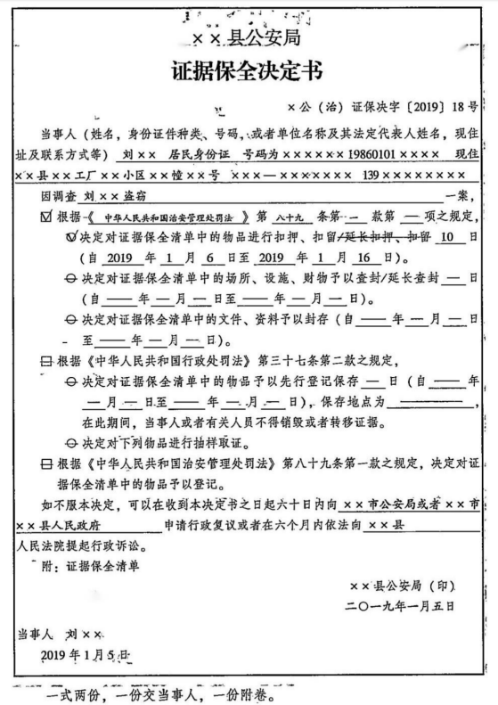
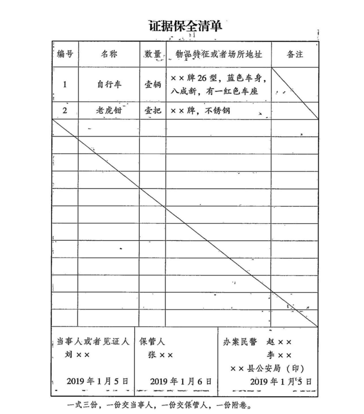

# 课程笔记：两大类行政强制措施

## 财产

### **一、查封**

#### **（一）审批**

需经==公安机关负责人==批准


::: note 公安机关负责人

**公安机关负责人**:

根据《公安机关办理行政案件程序规定》第二条第二款:本规定所称公安机关，是指==县级以上公安机关、公安派出所、依法具有独立执法主体资格的公安机关业务部门以及出入境边防检查站==。

:::

::: tip
紧急情况下可“先斩后奏”，但须在**24小时内补办手续**。
:::

#### **（二）对象**
- **查封的对象**：专门用于无证经营活动的场所、设施、物品。包括：
	- 1. 擅自经营按照国家规定需要由公安机关==许可==的行业的；
	- 2. 依照《娱乐场所管理条例》可以由公安机关采取**取缔**措施的；
	- 3. 《反恐怖主义法》等法律、法规规定适用查封的其他公安行政案件。


::: warning

刑事查封的对象是不动产或特殊的动产。

:::

::: note 取缔

《娱乐场所管理条例》第41条:违反本条例规定，擅自从事娱乐场所经营活动的，由==文化主管部门==依法取缔公安机关在查处治安、刑事案件时，发现擅自从事娱乐场所经营活动的，应当依法取缔。

:::

::: note 反恐怖主义等

《反恐怖主义法》第52条:公安机关调查恐怖活动嫌疑，经==县级以上公安机关负责人==批准，可以采取**查封**措施。

《易制毒化学品管理条例》第32条第2款: 公安机关在进行易制毒化学品监督检查时，可以依法查看现场、查阅和复制有关资料、记录有关情况、扣押相关的证据材料和违法物品;必要时，可以**临时查封**有关场所。

:::

- **不得查封的对象**
  - 第一：无关不查封：与违法行为无关的场所、设施；
  - 第二：生活必需品（==包括好人的或者坏人的=={.info}）不查封：公民个人及其抚养家属的生活必需品；
  - 第三：不得重复查封（==可以轮侯查封=={.important}）：场所、设施、物品已经被其他国家机关依法查封的。


#### **（三）查封期限**
- 一般为==30日==；
- 情况复杂，经==县级以上公安机关负责人==批准，可以延长30日；延长期限的，应当==及时书面告知==当事人，并说明理由。
- 对物品进行鉴定的，==鉴定期间不计入查封期间==，但应当将鉴定的期间书面告知当事人。

::: warning

行政案件中所有鉴定时间都不计入查封期间。

:::

### **二、扣押扣留**

::: tip

扣押和扣留有什么区别？

没有区别，扣押只是针对普通的动产或者文件之类的,扣留的对象就只针对车辆和机动车驾驶证，

:::

#### **（一）审批**

==公安机关负责人==（紧急情况下可事后补批）。


#### **（二）对象**

- **扣押扣留的物品**
	- 1. 与治安案件、违法出境入境管理的案件有关的需要作为证据的物品；
	- 2. 道路交通安全法律、法规规定适用**扣留**的车辆、机动车驾驶证；
	- 3. 《反恐怖主义法》等法律、法规规定适用扣押扣留的其他公安行政案件。

::: warning

**扣押**的权力来源是《治安管理处罚法》《出境入境管理法》《道路交通法》《反恐怖主义法》等。

:::


- **不得扣押扣留的物品**
	- 1. 与案件无关的物品
	- 2. 公民个人及其所抚养家属的生活必需品
	- 3. **被侵害人**或者**善意第三人**合法占有的财产

		::: tip
		对于第二和第三，应当予以登记，写明登记财物的名称、规格、数量、特征，并由==占有人==签字或捺指印。必要时，可以进行拍照。

		**例外**：与案件有关必须鉴定的，可以依法扣押，鉴定后应当立即解除。
		:::


::: note 小测

【判断】 张某到李某家里，拿着李某家里的板凳砸了李某，然后逃跑将板凳留在了现场,公安机关在办案过程中，对该板凳应当扣押还是登记?由谁签名?

【答案】 !!应当用登记，因为板凳系被侵害人所有且占有，如果李某在场，应当由李某签名。!!

【判断】 张某到李某家里，拿着李某家里的板凳砸了李某，然后逃跑并将板凳拿回自己家中，公安机关在办案过程中，对该板凳应当扣押还是登记?由谁签名?

【答案】 !!应当用扣押，因为板凳虽然是被侵害人李某所有，但公安机关办案过程中，系违法嫌疑人张某占有，不具备登记的条件，如果张某在场，应当由张某签名!!

【判断】 张某到李某家里，带着家里的板凳砸了李某，然后逃跑，将板凳扔到了李某家里，公安机关在办案过程中，对该板凳应当扣押还是登记? 由谁签名?

【答案】 !!应当用扣押，因为板凳系违法嫌疑人张某所有，如果李某在场，应当由李某签名。!!

【判断】 张某到李某家里，带着家里的板凳砸了李某，然后逃跑，并将板凳带回了家里，公安机关在办案过程中，对该板凳应当扣押还是登记?由谁签名?

【答案】 !!应当用扣押，因为板凳系违法嫌疑人张某所有，如果张某在场，应当由张某签名。!!


:::

::: tip **登记、先行登记保存、扣押、收缴、追缴、没收的辨析**

**基本定义**

- **登记**：与案件有关的个人或家庭==生活必需品和他人合法占有财物==（非行政强制措施；无期限；行政不可诉）

- **先行登记保存**：作为证据保存的==易灭失的==他人财物（临时性行政强制措施；7天；行政不可诉）
  
- **扣押**：现场的、违禁品、危险品，与==案件有关==的作为证据保存物品（临时性的强制执行措施；行政30天、刑事视情定；行政可诉）
  
- **收缴**：经调查所==扣押物品属于非法财物、违禁品==（==结论性=={.info}行政强制措施；没有期限；行政可诉）
  
- **追缴**：经调查所==扣押物品属于违法所得==（==结论性=={.info}行政强制措施；没有期限；行政可诉）

- **没收**：==非法财物、违法所得==（==结论性=={.info}行政处罚；没有期限；行政可诉）

  
:::


#### **（三）扣押期限**
- 一般为==30日==；
- 情况复杂，经==县级以上公安机关负责人==批准，可以延长30日；延长期限的，应当==及时书面告知==当事人，并说明理由。
- 对物品进行鉴定的，==鉴定期间不计入查封期间==，但应当将鉴定的期间书面告知当事人。

### **三、抽样取证**

抽样取证，是指从总体中取出部分进行分析判断，从而对总体的某些未知因素作出统计判断，取得相关证据。


#### **（一）审批**

==行政机关负责人==——《行政处罚法》

==办案部门负责人==——《办理行政案件程序规定》

#### **（二）三个应当**

1. 应当随机抽取，抽取样品的数量以能够认定本品的品质特征为限；
2. 应当对抽样过程进行拍照或录像；
3. 应当及时进行检验。

#### **（三）结果**

（1）属于证据的，应当依法扣押、先行登记保存或登记；

::: note Q&A

问：为什么没有查封、冻结？

答：因为查封的对象是专门用于无证经营活动的场所、设施、物品、而抽样取证的对象是动产；冻结的对象是涉恐违法嫌疑人在金融机构账号里的资产，因此也不适用。

:::

（2）不属于证据的，应当及时返还样品。样品有减损的，应当予以**补偿**。


### **四、先行登记保存**

#### **（一）对象**

不及时采取措施，客观上证据可能灭失或者主观认为以后难以取得的物品；

#### **（二）审批**

==行政机关负责人==——《行政处罚法》

==办案部门负责人==——《办理行政案件程序规定》

#### **（三）先行**

==在作出下一步处置之前采取的措施==；

#### **（四）登记**

民警对该物品的财物的名称、规格、数量、特征，并由==占有人签名或捺指印==。

#### **（五）保存**

- **保存主体**：==当事人或者公安机关==负责保存；
- **保存地点**：一般情况下，应当由**当事人**负责保管，只有在一些不宜由当事人保管的情况下才由公安机关负责保管。
- **保存期间**：证据持有人及其他人员不得损毁或者转移证据。
- **保存期限**：对先行登记保存的证据，应当在==7日==内作出处理决定。
- **保存结果**：
	- 属于证据的：**应当**依法==扣押或登记==；
	- 不属于证据的：**应当**==解除==措施；
	- 逾期不作出处理决定的，视为==自动解除=={.info}。


### **五、查询冻结**


#### **（一）对象**

公安机关对==恐怖活动嫌疑人=={.danger}的存款、汇款、债券、股票、基金份额等财产采取查询、冻结措施；

#### **（二）审批**

经==县级以上公安机关负责人==批准

#### **（三）冻结期限**

- ==县级以上公安机关负责人==批准：**2个月**；
- 情况复杂的，经上一级公安机关负责人批准：可以延长至**3个月**。延长冻结的决定书应当及时==书面告知=={.warning}恐怖活动嫌疑人，并说明理由。

#### **（四）程序**

- 作出==冻结认定书==；
- 向金融机构==交付冻结通知书==；
- 向恐怖活动嫌疑人==交付冻结决定书==：作出冻结决定的公安机关应当在**3日**内。

#### **（五）权利来源**

《反恐怖主义法》

#### **（六）证据保全的解除**

- （一）当事人无违法行为；
- （二）被采取保全的场所等与案件无关；
- （三）已经作出处理决定，不再需要；
- （四）保全措施的期限届满。


::: info 《治安管理处罚法》

第六十条：有下列行为之一的，处五日以上十日以下拘留，并处二百元以上五百元以下罚款：

（一）隐藏、转移、变卖或者损毁行政执法机关依法扣押、查封、冻结的财物的；

（二）伪造、隐匿、毁灭证据或者提供虚假证言、谎报案情，影响行政执法机关依法办案的；

（三）明知是赃物而窝藏、转移或者代为销售的；

（四）被依法执行管制、剥夺政治权利或者在缓刑、暂予监外执行中的罪犯或者被依法采取刑事强制措施的人，有违反法律、行政法规或者国务院有关部门的监督管理规定行为。


:::

::: warning

只有先行登记保存，需要在证据保全决定书当中注明地点。

证据保全决定书如下




:::


::: card




:::


## 人身

::: info 种类

**种类**：对违法嫌疑人采取保护性约束措施、继续盘问、强制传唤、==强制检测=={.danger}、拘留审查、限制活动范围，对恐怖活动嫌疑人采取约束措施等强制措施。

:::

## **实施强制措施的程序**

**实施行政强制措施应当遵守下列规定**

#### （一）**批准**

实施前须依法向==公安机关负责人==报告并经批准；

#### （二）**告知**


通知当事人到场，当场告知当事人采取行政强制措施的==理由、依据==以及当事人依法享有的==权利、救济途径==。当事人不在场的，==邀请见证人==到场，并在==现场笔录中注明==；

#### （三）**听取**

听取当事人的==陈述==和==申辩==；

#### （四）**笔录**

制作现场笔录，由==当事人和办案人民警察==**签名或者盖章**；当事人拒绝的，在笔录中注明。当事人不在场的，由==见证人和办案人民警察==在笔录上**签名或盖**章；

#### （五）**通知家属**

实施==限制公民人身自由=={.info}的行政强制措施的，应当当场告知==当事人家属==实施强制措施的公安机关、理由、地点和期限；无法当场告知的，应当在实施强制措施后立即通过电话、短信、传真等方式通知；==身份不明、拒不提供家属练习方式或者因自然灾害等不可抗力导致无法统治的，可以不予通知=={.warning}。告知、通知家属情况或者无法通知家属的原因应当在==询问笔录中注明==；

#### （六）**录音录像替代现场笔录**

法律、法规规定的其他程序。勘验、检查时实施行政强制措施，制作勘验、检查笔录的，不再制作现场笔录。实施行政强制措施的全程录音录像，已经具备本条第一款第二项、第三项规定的实质要素的，可以替代书面现场笔录，但应当对视听资料的关键内容和相应时间段等作文字说明；

::: tip

全程录音录像取代的笔录包括一个==检查笔录==，一个==现场笔录==。

:::
#### （七）**事后补办手续**（==先斩后奏=={.warning}）

情况紧急，当场实施行政强制措施的，办案人民警察应当在==二十四小时内==依法向其所属的公安机关负责人报告（==财产相关强制措施=={.info}），并补办批准手续。当场实施==限制公民人身自由==的行政强制措施的，办案人民警察应当在返回单位后==立即报告==，并补办批准手续。公安机关负责人认为不应当采取行政强制措施的，应当立即解除。


## **拓展：执法场所分区管理**

### **一、接待区**

(一)接待区主要用于接受报警、求助、办理证照、行政审批以及适用简易程序的行政处罚等。

(二)信访接待室、调解室、听证室可以设置在接待区，但应当相对独立。

(三)基本工作制度:岗位责任制、首接负责制、警务公开制、一次性告知制、限时办结制、预约办理和上门服务制度、弹性工作制、定期抽查制、责任追究制。

### **二、办案区**

(一)办案区各功能室不得设置在二楼或者二楼以上;

(二)办案区的电子监控设备应当与警务督查部门网上督查信息系统实现数据对接，并对音频、视频数据进行分流处理，音频数据不得进入网上督查信息系统，防止案情泄露;

(三)办案区的声像监控资料应当保存不少于三个月(内务条令规定不少于90日)，讯(询)问嫌疑人的录音录像资料保存期限应当与同案案卷的保存期限相同。(四)嫌疑人较多，办案区讯问室或者询问室不能满足办案需要的，在保证安全
的前提下，讯问室、询问室可以调剂使用。
执法办案管理中心设置办案区、案件管理区和涉案财物管理区

### **三、办公区**


### **四、生活区**


## **思维导图**


```markmap
---
markmap:
  colorFreezeLevel: 3
---

# 行政强制措施
## 内容
### 人身
- 强制传唤：前提必须经过口头传唤或书面传唤
- 继续盘问：对象前提+四种情形之一
- 保护性约束措施：对象违法+醉酒+威胁
- 强制检测：对象吸毒人员；审批局长或所长
- 拘留审查：对象涉嫌违法的外国人
- 限制活动范围：对象涉嫌违法的外国人
- 人身扣留：对象涉嫌恐怖活动的人
### 财物
- 查封：对象无证经营的场所、设施和物品
- 扣押扣留：对象与案件有关的动产
- 冻结：对象涉案人员的财产
- 先行登记保存：对象不便提取
- 抽样取证：对象商品水条
- 封存文件资料：对象涉嫌、非法获取国际电信活动
## 程序
### 1、审批
- 事前：审批
- 事后：补批
  - 人身：立即
  - 财产：24小时内
### 2、告知+听取
- 通知当事人到场→告知理由、依据、权利和救济→听取→当事人的陈述和申辩
- 当事人拒不到场→邀请见证人到场，并在现场笔录中注明
### 4、制作笔录
- 书面的现场笔录
- 全程录音录像代替（暂未具备告知+听取）
### 5、告知家属
- 内容：公安机关+理由+地点+期限
- 记录：询问笔录
## 救济
- 行政复议
- 行政诉讼（涉外案件中的拘留审查和限制活动范围不可以行政诉讼）
```
## 真题回顾

:::: card-grid
::: card title="题目 1" icon="svg-spinners:blocks-shuffle-3"


<Badge type="warning" text="单选" />受案后在案件调查过程中，对于张某打伤李某所用的拖把，老关和小王采取了证据保全措施。关于证据保全，下列做法不正确的是：（ ）（2019 年公安联考第 87 题）

选项：

A、制作证据保全决定书并附清单  
B、证据保全决定书上由被侵害人签名  
C、证据保全决定书上需载明证据保全的场所  
D、证据保全决定书上需载明申请行政复议的途径和期限  

**答案：!!C!!**


:::

::: card title="题目 2" icon="svg-spinners:blocks-shuffle-3"


<Badge type="warning" text="单选" />在人身安全检查过程中，在该女子所背双肩包内发现一个塑料袋，袋内有十几个罂粟壳。现场民警对这些罂粟壳的正确处置措施是：（ ）（2018 年公安联考第 84 题）

选项：

A.扣押  
B.收缴  
C.销毁  
D.没收  

**答案：!!A!!**


:::

::: card title="题目 3" icon="svg-spinners:blocks-shuffle-3"


<Badge type="warning" text="单选" />蔡某盗窃了邓某的自行车，对被盗自行车，以下做法正确的是：（ ）（2017 年公安联考第 91 题）

选项：

A、对自行车予以登记后及时返还给邓某  
B、对自行车予以追缴后及时返还给邓某  
C、让蔡某先行保管，结案后由警方及时返还给邓某  
D、对自行车予以收缴后及时返还给邓某  

**答案：!!B!!**


:::


::::