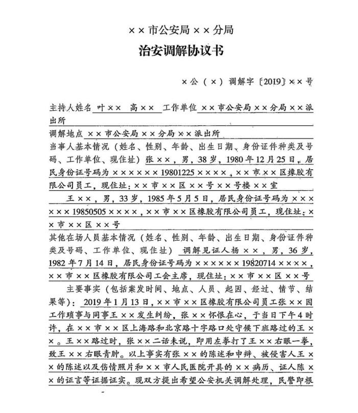
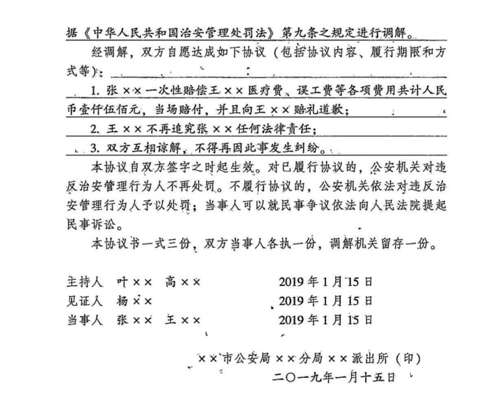

# 调解相关课程笔记整理


### **一、调解主体**  
   
   （一）==2名==以上警察；
   
   （二）==1名==警察+辅警+==全程录音录像=={.info};

   （三）==1名==警察在规范设置、严格管理的执法办案场所+==全程录音录像=={.info}；<Badge type="danger" text="新法" />
   
   （四）==专职社区民警==可以结合社区警务工作办理治安调解的行政案件。

::: danger
   **禁止非公安机关人员主持**（如律师、居委会干部等）。 
:::

### **二、调解的案件范围**

#### （一）对于因==民间纠纷=={.info}引起的殴打他人、故意伤害、侮辱、诽谤、五搞些还、故意损毁财物、干扰他人正常生活、侵犯隐私、非法侵入住宅等违反==治安管理==行为，==情节较轻==，且==具有下列情形之一==的，可以调解处理：

   - 亲友、邻里、同事、在校学生之间因琐事发生纠纷引起的；  
   - 行为人的侵害行为系由被侵害人事前的过错行为引起的；
   - 其他适用调解处理更易化解矛盾的。
   


::: note 小测
**【** **判断** **】**

1、盗窃案件是否可以治安调解？

2、盗开他人机动车是否可以治安调解？

**【** **解析** **】**

答案：不可一概而论，**判断标准**为 ==“熟人+轻微+治安案件”=={.warning} ，如果同时具备，比如“==盗窃亲戚50元=={.danger}”，就可以调解。

:::


#### （二）对**不构成违反治安管理的民事纠纷**，应当告知当事人向人民法院或者人民调解组织申请处理。

- **具有以下情形之一的，不适用调解处理**：
   - 雇凶伤害他人；
   - 结伙斗殴[+结伙斗殴]或者其他寻衅滋事的；
   - 多次（==三次==以上）实施违反治安管理行为的；
   - 当事人明确表示不愿意调解处理的；
   - 当事人在治安==调解过程中==又针对对方实施违反治安管理行为的；
   - 调解过程中，违法嫌疑人==逃跑的==；
   - 其他
	   - **涉及公共利益或陌生人纠纷**：如破坏公共设施、抢劫等。


::: tip

不雇多结

寻衅逃跑

:::

### **三、调解的形式**

#### （一） **现场调解**

对于情节轻微、事实清楚、因果关系明确，不涉及医疗费用、物品损失或者双方当事人对医疗费用和物品损失的赔付无争议，符合治安调解条件，双方当事人同意当场调解并当场履行的治安案件，可以当场调解，并制作==调解协议书==。当事人基本情况、主要违法事实和协议内容在现场录音录像中明确记录的，不再制作调解协议书。（==可以通过书面方式或录音录像进行记录=={.warning}）


#### （二） **非现场调解**

应当在==立案后=={.info}的==3个工作日==内完成调解；对需要伤情鉴定或价值认定的治安案件，应当在伤情鉴定文书和价值认定结论出具后的==3个工作日==内完成调解。（只能通过==书面方式==进行记录）


### **四、调解的参加人、次数限制**


#### （一）**参加人要求**

- **主持人**
- 当事人中有未成年人的，调解时应当通知其父母或者其他监护人到场。但是，当事人为年满16周岁以上的未成年人，以自己的劳动收入为主要生活来源，本人同意不通知的，可以不通知。（父母或其他监护人未到场的，==原则上不进行调解==）
- **被侵害人**委托其他人参加调节的，应当向公安机关提交委托书，并写明委托权限。==**违法嫌疑人**不得委托他人参加调解=={.danger}。  

::: warning

在==听证、行政复议、行政诉讼==过程中，违法嫌疑人均可以委托他人参加。

:::

- 对因邻里纠纷引起的治安案件进行调解时，可以邀请当事人居住地的居（村）民委员会的人员或者双方当事人熟悉的人==参加帮助==调解。

（二）**次数**

- 调解一般为==一次==。
- 对一次调解不成，公安机关认为有必要或者当事人申请的，可以再次调解，并应当在第一次调解后的==七个工作日==内完成。

::: warning

两次调解均在==调解协议达成之前==进行。

:::
 


### **五、调解的结果**

#### （一）**调解成功**  

调解达成协议的，在==公安机关主持==下制作调解协议书，双方当事人应当在==调解协议书上签名==，并履行调解协议。调解达成协议并履行的，公安机关不再处罚。

#### （二）**调解失败**  

对调解未达成协议或者达成协议后不履行的，应当对违反治安管理行为人依法予以处罚；调解案件的办案期限从==调解未达成协议或者调解达成协议不履行之日==起开始计算。

#### （三）**反悔**  

履行后又反悔的，公安机关==不予受理==，因为在公安机关阶段已经结案。


### **六、人民调解与自行和解的处理**


（一）当事人申请人民调解或者自行和解，达成协议并履行。

（二）双方当事人==书面申请并经公安机关认可==的，公安机关不予治安管理处罚。

（三）但公安机关已依法作出处理决定的除外。

::: note 四个条件
- 和解**协议+履行**
- 双方**书面**申请
- 公安机关**认可**
- 公安机关**尚未**做出处罚决定
:::

::: warning

人民调解、自行和解的案件和治安调解的案件范围是相同的。

:::


::: card 治安调解协议书






:::


### **七、思维导图**

```markmap
---
markmap:
  colorFreezeLevel: 2
---

# 治安调解流程图

## 主体
- 两名警察
  - 社区民警 + 辅警
  - 全程录音录像

## 适用调解的案件
- 民间纠纷引起的
- 轻微的治安案件
- 被侵害人事前有过错

## 调解范围
- 治安责任
- 民事责任

## 案件范围
- 雇凶伤害他人
- 结伙斗殴
- 其他寻衅滋事行为

## 不适用调解的案件
- 多次实施违法行为
- 当事人不自愿
- 调解中逃跑
- 调解过程中再次实施违法行为

## 调解方式
- 视音频方式：现场调解
- 书面方式：调解协议书（一式三份）
  - 非现场调解

## 调解方式和次数
- 一般为一次：立案后三日内
- 最多两次：第一次调解后7日内

## 调解参加人
- 主持人：1警 + 辅警 + 全程录音录像
- 当事人：
  - 违法嫌疑人必须参加，不得委托他人
  - 被侵害人可以不参加，可委托他人
- 未成年人：
  - 应通知父母或其他监护人到场
  - 劳动成年且本人同意可不通知
- 双方都熟悉的人

## 调解结果
- 成功：
  - 达成调解协议并履行到位 → 结案
- 失败：
  - 缺少协议或履行不到位 → 公安进行治安处罚
  - 民事责任告知去法院起诉

## 治安和解免责条件
- 和解协议 + 履行
- 双方书面申请
- 公安机关认可
- 公安机关尚未作出处罚决定
```


### **八、真题回顾**

:::: card-grid
::: card title="题目 1" icon="svg-spinners:blocks-shuffle-3"


<Badge type="warning" text="多选" />张某、李某是同一小区居民，都经常在小区锻炼身体，某日因为争抢小区公用健身器材，二人发生纠纷，张某殴打了李某，后在公安派出所主持下双方达成调解协议，张某对李某医药费等损失给予了赔偿。下列有关理解的说法不正确的有：


A、协议履行后，公安机关不再对张某予以处罚  
B、李某事后反悔，可以提起行政诉讼确认调解协议无效  
C、李某对赔偿数额不服可以申请行政复议  
D、如张某不履行调解协议，公安派出所可以强制执行

**答案：!!BCD!!**

::: collapse
- 📘 **解析说明：**

	**调解的对象**是**殴打他人的治安责任**及其引发的**民事责任**。

	- 对于**起因行为（如争抢器材）** 本身**不调解**。
	- 如果违反治安管理行为**没有引起民事责任**，调解的对象就**仅限于治安责任**。
	 
	**行政诉讼和行政复议**是对**公权力强制运行是否正确**进行评价的制度设计。
	
	- 而**治安调解**是以**当事人自愿为前提**的，**不存在公权力的强制运行**。
	- 因此，对**调解协议**，**不可提起行政诉讼**或**申请行政复议**。

	**强制执行**的对象是**公权力强制运行得出的结果**。
	
	- 治安调解的结果**并非公权力强制运行的结果**，因此**不可强制执行**。

	::: warning
	第一、调解的对象是殴打他人的==治安责任及其引发的民事责任=={.info}，对于==起因行为不调解==。当然，如果违反治安管理行为没有引起民事责任，调解的对象就是治安责任。

	第二、行政诉讼和行政复议是对公权力强制运行正确与否进行评价的制度设计， 而治安调解过程中，不存在公权力的强制运行，是以当事人自愿为前提的，因此对调解协议，==不可提起行政诉讼或申请行政复议==。

	第三、强制执行的对象是公权力强制运行得出的结果，而治安调解的结果并非公权力强制运行的结果，因此==不可强制执行==。
	:::


:::

::: card title="题目 2" icon="svg-spinners:blocks-shuffle-3"


<Badge type="warning" text="多选" />张某在继续追打李某的过程中，李某躲闪，拖把打到了李某便利店的玻璃门上（价值2000元），导致玻璃门破碎。对于张某的行为，公安机关下列做法正确的有：


A、对张某按殴打他人进行处罚  
B、对张某按故意损毁财物进行处罚  
C、对张某损毁玻璃门的赔偿金可以调解  
D、对张某殴打他人进行处罚并裁决赔偿玻璃门损毁费用

**答案：!!AC!!**


:::

::: card title="题目 3" icon="svg-spinners:blocks-shuffle-3"


<Badge type="warning" text="单选" />在案件调查取证过程中，张某认识到了自己的错误，主动向被侵害人李某赔礼道歉，并请居委会干部参与协调此事，派出所决定对该案进行治安调解处理，下列关于治安调解说法正确的是：

A、公安机关组织双方两次调解未果后，再次组织双方调解并成功  
B、双方可以委托各自的亲属（直系亲属）或律师代为参加调解  
C、若张某未按约定及时参与调解，民警可强制传唤张某到场调解  
D、若张某和李某都自愿接受调解，应在公安机关主持下进行

**答案：!!D!!**


:::

::: card title="题目 4" icon="svg-spinners:blocks-shuffle-3"


<Badge type="warning" text="单选" />近日，在社区民警主持下，由律师通过微信群进行协调，完成了涉及居民李某、项某民事纠纷的治安调解。在进行调解中，社区民警做法不恰当的是：


A、调解前做深入细致的调查取证工作  
B、邀请双方当事人的熟人参与调解  
C、请律师全程主持并提供咨询  
D、通过微信支付赔偿款

**答案：!!C!!**


:::

::::


 [+结伙斗殴]:
	结伙斗殴的定义
	1. **行为特征**：结伙斗殴，是指==两人或两人以上==，为了实施斗殴行为而结伴，并实际参与了斗殴的行为。这种行为扰乱了公共秩序，具有社会危害性。
	2. **法律条款**：根据《中华人民共和国治安管理处罚法》第二十六条第一项，结伙斗殴是违反治安管理的行为之一，将受到法律的制裁。