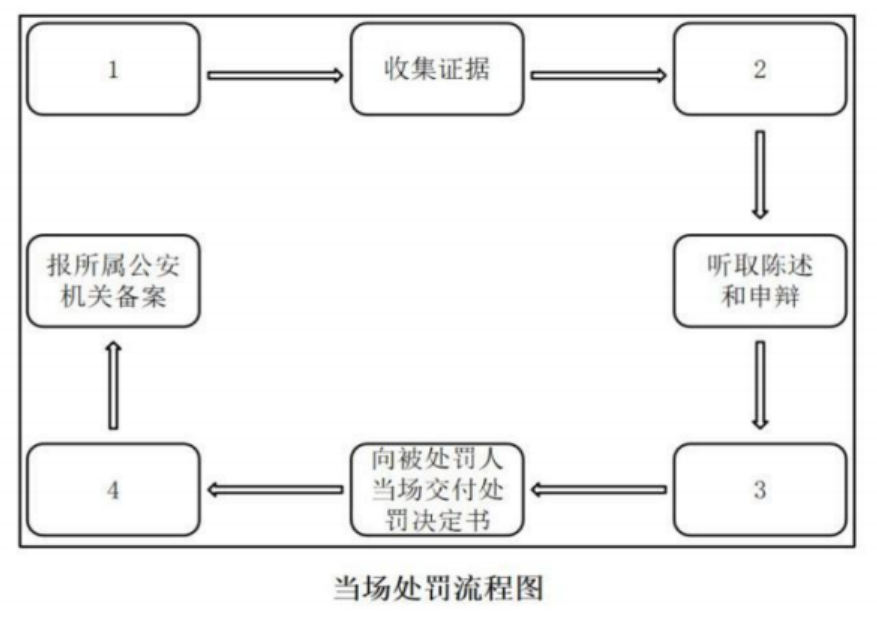

## **第一节 简易程序**

### **一、当场处罚的适用条件**

#### （一）**违法事实确凿**；

#### （二）**有法定依据，种类是警告或小额罚款**。

1、对违法治安管理行为人处以==500元==（==新法=={.info}）以下罚款或者警告的；

2、对违反道路交通行为人处以==200元==以下罚款或者警告的；

3、出入境边防检查机关对违反出境入境管理行为人处==500元==以下罚款或者警告的；

4、对==其他=={.info}违法行为的个人处==200元==以下罚款或者警告、对单位处以==3000元==以下罚款或者警告的；


::: info 争议 

**问题：** 

《公安机关办理行政案件程序规定》第37条：“违法事实确凿，且具有下列情形之一的，人民警察可以当场作出处罚决定，有违禁品的，可以当场收缴：(三) 对有其他违法行为的个人处==五十元以下罚款或者警告、对单位处一千元以下罚款或者警告=={.info}的…… ”

为什么这里是个人200元以下或警告，对单位3000元以下罚款或警告?

**答案：**

==上位法优于下位法==，《公安机关办理行政案件程序规定》是公安部制定的，属于部门规章，而《行政处罚法》是全国人大制定的，属于法律。 《行政处罚法》第51条 违法事实确凿并有法定依据，对公民处以二百元以下、对法人或者其他组织处以三千元以下罚款或者警告的行政处罚的，可以当场作出行政处罚决定。法律另有规定的，从其规定。

:::

5、法律规定可以当场处罚的其他情形。

#### （三）**涉及卖淫、嫖娼、赌博、毒品的案件，不适用当场处罚**

1、卖淫、嫖娼包括**四种案件**：卖淫、嫖娼、在公共场所拉客招嫖、引诱客留介绍他人卖淫。

2、赌博包括**两种案件**：赌博、为赌博提供条件。

3、毒品包括**八种案件**：吸毒、教唆引诱欺骗吸毒、非法持有毒品、提供毒品、胁迫欺骗开具麻醉药品精神药品、非法运输买卖储存适用罂粟壳、非法种植毒品原植物、非法买卖运输携带持有毒品原植物种苗。


::: note

上面同时只适用==违法行为地管辖=={.warning}

:::

::: warning

当场处罚不限制==盲聋哑、精神病、外国人、老幼孕乳=={.info}。

:::

### **二、当场处罚的程序**

#### （一）向违法行为人表明执法身份，==两名以上==警察


::: info Q&A 

**问题：** 

社区民警可以适用简易程序办理行政案件吗?


**答案：**

可以，根据《社区警务工作规范(试行)》第79条第二款之规定：==专职社区民警可以结合社区警务工作办理适用简易程序和治安调解的行政案件==，原则上不承担刑事案件侦查、治安案件查处任务。

:::


#### （二）收集证据；

#### （三）口头告知违法行为人拟作出行政处罚决定的事实、理由和依据，并告知违法行为人依法享有的陈述权和申辩权；

#### （四）充分听取违法行为人的陈述和申辩。违法行为人提出的事实、理由或者证据成立的，应当采纳；

#### （五）填写当场处罚决定书并当场交付被处罚人；

#### （六）当场收缴罚款的，同时填写罚款依据，交付被处罚人；未当场收缴罚款的，应当告知被处罚人在规定期限内到指定的银行缴纳罚款。

1. **收据**：==省级以上财政部门==出具的票据
2. **罚款的缴纳方式**：==当场收缴==或==15内向指定银行缴纳==

#### （七）规定时间内向所属公安机关备案==处罚决定书==

1. 交通警察作出决定后==二日==内报备。
2. 在旅客列车上、民航飞机、水上作出的处罚，应当在返回后的==24小时==内报备。
3. 其他：当场处罚的，作出决定后**24小时内**报备。
4. 向谁报备：看章。
5. 报备方式：传真、电话等均可。


### **三、注意事项**

1. 人民警察有程序选择权，办案警察可以根据案情和证据作出选择，注意是==可以==而非应当；
2. 违法行为人对处罚决定不服，应当==复议前置==。


## **第二节 快速办理制度**


### **一、快速办理适用条件**

#### （一）**违法嫌疑人的条件**

1. 违法嫌疑人不可以是盲、聋、哑人，未成年人或者疑似精神病人的；


::: important

此类嫌疑人的认识能力、判断能力因为年龄或残疾会受到一定的限制，无法正确充分地行使自己地知情权、选择权、进而可能导致其合法权益受损。

:::

2. 违法嫌疑人自愿认错认罚：违法嫌疑人对违法事实和法律适用没有异议。
3. 违法嫌疑人书面同意适用快办制度：适用快速办理制度前，公安机关应当书面告知违法嫌疑人快速办理制度的相关规定，征求其同意后，由其签名确认。

#### （二）**案件条件**

1. 案件事实清楚
2. 案件难度适中
	- 不能太简单：不适用简易程序的行政案件；
	- 不能太复杂；
		- 不适用依法应当适用听证程序；
		- 不适用可能作出==10日以上==行政拘留处罚。

::: warning

“可能做出10日以上行政拘留处罚”,指的是法律规定的处罚幅度，而不是实际处罚结果。例如，根据 《治安管理处罚法》的规定，对于卖淫、嫖娼行为的法定处罚幅度一般情况是“十日以上十五日以下拘留，可以并 处五千元以下罚款”,对吸毒行为的法定处罚幅度一般情况是“十日以上拘留十五日以下拘留，可以并处二千元以下罚款”,那么,对这些案件一般情况下就不适用快速办理。来源《公安机关办理行政案件程序规定释义与实务指南》(2021年版)第100页。

:::


::: info Q&A 

**问题**：

张某闯红灯，按照《道路交通安全法》第八十九条：“行人、乘车人、非机动车驾驶人违反道路交通安全法律、法规关于道路通行规定的，处警告或者五元以上五十元以下罚款；非机动车驾驶人拒绝接受罚款处罚的，可以扣留其非机动车。”对其作出罚款50元的处罚，交警可以决定适用简易程序，如果张某同意，也可以适用快速办理制度吗?

**答案**：

不可以，如果案件符合适用简易程序的条件，说明案件太简单，就不适用快速办理制度，当然，如果交警觉得有必要适用普通程序，也可以适用普通程序。因此，一个案件如果适用简易程序，就一定不适用快速办理。

**问题**： 

张某卖淫且其同意适用快办制度，民警可以决定适用快办制度吗?

**答案** ：

不可以，因为按照《治安管理处罚法》第六十六条第一款的规定：“卖淫、嫖娼的，处十日以上十五日以下拘留，可以并处五千元以下罚款；情节较轻的，处五日以下拘留或者五百元以下罚款。”这规定里包含10日以上的拘留，就不能够适用快速办理制度。

**问题**：

张某卖淫，情节较轻且其同意适用快办制度，民警可以决定适用快办制度吗?


**答案**：

不可以，因为是否适用快办，看法律规定，不看具体案情，因为针对此案，还未启动调查。

:::


### **二、快在哪？调查-审核-处罚前告知-处罚决定。**

#### （一）**简化证据收集**

1. **内容简化**——主客观相互印证

（1）违法嫌疑人在自行书写材料或询问笔录中承认违法事实，认错认罚；

（2）有==视音频记录、电子数据、检查笔录==等关键证据能够相互印证的；

（3）公安机关可以不再开展其他调查取证工作。

2. **方式简化**——询问笔录、自行书写、录音录像

（1）询问笔录——简明扼要的格式，尽量减少需要文字记录的内容；

（2）自行书写——提供样式供其参考；

（3）录音录像——代替书面笔录，必要时，对视听资料的关键内容和相应时间段作文字说明。

#### （二）**简化处罚前告知程序**

1. 可以口头告知，也可以书面告知；

2. 如果是口头告知，办案民警必须在案卷材料中==标注告知情况==，并由==被告知人签名确认==。

#### （三）**简化审核审批手续**

可以由专职、兼职法制员或办案部门负责人审核后，报==公安机关负责人==审批。

#### （四）**快速办理时限**——违法嫌疑人到案后==48小时内==作出处理决定。

### **三、结果**

（一）对快速办理的行政案件，公安机关可以根据违法行为人认错悔改、纠正违法行为、赔偿损失以及被侵害人谅解等情节，依法对违法行为人==从轻、减轻或者不予处罚==。

（二）快速办理案件转化未一般案件的衔接

1. 公安机关快速办理行政案件过程中，发现不适用快速办理制度的，转为一般程序办理。
2. 快速办理阶段收集的证据，可以作为**证据**使用。

### **五、思维导图**

```markmap

---
markmap:
  colorFreezeLevel: 2
---

# 简易程序与快办制度

## 简易程序

### 适用案件（积极条件）

- 违反治安管理：200元以下或警告
- 违反交通管理：200元以下或警告
- 违反出入境管理：500元以下或警告
- 单位违法行为：3000元以下或警告
- 其他违法行为：个人200元以下罚款或警告

### 不适用案件（消极条件）

- 卖淫、嫖娼、赌博、毒品类案件

### 适用程序

1. 两名以上警察表明执法身份
2. 收集证据
3. 口头告知 + 听取陈述申辩
4. 作出处罚决定书
5. 符合条件可当场收缴罚款
6. 备案：
   - 交警：2日内
   - 其他警种：24小时内

### 注意事项

- 人民警察有程序选择权
- 对处罚决定不服：
  - 应先提起行政复议
  - 对复议结果不服，再提起行政诉讼

## 快办制度

### 适用案件

- 不适用简易程序的案件
- 事实清楚
- 非特殊案件
- 违法人主观上认错认罚
- 客观上对违法事实和法律适用无异议

### 不适用情形

- 违法嫌疑人系盲、聋、哑、精神病、未成年人
- 可能适用听证程序的
- 可能作出十日以上拘留的
  - 看立法规定，不看实际结果

### 程序选择

1. 知情权：书面告知书面同意（说明好处和坏处）
2. 程序选择权：书面同意

### 快在哪（程序简化）

#### 调查取证

- 形式上压缩时间：
  - 简化询问笔录
  - 自行书写
  - 录音录像
- 量上减少工作：
  - 主客观相一致
  - 其他证据可不再调取

#### 处罚前告知

- 可口头或书面

#### 审核审批

- 一核一批

#### 作出处罚决定时间

- 48小时内

### 转化办理

- 证据可以转化使用
```


---


### **六、真题回顾**

:::: card-grid
::: card title="题目 1" icon="svg-spinners:blocks-shuffle-3"


<Badge type="warning" text="单选" /><Badge type="warning" text="单选" />对于违法事实确凿，符合当场处罚条件的行政案件，人民警察可以按照法定程序当场作出处罚决定。下图中，空白处的内容包括：

1. 表明身份
    
2. 填写当场处罚决定书
    
3. 口头告知拟作出处罚的事实、理由、依据和陈述权、申辩权
    
4. 符合当场收缴罚款条件的当场收缴罚款
    

根据当场处罚实施程序的相关规定，与图中1号至4号空白处对应的排列正确的是：



A. ①②③④  
B. ①③②④  
C. ③①④②  
D. ③①②①

**答案：!!B!!**

:::

::: card title="题目 2" icon="svg-spinners:blocks-shuffle-3"

<Badge type="warning" text="单选" />派出所民警小李、小张办理一起盗窃行政案件，因事实清楚，违法嫌疑人自愿认错认罚，且对违法事实和法律适用没有异议，准备适用快速办理程序。适用快速办理，下列说法不正确的是：


A. 发现不适宜快速办理的，转为一般案件办理，快速办理阶段收集的证据应重新收集  
B. 快速办理前，应当书面告知违法嫌疑人快速办理的相关规定，征得其同意并签名确认  
C. 可采用口头方式履行处罚前告知，由民警在案卷材料中注明告知情况并由被告知人签名确认  
D. 可根据违法行为人认错悔改、被侵害人谅解等情节，依法对违法行为人从轻、减轻或者不予行政处罚

**答案：!!A!!**


:::


::::


 [+听证]:
	在下列情况下可以适用听证：
	1. **责令停产停业**；
	2. **吊销许可证**或者**执照**；
	3. **较大数额罚款**等行政处罚决定。
	
	在这几种情况下，行政机关应当告知当事人有要求==举行听证==的权利。
	
	当事人要求听证的，行政机关应当组织听证。
	
	此外，行政相对人要记住听证会是免费的，行政机关无权要求当事人支付费用。