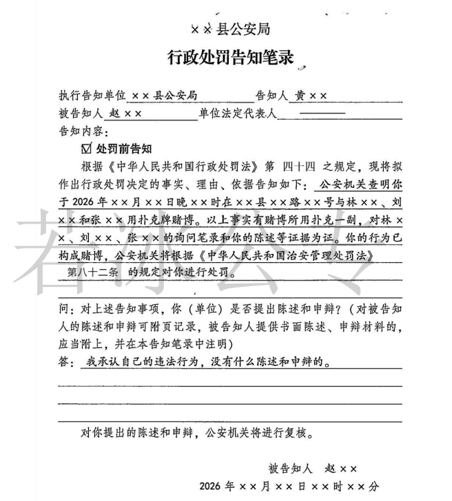
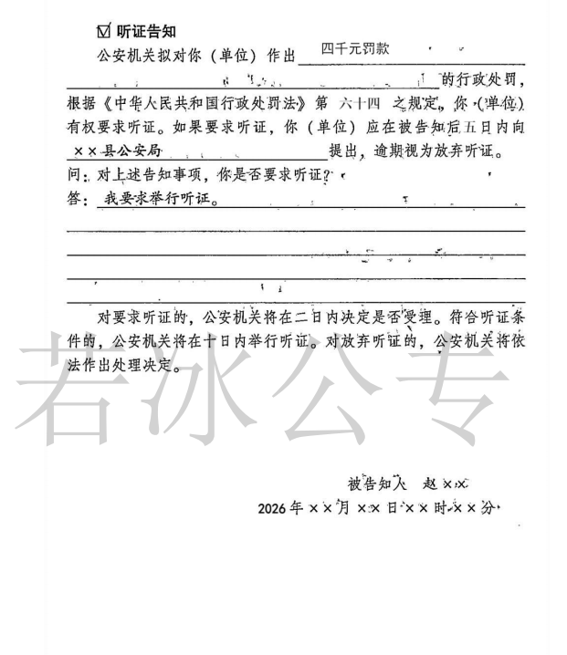
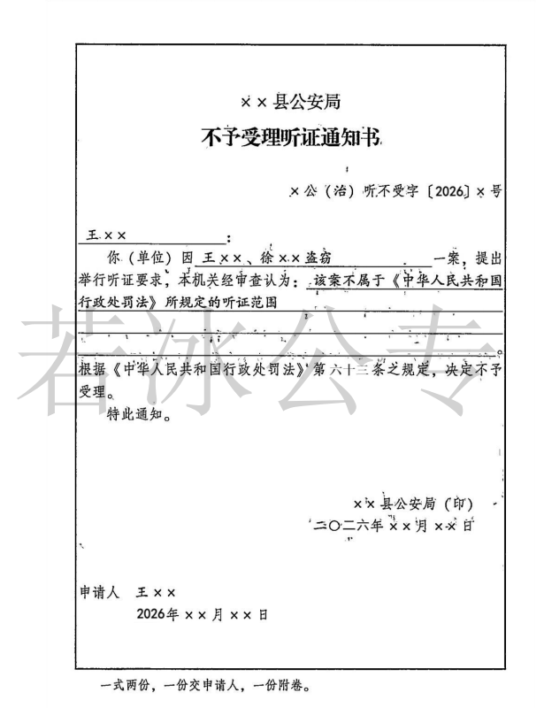
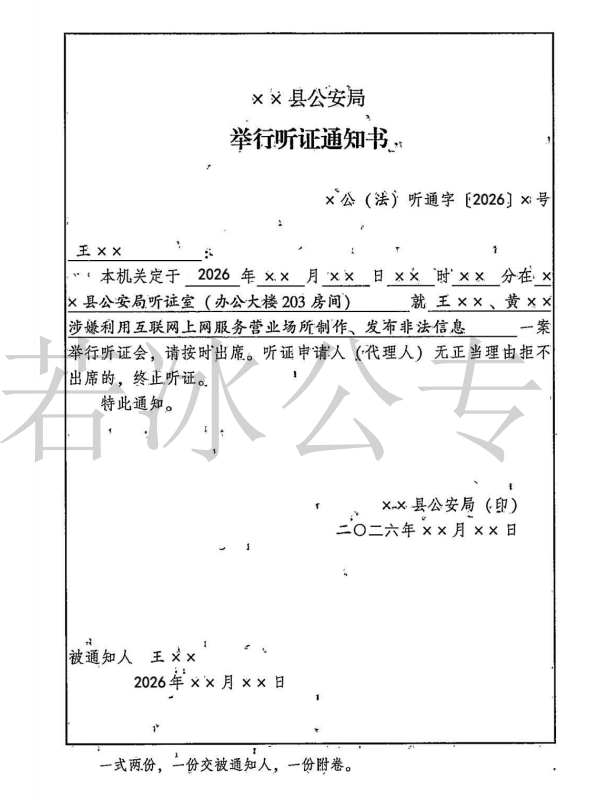

## **处罚前告知**


### **一、处罚前告知程序**


（一）**简易程序**：口头告知；

（二）**快速办理制度**：可以口头，也可以书面告知；

（三）**普通程序**：应当书面告知；因违法行为人逃跑等原因无法履行告知义务的，公安机关可以采取==公告==方式送达，期限为==7日==。


### **二、告知的内容**

（一）公安机关拟作出行政处罚决定的==内容、事实、理由及依据==；

（二）告知违法嫌疑人享有==陈述权和申辩权==。单位违法的，应当告知其法定代表人、主要负责人或者其授权的人员。

### **三、违法嫌疑人的陈述权和申辩权**

::: note

==贯穿始终=={.info}

:::

（一）违法嫌疑人的==陈述权和申辩权==是一项基本程序权利；

（二）对违法嫌疑人提出的==新的事实、理由和依据==，公安机关应当复核；

（三）公安机关==不得因==违法嫌疑人的申辩而加重处罚。


## **听证告知**


  
### **一、听证范围**


在作出下列行政处罚决定之前，应当告知违法嫌疑人有要求举行听证的权利；

（一）**资格罚**：降低资质等级，吊销许可证件；

（二）**行为罚**：责令停产停业、责令关闭、限制从业；

（三）**财产罚**：较大的数额罚款：没收较大数额违法所得、没收较大价值非法财物；较大数额罚款指的是对个人处以==4000元以上==<Badge type="danger" text="新法" />罚款，对单位处以==一万元以上==的罚款；违反边防入境出境管理法律、法规、规章的个人处以==6000元以上==罚款。

::: warning

较大数额罚款只适用于一个处罚，而不适用“分别处罚、合并执行”的情形。

:::

### **二、听证组织机构**


1、法制部门；

2、依法具有独立执法主体资格的公安机关业务部门（==派出所、交警队、出入境=={.info}）以及出入境边防检查站依法作出行政处罚决定的，由其非本案调查人员组织听证。


### **三、听证程序**(告知-申请==5=={.info}-受理==2=={.info}-举办==7、10=={.info}-听证笔录-听证报告书)


::: timeline horizontal

- 民警告知
  time=null

  
- 当事人申请听证
  time=5日内 type=success

  收到告知后

- 法制部门决定是否受理
  time=2日内 type=important

  收到申请后
  
- 《举行听证通知书》送达
  time=7日内 type=danger

  举行听证前


- 举办听证
  time=10日内 type=warning

  收到申请后
  :::

#### **(一) 谁告知**——办案民警告知违法嫌疑人  

对适用听证程序的案件，办案部门在提出处罚意见后，应当告知违法嫌疑人拟作出的行政处罚和有要求举行听证的权利。


#### **(二) 谁申请**——违法嫌疑人在收到告知后==5日==内向公安机关提出申请，口头书面均可

**5日**内允许==反复==：违法嫌疑人放弃听证或者撤回听证要求后，==处罚决定作出前=={.danger}，又提出听证要求的，只要在听证申请有效期内，应当允许。


#### **(三) 谁受理**——法制部门收到申请后==2日==内进行审查决定是否受理听证


1、不符合条件的-制作《不予受理听证通知书》，告知申请人；逾期不通知，视为受理；

2、符合条件的-受理-应当在举行听证的==7日==前将《举行听证通知书》送达听证申请人，并将举行听证的时间、地点通知其他听证参加人。

::: note 审查内容

- 时间-5日内申请的
- 申请主体
- 申请事项

:::

####  **(四) 举行听证**


1、**时间**：应当在公安机关收到听证申请之日起==10日内==举行；听证申请人不能按期参加听证的，可以申请延期，是否准许，由听证主持人决定。

2、**地点**：公安机关某办公室

3、**参加人**

（1）听证人员

主持人1名，记录员1名；必要时，可以设听证员1-2名。本案调查人员不得担任==听证人员==（中立）。

（2）听证参加人

 - **当事人及其代理人**：办案警察；证人鉴定人和翻译人员；其他有关人员（第三者[+第三者]）。

当事人在听证活动中的权利：

- 第一、申请回避；（中止情形）
- 第二、委托一至二名代理人参加听证；（和调解区分，==坏人可以不来==）
- 第三、进行陈述、申辩和质证；
- 第四、核对、补正听证笔录；
- 第五、依法享有的其他权利。

::: warning

调查阶段的回避，是不直接停止的；听证直接中止。

:::


4、**方式**

应当公开举行，除涉及==国家秘密、商业秘密、个人隐私==不公开举行。


5、**程序**

（1）主持人开场白

- 第一、主持人核对听证参加人；
- 第二、宣布案由；
- 第三、宣布听证员、记录员和翻译人员名单；
- 第四、告知当事人在听证中的权利和义务；
- 第五、询问当事人是否申请回避；
- 第六、对不公开听证的案件，宣布理由。

（2）调查：办案警察--听证申请人--第三人

（3）辩论：听证申请人--第三人--办案警察

（4）最后陈述：听证申请人--第三人--办案警察

（5）形成听证笔录

（6）核对

==听证申请人、证人签名或捺指印；主持人、听证员和记录员签名==；剩下的人统统不需要。

::: important

所有的笔录原则上在场人全部都要签字，但两个笔录是例外，一个叫==听证笔录==，一个叫==辨认笔录==。

- **听证笔录**：坏人、证人、听证人员；
- **辨认笔录**：被辨认人（坏人）不签字。警察、辨认人要签字，如果有见证人，见证人要签字，只有被辨认的这个坏人不签字。


:::

（7）制作听证报告书

听证结束后，主持人应当写出听证报告书，连同听证笔录一并报送公安机关负责人。听证报告书中包括==处理意见和建议==。听证报告书属于==内部工作文书==，不属于法律文书，==当事人无权查阅=={.warning}。

（8）听证结束后，行政机关应当根据==听证笔录==，依法作出决定。


#### **(五) 其他**

1、合并听证

二个以上违法嫌疑人分别对同一行政案件提出听证要求的，==可以==合并举行。


::: note 意义

- 简化听证程序，节省时间人力和物力，提高听证效率；
- 避免公安机关对同一行政案件作出不同或互相抵触的行政处罚决定。

:::


2、部分违法嫌疑人申请听证的案件的处理

同一行政案件中有==二个以上==违法嫌疑人，其中==部分==违法嫌疑人提出听证申请的，应当在听证举行后一并作出处理决定。

3、听证人员应当就行政案件的==事实、证据、程序、适用法律=={.info}等全==方面听取==当事人陈述和申辩。

4、**中止听证**`三新一回避`

第一、需要通知==新==的证人到会、调取==新==的证据或者需要重==新==鉴定或者勘验的；

第二、因==回避==致使听证不能继续进行的；

第三、其他需要中止听证的。

中止听证的情形消除后，听证主持人==应当及时恢复==听证。


5、**终止听证**

第一、听证申请人==撤回==听证申请的；

第二、听证申请人及其代理人无正当理由==拒不出席==或者未经听证主持人许可中途 退出听证的；

第三、听证申请人==死亡==或者作为听证申请人的法人或者其他组织==被撤销、解散的==；

第四、听证过程中，听证申请人或者其代理人==扰乱听证秩序==，不听劝阻，致使听证无法正常进行的。

第五、其他需要终止听证的。


::: warning 注意：其他人员闹现场

听证参加人和旁听人员应当遵守听证会场纪律。对违反听证会场纪律的，听证主持人应当警告制止；对不听制止，干扰听证正常进行的旁听人员，责令其退场。


:::


## **文书**

::: card









:::


## **思维导图**

```markmap

---
markmap:
  colorFreezeLevel: 2
---

# 听证

## 案件范围
- 严重罚：警告、通报批评 → 排除
- 财产罚：罚款、没收违法所得、没收非法财物 → 附加：较大数额价值
- 资格罚：暂扣许可证（排除）、降低资质等级、吊销许可证
- 行为罚：限制经营范围（排除）、责令停产停业、责令关闭、限制从业
- 自由罚：拘留 → 排除

## 听证组织机构
- 公安机关法制部门
  - 如果没有法制部门，由非本案调查人员组织

## 基本原则
- 不得加重：公安机关不得因违法嫌疑人提出听证要求而加重处罚
- 合并听证：多人一案，均要求听证
- 一并听证：多人一案，部分人申请，一并听证审查
- 全面听证：对于大案要，小案据，给合均要审查

## 听证参加人
1. 听证人员：主持人、记录员、听证员
2. 办案的警察
3. 当事人及其代理人、证人、鉴定人、翻译人
4. 第三人依申请参加或者依职权通知参加

## 听证程序
### 1. 告知
- 告知主体：办案部门
- 告知时间：处罚决定作出前
- 告知内容：拟作出处罚的事实、理由和依据，以及听证的权利

### 2. 申请
- 5日内公安机关决定是否举行 → 可反复

### 3. 受理
- 2日内
  - 制作《举行听证通知书》或《不予受理听证通知书》
  - 逾期不通知的，视为受理

### 4. 举行
- 7日前 → 举行听证7日前 → 举行听证通知书 → 听证申请人 → 口头或其他方式 → 其他人
  - 原则：公开听证
  - 例外：三密除外
- 10日内 → 收到听证申请之日起10日内举行
  1. 主持人宣布听证开始
  2. 调查阶段
  3. 辩论阶段
  4. 最后陈述阶段
  5. 核对听证笔录 → 听证申请人 → 证人 → 听证人员
- 制作听证报告书
  1. 制作主体：主持人
  2. 制作内容：听证过程的简要描述 + 自己的处理意见和建议
  3. 制作目的：呈报领导

## 中止听证
1. 通知听证的证人到会：主持人当场决定
2. 调取新的证据：主持人当场决定
3. 需要重新鉴定或检验：县级以上公安机关负责人决定
4. 申请回避：所属公安机关决定

## 终止听证
1. 撤申请
2. 不出席
3. 中途走
4. 人死财绝
5. 刑拘
```


## **真题回顾**

:::: card-grid
::: card title="题目 1" icon="svg-spinners:blocks-shuffle-3"


<Badge type="warning" text="多选" />下列行政案件中，公安机关在行政处罚决定前需要告知当事人有权要求举行听证的包括：（ ）（2017年公安联考63题）

A. 张某偷来他人机动车，拟对其罚款1000元     

B. 吴某嫖娼，拟对其行政拘留10天并处罚款2000元   

C. 某夜总会拒不提供娱乐场所治安管理信息，拟对其罚款8000元

D. 王某经营的旅馆严重违法，拟对其吊销特种行业许可证


**答案：!!BD!!**

:::

::: card title="题目 2" icon="svg-spinners:blocks-shuffle-3"

<Badge type="warning" text="单选" />甲区公安分局乙派出所民警查获涉嫌网络赌博的李某，拟对其拘留10日并处罚款3000元，办案民警对其进行处罚前告知时，李某要求听证。对李某的听证要求，应当由甲区公安分局哪一个机构组织实施：（ ）（2017年公安联考）
 
A. 乙派出所

B. 治安大队

C. 法制大队    

D. 刑侦大队

**答案：!!C!!**


:::


::::


 [+第三者]:
	**第三人**：与案件有利害关系的其他人员。


 [+签名]:
	 - **听证**：好、坏、听证人员签字
	 - **辨认**：被辨认人不用签字
	 - **其余笔录**：在场的都要签字
	