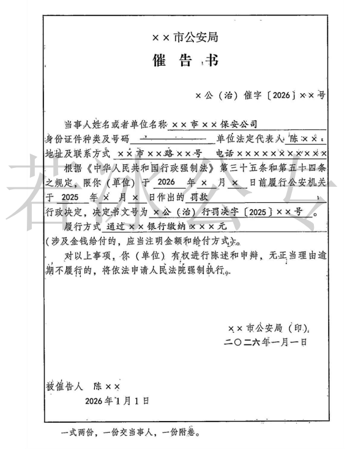
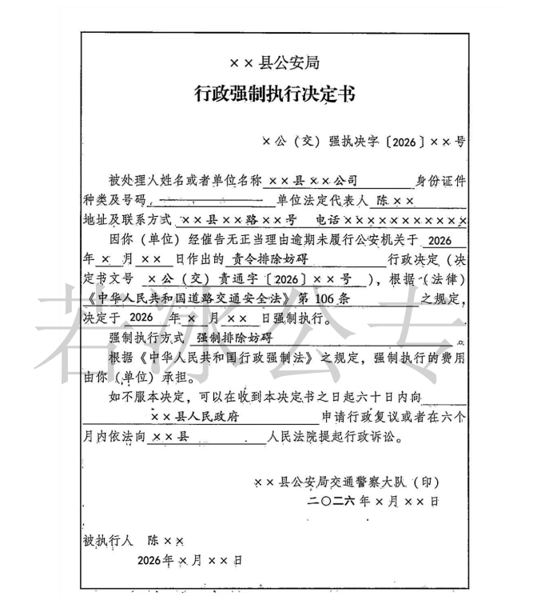

## **第一节 一般规定**

### **一、处罚决定执行方式**

1. 违法行为人**主动履行**； 

::: note 优点

省时省力，无需后续强制措施。

:::

2. 公安机关**强制执行**  
     
（1）代履行：普通代履行和立即代履行；`多交通领域`

（2）拍卖[+拍卖]变卖[+变卖]查封扣押的财物；

（3）加处罚款。

3. **公安机关申请人民法院强制执行**。

### **二、强制执行前的催告程序**

1、**催告前提**：公安机关在依法作出==强制执行决定==或者==申请人民法院强制执行==之前；

::: warning

==加处罚款==和==立即实施代履行==之前，不需要催告

:::

2、**催告形式**：书面形式——《催告书》；

3、**催告书内容**：

（1）履行行政处理决定的期限和方式；

（2）涉及金钱给付的，应当有明确的金额和给付方式；

（3）被处理人依法享有陈述权和申辩权；

4、**送达**：直接送达。

如果拒绝接受或者无法直接直送，通过==留置送达、邮寄送达、代为送达、电子送达、最后公告送达==兜底。

5、**听取陈述和申辩**

被处理人收到**催告书**后有权进行陈述和申辩，公安机关应当充分听取并记录、复核，被处理人提出的事实、理由或者证据成立的，公安机关应当采纳。

::: warning

对于催告，不可==行政复议==或==行政诉讼==。因为本身没有真正的去剥夺你的人身权利或者财产。

:::

6、**催告期**

（1）公安机关强制执行前催告，时间有办案民警自由裁量。

::: warning

普通代履行的第二次催告除外。

==特殊情况==下，催告期不满，也可以强制执行。《公安机关办理行政案件程序规定》第202条第2款：在催告期间，对有证据证明有转移或隐匿财物迹象的，公安机关可以立即依法作出强制执行决定。

:::

（2）公安机关申请人民法院强制执行前，公安机关应当催告被处理人履行义务，催告书送达`10日`内被处理人仍未履行义务的，公安机关可以向人民法院申请强制执行。

::: card

:::

7、**强制执行决定**

经催告，被处理人无正当理由逾期仍不履行行政处理决定，法律规定公安机关强制执行的，公安机关可以依法执行强制执行决定。强制执行决定以书面形式作出，并载明下列事项：

（1）被处理人的姓名或者名称、地址；

（2）强制执行的理由和依据；

（3）强制执行的方式和时间；

（4）==申请行政复议或者提起行政诉讼的途径和期限==；

（5）作出决定的公安机关名称、印章和日期。

::: card

:::

### **三、公安机关强制执行的方式**

 #### （一）**代履行**  

::: note 代履行

代履行是与加处罚款属于间接强制执行方式，是一种比较缓和的执行方式，其核心是义务的替代履行。对当事人而言，是作为义务转化为金钱给付义务。

:::

1、**适用前提**：

行政机关依法作出要求当事人履行排除妨碍、恢复原状等义务的行政决定，当事人逾期不履行，经催告仍不履行，其后果已经或者将危害交通安全、造成环境污染或者破坏自然资源的，行政机关可以代履行，或者委托没有利害关系的第三人代履行。

2、**代履行主体**：

（1）公安机关； 

（2）公安机关委托没有利害关系的第三人。

3、代履行费用承担：代履行的费用按照成本合理确定，由==当事人==承担。

4、代履行的方式：不得采用暴力、胁迫以及其他非法方式。

5、代履行应当遵守的规定：

（1）代履行前送达决定书，代履行决定书应当载明当事人的姓名或者名称、地址，代履行的理由和依据、方式和时间、标的、费用预算及代履行人；

（2）代履行==三日==前，催告当事人履行，当事人履行的，停止代履行；

（3）代履行时，作出决定的公安机关应当派员到场监督；

（4）代履行完毕，公安机关到场监督人员、代履行人和当事人或者见证人应当在执行文书上签名或者盖章。

::: important 完整流程

责令排除妨碍通知书—催告书（==意定=={.info}）—代履行决定书—催告书（==法定=={.info}）—实施代履行

:::

6、**立即实施代履行**——==情况紧急==

需要立即清理道路的障碍物，当事人不能清除的；或由其他紧急情况需要立即履 行的，公安机关可以决定立即实施代履行。当事人不在场的，公安机关应当在事后立即通知当事人，并依法作出处理。

#### （二）**拍卖变卖和加处罚款** 

1、将依法查封、扣押的被处罚人的财物拍卖或者变卖抵缴罚款。拍卖或者变卖的价款超过罚款数额的，余额部分应当及时退还被处罚人；(==需要催告，催告期民警自由裁量==)

2、不能采取第一项措施的，每日按罚款数额的==百分之三==加处罚款，加处罚款总额不得超出罚款数额。(==加处罚款无需催告==)

::: note

公安机关采取拍卖查封、扣押的财物抵缴罚款这一强制执行措施，必须同时符合以下条件：

一是公安机关实施查封、扣押必须有法律依据；

二是被查封、扣押的财物必须是被处罚人的合法财产；

三是被查封、扣押的财物必须不是非法财物或违法所得；

四是被处罚人未在行政处罚决定书规定的时间内到指定的银行缴纳罚款；

五是拍卖查封、扣押的财物必须符合《拍卖法》的有关规定。

来源《公安机关办理行政案件程序规定释义与实务指南》(2021 年版)第499页。

:::

**三** **、公安机关申请法院强制执行**

#### （一）**公安机关申请法院强制执行的条件**

1、**6个月**：不复议+不诉讼+不履行

2、**3个月**：公安机关催告当事人10日仍不履行+向法院申请强制执行。

#### （二）**向谁申请**

1、普通财物：基层人民法院。

2、不动产：不动产所在地法院。

#### （三）**强制执行的费用**：

当事人承担。

#### （四）**申请法院强制执行应提供的材料**

1、强制执行申请书；

::: note

强制执行申请书应当由作出处理决定的公安机关负责人签名，加盖公安机关印章，并注明日期。

:::

2、行政处理决定书及作出决定的事实、理由和依据；

3、当事人的意见及公安机关催告情况；

4、申请强制执行标的情况；

5、法律、法规规定的其他材料。

#### （五）**法院裁定不予受理或不予执行的救济措施**

公安机关对人民法院不予受理强制执行申请、不予强制执行的裁定有异议的，可以在==十五日==内向==上一级==人民法院==申请复议==。

### **四、公安机关强制执行过程中的和解制度**

1、**签订阶段**：强制执行过程中；

2、**协议主体**：公安机关和违法行为人；

3、**协议前提**：不损害公共利益和他人合法权益的情况下，自愿签订；

4、**协议内容**：约定分阶段履行；如果当事人采取补救措施，可以==减免加处==的罚款；

::: warning

罚金可以减免、罚款绝对不能减免。

:::

5、**违约后果**：公安机关==应当恢复强制执行==。

### **五、强制执行中止、终结、回转制度**

#### （一）**执行中止**

1、**情形**

（1）当事人暂无履行能力的；`穷`

（2）第三人对执行标的[+执行标的]主张权利，==确有理由的==；`有理`

（3）执行可能对他人或公共利益造成难以弥补的==重大损失==的；

（4）其他需要中止执行的。

2、**恢复执行**：中止情形消失。

3、**不再执行**：无明显社会危害+无能力履行+中止执行后满3年未恢复履行。`两无+三年
`
#### （二）**执行终结**

1、公民死亡，无遗产可供执行，又无义务承受人的；`人死财散`

2、法人或者其他组织终止，无财产可供执行，又无义务承受人的；`人死财散`

3、执行标的灭失的；`人死财散`

4、据以执行的行政处理决定被撤销的；`依据撤`

5、其他需要终结执行的。

#### （三）**执行回转**

1、**期间**

在==执行中==或者==执行完毕后==。

2、**原因**

据以执行的行政处理决定被撤销、变更，或者执行错误。

3、**法律后果**

应当恢复原状或者退还财物；

不能恢复原状或者退还财物的，依法给予赔偿。

 [+拍卖]:
	 价高者得

 [+变卖]:
	 直接以市场价出售

 [+执行标的]:
	 **执行标的**是指在执行程序中，法院为履行生效判决、仲裁裁决或其他有强制执行力的法律文件而针对债务人采取措施的对象