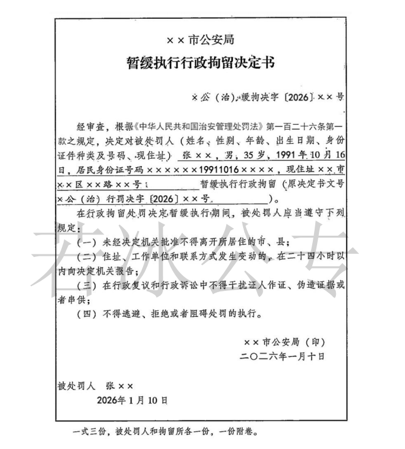

## **第二节 具体执行**


### **一、罚款的执行**——==15日内交、暂缓分期交、当场缴纳、强制执行==。

#### （一）**15日内交到指定银行**

1、**起点**：收到处罚决定书之日起，如1月1日收到，2日起算。

2、**谁交**：违法人、其近亲属，书面委托公安机关缴纳。

3、**交到**：指定银行 。

4、**银行**：出具发票，上缴国库。

#### （二）**暂缓或分期缴纳**

1、**条件**：违法人确有经济困难；

::: note 经济困难

所谓有经济困难，是指如果被处罚人如期缴纳罚款，==其基本生活可能会受到较大影响，甚至得不到保障==。

:::

2、**程序**：被处罚人申请——作出处罚决定的公安机关批准


::: note 被处罚人申请

一般情况下，应当要求被处罚人提供书面申请。当然，为便民，被处罚人口头提出暂缓或分期缴纳罚款申请的，公安机关应当接受，并将其提出的具体理由和延期缴纳罚款的期限或者分期缴纳罚款的计划记录在案，由申请人和办案民警签名确认。

来源《公安机关办理行政案件程序规定释义与实务指南》(2021年版)第494页。


这里公安机关只能==被动==。


:::

3、**结果**：可以暂缓或分期缴纳。

#### （三）**当场缴纳**

##### 1、**条件**

（1）对违反**治安管理**，被处以==200元以下罚款==和对违反**交通管理**的==行人、乘车人和非机动车驾驶人=={info}处50元以下罚款，被处罚人书面表达==无异议==的；


::: note 50元以下罚款

根据《道路交通安全法》第89条“行人、乘车人、非机动车驾驶人违反道路交通安全法律、法规关于道路通行规定的，处警告或5元以上50元以下罚款”。本条所称“对违反交通管理的行人、乘车人和非机动车驾驶人处罚款”,是指5元以上50元以下罚款。

来源《公安机关办理行政案件程序规定释义与实务指南》(2021年版) 第481页。

:::


::: warning

当场缴纳包括==违反治安管理的人，违反交通管理的行人、乘车人和非机动车驾驶人==，==不包括机动车驾驶人=={.danger}。

:::

（2）对==违反治安管理、交通管理以外==的违法行为人==当场处100元以下罚款==的；

（3）在边远、水上、交通不便地区、旅客列车上或者口岸，被处罚人向指定银行缴纳罚款确有困难，经被处罚人书面提出的；

（4）被处罚人在当地没有固定住所，不当场收缴事后难以执行的。


::: note 无固定住所

被处罚人在当地没有固定住所：可以理解为被处罚人在作出行政处罚决定的公安机关所在的市、县内没有购买或者自建的拥有所有权的房屋和租住亲友拥有使用权的房屋，以及居住时间已经超过或者将会超过一段较长时间的住所，但不包括临时租住、借住的房屋、宾馆、饭店。

那么，如何认定被处罚人在当地没有固定住所呢？

笔者认为，应当结合被处罚人在当地是否有稳定工作、是否有长期就读的学校、是否有稳定收入等情况进行综合判断。

来源《公安机关办理行政案件程序规定释义与实务指南》(2021年版)第485页。

:::

::: note 法条

《行政处罚法》第六十八条 依照本法第五十一条的规定当场作出行政处罚决定，有下列情形之一，执法人员可以当场收缴罚款：

（一）依法给予一百元以下罚款的；

（二）不当场收缴事后难以执行的。

第五十一条 违法事实确凿并有法定依据，对公民处以二百元以下、对法人或者其他组织处以三千元以下罚款或者警告的行政处罚的，可以当场作出行政处罚决定。法律另有规定的，从其规定。

:::

##### 2、**出具收据**

（1）应当出具省级以上财政部门统一制发的罚款收据；

（2）对不出具省级以上财政部门统一制发的罚款收据的，被处罚人有权拒绝缴纳罚款 。

##### 3、**上缴罚款期限**

（1）警察==2日内==交单位；

::: note 警察2日内交单位

《公安机关办理行政案件程序规定》第216条：人民警察应当自收缴罚款之日起==二日内==，将当场收缴的罚款交至所属公安机关；在水上当场收缴的罚款，应当自抵岸之日起==二日内==将当场收缴的罚款交至其所属公安机关；在旅客列车上当场收缴的罚款，应当自返回之日起==二日内==将当场收缴的罚款交至所属公安机关。

**公安机关**应当自收到罚款之日起==二日内==将罚款缴付指定的银行。 

:::

（2）公安局==2日内==交银行。

#### （四）**强制执行**

1、将依法查封、扣押的被处罚人的财物拍卖或者变卖抵缴罚款。拍卖或者变卖的 价款超过罚款数额的，余额部分应当及时退还被处罚人；(需要催告)

::: note

公安机关采取==拍卖查封、扣押的财物抵缴罚款==这一强制执行措施，必须同时符合以下条件： 

一是公安机关实施查封、扣押必须有法律依据；

二是被查封、扣押的财物必须是被处罚人的合法财产；

三是被查封、扣押的财物必须不是非法财物或违法所得；

四是被处罚人未在行政处罚决定书规定的时间内到指定的银行缴纳罚款；

五是拍卖查封、扣押的财物必须符合《拍卖法》的有关规定。

来源《公安机关办理行政案件程序规定释义与实务指南》(2021年版)第499页。

:::

2、不能采取第一项措施的，每日按罚款数额的==百分之三==加处罚款，加处罚款总额不得超出罚款数额。(无需催告)

3、依法加处罚款超过三十日，经催告被处罚人仍不履行的，作出行政处罚决定的公安机关可以按照本规定第二百零六条的规定向所在地有管辖权的人民法院申请强制执行 。

::: note 

《公安机关办理行政案件程序规定》第206条：当事人在法定期限内不申请行政复议或者提起行政诉讼，又不履行行政处理决定的，法律没有规定公安机关强制执行的，作出行政处理决定的公安机关可以自期限届满之日起三个月内，向所在地有管辖权的人民法院申请强制执行。 ==因情况紧急，为保障公共安全，公安机关可以申请人民法院立即执行。强制执行的费用由被执行人承担==。

:::

### **二、拘留的执行**

#### （一）**本地执行**

1、由作出决定的公安机关送达==拘留所==执行。

2、对抗拒执行的违法人，==可以使用约束性警械==。

#### （二）**异地执行**

##### 1、**条件**

对被决定行政拘留的人，在异地被抓获或者具有其他**有必要**在异地拘留所执行情形的。


::: note

所谓有必要，是指在异地拘留所执行有利于被拘留人改过自新，有利于节约执法成本等情形，如在被拘留人所在地执行拘留，有利于家属探望和感化被拘留人。

:::

##### 2、**程序**

经异地拘留所主管公安机关批准，可以在异地执行。

#### （三）**作出拘留决定不执行拘留**

::: tip

这里的情形看的是执行拘留时是否满足下列条件

:::


1、已满**14周岁**不满**16周岁**，；

2、已满**16周岁**不满**18周岁**，初次违法治安管理或者其他公安行政管理的。但是曾被收容教养、被行政拘留依法不执行行政拘留或者曾因实施扰乱公共秩序、妨害公共安全、侵犯人身、财产权利，妨害社会管理的行为被人民法院判决有罪的除外；

3、已满**70周岁**以上的；

4、**孕妇**或者正在哺乳**自己婴儿**的妇女。

**前款第一项、第二项、第三项规定的行为人违反治安管理情节严重、影响恶劣的，或者第一项、第三项规定的行为人在一年以内二次以上违反治安管理的，不受前款规定的限制。**


#### （四）**暂缓执行行政拘留**


::: important 新法

**第一百二十六条**　被处罚人不服行政拘留处罚决定，申请行政复议、提起行政诉讼的，**遇有参加升学考试、子女出生或者近亲属病危、死亡等情形的，**可以向公安机关提出暂缓执行行政拘留的申请。公安机关认为暂缓执行行政拘留不致发生社会危险的，由被处罚人或者其近亲属提出符合本法第**一百二十七**条规定条件的担保人，或者按每日行政拘留二百元的标准交纳保证金，行政拘留的处罚决定暂缓执行。  
  
**正在被执行行政拘留处罚的人遇有参加升学考试、子女出生或者近亲属病危、死亡等情形，被拘留人或者其近亲属申请出所的，由公安机关依照前款规定执行。被拘留人出所的时间不计入拘留期限。**

:::

##### 1、**条件**

（1）**主体条件**：==被处罚人申请==；

::: warning

只有本人。

:::

（2）**时间条件**：公安机关做出拘留==决定之后，执行完毕之前==；

（3）**救济条件**：被处罚人不服决定提起了行政复议或行政诉讼；

::: warning

只需要提出行政复议、行政诉讼的申请，不要求复议案件和诉讼案件的立案。

:::

（4）**担保条件**：提供担保人**或者**提供保证金；

（5）**实质要件**：公安机关进行审查认为==不致发生社会危险==，应当在收到申请之时起==24小时=={.warning}内作出决定；社会危险指的是暂缓执行行政拘留后可能逃跑的或者有其他违法犯罪嫌疑，正在被调查或侦查的。

##### 2、**担保人的条件、义务、处罚和重新担保**

（1）**条件**：

- 与本案无牵连；
- 享有政治权利，人身自由未受到限制或剥夺；
- 在当地有==常住户口和固定住所==；
- ==有能力==履行担保义务。

::: warning 与刑事案件中取保候审保证人条件区别

- 与本案无牵连；
- ==有能力==履行保证义务；
- 享有政治权利，人身自由未受到限制；
- 有固定的==住处==和==收入==。

:::

（2）**义务**：

- ==监督==被担保人遵守规定；
- 发现被担保人伪造证据、串供或者逃跑，及时向公安机关==报告==。

（3）**处罚**

第一、不履行担保义务，致使被担保人逃避拘留执行的，对担保人处以==3000元以下==罚款，并对被担保人恢复执行拘留。

第二、履行义务，但被担保人仍逃避拘留执行的，或者被处罚人逃跑后，担保人积极帮助公安机关抓获被处罚人的，==可以从轻或者不予行政处罚=={.danger}。

::: warning

唯一跳过减轻的处罚规则！

:::

（4）**救济**：

对担保人处以==2000元以上==罚款，处罚前可以要求==听证==，处罚后可以申请行政复议或行政诉讼。

（5）**重新担保**：

担保人不愿继续担保或丧失担保条件的，行政拘留的决定机关应当责令被处罚人重新提出担保人或者缴纳保证金。

不提出担保人又不交纳保证金的，行政拘留的决定机关==应当==将被处罚人送拘留所执行。

##### 3、**保证金**

（1）标准：一天200元；注意：担保的是==尚未执行的行政拘留的时间==。

（2）如何交：交银行；交公安。 (银行**非营业期间**，公安机关可以先行收取，并在收到保证金后的==三日内==存入指定的银行账户)

（3）退还保证金：拘留处罚被撤销或者开始执行时，公安机关应当退还保证金。

（4）没收保证金：被决定行政拘留的人逃避行政拘留处罚执行的，由决定行政拘留的公安机关作出没收或者部分没收保证金的决定，行政拘留的决定机关应当将被处罚人送拘留所执行。

（5）被处罚人不服没收保证金决定的救济权：==可以申请行政复议或提起行政诉讼==。

##### 4、**暂缓执行期间应当遵守的规定**

（1）在暂缓执行行政拘留期间，被处罚人应当遵守下列规定：

第一、未经==决定机关批准==不得离开所居住的市、县；

::: warning

这里的市是不设区的市，也就是县级市。

:::

第二、住址、工作单位和联系方式发生变动的，在==二十四小时以内==向决定机关报告；

第三、在行政复议和行政诉讼中不得干扰证人作证、伪造证据或者串供；

第四、不得逃避、拒绝或者阻碍处罚的执行。

（2）在暂缓执行行政拘留期间，公安机关应当遵守的规定：不得妨碍被处罚人依法行使行政复议和行政诉讼权利。


::: card





:::

#### （五）**同时被决定行政拘留和戒毒的违法人员的执行**

1、**顺序**：

**一般情形**：先执行行政拘留，行政拘留执行完毕后，再执行社区戒毒或强制隔离戒毒。

**特殊情形**：拘留所不具备戒毒治疗条件的，可由公安机关管理的强制隔离戒毒所代为执行行政拘留。

2、**强制隔离戒毒期限连续计算**。“期限连续计算”，是指强制戒毒自作出决定之日起计算，不因执行行政拘留而中断。

3、**社区戒毒的期限单独计算**。自到社区报到之日起起算。（与强制隔离戒毒不同）


::: warning

注意：行政拘留属于行政处罚，而社区戒毒和强制隔离戒毒不属于行政处罚，二者性质不同，不能互相折抵。

所以这里只是说连续计算。

:::

### **三、戒毒**

#### （一）**方式有四**

自愿戒毒、社区戒毒、强制隔离戒毒、社区康复

#### （二）**自愿戒毒**

1、国家鼓励吸毒成瘾人员自行戒除毒瘾。吸毒人员可以==自行==到戒毒医疗机构接受戒毒治疗；

2、对自愿接受戒毒治疗的吸毒人员，公安机关对其原吸毒行为==不予处罚==；

3、登记参加戒毒药物维持治疗的戒毒人员信息应当==及时报公安机关备案==。

#### （三）**社区戒毒**

1、**决定机关**：==县级人民政府公安机关、设区的市人民政府公安机关==可以责令其接受社区戒毒，并出具责令社区戒毒决定书；

2、**执行机关**：==乡镇政府、街道办事处==

3、**期限**：==3年==；社区戒毒人员应当自收到责令社区戒毒决定书之日起15日内到社区戒毒执行地的乡镇政府、街道办事处报到，戒毒期限自报到之日起计算。

#### （四）**强制隔离戒毒**

1、**决定机关**：==县级以上人民政府公安机关==作出强制戒毒决定：

::: important

在执行隔离戒毒前送达被决定人，并在送达后的24小时内通知家属、单位、户籍派出所。

:::

2、**适用情形**

第一、拒绝接受社区戒毒的；

第二、在社区戒毒期间吸食、注射毒品的；

第三、严重违反社区戒毒协议的；

第四、经社区戒毒、强制隔离戒毒后==再次==吸食、注射毒品的；

第五、对于吸毒成瘾严重，通过社区戒毒难以戒除毒瘾的人员，公安机关可以直接作出强制隔离戒毒的决定；

第六、吸毒成瘾人员自愿接受强制隔离戒毒的，经公安机关同意，可以进入强制隔离戒毒所戒毒。

3、**不适用强制戒毒的情形**

第一、**绝对不适用**：怀孕或正在哺乳自己==不满一周岁婴儿==的妇女；

第二、**可以不适用**：==不满十六周岁==的未成年人。

4、**期限**

第一、强制戒毒的期限为==两年=={.warning}；

第二、执行一年后，经诊断评估戒毒情况良好的戒毒人员，经强戒决定机关批准，可以提前解除；

第三、强戒期满前，经诊断评估戒毒情况不好的戒毒人员，经强戒决定机关批准，可以延长强戒期限，最长延长一年；

第四、 对于被解除强戒的人员，强戒决定机关可以责令其接受不超过三年的社区康复。

5、**公安强戒和司法强戒的衔接**

被强戒的人员在公安机关的强戒所执行戒毒==3个月至6个月=={.info}后，转至司法行政部门的强戒所继续执行强制隔离戒毒。


### **四、思维导图**

```markmap
---
markmap:
  colorFreezeLevel: 2
---

# 处罚决定的执行

## 执行方式
### 主动执行
### 被动执行
#### 公安机关强制执行
#### 人民法院强制执行：6+3
##### 6个月内：不复议、不诉讼、不履行
##### 3个月内：催告+申请强制执行

## 催告
### 强制执行前要催告，例外：代履行，加处罚款
### 催告要是书面形式
### 对于催告，被处理人依法享有陈述权和申辩权
### 催告时间：靠定和法定

## 代履行
### 对象：交通领域
### 代履行主体：公安机关；第三方
### 代履行费用：当事人承担
### 代履行的方式
#### 立即实施代履行：前提：是需要立即清除道路的障碍物；注意一不需要催告
- 责令排除妨碍、恢复原状等
- 催告
- 代履行决定书
- 代履行前三日，再次催告
- 实施代履行
#### 普通代履行：两次催告

## 罚款的执行
### 1、15日内交到指定银行
### 2、拍卖、变卖查封扣押的物品：需要催告
### 3、加处罚款：无需催告
### 4、向法院申请强制执行：需要催告

## 强制执行中的和解
### 前提：不损害公共利益和他人合法权益
### 达成协议：公安机关和当事人-约定分阶段履行或减免加处的罚款
### 不履行协议：恢复强制执行

## 中止执行
### 情形
#### 1、当事人无履行能力：穷、病、不可抗力
#### 2、第三人对执行标的主张权利，确有理由的
#### 3、执行可能对他人或公共利益造成难以弥补的重大损失
### 不再执行
#### 1、无明显社会危害
#### 2、当事人确无履行能力
#### 3、3年未恢复执行

## 终结执行
### 人死
### 财散
### 标的灭
### 依据撤

## 执行回转
### 决定被撤
### 决定被改
### 执行错误


```


### **五、真题**

:::: card-grid
::: card title="题目 1" icon="svg-spinners:blocks-shuffle-3"


<Badge type="warning" text="单选" />某中学学生唐某（15 周岁，无前科）放学后，在校园门口堵住同校低年级学生李某（13 周岁），向其强行索要零花钱。李某拒绝后被唐某拳打脚踢，造成轻微伤，李某回家后报警。公安机关不宜采取的处理方式是：（ ）（2020 年公安联考第 29 题）  

A. 要求唐某家长对李某作出赔偿  
B. 调解时通知双方监护人到场  
C. 对唐某处以治安拘留不执行  
D. 责令唐某家长对其严加管教


**答案：!!A!!**

:::

::: card title="题目 2" icon="svg-spinners:blocks-shuffle-3"

<Badge type="warning" text="单选" />李某携带 3500 元参与赌博，被公安机关当场查获，被处 15 日行政拘留，并处 3000 元罚款。公安机关应告知李某享有的权利，但不应包括的是：（ ）（2020 年公安联考第 30 题）  


A. 可要求举行听证  
B. 可申请暂缓执行罚款  
C. 可申请行政复议和暂缓执行拘留  
D. 可要求以其被收缴的赌资冲抵罚款

**答案：!!D!!**


:::


::: card title="题目 3" icon="svg-spinners:blocks-shuffle-3"

<Badge type="warning" text="单选" />甲市居民周某因在乙市故意伤害他人，被乙市北区公安分局处十五日拘留，并处一千元罚款。周某不服处罚决定，提起行政诉讼并提出暂缓执行拘留的申请。经审查，该公安分局认为暂缓执行拘留不致发生社会危险，要求周某提供担保。下列周某的做法符合法律规定的是：（ ）（2019 年公安联考第 34 题）  
A. 周某提出符合条件的担保人并按规定交纳保证金  
B. 周某提出由其到乙市出差的弟弟担任担保人  
C. 周某向北区公安分局交纳四千元保证金  
D. 周某让其近亲属向北区公安分局交纳三千元保证金

**答案：!!D!!**


:::


::: card title="题目 4" icon="svg-spinners:blocks-shuffle-3"

<Badge type="warning" text="单选" />林某某是歌星张某的粉丝，偶然得知张某和其住在同一个小区，于是开始跟踪张某，拍摄张某生活隐私照片。张某得知后，向公安机关报案，公安机关依法扣押了林某某的一台电脑、一部相机。经查，林某某违法行为属实，公安机关对林某某处 3 日拘留并罚款 500 元，林某某逾期未缴纳罚款，以下说法不正确的是：（ ）（2018 年公安联考第 15 题）  
A. 公安机关让林某某单位从其工资中划出 500 元，缴纳罚款  
B. 公安机关将扣押的电脑和手机拍卖或变卖抵缴罚款  
C. 公安机关每日按罚款数额的百分之三追加罚款，追加罚款额总额不超过 500 元  
D. 公安机关向有管辖权的人民法院申请从林某某的银行账户中划出 500 元，作为罚款

**答案：!!A!!**


:::


::: card title="题目 5" icon="svg-spinners:blocks-shuffle-3"

<Badge type="warning" text="单选" />被公安机关行政拘留的朱某某拒不提供其家属联系方式，致使无法通知其家属，根据有关规定，公安机关可以不予通知。上述情况应当在以下哪一法律文书书中注明：（ ）（2017 年公安联考第 29 题）  
A. 处罚告知笔录  
B. 决定书附卷联  
C. 家属通知书  
D. 拘留回执

**答案：!!B!!**


:::

::::